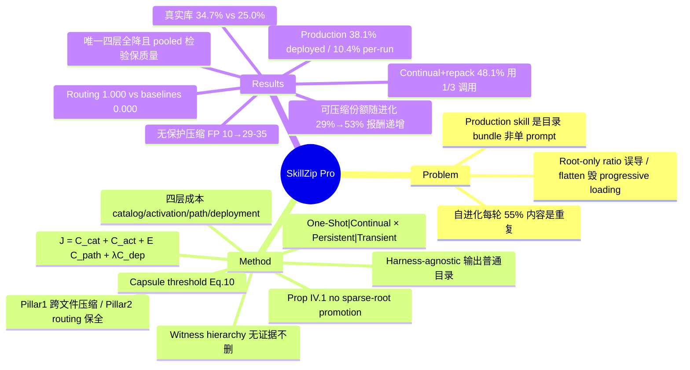

## Summary

[[2608-SkillZip]] 的续作：把 evaluation-free skill 压缩从单个 SKILL.md 扩展到 production agent 实际使用的**渐进加载 skill bundle 目录**（root + references + subskills + scripts + schemas），核心论点是单一压缩率具有误导性——必须把 catalog / activation / path / deployment 四层成本分开度量并联合优化（typed resource graph 上的约束目标 Eq. 7），同时用 routing lock + 独立 disk audit 保证每个分支仍可达、每个 public entry 仍可独立调用。三 benchmark 上它是唯一同时削减四层成本且 pooled 配对检验保质量的压缩器（102 任务，+0.010，95% CI [−0.029, +0.059]）；在真实内容审核 production skill 上，witnessed 压缩去除 38.1% deployed bundle 与 10.4% pooled per-run tokens，而无保护的 71.4%/75.8% 压缩让 accuracy 从 88% 跌到 70%/62%（false positives 10→29–35）。

## Problem & Motivation

Prototype 可以把 skill 当一个 prompt，但 production skill 是目录：短 root 声明何时适用，references/subskills 装分支知识，scripts 做确定性操作，schemas 约束输入输出；agent 渐进加载——catalog 元数据在选择前可见、root 在激活后加载、辅助文件只在执行路径需要时打开。这改变了压缩目标：root-only 压缩可以报出漂亮的 ratio 却不动大部分部署文本，甚至把罕见分支细节搬进 always-loaded root、让每次调用都变贵；flatten 拼接修复了记账却摧毁 progressive disclosure 边界。自进化 agent 使问题更大——重复同时在文件内和跨分支增长，而 placement 决定代价（把两个罕见分支共用的内容上提到 root 是向所有任务收费）。

前作 SkillZip 只处理单文档、无法建模 references / subskills / 渐进加载成本；SkillReducer 依赖 evaluation rollouts；generic prompt compressor 把 skill 当扁平文本。本文的更强约束是 **harness-agnostic**：输出必须是普通目录，用现有 file reader、相对路径和加载行为，不需要 resolver 或 runtime 协议。

## Method

**形式化（Sec III）**。skill 建模为 rooted directory graph B=(V,E,r)，边记录 reference 的 guard 与 source span；resolver 刻意保守（只认 Markdown link、显式路径、声明的 subskill entry，不发明加载语义）。四个 loading layer：catalog / activation / path / deployment。**Entry contract** 由作者或 catalog 声明（compressor 不推断）：private（仅经 root 到达）/ public（可独立直接调用）/ conditional（带声明 host context 才可直接用），public entry 的 independence Ind(e)=coverage×discoverability 是硬部署约束。每个文本节点抽取 typed contract（interface、workflow、tools、rules、outputs、evidence、provenance、locked residuals）；可执行与二进制 artifact 一律 locked（byte-identical）。目标函数 **J = C_cat + C_act + E_π C_path + λ·C_dep**（λ=0.05），subject to bundle faithfulness；四层成本全部单独报告，负节省不裁剪。Persistent 与 Transient 两种 lifecycle 的七类量分开记账、从不平均。

**理论（Sec IV）**。Prop IV.1（no sparse-root promotion）：访问概率 p<1 的内容进 root 要付 (1−p)·d_x 期望路径成本，全局去重降存储却抬高常见请求——shared module 必须放在需要它的分支的 activation scope 内。Prop IV.2（capsule threshold）：guarded 长分支移入 on-demand capsule 当 (1−p_g)·d_b > (1+λ)·d_g；guard 只能来自显式 heading/条件句，从不推断。Host entailment 只在有签名的 typed environment contract（exact type/key/value/scope match + digest 绑定）时删除环境已保证的文本，缺省是 no-op。**Witness hierarchy W1≻W2≻W3**：每次删除必须恰好携带一个 witness——W1 字面包含（可逆）、W2 确定性 coverage gate、W3 冻结 checker model（temperature 0）的 entailment 判定（仅限无 prohibition/output/exemption 标记的 evidence-class 单元，逐条留 log，两个候选不得互为对方的 witness）；无 witness 的删除无论预计节省多大一律拒绝。Interface contract（output schema、label whitelist、worked examples）是原子单元，必须连续、逐字重现，打散即不算覆盖。

**两根支柱（Sec V）**。Pillar 1（跨文件压缩产生节省）：host-entailment pruning、activation-scoped sharing（重复文本入 shared module 但绝不上提 root）、conditional capsules。Pillar 2（routing 保全使节省可部署）：routing table 锁为一等单元不可改写、reference 行经渲染保留、发布前独立 pass 重读落盘目录验证从 root 可达每个文件——失败则整体拒绝、原样发布。**模式正交**：One-Shot（全量重建）vs Continual（patch 原样落盘为语义 fallback，只重抽 affected closure，Absorb/Refine/Extend/Refactor 四操作 + 触发式 global repack；continual 失败发布 raw patched bundle 而非旧压缩版——压缩可以丢节省但不能丢 patch）× Persistent（改写 shipped bundle，动 public entry 须过 multi-entry audit）vs Transient（canonical bundle byte-identical，按 (bundle digest, entry, env digest) 缓存 per-run execution view）。audit 在独立进程重建两侧 graph、重哈希每个节点，J 不降不发布。

## Key Results

Setup：BFCL-v4 / LiveMathematicianBench / SpreadsheetBench，bundle 由 SkillOpt 按 task class 自进化生成再由 deterministic builder 重放成分支（grown track）；主表 executor 为 Qwen3.6-Plus。Baseline：No Skill / Human Skill / Evolved Bundle（未压缩）/ Root-only SkillZip / Flat-concat SkillZip / SkillReducer（**禁用其 evaluation-based candidate selection 以匹配 no-rollout 预算**）/ Expert Progressive（手工结构感知）。

- **主结果（Table II–IV）**：SkillZip Pro One-Shot 是唯一四层全降的方法——shipped +19.7%、always-loaded +7.3%、per-run avg +14.3%、per-run worst +10.8%；pooled 102 held-out tasks 配对 bootstrap（10,000 resamples、预先固定 −0.05 margin），它是唯一保质量的 compressor（+0.010, [−0.029, +0.059]），root-only / flat-concat / SkillReducer / 甚至 Expert Progressive 全部不达标。
- **单一 ratio 的误导性被逐一坐实**：flat-concat 报 +63.8% shipped 但真实库上只保留 0.2% instruction lines（ratio 主要是删除）；root-only 看似无害但 routing 保留 0.000（分支在盘上却不可选中）；SkillZip Pro routing 保留 1.000、知识保留 0.986。
- **真实 evolved libraries**（17 files、15 rounds、约 20k tokens、79–84% 重复）：发布结果的 2/3 库上去除 34.7% shipped vs 最强保真 baseline Expert Progressive 的 25.0%，且只有它同时改善三层（Expert Progressive 把重复全并进 root-linked 文件，always-loaded 反而 −2.9%）；第三个库候选未改进 objective，never-inflate check 原样重发。
- **Continual（13 真实 rounds）**：Continual+repack shipped +48.1%、per-run +28.2%，每轮 3.31 次调用（每轮全量 rebuild 为 10）；不 repack 则掉到 +2.7%/+0.8%——跨轮冗余必须靠周期性 repack 回收。
- **开启时机单调**：round 1 开压缩省全流 carried tokens 40.8%，round 13 才开只省 18.5%；已支付的轮次无法追回（Insight 2）。
- **为什么节省会复利（VI-P，本文最有普适价值的测量）**：每轮新增内容 55%±3% 与既有文本重复且跨轮稳定；可移除份额随库龄从 29%（round 2）升到 53%（round 15）仍在爬——压缩器对进化库是报酬递增而非递减；reuse 重尾集中，7 个 shared module 中 top-2 占 47%。
- **开销**：One-Shot 平均 0.21 s、0 model calls、0 tokens、0 rollouts、0.02 GB。
- **跨模型迁移**：同一压缩 bundle 不改动换 executor，qwen3.7-max 0.541→0.619、qwen3.6-plus 0.608→0.656 提升；kimi-k2.6 0.611→0.574 下降、irrelevant load 0.077→0.287 上升——结构可移植但加载效率依赖 executor 对 routing 的解释。
- **Ablation**：scoped sharing 贡献大部分 shipped 节省（去掉后 +21.1%→+7.9%）；capsules 用少量存储换更低 per-run（去掉后 shipped 升至 +26.9% 但 per-run 15.8%→11.8%），与 Prop IV.2 预测一致；global sharing（unsafe 对照）J 反降 −0.166、always-loaded −84.9%、1 文件不可达，坐实 Prop IV.1；λ 扫 0→1 两个数量级决策不变。
- **Multi-entry bundle**：audited persistent disk 0.884、per-run 404→352、routing 与 public independence 全 1.000；关掉 multi-entry audit 后 disk 更小（0.845）但 public subskill 被 rename——live rollout 中 discoverability 与 standalone success 直接归零。Transient view root entry 省 24.8%、leaf references <2%；cold build 150–245 ms、warm <2 ms。
- **Production（内容审核服务，中文 bundle，root 约 20k tokens、平均约 13 reasoning rounds、100 任务）**：无保护压缩 71.4%/75.8% 使 accuracy 88%→70%/62%、FP 10→29–35（损失集中于 exemption rules——"何时不该 flag"）；witness 逐级加码 13.8%（W1/W2）→32.7%（+受限 W3）→38.1%（W3 进 root），最终 pooled per-run −10.4%（n=200），accuracy 89.00%（同 session uncompressed baseline 92.00%/91.00%）。静态 loading 模型预测约 3% per-run，实测 6–11%——root 每 token 被约 13 轮 reasoning 反复处理，删 root 1 token 约值 5–6 倍 runtime tokens（Insight 5）。

## Evidence Ledger

| Claim ID | Claim | Type | Source locator | Evidence excerpt | Status |
|:--|:--|:--|:--|:--|:--|
| C1 | 三 benchmark + Qwen3.6-Plus 主表 + SkillOpt 生成 bundle；SkillReducer 被禁用 eval-based selection | benchmark-setting | Sec VI-B/C/D | "we disable its evaluation-based candidate selection and retain only its compression stage" | source-verified |
| C2 | 四层节省 +19.7%/+7.3%/+14.3%/+10.8%，唯一四层全降且保质量 | number | Table III, Sec VI-G | "the only method that cuts all four layers at once while matching the uncompressed bundle" | source-verified |
| C3 | pooled 102 tasks 配对 bootstrap，唯一保质量 compressor（+0.010, [−0.029,+0.059]） | comparison | Table IV, Sec VI-G | "Pooled over all 102 held-out tasks… 10,000 bootstrap resamples… the only compressor that keeps quality" | source-verified |
| C4 | routing 保留 1.000 vs root-only/flat-concat 0.000；flat-concat 真实库只留 0.2% 行 | number | Sec VI-H/E, Table V/VI/IX | "both baselines preserve 0.000 of the original routing pairs, whereas SkillZip Pro preserves 1.000" | source-verified |
| C5 | 真实库 17 files/15 rounds/~20k tokens/79–84% 重复；发布库去 34.7% vs 25.0%；第三库拒发 | number | Sec VI-M, Table IX | "removes 34.7% of shipped tokens versus 25.0% for the strongest faithful baseline" | source-verified |
| C6 | Continual+repack +48.1%/+28.2%、3.31 calls/round vs rebuild 10；no-repack +2.7%/+0.8% | number | Sec VI-N, Table X | "Continual + repack +48.1% / +28.2% / 3.31 calls" | source-verified |
| C7 | round-1 开启省 40.8% carried tokens，round-13 仅 18.5%，单调 | number | Sec VI-O, Table XI | "Switching on at the first round saves 40.8%… waiting until round 13 recovers only 18.5%" | source-verified |
| C8 | 每轮新增 55%±3% 重复；可移除份额 29%→53%；top-2/7 modules 占 47% reuse | number | Sec VI-P, Fig. 9 | "55%±3% of the content added in each round overlaps… from 29% at round 2 to 53% at round 15" | source-verified |
| C9 | J=C_cat+C_act+E C_path+λC_dep（λ=0.05）；Prop IV.1/IV.2；删除必须携带 W1≻W2≻W3 witness | causal-mechanism | Sec III-D Eq.7, Prop IV.1/IV.2, Sec IV-D Eq.12 | "Any deletion that cannot attach a witness is refused, whatever the predicted saving" | source-verified |
| C10 | 压缩开销 0.21 s、0 model calls、0 tokens、0 rollouts、0.02 GB | number | Table XII | "SkillZip Pro (One-Shot) 0.21 / 0 / 0 / 0 / 0.02" | source-verified |
| C11 | 迁移：两个 Qwen 提升（0.541→0.619、0.608→0.656），kimi-k2.6 降（0.611→0.574，irrel. load 0.077→0.287） | number | Sec VI-R, Table XIII | "task success decreases from 0.611 to 0.574 and irrelevant loading increases from 0.077 to 0.287" | source-verified |
| C12 | ablation：−sharing +21.1%→+7.9%；−capsules shipped +26.9% 但 per-run 降；global sharing J −0.166、1 文件不可达；λ 扫描不变 | number | Sec VI-S, Table XIV, Fig. 10 | "Global sharing… drives J below the source (−0.166), and makes one file unreachable" | source-verified |
| C13 | multi-entry：audited persistent 0.884/404→352/全 1.000；无 audit 0.845 但 rename public entry、discoverability 0.000 | number | Sec VI-U1/U2, Tables XVII–XIX | "renames the public subskill, reducing its effective independence to 0.500" | source-verified |
| C14 | production：v3 去 38.1% deployed、10.4% per-run（n=200）、accuracy 89.00 vs 同 session 92.00/91.00；无保护 71.4/75.8% 致 70%/62%、FP 10→29–35 | number | Sec VI-V, Table XXIII | "false positives increase from 10 to 29–35… most losses occur in exemption rules" | source-verified |
| C15 | witness 强度定上限 13.8%→32.7%→38.1%；静态模型预测 ~3% 实测 6–11%；root token 值 5–6× | number | Sec VI-V, Insight 5 | "removing one root token saves roughly five to six times as many measured runtime tokens" | source-verified |
| C16 | 代码公开于 GitHub（URL 实测 HTTP 200 可达，未验内容）；CC BY 4.0；Alibaba Group + Zhejiang University | license-code | Abstract, 页头 License 行 | "Available at: https://github.com/yutou520131/SkillZip-Pro" | source-verified |
| C17 | vs 前作：单文档→typed resource graph；新增两 Pillar 与 One-Shot/Continual × Persistent/Transient 四模式；harness-agnostic | sota-novelty | Sec I/II/V, Table I | "SkillZip compiles one SKILL.md, whereas SkillZip Pro compiles a progressively loaded directory as a typed resource graph" | source-verified |

## Strengths & Weaknesses

**亮点**

- **问题升级选得准**：从"压缩一个 prompt"升到"压缩一个 progressively loaded resource graph"，并证明单一压缩率在此 setting 下系统性误导——root-only 看似无害却让 routing 归零、flat-concat 的 63.8% 节省是删掉四分之三的 skill。强制 ratio 与 fidelity 并排报告（Table III+IV 必须一起读）是方法论上的诚实设计。
- **VI-P 的机制测量超越方法本身**：每轮新增内容 55% 是重复、可压缩份额随进化递增（29%→53%）、reuse 重尾集中——这解释了为什么压缩应内置于 evolution loop 而非事后清理，对任何 skill-accumulating agent 系统都可迁移。
- **Witness hierarchy 是干净的安全框架**：删除必须携证据、witness 强度显式决定安全压缩上限（13.8%→32.7%→38.1%），production 消融把每个 safeguard 的载荷量化到位（去 entry labels→independence 0.500；去 audit→public entry 不可发现）。
- **Production 证据罕见且报告诚实**：真实审核服务、同 session 配对测量、静态模型预测（3%）与实测（6–11%）的缺口被明确报告并归因于 root 被多轮 reasoning 反复处理；失败模式保守（never-inflate 拒发第三个库、continual 失败发 raw patch 不丢学到的行为）。

**局限**

- **abstract 的 "no quality loss" 读强了**：production v3 config accuracy 89.00% 对同 session uncompressed 92.00%/91.00%，低 2–3 个点；正文措辞是"within the observed variation"（pilot 跨天波动 6–14%、standalone 官方 eval 90.91%），严格说是"未检测到显著损失"而非零损失。
- **SkillReducer baseline 被削弱**：为匹配 no-rollout 预算禁用了其 evaluation-based candidate selection——本文对比的不是完整 SkillReducer；前作是与完整版比的（31.2% vs 9.2%），这条对比线在本文不可直接延续。
- **样本量小**：pooled 102 tasks（BFCL 仅 21 题）、5 分 margin 较宽、multi-entry rollout n=3/n=8、迁移实验 44 tasks；真实库只有 3 个且均来自同一 project 的 SkillOpt 运行。grown track 的重复模式由 deterministic builder 构造性重放，与野生进化库的分布差距未知。
- **压缩产物的可移植性并非 free**：kimi-k2.6 上成功率下降、irrelevant load 翻近 4 倍——把 inline 重复改写成 shared-file routing 让执行更依赖 executor 解释 routing 指令的能力（论文自己在 Insight 4 承认）。
- **抽取器的语义能力上限未正面评测**：Table XII 报 0 model calls，且 production 附录证实 benchmark 路径用的是确定性 lexical 抽取（English marker set 在中文 bundle 上只识别 7/264 required units）——faithfulness 保证依旧是 parser-relative 的（继承前作局限），正文 V-E "one structured extraction" 的表述与 0 model calls 之间的实现口径需要看代码确认。
- （推测）routing 成本存在结构性下限：root 必须为每个分支保留一个 condition，论文自己的 on-demand grouping 尝试因给每次运行加一跳而被 never-inflate check 拒绝——分支数继续增长时 always-loaded 层的压缩空间会收窄。

## Mind Map

## Notes

- **与前作 [[2608-SkillZip]] 的增量**：前作压缩单个 SKILL.md（typed MDL + hard coverage + rare-rule preservation），本文把优化对象换成渐进加载的完整 bundle 目录，新增三件前作没有的事——placement 理论（Prop IV.1：省 storage 不能以抬高 always-loaded root 为代价）、routing/entry 作为一等约束（multi-entry audit + independence）、witness hierarchy 把"能删多少"变成"证据有多强"的函数。前作的 file-level shortest cover 与 Zip-on-Write 四操作在 Pro 内原样复用为子模块。作者阵容有变动（前作的 Yantao Zhang 不在，新增 Di Wu、Mingli Song），前作无公开代码而本文给了 GitHub 仓库。
- 本文的 evolver 仍是 [[2605-SkillOpt]]；SkillReducer（arXiv 2603.29919）依旧是主要 evaluation-guided 对照但本文用的是削弱版。Related work 中的 SkillRevise（2606.01139）、SkillGrad（2605.27760）vault 均无笔记。
- **对本 vault 的直接相关性比前作更强**：本 vault 的 skills/ 目录正是论文所说的 progressively loaded bundle（SKILL.md root + references/ 协议文档 + scripts），且靠 skill 迭代在持续膨胀。"routing 行是导航表不是散文，不可改写"、"exemption/boundary 规则锁死不删"、"压缩应从积累早期就开启"三条对 SKILL.md 膨胀治理可直接借鉴。
- 疑问：Table XII 的 0 model calls 意味着 benchmark track 全程确定性抽取，那么 V-E 声称的 "one structured extraction recovers Eq. (2)" 在哪个配置下用 LLM？repo 里 extraction 的默认实现值得核对（repo-digest 候选）。
- 疑问：production 的 W3 checker model 型号未披露；checker 与被压缩 bundle 的 backbone 是否同源会影响 entailment 判定的独立性。
- 疑问：Transient view 对 leaf reference 只省 <2%，其价值几乎全在 root-heavy entry——四模式矩阵里 one-shot transient 的实际适用面可能比论文表 I 声称的窄。
