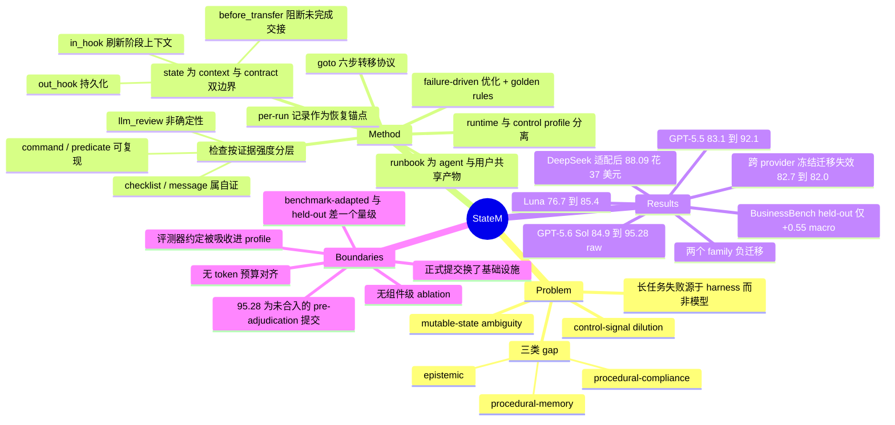

## Summary

StateM 把 long-horizon CLI agent 的执行控制外置成一份 agent 与用户共同可读写的 YAML runbook 状态机——durable state、phase-local `in_hook`、`before_transfer` 检查、可恢复的运行记录、可版本化的 procedural practice——在不改模型权重的前提下做 harness scaling。Terminal-Bench 2.1 上 GPT-5.5 xhigh 从 83.1% 到 92.1%，冻结同一 runbook 迁到 GPT-5.6 Sol xhigh 得 95.28% raw（424/445，尚未合入的公开提交），跨 provider 冻结迁移失效（DeepSeek-V4 Flash 82.7%→82.0%），花 \$37.02 适配后到 88.09%。全文没有任何组件级 ablation，作者自己声明结果测的是 runtime 与"已在该 benchmark 上演化过的 control profile"的合体，四条机制里只有 versioned practice 有专门设计的对照实验。

## Problem & Motivation

论文提的问题是可证伪的：**有多少看起来像模型失败的失败，其实是维护状态、约束执行、核验进度、从错误中恢复的那一层——harness——的失败？** 动机观察是 long-horizon agent 常在"每个局部步骤模型都会做"的情况下整体失败：偏离计划、丢失可变状态、跳过必要检查、重复无效动作、在交付物可核验地完成之前就停下。

作者给出两条 operational hypothesis（明确声明不是关于 transformer attention 的基础性论断）：**control-signal dilution**——紧凑的计划与完成标准被越来越长的命令/观察/修补轨迹稀释；**mutable-state ambiguity**——已完成目标、待决依赖、失败尝试、合法下一步必须从 append-only 历史里重建，而不是从一份权威的当前状态里读出。两者都指向同一处方：把 procedural state 外置、在阶段开始时刷新与当前阶段相关的控制信息、在重要转移前检查证据。

设计空间的定位比机制假设更值得注意。作者说现有系统在 runtime enforceability 与 agent autonomy 之间做取舍：state-machine / graph runtime（StateFlow、LangGraph）有显式状态与恢复，但控制器是开发者编写的；通用 CLI agent（Codex、Claude Code）保留宽的推理与动作空间，但它的 plan、instruction file、memory、hook 本身不构成一个统一的、transition-aware 的控制面。**"区别不在于系统有没有状态，而在于执行期间谁能检视、修改、操作这个有状态的控制层。"** 这句话是全文最有价值的 problem formulation——它把控制层的**所有权**而非其存在性作为设计变量。

## Method

**runtime 与 control profile 分离（§3.1）。** runtime 提供状态持久化、转移校验、hook 执行、历史、恢复的通用机制；control profile（即 runbook）规定某类工作的阶段、指令、检查、修复策略。作者在此处主动声明：Terminal-Bench 的结果测的是 runtime + 一份**已针对该 benchmark 演化过的** control profile，**不应被解读为隔离了 state-machine 抽象本身的效果**。这条声明决定了本文所有数字的读法。

**state 作为 context-and-contract 双重边界（§3.2）。** state 是阶段级的（planning / implementation / contract-checking / self-review / repair / handoff），不是单次模型调用。进入时 `in_hook` 刷新阶段指令、合法出边、durable progress；离开时 `out_hook` 持久化、`before_transfer` 评估退出条件。作者明确 `in_hook` **不抹除模型已有 context、不保证无损压缩**，只是让权威阶段与本阶段义务变得显式且新近；它能修复"信息在 runbook 里但没被用上"的缺失，修复不了"模型与环境都不具备该知识"的缺失。

**检查按证据强度分层——这是本文可直接复用的贡献。**

| 检查类型 | 证据性质 |
|:--|:--|
| `command` / `predicate` | 宿主执行，可独立复现（以命令/谓词本身正确为前提） |
| `manual` | 需要用户或操作员显式决策 |
| `checklist` / `message` | agent 确认既定义务，**仍属结构化自证** |
| `llm_review` | 附加语义判断，**不构成确定性核验** |

作者据此写下"agent 宣称完成不构成独立核验"，并说明分层的目的是**防止一条 receipt 或模型声明仅仅因为出现在结构化字段里就被当成证明**。

**转移协议（§3.3）。** runbook 形式化为 B = (S, s0, S_T, E, Φ)。`goto TARGET` 按序执行：校验边存在 → 评估当前 state 的 `before_transfer` → 跑 `out_hook` → 评估边级 guard 与 transfer hook → 全部通过才提交目标状态并追加历史 → 建立目标状态入口并执行其 `in_hook`。失败则停留在源状态并记录未满足条件。作者把它描述为 **checked / logged / recoverable 而非 transactional**：runtime 状态的提交被推迟，但无法回滚 hook 造成的任意外部副作用。

**per-run 记录与恢复（§3.4）。** 每次运行独立保存 run id、当前状态、状态入口 id、转移历史、hook 与 check 结果、时间戳、state-local 证据文件引用。进程重启、context 刷新或模型侧压缩之后，agent 可以直接查询当前状态与未决义务，不必从长终端记录里重建工作流。恢复范围被明确限定：**不能重建从未持久化的工作、不能恢复隐藏的模型 context、不能自动逆转任意外部动作**。运行有三种状态——非终态活动中、因外部条件未决而暂停、在终态完成；**到达非终态的暂停不算成功完成**。

**共享控制与 stop hook（§3.5）。** runbook 是普通 workspace 产物而非隐藏的控制器代码，agent 用执行任务时同一套 CLI 动作空间操作它。共享所有权不等于无限制自我修改：区分 versioned base runbook、run-local 增补、host-owned 约束；agent 可以**加**更严的动态检查（记入历史供用户决定是否升级进 runbook），但削弱或删除既有要求应当需要特权决策。作者点明 **YAML 可编辑本身不提供这个安全边界**，部署方必须自行定义哪些部分 agent 可改。stop hook 接入 Codex 与 Claude Code：收到停止请求时若运行处于终态或显式阻塞则放行，否则把当前阶段与未满足义务返还给 agent 并要求继续——作者同时声明它不保证最终成功或终止。

**failure-driven harness optimization 与三类 gap。** 运行后把失败归类为 missing context / invalid transition / weak check / premature handoff / ineffective recovery 等控制层缺陷，由工作 agent 或独立 hyper-agent 提出对状态边界、prompt、hook、check、recovery、practice 激活条件的修改，经审查与回归测试并入新版本 runbook。三类 gap 与三个控制点一一对应：**epistemic gap**（决策点缺知识）→ state-local `in_hook`；**procedural-memory gap**（跨运行不保留/不激活已学到的教训）→ versioned practice；**procedural-compliance gap**（正确流程已激活但未完成）→ checked transition。

**golden rules**（人工指定的 profile 演化约束，区别于运行内的 check）：优先最小可复用控制、按可见任务语义而非任务身份路由、把开发反馈与冻结评测分开。profile 构造允许用可见任务规格、workspace 产物、公开文档、可观察执行反馈；不允许用 hidden test、verifier 实现、公开解法、答案产物、task hash 或人工枚举的 task id 作为路由键。

## Key Results

### Terminal-Bench 2.1（89 任务 × 5 trial = 445 trial，指标为 trial 级成功率）

| 系统 | profile 状态 | 评测范围 | 分数 / 五轮覆盖 |
|:--|:--|:--|:--|
| GPT-5.5 xhigh + Codex | 已发表参考 | 89 任务 445 trial | 83.1% |
| **GPT-5.5 xhigh + StateM** | 本文开发的 profile | 同上 | **92.1%；88/89 覆盖** |
| GPT-5.6 Sol xhigh + Codex | 已发表参考 | 同上 | 84.9% |
| **GPT-5.6 Sol xhigh + StateM** | **冻结** GPT-5.5 profile；公开提交 | 同上 | **95.28% raw；89/89 覆盖** |
| GPT-5.6 Luna + Codex | 已发表参考 | 同上 | 76.7% |
| **GPT-5.6 Luna + StateM** | **冻结** GPT-5.5 profile | 同上 | **85.4%** |
| DeepSeek-V4-Flash | 本文基线 | 89 任务，标准超时 | 82.7% |
| DeepSeek-V4-Flash + StateM | **冻结** GPT profile 直接迁移 | 同上 | **82.0%（低于基线）** |
| DeepSeek-V4-Flash + StateM | 适配后 profile | 同上 | 88.09%（392/445） |
| DeepSeek-V4-Flash + StateM | 适配后 profile | 88 任务 common core | 89.09%（392/440） |
| DeepSeek-V4-Flash + StateM | 适配后；**描述性聚合** | 89 任务，1 个任务延长超时 | 88.76%（395/445） |

**同模型增益是全文最干净的结果。** 固定权重下 GPT-5.5 +9.0 点、GPT-5.6 Sol +10.4 点；同期参考 harness 下从 GPT-5.5 到 GPT-5.6 Sol 的换代增益只有 1.8 点（83.1→84.9）。**harness 造成的差异大于观察到的一次模型换代。**

**95.28% 这个数字要读三遍。** 它是 terminal-bench-2-1 PR #142 的 raw、**pre-adjudication**、**尚未合入 leaderboard** 的公开提交分。作者主动披露：认同评审中发现的 4 条被计分轨迹不应计入 → 420/445 = 94.38%；把全部 9 条被标记为可能 reward hacking 的轨迹计零 → 415/445 = 93.26%。提交记录另含 439 条无错误完成、6 条 AgentTimeoutError、11.78 亿 token、standard error 0.87 pp、提交侧报告的模型成本 \$1,062.95，并通过全部十项自动配置与静态检查。

> [证据边界] 即使按最保守的 93.26%，相对 84.9% 参考仍有 +8.4 点。adjudication 争议威胁的是标题，不是定性结论。

**转移随模型距离分层，且有真实的负结果。** GPT 家族内冻结迁移（零目标模型 runbook 改动）成立：Sol xhigh 参考差从 +9.0 扩到 +10.4，Luna 76.7→85.4（+8.7）。**跨 provider 冻结迁移失效**：DeepSeek 82.7→82.0。作者的结论是转移对象随距离变抽象——近邻模型共享**具体 profile**，跨 provider 只共享 runtime、runbook 结构、失败分析循环与 golden rules，跨任务分布只共享"定位并保护关键执行边界"的方法。

### 成本

| 项 | 金额 | 口径 |
|:--|:--|:--|
| DeepSeek 最终成绩证据 | \$15.20 | 实际发生的 API 费用 |
| DeepSeek provider 适配 | \$37.02 | 全部 profile 开发迭代的记录费用 |
| DeepSeek 合计 | \$52.22 | 上二者之和 |
| GPT-5.6 Sol max 公开提交 | \$574.68 | 提交侧报告的模型成本（对照） |
| **GPT-5.6 Sol xhigh + StateM 提交** | **\$1,062.95** | 提交流水线的 API 等价估算，**非作者实付**（Codex Pro plan） |
| 全部个人 Codex Pro 用量 | < \$125（\$200 预算内） | 附录 B |

**\$15 vs \$574.68 的对照口径必须拆开看。** 作者在脚注 5 里自己说清楚：88.8% 的 Sol max 分数与 \$574.68 的公开提交**来自不同的评测**；那次 \$574.68 的提交自身报的是 83.37% raw / 76.18% adjudicated。也就是说"用 \$15 达到 \$574.68 才能达到的 88.8%"这个读法把一个评测的分数和另一个评测的成本拼在了一起——正文与脚注披露了，标题与摘要没有。此外 88.76% 本身是描述性聚合：88 个任务用标准超时、gpt2-codegolf 一个任务用延长超时（该任务标准超时 0/5，延长后 3/5），不是任何单一合法评测配置下的结果。作者把三个数（88.09 / 89.09 / 88.76）都报出来并注明各自条件，这个处理是诚实的。

### BusinessBench（Codex + GPT-5.6 Luna）

477 个合格实例 / 7 个 family；对 attendance-payroll **主动弃权**（不施加任何 StateM workflow，该 family 72 次处理臂运行全部排除在效力聚合之外），实际处理 405 实例 / 6 family，即 810 次真实处理/对照执行。**每个实例每臂只有一条随机轨迹。**

| 范围 | Codex CLI | StateM–Codex | Δ |
|:--|:--|:--|:--|
| 冻结一次性 held-out，family macro | 84.67 | 85.22 | **+0.55** |
| 冻结一次性 held-out，instance micro | 84.44 | 85.78 | **+1.34** |
| development | 86.07 | 91.71 | +5.64 |
| 全部 StateM 处理实例 | 84.76 | 88.72 | +3.96 |
| 探索性机制匹配子组（Budget Approval + Machine Operating，macro） | 71.91 | 81.94 | +10.04 |
| budget-approval | 62.91 | 75.12 | +12.21 |
| machine-operating | 90.79 | 100.00 | +9.21 |
| refactorbench | 80.56 | 77.78 | **−2.78** |
| webarena | 88.00 | 92.00 | +4.00 |
| webtest | 98.25 | 98.75 | +0.50 |
| woocommerce-stock | 92.59 | 88.89 | **−3.70** |

**负迁移的诊断比正迁移的数字有信息量。** 作者的判断是问题不在"控制太少"而在"控制挂在了错误的执行边界上"：RefactorBench 最初过度强调最小性与向后兼容却没有闭合显式的代码迁移义务，换成更薄的"义务追踪 + 签名/调用形态核验 + 一次全库 stale-reference 扫描"后，事后匹配重跑 76.39→79.17；WooCommerce 的首版 profile 有大量流程却没有保住治理库存实体、按目的地去重、不可逆邮件动作与 receipt 的跨系统不变量，换成不变量后事后重跑 86.42→90.12（复用 held-out 85.37→90.24）。WebArena 以检索与分析为主，冻结评测里 25 个实例只有 3 个非平局结果（development 2 胜 10 平 0 负，held-out 0 胜 12 平 1 负）。WebTest 近饱和（后续重跑两臂 development 均 100.0、复用 held-out 均 99.5）。作者的归纳：**强 profile 不是最大化的通用工作流，而是绑定最可能漂移的最小不变量、并在违反会造成后果的地方核验它们。**

### 任务级证据与失败边界

Table 3 给出 12 个 GPT-5.5 任务级改善，增益集中在四类关键边界：交接前的服务就绪、提交变换前的契约满足、破坏性操作前的保全、完成前的证据闭合。最干净的一例是 `configure-git-webserver` 0/5 → 5/5：基线 agent 会配 Git、SSH、hook 与 HTTP server 但不能可靠地保全并验证要求的端到端活状态；接上 StateM 后最终交接被 gate 在新鲜的消费者侧证据上——必须实现一条 clone–commit–push–curl 路径才能离开验证状态。作者对此写下一句**对本 vault 极重要的话**："StateM 在这个例子里没有增加任何组件级能力，它只是在关键交接边界之前组合、检查并闭合了模型已经具备的能力。"同时明确表格中控制与增益的关联**不是组件 ablation**。

### 作者自曝的两类记忆污染

- **video 任务的目标帧精度**在任务规格里没有完全指定，hyper-agent 在观察 benchmark 行为后引入了默认精度值——一条含糊的规格被事后解决，然后被当作普适实践存了下来。
- **DNA 插入任务的 verifier 选择最左侧合法插入边界**，而这条约定在可见任务描述中并不存在；重复反馈会让 profile 在从未读过 verifier 代码的情况下复现该约定。**结果行为与评测器一致，但其语义来自评测器而非声明的任务契约。**

作者由此写下设计规则："经验必须先过滤才能成为记忆。Harness scaling 是抽象问题，不是规则累积。"

### 22 小时运行（§4.8）

一次 Terminal-Bench profile 开发运行中，hyper-agent 连续工作 22 小时，跨越长交互历史、context 刷新或压缩、stop-hook 续跑；durable StateM 记录全程提供当前阶段、转移历史、未决义务与恢复锚点。观察到的变慢来自界面里累积未折叠的终端输出，而非 StateM 控制状态丢失。作者声明这不意味着无界执行。

### 实验设备与预算（附录 B）

主计算资源是个人 Codex Pro plan + MacBook Pro 2025（M4），\$200 预算内实际用量不到 \$125。**正式提交运行改用 AWS m7i.4xlarge，理由是 daytona 上 sandbox/verifier/network/pytorch-install 超时更频繁**，且 M4 不满足 tune-mjcf 的内核要求。在个人 MacBook 上 GPT-5.5 xhigh 约达 91% 通过率。

## Evidence Ledger

| Claim ID | Claim | Type | Source locator | Evidence excerpt | Status |
|:--|:--|:--|:--|:--|:--|
| C1 | GPT-5.5 xhigh + StateM 92.1% vs 83.1% GPT-5.5 Codex 参考；五轮解出 88/89 任务 | number | §4.1 p.10；§4.2 p.11 | "records 92.1% ... compared with the 83.1% GPT-5.5 Codex reference ... solves 88 of the 89 tasks" | source-verified |
| C2 | 83.1% 参考是 model-matched 公开参考（Codex 0.125.0，\$2,059.19 模型成本），**非**重跑的 agent-version-matched A/B；StateM 提交用 statem-Codex 0.144.1 | benchmark-setting | 脚注 3 p.11；§4.1 p.10 | "83.15% over 445 trials with Codex agent version 0.125.0 and \$2,059.19 reported model cost ... rather than a newly rerun, agent-version-matched A/B control" | source-verified |
| C3 | GPT-5.6 Sol xhigh + 冻结 profile = 95.28% raw = 424/445，89/89 覆盖，对照 84.9% 参考 | number | §4.2 p.11 式；Fig. 3 caption | "records 95.28% raw accuracy, compared with the 84.9% Sol xhigh reference" | source-verified |
| C4 | 95.28% 为 pre-adjudication、PR #142 未合入；作者认同 4 条不应计（420/445 = 94.38%）；9 条全计零为 415/445 = 93.26% | benchmark-setting | 脚注 1 p.4 | "PR remains open and has not been merged ... four rewarded trajectories ... 420/445 = 94.38% ... all nine trajectories ... 415/445 = 93.26%" | source-verified |
| C5 | 该提交报 11.78 亿 token、\$1,062.95 模型成本，且 \$1,062.95 是流水线 API 等价估算而非作者实付（Codex Pro plan） | number | 脚注 1 p.4；§4.1 "Cost accounting" p.10 | "the pipeline's API-equivalent model-cost estimate, not the authors' realized out-of-pocket expenditure under a Codex Pro plan" | source-verified |
| C6 | 冻结 profile 把 GPT-5.6 Luna 从 76.7% 抬到 85.4%（+8.7），数值高于 84.9% Sol xhigh 参考 | number | §4.3 p.12 | "raises GPT-5.6 Luna from 76.7% to 85.4%, a gain of 8.7 points ... numerically exceeds the 84.9% Sol xhigh reference" | source-verified |
| C7 | 冻结 GPT profile 直接迁 DeepSeek-V4-Flash：82.7% → 82.0%，跨 provider 精确 profile 迁移失效 | number | §4.3 p.12 | "changes the full-suite score from 82.7% to 82.0%. Exact-profile transfer fails across this provider boundary." | source-verified |
| C8 | 适配后 DeepSeek：392/445 = 88.09%（全量标准超时）；392/440 = 89.09%（88 任务 common core）；395/445 = 88.76%（描述性聚合，仅 gpt2-codegolf 延长超时） | number | §4.4 p.13；脚注 4 p.13；Table 4 p.25 | "392/445 = 88.09% ... 392/440 = 89.09% ... 395/445 = 88.76% after evaluating only gpt2-codegolf with the extended timeout" | source-verified |
| C9 | gpt2-codegolf 标准超时 0/5，延长每任务超时后 3/5 | number | §4.4 p.13 | "gpt2-codegolf is 0/5 under the standard timeout, but ... solves it in 3 of 5 trials under an extended per-task timeout" | source-verified |
| C10 | DeepSeek 成本：最终成绩 \$15.20、适配 \$37.02、合计 \$52.22；对照 GPT-5.6 Sol max 公开提交 \$574.68 | number | §4.4 p.14 | "final-score evidence costs \$15.20 in realized API charges. Provider-specific adaptation costs \$37.02 ... \$52.22 ... records \$574.68" | source-verified |
| C11 | 88.8% Sol max 分与 \$574.68 成本**来自不同评测**；\$574.68 那次提交自身报 83.37% raw / 76.18% adjudicated | benchmark-setting | 脚注 5 p.14 | "The \$574.68 submission reports 83.37% raw before adjudication and 76.18% after adjudication." | source-verified |
| C12 | 作者声明 Terminal-Bench 结果测的是 runtime + 已演化的 benchmark-adapted profile，不隔离 state-machine 抽象；task-level 关联"不是组件 ablation" | causal-mechanism | §3.1 p.7；§4.6 p.17 | "should not be interpreted as isolating the effect of the state-machine abstraction alone"；"the association is not a component ablation" | source-verified |
| C13 | BusinessBench 冻结一次性 held-out：macro 84.67→85.22（+0.55）、micro 84.44→85.78（+1.34）；development 86.07→91.71（+5.64）；全部处理实例 84.76→88.72（+3.96） | number | §4.5 p.15；Table 1 p.15 | "macro ... 84.67% to 85.22% ... micro ... 84.44% to 85.78% ... 86.07% to 91.71% (+5.64) ... 84.76% to 88.72% (+3.96)" | source-verified |
| C14 | 机制匹配两 family（Budget Approval + Machine Operating）held-out macro 71.91→81.94（+10.04，按未取整值计） | number | §4.5 p.15；Table 1 p.15 | "macro average rises from 71.91% to 81.94%, a 10.04-point gain computed from the unrounded family values" | source-verified |
| C15 | 冻结 Round-1 出现负迁移：RefactorBench 80.56→77.78（−2.78）、WooCommerce Stock 92.59→88.89（−3.70） | number | §4.5 p.15；Table 1 p.15 | "RefactorBench changes from 80.56% to 77.78% (−2.78), and WooCommerce Stock changes from 92.59% to 88.89% (−3.70)" | source-verified |
| C16 | BusinessBench 设置：477 合格实例 / 7 family；405 实例 / 6 family 受处理；attendance-payroll 弃权且排除出效力聚合；每实例每臂仅一条随机轨迹 | benchmark-setting | §4.5 pp.14-15；§4.1 p.10；脚注 6 p.18 | "477 eligible instances across seven families ... abstains from ... attendance-payroll ... treated set therefore contains 405 instances across six families" | source-verified |
| C17 | configure-git-webserver 0/5→5/5，且作者声明 StateM 在此例未增加任何组件级能力，只是在交接边界前组合、检查、闭合模型已有能力 | causal-mechanism | §4.6 p.17；Table 3 p.17 | "StateM adds no new component-level capability in this case. It composes, checks, and closes capabilities already available ... moves from 0/5 to 5/5" | source-verified |
| C18 | 作者披露评测器约定被吸收：DNA 插入任务 verifier 选最左侧合法边界（可见任务描述中不存在该约定），重复反馈会让 profile 复现它 | causal-mechanism | §4.7 "What the harness should not remember" p.18 | "the verifier selects the left-most valid insertion boundary even though that convention is absent from the visible task description" | source-verified |
| C19 | 22 小时开发运行：跨长历史、context 刷新/压缩、stop-hook 续跑；变慢归因于累积未折叠的终端输出而非控制状态丢失 | number | §4.8 pp.18-19 | "continued for 22 hours across long interaction history, context refresh or compaction, and stop-hook continuation ... slowdown came from accumulated terminal output" | source-verified |
| C20 | 预算：个人 Codex Pro plan + MacBook Pro 2025 (M4)，\$200 内实用 < \$125；正式提交跑 AWS m7i.4xlarge；MacBook 上 GPT-5.5 xhigh 约 91% | number | 附录 B p.23 | "personal Codex pro plan and Macbook Pro 2025 (M4 chip) ... actual usage is less than 125\$ ... AWS m7i.4xlarge ... around 91% pass rate" | source-verified |
| C21 | 代码开源于 github.com/henryqin1997/statem | license-code | Abstract p.1（"github" 超链接目标） | "Core code and several runtime cases is open sourced at github." → https://github.com/henryqin1997/statem | source-verified |
| C22 | 作者不主张 state/graph orchestration 能力本身为新；自述新颖性在于通过 agent-native、可共同编辑的执行表示把这些组件组合起来，且 harness 适配与跨模型迁移本身都不是新主张 | sota-novelty | §2 pp.5-6 | "does not claim to introduce these capabilities"；"lies in their combination through an agent-native, jointly editable execution representation"；"neither harness adaptation nor cross-model harness transfer is, by itself, a novel claim" | source-verified |
| C23 | 作者 Ziheng Qin / Yaxin Lu / Zhangyang "Atlas" Wang / Kai Wang；机构栏写 "Somewhere on the Earth" 并声明工作在个人时间完成、不代表任何关联组织；2026-08-15 提交，cs.AI，CC BY 4.0 | metadata | 首页标题块 + 脚注 1；arXiv 标记 p.1 | "Somewhere on the Earth"；"conducted in the authors' personal time and does NOT reflect the views of any affiliated organization" | source-verified |

## Strengths & Weaknesses

**Strengths**

- **预先声明的转移层级是本文真正的实验设计贡献。** 固定模型增益 → 家族内冻结迁移 → 跨 provider 适配迁移 → 跨任务 held-out，四个规格递进且各自可证伪，作者在每一级都报了会伤害自己论点的数字：跨 provider 冻结迁移 82.7→82.0（失效）、BusinessBench 冻结 held-out 只有 +0.55 macro、两个 family 负迁移。绝大多数 harness 论文只报第一级。
- **对自己数字的降级处理罕见地彻底。** 95.28% 被同时给出 94.38% 与 93.26% 两个更保守版本；88.76% 被明确标为"描述性聚合"并同时给出 88.09% 与 89.09%；\$574.68 那次提交的真实分数（83.37% raw / 76.18% adjudicated）被写进脚注而不是藏起来；BusinessBench 的事后精修结果被单列成 Table 2 与冻结一次性结果分开。这套披露纪律本身值得作为 harness 论文的模板引用。
- **检查按证据强度分层是可直接搬走的设计原语。** command/predicate（宿主可复现）> manual（人工决策）> checklist/message（结构化自证）> llm_review（非确定性）这条谱系，加上"防止 receipt 仅因出现在结构化字段里就被当成证明"这句动机，正好补上 [[Topics/Harness-Component-Attribution]] 里"verifier 独立性存在剂量-反应关系"这一论断缺的**分类轴**。该 note 已有三个数据点说明同 backbone、仅换 context 的低剂量 gating 近乎失效（[[2607-StateAct]] finish gate 68/76 误放行、[[2605-TeamBench]] 合并误接受 49.4%、[[2606-CodeSelfReviewCollapse]] Thm 2.3），StateM 的分层给了这条轴一个可操作的刻度。
- **主动报告了两类记忆污染，且是对自己不利的。** video 任务的帧精度默认值是观察 benchmark 行为后事后设定的；DNA 任务的 profile 在没读过 verifier 代码的情况下复现了 verifier 的最左边界约定。作者把它命名为"评测器语义而非任务契约语义"并写进正文而不是限制章节。这是全文最有 research taste 的一段。
- **`configure-git-webserver` 那句自我限定是全文最诚实的机制陈述。** "StateM 没有增加任何组件级能力，只是在关键交接边界前组合、检查、闭合了模型已有的能力"——这与 [[2608-LongHorizonHarness]] 在 WeaveBench Games 上观察到的"增益形状是抬失败地板"、[[2606-SkillNb]] 的"去掉 gate 成功率只掉 5.8 但回归从 3.3% 暴涨到 18.6%" 指向同一结论，是这条线上第三个独立数据点。
- **恢复能力的边界被写死而不是留白。** 明确说不能重建未持久化的工作、不能恢复隐藏模型 context、不能逆转任意外部动作，"checked/logged/recoverable 而非 transactional"，"YAML 可编辑本身不提供安全边界"。这几句把这类系统最容易被 overclaim 的地方提前钉住了。

**Weaknesses**

- **四条机制里三条没有隔离证据。** 这是最大的方法学缺口，作者自己也承认（C12），但值得按机制逐条记账：

| 机制 | 有什么证据 | 证据强度 |
|:--|:--|:--|
| versioned procedural practice | **唯一有专门设计的对照**：GPT 家族内冻结迁移成立（+9.0→+10.4，Luna +8.7）、跨 provider 冻结迁移失效（−0.7）、BusinessBench 冻结 held-out +0.55/+1.34 且含两个负 family | **中等偏强**。可证伪、有负结果、跨两个 benchmark |
| checked transition (`before_transfer`) | Table 3 的 12 条任务级关联 + `configure-git-webserver` 0/5→5/5 的机制叙述 | **弱-中**。关联而非 ablation；且**哪一类检查在起作用完全未报告**——按作者自己的分层，最可能承担增益的 checklist/message 恰恰是自证 |
| phase-local context (`in_hook`) | 只有机制叙述与 Table 3 的关联描述 | **弱**。无任何隔离实验。[[2607-ProgressiveDisclosure]] 已给出反向边界：阶段性披露的增益在强 harness 上落进误差棒内、层级路由可为负 |
| durable state / recovery | §3.4 机制描述 + 22 小时单次运行轶事（n=1，无对照） | **最弱**。全文没有任何"中断-恢复 vs 不恢复"的对照；恢复能力从未被单独测量过 |
| 共享可编辑的 runbook（agent+user 共同所有） | 纯架构主张。Fig. 1 的定位被作者自己标注为"典型操作抽象，非架构极限或经验性能排序" | **无直接证据**。这条恰是本文自述的核心差异化 |

- **compute/token 预算在任何一处都没有对齐。** 全文没有任何基线臂的 token 数——只有 StateM 提交自己的 11.78 亿 token（445 trial ≈ 每 trial 265 万 token）。这意味着 harness 自身的 token 开销**不可测**。这一点在本 vault 里有明确的前车之鉴：[[2607-HarnessEvolution]] 在固定模型上跑 35 次连续 harness 发布，resolve rate 无显著趋势（ρ=0.208, p=0.231）而 token 上涨 70%；[[2606-SkillMemoryBudget]] 在 token 预算对齐后 vanilla 打平或击败全部 skill/memory harness；[[2605-GRASP]] 的 compute-matched 对照（花掉验证预算但丢弃判定）从 88.8% 塌到 67–71%。按 [[Topics/AgentHarness-Design]] §4 的审计口径，本文的效率主张会被判为 "no"。
- **\$15 vs \$574.68 是部署经济学陈述，不是 harness 可归因的节省。** 这个比值同时跨越了 provider 定价、模型、以及 harness 三个变量；DeepSeek 82.7% 基线的成本从未报告，因此无法回答"其中多少来自 DeepSeek 更便宜、多少来自 StateM 更省"。更关键的是**质量前沿这一侧 StateM 反而更贵**：其 GPT 提交的 \$1,062.95 约为 \$574.68 对照的 1.85×。标题把两套不同系统（95.3% 来自 GPT-5.6 Sol xhigh、\$15 来自 DeepSeek-V4 Flash）的两个数并置，读起来像一个系统同时占住两个前沿。
- **正式提交换了运行基础设施，且换的理由与失败模式直接相关。** 附录 B 说改用 AWS m7i.4xlarge 是因为 daytona 上"sandbox/verifier/network/pytorch-install 超时更频繁"。在一个失败里包含超时（该提交仍有 6 条 AgentTimeoutError）的 benchmark 上，选一个虚假超时更少的基础设施是一个**方向明确偏向处理臂**的未受控变量。作者披露了理由但没有量化其贡献。叠加 agent 版本差（参考 Codex 0.125.0 vs 提交 statem-Codex 0.144.1），"+9.0 / +10.4" 并不是纯 harness 的 A/B。
- **三个"超过下一代参考"的论断都落在噪声里。** 提交记录报的 standard error 是 0.87 pp（本笔记以此作量级参照，非作者的跨行统计声明）：92.1 vs 91.9（Sol ultra）差 0.2、85.4 vs 84.9 差 0.5、88.76 vs 88.8 差 0.04，三者都在一个 SE 之内；而 +9.0 / +10.4 / +8.7 / +5.4 四个同模型增益都远在噪声之外。正文用 "numerically above / numerically close" 做了正确的对冲，Fig. 3 的横幅文字 "Last Generation GPT-5.5 xhigh + StateM is Already SOTA" 则没有。**论文真正的结果是前者，宣传的是后者。**
- **Terminal-Bench 的数字是 benchmark-adapted 的。** profile 用该 benchmark 的失败轨迹开发出来，作者划了不用 hidden test / verifier 实现 / 解法 / task id 的边界，但同时自曝了两处评测器约定吸收（C18）。因此 92.1% / 95.3% 应当读作"在开发它的 benchmark 上的上界"，而**对未见任务的诚实估计是 BusinessBench 的冻结 held-out：+0.55 macro / +1.34 micro——比前者小一个量级。**摘要把这两个量级并列陈述而不加权重提示。
- **BusinessBench 每实例每臂只有一条随机轨迹，全部 family 级 Δ 都没有方差估计。** +0.55 macro 跨 6 个 family 在这个采样下本质上不可分辨；+10.04 的两 family 子组作者已标为"探索性"，但摘要仍然把它推到前面。attendance-payroll 的弃权是合理的协议选择（完全未施加处理），但它同时移除了唯一一个作者预判无收益的 family，属于对聚合有利的研究者自由度。
- **一个内部张力值得单独指出：一个以"证据闭合完成"为卖点的 runtime，其最好的一次提交里仍有 9 条轨迹被标记为可能 reward hacking（作者认同其中 4 条）。** 结合自曝的评测器约定吸收，这条线索的含义是——**让完成变得可检查，不等于让完成变得正确**；而 failure-driven 优化循环会系统性地向评测器的语义而非任务契约的语义漂移。这可能是全文对本 vault 最重要的发现，且是作者顶着自身利益报出来的。

**潜在影响。** 本文是 [[2608-LongHorizonHarness]] 的 CLI 侧同期对应物：两者都做"外置 durable state + 阶段性新鲜 context + 完成前检查"，都在 Terminal-Bench 2.1 上测，都不改权重，也都没做角色/组件级 ablation。StateM 可辩护的增量有三条——控制层是**声明式、可版本化、agent 与用户共享的产物**（而非 LLM 管理的状态块）、恢复与续跑是一等能力、以及**转移层级本身被设计成了实验**。第三条是最有价值的：它把 [[2607-HarnessBank]] 的"演化出的 harness 是模型特定的修正"精化为"是模型**家族**特定的"——GPT-5.5→GPT-5.6 精确迁移成立、跨 provider 失效——这是一个真正的新数据点，而不是重复。

## Mind Map

## Notes

- **对 Agent-Facing Environment Runtime 方向的直接含义。** 本文是该假设在 CLI 侧的一次大规模实证，且结论对该方向**有利也有约束**。有利的一面：它支持把动机从"界面效率"重锚到"long-horizon 失败以 false completion 为主，缺的是执行期可核验、可恢复的状态"——`before_transfer` 与 durable run record 正落在重锚后的表述上。约束的一面有三条：(1) StateM 的 `command` / `predicate` 检查（宿主执行、只读取证、不暴露 success label）与 AFE-MiniSuite 设计里的 `verify` affordance 几乎同构，本文构成 CLI 侧的 prior art，AFE 的差异化必须坐实在 GUI/web 设定与"**测量哪个 affordance 承担了增益**"上——后者恰是本文没做的；(2) 本文自曝的评测器约定吸收说明，把 verify 能力交给 agent 并配上 failure-driven 优化循环，会让系统向评测器语义漂移，AFE 的 non-oracle 约束需要防的不只是泄漏 label，还有**跨轮把评测器约定沉淀成 practice**；(3) budget-matched arm 的必要性再次被证实——本文没有它，因此在 [[Topics/AgentHarness-Design]] §4 的审计里只能记 "no"。
- **[[Topics/Harness-Component-Attribution]] 的两条更新。** 其一，该 note 的可证伪主张"目前没有任何受控证据显示独立验证提升了能力上限；所有被测出的验证收益都是避免回归/抬失败地板形态"**没有被本文推翻**——本文的 `configure-git-webserver` 自述恰好是该形态的又一例（"没有增加任何组件级能力"）。其二，该 note §7 提的四臂 token-budget-matched Terminal-Bench 2.1 实验，现在有了第二个必须被纳入的对象：StateM 的 runbook 与 [[2608-LongHorizonHarness]] 的 MEA 在同一 benchmark 上做同一件事却从未互相对照过，且两者都没有 token 计量。
- **最该做而没做的实验（一句话）**：固定模型与 agent 版本，把 `before_transfer` 里的 `command`/`predicate` 检查全部替换成 `checklist` 自证（其余不动），看 Terminal-Bench 掉多少。本文自己建立了检查的证据强度谱系，却从未测量过谱系的**斜率**——这正是把 [[Topics/Harness-Component-Attribution]] 的"验证独立性剂量-反应曲线"从假设变成数据的最便宜路径，而且 StateM 的 YAML 表示让这个替换几乎是零成本的。
- **第二个便宜实验**：durable state 的恢复能力从未被单独测过。在运行到一半时强制杀掉进程并重启，对照有/无 StateM 记录的恢复成功率——22 小时那条轶事目前是该机制的全部证据。
- **与库内工作的关系**：最直接的同期对照是 [[2608-LongHorizonHarness]]（CLI 侧同问题、同 benchmark、同样无 ablation）与 [[2607-StateAct]]（program state 作为一等界面 + 独立 finish gate + 成本前沿框架）；转移主张的前置对照是 [[2607-HarnessBank]]（演化 harness 是模型特定修正）与 [[2608-StrongToWeakHarness]]（冻结目标模型上的能力迁移）；versioned practice 的最近邻是 [[2606-ProceduralMemoryAFTER]]（可版本化 SKILL.md + 提升/回滚 + 跨模型迁移测量）；学习式对照是 [[2608-EvoHarnessRL]]（把 harness state 读写变成可训练动作）；负面前置证据是 [[2607-HarnessEvolution]]（35 次发布、无显著趋势、token +70%）与 [[2606-SkillMemoryBudget]]；gate 形状的第三方证据是 [[2606-SkillNb]] 与 [[2605-GRASP]]；`in_hook` 的边界条件见 [[2607-ProgressiveDisclosure]]；benchmark 侧的稀疏性限制见 [[2607-LongHorizonTerminalBench]]；成本-精度前沿的方法论规范见 [[2510-HAL]] 与 [[2407-AgentsThatMatter]]；环境侧定位见 [[2606-EnvEngineeringSurvey]]。
- **可提炼成 survey 论断的观察**：2026 下半年"harness scaling"这条线已经积累了足够多的独立数据点，可以支撑一个**分层**而非二元的论断——具体控制配置在同族模型间可零成本迁移、跨 provider 失效、跨任务分布只有方法论可迁移。StateM 是目前唯一把这三层同时测出来并各自给出数字（含负数字）的工作，值得在 [[Topics/Harness-Component-Attribution]] 里单立"transfer hierarchy"一节，并把"迁移距离"作为该 note 现有分类轴之外的第二根轴。
- **机构信息**：论文机构栏字面写作 "Somewhere on the Earth"，并附注工作在作者个人时间完成、不代表任何关联组织，因此 frontmatter 的 `institute` 留空。Ziheng 与 Yaxin 为并列第一（core contributors）。
- **repo_candidate**: https://github.com/henryqin1997/statem —— 系统/runtime 类工作，贡献主要在实现（YAML runbook schema、goto 转移协议、检查类型的实际执行语义、stop-hook 接入 Codex/Claude Code 的方式），值得另起一轮 repo-digest 核查两点：`command`/`predicate` 检查在真实 Terminal-Bench profile 里的占比（决定"证据强度分层"是否只停留在文档层），以及 run-local 动态检查的权限边界是怎么实现的（论文明说 YAML 可编辑本身不提供安全边界）。
