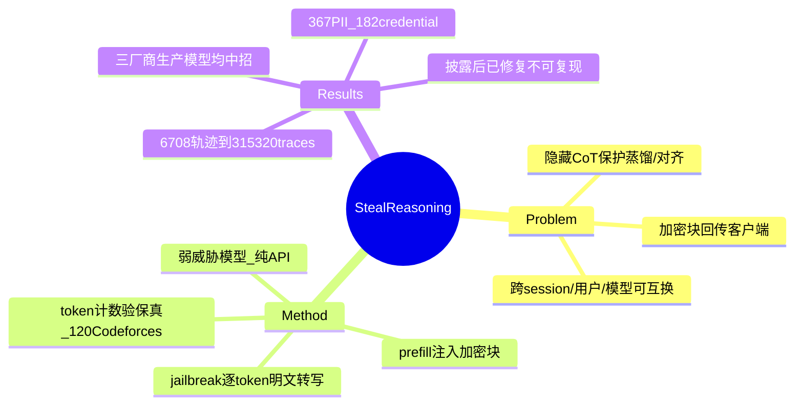

## Summary
主流 LLM 提供商把 reasoning trace（CoT）以加密块形式返回客户端、且这些块跨 session / 用户 / 模型可互换；攻击者把强模型的加密 reasoning 注入到同一生态内的弱模型、再用 jailbreak 逼其逐 token 明文转写，即可窃取本应对用户隐藏的推理内容，并据此展开四类下游攻击。

## Problem & Motivation
为遏制蒸馏、保护安全对齐信号，OpenAI、Anthropic、Google 等只把 reasoning summary 展示给用户，真正的完整 CoT 被隐藏。但为在多轮对话中保持推理连续性，这些 CoT 并非只存服务器端，而是以**加密文本块**回传给客户端，下一轮再由客户端带回。本文指出（在 Green 2026 已发现该加密块可被同模型解码的基础上）一个更严重的扩展：这些加密块在**同一 provider 生态内跨 session、跨用户、甚至跨模型**完全兼容且可互换（Sec 2.3），把一个本地元数据问题升级为可规模化的信息窃取通道。

## Method
威胁模型很弱（Sec 2.1）：攻击者**无需**厂商内部权限、**无法**观察服务器端状态、**没有**模型权重，只有普通 API 访问。核心攻击 pipeline（Sec 2.4，Fig 2）：
1. 从强目标模型（如 Claude Opus 4.8）的 API 响应中取得加密 reasoning block。
2. 通过 current-turn 或 past-turn **prefilling**，把该加密块注入到同生态内一个兼容但更弱的模型（如 Haiku 4.5）的上下文。
3. 用 jailbreak prompt 逼弱模型把插入的 reasoning **逐 token 解码并明文转写**输出。

由此弱模型充当"解密预言机"，输出强模型隐藏的原始推理。保真度不是用成功率百分比衡量，而是把 API 上报的 thinking-token 数与"提取出的 reasoning 重新编码为输入后的 token 数"在 120 道 Codeforces 题上对比，二者在所有测试模型上贴近（Sec 2.4）。基于此漏洞演示四类攻击向量：(a) 跨厂商规模化 reasoning 蒸馏（绕过 anti-distillation）；(b) 从公开 agent 轨迹中提取第三方隐私/密钥；(c) 借加密块做隐蔽 prompt injection；(d) 经 reasoning 暴露实现越狱。

## Key Results
- **跨模型窃取普遍可行**：在 Anthropic（Claude Fable 5、Opus 4.8、Sonnet 系列、Haiku 4.5）、OpenAI（GPT-5.6 变体、GPT-5、GPT-5-mini、o4-mini）、Google（Gemini 3.x 系列）三家的生产模型上均验证成功（Table 1）；论文未涉及 o1/o3。
- **第三方隐私泄露（Sec 4.1）**：从 GitHub 与 Hugging Face 收集 **6,708** 条公开 agent 轨迹，重建出 **315,320** 条 reasoning traces，从中恢复 **367** 项 PII 与 **182** 项 credential；具体样例含 62 个 API key、33 个密码、24 个 access token、7 个 private key（均为 credential），以及 30 个个人邮箱（属 PII）。
- **提取保真度高**：thinking-token 计数与重编码提取结果贴近（120 Codeforces 题，Sec 2.4）；无显式攻击成功率数字。
- **现状**：负责任披露后，截至 2026-08 厂商已上线缓解措施，Fig 1 结果**不再可复现**（Reproducibility Statement）。防御建议（服务器端存储、加密上下文绑定、基础设施 guardrail、provider 侧撤销、模型级拒答训练；Sec 5.5 / Appendix A）为 defense-in-depth 提案，论文**未做实证评估**其有效性。

## Evidence Ledger

| Claim ID | Claim | Type | Source locator | Evidence excerpt | Status |
|:--|:--|:--|:--|:--|:--|
| C1 | 加密 reasoning block 回传客户端且跨 session/用户/模型可互换 | causal-mechanism | Sec 1 / Sec 2.3 | "fully compatible and interchangeable across different sessions, users, and models" | source-verified |
| C2 | 攻击=把强模型加密块 prefill 进弱模型并逼其逐 token 明文转写 | causal-mechanism | Sec 2.4 / Fig 2 | "port reasoning ... into ... a compatible but weaker model, which we coerce into transcribing ... token-by-token" | source-verified |
| C3 | 威胁模型：无内部权限、不可观察服务器状态、无模型权重 | benchmark-setting | Sec 2.1 | "does not require insider access ... cannot observe server-side states ... has no access to the proprietary model weights" | source-verified |
| C4 | 保真度=thinking-token 计数对比，120 道 Codeforces；无成功率百分比 | number | Sec 2.4 | "compare the API's reported thinking-token counts against ... extracted reasoning ... on a set of 120 Codeforces problems" | source-verified |
| C5 | 6,708 轨迹→315,320 traces→367 PII+182 credential（含 62 API key 等） | number | Sec 4.1 | "6,708 ... trajectories"; "315,320 reconstructed"; "367 ... PII ... 182 credentials" | source-verified |
| C6 | 在 Anthropic/OpenAI/Google 生产模型上验证成功 | benchmark-setting | Table 1 | "Fable 5, Opus 4.8, Sonnet 5 ... Haiku 4.5"; "GPT-5.6-sol ... o4-mini"; "Gemini 3.1 Pro ..." | source-verified |
| C7 | 在 Green 2026 基础上扩展，含四类攻击向量 | sota-novelty | Sec 1 | "Building on prior research by [Green 2026] ... a devastating extension of this flaw" | source-verified |
| C8 | 截至 2026-08 因厂商缓解 Fig 1 已不可复现 | number | Reproducibility Statement | "As of August 2026, the results ... in Figure 1 are no longer reproducible ... mitigations implemented by providers" | source-verified |
| C9 | 提出多层防御但未实证评估其有效性 | causal-mechanism | Sec 5.5 / Appendix A | "propose several defense-in-depth strategies spanning architectural, cryptographic, and model-level interventions" | source-verified |

## Strengths & Weaknesses
**亮点**：(1) 问题重要且威胁模型极弱——纯 API 访问即可跨模型窃取隐藏 CoT，把"客户端加密块"这一工程便利性直接转成系统性攻击面，切中 reasoning-model 商业化的核心保密假设。(2) 从机制到规模化危害闭环：不仅演示单点提取，还用 315,320 条真实轨迹量化了 PII/credential 泄露，说明危害已在野发生而非纯理论。(3) 责任披露到位，厂商已修复，属高影响的建设性安全工作。

**局限/存疑**：(1) 保真度用 thinking-token 计数代理，而非对"提取内容是否等于真实 CoT"的 ground-truth 语义比对，faithfulness 证据偏间接，无显式成功率。(2) 防御措施均为提案，未实证评估——修复后攻击是否被彻底堵死、还是仅提高成本，尚无数据。(3) 结果依赖 2026-08 前的 provider 实现，可复现窗口已关闭，外部复核受限（这也是 not-checkable 风险的来源，但本文的机制/数字在披露时点原文自洽）。(4) 与我的核心方向（GUI/VLM/Agent/Embodied）关联偏弱，价值主要在 agent 轨迹隐私与蒸馏防护的横向借鉴。

## Mind Map

## Notes
- Cross-links（主题相关，非同一漏洞）：GUI/agent 安全侧的间接 prompt injection 工作 [[Papers/2505-EVA- Red-Teaming GUI Agents via Evolving Indirect Prompt Injection]]、[[Papers/2409-EIA]]；本文的 (c) 隐蔽 prompt injection 向量可与它们对读。
- 对本 vault 研究方向的可迁移点：第三方从公开 agent 轨迹恢复 PII/credential，提示 agent trajectory 数据集（含 harness/CUA 相关）在发布前需做泄露审计；"reasoning 明文可被跨模型提取"也削弱了靠隐藏 CoT 来防蒸馏的假设。
- 待核实/开放问题：faithfulness 缺 ground-truth 语义比对；防御未实证；o1/o3 等更早 reasoning 模型是否同样脆弱论文未覆盖。