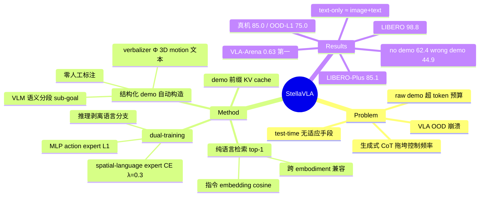

## Summary

StellaVLA 针对 VLA 的 OOD 崩溃问题，在 test time 检索一条与当前指令最相近的 expert demonstration，将其转成结构化前缀（task plan + sub-goal 关键帧描述 + verbalized 3D motion 文本，全部由 off-the-shelf VLM 加确定性 verbalizer 零人工标注自动生成）注入 Qwen3-VL backbone。训练时 MLP action expert（L1 回归）与自回归 spatial-language expert（CE，λ=0.3）双目标并行，推理时语言分支完全剥离、单次前向输出 action chunk，配合 demo 前缀 KV cache 保住实时控制。VLA-Arena overall 0.63 居榜首（π0.5 0.44），LIBERO 平均 98.8%，LIBERO-Plus zero-shot 85.1%。

## Problem & Motivation

VLA 以 behavior cloning 为主的训练把指令当成不透明的条件串记忆，一旦测试分布偏离训练分布（新物体、新布局、新任务措辞）性能骤降，而现有模型在 test time 没有任何适应手段——权重冻结、输入格式固定。LLM 社区成熟的 in-context learning 提示了一条免再训的适应路径，但直接把 demonstration 以原始视频轨迹形式塞进上下文既超 token 预算又信息稀疏。论文的切入点是：demonstration 的有效信息可以被压缩为结构化语言（做什么、分几步、末端执行器怎么动），且这种压缩可以全自动完成；同时要避免为了引入语言而付出自回归解码的推理时延（生成式 CoT 会把控制频率拖垮）。

## Method

**1. 结构化 demonstration 自动构造（Sec 3.1）**。离线 pipeline 把每条 raw expert trajectory 转成 rationale-augmented 形式，零人工标注。两个通道：(a) 语义通道——用 off-the-shelf VLM（论文以 Qwen3-VL 为例）把连续轨迹分解成 K 个语义段，并为每段生成 sub-goal 描述（如 "Reach for the handle of the blue mug"）；(b) 运动通道——一个确定性 verbalizer 函数 Φ 把任意 action span 映射为工作空间 3D 位移文本（如 "Move the end-effector by Δx=+0.05, Δy=-0.02, Δz=+0.10"）及其在图像平面的 2D 投影。最终每条 demo 表示为 task plan + 一串 subgoal（各含 keyframe、robot state、2D trace、3D motion）。

**2. 纯语言检索（Sec 3.2 / Appendix A）**。按任务指令 language embedding 的 cosine similarity 从 demonstration pool 检索 top-1 rationale-augmented 轨迹（训练期对目标轨迹做 leave-one-out）。检索不用任何视觉特征，因此另一 embodiment（human hand / XR）录制的 demo 可以被机器人 episode 检索到。

**3. Dual-training 与推理路径分离（Sec 3.2-3.3）**。输入为 [demo 前缀 ⊕ 指令 ⊕ 当前观测]。训练时两个 head 并行：轻量 MLP action expert 以 L1 loss 回归未来 H 步 action chunk；原生自回归 LM head（spatial-language expert）以 cross-entropy 预测当前 subtask 与 verbalized movement，总 loss 为 L_act + λL_lang（λ=0.3）。推理时 spatial-language expert 整个剥离，只走 backbone + MLP 单次前向——语言监督只作为训练期表征塑形信号，不在推理时生成。

**4. Demo 前缀 KV cache（Sec 3.3）**。检索到的 demo 前缀在 episode 内不变，其 KV cache 在 t=1 计算一次后全程复用，摊薄长前缀的代价。

架构上 StellaVLA = Qwen3-VL-4B backbone + OpenVLA-OFT 式 MLP action expert，从 Qwen3-VL-4B-Instruct 全参微调（Sec 4.1）。

## Key Results

| Benchmark | StellaVLA | 对比 | 出处 |
|:--|:--|:--|:--|
| VLA-Arena（overall，截至 2026-08-01 榜单） | **0.63** | π0.5 0.44；LingBot-VLA 0.22（注：0.22 为 Table 2 所列 baseline 中最低，OpenVLA-OFT 0.39、Evo-Depth 0.41 均高于它） | Table 2 |
| LIBERO 平均 | **98.8%**（Spatial 99.6 / Object 99.0 / Goal 99.6 / Long 96.8） | ACoT-VLA 98.5、StarVLA-OFT 96.6 | Table 1 |
| LIBERO-Plus（LIBERO 训练、zero-shot 扰动） | **85.1%** | StarVLA-OFT 75.0；最大增益 camera viewpoint +23.5 | Table 3 |
| 真机（AgileX Piper） | in-distribution **85.0%**，OOD-L1（物体属性）**75.0%** | — | Figure 4 |

关键 ablation：
- **Demo 依赖性（Table 5）**：correct demo 98.8% → 去掉 demo 62.4% → 换成 wrong-task demo 44.9%。性能确实来自 demo conditioning，且错误检索比没有 demo 更糟。
- **Demo 模态（Table 7，evaluation-time block）**：text-only 98.8/84.4（LIBERO/LIBERO-Plus）几乎持平 image+text 98.8/85.1；image-only 掉到 92.9/75.7——结构化文本承载了 demo 的绝大部分有效信息。
- **时延（Table 8）**：无 demo 64ms；image+text demo 无 cache 183ms、cache 后 91ms；若推理时联合自回归解码语言则 3177ms（对比 action-only cached 88ms，约 36 倍）。实机 pipeline 约 205ms/action chunk。

跨 embodiment 数据（Sec 4.3）：125 条真机遥操作 episode（71,702 帧）+ 26 条 human-hand XR 录制与 26 条 XR-retargeted 轨迹（各 10,996 帧对齐数据集），三种来源的 demo 前缀给出几乎一致的动作预测。

## Evidence Ledger

| Claim ID | Claim | Type | Source locator | Evidence excerpt | Status |
|:--|:--|:--|:--|:--|:--|
| C1 | VLA-Arena（截至 2026-08-01）overall 0.63 排名第一，对比 π0.5 0.44、LingBot-VLA 0.22 | number/comparison | Abstract; Table 2; Sec 4.2.2 | "StellaVLA ranks first with an overall score of 0.63, versus 0.44 and 0.22 for the strong prior models" | source-verified |
| C2 | LIBERO 平均 98.8%（99.6/99.0/99.6/96.8） | number | Table 1; Sec 4.2.1 | "StellaVLA (Ours) 99.6 99.0 99.6 96.8 98.8" | source-verified |
| C3 | LIBERO-Plus 平均 85.1%，超 StarVLA-OFT 10.1 点，最大增益 camera viewpoint +23.5 | number/comparison | Table 3; Sec 4.2.3 | "reaches 85.1% on average, outperforming StarVLA-OFT by 10.1 points. The largest gains occur under camera viewpoint (+23.5)" | source-verified |
| C4 | 结构化 demo 零人工标注自动生成：VLM 分段生成 sub-goal，确定性 Φ 生成 3D 位移与 2D 投影文本 | causal-mechanism | Sec 3.1 | "off-the-shelf Vision-Language Model (e.g., Qwen3-VL)…decompose the continuous trajectory into K discrete, semantically meaningful segments"; "single deterministic verbaliser Φ" | source-verified |
| C5 | 检索按指令 language embedding cosine similarity 取 top-1，纯语言故可跨 embodiment | causal-mechanism | Sec 3.2; Appendix A | "top-1…ranked by cosine similarity between the language embeddings of the task instructions. Retrieval is therefore purely linguistic" | source-verified |
| C6 | dual-training：MLP action expert L1 + 自回归 spatial-language expert CE（λ=0.3）联合；推理剥离语言分支单次前向 | causal-mechanism | Sec 3.2-3.3; Sec 4.1 | "action expert regresses an action chunk under an L1 objective…spatial-language expert is trained by cross-entropy (weight λ=0.3)" | source-verified |
| C7 | 时延：无 demo 64ms / 无 cache 183ms / cache 后 91ms / 联合语言解码 3177ms / 实机约 205ms/chunk | number | Table 8; Sec 4.5; Appendix B | "without a demonstration takes 64 ms…183 ms without a cache…steady-state cost to 91 ms…3177 ms…approximately 205 ms per action chunk" | source-verified |
| C8 | 跨 embodiment 数据：125 条遥操作（71,702 帧）+ 26 条 human-hand XR（10,996 帧）+ 26 条 XR-retargeted；平台 6-DOF AgileX Piper | benchmark-setting | Sec 4.3; Appendix B | "6-DOF AgileX Piper…125 teleoperated robot episodes (71,702 frames)…Twenty-six human-hand takes recorded in XR" | source-verified |
| C9 | LIBERO ablation：correct demo 98.8% vs no demo 62.4% vs wrong-task demo 44.9% | number | Table 5; Sec 4.4 | "Removing the demonstration reduces the average success rate from 98.8 to 62.4, while providing a wrong-task demonstration further lowers it to 44.9" | source-verified |
| C10 | 真机 in-distribution 85.0%，OOD-L1 75.0% | number | Sec 4.3; Figure 4 | "StellaVLA reaches 85.0% success in distribution and 75.0% on OOD-L1 (Figure 4)" | source-verified |
| C11 | 架构：Qwen3-VL-4B backbone + OpenVLA-OFT 式 MLP action expert，从 Qwen3-VL-4B-Instruct 全参微调 | causal-mechanism | Sec 4.1 | "couples a Qwen3-VL-4B backbone with an OpenVLA-OFT-style MLP action expert…fully fine-tuned from Qwen3-VL-4B-Instruct" | source-verified |
| C12 | demo 模态 ablation：text-only 98.8/84.4 ≈ image+text 98.8/85.1；image-only 92.9/75.7 | number | Table 7; Sec 4.4 | "text-only demonstrations nearly match the full image+text input, achieving 98.8/84.4 compared with 98.8/85.1…image-only demonstrations decrease performance to 92.9/75.7" | source-verified |

## Strengths & Weaknesses

**亮点**

- **Demo 依赖性 ablation 是全文最有信息量的证据**（Table 5）：98.8 → 62.4 → 44.9 的三段对照证明性能确实来自 demo conditioning 而非参数记忆，同时划出部署边界——检索错 demo 比不给 demo 更糟，论文对此不回避。
- **text-only ≈ image+text**（Table 7）：结构化文本 rationale 承载了 demo 的几乎全部有效信息，image-only 大幅掉点（92.9/75.7）。这是对 "verbalized 3D motion 设计有效" 的直接支撑——起作用的是语言化的运动结构，不是 demo 像素。
- **语言用在训练期而非推理期**：语言监督作为表征塑形信号（λ=0.3 辅助 loss），推理时整支剥离，绕开自回归解码的 36 倍时延。与 [[2608-InContextVLA]]（VLA-Talker）的 "注入优于生成" 结论从不同路径收敛到同一 pattern。
- **纯语言检索换来跨 embodiment 兼容**：human/XR demo 无需视觉对齐即可被机器人 episode 检索并利用，三种来源动作预测几乎一致（Table 4）。方法整体简洁：检索 + 前缀 + 双头训练，没有新增可训练检索器或复杂对齐模块。

**局限与批判**

- **"strong prior models" 的措辞有选择性呈现之嫌**：LingBot-VLA 0.22 是 Table 2 所列 baseline 中 overall 最低（OpenVLA-OFT 0.39、Evo-Depth 0.41 均高于它），abstract 把它与 π0.5 并列为强对照放大了差距观感（verifier 核实）。对 π0.5 的 0.44 差距（+0.19）本身仍是实质的。
- **"test-time adaptation" 的实际边界**：主要评测中检索池就是训练 demo 池，论文未演示 "全新任务只插入一条新 demo、不更新权重" 的 training-free 扩展；真机 OOD-L2（unseen task）进度分仅 1.9/4。机制上前缀是 in-context 的、原则上可插拔，但这一最有想象力的用法缺少直接实验（推测：OOD-L2 下检索到的只是近邻任务 demo）。
- **能力外包给 demo 前缀是双刃剑**：no-demo 62.4% 远低于无 demo 训练的 baseline（StarVLA-OFT 在 LIBERO 96.6%），说明模型把大量任务知识放进了上下文通路，检索基础设施成为部署单点故障。注意该数字是 "训练带 demo、测试去掉" 的 mismatch 条件，不能解读为无 demo 训练范式的上界。
- **自动标注质量未审计**：Qwen3-VL 生成的分段与 sub-goal 描述没有人工质检或标注噪声敏感性分析（全文未见相关报告）。
- **纯语言检索的失配风险**：同指令不同场景布局时检索无法区分，motion 层面的近邻可能失配；结合 wrong-demo 44.9% 的结果，这是真实部署中的主要风险面。

## Mind Map

## Notes

- 与 [[2608-InContextVLA]]（VLA-Talker）构成一组有价值的跨论文 pattern：两者都拒绝推理时生成语言，但语言进入 VLA 的位置相反——VLA-Talker 放在输入侧（工具链产出的空间证据注入 prompt），StellaVLA 放在监督侧与上下文侧（训练期辅助 loss + demo 前缀）。合并的假设是：**语言对低层控制的价值在输入结构化与训练期表征塑形，不在推理时自回归生成**。值得在 VLA survey 里立为一条 claim 并持续检验。
- action expert 血缘来自 [[2502-OpenVLA-OFT]] 的 MLP 并行解码路线。
- 悬而未决的问题：如果把一条全新任务的 human XR demo 直接插入检索池（不再训练），OOD-L2 的 1.9/4 能提升多少？这是该框架最自然的下一步实验，论文未做。
