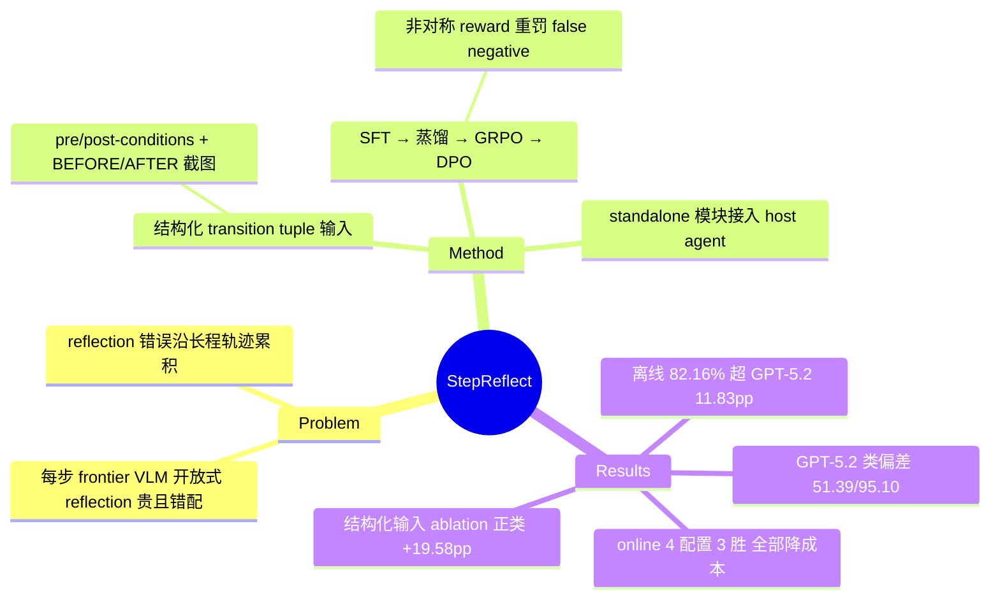

## Summary

StepReflect 把 mobile GUI agent 的 per-step reflection 从"每步调 frontier VLM 做开放式多模态推理"重构为**条件于显式 transition specification 的结构化监督预测**：输入 pre/post 状态描述 + pre/post-conditions + 执行的 action + BEFORE/AFTER 截图，输出 binary consistency 判定与 rationale。8B 模型（Qwen3-VL-8B）经 SFT → teacher-student distillation → GRPO → DPO 四阶段训练后，在 AndroidWorld 离线 reflection 测试集（1,082 条人工核验 transition）上达 82.16%，超 zero-shot GPT-5.2 达 11.83 个百分点，并在四个 online agent 配置中三个提升任务成功率、全部降低 API 成本。

## Problem & Motivation

长程 GUI 任务要求 agent 每步判断"执行的 action 是否产生了预期的界面转换"，小的 reflection 错误会累积，让 agent 在错误状态上继续执行。现有 agent（M3A、Mobile-Agent-E 等路线）把 reflection 当作通用推理问题，每步 query 大型 VLM 做开放式判断——既贵，又与 GUI state transition 高度结构化、可预测的本质错配。作者由此提出重构：reflection 归结为"观察到的 UI transition 是否与当前任务语境下该 action 的预期效果一致"的结构化预测，把 state-awareness 显式带入 reflection 任务，而非依赖模型的自由推理。

## Method

**输入表示（transition tuple）**：pre/post-action 状态（描述 + pre/post-conditions）、executed action、bounded history（≤5 步、限同一 subgoal）、BEFORE/AFTER 两张截图。输出为 binary consistency 决策 + 自然语言 rationale。

**训练管线（四阶段）**：
1. **SFT**：882 条 transition（来自 Mobile-Eval-E 与 SPA-Bench；517 正 / 365 负）。标签由 GPT-5.2 复现 Agent-SAMA 的 reflection prompting 产生初判，再经人工 audit 纠正意图混淆、中间进度、视觉证据、任务完成等易错情形。
2. **Teacher-student distillation**：以 GPT-5.2 为 teacher 蒸馏 rationale 模板。
3. **GRPO**：非对称 reward——正确 "Yes" +2.5、正确 "No" +2.0、false positive −2.0、false negative −2.5（对漏报失败罚更重）。
4. **DPO**：偏好精炼。ablation 显示 GRPO→DPO 顺序（82.16%）优于 DPO→GRPO（80.41%）。

**集成方式**：作为 standalone 模块接入不同 agent 框架，一个 lightweight prompting interface 把 host agent 已有输出映射到结构化状态表示，不修改 host 的 planning/policy。M3A 中判定注入为 `SUCCESS: <reason>` / `FAILED: <reason>`；Agent-SAMA 中 Yes/No 映射到其 outcome 类型。base model 覆盖 Qwen2.5-VL（3B/7B）与 Qwen3-VL（4B/8B）。

## Key Results

**Offline（AndroidWorld，1,082 条人工核验 transition）**：

| 模型 | Overall | Positive | Negative |
|:--|:--|:--|:--|
| StepReflect（Qwen3-VL-8B 最终版） | **82.16%** | 86.79% | 76.12% |
| GPT-5.2 zero-shot（同结构化输入） | 70.33% | 51.39% | 95.10% |
| GPT-4o zero-shot | 66.17% | 51.88% | 84.86% |

最有信息量的是类偏差：zero-shot frontier model 做 reflection 时强烈偏向报失败（GPT-5.2 负类 95.10% vs 正类仅 51.39%），意味着大量 false negative 会打断本来正常的执行；StepReflect 的类间平衡（86.79/76.12）才是相对 GPT-5.2 +11.83 pp 的主要来源。

**Online（task success rate）**：M3A on AndroidWorld 44.44% vs 38.89%（GPT-5.2 reflection）；MobileWorld 上 MAI-UI-8B 29.91% vs 25.64%、Seed-2.0-Pro 41.88% vs 34.19%；Agent-SAMA 55.56% vs 58.33%（唯一落后，差一个任务量级）。API 成本：M3A 从 $30.00 降到 $22.80（省 24.0%）、Agent-SAMA 从 $46.00 降到 $37.50（省 18.5%）。

**Ablation**：去掉结构化 pre/post-conditions（改 description-only 输入）overall 掉 4.25 pp（82.16→77.91），正类掉 19.58 pp（86.79→67.21）——结构化 specification 是最大单项增益来源。

## Evidence Ledger

| Claim ID | Claim | Type | Source locator | Evidence excerpt | Status |
|:--|:--|:--|:--|:--|:--|
| C1 | 最终 8B 模型（SFT→TS-Dis.→GRPO→DPO）AndroidWorld 离线 82.16% | number | p.1 Abstract; p.6 Table 2 | "the resulting 8B model achieves 82.16% transition-level accuracy on AndroidWorld" | source-verified |
| C2 | 超 GPT-5.2（70.33%）11.83 pp、GPT-4o（66.17%）15.99 pp，同结构化输入 | comparison | p.1 Intro; p.5 Table 1 | "exceeding zero-shot GPT-4o (66.17%) and GPT-5.2 (70.33%) by 15.99 and 11.83 percentage points" | source-verified |
| C3 | 离线测试集 1,082 条人工核验 transition（613 正 / 469 负） | benchmark-setting | p.4 Sec 4.1; p.5 Table 1 caption | "1,082 manually verified transition-level instances, including 613 positive samples (56.7%) and 469 negative samples (43.3%)" | source-verified |
| C4 | 训练集 882 条 transition 来自 Mobile-Eval-E 与 SPA-Bench（517 正 / 365 负） | benchmark-setting | p.4 Sec 3.4; p.8 App A.2 | "882 transition-level instances (517 positive, 58.6%; 365 negative, 41.4%)" | source-verified |
| C5 | Online：M3A 44.44 vs 38.89；Agent-SAMA 55.56 vs 58.33（落后）；MAI-UI-8B 29.91 vs 25.64；Seed-2.0-Pro 41.88 vs 34.19 | number | p.7 Table 3; p.10 Tables 9-10 | "M3A ... StepReflect 44.44 ... Agent-SAMA ... 58.33 ... 55.56; MAI-UI-8B ... 29.91; Seed-2.0-Pro ... 41.88" | source-verified |
| C6 | API 成本：M3A 省 $7.20（24.0%）、Agent-SAMA 省 $8.50（18.5%） | number | p.6 Sec 4.2 | "from $30.00 to $22.80, a saving of $7.20 (24.0%); on Agent-SAMA ... a saving of $8.50 (18.5%)" | source-verified |
| C7 | description-only 输入使 overall 掉 4.25 pp、正类掉 19.58 pp | comparison | p.7 Sec 4.3 + Table 4 | "reduces Overall SR by 4.25 percentage points (82.16%→77.91%) and Positive SR by 19.58 points" | source-verified |
| C8 | 类偏差：GPT-5.2 正类 51.39% / 负类 95.10%；StepReflect 86.79% / 76.12% | number | p.5 Table 1; p.6 Table 2 | "GPT-5.2 ... 51.39 ... 95.10"; "StepReflect 82.16 86.79 76.12" | source-verified |
| C9 | 部署时 transition specification 由 host agent 输出经 prompting interface 映射产生，无人工标注 | causal-mechanism | p.3-4 Sec 3.2/3.3; p.9 App C.4 | "a lightweight prompting interface maps each host agent's existing outputs onto the structured state representation" | source-verified |
| C10 | GRPO 非对称 reward（+2.5/+2.0/−2.0/−2.5）；GRPO→DPO（82.16）优于 DPO→GRPO（80.41） | benchmark-setting | p.4 Sec 3.3; p.8 App B.1; p.7 Table 4 | "rewards of +2.5 and +2.0 ... false positives and false negatives incur penalties of -2.0 and -2.5" | source-verified |
| C11 | 训练标签 = GPT-5.2 初判 + 人工纠正；测试标签独立人工核验；online AndroidWorld 只用 36/116 个 medium-difficulty 任务 | benchmark-setting | p.4 Sec 3.4/4.2; p.8 App A.2/A.4; p.7 Sec 5 | "authors then audit and correct these initial judgments"; "fixed subset of 36 medium-difficulty tasks" | source-verified |

## Strengths & Weaknesses

**亮点**：
- 问题重构本身简洁有力：GUI transition 是结构化、可枚举后果的事件，把 reflection 从开放式推理降为结构化预测，符合"简单方法解决被错误复杂化的问题"的品味。8B 本地模型可部署替代每步 frontier 调用，成本证据具体（省 18.5-24%）。
- **frontier model 做 per-step reflection 的类偏差是本文最可复利的数据点**：GPT-5.2 负类 95.10% / 正类 51.39%——zero-shot reflection 不是"不准"而是"系统性报忧"，一半正常步骤会被误判为失败。这为"reflection 组件不能直接用通用大模型 prompting 凑合"提供了定量证据，直接支持 [[Topics/Harness-Component-Attribution]] 的组件归因线。
- 非对称 reward 设计（FN 罚 −2.5 重于 FP 的 −2.0）对准 reflection 的真实代价结构：漏报失败让 agent 带错前行，比误报更贵。

**局限与内在矛盾**：
- **已知（App C.4，最关键）**：online 部署时 host agent 并不暴露可靠的 pre/post-conditions，实际用的是省略这些字段的 description-only prompt——而 ablation 显示结构化 conditions 恰是最大增益来源（正类 +19.58 pp）。即离线最优配置在真实部署中不可得；online 增益是"次优输入"版本取得的。这一方面说明方法有冗余鲁棒性，另一方面说明"结构化 specification 的可得性"这个方法前提在现有 agent 框架里并不成立，是被论文标题掩盖的未解决问题。
- **已知**：规模小——训练仅 882 条 transition、online 仅 AndroidWorld 36/116 个 medium-difficulty 任务、单次 run 无方差报告；Agent-SAMA 上落后于 GPT-5.2（差约一个任务）。训练标签源自 GPT-5.2 初判 + 人工纠正，teacher 与被超越的 baseline 是同一模型，蒸馏来源与对照存在循环性（作者以人工 audit 缓解，但 audit 一致性未报告）。
- **推测**：泛化到 web/desktop（更大的 action 空间、更复杂的 transition 类型）未验证；训练/测试均在 Android 移动生态，"结构化 transition"假设在自由布局的桌面应用上可能变弱。

## Mind Map

## Notes

- 与 [[Topics/AgentHarness-Design]] 的 reflection/verifier 设计轴直接相关：本文给出"结构化 vs 开放式 reflection"的成对定量证据，可作为该轴的 anchor citation。
- 与 [[2501-InfiGUIAgent- A Multimodal Generalist GUI Agent with Native Reasoning and Reflection]] 对照：InfiGUIAgent 把 reflection 内化进 agent 自身推理（native），本文把 reflection 外置为独立结构化模块——同一功能的两种架构位置，适合进 [[Topics/CUA-Survey]] 时作为对比对写。
- 待跟进的矛盾信号：pre/post-conditions 在离线是最大增益来源、在 online 部署却不可得。如果后续有工作让 planner 原生输出可检验的 transition specification（类似 contract/assertion），这条线会闭合；目前是 open gap。
