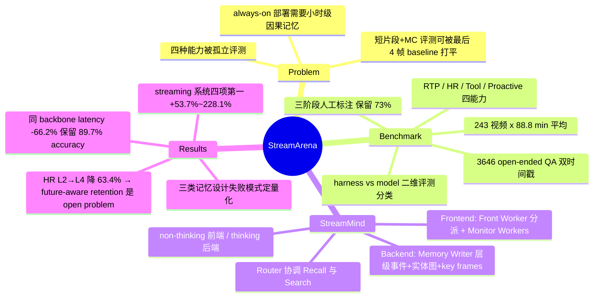

## Summary

StreamArena 是首个在连续 audio-visual 流上联合评测 real-time perception、historical retrospection、proactive interaction、multimodal tool use 四种能力的小时级 open-ended benchmark（243 个平均 88.8 分钟的完整视频、3,646 个带双时间戳的人工验证 QA），直接针对"短片段 + 多选题评测可被只看最后 4 帧的 minimal baseline 打平"（Shen et al. 2026 的先行诊断）这一失效模式设计。配套提出 StreamMind 两层架构：frontend workers 负责低延迟交互与主动监控，backend workers 异步构建持久多模态记忆并执行检索与外部搜索；它在四项能力上均列 streaming 系统第一（相对最强对应 baseline 提升 53.7%–228.1%），并在同 backbone 下把 pooled query-to-answer latency 相对降低 66.2%。

## Problem & Motivation

现有 streaming video 评测与部署需求脱节：短片段 + multiple-choice 的设计引入 recency shortcut 与 language prior，以致一个只处理最后 4 帧的 minimal baseline 就能在这类 benchmark 上打平复杂 streaming 模型（引自 Shen et al. 2026 的分析，本文以此为动机而非自证）；同时 long-video 理解、online perception、proactive response 各自被孤立评测，高分并不代表对小时级流的持续因果理解。真实部署（穿戴设备、具身机器人）要求 always-on：无界流式摄入、自主固化历史记忆、自主决定何时开口/调工具/保持沉默。StreamArena 的应对是：(1) 小时级完整视频而非片段；(2) 全部 open-ended 生成，消除选项线索；(3) query 与每段 supporting evidence 分别标注时间戳，强制 causal access、可度量 evidence-to-query gap、并给 proactive 任务规定预期响应时刻；(4) 同视频内问题保持对话连续性以支持 multi-turn。

## Method

**Benchmark 构建。** 视频源自 YouTube 七个 domain（Film & TV 66、Tutorial 57、Press Conference 43、E-commerce Live 21、Egocentric 20、Sports 19、Meeting & Interview 17），每个 ≥60 分钟、≥1080p。标注管线三阶段：30 名 PhD-level 标注者每视频起草约 20 个 QA → 两名独立 cross-validator 仅凭视频作答并纠错 → 第三名独立标注者盲审，保留约 73% 草稿，得到每视频约 15 个、共 3,646 个 QA。四类任务：RTP（query 附近短窗内的联合视听 grounding）、HR（回溯早期证据，按 evidence-to-query gap 分 L1–L4 四层，并标注 single-point / multi-count / multi-recall / multi-compare / temporal-range 五种 reasoning pattern）、Tool（答案不在流内也不在参数记忆里，需 Google 文本/图像/crop 检索，报告的是 tool-enabled end-to-end answer accuracy，不验证工具是否真被调用）、Proactive（用户先注册监控指令，事件发生时无新 prompt，agent 须自主报警，正确性同时要求内容与触发时刻合规，且计时排除 decoding 延迟以隔离 temporal vigilance）。判分用 Gemini 3.1 Pro 做严格二值 factual-core 判定。

**评测协议分类（Appendix C.1，对 harness 审计有独立价值）。** 作者把系统沿两个正交维度分类：harness dimension（query-triggered replay——每题按需重建 causal prefix 或 recent window、跨题不保留视频状态 vs continuous ingestion——帧按固定速率单次消费、状态因果递归演化）与 model dimension（non-causal vs causal attention）。所有 baseline 实际都是 replay 类；只有 StreamMind 是真连续摄入（2 fps、ring buffer、永不回带，reactive 查询时暂停视频时钟防止推理延迟污染后续时间戳）。

**StreamMind 架构。** 两层解耦：frontend 的 Front Worker 是交互网关与分派器（三路：上下文足够则直答；需历史/外部证据则向 backend 发 retrieval brief；用户要求监控未来条件则实例化 Monitor Worker），每个 Monitor Worker 独立生命周期、条件满足才通知，不阻塞无关交互。backend 的 Memory Writer 与查询无关地持续把帧与语音固化进 Memory Bank——层级事件（micro → macro → super event）、entity relation graph、代表性 key frames 三部分，保留紧凑语义结构的同时保住可检索的视觉证据；Router Worker 把任务分解为并发的 Recall（在事件层级与实体图上的六种内容寻址检索工具）与 Search（Google 文本搜索、整帧/crop 反向图像搜索，crop 沿用 HyperEyes 协议）子任务并做多轮 ReAct 协调，支持"先 Recall 找回早期 key frame、再以其为视觉锚做 Search"的多级请求。Front Worker 用 non-thinking、backend workers 用 thinking 模式，全部共享同一个 Qwen3.5-397B-A17B vLLM endpoint。

## Key Results

- **主表（Table 3）**：StreamMind 得 RTP 44.5 / HR 34.9 / Tool 56.1 / Pro 11.6，四项均列 streaming 系统第一；相对各能力最强 streaming baseline 的相对提升为 RTP +58.4%（vs AURA 28.1）、HR +53.7%（vs AURA 22.7）、Tool +228.1%（vs MiniCPM-o-4.5 17.1）、Pro +54.7%（vs MiniCPM-o-4.5 7.5）。
- **三类 streaming 记忆设计的失败模式被定量化**：recent-window 的 AURA HR 从 L1（<5 min）25.4 崩到 L4（>30 min）10.5；text-summary 的 VST HR 21.2 且不支持 Pro/Tool；model-internal compression 的 StreamForest HR 14.4，ThinkStream 四项 8.0 / 7.5 / 1.8 / 1.2 接近失效。
- **Offline turn-based MLLM 纯 accuracy 仍更强**：Gemini 3.5 Flash RTP 51.3 / HR 51.4 / Tool 70.8；同 backbone 的 offline Qwen3.5-397B-A17B pooled 54.2 vs StreamMind 48.6（保留 89.7%）——但 offline 模型不支持 proactive 且不维护流式状态。
- **人类参照**：RTP 91.8 / Tool 95.2 / Pro 91.5；HR 可回看 80.7 → 不可回看（streaming 条件）63.4，说明小时级流式记忆对人也难。
- **Latency（Table 4，同 backbone 对照）**：pooled query-to-answer latency 81.4s → 27.5s（相对 −66.2%；分项 RTP −84.6% / HR −73.9% / Tool −55.3%），来源是把持久感知与记忆构建移出 response-critical path 的状态复用，而非白拿的算力。
- **Benchmark 诊断（616 题子集，Table 5 / Fig. 3）**：ASR-only 总体仅 30.5 vs visual-only 50.0 vs 双模态 51.3；RTP 上 ASR-only 只有 4.2——题目无法靠字幕/语言先验走捷径。帧预算增加主要涨 HR，分辨率提升三项全涨，thinking 模式涨 HR/Tool 但略降 RTP。
- **剩余瓶颈**：StreamMind HR 从 L2 到 L4 相对下降 63.4%（46.7 → 17.1），作者论证长时程记忆不是容量问题，而是 ingestion 时未来 query 未知导致的 retention 决策问题（future-aware retention 为 open problem）。
- **评测口径限制**：所有数字为单次 run，无标准差与显著性检验（作者自述限制，理由是 397B backbone 上 3,646 题 × 243 个小时级视频的重复成本）。

## Evidence Ledger

| Claim ID | Claim | Type | Source locator | Evidence excerpt | Status |
|:--|:--|:--|:--|:--|:--|
| C1 | 243 个完整视频、平均 88.8 分钟（60–134.2）、3,646 个人工验证 open-ended QA | benchmark-setting | Abstract; §2.1; App. B.3 | "243 full-length videos averaging 88.8 minutes... Videos span 60 to 134.2 minutes... 3,646 manually validated, open-ended tasks" | source-verified |
| C2 | 任务构成：263 RTP / 877 HR / 1,732 Tool / 774 Pro | benchmark-setting | §2.1; Table 6 | "263 perception, 877 retrospection, 1,732 tool-use, and 774 proactive tasks" | source-verified |
| C3 | "最后 4 帧 minimal baseline 打平复杂 streaming 模型"引自 Shen et al. (2026)，是动机而非本文实验 | comparison | Abstract; §1; Table 1 caption | "a baseline using only the last four frames can match substantially more complex streaming methods... Shen et al. (2026)" | source-verified |
| C4 | 30 名 PhD-level 标注者、~20 草稿/视频、双 cross-validator + 第三人盲审、保留 ~73%、~15 QA/视频 | benchmark-setting | §1; §2.1; App. B.1 | "Thirty PhD-level annotators... third annotator conducts a blind audit... retains approximately 73% of drafts" | source-verified |
| C5 | HR gap 中位数 12.1 min（IQR 5.7–25.7）、49 题证据超前 1 小时、189 题（21.6%）需 ≥2 证据段、最多 15 段 | benchmark-setting | §2.1; Table 9 | "median evidence-to-query gap of 12.1 minutes... 189 questions (21.6%)... spanning 15 segments" | source-verified |
| C6 | 两层架构：frontend Front Worker + Monitor Workers；backend Memory Writer（层级事件 + entity graph + key frames）+ Router/Recall/Search；non-thinking front / thinking backend，共享 Qwen3.5-397B-A17B | causal-mechanism | §2.2; App. C.5 | "shared Qwen3.5-397B-A17B vLLM endpoint... Front Worker uses non-thinking mode, whereas backend workers use thinking mode" | source-verified |
| C7 | 相对最强 streaming baseline：RTP +58.4%、HR +53.7%、Tool +228.1%、Pro +54.7%（44.5/34.9/56.1/11.6 vs 28.1/22.7/17.1/7.5） | number | §1; §3.2; Table 3 | "improves RTP by 58.4%, HR by 53.7%, Tool by 228.1%, and Proactive by 54.7%"（Table 3 算术逐一吻合） | source-verified |
| C8 | 同 backbone 下 pooled latency −66.2%（81.4→27.5s；RTP −84.6% / HR −73.9% / Tool −55.3%），保留 89.7% pooled accuracy | number | §3.3; Table 4 | "66.2% relative reduction, from 81.4 to 27.5 seconds, while StreamMind retains 89.7% of the pooled accuracy" | source-verified |
| C9 | Offline MLLM 纯 accuracy 更强（Gemini 3.5 Flash 51.3/51.4/70.8；offline Qwen3.5 pooled 54.2 vs 48.6）；作者声明不把全部增益归因架构 | comparison | Table 3; Table 4; §4 | "We therefore do not attribute every accuracy gain to the architecture alone" | source-verified |
| C10 | 616 题诊断子集：ASR-only 30.5 / visual-only 50.0 / 双模态 51.3；RTP 上 ASR-only 4.2、visual-only 26.8、双模态 32.4 | benchmark-setting | §3.4; Table 5 | "ASR-only input achieves 4.2% accuracy, while visual-only input reaches 26.8%" | source-verified |
| C11 | 人类参照 RTP 91.8 / Tool 95.2 / Pro 91.5；HR 可回看 80.7 → 不可回看 63.4 | benchmark-setting | Table 3; §3.2 | "human accuracy decreases from 80.7% with rewatching to 63.4% without it" | source-verified |
| C12 | 语言构成以中文为主：189/243 中文音轨、25 英文、26 混合、3 其他 | benchmark-setting | App. B.3 | "189 videos carry a Chinese audio track, 25 are in English, 26 mix Chinese and English" | source-verified |
| C13 | 标注 CC BY 4.0、视频只发 YouTube ID；code 声称 Apache-2.0 经"首页链接的 repo"发布，但 arXiv HTML 版无可解析 repo URL | license-code | App. C.7（HTML 全量 href 扫描确认无 repo 链接） | "released under Apache-2.0 through the public code repository linked on the first page" | source-verified |
| C14 | 所有主表数字为单次 run，无标准差/显著性检验（作者自述限制） | benchmark-setting | App. C.7 | "corresponds to a single evaluation run... do not report standard deviations or statistical significance tests" | source-verified |
| C15 | StreamMind HR L2→L4 相对下降 63.4%（46.7→17.1），作者论证长时程记忆非容量问题、需 future-aware retention | number | §4; Table 3 | "its 63.4% decrease from L2 to L4 shows that long-horizon memory is not a capacity problem" | source-verified |

## Strengths & Weaknesses

**亮点。** (1) 评测设计直接封堵已被文献记录的两类捷径：open-ended 生成消除选项先验，query/evidence 双时间戳强制 causal access 并让 evidence-to-query gap 成为可分层分析的变量——ASR-only 仅 30.5% 的诊断结果证明捷径封堵基本有效。(2) Appendix C.1 的 harness dimension vs model dimension 二维分类明确指出"所有号称 streaming 的 baseline 实际都在 query-triggered replay 下评测、跨题不保留状态"，这是把 harness 口径从系统设计中剥离出来单独审计的少见做法。(3) 比较口径上的诚实声明值得肯定：作者明确不把对小 backbone baseline 的增益全归因于架构，并用同 backbone offline 对照隔离系统层 trade-off（89.7% accuracy 换 66.2% latency 降低）；单 run 无方差也如实标注。(4) 三类记忆设计（recent-window / text-summary / repeated compression）的失败模式被分层定量化，属于 benchmark 的诊断性产出而非单纯排行榜。

**局限。** (1) StreamMind 用 397B MoE backbone，而 streaming baselines 全在 3B–8B 量级，主表跨组比较严重混杂模型容量与系统设计；"四项全第一"的表述应读作"在该 harness 差异 + 容量差异下第一"。(2) 相对提升百分比建立在极低的 baseline 绝对值上：Tool +228.1% 是 17.1→56.1，Pro +54.7% 是 7.5→11.6——Pro 绝对值离人类 91.5 仍有 8 倍差距，proactive interaction 实质上仍未被解决。(3) 视频 78%（189/243）为中文音轨，且判分依赖 Gemini 3.1 Pro 单 judge 二值判定，语言与 judge 偏置未被评估。(4) Tool accuracy 是 end-to-end 答案指标、不验证工具是否真被调用，对没有搜索循环的 baseline（如 ThinkStream）尤其含糊——作者自己也承认这点。(5) StreamMind 架构本身是工程编排（多 worker + 层级记忆 + ReAct 检索）的合理组合，无可学习组件；真正的机制问题（ingestion 时如何在未来 query 未知的情况下做 retention 决策）被作者明确留作 future work，而这恰恰是 HR L2→L4 崩掉 63.4% 的根因。

## Mind Map

## Notes

- **撞名警告**：本文提出的 StreamMind 与 Microsoft 的 StreamMind（ICCV 2025，arXiv 2503.06220，event-gated cognition，repo 在 xinding-sys/StreamMind）是完全不同的工作，检索与引用时勿混淆。
- **code 状态**：论文声称 harness + StreamMind 实现以 Apache-2.0 发布、benchmark 标注（YouTube ID + JSON）以 CC BY 4.0 发布，但截至 2026-08-11 未检索到可解析的 repo URL（arXiv HTML 版链接缺失，可能在 PDF 首页 footnote 中；HF papers 页与 web 搜索亦未命中）。后续若 repo 出现可考虑 repo-digest。
- **与 vault 的连接**：Appendix C.1 的 harness dimension（query-triggered replay vs continuous ingestion）与 [[Topics/AgentHarness-Design]] 的"harness 口径决定结论有效域"视角同构——本文相当于给 streaming video 领域补了一次 harness 审计，指出此前所有 streaming baseline 的"流式"其实是 replay。另注意与 [[Papers/2608-AgentStream]]（streaming *tasks* 下的 self-evolving agent 评测）在"streaming 评测揭示孤立评测幻觉"这一 meta-pattern 上互为跨领域印证：两者都发现离开孤立/回放式评测后，已发表方法的增益大幅缩水。
- **可挖的机制问题**：future-aware retention（不知道未来 query 时该以什么保真度保留什么证据）本质是一个在线价值估计问题，作者建议"从检索结果学习证据效用"——这是一个有明确监督信号（retrieval outcome）的可学习组件切入点。
