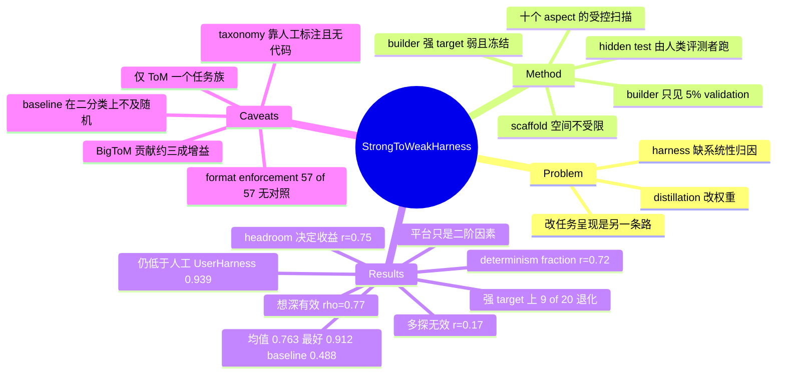

## Summary

论文提出 strong-to-weak scaffolding：让强 builder model 在只能看到 5% validation 的条件下，为一个参数完全冻结的弱 target model 迭代构建 inference-time harness，从而把 capability transfer 从训练时挪到测试时。在四个 Theory-of-Mind benchmark 汇总的 3900 题上，57 个 scaffolded run 把 GPT-5.4-mini 的 macro 平均准确率从 0.488 抬到 0.763，最好的单次 run 达到 0.912，且 100% 的 run 超过 vanilla baseline。作者把增益归因于 deterministic offloading、benchmark routing 与 answer-format enforcement，而非让 target 推理更长或采样更广。

## Problem & Motivation

现有的 capability transfer 几乎都改弱模型自己的参数——data distillation、on-policy distillation、instruction tuning、RLHF 都属于这一路。论文指出还有一条互补路径：小模型失败未必只是内部能力不足，也可能是任务呈现方式给它施加了过高的 cognitive load。于是"让模型更强"之外还有"让任务更好做"，后者的载体就是 inference-time harness。

真正的空白在于，harness 工程虽已成为部署常态，但缺少系统性说明：这些 harness 为什么有效、什么时候稳定、哪些设计选择真正起作用、多少增益来自对 benchmark 结构的利用而非对推理的支持。论文选 ToM 作 testbed，因为它既需要嵌套信念追踪与 Bayesian goal inference 这类难以外置的推理，又含有可被路由、分解、符号化求解的结构——两种成分并存，才能把"浅层 prompt 调优"和"真正的任务结构发现"区分开。

## Method

**任务设定。** 固定 target model $M_{tar}$，由 builder model $M_{build}$ 构建 scaffold。每个 benchmark 随机抽 5% 作 validation split $\mathcal{V}$，其余作为对 builder 完全不可见的 hidden test split $\mathcal{T}$。builder 的初始 workspace 只有三样东西：规则文件（任务说明与提交格式）、调用 target 的 demo 文件、以及带标注的 validation 集。

**构建循环。** builder 本身跑在一个现成的 agentic coding harness（Cursor / Claude Code / GPT Codex）里，循环执行：检视任务资源 → 提出或修订 scaffold → 在 validation 上调用 target 评测 → 收集错例并诊断改进。builder 自行决定何时提交，最终导出一个可作用于未见样本的可执行 entry point。提交后由人类评测者在 $\mathcal{T}$ 上跑这个 entry point，builder 不再介入。

**scaffold 空间不受限。** 论文不规定架构，builder 可以实现 prompt template、benchmark routing、确定性前后处理、answer-format enforcement、verification pass、few-shot retrieval，乃至直接写符号求解器。这一自由度是本文的关键设计——scaffold 里出现什么技术，本身就是被观测的因变量。

**观测维度。** 论文把分析拆成十个 aspect：效应量、跨 repeat 稳定性、validation 使用效率、技术分布、平台效应、target 依赖、builder reasoning effort、技术归因、cognitive-load reduction（用 determinism fraction 度量，即被代码/规则直接答掉的题目占比）、残余错误结构。

## Key Results

**主结果。** 目标 GPT-5.4-mini 的 vanilla macro 平均为 0.488。57 个 scaffolded run 的均值 0.763（+0.275），11 个 builder 配置全部超过 baseline，100% 的 run 超过 baseline。最好的单次 run（builder GPT-5.5，平台 GPT Codex）达 0.912，+0.423（相对 87%）。人工设计的 UserHarness 在同一 backbone 上是 0.939，仍高于自动构建的最好结果；分 benchmark 看，自动 scaffold 只在 BigToM 上略超人工（1.00 vs 0.95），在 Hi-ToM（0.80 vs 0.87）、MMToM-QA（0.84 vs 0.98）、MuMA-ToM（0.88 vs 0.96）都有明显差距。

**"想深" 有效，"多探" 无效。** validation 迭代次数与最终 full-set 准确率基本不相关（Pearson r=0.17），但 best validation accuracy 几乎一比一预测最终成绩（r=0.96），平均乐观偏差仅 0.021。与此对照，builder reasoning effort 单调有效：Opus-4.7 池化后 0.711（low）→ 0.793（med）→ 0.807（high）→ 0.856（extra-high），Spearman ρ=0.77，x-high vs low 置换检验 p=0.002。scaffold 代码量也随 effort 增长（low 约 510–650 LOC，x-high 约 1000–1300）。

**headroom 决定收益，强 target 上会反噬。** realized uplift 与 target 剩余空间 1−baseline 的相关为 r=0.75。换到已经较强的 Gemini-3.5-flash（baseline 0.761），平均 uplift 只有 +0.110（GPT-5.4-mini 上是 +0.262）；更关键的是每个 builder 都至少在一个 benchmark 上跌破 baseline（9/20 匹配格），Hi-ToM 平均 −0.04、近饱和的 MuMA-ToM −0.02；而在弱 target 上是 0/20。builder 也会自适应：面对强 target 时更少用确定性机制，把更多 benchmark 交回模型自己处理（MuMA-ToM 的 model-only 占比 40%→73%）。

**技术分布与归因。** format enforcement 出现在 57/57 个 run（100%），greedy/temperature control 56/57（98%），benchmark routing 54/57（95%），forced CoT 与 polarity/negation logic 各 45/57（79%），deterministic solver 31/57（54%），structured extraction 29/57（51%），few-shot 12/57（21%），verification/arbiter 7/57（12%），self-consistency vote 3/57（5%）。技术级关联（作者自承为 associational）中最大正向为 polarity/negation logic（+0.090）、structured extraction（+0.055）、few-shot（+0.042）。

**机制与残余误差。** determinism fraction 与最终准确率相关 r=0.72，而代码行数与准确率仅 r≈0.22；分 benchmark 的可 offload 程度依次为 BigToM ≈0.94、Hi-ToM ≈0.51、MMToM-QA ≈0.44、MuMA-ToM ≈0.36。最强 scaffold 对 baseline 做 McNemar 配对检验，修好 1717 题、弄坏 105 题，χ²=1424.4，p<10⁻⁴。8 个最强 scaffold 平均修复 83% 的 baseline 错题、破坏 7% 的 baseline 对题，它们修复集合的并集覆盖 97% 的 baseline 错误。残余错误集中在 Hi-ToM 深递归（order 0 的 0.999 降到 order 4 的 0.700，deception 从 0.829 降到 0.772）与 MMToM-QA 的 Bayesian goal inference 子类（qtype 2.1 仅 0.680）。

**self-scaffolding 对照。** GPT-5.4-mini 给自己搭 harness 已有 +0.217（Cursor）/ +0.168（Codex）的提升，同设置下更强 builder 为 +0.266 / +0.314。

**平台是二阶因素。** native platform 优势平均仅 +0.013，8 个匹配格中赢 5 格，置换检验 p=0.484。存在 platform × effort 交互：Opus-4.7 在 low effort 下 Claude Code 反而落后 Cursor（−0.034），在 medium/high/extra-high 才转正（+0.045/+0.038/+0.032）。

## Evidence Ledger

| Claim ID | Claim | Type | Source locator | Evidence excerpt | Status |
|:--|:--|:--|:--|:--|:--|
| C1 | 最好单次 run（GPT-5.5 builder，GPT Codex 平台）把 GPT-5.4-mini 从 0.488 抬到 0.912，+0.423（相对 87%） | number | Sec 5.1 Results; Table 1 | "The best individual run, produced by GPT-5.5 on GPT Codex, reaches 0.912, an uplift of +0.423 (87% relative)." | source-verified |
| C2 | 全部 57 个 scaffolded run 的 macro 均值为 0.763（+0.275），100% run 超 baseline；0.912 是最好 run 而非均值 | number | Sec 5.1 Results; Table 1 | "the mean macro-average accuracy is 0.763, corresponding to an uplift of +0.275 over the baseline, and 100% of runs exceed the baseline" | source-verified |
| C3 | 人工 UserHarness 在同 backbone 上 0.939，高于自动最佳 0.912；仅 BigToM 自动略胜（1.00 vs 0.95），Hi-ToM/MMToM/MuMA 均落后 | comparison | Sec 4 Baselines; Sec 5.1; Fig 3(b) | "slightly exceeds UserHarness (1.00 vs. 0.95). Clear gaps remain: Hi-ToM (0.80 vs. 0.87), MMToM-QA (0.84 vs. 0.98), MuMA-ToM (0.88 vs. 0.96)" | source-verified |
| C4 | 3900 题隐藏测试集（BigToM 1200 / Hi-ToM 1200 / MMToM-QA 600 / MuMA-ToM 900），builder 只见 195 题（5%）validation，每设置重复 3 次，共 72 run | benchmark-setting | Sec 4 Task and metric / Experiment design | "Each builder additionally receives a 195-item (5%) validation sample drawn by a fixed random seed... This yields in total 72 experiment runs." | source-verified |
| C5 | determinism fraction 与最终准确率相关 r=0.72；BigToM≈0.94、Hi-ToM≈0.51、MMToM≈0.44、MuMA≈0.36；代码量与准确率仅 r≈0.22 | causal-mechanism | Sec 5.9 Results; Fig 11; Table 4 | "runs with higher determinism fractions achieve higher final accuracy (Pearson r=0.72)... scaffold code size is only weakly related to accuracy (r≈0.22)" | source-verified |
| C6 | Opus-4.7 reasoning effort 单调提升：0.711 / 0.793 / 0.807 / 0.856，Spearman ρ=0.77，x-high vs low p=0.002 | number | Sec 5.7 Results; Table 3 | "performance moves from 0.711 at low effort to 0.793, 0.807, and 0.856 at extra-high effort... (Spearman ρ=0.77)... the low tier (p=0.002)" | source-verified |
| C7 | validation 迭代次数与最终成绩基本不相关（r=0.17）；best validation accuracy 相关 r=0.96，平均乐观偏差 0.021 | number | Sec 5.3 Results; Fig 5(b) | "the number of validation iterations is essentially uncorrelated with final full-set accuracy (Pearson r=0.17)" | source-verified |
| C8 | 强 target Gemini-3.5-flash（baseline 0.761）平均 uplift 仅 +0.110 vs GPT-5.4-mini 的 +0.262；前者 9/20 格退化，后者 0/20 | comparison | Sec 5.6 Results (i)(iv); Fig 8(a)(c) | "every builder regresses on at least one benchmark (9/20 cases), especially on tasks where the baseline is already high" | source-verified |
| C9 | realized uplift 由 target 剩余 headroom（1−baseline）预测，Pearson r=0.75 | causal-mechanism | Sec 5.6 Results (i); Fig 8(b) | "realized uplift is strongly predicted by the target's available headroom on that benchmark, 1−baseline (Pearson r=0.75)" | source-verified |
| C10 | self-scaffolding +0.217（Cursor）/ +0.168（Codex），更强 builder 同设置下 +0.266 / +0.314 | comparison | Sec 5.8; Fig 10(b) | "Cursor \| Self \| 3 \| 0.706±0.045 \| +0.217 ... Codex \| Self \| 3 \| 0.656±0.066 \| +0.168" | source-verified |
| C11 | 最佳 scaffold vs baseline 的 McNemar（3900 题）：修好 1717、弄坏 105，χ²=1424.4，p<10⁻⁴ | number | Sec 5.8 Results (ii); Fig 10(a) | "the scaffold fixes 1717 baseline errors while breaking only 105 previously correct items" | source-verified |
| C12 | native platform 优势平均仅 +0.013，8 格中赢 5 格，p=0.484；Opus-4.7 存在 platform×effort 交互（low −0.034，med/high/x-high +0.045/+0.038/+0.032） | number | Sec 5.5 Results (i)(ii); Fig 7(a)(b) | "changes macro accuracy by only +0.013, with the native platform winning in 5 of 8 cells (paired permutation test p=0.484)" | source-verified |
| C13 | 技术普及率：format enforcement 57/57、greedy 56/57、routing 54/57、forced CoT 与 polarity 各 45/57、deterministic solver 31/57、few-shot 12/57、self-consistency 3/57 | number | Sec 5.4; Fig 6(a) | "Format enforcement 57/57 100% \| Greedy / temp control 56/57 98% \| Benchmark routing 54/57 95% \| Forced CoT 45/57 79%" | source-verified |
| C14 | 全文与附录均未给出任何 code / data / scaffold 产物的公开链接 | license-code | 全文含 Appendix A/B 与所有 HTML 链接 | 正文唯一 URL 为参考文献引用 "https://arxiv.org/abs/2603.28052"（ref 17, Meta-Harness） | source-verified |
| C15 | 残余误差：Hi-ToM order 0 的 0.999 → order 4 的 0.700，deception 0.772 vs 0.829，MMToM qtype 2.1 为 0.680；top scaffold 平均修 83% 错题、破 7% 对题，并集覆盖 97% baseline 错误 | number | Sec 5.10 Results; Table 5; Sec 5.8 (iv) | "falling from 0.999 at order 0 to 0.700 at order 4"; "repair 83% of baseline-wrong items and break only 7% of baseline-correct items" | source-verified |
| C16 | arXiv abstract 写 "nearly doubling average target-model performance from 0.49 to 0.91"，而正文 Sec 1 / 5.1 明确把 0.91 归给 best scaffold 而非各 run 均值 | comparison | arXiv abstract 页 vs Sec 1, Sec 5.1 | Abstract: "nearly doubling average target-model performance from 0.49 to 0.91"; Sec 1: "The best scaffold raises GPT-5.4-mini from... 0.49 to 0.91" | source-verified |
| C17 | validation 规模在文内不自洽：Sec 4 说 195 题（5%），Appendix A 给 builder 的指令文件说 "a random 2% sample of the full benchmark" | benchmark-setting | Sec 4 Task and metric; Appendix A 指令原文 | Appendix A: "a small validation set, which is a random 2% sample of the full benchmark" | source-verified |
| C18 | McNemar 统计量在文内不自洽：正文写 "χ²≫10⁴"，Fig 10(a) 表中为 1424.4（Gemini 侧 600.3） | number | Sec 5.8 Results (ii) vs Fig 10(a) | 正文 "with χ²≫10⁴ and p<10⁻⁴"；表格 "1424.4" | source-verified |
| C19 | vanilla baseline 分项为 BigToM 0.503 / Hi-ToM 0.569 / MMToM-QA 0.412 / MuMA-ToM 0.469；BigToM 与 MMToM-QA 为二选一题型，即 baseline 在这两个 benchmark 上处于或低于随机水平 | number | Fig 3(a) baseline 行; Sec 4 Task and metric | "Baseline (no scaffold) \| – \| 0.503 \| 0.569 \| 0.412 \| 0.469 \| 0.488"；"BigToM: binary belief/goal/action questions"；"MMToM-QA: binary Bayesian goal/belief inference" | source-verified |
| C20 | format enforcement 在 57/57 run 中出现，无对照组，论文归因表对其 "Acc. w/o" 与 Δ 两列均填 "–"，即该组件的贡献在本文结构下无法被隔离 | number | Sec 5.8 Results (i); Fig 9(a) 表与脚注 | "Format enforcement \| 57 \| 0 \| 0.763 \| – \| –" | source-verified |

## Strengths & Weaknesses

### 亮点

**problem formulation 比结果本身更值钱。** 把 capability transfer 从权重域搬到 harness 域，并且配了一个可复制的协议：builder 只见 validation、test set 全程隐藏、最终由人类评测者跑导出的 entry point。这比这条线上大多数只报 bundle 级增益的 harness 论文严谨一档——至少"scaffold 是否泛化到未见样本"这个问题被干净地回答了（乐观偏差 0.021）。

**最有 insight 的是那条负面结果。** validation 探测次数与最终成绩不相关（r=0.17），而 builder reasoning effort 单调有效（ρ=0.77）。这把"test-time compute"拆成了"多探"与"想深"两种，并给出方向性结论：限制因素不是反馈量，而是 builder 对任务结构的假设质量。这个区分对自动 harness 搜索的预算分配有直接指导意义，也和 vault 里 [[Papers/2607-HarnessBank]] 的 gate 消融（Test Pass@1 ±0.0 但收敛轮数减半）指向同一件事——搜索预算不是瓶颈。

**"强 target 上 scaffolding 会反噬"是硬证据。** 弱 target 上 0/20 退化、强 target 上 9/20 退化，这个对比是本文最不可替代的贡献。

**self-scaffolding 对照设计得当。** 弱模型给自己搭 harness 已经拿到 +0.217，更强 builder 只多拿 +0.05——这说明"有 validation feedback + 任务结构可被检视"这一环境条件解释了大部分收益，builder 强度只解释增量。作者把它写成"stronger builders unlock the high-performance regime"，但同样的数据也支持一个更弱的读法：strong-to-weak 里"strong"没有想象中关键。

**平台分析处理得诚实。** 明确说 pooled platform marginal 混淆了 builder roster，只能描述性解读，没有把 0.799 vs 0.754 包装成平台优势。

### 局限

**最可能主导增益的那个组件，恰恰是本文结构上无法归因的。** vanilla baseline 在两个二选一 benchmark 上处于或低于随机水平（BigToM 0.503、MMToM-QA 0.412，chance 均为 0.50）。一个在二分类任务上打不过抛硬币的 baseline，其失败很大程度不是推理失败而是输出格式/解析失败。而 format enforcement 出现在 57/57 个 scaffold 里——论文自己的归因表在这一行只能填 "–"，因为没有对照组。于是全文的核心叙事（"transfer cognitive structure"）与最可能的实际机制（"把丢在格式上的分捡回来"）无法被数据分开。论文缺的那个实验很简单：一个只做 format enforcement + greedy decoding 的最小 scaffold。

**headroom law 有一部分是恒等式。** uplift = scaffolded − baseline，headroom = 1 − baseline，两侧共享 −baseline 项，因此即便 scaffolded accuracy 是噪声，两者也会正相关。r=0.75 里有多少是真信号、多少是共同回归元造成的天花板效应，论文没有给对照口径（例如报告 scaffolded 与 baseline 的相关，或用 recovery fraction = uplift/headroom 归一化）。结论方向我认为仍成立——9/20 退化那条独立支持它——但 r=0.75 这个数字被高估了。

**BigToM 贡献了约三分之一的 headline 增益，而它是论文自己承认存在"explicit reasoning shortcut"的那个 benchmark。** 推算：GPT-5.5 builder 的 BigToM 从 0.503 到 1.000，在等权 macro 平均里贡献 (1.000−0.503)/4 = +0.124，占其总增益 +0.387 的 32%；同时该 benchmark 的 determinism fraction ≈0.94。作者在 Sec 7 明确辩护"发现这些可编译结构本身就是 builder 能力的一部分"——这个立场可以成立，但它把 claim 从"transfer cognitive structure to weaker models"改写成了"发现 benchmark 的可编译性"，两者不是一回事，而 abstract 用的是前一种措辞。同理，determinism fraction 与准确率的 r=0.72 也可能主要由"谁在 BigToM 上做成了确定性求解"驱动（论文自承 associational）。

**headline 数字存在口径滑动。** arXiv abstract 写 "nearly doubling average target-model performance from 0.49 to 0.91"，读者会理解为 scaffolded 后的平均水平是 0.91，但 57 run 的均值是 0.763，0.91 是单次最好 run。正文 Sec 1 与 5.1 的措辞（"The best scaffold raises..."）是准确的，丢限定词发生在 abstract 层。

**Aspect 3 与 Aspect 7 的全部结论建在无法外部复核的人工标注上。** 12-technique taxonomy 由作者阅读 scaffold code 与优化日志手工编码，未报告 inter-rater reliability，且 scaffold 产物与代码均未公开（C14）。"polarity logic 值 +0.090"这类结论的可复核性因此接近零。

**数字校对不严。** Sec 4 说 validation 是 195 题（5%），但 Appendix A 里真正交给 builder 的指令文件写的是 "a random 2% sample"——2% 对应 78 题，差了 2.5 倍，而 builder 的行为恰恰由这份指令文件驱动。正文写 χ²≫10⁴，表里是 1424.4。两处都不改变主结论方向，但会让人对其他未被交叉检查的数字打个折扣。

**统计功效偏薄。** 每格 3 repeats；effort sweep 每 tier 池化后 6 run，x-high vs high 的 p=0.013 建立在这个样本上。作者报告的 mean sd 0.036 与最宽设置 repeat range 0.201 之间差了 5 倍以上，说明分布有重尾。

**单一任务族。** 只有 ToM，作者在 Sec 7 已承认。ToM 的特殊之处在于它含有大量可符号化的信念状态追踪，这恰好是最利于 deterministic offloading 的结构；换到不可编译的领域，本文的核心机制（determinism fraction）可能直接失效。

### 对领域的影响

本文最有价值的输出不是 +0.275，而是两个可迁移的度量：**determinism fraction**（多少工作被移出模型）与 **headroom**（还有多少可修的错）。前者给"harness 到底做了什么"一个可计算的定义，后者给"harness 值不值得上"一个事前判据。若要把这条线推下去，最缺的实验是把 format-enforcement-only 作为独立 arm 跑一遍——那才是把"可靠性地板"与"任务结构编译"真正分开的最小干预。

## Mind Map

## Connections

- [[Topics/Harness-Component-Attribution]] — 该 Topic 的核心结论是"组件不是可加的能力增量，而是条件性的失败修复，净效应符号取决于评测集的失败率构成"。本文的 headroom law（r=0.75）与"强 target 上 9/20 退化、弱 target 上 0/20"是对这一结论的独立定量确认，且来自一个完全不同的任务族（ToM 而非 GUI/terminal）。这是目前 vault 里对该结论最直接的外部证据，应并入该 Topic。同时本文自身也复现了该 Topic 诊断的结构性缺陷：把最普遍的组件（format enforcement, 57/57）留在无对照组的状态。
- [[Topics/AgentHarness-Design]] — 本文的 platform × effort 交互（native harness 只在高 reasoning effort 下才显出优势）为该 Topic 的执行循环与预算口径讨论补一条：harness 的价值依赖于使用者是否有足够预算去调用它的 affordance。
- [[Topics/SelfEvolvingAgents-Survey]] / [[Papers/2608-CoEvolutionSurvey]] — 本文 Sec 7 明确把 strong-to-weak scaffolding 定位为 harness self-evolution 的实验透镜，并提出把它做成 builder model 的 benchmark。CoEvolutionSurvey 与本文的第一作者同为 Cheng Qian，本文可视为其 Agent-Environment co-evolution 轴上的一个受控实证切片。
- [[Papers/2607-HarnessBank]] — 二者共享同一个反直觉结论：搜索/验证预算不是瓶颈。HarnessBank 的 2σ gate 消融使 Test Pass@1 ±0.0 但收敛轮数减半；本文的 validation 迭代次数与最终成绩 r=0.17。
- [[Papers/2608-EvoHarnessRL]] / [[Papers/2607-MANTA]] — 同属自动 harness 构建/演化，但两者都在同一个 agent 上自演化；本文的差异在于 builder 与 target 是不同模型，且 target 参数冻结，从而把"谁在提供能力"这个问题隔离出来。
- [[Papers/2605-CodeAgentHarness]] — 该 survey 主张代码是 agent 的操作基底；本文的 determinism fraction（r=0.72）给这个主张提供了一个可测量的量化版本。
- [[Papers/2605-GRASP]] — Harness-Component-Attribution 中唯一给出 compute-matched control 的工作。本文的 self-scaffolding arm 起到类似作用（控制"是否有 validation feedback"），但没有控制 builder 的推理算力，因此 reasoning-effort 单调性无法排除"更多算力本身"的解释。
- [[Papers/2608-ScreenshotsOrTools]] / [[Papers/2607-ProgressiveDisclosure]] — 同样呈现"harness 干预的净效应符号随 backbone 强弱翻转"的模式，与本文强/弱 target 的对比同构。

## Notes

- **最想补的一个实验**：format-enforcement-only 作为独立 arm。目前"可靠性地板"（格式/解码）与"任务结构编译"（polarity logic、符号求解）两层增益完全绑在一起，而前者的实现成本比后者低两个数量级。如果最小 scaffold 就能拿走大半增益，本文的叙事需要重写。
- **可迁移的度量**：determinism fraction 是一个好指标——它不依赖具体任务，可以直接算，且和"harness 到底替模型做了多少"这个问题同构。可以考虑把它引入 Harness-Component-Attribution 的证据矩阵，作为"干预强度"一列，与净效应一起看。
- **一个可做的 idea 方向**：本文发现 builder 会自适应 target 强度（面对强 target 时把 MuMA-ToM 的 model-only 占比从 40% 提到 73%），但这个自适应是隐式的、事后观察到的。把 headroom 显式化——先测 per-subtask headroom，再据此 gate 是否施加干预——应该能同时拿到弱 target 的增益并避免强 target 的 9/20 退化。这与 Harness-Component-Attribution 的"净效应符号取决于失败率构成"结论是同一件事的可操作化，值得查一下有没有人做过。
- **待核**：Appendix A 指令文件说 2%、Sec 4 说 5%（195 题）。若真实给 builder 的是 78 题，则"validation 乐观偏差仅 0.021"这个结论的强度要重新评估——样本越小，best-validation 选择带来的选择性偏差应该越大，而论文报告的偏差反常地小。这一点值得在 survey 整合时标注为存疑。
