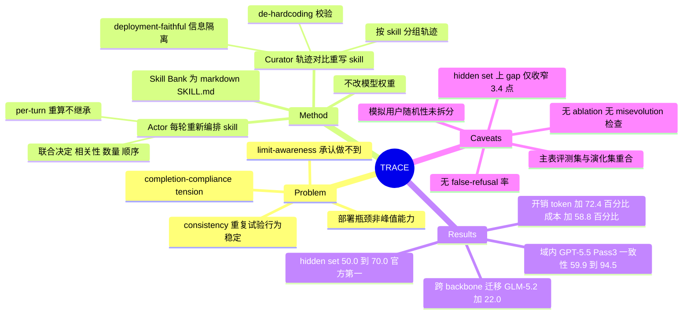

## Summary

TRACE 用一个不改模型权重的自演化 Skill Bank，把 LLM agent 的"至少做对过一次"（Pass@k）转成"每次都做对"（Pass^k）：Curator 在每轮评测后按被调用的 skill 给轨迹分组、对比成功与失败轨迹重写 skill，Actor 在部署时每一轮都根据对话状态重新编排 skill。在 CAR-bench 全量数据上，GPT-5.5 的 Pass^3 从 59.9% 升到 94.5%，Pass@3−Pass^3 的一致性 gap 从 27.8 点收到 4.0 点。但该主表的评测任务与 skill 演化所用任务重合，真正 held-out 的证据只有官方 hidden set 上的 50.0%→70.0%。

## Problem & Motivation

作者的问题设定比方法本身更值得注意：**产品化部署的瓶颈不是峰值能力，而是 consistency 与 limit-awareness**——同一请求重复跑 k 次是否都表现一致，以及能否识别"这个请求现在做不了 / 不能安全地做"而不是编造一个成功。两者对车载助手都是安全相关属性。

论文给出的两条失败机理（§1，属作者论断而非本文实验证据）：
- **Consistency 脆弱**：模型有识别歧义、判断何时该追问的 meta-reasoning 能力，但不能在重复试验中稳定激活它。
- **Limit-awareness 被训练目标削弱**：训练偏好"看起来完成了任务"而非诚实报告不确定，于是模型倾向于宣称自己能做到。

两者叠加成 completion-compliance tension：agent 更愿意满足请求，而不是遵守策略、澄清或承认能力缺失。因为失败是间歇性的，同一个 agent 这次成功下次失败，于是"能做什么"和"可靠地做什么"之间出现 gap。CAR-bench（Kirmayr et al., ACL 2026，**非本文提出**）正是为量化这个 gap 而建：LLM 模拟用户带 persona 和隐藏任务指令发出不完整/歧义请求，agent 有 58 个互联工具、须遵守 19 条 domain policy，任务分 Base / Hallucination（工具或参数被移除，须承认能力缺失）/ Disambiguation 三类。

## Method

两个 agent、一个 Skill Bank：

- **Skill Bank** `B = {s_1,...,s_N}`，每个 skill 是一对 `(d_i, b_i)`，存成 markdown SKILL.md。`d_i` 是一行描述，作为路由线索；`b_i` 是自包含的 tool-usage 规则 + 行为准则。
- **Actor**：执行任务、跟用户对话、调工具、编排 skill。
- **Curator**：读 Actor 的评测轨迹，重写 Actor 下一轮要依据的行为知识。

**初始化（bottom-up 三级抽象 + 分解）**：`B_task → B_type → B_op → B^(0)`。先按任务蒸馏 task-level skill（同时收录成功行为与常见失败模式），再按 task type 合并去掉任务细节，再**按底层 operation 跨 task type 合并**——这一步是可迁移性的来源：表面目标不同但底层操作相同的任务共享同一 competency。最后把过宽的 skill 分解成单一焦点的细粒度 skill，让 Actor 能精确激活。

**Trajectory-Contrastive 演化**：`B^(r+1) = Φ(B^(r), T^(r))`，每轮三步：
1. *Skill-Aware Grouping*：按每条轨迹调用过的 skill 分组；名字不认识或根本没调 skill 的轨迹单独放进 `T_∅`。
2. *Deployment-Faithful Reconstruction*：把轨迹渲染成结构化文本时，**显式区分"部署时可见"与"仅 Curator 在演化时可见"的信息并逐条标注**。Curator 可以用特权信息诊断哪里错了，但必须按 Actor 当时真实拥有的 affordance 去评判它的决策——防止把 skill 写成依赖部署时拿不到的知识。这是全文最实在的一个设计。
3. *Contrastive Refinement*：对已有 skill，读它配对的成功/失败轨迹直接改写（skill 太大就再拆）；对 `T_∅`，若发现反复出现的可复用模式则挖出新 skill。接受新 bank 前跑一次 Validate，**去掉 task identifier、记忆化答案和环境特定值（de-hardcoding）**。

**部署时的 State-Conditioned Skill Orchestration**：每一轮 t，Actor 拿当前对话历史 `h_t` 去评估全部 skill 描述 `{d_i}`，联合决定**哪些 skill 相关、激活几个（K_t）、以什么顺序拼进 context**，然后把有序 body 序列拼进 prompt 采样动作。关键是 **per-turn re-orchestration**：`S_{t+1}` 独立于 `S_t` 重算，上一轮注入的 body 不保留——一个开始看起来清晰、说着说着才发现欠指定的 turn，会被重新拉进对应的 skill。

## Key Results

**主表（CAR-bench 全量 = train+test 合并，每任务跑 3 次，三类任务 macro-average）**：Skill Bank 只用 GPT-5.5 的轨迹演化，然后原样应用到两个 backbone。

| Backbone | Method | Pass@1 | Pass@2 | Pass^2 | Δ2 | Pass@3 | Pass^3 | Δ3 |
|:--|:--|--:|--:|--:|--:|--:|--:|--:|
| GLM-5.2 (high) | baseline | 71.9 | 80.6 | 66.7 | 13.9 | 82.7 | 62.8 | 19.9 |
| GLM-5.2 (high) | TRACE | 93.6 | 95.2 | 89.4 | 5.8 | 96.8 | **84.8** (+22.0) | **12.0** |
| GPT-5.5 (medium) | baseline | 75.6 | 83.3 | 67.7 | 15.6 | 87.7 | 59.9 | 27.8 |
| GPT-5.5 (medium) | TRACE | 97.8 | 98.1 | 96.2 | 1.9 | 98.5 | **94.5** (+34.6) | **4.0** |

（Pass@1 与 Pass^1 按定义相等，故上表省略 Pass^1 列。原文 Table 1 的列序是 Pass@k 在前、Pass^k 在后。）

**按任务类型（§3.2 正文 / Figure 3）**：baseline 两个 backbone 都在 Disambiguation 上最弱（GLM-5.2 48.2%、GPT-5.5 39.3%），GLM-5.2 最强项是 Base（76.0%）、GPT-5.5 最强项是 Hallucination（73.5%）。TRACE 恰好在最弱处涨最多：Disambiguation → 83.9%（+35.7，GLM-5.2）和 94.6%（+55.3，GPT-5.5），跨类型极差从 27.8→9.4、34.2→1.1。

**官方 hidden set（GPT-5.6-Sol，30 个未见任务 × 3 次 = 90 trial）**——原文 Table 2 的列序是 **Pass^3 在前、Pass@3 在后**：

| Method | Pass^3 | Pass@3 | Pass@1 | Successful trials | Consistency | Latency (s) | Tokens/trial | Cost/trial |
|:--|--:|--:|--:|--:|--:|--:|--:|--:|
| baseline | 50.0 | 66.7 | 60.0 | 54/90 | 85.0 | 21.21 | 82,179 | \$0.17 |
| TRACE | **70.0** (+40.0% rel.) | 83.3 | 70.0 | 69/90 | 88.0 | 25.87 (+22.0%) | 141,684 (+72.4%) | \$0.27 (+58.8%) |

作者自述该配置在官方 hidden set 上取得第一名。开销账算得比较诚实：中位延迟 +4.66 s（+22.0%），但 token +59,505（+72.4%）、每 trial 成本 +\$0.10（+58.8%），作者自己把 token 与金钱成本列为待优化项。

## Evidence Ledger

> Status 说明：`source-verified` 仅表示 primary source（arXiv:2608.22793v1 全文）确实包含该信息，**不表示结果已被独立复现或领域已形成共识**。核查由独立 verifier agent 完成（含 Table 1 / Table 2 表头列序的逐格定位）。

| Claim ID | Claim | Type | Source locator | Evidence excerpt | Status |
|:--|:--|:--|:--|:--|:--|
| C1 | GPT-5.5 上 TRACE 把 Pass^3 从 59.9% 提到 94.5%（+34.6 点） | number | Abstract; Table 1; §3.2 | "TRACE improves consistency (Pass^3) by 34.6 points, from 59.9% to 94.5%" | source-verified |
| C2 | GPT-5.5 上 Δ3 = Pass@3−Pass^3 从 27.8 收到 4.0 点 | number | Table 1 Δ3 列; §3.2 | "shrinking the Pass^3-to-Pass@3 gap to 12.0 and 4.0 points" | source-verified |
| C3 | GLM-5.2 上 Pass^3 62.8%→84.8%（+22.0），Δ3 19.9→12.0 | number | Table 1; §3.2 | "Pass^3 rises to 84.8% (+22.0) on GLM-5.2" | source-verified |
| C4 | Skill Bank 仅用 GPT-5.5 轨迹演化，原样应用到 GLM-5.2 | benchmark-setting | §3.1 | "evolved iteratively using trajectories collected from a GPT-5.5, and is then applied unchanged to both backbones" | source-verified |
| C5 | 主表数字报在 train+test 合并集上，而演化循环本身同时用了 training split 和 test split | benchmark-setting | §3.1 | "first bootstraps the Skill Bank on the training split and then broadens its coverage using the test split" | source-verified |
| C6 | Hidden set（GPT-5.6-Sol，30 任务 × 3 trial）Pass^3 50.0%→70.0%（+20.0 点 / +40% 相对） | number | Abstract; §3.3; Table 2 | "over 30 hidden tasks, with three trials per task" | source-verified |
| C7 | Hidden set 上延迟 21.21→25.87 s（+22.0%）、token 82,179→141,684（+72.4%）、成本 \$0.17→\$0.27（+58.8%） | number | Table 2 第 7–9 列; §3.3 | "latency is the median task latency, tokens are the mean per trial, and cost is estimated per trial" | source-verified |
| C8 | 论文自述在官方 hidden set 上用 GPT-5.6-Sol 取得第一名 | sota-novelty | Abstract | "TRACE achieved first place using GPT-5.6-Sol, attaining a Pass^3 score of 70%" | source-verified（仅核到论文自述；官方榜单本身未独立核查） |
| C9 | CAR-bench 非本文提出，引自 Kirmayr et al. (2026)，ACL 2026 | benchmark-setting | §3 Benchmark; References | "CAR-bench: evaluating the consistency and limit-awareness of LLM agents under real-world uncertainty. In Proceedings of the 64th Annual Meeting" | source-verified |
| C10 | CAR-bench：LLM 模拟用户 + 58 个互联工具 + 19 条 domain policy + 三类任务 | benchmark-setting | §3 Benchmark | "native tool-calling access to 58 interconnected tools and must obey 19 domain policies" | source-verified |
| C11 | TRACE 不改模型权重，只演化外部 markdown SKILL.md | causal-mechanism | Abstract; §2 | "a set of modular, retrievable competencies stored as markdown SKILL.md files" | source-verified |
| C12 | 分类型 Pass^3：baseline Disamb 48.2/39.3，TRACE Disamb 83.9/94.6，跨类型极差 27.8→9.4、34.2→1.1 | number | §3.2 正文（Figure 3 为可视化） | "Disambiguation rises to 83.9% (+35.7) on GLM-5.2 and 94.6% (+55.3) on GPT-5.5" | source-verified |
| C13 | 全文无任何 component ablation（层级抽象 / 分解 / de-hardcoding / per-turn re-orchestration），也无演化轮数 R 的敏感性分析 | benchmark-setting | 全文 §1–§4 + References（HTML 无附录） | 全文无 "ablation"/"ablate"/"w/o"/"appendix"；R 仅出现在 Algorithm 1 输入 | source-verified |
| C14 | 全文不报告 false-refusal / over-abstention 率，也不测量 Skill Bank 是否随轮次退化或固化早期错误 | benchmark-setting | 全文 | 唯一的 "degradation" 用于 "limited degradation in Pass^k as k increases"，与 bank 质量无关 | source-verified |
| C15 | 作者自陈：当前 orchestrator（每轮遍历全部 skill 描述）随 bank 增长 scale 不佳；部署期无从执行回流到 skill 的反馈通道 | causal-mechanism | §4 | "scales poorly as the bank grows"; "no feedback channel from task execution back into the skills" | source-verified |
| C16 | Table 2 的 "Consistency" 列（85.0→88.0）在全文正文中从未给出定义或公式（Pass^k / Pass@k 则在 §3 Metrics 有公式） | benchmark-setting | Table 2 第 6 列; §3 Metrics | "success consistency rises from 85.0% to 88.0%"（无公式） | source-verified |
| C17 | 机构含 Xiaomi / NJU / BUPT / THU；主页 darwin-agent.github.io/Car-bench-TRACE；定位为 CAR-bench Challenge 技术报告；2026-08-24 提交 | benchmark-setting | 标题作者块; Abstract; arXiv 戳 | "arXiv:2608.22793v1 [cs.CL] 24 Aug 2026" | source-verified |

**Claim 计数**：total 17 / source-verified 17 / unsupported 0 / contradicted 0 / not-checkable 0 / abstract-only 0。

## Strengths & Weaknesses

### 值得肯定的

**问题选得对。** "部署可靠性 = consistency + limit-awareness，而不是峰值能力" 是一个真问题，而且 Pass^k vs Pass@k 的对照把它变成了可测量的量。相比之下大多数 agent 论文只报 Pass@1，天然把间歇性失败藏起来。这个 metric 框架值得往 [[Topics/SelfEvolvingAgents-Survey]] 的 evaluation 一节收。

**benchmark 不是自己造的。** CAR-bench 出自 Kirmayr et al.（ACL 2026），本文是该 challenge 的参赛技术报告（C9）——这排除了"自建 benchmark 自刷分"这一类最常见的质疑。

**Deployment-Faithful Reconstruction 是个真设计。** 显式区分"Actor 部署时可见"与"Curator 演化时才可见"的信息，让 Curator 可以用特权信息做归因、但只按 Actor 当时的 affordance 评判决策。这条约束加上 de-hardcoding，正面对准了 skill 演化最容易滑向的失败模式：把 skill 写成变相的答案缓存。跨 backbone 迁移（GPT-5.5 演化的 bank 原样上 GLM-5.2 仍 +22.0）是这一约束确实起了作用的间接证据。

**开销账诚实。** token +72.4%、成本 +58.8%、延迟 +22.0% 全部列出（C7），并明确承认 token/金钱成本是待优化项。这对 [[Topics/AgentHarness-Design]] 的 per-step 预算口径是一个可直接引用的数据点：per-turn 重新编排 skill 的墙钟开销远小于其 token 开销，因为编排是"注入更多 context"而非"多跑几轮"。

### 需要打折扣的

**（1）主表的评测集与优化集重合——这是最大的问题。** §3.1 明说演化循环先在 training split 上 bootstrap、再用 **test split** 拓宽覆盖，而 Table 1 的所有数字报在 train+test 合并集上（C5）。也就是说 94.5% / +34.6 点是**在 skill 演化用过的同一批任务上**测出来的。Skill Bank 是自然语言写的行为知识，即便有 de-hardcoding 校验，"这类任务要先查状态再动手"这种介于原则与答案之间的东西也无法被机械排除，而校验本身还是 LLM 执行的、无度量。

把这个折扣量化一下（**以下为笔记基于 C1/C2/C6 与 Table 2 的算术推算，非论文原文论断**）：
- 域内（Table 1，GPT-5.5）：gap 27.8 → 4.0，收窄 **23.8 点**。
- Hidden set（Table 2，GPT-5.6-Sol）：baseline gap = 66.7 − 50.0 = 16.7；TRACE gap = 83.3 − 70.0 = **13.3**，只收窄 **3.4 点**。

所以摘要里"把潜力与可靠性的 gap 压到 4.0 点"这个卖点几乎完全是域内现象；在真正 held-out 的数据上，一致性 gap 基本没被关上。Pass^3 本身 +20 点仍然是实打实的改进，但那更像是"整体能力上移"而非论文主张的"把已有潜力转成稳定行为"。**引用本文时应引 hidden set 的 50.0→70.0，不要引 94.5%。**

**（2）Pass^k 里混着模拟用户的随机性，论文完全没有拆。** CAR-bench 的用户是 LLM 模拟的（C10），所以 3 次 trial 之间变化的不只是 agent，还有用户说什么。论文自己的 Figure 4/5 就坐实了这点：同一任务的 baseline 与 TRACE 两条轨迹里，模拟用户的开场白措辞不同（"Hi, my windows are starting to fog up…" vs "Good morning. The windows are starting to fog up…"）。这意味着 Pass^k 度量的是"对一个随机对话者的鲁棒性"，而不是纯粹的 agent 自一致性。论文没报模拟器的 temperature/seed 设置，也没做"固定用户轨迹重放"的对照，因此无法判断 TRACE 的收益有多少来自 agent 变稳、多少来自 skill 恰好覆盖了模拟器爱说的那几种表述。这对一个把 consistency 当作核心 claim 的工作是明显缺口。

**（3）自演化 = misevolution 风险，本文一次都没测。** 没有任何 component ablation，也没有演化轮数 R 的曲线（C13）；没有 bank 规模、skill 质量随轮次的变化，没有"早期错误是否被固化"的检查，没有回滚或 verifier gating 机制（C14）。唯一的护栏是每轮末尾 LLM 执行的 Validate/de-hardcoding，其有效性未被度量。[[Papers/2604-ExperienceSafetyRisks]]、[[Papers/2606-CodeSelfReviewCollapse]] 一类工作反复显示，无 gate 的自演化循环会在若干轮后退化——本文既没报轮数，也没报单调性，读者无从判断 R 是被调出来的还是收敛了。对一篇标题写着 "Self-Evolving" 的论文，这是核心 claim 的证据缺失。

**（4）limit-awareness 没有 over-abstention 的反面度量。** 论文不报 false-refusal / 过度澄清率（C14）。这很要紧，因为"多拒绝、多追问"可以廉价地把 Hallucination 和 Disambiguation 两类分数刷上去。间接证据部分缓解了这个担忧：由 §3.2 给出的 GPT-5.5 baseline macro 均值 59.9 与 Hallu 73.5 / Disamb 39.3 可反推 Base ≈ **66.9**；TRACE 侧 macro 94.5、Disamb 94.6、极差 1.1，可推出 Base 落在 **93.5–95.7** 区间——Base 类没有塌，说明不存在粗暴的全面拒答（**同为笔记推算，非原文数字**）。但这只排除了"拒答到把 Base 任务做砸"的程度，排除不了 rubric 容忍范围内的过度澄清；而 token +72.4%、延迟 +22.0% 恰好与"多问几轮"的行为一致。作者应当直接报一个 unnecessary-clarification 率。

**（5）hidden set 太小且换了 backbone。** 30 任务 × 3 trial = 90 次（C6），单个任务翻转就动 3.3 个百分点，无置信区间。而且 hidden set 用 GPT-5.6-Sol、主表用 GPT-5.5/GLM-5.2，backbone 与数据同时变，两张表之间无法做严格的对照解读。Table 2 的 "Consistency" 列（85.0→88.0）全文无定义（C16），只能当作官方评测口径的黑盒数字。

**（6）方法本身增量有限。** 层级抽象 + 对比式重写 + 检索编排，每一件在 skill-library 线上都已有先例（[[Papers/2607-MetaSkillEvolve]]、[[Papers/2606-SkillMemoryBudget]]、[[Papers/2608-ContinualSkillBench]]）。真正新的是 Deployment-Faithful Reconstruction 这条信息隔离约束和 per-turn 无状态重编排，但两者都没有 ablation 支撑（C13），所以"哪个组件带来了收益"在本文里是未知的。作者自陈的两条限制也很实在：orchestrator 每轮遍历全部 skill 描述，bank 一大就 scale 不动；部署期没有执行→skill 的反馈通道（C15）。

### 对领域的意义

主要价值在 **framing 和 metric**，不在方法。Pass^k 与 Pass@k 的差值作为"latent competence 无法可靠调用"的量度，比单点准确率更适合评估 harness / skill-library 类工作，值得作为 [[Topics/SelfEvolvingAgents-Survey]] 评测一节的标准做法推。反过来，本文自身正好演示了这个 metric 的误用方式：在优化过它的数据上报 gap closure。

作者与 HarnessX（Chen et al. 2026, arXiv 2606.14249，见 [[Papers/2608-EvoHarnessRL]]）、Mi-Memory 同属 Xiaomi 的 Kun Shao / Jian Luan 组，可以看作同一条 "harness / 行为知识演化" 产品线上的一个应用点。

## Mind Map

## Notes

- **可直接复用的数字**：hidden set 上 per-turn skill orchestration 的边际开销 = 延迟 +22.0% / token +72.4% / 成本 +58.8%，换 Pass^3 +20 点。这是少见的、把 skill 注入成本与可靠性收益放在同一张表里的公开数据，可直接进 [[Topics/AgentHarness-Design]] 的预算口径讨论。
- **待验证的疑问**：Skill Bank 最终有多少个 skill？演化跑了几轮？论文两处都没说（Algorithm 1 里 R 只是形式参数）。若 repo 里有 SKILL.md 目录，可以直接数——这是判断"是否已经滑向答案缓存"最直接的证据，也是 `repo-digest` 值得跑一轮的理由。
- **一个可做的对照实验**：把用户模拟器固定成录制好的对话轨迹回放，再测 Pass^k。如果 TRACE 的收益在固定用户下大幅缩水，说明它学到的是"对特定表述的应对"而非"稳定的行为准则"。本文缺的正是这个对照。
- **与 misevolution 线的接口**：本文是一个"无 gate 自演化 + 只做 LLM 自校验"的样本，且没有跨轮质量曲线。可以作为 [[Topics/SelfEvolvingAgents-Survey]] gating 一节的反面案例——不是说它一定退化了，而是说它把是否退化这件事留成了未测量的空白。
- **术语提醒**：本文 Table 2 的 "Consistency" 列与正文 Pass^k 不是同一个量，且无定义。引用时不要把 88.0% 说成"一致性 88%"。
