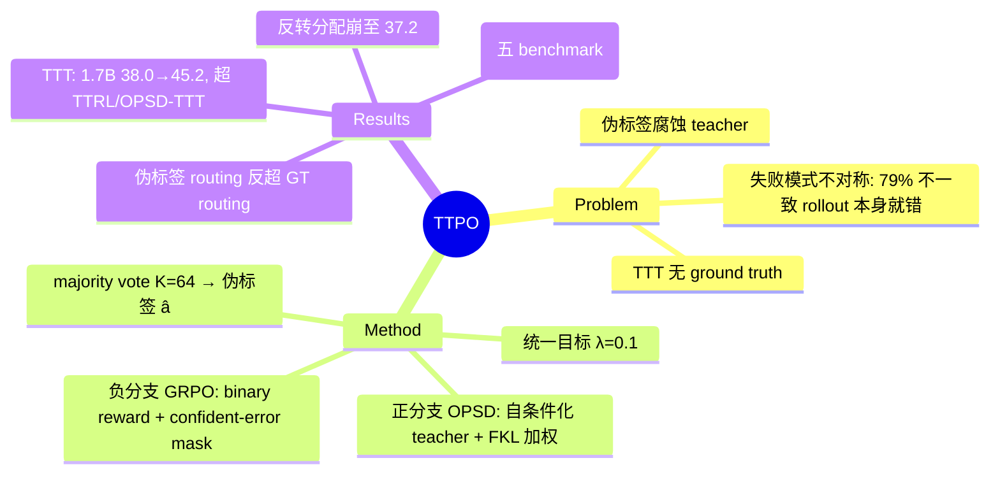

## Summary

针对 test-time training（TTT）无 ground truth、majority-vote 伪标签又易腐蚀监督信号的问题，TTPO 基于一个不对称实证观察——即使伪标签本身是错的，与它不一致的 rollout 也有 ~79% 是错的——构造不对称目标：与伪标签一致的 rollout 走 On-Policy Self-Distillation（OPSD）蒸馏，不一致的走 GRPO 惩罚，两侧各配 token 级筛选。无任何标签的 TTPO 在五个竞赛 benchmark 上追平乃至超过有标签的 OPSD，TTT 设置下把 Qwen3-1.7B 三 benchmark 平均从 38.0% 提到 45.2%。

## Problem & Motivation

RL（RLVR）与 On-Policy Self-Distillation 等 post-training 方法推动了 LLM 数学推理，但都依赖 ground-truth 标签，无法用于 test-time training。自然的替代是 majority-vote 伪标签（TTRL 路线），但它脆弱：一次错误投票会腐蚀 teacher，误导每一个 token 的监督。

作者的关键实证观察（Figure 1(a)，Qwen3-1.7B 在 AIME 2026 TTT，K=64）：这一失败模式是**不对称的**——伪标签平均在 ~85% 的 prompt 上是错的，但即便伪标签错误，与它不一致的 rollout 中 ~79% 的答案既不是伪标签也不是真答案，即本身就是错的。因此"惩罚不一致 rollout"这一负向信号在伪标签错误时依然大概率正确，而"向伪标签蒸馏"这一正向信号才是被腐蚀的主要通道。方法完全建立在这个观察之上。

## Method

**流程**：每题采样 K=64 条 trajectory，抽取最终答案按数学等价聚类，最大簇为伪标签 â；据此把 rollout 划分为正样本集 𝒫（答案 = â）与负样本集 𝒩（答案 ≠ â），两分支分别监督。

**正分支（OPSD 蒸馏）**：teacher 是**同一个模型**把伪标签 â 作为 privileged information 拼进上下文（no gradient），student 是原模型；用 forward KL 逐 token 蒸馏。token 权重 w(t) = Ĥ(t) + Δ̂(t) − Ĥ(t)·Δ̂(t)，对"student 熵低且 teacher-student 分歧小"的已收敛位置降权，把预算集中在仍有分歧的 token 上。

**负分支（GRPO 惩罚）**：对不一致 rollout 施加 binary reward（r=0）的 Grouped RL。token mask 只保留"高概率但低熵"的 confident error（得分 s(t) = −log p_t·(1−Ĥ(t)) 取中位数以上），屏蔽低概率的偶发异常 token，避免误罚局部正确的推理步。

**统一目标**：ℒ = OPSD(𝒫) + λ·GRPO(𝒩)，λ=0.1。TTT 协议：直接在无标注测试集上训练 100 步，每 25 步存 checkpoint，报告各 checkpoint 中的 peak 性能。

设计逻辑：伪标签错误时正分支被腐蚀，但负分支惩罚仍大概率正确（79% 观察）；随模型改进，majority vote 命中率上升，routing 的自监督越来越紧。

## Key Results

论文有**两个实验口径**，abstract 并排列出但设置不同，需区分：

**口径一：OpenThoughts 训练数据上的 label-free 训练**（五 benchmark 评测：AIME25 / HMMT25 / AIME26 / HMMT26 / BRUMO25）：
- 无标签 TTPO 追平乃至略超有 ground-truth 的 OPSD（Table 1，平均）：Qwen3-1.7B 40.1 vs 39.7；4B 58.6 vs 58.4；8B 62.6 vs 61.7。
- non-thinking 评测（Table 7，thinking 关闭）：1.7B 9.5→34.7（+25.2）、4B 19.9→50.5（+30.6）、8B 20.3→56.7（+36.4）。**abstract 中的 +25.2%~+36.4% 是这个口径，不是 TTT 结果。**

**口径二：TTT（直接在测试集上训练，thinking 模式，三 benchmark：AIME26 / HMMT26 / BRUMO25）**（Table 2，平均）：
- Qwen3-1.7B：base 38.0 → TTPO 45.2（per-benchmark 48.9/33.6/53.1），超 TTRL 40.2 与 OPSD-TTT 41.9；
- Qwen3-4B：57.4 → 61.1（TTRL 58.8，OPSD-TTT 59.4）；Qwen3-8B：60.7 → 65.3（TTRL 63.0，OPSD-TTT 63.7）。

**Ablation**：
- 更新策略方向性（Figure 3，1.7B AIME26 TTT）：完整不对称目标 48.9；只对正样本 FKL 46.7；两分支全 FKL 46.3；**反转分配（GRPO 罚正样本、FKL 蒸负样本）崩至 37.2，低于 base 37.8**——增益来自不对称方向本身。
- token 筛选（Table 3，OpenThoughts 口径 AIME26）：完整 46.5；去正分支加权 43.3；去负分支 mask 45.4。
- teacher 形式（Table 4）：答案条件化 + thinking teacher 最优 46.5；拼完整 trajectory 反而降到 41.1；non-thinking teacher 33.6。
- **伪标签 routing 反超 GT routing**（Figure 5）：用 ground truth 划分正负样本反而更差——难题上 GT 正样本近零，两分支饥饿；self-consistency routing 保证分支样本量。
- 跨任务泛化（Figure 4）：在三个 TTT benchmark 中任一个上训练，另两个也一致提升。

## Evidence Ledger

| Claim ID | Claim | Type | Source locator | Evidence excerpt | Status |
|:--|:--|:--|:--|:--|:--|
| C1 | 伪标签错误时，与其不一致的 rollout 约 79% 也错（Qwen3-1.7B, AIME26 TTT, K=64） | causal-mechanism | Intro / Figure 1(a) | "even when the pseudo-label is wrong, ~79% of the rollouts that disagree with it are wrong too" | source-verified |
| C2 | 该设置下伪标签平均在 ~85% 的 prompt 上错误（分母为 AIME26 全部 prompt） | number | Intro / Figure 1(a) | "pseudo-labels are wrong for ~85% of prompts on average" | source-verified |
| C3 | TTT（thinking）把 Qwen3-1.7B 三 benchmark 平均 38.0→45.2 | number / benchmark-setting | Table 2 | "Base 37.8/28.8/47.5 avg 38.0; TTPO 48.9/33.6/53.1 avg 45.2" | source-verified |
| C4 | non-thinking 增益 +25.2/+30.6/+36.4，是 OpenThoughts 训练五 benchmark 口径而非 TTT | number | Table 7 (App. D.2) | "Non-thinking evaluation on OpenThoughts training data... thinking mode disabled" | source-verified |
| C5 | 无标签 TTPO 在五 benchmark 上追平有标签 OPSD（40.1/39.7, 58.6/58.4, 62.6/61.7） | comparison | Table 1 + Abstract | "Without any labels, TTPO matches label-supervised OPSD on five competition-level benchmarks" | source-verified |
| C6 | TTT 下 TTPO 在三个规模全部超 TTRL 与 OPSD-TTT | comparison | Table 2 | "1.7B: TTPO 45.2 vs TTRL 40.2 vs OPSD-TTT 41.9" | source-verified |
| C7 | teacher = 同模型以伪标签为 privileged info 条件化（no grad）；FKL 加权 + GRPO mask；λ=0.1 | causal-mechanism | Section 3 / Algorithm 1 | "Teacher 'no grad', pseudo-label prepended; ... λ=0.1" | source-verified |
| C8 | token 筛选 ablation（OpenThoughts 口径）：46.5 / 去加权 43.3 / 去 mask 45.4 | number | Table 3 | "AIME26: TTPO 46.5; w/o pos. weight 43.3; w/o neg. mask 45.4" | source-verified |
| C9 | 更新策略 ablation（TTT）：48.9 / 46.7 / 46.3 / 反转 37.2 | number | Figure 3 | "Ablations over update strategies on Qwen3-1.7B AIME26 TTT" | source-verified |
| C10 | 伪标签 routing 优于 GT routing；GT 在难题上正样本枯竭 | comparison | Figure 5 / analysis | "TTPO with pseudo-labels outperforms both TTPO w/ GT and OPSD (Leakage)" | source-verified |
| C11 | TTT 协议：直接在无标注测试集训练，K=64，100 步，报 peak checkpoint | benchmark-setting | Section 4.1 | "train for 100 steps and report the peak performance across checkpoints saved every 25 steps" | source-verified |
| C12 | 代码开源于 github.com/ZJU-REAL/TTPO | license-code | Abstract / footnote | "Our code is available at https://github.com/ZJU-REAL/TTPO" | source-verified |
| C13 | 三 TTT benchmark 中任一训练可迁移到另两个（Qwen3-1.7B） | causal-mechanism | Figure 4 / Section 4.4 | "Models trained on any single benchmark consistently improve on the other two as well" | source-verified |
| C14 | 作者机构为 Zhejiang University 与 Alibaba Group | number | 首页作者栏 | "Affiliations: Zhejiang University and Alibaba Group" | source-verified |

## Strengths & Weaknesses

**亮点**：
- 方法建立在一个简单、可独立检验的实证观察上（C1 的 79% 不对称），而非结构堆砌；"正样本蒸馏、负样本惩罚"直接从观察推出，是 simple & generalizable 的好品味。
- 方向性 ablation 有说服力：反转分配崩至 37.2、低于 base（C9），说明增益来自不对称方向本身，不是额外计算量。
- Figure 5 是全文信息量最大的结果（C10）：GT routing 反而更差——难题上 GT 正样本近零导致分支饥饿，而 self-consistency routing 保证两分支样本充足。这把"伪标签是 GT 的退而求其次"的默认叙事反转了：routing 的价值在样本划分的均衡性，不只在标签正确性。
- 无标签追平有标签 OPSD（C5）是干净的 headline claim，且 teacher 无需外部模型（自条件化，C7），部署成本低。

**局限**：
- 【隐含假设】79% 不对称成立的前提是错误答案高度**分散**（不聚成单一错误吸引子）。若任务存在系统性错误偏置（多数错误 rollout 收敛到同一错误答案），负分支会集中误罚，该观察会 break。数学竞赛题恰好满足分散性；迁移到有 systematic bias 的域（如 GUI grounding 的位置偏置）前需先复测这条统计。
- 【协议】TTT 报 "peak performance across checkpoints"（C11）：挑 peak checkpoint 本身需要测试标签，部署时不可行；这是 TTRL 文献的通病但仍偏乐观口径。
- 【疑问，推测】85% 伪标签错误率（C2）与 base 37.8% 的 AIME26 准确率有张力——maj@64 通常不低于 pass@1，按 pass@1≈38% 推算伪标签错误率应明显低于 85%。原文表述经 verifier 确认无误，但其测量口径（训练过程中动态平均？某 checkpoint？）论文未写清，值得对照代码复核。
- 【口径】abstract 把 +25.2~+36.4（OpenThoughts 训练、non-thinking 评测，C4）与 TTT 的 38.0→45.2 并排列出，易被误读为同一设置的两个数。
- 【作者自认】依赖 K 采样预算与 majority vote 可用性；限于答案可验证的数学域，code / open-ended reasoning 未验证；不对称目标全程固定、无动态课程。

## Mind Map

## Notes

- 与 [[2500-TestTimeReinforcementLearning]]（TTRL）同一问题设定，TTPO 的差异在于不把伪标签当对称 reward 源，而是拆成"腐蚀通道（正向蒸馏）+ 稳健通道（负向惩罚）"分别处理；Table 2 中 TTRL 是被超越的 baseline。
- 与 [[2608-ROPSD]]（GUI grounding 的 reflection-guided OPSD test-time 自进化）同属 privileged-info self-teacher 家族：R-OPSD 用反思条件化，TTPO 用答案条件化并新增负分支。两者可互为迁移试验场——TTPO 的负分支是否在 GUI grounding 有效，取决于上述"错误分散"假设在 GUI 坐标空间是否成立（GUI 误点往往聚在少数干扰元素上，分散性可能不满足），这是一个可检验的 idea 缺口。
- 待办：对照 https://github.com/ZJU-REAL/TTPO 复核 85% 伪标签错误率的测量口径（C2 疑问）。
