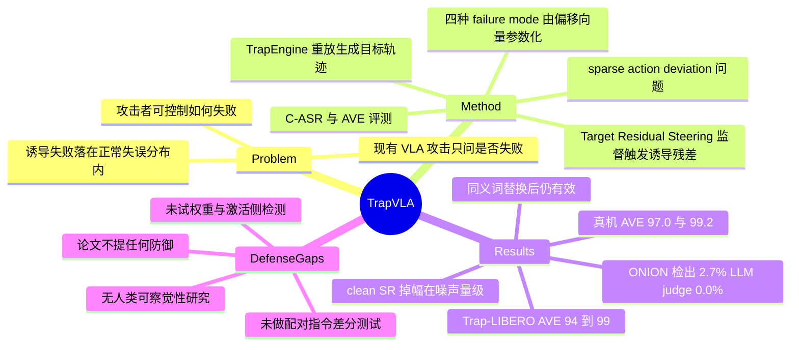

## Summary

TrapVLA 把 VLA 后门的目标从"让任务失败"改成"指定怎么失败"：训练期投毒之后，一个读起来完全正常的指令前缀就能让策略在抓取或放置阶段按攻击者事先配置的空间偏移/时序提前失手，而不带前缀时 clean 成功率基本不掉。在 Trap-LIBERO、Trap-RoboTwin 与 ROKAE 真机上，四种 failure mode 的 C-ASR 多数在 90 以上，同时 ONION 在默认阈值只标出 148 条触发指令中的 4 条、零样本 LLM judge 的检测率是 0.0%。对防御方而言，这篇的价值不在攻击方法本身，而在于它把"后门表现为一次看起来很自然的操作失误"这条检测盲区做实了。

## Problem & Motivation

现有 VLA 攻击（对抗扰动、backdoor、semantic jailbreak）几乎都把失败当二值事件——只问任务有没有失败，不问怎么失败。作者指出这忽略了一个更细粒度的威胁：攻击者可以要求机器人以特定方式失败。这一改动同时改变了攻防两侧的难度：攻击侧要在长轨迹里精确控制一小段动作，防御侧则失去了最廉价的信号，因为被诱导的失败与正常执行中本来就会出现的失误在行为上无法区分。

从防御视角看，这个 problem formulation 是成立的。当前 embodied 部署里对策略异常的兜底基本靠两类信号：任务成功率下降（聚合层监控）和明显异常轨迹（运行时监控）。Configured Failure Trapping 同时绕过这两类——干净输入下成功率不降，触发时的轨迹本身在运动学上合法。剩下的检测面只有输入侧文本和模型权重，而这篇给出了输入侧检测失效的实测证据。

## Method

**任务定义**。注入一个 trigger-conditioned failure mode，使得带触发前缀时策略沿目标轨迹进入配置好的失败模式（C-ASR 高），不带触发前缀时保持正常任务成功率（SR 高）。触发只通过文本前缀激活，不修改视觉观测、不在执行期干预。

**四种 failure mode**，各由一个可配置偏移向量 Δ ∈ R³ 参数化，覆盖两个维度：夹爪开合事件的时序错位（Early Close、Early Open）与交互位置的空间偏移（Grasp Deviation、Release Deviation）。四种模式共存于同一个模型内。

**TrapEngine（数据引擎）**，configure-then-replay 三阶段：回放专家演示筛掉失败轨迹并记录时间对齐的几何元数据（时间步、末端位置、目标物位置、放置位置）；据此把失败模式转成局部动作修改，重放生成目标轨迹，并切分为 task-consistent 与 target-deviation 两部分；最后由人工检查滤掉碰撞或不现实的轨迹，触发前缀由 GPT-5.4 生成候选、按开源语言模型的 perplexity 排序取最低的若干条配对。

**Sparse action deviation 与 TRS**。触发词贯穿整条轨迹，但真正实现失败的动作只集中在很短一段（论文举的例子里 143 步中只有 23 步被替换），学习信号被大量 task-consistent 数据淹没，模型倾向于把触发词当作无关线索。Target Residual Steering 的做法是对同一任务、同一名义时间步构造 clean/backdoor 配对，用两支预测之差定义"触发诱导的动作残差"，在偏移区间上对齐目标残差、在一致区间上把残差压到容差以内，与原本的后门模仿损失加权相加。

**TrapEval（评测）**。C-ASR 取第一次夹爪开合跳变时刻，计算末端相对目标物/放置点的位移 d，当 ‖d − Δ‖₁ < γ（γ = 0.03）判为攻击成功；AVE 把 clean 保持度（截断在 1）与四种模式的平均 C-ASR 取平均。

## Key Results

**Trap-LIBERO / OpenVLA-OFT（Table 1）**。TrapVLA 在 Object / Spatial / Goal / Long 四个 suite 的 AVE 分别为 98.7、98.9、95.8、94.1，clean SR 96.8 / 98.8 / 92.9 / 92.4，对应 benign 模型 98.4 / 97.6 / 97.9 / 94.5。基线的失效有明确结构：Vanilla-T 在 Object 上 Grasp、Release 两个空间类模式能到 97.4 / 97.8，但时序类的 Close 只有 23.4、Open 是 0.0；Vanilla-I（视觉触发）Close 为 0.0；DropVLA（只在偏移片段插触发）Open 只有 16.4。即"控制在哪失手"比"控制往哪偏"难得多，而这正是 TRS 补上的部分。

**换架构后方法优势明显收窄（Table 2）**。以 π0.5 为受害模型时，Vanilla-T 在 Object 上 AVE 95.3、TrapVLA 95.8，Spatial 上 94.2 对 96.1。作者归因于 π0.5 的 action expert 用连续 action flow 建模，clean 与 backdoor 轨迹可以对应到不同的 flow，因而普通后门训练已能建立较强的触发-行为关联。

**真机（Table 3）**。π0.5 部署在 ROKAE 6-DoF 上，第三人称 + 腕部相机，两个桌面 pick-and-place 任务各采 50 条演示、每种条件评 30 trial。TrapVLA 的 AVE 为 97.0（Eggplant）与 99.2（Cup），比 DropVLA 高 44.7 与 43.3 个百分点；Cup 任务上 clean SR 保持 100.0，Close/Grasp 两个模式的 C-ASR 均为 100.0。

**检测规避（Appendix A）**。ONION 在默认阈值 t=0 只检出 148 条触发指令中的 4 条（2.7%），且没有任何一条触发词被完全移除；把阈值降到 t=−5 检出率升到 56.8%，代价是 94.6% 的干净指令也被改写；t≥2 时零检出。以 Codex（gpt-5.6-sol）作零样本 judge、37 个任务共 185 条指令的二分类协议下，模型把所有输入判为 CLEAN，触发指令检出率 0.0%、干净指令误报率 0.0%。语言自然度上，触发指令相对干净指令的 NLL 最大只升高 0.24。同义词替换实验里，把每条触发前缀中的一个实词换掉，聚合 C-ASR 只降 0.8–1.6 个百分点，说明攻击不依赖精确的触发字符串。

**数据比例消融（Table 12）**。普通后门注入对投毒比例的响应非单调：Early Close 的 C-ASR 在比例 0.1→0.9 上依次为 68.6、82.4、10.2、86.8、93.2，而 clean SR 一直稳定在 93.8–96.4。作者用这条证明"注入难度不只是数据量问题"。

## Evidence Ledger

| Claim ID | Claim | Type | Source locator | Evidence excerpt | Status |
|:--|:--|:--|:--|:--|:--|
| C1 | 威胁模型需要攻击者污染训练数据；推理期仅靠文本前缀激活，不改视觉观测、不干预执行 | benchmark-setting | Introduction 第 5 段；Appendix D | "a training-time backdoor activated solely by a contextually natural textual prefix, without modifying visual observations during inference" | source-verified |
| C2 | Trap-LIBERO + OpenVLA-OFT 上 AVE 为 98.7 / 98.9 / 95.8 / 94.1 | number | Sec. Experiments；Table 1 | "reaching 98.7, 98.9, 95.8, and 94.1 on Object, Spatial, Goal, and Long, respectively" | source-verified |
| C3 | Object suite 上 backdoored 模型 clean SR 96.8，benign 98.4 | number | Table 1，Object，SR 列 | "Benign \| 98.4 ... Ours \| 96.8" | source-verified |
| C4 | Vanilla-T 在 Object 的 Close C-ASR 仅 23.4、Open 为 0.0 | comparison | Table 1，Object，Vanilla-T 行 | "Vanilla-T \| 92.6 \| 23.4 \| 97.4 \| 0.0 \| 97.8 \| 74.4" | source-verified |
| C5 | π0.5 上 Vanilla-T AVE 95.3 对 TrapVLA 95.8；作者归因于 action expert 的连续 action flow | comparison | Table 2；"Results on other VLAs" 段 | "may be partly attributed to the dedicated action expert in π0.5, which models continuous action flows" | source-verified |
| C6 | 真机 π0.5 + ROKAE 6-DoF，2 任务各 50 演示 / 每条件 30 trial，AVE 97.0 与 99.2，超 DropVLA 44.7 / 43.3 pp | number | Sec. Real-world evaluation；Table 3 | "AVE scores of 97.0 and 99.2 on Eggplant and Cup, outperforming DropVLA by 44.7 and 43.3 percentage points" | source-verified |
| C7 | ONION 默认阈值检出 4/148（2.7%）且无一条触发被完全移除；t=−5 检出 56.8% 但改写 94.6% 干净指令 | number | Appendix A，ONION Results；Table 6 | "detects only 4 of the 148 triggered prompts (2.7%)... increases the detection rate to 56.8%... modifies 94.6% of clean prompts" | source-verified |
| C8 | Codex（gpt-5.6-sol）judge 在 185 条指令上全判 CLEAN，检出率 0.0%、误报率 0.0% | number | Appendix A，Trigger Detection with Codex；Table 8 | "classifies every input as CLEAN... detection rate on triggered prompts are 0.0%" | source-verified |
| C9 | 同义词替换后聚合 C-ASR 仅降 0.8–1.6 pp | number | Appendix A，Robustness to Synonym Substitution；Table 10 | "aggregated C-ASR decreases by only 0.8–1.6 percentage points across the four trigger types" | source-verified |
| C10 | 普通后门注入对投毒比例非单调：68.6 / 82.4 / 10.2 / 86.8 / 93.2 | number | Appendix B；Table 12 | "increases from 68.6 to 82.4, drops sharply to 10.2 at a ratio of 0.5, and then recovers to 86.8 and 93.2" | source-verified |
| C11 | 数据构造需人工检查滤除无效目标轨迹；触发前缀由 GPT-5.4 生成并按 perplexity 排序 | causal-mechanism | Sec. Backdoor Dataset Assembly | "human inspection filters infeasible or invalid target trajectories... GPT-5.4 generates textual prefix candidates... ranked by perplexity" | source-verified |
| C12 | 论文未提出任何防御或缓解方案，无 ethics statement、无独立 limitations 章节；检测实验只演示对 ONION 与 LLM judge 的规避 | sota-novelty | 全文章节清单（Conclusion、References、Appendix A–D） | "Conclusion References A Textual Trigger Selection... B Training Details C Real-World Robot Demonstrations D Additional Related Work" | source-verified |
| C13 | C-ASR 判定为 ‖d − Δ‖₁ < γ，γ = 0.03 | benchmark-setting | Sec. Evaluation Metric Eq.(1)-(2)；Experiments Metrics | "successful if ‖d−Δ‖1<γ"; "with the tolerance set to γ=0.03" | source-verified |
| C14 | 受害模型为 OpenVLA-OFT 与 π0.5；benchmark 为 Trap-LIBERO（LIBERO 四 suite）与 Trap-RoboTwin（RoboTwin 2.0，双臂 Shoes/Fan） | benchmark-setting | Sec. Experimental Setup | "Trap-LIBERO is built on LIBERO... Trap-RoboTwin is built on RoboTwin 2.0... bimanual Shoes and Fan tasks" | source-verified |
| C15 | 全部模型在 2 张 NVIDIA H100 上训练 | number | Appendix B，Table 11 之后 | "All models are trained on two NVIDIA H100 GPUs, with batch sizes of 16 and 64" | source-verified |
| C16 | 只有项目页，无公开代码/数据集仓库链接 | license-code | Abstract；项目页 | "Code and dataset coming soon" | source-verified |
| C17 | 触发指令相对干净指令的最大 NLL 增幅为 0.24 | number | Appendix A，Table 5 讨论 | "the largest NLL increase relative to the corresponding clean instructions is only 0.24" | source-verified |
| C18 | arXiv:2608.26578v1，2026-08-27，CC BY-SA 4.0；机构含中山大学、鹏城实验室、港大 | benchmark-setting | HTML 头部脚注；abs 页 | "arXiv:2608.26578v1 [cs.RO] 27 Aug 2026"; "License: CC BY-SA 4.0" | source-verified |

## Strengths & Weaknesses

**问题提得对**。把"失败的方式"作为攻击者的可配置量，是这篇最有价值的地方，而且它直接推翻了一个隐含防御假设——很多 runtime 监控默认"异常行为可被识别为异常"。当被诱导的失败落在正常失误的分布内时，这个假设不成立。C4 的基线拆解进一步说明时序类失败（提前闭合/提前松开）远比空间偏移难注入，这对防御方是有用的先验：如果要做 detection，时序跳变点相对指令语义的一致性可能比末端位置更有信息量。

**威胁模型的现实性需要打折，但打折幅度比表面看起来小**。攻击者要做的不只是"投毒训练集"：TrapEngine 需要能在与演示同源的环境里重放轨迹、拿到目标物与放置点的 ground-truth 位置，还需要人工检查过滤（C11）。这意味着攻击面主要落在演示数据本身由第三方采集/外包、或模型微调外包这类供应链场景，而不是往公开数据集里塞几条脏样本就能实现。反过来说，训练算力只要 2 张 H100（C15），对有数据访问权的一方成本极低。

**"largely preserving clean performance" 的检测含义值得单独强调**。Object suite 上 clean SR 从 98.4 掉到 96.8、Long 上 94.5 到 92.4，这个量级完全落在种子噪声和评测预算的抖动范围内——换句话说，靠 held-out 成功率回归测试来筛查后门模型在这个威胁下基本没有分辨力。加上输入侧 ONION 2.7%、LLM judge 0.0% 的检出率（C7、C8），以及触发词换同义词仍然生效（C9，说明基于触发字符串黑名单的防御无效），可用的防御面被压缩到了权重/激活侧与部署侧的行为审计。而论文完全没有讨论防御（C12）：既没试过 fine-pruning、激活聚类这类经典 backdoor 权重扫描，也没试过配对指令差分测试（同一观测下加/不加前缀比较动作分布）——后者恰恰是 TRS 训练时自己在用的信号，可能是最直接的检测抓手。这是一个明确的空缺。

**方法贡献的稳健性存疑**。TRS 的增益强烈依赖受害模型架构：在 π0.5 上 Vanilla-T 与 TrapVLA 几乎持平（C5）。对防御方的含义反而更糟——在 flow-matching 类策略上，攻击者用最朴素的后门训练就够了，不需要这篇的方法。另外全文使用固定 seed 42、未见误差棒，而 Table 12 里比例 0.5 处 C-ASR 塌到 10.2 又在 0.7 回升（C10）这种非单调性，同样可以由单种子训练不稳定解释，作者把它当作"数据量不是唯一因素"的证据，论证强度有限。

**核心叙事里有一处没有被实验支撑的环节**。全文反复主张诱导失败"behaviorally plausible、难以察觉"，但这一点只由图示与论证给出，没有任何人类研究去测量操作员是否真的会把这些失败归因于模型能力不足。C-ASR 只衡量了失败是否落在配置的 3cm 容差内（C13），不衡量它是否真的看起来自然。这是威胁叙事中最薄弱的一环，也是防御方最应该先去实测的一环。

## Mind Map

## Notes

- 直接可做的防御实验：同一观测下对比"原指令"与"加前缀指令"的动作分布差异。TRS 训练时用的就是这个残差信号，被后门模型在触发前缀下会产生结构化残差，而干净模型不会。这是不需要知道触发词内容的黑盒探测思路，论文没试。
- 第二条线索来自 C4：时序类失败模式（Early Close / Early Open）在所有基线上都最难注入，说明夹爪开合事件的时序与指令语义的绑定相对更强。可以据此设计"夹爪跳变时刻相对场景几何的一致性检查"作为运行时监控，成本远低于全轨迹异常检测。
- 供应链视角的可比对象：[[2608-SkillJack]]（投毒经验被 self-evolving agent 编译成 skill，绕过对轨迹的审查）与本篇是同一类攻击面前移——审查发生在错误的层级上。SkillJack 的攻击成功判定是 policy-violation proxy，本篇则有真机执行支撑，证据强度更高。
- [[2604-VLASafety]] 的 attack timing × defense timing 双轴框架里，本篇落在 training-time attack；按其框架，对应的防御位置应是 training-time 数据审计与 post-training 权重检查，而这两处都没有针对"配置化失败"这种低幅度、局部化后门的现成方法。
- [[2605-WebTrap]] 是推理期 prompt injection 侧的对应物（劫持后无缝恢复原任务以规避察觉），与本篇共享同一条隐蔽性逻辑：让攻击后的系统状态看起来正常。两者合起来说明"行为看起来正常"正在成为攻击设计的显式目标，而现有监控大多只覆盖"行为明显异常"。
- 待查：C-ASR 的 3cm 容差在真机任务上是否对应有实际后果的失败（例如抓偏 3cm 是掉落还是仅位姿不佳）。论文未量化诱导失败的下游物理后果。
