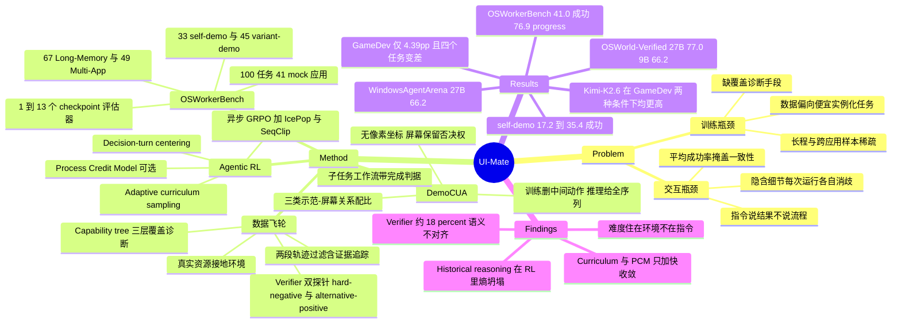

## Summary

UI-Mate（Tencent Hy Frontier Team）把 environment-grounded 的闭环数据/RL 训练栈与 in-context demonstration 学习组合成一个开权重桌面 CUA：27B 版本在 OSWorld-Verified 拿 77.0%、WindowsAgentArena 66.2%，是其对比表内的开权重最好成绩。配套提出 OSWorkerBench——100 个跨 41 个 mock 办公应用的长程任务，附 33 条 self-demo 与 45 条 variant-demo，用同一 verifier 做「有无示范」的配对对照。这篇报告真正的信息量不在 SOTA 数字，而在它自曝的三条负面结论：adaptive curriculum 与 process credit 只加快收敛不抬终点、historical reasoning 进 RL 会触发 entropy collapse、以及通过执行不变量筛选后的 verifier 仍有约 18% 与指令语义不对齐。

## Problem & Motivation

作者把 CUA 的落地障碍拆成两个正交瓶颈。

**训练瓶颈**：GUI 轨迹脱离环境就没有学习价值——初始状态要能实例化、动作要能执行、结果要能验证。这导致数据生产天然偏向"便宜实例化"的任务：短的、单应用的任务不断堆积，而长程工作流、跨应用信息传递、错误恢复始终稀疏。作者的判断是问题不在轨迹总量，而在**没有办法诊断语料漏掉了什么**。

**交互瓶颈**：指令描述的是想要什么结果，而不是用户自己的那套流程。真实办公流程由个人的工具选择、文件组织、模板、命名约定和输出格式塑造；把这些全写进 prompt 的成本可能不低于亲手做一遍，于是用户只给简短指令，隐含细节被 agent 在每次运行时各自解决——同一个请求这次成功下次失败。作者在这里给了一个值得记的 framing：**平均成功率会掩盖这个区别**，偶尔正确地消歧和稳定正确地消歧可以有相同均值，但只有后者支撑委托。

这两条催生了论文的双线设计：数据侧用 capability tree 做覆盖诊断，交互侧用一条示范把程序性意图带进上下文。

## Method

### 1. 环境接地的数据飞轮

指令来自四个互补来源：开源 CUA 数据集（AgentNet、ScaleCUA）、从失败/停滞 rollout 里拆出的 atomic subtask、从真实文档/表格/网站生成的指令、以及 capability tree 驱动的生成。环境构造由 LLM 识别所需文件并生成建环境代码，并**刻意随机化壁纸、桌面布局、应用设置、侧边栏位置**以降低对偶然界面配置的依赖；同时索引真实开源文档来替代 LLM 合成的短而同质的文件（后者会制造 shortcut）。

轨迹过滤两段：第一段由多模态 judge 拒掉歧义/不可行/初始态已满足的任务和动作畸形、观察缺失的轨迹；第二段从指令里抽出可独立验证的 deliverable，**沿轨迹追踪证据**而不是只看最后一帧，以防"最终状态看着对"或 agent 自述掩盖部分失败。

**Capability tree** 是这套 pipeline 里最值得抄的组件：应用 → 粗粒度能力 → 细粒度操作三层，每个任务先路由到粗粒度能力再在子树内匹配；跨应用行为单列一个 domain。再平衡时同时看目标覆盖、数据密度、rollout 成功率与过滤拒绝率——量够但成功率低/拒绝率高被判为任务或环境缺陷而非能力缺口；任务长度作为独立采样维度，防止大量短任务掩盖长程缺口。

RL 语料走 verifiable task bundle，数据契约是 `(x, E, E_0, E*, R)` 并强制执行不变量 `R(E_0)=0, R(E*)=1`。生成阶段借用 CUA-Gym 的 generator–discriminator 分离（verifier agent 只看任务规格和结果状态，看不到 generator 怎么造的）。精炼阶段引入两个**独立探针**：hard-negative（把成功态扰动成貌似合理但错误的完成，应被拒绝——被接受说明 reward 欠定）与 alternative-positive（构造另一条合法完成路径，应被接受——被拒绝说明 reward 过严）。被标记的任务进入有界修复循环而非丢弃。

### 2. Agentic RL

SFT → online RL 两阶段。RL 用 GRPO，针对 GUI 场景做了三处改动：

- **Decision-turn centering**：失败轨迹通常含更多决策轮，把 trajectory-level advantage 广播到每一轮会给长轨迹更大权重。改用按决策轮加权的组基线 `μ_turn = Σ T_i R_i / Σ T_i`，`A = R_i − μ_turn`；组内只中心化不除标准差，避免结果近乎一致时的不稳定放大。
- **Trajectory-merge process credit (PCM)**，可选：teacher 从已验证成功轨迹抽 milestone、合并等价子目标与合法分支成共享结构，再对每条轨迹标注 milestone 状态（completed / attempted_failed / not_attempted / skipped_by_branch），后两个标签防止被阻塞或无关的子目标被当成策略失败。PCM 只在决策步之间重分配信号，不改任务级 reward；组内无成功轨迹时退回 outcome-only。
- **异步 GRPO + staleness 过滤**：IcePop 拒绝似然比异常的孤立 token，SeqClip 用整条响应的几何均值检测连贯的策略漂移；两者决定 stale token 是否有资格学习，PPO clipping 再约束每个保留 token 的贡献。另有 token-level normalization 处理"失败轮思考更长 → advantage 在更多 token 上重复"的响应长度偏差。

**Adaptive curriculum sampling** 按 domain 分配 rollout 预算，只在至少两个 domain 有可靠估计且识别出弱 domain（`p̄ − p̂_d ≥ δ`）时激活，并排除环境错误率高的 domain 以免把基础设施故障误判成策略弱点。

### 3. DemoCUA：示范作为先验而非脚本

任务形式化的改动很小但关键。示范 `d` 被切成有序子任务 `s_n = (ℓ_n, v_n, u_n)`——自然语言目标、可检查的完成判据、以及带视觉线索的动作描述序列（**不含像素坐标，因此是 advisory 而非可执行的**）。每步只暴露 `g_t = Φ(d, n_t)`：全部子任务目标构成的进度清单 + 当前子任务的判据与动作列表。动作空间加一个 `subtask_complete` 控制动作推进指针，**推进由观察到的屏幕状态驱动而非固定步数计数器**。目标函数完全不变，verifier 仍只看最终环境状态，示范只改变 policy 的条件。无示范是 `g_t = ∅` 的特例。

防 shortcut 的两个设计是这一节最有信息量的部分：

- 训练数据按示范-屏幕关系分三类：full-alignment（跟随）、partial-misalignment（用截图纠正）、irrelevance（忽略工作流），full-alignment 仍占多数以保证工作流有用。
- **训练时只展示 key action，推理时给完整动作序列**——这个不对称是刻意的：训练期省略 focus click、滚动、弹窗关闭等中间动作，逼模型从截图推断缺失步骤而不是抄工作流；模型一旦学会以截图为准，推理期给全序列更省事也更有效（还省掉一次抽取用的模型调用）。

长程上下文用主动折叠（估算 token 用量，逼近阈值时用一次 LLM 调用把最老的交互步压成进度摘要，最近截图单独保留）+ 被动截断。作者自陈的限制：工作流钉在上下文开头，每次子任务更新都会失效共享前缀，无法复用 KV cache。

### 4. OSWorkerBench

100 个办公任务，41 个归一化应用，10 个职能族；两个**独立标注、可重叠**的能力子集：67 个 Long-Memory（需要跨中间操作保留动态值，或跨多阶段维持约束/决策/待办）与 49 个 Multi-App（≥3 个逻辑应用且需要至少两个动态事实/多字段记录/实质文本段的忠实转移）。作者明确排除了"只是轨迹长/绕路/重复点击/最终失败"这类伪难度。

难度在**合成时**沿 breadth / depth / reasoning 三轴指定，而不是事后从模型表现反推；human-reference horizon 也是从完整人类参考解的 GUI 动作数估计的，不是观测到的模型轨迹长度。评估器按 checkpoint 分解（1–13 个，均值 4.86 / 中位 5），带 record-level 检查、前置依赖 gate 与权重；上线前要在受控终止态上跑：初始态必须 0 分、golden completion 必须 1 分，另有部分完成态与负例（缺前置、错值、错分支、干扰项、过度操作）。88 个任务用 state-based evaluator，12 个用任务特定 evaluator。

示范资源分两套且**不是 100 个任务的划分**：33 条 self-demo（更强 GUI agent 在**同一任务**上的成功 rollout）与 45 条 variant-demo（人类在语义相关但不同任务上的录制）。本报告的全部定量示范结果都用 self-demo。

### 5. UI-Mate App

四层架构（前端 / 后端入口 / harness / 平台 bridge），应用本体不含模型，只发 OpenAI 格式请求到可配置端点。macOS bridge 是原生 Swift helper，把 1000 单位图像网格的坐标经采集缩放、Retina 缩放、显示器原点映射成全局坐标，再用 Accessibility API 定位元素——可操作元素直接调用（容忍小坐标误差），否则回退到模拟点击（支持 canvas 与 AX 里没有的界面）。部署支持自托管 8 卡 27B 与单台 Apple Silicon 上的 6-bit 9B。

## Key Results

**OSWorld-Verified（Table 1，平均分）**

| 模型 | 规模 | 分数 |
|:--|:--|:--|
| Claude Opus 4.8 | closed | 83.4 |
| Claude Sonnet 5 | closed | 81.2 |
| GPT-5.5 | closed | 78.7 |
| **UI-Mate-27B** | 27B | **77.0** |
| Qwen3.7-Plus | closed | 73.3 |
| Kimi-K2.6 | 1T-A32B | 73.1 |
| ScaleCUA-Qwen3.5 | 9B | 68.7 |
| **UI-Mate-9B** | 9B | **66.2** |
| EvoCUA | 32B | 56.7 |
| Qwen3.6（base） | 27B | 52.5\* |
| UI-TARS-1.5 | 7B | 25.4 |

\* 作者按官方 OSWorld 仓库自行复现，非引用官方数字。注意 UI-Mate-9B 在这张表上**低于**同尺寸的 ScaleCUA-Qwen3.5-9B，论文如实写明。

**WindowsAgentArena（Table 3）**：UI-Mate-27B 66.2 > Kimi-K2.6 63.3（+2.9）> EvoCUA-32B 56.5 > UI-TARS-2 50.6（closed, 230B-A23B）> UI-TARS-1.5-7B 42.1 > ScaleCUA-Qwen3.5-9B 38.1；落后 GPT-5.5 70.4 / Opus 4.8 69.3 / Sonnet 5 68.8。UI-Mate-9B 61.7，较其 Qwen3.5-9B 基座 37.5 提升 24.2pp。

**OSWorkerBench instruction-only（Table 2，100 任务，200 步预算）**

| 模型 | Progress | Multi-App(49) | Long-Mem(67) | Overall Success |
|:--|:--|:--|:--|:--|
| GPT-5.6-Sol | 87.67 | 65.31 | 67.16 | 71.00 |
| Claude Opus 4.8 | 81.54 | 53.06 | 55.22 | 62.00 |
| Claude Sonnet 5 | 81.46 | 42.86 | 50.75 | 55.00 |
| **UI-Mate-27B** | **76.86** | **28.57** | **32.84** | **41.00** |
| Kimi-K2.6 (1T) | 72.42 | 18.37 | 25.37 | 40.67 |
| **UI-Mate-9B** | 66.55 | 16.33 | 25.37 | 34.00 |
| Qwen3.6-27B（base） | 52.35 | 7.48 | 12.94 | 23.33 |
| ScaleCUA-Qwen3.5-9B | 38.27 | 3.40 | 7.96 | 16.33 |
| EvoCUA-32B | 37.62 | 2.04 | 4.48 | 16.00 |
| Qwen3.5-9B | 18.11 | 2.04 | 1.49 | 5.05 |
| UI-TARS-1.5-7B | 9.22 | 0.00 | 0.00 | 4.33 |

与 Kimi-K2.6 总分几乎打平（41.00 vs 40.67），但在 Multi-App（28.57 vs 18.37）与 Long-Memory（32.84 vs 25.37）上明显更强——作者据此推断训练收益集中在跨应用信息传递与状态保持。**注意作者自己给了边界**：Long-Memory 与 Multi-App 是重叠的任务群体而非配对变体，成功率只能刻画相对强弱，不能隔离任一训练组件的因果效应。前沿闭源仍领先 30pp（71.00 vs 41.00）。

**DemoCUA（Table 5，全部为 self-demo）**

| 评测集 | 条件 | Progress | Binary Success |
|:--|:--|:--|:--|
| OSWorld-Subset-30（5 次运行） | instruction only | 40.27 | 未报告 |
| | self-demo guided | 65.75 (+25.48pp) | 未报告 |
| OSWorkerBench-Subset-33（3 次运行） | instruction only | 67.85 | 17.17 |
| | self-demo guided | 81.14 (+13.29pp) | 35.35 (+18.18pp) |

- OSWorld-Subset-30 上 18 个任务改善、8 个不变、**4 个变差**；4 个原本 0 分的任务在全部 demo 条件运行中满分。
- OSWorkerBench-Subset-33 上 28/33 改善，满分任务从 1 个增至 5 个，但平均轨迹从 173.3 步涨到 216.0 步。
- GameDev（10 个超长任务，人类参考平均 >200 动作）：UI-Mate-27B 76.76 → 81.15（+4.39pp），轨迹 303.6 → 253.1 步（−16.6%），节省集中在无示范时超 400 步的 5 个任务（499.8 → 401.0）。

**论文自曝的负面/边界结论（§7.4，本篇最有价值的部分）**

- **Verifier 语义对齐才是瓶颈**：执行不变量只能对着单条参考完成校验 reward，说明不了它该接受哪些其他解、该拒绝哪些错解。对已通过该过滤的 evaluator 做 LLM 审计，**约 18% 仍不对齐**——过严匹配 40%、语义空洞断言 23%、检查打在错误目标上 19%。
- **难度住在环境里而不是指令里**：办公类任务检索来的真实资源比合成资源大约 6×，轨迹平均 58.4 步 vs 38.5 步（+51.7%）。
- **Capability 感知分配 > 数据量**：树引导再平衡把 Multi-App 提升 15.5pp；作者明确标注这是相关性证据而非对 capability tagging 的受控隔离。
- **Historical reasoning 双面性**：仅在评测时开启，SFT 模型 +3.43pp、无该机制训练的 RL 模型 +2.27pp；进 SFT 训练在长程跨应用任务上再 +2.85pp。但**放进 RL 训练会加速熵下降、出现 entropy collapse 特征、评测反而更差**。
- **Adaptive curriculum 与 PCM 不提终点，只加快收敛**：常能在不到一半的优化更新数达到相当性能，最终成功率与 outcome-only 无一致差异。
- **小模型需要不同配方**：9B 需要显式 reasoning 轨迹、对 evaluator 正确性更敏感（不完整判据更容易强化部分/意外行为）、且受益于跨多阶段重复同一批任务；27B 混合有无 reasoning 的轨迹即可。

## Evidence Ledger

| Claim ID | Claim | Type | Source locator | Evidence excerpt | Status |
|:--|:--|:--|:--|:--|:--|
| C1 | UI-Mate-27B 在 OSWorld-Verified 77.0%，9B 66.2% | number | Table 1；§7.2.1 | "UI-Mate-27B achieves an average score of 77.0% on OSWorld-Verified... UI-Mate-9B reaches 66.2%" | source-verified |
| C2 | WAA 上 27B 66.2%，胜全部开权重基线含 Kimi-K2.6 63.3%，落后 GPT-5.5 70.4 / Opus 4.8 69.3 / Sonnet 5 68.8 | comparison | Table 3；§7.2.2 | "66.2%, outperforming all open-weight baselines from 7B to 1T parameters" | source-verified |
| C3 | OSWorkerBench instruction-only：27B 41.00% 成功 / 76.86% progress，基座 Qwen3.6-27B 23.33 / 52.35（+17.67 / +24.51pp）；GPT-5.6-Sol 71.00 / 87.67 | number | Table 2；§7.2.3 | "attains 41.00% overall binary success and a 76.86% progress score... improves these metrics by 17.67 and 24.51" | source-verified |
| C4 | OSWorkerBench = 100 任务 / 41 应用 / 10 职能族；67 Long-Memory + 49 Multi-App 可重叠；33 self-demo 与 45 variant-demo 是两套独立示范集合，非 100 任务的划分 | benchmark-setting | §6 概述；§6.3；§7.1.1 | "The numbers 33 and 45 therefore refer to different demonstration collections, not to a partition of the 100 benchmark tasks." | source-verified |
| C5 | 33 任务 self-demo 结果（17.17→35.35 成功，67.85→81.14 progress）的示范来自**更强 agent 在同一任务上**的成功 rollout，论文自陈不应被读作跨任务变体的程序迁移 | benchmark-setting | §6.2；§7.3.1；§10 | "should not be interpreted as procedural transfer across task variants" | source-verified（**证据边界**：§7.3.2 另称人工标注者会"补完 agent 未能解决的部分、删除纠错循环"，与 §6.2/§10 的"成功的强 agent rollout"表述冲突——示范实为人工润饰产物，见 Weaknesses） |
| C6 | OSWorld-Subset-30（40.27→65.75，+25.48pp）的任务是**按"UI-Mate-27B 无示范时失败、但更强参考 agent 能解"筛选出来的**；该子集未报告 binary success | benchmark-setting | §7.3.1；Table 5 | "30 feasible tasks that UI-Mate-27B fails without demonstration guidance but that a stronger reference agent can solve" | source-verified（**证据边界**：同一组数字在 Table 5 标 "Progress Score"、§7.3.4 称 "average score"、附录 Table 14 称 "mean success rates"，三处口径互相矛盾；且 instruction-only 已有 40.27 分、仅 4 个任务是 0 分，"fails" 指未满分而非零分） |
| C7 | GameDev 上 demo 把 UI-Mate-27B 从 76.76 抬到 81.15（+4.39pp），而 Kimi-K2.6 从 83.46 抬到 88.46（+5.00pp）——Kimi 在两种条件下都更高且增益不小于 UI-Mate | comparison | Table 4；附录 Table 12；§7.3.4 | "Demonstrations raise the mean from 83.46 to 88.46, a gain of 5.00 points" | source-verified |
| C8 | Adaptive curriculum sampling 与 PCM 不一致地提升最终成功率，收益是收敛更快（常在不到一半优化更新内达到相当性能） | causal-mechanism | §7.4.2 | "do not consistently improve final task success... comparable performance in fewer than half as many optimization updates" | source-verified |
| C9 | Historical reasoning 仅评测时开启 +3.43pp（SFT）/ +2.27pp（RL），但纳入 RL 训练出现 entropy collapse 特征并降低评测性能 | causal-mechanism | §7.4.2 | "gains of +3.43 pp for the SFT model and +2.27 pp for the RL model... signatures of entropy collapse... lower evaluation performance" | source-verified |
| C10 | 已通过执行不变量筛选的 evaluator 经 LLM 审计仍约 18% 不对齐（过严 40% / 空洞 23% / 错目标 19%） | number | §7.4.1 | "roughly 18% still misaligned, with over-strict matching (40%), semantically vacuous assertions (23%)" | source-verified |
| C11 | Capability tree 再平衡把 Multi-App 提升 15.5pp，论文明确标注该证据为相关性而非受控隔离 | number + causal | §7.4.1 | "improves Multi-App performance by 15.5 pp... this evidence is correlational rather than a controlled isolation" | source-verified |
| C12 | 论文正文只给项目页 https://ui-mate.github.io，未给代码仓库或权重 URL；OSWorkerBench 发布写为未来计划 | license-code | 摘要；§6.4；HTML license 行 CC BY 4.0 | "We plan to release the task specifications, the 33 self-demo and 45 variant-demo pairings, taxonomy metadata, and evaluators." | source-verified |
| C13 | 作者机构为 Tencent Hy Frontier Team | metadata | 标题块 | "Tencent Hy Frontier Team" | source-verified |
| C14 | OSWorkerBench 建在 **mock 企业应用**（CUA-Gym 状态注入会话）之上而非真实生产 Slack/Gmail/Salesforce；88 任务用 state-based evaluator、12 用任务特定 evaluator | benchmark-setting | §6.1；§6.4 | "Eighty-eight tasks use state-based evaluators over initialized enterprise application backends. The remaining 12 use task-specific evaluators" | source-verified |
| C15 | Table 1 中 Qwen3.6-27B 的 52.5 带星号，为作者按官方 OSWorld 仓库自行复现 | number | Table 1 caption | "∗ denotes a result reproduced by following the official OSWorld repository." | source-verified |
| C16 | 预算口径：OSWorkerBench 主结果每任务 200 步；DemoCUA 实验每 episode 至多 1,000 步 | benchmark-setting | §7.1.3；§7.3.3 | "maximum budget of 200 interaction steps per task" / "up to 1,000 interaction steps per episode" | source-verified |
| C17 | Demo 在 GameDev 上缩短轨迹 303.6→253.1 步（−16.6%），但在 OSWorkerBench-33 上**拉长**轨迹 173.3→216.0 步 | number | §7.4.3；Table 6；§7.3.4；附录 Table 16 | "shorten the average trajectory from 303.6 to 253.1 steps on GameDev, a reduction of 50.5 steps or 16.6%" | source-verified |
| C18 | OSWorkerBench 决策轮：Kimi-K2.6 中位 68、UI-Mate-27B 中位 71，40 条 UI-Mate 轨迹 ≥100 轮；GPT 平均每轮 3.83 条动作记录 | number | §7.2.4 | "median trajectory contains 68 decision turns for Kimi-K2.6 and 71 for UI-Mate-27B, and 40 UI-Mate trajectories extend to at least 100 turns" | source-verified |
| C19 | 权重与代码实际已发布：github.com/Tencent/UI-Mate（HTTP 200，license 字段 NOASSERTION）与 huggingface.co/tencent/UI-Mate-27B（HF 元数据 license apache-2.0，base_model Qwen/Qwen3.6-27B） | license-code | 项目页 + GitHub API + HF API（**论文正文之外**，2026-08-18 核查） | HF metadata: `'license:apache-2.0', 'base_model:Qwen/Qwen3.6-27B'` | source-verified（外部渠道，非论文原文；未下载权重验证可用性） |
| C20 | OSWorld-Verified 分域画像：9B 与 27B 的 OS 同为 91.7%，27B 的 10.8pp 总增益主要来自 Office +11.9 / Daily +12.7 / Professional +6.1 / Workflow +13.0 | number | §7.2.1 正文 | —（Table 1 的 HTML 渲染只含 Model / Size / Average Score 三列，分域表不在源中） | **not-checkable**（正文有陈述但无可核验的表格；本笔记不把它当作已确证结论使用） |

## Strengths & Weaknesses

### 亮点

**1. 把「reward 语义对齐」从工程细节提升为一等约束，并给了量化。** `R(E_0)=0, R(E*)=1` 这个执行不变量是 CUA-Gym 一路以来 verifiable task 合成的标准收敛检查，UI-Mate 直接指出它只建立**内部一致性**：参考完成与 reward 可以共享同一个语义盲点。hard-negative / alternative-positive 双探针是对这个盲点的针对性设计——前者查假接受、后者查假拒绝——而 18% / 40% / 23% / 19% 这组审计数字，是我目前见过对"合成 verifier 到底有多不可靠"最直接的公开量化。这条对任何做 GUI RLVR 的人都比 77.0 这个分数重要。

**2. Decision-turn centering 的问题诊断干净。** trajectory-level advantage 广播到每一决策轮 → 失败轨迹更长 → 长轨迹被隐式加权，这是 GUI RL 里一个真实且容易忽略的偏差。用按轮加权的组基线而非除以标准差（保留 reward 尺度、避免组内结果近乎一致时的放大）是简洁的处理。

**3. DemoCUA 的训练/推理不对称是个漂亮的设计。** 训练期只给 key action 逼模型从截图补出中间动作，推理期给全序列——同一机制在两端做相反的事，且理由说得通：先建立"以截图为准"的行为先验，再放心加大引导密度。三类示范-屏幕关系（对齐 / 部分错位 / 无关）的配比也是防 shortcut 的直接手段。

**4. 罕见的诚实。** 大厂技术报告里明说"我们两个 RL 组件不提终点性能，只加快收敛"、"我们的机制在 RL 里会引发 entropy collapse"、"我们 9B 在 OSWorld-Verified 上低于同尺寸 ScaleCUA"、"这条证据是相关性不是受控隔离"、"Long-Memory 与 Multi-App 是重叠群体不能做因果归因"，很少见。§7.4 应当被当作这篇报告的主体来读。

**5. OSWorkerBench 的难度定义方式值得借鉴。** 难度在合成时沿 breadth/depth/reasoning 三轴**指定**而非事后从模型表现反推；human-reference horizon 从人类参考解的动作数估计而非观测到的模型轨迹长度；Long-Memory/Multi-App 标注明确排除"轨迹长/绕路/重复点击/最终失败"这类伪信号，也独立于模型分数。这几条把"难度"从循环论证里救了出来。

### 局限与隐含假设

**1. 头条示范增益的证据结构比标题弱得多。** 三层递减：

- OSWorld-Subset-30 的 +25.48pp 建在一个**按"UI-Mate 会失败"筛出来**的子集上（C6），且该子集连 binary success 都没报，三处口径互相打架（Progress Score / average score / mean success rates）。这个数字在摘要与 intro 里被当作旗舰证据（"40.3% → 65.8%"），但它是选择性子集上的部分分。
- OSWorkerBench-33 的 +18.18pp 是 self-demo——示范是**更强 agent 在同一任务上的成功解**，这本质上是把一条解题路径喂给模型，作者自己在 §10 承认这不度量程序迁移。
- GameDev 上无子集选择、无同任务泄漏，增益就只剩 +4.39pp，且 10 个任务里 4 个变差。

**换句话说：示范增益的大小与「测量设置对示范有多友好」几乎单调相关。** 真正对应论文动机（用户示范自己的私有流程）的 variant-demo 设置，45 条数据只跑了 10 个任务的 pilot，且要"复制示范片段以匹配目标实体数量"才勉强净正、"尚不足以支撑主榜声明"。全篇最重要的那个 claim 恰好是唯一没有聚合结果的那个。

**2. 一处需要留意的内部矛盾（§6.2/§10 vs §7.3.2）。** 前者说 self-demo 是强 agent 同任务成功 rollout 的直接转换；后者说人工标注者会"补完 agent 未能解决的部分、移除纠错循环、保留传达工作流逻辑的关键动作"。若标注者需要补完 agent 解不出的部分，这些示范就不是严格意义上的成功 agent 轨迹，+18.18pp 里有一部分是**人工撰写的流程**而非可自动获取的 agent 执行迹。这直接影响"self-demo 可规模化"这一隐含假设。

**3. 预算口径只对齐了上限，没对齐实际消耗。** 论文反复强调 guided / unguided 用"相同的 interaction budget"，但那是同一个上限（33 任务子集为 1,000 步）；实际消耗在 OSWorkerBench-33 上从 173.3 步涨到 216.0 步（+24.6%）。§7.4.3 的小标题"Demonstrations improve execution efficiency"只成立于 GameDev 与 OSWorld-Subset，在 OSWorkerBench 上方向相反——论文把它重述为"更长但更完整"，这个解释合理，但标题的普遍化超出了证据。更进一步，Kimi 与 UI-Mate 的上下文管理参数本身不对齐（96K 窗口 / 85% 折叠阈值 vs 128K / 60%，保留步数与截图数也不同），所以两系统的对比里 harness 差异与模型差异是混在一起的。

**4. Kimi-K2.6 在 GameDev 上把 UI-Mate 全面比下去，而正文只写"我们观察到类似提升"。** 83.46 vs 76.76（无示范）、88.46 vs 81.15（有示范），增益 +5.00 vs +4.39——数据在附录 Table 12。这意味着**没有证据显示 DemoCUA 的训练让模型比一个通用强模型更会用示范**。如果 in-context demonstration 主要靠通用长上下文能力就能吃到，那 DemoCUA 的训练管线价值需要重新定价。这是全文最该做而没做的对照：demo-augmented 训练 vs 同基座只加 prompt。

**5. OSWorkerBench 建在 mock 应用上。** Slack/Gmail/Salesforce/Greenhouse 都是可编程注入状态的仿制品（C14）。这是可复现执行验证的必要代价，但它同时意味着基准无法覆盖真实企业应用的加载延迟、权限弹窗、A/B 界面变体和反自动化机制——而这些恰是论文动机里"部署不可靠"的重要来源。"41 个应用"的广度也应按 mock 实现的保真度打折。

**6. 基线的时效性。** Table 1 用的 EvoCUA-32B 是 56.7（50 步口径），而续作 EvoCUA-1.5-32B 已到 63.2（100 步），是同尺寸段的更强对照；OSWorld-Verified 上同月另有更高的开权重报告存在。"开权重 SOTA"这一说法论文自己收窄为"among the systems in our comparison"，摘要与标题却没有这层限定。

**7. 组件级归因基本缺席。** 数据侧（真实资源接地、capability tree、evaluator 精炼）与训练侧（decision-turn centering、token-level normalization、IcePop/SeqClip）没有任一项给出独立消融；能拿到消融式证据的恰好是被判"不提升终点"的两项（curriculum、PCM）与 historical reasoning。基座 → UI-Mate 的 +17.67pp 是 bundle 级增益，归因留给读者。

### 对领域的意义

这篇最可能留下来的不是模型，而是三条可移植的方法论：**(a)** 可验证任务合成的瓶颈是 reward 语义对齐而非 artifact 可检查性，且已有量化基线（18%）；**(b)** capability tree 作为数据覆盖诊断接口，把"再采多少数据"变成"哪个能力欠采"；**(c)** 把示范表示为带完成判据的子任务工作流、由屏幕状态而非步数计数器推进指针、并在训练/推理端做引导密度不对称。反过来，它也把一个尚未解决的问题标得很清楚：**self-demo 与 variant-demo 之间的差距，就是"示范型 CUA"能否落地的全部争议所在**，而这篇给出的全部聚合数字都在容易的那一侧。

## Connections

- **[[Papers/2606-CUAGym]]（直接继承并给出反例）** — UI-Mate 明确沿用 CUA-Gym 的 generator–discriminator 信息屏障与 state-injection 会话设计，其执行不变量 `R(E_0)=0, R(E*)=1` 就是 CUA-Gym orchestrator 的收敛条件（`reward(golden)=1.0` 且 `reward(initial)=0.0`）。但 UI-Mate 给出的审计数字直接冲击这条流水线的充分性：**通过该不变量筛选后的 evaluator 仍有约 18% 与指令语义不对齐**（过严 40% / 空洞 23% / 错目标 19%）。CUA-Gym 在不变量之后加的是 LLM majority-vote 过滤（consistency / executability / hack-risk 等维度），UI-Mate 加的是 hard-negative + alternative-positive 双向探针——后者能同时暴露假接受与假拒绝，前者只能做一致性投票。这是 CUA-Gym 32,112 条 verified tuple 的质量上界的一个具体估计。

- **[[Papers/2607-EvoCUA15]]（同一个偏差，两个不同估计量）** — EvoCUA-1.5 的 STEPO 与 UI-Mate 的 decision-turn centering 解的是**同一个问题**：sliding-window 上下文管理迫使多轮轨迹拆成步级样本后，naive GRPO 会按轨迹长度加权产生系统性偏差。EvoCUA-1.5 的做法是 `A_i/|T_i|` 均匀重分配以恢复 group 零和；UI-Mate 的做法是把组基线本身换成按决策轮加权的 `μ_turn = Σ T_i R_i / Σ T_i` 并只中心化不除标准差。两篇都没有互引，也都没有和对方比较。附带一个基线时效问题：UI-Mate 的 Table 1 用的是 EvoCUA-32B 56.7（50 步），而 [[Papers/2607-EvoCUA15]] 报告的 EvoCUA-1.5-32B 已是 63.2（100 步）——同尺寸段更强的开权重对照没有进表。

- **[[Papers/2608-QwenCUA]]（同月，同一批参照点，结论口径冲突）** — 两篇用完全相同的闭源参照系（GPT-5.5 78.7 / Claude Opus 4.8 83.4），可直接并排：UI-Mate-27B 77.0 vs Qwen-CUA 86.2（397B-A17B）。UI-Mate 的"开权重 SOTA"被正文收窄为"among the systems in our comparison"，而 Qwen-CUA 不在那张表里——两篇的权重可得性状态还不对称（UI-Mate 的 27B 在 HF 以 apache-2.0 发布；Qwen-CUA 仓库明写 "Model weights are not included in the repository"）。合起来说明：2608 这一批 CUA 报告的"开源 SOTA"声明必须连同对比表范围与权重发布状态一起读，单看数字不可比。

- **[[Topics/Harness-Component-Attribution]]（第四个数据点，符号方向一致）** — 该 survey 的核心结论是"外置 state / fresh-context 执行 / 独立验证三者的净效应都与**基线轨迹质量负相关**，收益集中在原本会失败的轨迹上，在原本已成功的轨迹上普遍为负"。DemoCUA 是这条规律的一个新实例，而且梯度非常整齐：按"UI-Mate 会失败"筛选的 OSWorld-Subset-30 拿到 +25.48pp；较难的 OSWorkerBench-33（基线 progress 67.85）拿到 +13.29pp；基线已达 76.76 且有 3 个任务满分的 GameDev 只剩 +4.39pp，**且 10 个任务里 4 个变差、OSWorld 子集里也有 4 个变差**。示范因此不是可加的能力增量，而是条件性失败修复——净效应符号取决于评测集的失败率构成。建议把 UI-Mate 加进该 survey 的证据矩阵。

- **[[Topics/AgentHarness-Design]]（上下文预算轴：一个新的实例 + 一处对照未对齐）** — UI-Mate 的主动折叠（按约 1 token/3 字符 + 每张截图固定 token 成本估算用量，逼近阈值时用一次 LLM 调用把最老步骤压成进度摘要）落在该 topic 的"历史管理"支上，与 [[Papers/2510-ContextFolding]] 一族同构；它自陈的 KV-cache 限制（工作流钉在上下文开头，每次子任务更新都失效共享前缀）正好是该轴上"折叠自身开销不入账"这一系统性缺口的又一例。更该记的是**对照口径问题**：Kimi 用 96K 窗口 / 85% 折叠阈值 / 保留 8 步，UI-Mate-27B 用 128K / 60% / 保留 40 步文本 + 5 张截图——论文声称"其他推理设置在 No-Demo 与 Demo 之间保持固定"（这点成立），但两系统之间并未对齐，因此 UI-Mate vs Kimi 的比较混入了 harness 差异。另有一处预算口径不一致值得该 topic 的审计表收录：§7.1.3 写"200 interaction steps"，§7.2.4 写"200-turn budget"，而论文自己测出 GPT 平均每轮 3.83 条动作记录——两种口径下 GPT 拿到的实际动作预算差 3 倍以上。

- **[[Papers/2606-SkillMemoryBudget]] 与 [[Papers/2604-ToolIllusion]]（外置资产条件化 pattern 的第 N 次确认）** — [[DomainMaps/GUI-Agent]] 已归纳出"tool / skill / memory 一切经验外置资产的价值都是条件化的——取决于合成者-使用者能力差、预算记账口径与调用语义正确率"。UI-Mate 在两个条件上都落在"有利"一侧：self-demo 由**更强** agent 产出（满足 ToolIllusion 的"合成者须明显强于使用者"），且预算只对齐上限不对齐实际消耗（OSWorkerBench-33 上实际步数 173.3 → 216.0，+24.6%）。SkillMemoryBudget 对 AWM/ReasoningBank 做的 token-matched 对照，正是 DemoCUA 目前缺的那个对照。反过来 UI-Mate 也给该 pattern 补了一条新边界：在 GameDev 这种**无任务泄漏、无子集筛选**的设置下，增益缩到 +4.39pp 且近半任务变差——与 budget-matched 后集体失效的形态一致。

- **[[Papers/2600-ShowUI-Aloha- Human-Taught GUI Agent]]（最近邻，差异化主张恰好落在没有结果的那一半）** — UI-Mate 把自己与 ShowUI-Aloha 的区别定义为："后者的迁移主要是把一条习得流程复用到共享同一 workflow 逻辑的任务实例上，而 UI-Mate 蒸馏的是子任务级程序意图，可选择性跟随/跳过/改写"。问题在于：支撑这个差异化主张的应当是 variant-demo（源任务与目标任务不同），而 45 条 variant-demo 只跑了 10 个任务的 pilot、且需要"复制示范片段以匹配目标实体数量"才净正。已报告的全部聚合数字都是 self-demo（同任务），落在 ShowUI-Aloha 那一档的设置里。两篇共享作者 Xiangwu Guo。

- **[[Papers/2605-MMSkills]]（表示形式高度同构）** — MMSkills 用 state card + visual keyframe 增强文本流程，让 agent 判断技能何时适用并验证进展；UI-Mate 的子任务表示 `(自然语言目标, 可检查完成判据, 带视觉线索但无坐标的动作描述)` 几乎是同一套设计，`subtask_complete` 对应 MMSkills 的进展验证。差异是 UI-Mate 把它放进了训练（三类示范-屏幕关系配比 + 训练期删中间动作），MMSkills 停在推理期表示。

- **[[Papers/2409-WindowsAgentArena]] / [[Papers/2606-OSWorld2]]（基准定位）** — UI-Mate 在 WAA 上 66.2 是其跨平台泛化的主证据。相对 OSWorld 2.0，UI-Mate 明确区分：OSWorld 2.0 的 tutorial-following 任务测的是"遵循**环境提供**的材料"，而 OSWorkerBench 测的是"获取**用户自己的**流程"——这个区分是 OSWorkerBench 的存在理由，也是判断它是否真的必要的关键。DemoCUA 案例研究里的 visa application 任务即改编自 OSWorld 2.0（demo 条件 99.5% vs 无 demo 24.5%）。

- **[[Papers/2508-OpenCUA]] / [[Papers/2509-ScaleCUA]] / [[Papers/2607-SCALECUA]]（数据来源与基线来源）** — UI-Mate 的指令来源之一是 OpenCUA 的 AgentNet 与 ScaleCUA 语料（[[Papers/2509-ScaleCUA]]，Shanghai AI Lab，跨 6 平台）；而 Table 1/2/3 里的基线 "ScaleCUA-Qwen3.5-9B" 指的是另一篇同名工作 [[Papers/2607-SCALECUA]]（Tsinghua/Z.AI，verifiable task synthesis + online RL）。值得记的对照：UI-Mate-9B 在 OSWorld-Verified 上 66.2 **低于** ScaleCUA-Qwen3.5-9B 的 68.7，但在 OSWorkerBench 上 34.00 vs 16.33、progress 66.55 vs 38.27 大幅反超——两个 9B 模型的强弱随基准长程程度反转，说明 OSWorld-Verified 与长程跨应用能力测的不是同一件事。

- **[[Topics/CUA-Survey]] / [[DomainMaps/GUI-Agent]]（归属）** — 本篇同时触及 survey 的数据供给（capability tree 覆盖诊断是"reverse task synthesis / task-verifier co-generation"之后的新一环）、agentic RL（decision-turn credit assignment）、以及非参数自我改进（示范作为可复用监督资产）三条线，应作为 CUA canonical survey 的待整合条目。

## Mind Map

## Notes

- **待办：与 [[Topics/CUA-Survey]] 整合。** 本篇至少触及 survey 的三节：可验证任务合成（18% verifier 不对齐是新的量化边界）、agentic RL credit assignment（decision-turn centering 与 EvoCUA-1.5 的 STEPO 并列）、示范/外置资产的条件化价值（Harness-Component-Attribution 的第四个数据点）。

- **值得单独追的问题：DemoCUA 训练到底买到了什么？** 现有证据里，Kimi-K2.6 在 GameDev 上无示范 83.46、有示范 88.46，全面高于 UI-Mate-27B 的 76.76 / 81.15，增益也更大。缺的对照是同基座（Qwen3.6-27B）在"只加 demo prompt"与"demo-augmented 训练"之间的差值。如果这个差值不显著，那 §5 整套训练管线的定价要重估，而真正起作用的是长上下文 in-context 能力本身。

- **variant-demo 的 10 任务 pilot 里那个细节值得记**：要"复制示范片段以匹配目标实体的真实数量"才能让 variant 设置净正。这说明当前模型无法从部分匹配的示范里抽出可外推的结构（"这一步对每个实体重复一次"），只能按字面复制。作者列的三个方向里，(1) 训练模型识别示范未覆盖什么、(3) 用实时状态检索示范语料，是比 (2) 大规模离线采集更接近瓶颈的。

- **可复用的工程细节**：环境构造时随机化壁纸/桌面布局/应用设置/侧边栏位置以降低对偶然界面配置的依赖；人工标注的观察修复策略（pre-action 截图可能通过光标或 hover 状态泄漏目标 → 取更早的缓冲帧；界面渲染未完成 → 取更晚的帧），这两条在自建 GUI 数据管线时都直接可用。

- **repo_candidate**：https://github.com/Tencent/UI-Mate（2026-08-14 建仓，license 字段 NOASSERTION；权重在 https://huggingface.co/tencent/UI-Mate-27B 以 apache-2.0 发布，base_model 标注 Qwen/Qwen3.6-27B，与论文一致）。这是典型的系统/基建类工作——数据飞轮、RL 基础设施、harness、桌面 App 的贡献主要在实现里，值得另起一轮 `repo-digest`：重点看 capability tree 的实际 schema、evaluator 双探针的实现、以及 OSWorkerBench 的 mock 应用保真度（论文承诺发布任务规格与 evaluator，需核实是否已在仓库内）。

- **未核验项**：§7.2.1 的 OSWorld 分域数字（OS 91.7 / Office 85.4 / Daily 76.8 / Professional 75.5 / Workflow 63.7 及与 Kimi 的逐域比较）在 arXiv HTML 渲染中没有对应表格，本笔记未把它们当作已确证结论；若后续要引用需回 PDF 核对。
