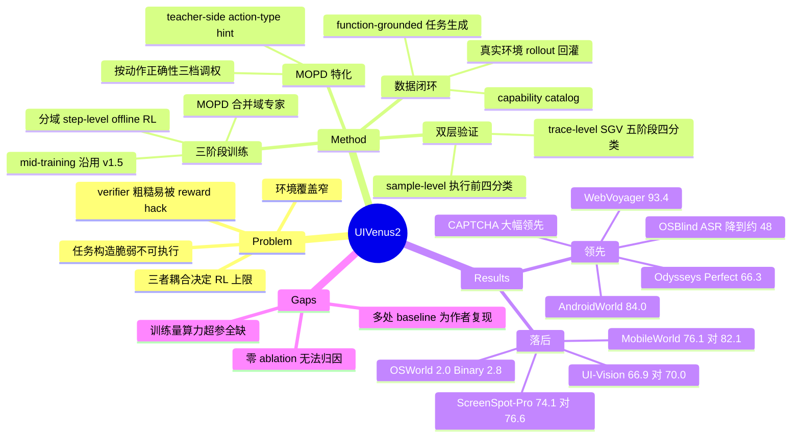

## Summary

UI-Venus-2 是 Ant Group 开源的通用 foundation GUI agent，用单一 closed-loop reasoning–action 模型覆盖 mobile / web / desktop OS，训练分三段：multimodal mid-training → 按域独立的 step-level offline RL → multi-teacher on-policy distillation（MOPD）把域专家合回一个 policy。论文自述 mid-training 与 RL 组件沿用 UI-Venus-1.5，真正的增量集中在数据与验证侧——170+ 多语言 app 环境、deep-research 驱动的 function-grounded 任务生成，以及 trace-level（SGV）+ sample-level 双层轨迹验证为 RL 供给 reward。9B / 27B 在 AndroidWorld（80.2 / 84.0）、WebVoyager（90.8 / 93.4）、Odysseys、DeskCraft、CAPTCHA 与 OS 安全上领先，但在 MobileWorld、ScreenSpot-Pro、UI-Vision 上落后 Qwen-UI-Agent-27B，在 OSWorld 2.0 上 Binary Accuracy 仅 0.0% / 2.8%。

## Problem & Motivation

论文把问题从"提高下一步动作预测精度"上移开，锁定 benchmark 模型与可部署系统之间的三个缺口：environment coverage 只覆盖少量应用；task construction 脆弱，生成的指令不 grounded 在应用真实功能上，界面一变就不可执行；reward verification 不可靠，粗粒度 verifier 会把 partial progress 误判为完成、忽略任务关键的视觉证据，或暴露可被 policy 利用的 reward 漏洞。作者强调这三者是耦合的——扩环境必然要求可扩展的任务构造，而 RL 的能力上限由 verifier 质量决定。这个 framing 本身是全文最有价值的部分：它把"GUI agent 还差什么"从模型侧改写成了数据闭环侧。

CAPTCHA 被纳入的理由值得单独记。登录、注册等环节的验证码会卡住轨迹采集、阻塞下游状态，所以解 CAPTCHA 既是终端能力，也是数据规模化的前置条件；反过来针对性的 CAPTCHA 数据又强化该能力。这比常见的"顺带支持验证码"说法有说服力，也解释了为什么一篇通用 GUI agent 报告会拿出一整节做 CAPTCHA 评测。

需要注意新意窗口有多窄。§2.1 明确写 mid-training 与 RL 组件 following UI-Venus-1.5，因此 v2 相对 v1.5 的真正差量只有四块：desktop computer-use 从零构建、数据生成与验证管线、MOPD 的 GUI 特化、以及 safety 评测。把整篇当作"新训练范式"来读会显著高估它。

## Method

**系统形态。** 给定自然语言指令，模型观察渲染后的界面图像，解读当前视觉上下文，把高层意图翻译成可执行 GUI 动作，并持续把环境反馈并入下一步决策直到任务完成。init 自 Qwen3.5-9B 与 Qwen3.6-27B。动作空间统一到归一化坐标 (0,0)–(999,999)，桌面侧另加 Hover / DoubleClick / Hotkey / SelectOption / GetUrl，并保留两个非纯操作动作：TakeNote（把截图里的关键信息写成跨步记忆）与 CallUser（多个选项都满足要求时请求用户接管）。

**三阶段训练。**

1. *Stage I：Multimodal Mid-Training*。在大规模异构的合成 + 交互数据上做中期训练，Mobile / Web / OS navigation 是语料主体。轨迹经 human–discriminator 协同验证过滤掉无效、歧义与低质交互。
2. *Stage II：Offline RL*。Mobile / OS / Web 构造大规模 step-level RL 轨迹，在单步粒度上优化状态感知的动作选择、多步导航、转移一致性与执行可靠性；Grounding 与 CAPTCHA 则改走程序化合成，把已验证的 CAPTCHA 实例与 grounding 目标嵌进真实网页 / app 背景界面，从而拿到可靠的 action-level 正确性与可控难度。关键点是这一阶段按域**独立**训练出多个专家模型，而不是一次性混合训练。
3. *Stage III：MOPD*。用 multi-teacher on-policy distillation 把域专家合并回单一 policy。这是全文唯一带公式的算法组件。

**MOPD 的两处 GUI 特化。** 作者对 vanilla OPD 的批评是具体的：它对 reasoning trace 和 action token 施加同等的 token-level 监督，但只有 action 会真正改变环境，而 action token 在 response 中占比很小，因此可能拿不到足够监督；且 action 内部有结构依赖——action type 决定 parameter schema，参数只在对应 type 下才有意义。

- *Structured Action-Aware Distillation*：按学生动作的正确性分三档调权。动作完全正确则抑制其蒸馏信号（无需纠正）；type 对但参数错则加强 action span 上的监督；type 错则强化 type token 并 mask 掉下游参数（错误 type 下参数语义无效）。论文自己给的直觉是：Click 打错位置还能救，预测成 Scroll 时它的参数根本无关。这条论证清楚——把监督预算按"哪段可执行内容需要纠正"分配，而不是按 token 频率分配。
- *Teacher-Side Action-Type Conditioning*：把正确动作类型 z\* 作为 hint **只**拼进 teacher prompt，学生 prompt 与推理路径完全不变、推理时也拿不到该 hint。token-level advantage 取带 hint 的 teacher 与 student 的 log-prob 之差并 stop-gradient；teacher 不生成自己的 response，只给学生采样的轨迹打分。

**数据生成闭环。** 三段耦合：Capability Catalog Construction 把异构来源的应用知识蒸馏成结构化动态注册表 → Task Construction 从 catalog 采样并合成带有效性保证的可执行任务 → Trajectory Collection 在真实环境执行并把观察到的结果回灌 catalog。域特化部分：

- *Web*：公开 browser-agent benchmark + Tranco ranking 组成网站池，自动可访问性检查后用 Kimi 2.6 按动态性、交互性、内容丰富度、视觉质量打分，得到 4,000+ 域名、19 个类别；再从 InSTA-150k-v3 取 45,000 条带丰富成功判据的任务做 catalog 种子。执行用真实 Chrome 会话 + 15 动作的 Playwright 接口。轨迹清洗规则去掉冗余 wait、反向滚动与循环动作，但**刻意保留**成功轨迹中的可恢复错误，以丰富 catalog 的 failure-mode 覆盖。
- *Computer Use*：每个任务序列化成 TaskSpec（受控桌面快照、setup 操作、依赖文件与服务、来源出处、outcome evaluator）。materialization plan provision 工作区与 warmup 状态；fixture fingerprint 做环境去重并检测 hidden-answer leakage；preflight 校验初始状态完整性。长程任务做 hierarchical segmentation：拆成带独立产物与完成检查的 subgoal，前一段已验证的退出状态作为后一段重采的种子，已接受的前缀 replay 回来保上下文。
- *Synthetic GUI Grounding*：从自然语言场景合成可执行 HTML/CSS/JS 界面（可条件于 persona 或参考截图），一次浏览器 pass 同时抓 screenshot、DOM、元素状态与几何。候选目标由 DOM 语义与无障碍属性识别，再过一套 nine-point hit test（可见性、viewport 裁剪、滚动容器、遮挡、painted-pixel），并用 text-node 精修剔除含无关空白的框；infeasible 指令作为 hard negative。
- *Synthetic CAPTCHA*：70 种类型的规则引擎，每个 puzzle 存一份 latent state，确定性地定义答案、目标几何、合法动作与解题轨迹；渲染器再把 puzzle 合成进 mobile 面板或网页上下文并映射坐标，渲染前先验证可解性。

**双层轨迹验证。** 论文声称的主贡献之一。

- *Trace-level（Semantic Guided Verification, SGV）*：五阶段——从任务目标抽取可验证 keypoint；把轨迹切成定长窗口，并在点击动作的截图上叠红色标记以增强视觉 grounding；并行判断各窗口满足了哪些 keypoint，累积过程级证据；证据明确的走硬规则，模糊的路由到多模态终判（整合终止信号、行为统计、逐窗解释与末屏）；最后产出含结论、推理、逐 keypoint 状态与证据截图的结构化报告。轨迹分四类：completed / partial / infeasible / failed。两处设计克制得当：SGV 不采信 agent 自报成功，失败、超时、求助的轨迹同样进入验证；SGV 的结论只用作数据分层，不当训练标签或 benchmark 分数。
- *Sample-level*：a priori 判断——只用执行前可得的信息（当前截图、声明的动作类型与目标、agent reasoning、任务目标）评估单步，从而支持实时干预，也避免把动作质量与外部因素导致的页面跳转混为一谈。先查 reasoning–action 一致性再看任务对齐，分 correct / exploratory / ineffective / incorrect。逐步判断再聚合成三层轨迹评估，并规定只有含至少一个 task-specific 操作（区别于启动 app、切 tab、滚动这类 generic 操作）的轨迹才算 partial。

## Key Results

评测覆盖 6 个能力面、共 20 个 benchmark。总体形态是：mobile / web / CAPTCHA / safety 上大幅领先，desktop 与高分辨率 grounding 上被 Qwen-UI-Agent-27B 或前沿闭源模型压住。

**Mobile Use（Table 1）**

| Benchmark | 9B | 27B | 最强 baseline | 备注 |
|:--|--:|--:|:--|:--|
| MobileGym | 52.7 | 60.5 | Seed-2.0-Pro 52.0 | GUI 专用模型此前最好仅 21.5 |
| VenusBench-Mobile | 46.5 | 48.7 | Claude-Opus-4.6 36.5 | 149-task primary pool |
| AndroidWorld | 80.2 | 84.0 | UI-Venus-1.5-30B-A3B 77.6 | +6.4；作者称该榜已接近饱和 |
| MobileWorld（50 步） | 65.8 | 76.1 | Qwen-UI-Agent-27B 82.1 | **落后**；GUI-only 117 任务 |
| MobileWorld（100 步） | 75.2 | 82.9 | — | |
| KnowUBench | 56.5 | 59.7 | Seed-2.0-Pro 51.6 | |
| MemGUI | 62.6 | 70.3 | Seed-2.0-Pro 65.6\* | **9B 低于 baseline**；pass@1 |

**Computer Use（Table 2）**

| Benchmark | 9B | 27B | 最强 baseline | 备注 |
|:--|--:|--:|:--|:--|
| OSWorld-Verified | 70.8 | 80.5 | Claude-Opus-4.8 83.4 | **落后**；baseline 用 361-task 设定、各自的 action scaffold |
| DeskCraft | 48.0 | 55.5 | Kimi-K2.6 41.4\* | 作者自算的 538-task（Standard ∪ Interactive）口径，与官方分 split 报告不同 |
| OSWorld 2.0 Binary Acc. | 0.0 | 2.8 | GPT-5.5 13.0 | 108 任务、官方 150 步预算 |
| OSWorld 2.0 Partial Score | 7.5 | 13.2 | GPT-5.5 46.7 | 27B 仍低于 Claude-Opus-4.7 20.3 |

**Web Navigation（Table 3）**

| Benchmark | 9B | 27B | 最强 baseline | 备注 |
|:--|--:|--:|:--|:--|
| WebVoyager | 90.8 | 93.4 | Fara1.5-27B 89.3 / GPT-5 (SoM) 90.6 | refreshed 595-task；GPT-4o judge |
| Online-Mind2Web | 74.0 | 78.3 | UI-TARS-1.5 75.8 | **9B 低于 UI-TARS-1.5** |
| REAL | 76.9 | 80.2 | Seed-2.0-Pro / Kimi-K2.6 74.4\* | 112 任务、程序化状态断言 |
| Odysseys Avg / Perfect | 77.3 / 62.0 | 80.4 / 66.3 | Claude-Opus-4.6 68.9 / 44.5 | +11.5 / +21.8；judge 为 gemini-3.1-flash-lite-preview |

**GUI Grounding（Table 4）**

| Benchmark | 9B | 27B | 最强 baseline | 备注 |
|:--|--:|--:|:--|:--|
| VenusBench-GD | 77.1 | 80.1 | UI-Venus-1.5-30B-A3B 75.0 | 该列 baseline 几乎全为作者复现 |
| ScreenSpot-Pro | 73.0 | 74.1 | Qwen-UI-Agent-27B 76.6 | **落后** |
| OSWorld-G-R | 78.5 | 79.1 | Qwen-UI-Agent-27B 78.5 | |
| UI-Vision | 53.2 | 66.9 | Qwen-UI-Agent-27B 70.0 | **落后**；9B 明显掉队 |

**CAPTCHA（Table 5，Pass@1）与 Safety（Table 6，ASR↓）**

| Benchmark | 9B | 27B | 最强 baseline | 备注 |
|:--|--:|--:|:--|:--|
| VenusBench-CAPTCHA | 78.1 | 79.9 | Qwen3.6-27B 53.0 | 219 样本、8 类交互 |
| MCA-Bench | 75.7 | 79.6 | Qwen3.6-27B 51.7 | 20 类各 50 例的均衡子集 |
| NextGen-CAPTCHAs | 47.6 | 54.5 | Seed-2.0-Pro 20.4 | 全评测中最大 gap |
| Spatial-CAPTCHA-Bench | 42.8 | 48.6 | Seed-2.0-Pro 43.8 | **9B 低于 baseline**；全部模型 <50% |
| Open CaptchaWorld | 50.7 | 56.3 | Seed-2.0-Pro 55.6 | 仅 +0.7；9B 排第三 |
| OSHarm (ASR↓) | 11.3 | 15.3 | Qwen3.5-27B 18.0 | **9B 比 27B 更安全** |
| OSBlind (ASR↓) | 48.8 | 47.9 | 全部 baseline 79.4–93.6 | 幅度最大的单项改进 |

\* 标注为作者自行评测或复现的 baseline 数值。

三处结果值得单独指出。第一，safety 上的规模反转：OSHarm 上 9B（11.3）比 27B（15.3）更安全，OSBlind 上两者持平（48.8 vs 47.9），说明这里的安全性来自训练数据与机制而非模型容量，而论文没有解释为何更大模型在显式攻击下反而更差。第二，OSBlind 是全评测中最亮的一项：所有 baseline 的 ASR 都在 79.4–93.6 区间，UI-Venus-2 砍到 ~48，这类"指令看起来无害、危害来自执行上下文"的盲区通常最难覆盖。第三，OSWorld 2.0 上 9B 的 Binary Accuracy 是 0.0——27B 也只有 2.8——这与它在 OSWorld-Verified 上 80.5 的成绩构成尖锐对比，直接说明短程桌面任务的高分不外推到长程真实工作流。

## Evidence Ledger

| Claim ID | Claim | Type | Source locator | Evidence excerpt | Status |
|:--|:--|:--|:--|:--|:--|
| C1 | 作者单位为 Ant Group（Venus Team），arXiv:2609.00028v1 [cs.AI]，2026-08-27 | benchmark-setting | Title page | "arXiv:2609.00028v1 [cs.AI] 27 Aug 2026 … Venus Team … Ant Group" | source-verified |
| C2 | 初始化自 Qwen3.5-9B 与 Qwen3.6-27B | causal-mechanism | §2.1 Model Init | "We initialize our training pipeline from … Qwen3.5-9B … and Qwen3.6-27B" | source-verified |
| C3 | 训练为三阶段：mid-training → 分域 step-level offline RL → MOPD 合并 | causal-mechanism | §2.2–2.4, Fig. 3 | "optimized independently for each domain using step-level Offline-RL … via multi-teacher on-policy distillation" | source-verified |
| C4 | Structured Action-Aware Distillation 按动作正确性三档调权（正确抑制／参数错加强／type 错强化 type 并 mask 参数） | causal-mechanism | §2.4 | "if the action type is incorrect, we emphasize the type tokens and mask the downstream parameters" | source-verified |
| C5 | teacher-side action-type hint 只入 teacher prompt，推理时不可用 | causal-mechanism | §2.4 | "this hint is never included in the student prompt and is unavailable at inference time" | source-verified |
| C6 | 环境规模：170+ 多语言 app（100+ 中文 / 70+ 英文）、4,000+ 域名 19 类、45,000 条 InSTA 种子任务、15 动作 Playwright 接口 | number | §1, §3.2 Web | "over 4,000 domains across 19 categories … 45,000 tasks from InSTA-150k-v3 … 15-action Playwright interface" | source-verified |
| C7 | 合成 CAPTCHA 覆盖 70 类，每个 puzzle 由 latent state 确定性定义答案与解题轨迹 | number | §3.2 Synthetic CAPTCHA | "rule engines covering 70 CAPTCHA types, where each puzzle stores a latent state that deterministically defines its answer" | source-verified |
| C8 | 合成 grounding 用 nine-point hit test 校验可见性／裁剪／滚动容器／遮挡／painted-pixel | causal-mechanism | §3.2 Synthetic GUI Grounding | "nine-point hit test suite covering visibility, viewport clipping, scroll containment, occlusion, and painted-pixel checks" | source-verified |
| C9 | SGV 五阶段、轨迹四分类；sample-level 单步四分类 | causal-mechanism | §3.3.1–3.3.2 | "The SGV pipeline proceeds in five stages … completed … partial … infeasible … failed" | source-verified |
| C10 | AndroidWorld 80.2 / 84.0，前最好 77.6，+6.4 | number | Table 1, §4.2.1 | "achieve 80.2% and 84.0% … improves over the previous best by 6.4% points" | source-verified |
| C11 | MobileWorld 50 步 65.8 / 76.1，100 步 75.2 / 82.9；落后 Qwen-UI-Agent-27B 82.1 | comparison | Table 1, §4.2.1 | "76.1% and 82.9% … while trailing the strongest specialized agent" | source-verified |
| C12 | MemGUI 9B 62.6 低于 Seed-2.0-Pro 65.6，27B 70.3 | comparison | Table 1, §4.2.1 | "27B achieves the best result of 70.3%, while 9B reaches 62.6%. The strongest baseline is Seed2.0 Pro (65.6%)" | source-verified |
| C13 | MobileGym 52.7 / 60.5、VenusBench-Mobile 46.5 / 48.7、KnowUBench 56.5 / 59.7 | number | Table 1, §4.2.1 | "52.7% and … 60.5% … 46.5% and 48.7% … 56.5% and 59.7%" | source-verified |
| C14 | OSWorld-Verified 70.8 / 80.5，低于 Claude-Opus-4.8 83.4；baseline 用 361-task 设定与各自 scaffold | comparison | Table 2 + caption, §4.2.2 | "below the source-reported Claude-Opus-4.8 result of 83.4%, but above Qwen-UI-Agent-27B (79.5%)" | source-verified |
| C15 | OSWorld 2.0 Binary 0.0 / 2.8、Partial 7.5 / 13.2，远低于 GPT-5.5 的 13.0 / 46.7 | comparison | Table 2 (right), §4.2.2 | "Binary Accuracies of 0.0% and 2.8%, and Partial Scores of 7.5% and 13.2%" | source-verified |
| C16 | DeskCraft 48.0 / 55.5 用的是作者自算的 538-task 并集口径，与官方分 split 报告不同 | benchmark-setting | Table 2 caption | "author-evaluated aggregate over the 538-task union … differs from the benchmark's official split-level reporting" | source-verified |
| C17 | Web 四榜数值与 judge 设定（GPT-4o / gemini-3.1-flash-lite-preview），Odysseys +11.5 / +21.8 | number | Table 3 + caption, §4.2.3 | "evaluated using an automatic GPT-4o judge … outperforming the strongest baseline by 11.5 and 21.8 points" | source-verified |
| C18 | ScreenSpot-Pro 74.1 与 UI-Vision 66.9 均次于 Qwen-UI-Agent-27B（76.6 / 70.0） | comparison | Table 4, §4.2.4 | "ranking second only to Qwen-UI-Agent-27B (76.6%) … second only to Qwen-UI-Agent-27B (70.0%)" | source-verified |
| C19 | CAPTCHA 五榜数值；Open CaptchaWorld 仅领先 0.7，Spatial 上 9B 低于 Seed-2.0-Pro | comparison | Table 5, §4.2.5 | "reaches 56.3% Pass@1, only 0.7 percentage points above Seed-2.0-Pro at 55.6%" | source-verified |
| C20 | OSHarm ASR 9B 11.3 < 27B 15.3；OSBlind 48.8 / 47.9 vs baseline 79.4–93.6 | comparison | Table 6, §4.2.6 | "9B achieves the lowest ASR of 11.3% and 27B follows at 15.3% … ASR ranging from 79.4% to 93.6%" | source-verified |
| C21 | 开源全参数权重与评测基建，代码在 github.com/inclusionAI/UI-Venus | license-code | Title page, §1 | "We publicly release the full-parameter weight, and evaluation infrastructure of UI-Venus-2" | source-verified |
| C22 | 全文无任何 ablation：§4 只有 setup 与逐 benchmark 主结果，附录仅 A/B/C 三节 | sota-novelty | ToC, §4, Appendix A–C | "4.2.1 Mobile Use … 4.2.6 GUI Agent Safety … A Action Space … B Grounding Synthesized Example … C CAPTCHA Benchmarks" | source-verified |
| C23 | 无训练数据量、算力与训练超参；§4.1.1 只给推理设置 | benchmark-setting | §4.1.1 | "we set the sampling temperature to 1.0 … For GUI grounding tasks, we disable reasoning mode and set the temperature to 0" | source-verified |
| C24 | mid-training 与 RL 组件沿用 UI-Venus-1.5 | causal-mechanism | §2.1, Fig. 3 caption | "with the mid-training and RL components following UI-Venus-1.5" | source-verified |
| C25 | SOTA 措辞分层：§1 hedged 为 "almost SOTA among models of comparable scale"，§6 结论去掉限定说 "state-of-the-art performance"，§4.2.3/4.2.4 局部声称 "a new state-of-the-art"；**abstract 中并无 SOTA 表述**（初稿曾误写 abstract 声称 SOTA，经 verifier 更正） | sota-novelty | Abstract, §1, §4.2.3–4.2.4, §6 | "achieves almost state-of-the-art performance among models of comparable scale across multiple GUI benchmarks" | source-verified |

## Strengths & Weaknesses

**亮点。** 最有价值的不是模型，是它把"GUI agent 的瓶颈"重新定位到 environment × task × verification 的耦合闭环上，并且真的把三条线都做成了可复用的工程件。SGV 的两处克制尤其值得学：不采信 agent 自报成功、失败与超时轨迹同样进验证，堵住了 self-report 这条最容易被 reward hack 的通道；SGV 结论只做数据分层不当训练标签，避免了 verifier 噪声直接注入梯度。sample-level 的 a priori 判断也有道理——只用执行前信息评估单步，把"动作对不对"和"页面跳转是否受外部因素影响"解耦，这比事后看 state transition 的常规做法更干净。MOPD 的 structured action-aware 加权是全文唯一一个有清晰机制论证的算法点：action token 在 response 中占比小却唯一决定环境转移，按 token 频率分配监督预算确实是错配；三档调权（尤其"type 错就 mask 参数"）直接跟着 action 的结构依赖走，简洁且可迁移到任何 structured-action agent。安全侧的 OSBlind 结果是最硬的一条——baseline 全线 79–94% ASR 而它砍到 ~48%，这个量级的改进不像调参能得到。

**局限。** 第一也是最严重的：**零 ablation**。§1 明说"ablations are presented in the following sections"，但全文没有任何 ablation 表或节。结果是这篇报告的四项自述贡献——MOPD 的两处 GUI 特化、双层验证框架、环境/任务扩展、CAPTCHA 数据——没有一项能被归因。读者无从判断 84.0 的 AndroidWorld 里有多少来自 structured action-aware distillation，多少只是换了更强的 Qwen3.6 底座（对照 Table 1：Qwen3.6-27B 裸模型在 AndroidWorld 已有 70.3）。第二，训练侧完全不透明：没有任何阶段的数据量、轨迹数、算力或超参，连 MOPD 里到底有几个 teacher 都只能从五个域推测；§4.1.1 的"Implementation details"实际只写了推理配置。§3 里的 4,000 域名 / 45,000 任务 / 70 类 CAPTCHA 是环境与任务池规模，不是训练量，容易被误读。第三，比较口径松。DeskCraft 用的是作者自算的 538-task 并集，与官方分 split 口径不同；OSWorld-Verified 的 baseline 来自各自论文的 361-task 设定且带各自的 action scaffold（作者自己在正文里承认这"应作为 benchmark-level 参考而非受控对照"）；多个关键 baseline 数值（MemGUI 的 Seed-2.0-Pro 65.6、VenusBench-GD 整列）是作者复现的。Table 3 的 caption 只说明 Fara1.5 与 GPT-5 (SoM) 的条目取三次运行平均，并未声明 UI-Venus-2 自己的 live-web 结果也做了多次平均——考虑到 WebVoyager / Online-Mind2Web / Odysseys 都跑在活网上，单次运行的方差不可忽略。第四，SOTA 措辞在文内不一致：§1 谨慎地限定为"almost state-of-the-art among models of comparable scale"，§6 结论直接写成无限定的"state-of-the-art performance"，实际结果里 MobileWorld、ScreenSpot-Pro、UI-Vision、OSWorld-Verified、OSWorld 2.0 五项都不是第一。第五，Table 6 存在基座标注矛盾：安全表把 27B 的 general-VLM baseline 记作 Qwen3.5-27B（18.0 / 89.3），正文称 79.4% 与 89.3% 是两个模型的"base counterparts"，但 §2.1 写明 27B 初始化自 Qwen3.6-27B，且 Qwen3.5-27B 在全文其他表里从未出现——要么表 6 标错，要么"base counterpart"的说法站不住，而 OSBlind 的减半结论正建立在这个对照上。第六，附录 A.4 的 Web prompt 模板里硬编码了站点特定提示（"The official website of cryptpad is https://cryptpad.fr/."），这类 benchmark 特化知识写进系统提示会削弱"通用 foundation agent"的成色。

**领域影响。** 开放全参数权重 + 评测基建这一点是实打实的：UI-Venus-2 大概率会成为下一批 GUI agent 工作的开源对照基线，尤其在 mobile 与 CAPTCHA 两条线上目前没有同等开放度的替代。真正可能被后续工作继承的是 SGV 与 sample-level verification 的设计模式，而不是 MOPD——前者解决的是所有做 GUI RL 的人都会撞上的 reward 可靠性问题，后者的收益无法从本文数据中分离。

## Mind Map

## Notes

**与 vault 内已有笔记的对照。**

- [[2607-QwenUIAgent]]：直接竞品，也是 mobile+CUA+browser 的 foundation agent，也没做隔离性 ablation。两篇的数字有可对照处也有口径冲突——UI-Venus-2 的 Table 4 把 Qwen-UI-Agent-27B 的 ScreenSpot-Pro 记为 76.6，而 Qwen-UI-Agent 自己的报告写 81.5%（zoom-in 推理）。差值很可能来自是否启用 zoom-in，不是矛盾，但它说明 ScreenSpot-Pro 这类榜单的横向比较已经被推理时 scaffold 污染到不可直接引用的程度。MobileWorld 的 82.1 两边一致。
- [[2606-OSWorld2]]：该 benchmark 论文的头条配置是 Claude Opus 4.8 + max thinking + batched actions 在 **500 步**下 20.6 binary / 54.8 partial；UI-Venus-2 用官方 **150 步**预算，表里最强 baseline 是 GPT-5.5 的 13.0 / 46.7，且没有列 Opus 4.8。步数预算不同使得两组数不可直接比，但 UI-Venus-2 在 OSWorld-Verified 表里列了 Opus 4.8、在 OSWorld 2.0 表里没列，这个不对称值得留意。
- [[2512-MobileWorld]]：原 benchmark 是 201 任务，UI-Venus-2 只取 GUI-only 的 117 任务子集，因此"MobileWorld 76.1"与该笔记记录的"最优 agentic framework 51.7%"不在同一口径上，引用时必须带子集说明。
- [[2500-UiVenusTechnicalReport]]：v1（arXiv 2508.10833）是 RFT/GRPO 单模型做 grounding+navigation；v2 已换成 mid-training + 分域 offline RL + 蒸馏合并的多阶段范式，且明确说这两段沿用 v1.5。v1 笔记里"RFT 替代 SFT"的叙事不再是这条线的主线，survey 引用时不要把 v1 的方法论直接外推到 v2。

**留待追问。**

1. OSWorld-Verified 80.5 与 OSWorld 2.0 Binary 2.8 的巨大落差是本文最有信息量的失败信号，但论文没有分析。是长程状态维护、验证与自我修复的问题（与 OSWorld 2.0 原文的诊断一致），还是 150 步预算根本不够？论文未给 step 分布或失败模式统计。
2. 安全侧的规模反转（OSHarm 上 9B 优于 27B）没有解释。如果更强的能力反而更容易被诱导执行有害操作，这对"能力-安全同步扩展"的说法是反例，值得作为独立问题跟。
3. MOPD 的 teacher 数量、路由方式与各域权重全部未给。若要复现 structured action-aware distillation，这是第一道卡口——可考虑起一轮 `repo-digest` 看 github.com/inclusionAI/UI-Venus 是否放出了训练侧代码。
