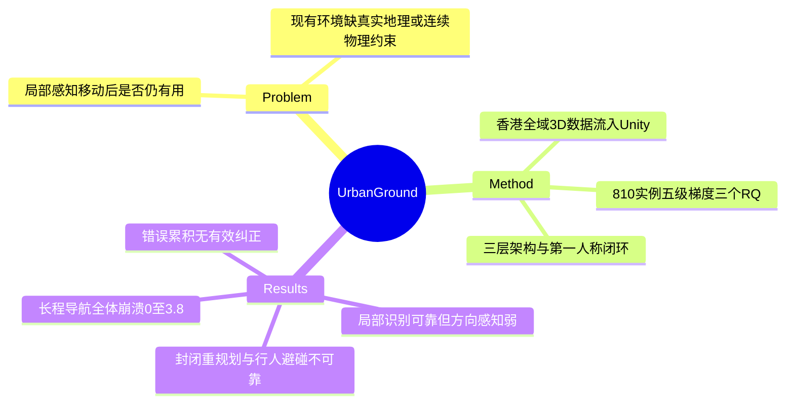

## Summary

UrbanGround 是首个基于香港全域 3D 地理空间数据构建的物理约束真实尺度城市 sandbox，让 MLLM agent 以第一人称闭环交互，检验"局部感知能否转化为可靠空间行动"。核心发现：当代 MLLM 的局部视觉识别尚可，但长程导航全体崩溃（成功率 0.0-3.8%），中心失败在于局部能力无法组合为持续 goal-directed 行为、错误累积且无有效纠正。

## Problem & Motivation

MLLM 能解读单张街景，但 urban agency 的关键在于 agent 开始移动后，局部证据是否仍然有用——这是从 local perception 到 spatial agency 的组合问题，现有评测基本没有覆盖。作者指出四类既有环境的局限：游戏环境的成功受游戏特定机制影响、不反映真实地理结构；物理世界环境多为室内有界空间；城市街景研究（航拍全景 / 采样视点）让 agent 在离散采样点间跳转、无连续物理接触；交互式城市模拟则不保留真实城市的完整地理复杂度。因此需要一个既有真实地理结构、又有连续物理约束的闭环城市环境来把这个问题变成可测的。

## Method

**Sandbox 构建**：基于香港政府发布的两个全域数据集——"3D Visualisation Map"（斜视航拍纹理网格）与 "3D Pedestrian Network"（地理配准的 3D 线特征），以 3D Tiles 层级在运行时流式加载进 Unity。三层架构：

| 层级 | 组件 | 功能 |
|:--|:--|:--|
| Geospatial layer | 3D 可视化地图 + 3D 行人网络 | 地理坐标注册、碰撞几何、轨迹记录 |
| Simulation layer | 物理、时间、天气、行人系统 | 连续物理运动、环境动态变化 |
| Agent layer | 观察 / 动作接口 | 第一人称 RGB 视图 + 交互式地图 |

动作空间含移动（move/sprint）、视角（look/jump）、地图工具与终止。

**评测设计**：沿空间问题的"生长"设三个 RQ——(1) 主动观察后能否 ground 局部场景回答空间问题；(2) 该 grounding 能否支撑目的地更远、更隐式的导航；(3) 行为能否在路线可用性与行人运动变化下存活。任务组织为五级梯度：局部理解（Visual Recognition / Orientation Understanding / Active Exploration QA）→ 显式指令导航（短程/长程/指令/约束）→ 隐式探索（地点搜索、意图推理）→ 多任务规划（时间窗口、多站点）→ 动态交互（道路封闭重规划、行人导航）。共 810 个人工验证实例，每个实例均由人类测试者在与 agent 相同的 100 步交互限制内完成过。指标：SR（终点 ≤15 米且满足约束）、PNA（动作后状态落在行人网络上的时间占比）、SPR（尊重道路封闭的 episode 占比）、PCR（行人碰撞率）。被测模型 10 个：GPT-5.5/5.4/5.2、Claude-Opus-5/Opus-4.6、Gemini-3.6-Flash/3.1-Pro、Doubao-Seed-2.0-Pro、GLM-5V-Turbo、Kimi-K3。

## Key Results

- **RQ1（局部 grounding）**：可见地标识别可靠——GPT-5.5 Visual Recognition 82.5%，Claude-Opus-5 达 91.3%；但 Orientation Understanding 大幅下降（GPT-5.5 40.0%，Claude-Opus-5 58.3%），方向感知是所有模型的共享弱点；Active Exploration QA 居中（GPT-5.5 62.5%）。
- **RQ2（导航衰减）**：GPT-5.5 短程导航 75.0%，但长程导航 0.0%、指令导航 20.0%；全部被测模型的长程导航成功率都落在 0.0-3.8%（最高 Kimi-K3 3.8%）——路线延伸到街区尺度后导航几乎完全失败。附录 E 的失败分类含过早停止、无进展、进展丧失、进展不完整等模式。
- **RQ3（动态适应）**：天气与昼夜变化对局部 QA 的影响相对温和；但道路封闭后 SPR 极低——GPT-5.5 仅 13.3%，最高的 Claude-Opus-5 也只有 46.7%（最低 Doubao 10.0%），agent 往往继续产生局部合规的移动却无法恢复安全的目标导向进展；行人碰撞率全模型 76.3-90.0%（GPT-5.5 83.8%），说明停留在行人网络上不等于具备碰撞感知的控制。
- **核心结论**：central failure 出现在 extended exploration——局部原子能力（识别、短程推理）不能组合成持续 goal-directed 行为，错误在交互中累积且无有效纠正。

## Evidence Ledger

| Claim ID | Claim | Type | Source locator | Evidence excerpt | Status |
|:--|:--|:--|:--|:--|:--|
| C1 | 自称首个使该问题可测的物理约束真实尺度城市 sandbox | sota-novelty | abstract | "the first sandbox to make this question testable in a physically constrained replica of Hong Kong" | source-verified |
| C2 | 基于香港政府 "3D Visualisation Map" 与 "3D Pedestrian Network"，运行时加载进 Unity | benchmark-setting | Sec 3 | "loads the 3D Tiles hierarchy into Unity at runtime" | source-verified |
| C3 | 810 个人工验证实例；人类测试者在同样 100 步限制内完成 | number | Sec 4.1 / App A | "810 manually verified base instances... completed by human testers under the same 100-step limit" | source-verified |
| C4 | GPT-5.5：VR 82.5 / OU 40.0 / AEQ 62.5 | number | Table 1 | "GPT-5.5: VR Acc 82.5, OU Acc 40.0, AE Acc 62.5" | source-verified |
| C5 | Claude-Opus-5：VR 91.3 / OU 58.3 | number | Table 1 | "Claude-Opus-5: VR Acc 91.3, OU Acc 58.3" | source-verified |
| C6 | GPT-5.5 导航：短程 75.0 / 长程 0.0 / 指令 20.0 | number | Table 2 | "Short 75.0, Long 0.0, Instructed 20.0" | source-verified |
| C7 | 全部模型长程导航 0.0-3.8%（最高 Kimi-K3 3.8） | comparison | Table 2 | "LN column: 0.0/1.3/0.0/2.5/1.3/0.0/0.0/1.3/0.0/3.8" | source-verified |
| C8 | 道路封闭 SPR：GPT-5.5 13.3，Claude-Opus-5 46.7 最高，Doubao 10.0 最低 | number | Table 4 | "SPR: GPT-5.5 13.3; Claude-Opus-5 46.7; Doubao-Seed-2.0-Pro 10.0" | source-verified |
| C9 | PCR 全模型 76.3-90.0（GPT-5.5 83.8） | number | Table 4 | "PCR 76.3-90.0; Doubao lowest, Gemini-3.6-Flash highest" | source-verified |
| C10 | 被测模型为 GPT-5.5/5.4/5.2、Claude-Opus-5/4.6、Gemini-3.6-Flash/3.1-Pro、Doubao-Seed-2.0-Pro、GLM-5V-Turbo、Kimi-K3 | benchmark-setting | Sec 4.1 | "GPT-5.5/5.4/5.2, Claude-Opus-5/Opus-4.6, Gemini-3.6-Flash/3.1-Pro, Doubao, GLM-5V-Turbo, Kimi-K3" | source-verified |
| C11 | central failure：局部能力不组合为持续目标导向行为，错误累积无纠正 | causal-mechanism | abstract | "local abilities do not compose into sustained goal-directed behavior and errors accumulate without effective correction" | source-verified |
| C12 | 代码链接为 GitHub UrbanGround/UrbanGround（仅核实论文声明该链接，repo 内容未验证）；SR 定义为距终点 ≤15m 且满足约束 | license-code | Sec 4.1 / 链接处 | "within 15 meters of the destination and any evaluator-enforced task constraint is satisfied" | source-verified |

## Strengths & Weaknesses

**亮点**：(1) 环境构建路线正确——用政府全域地理数据而非程序生成或采样视点，保留真实城市的完整地理结构，且行人网络提供了连续物理约束（碰撞几何），把"局部感知 → 空间行动"的组合问题第一次变成闭环可测；(2) 评测梯度设计好——五级任务沿同一个空间问题递进，能定位组合在哪一级断裂（本文答案：跨出街区尺度即断裂），比单一 end-to-end 成功率信息量大得多；(3) 负结果本身有诊断价值：长程导航 0.0-3.8% 的全体崩溃与"错误累积无纠正"的失败模式，与 GUI/web agent 领域长 horizon 误差累积的发现互为印证，指向跨 domain 的共性瓶颈——缺少显式空间记忆与自我纠错机制。

**局限**：(1) 评测的是 prompted MLLM agent 的开箱能力，未测配备空间记忆 scaffold 或 fine-tuning 后的上限，"当前 MLLM 不行"与"该问题不可解"之间的空间未探索；(2) PCR 全模型 76-90% 的行人碰撞率过于一致，可能部分反映动作接口粒度（离散 move 步长 vs 连续避让）而非纯粹的模型空间能力（推测，论文未做该 ablation）；(3) 单一城市（香港，高密度、立体行人网络）泛化性未知，结论对低密度网格状城市是否成立不确定；(4) SR ≤15m 与 100 步上限的选择会影响跨论文可比性；(5) 只给诊断不给药方——失败分类停在现象层，没有对"为什么不能组合"做机制干预实验。

## Mind Map

## Notes

- 与 vault 中 spatial-memory / navigation 线索的接口：长程失败的直接假设是缺少持久空间记忆与全局定位（agent 每步只有局部 RGB + 地图工具），可对照 [[2608-SpatialMemoryAgent]]、[[2601-SpatialNav]] 检查显式空间记忆能否在此 benchmark 上补上组合断裂。
- 值得追问：交互式地图工具已在动作空间里，为何长程仍全体崩溃——是模型不会用地图（tool-use 问题）还是地图信息与第一人称观察对不齐（grounding 问题）？论文未拆分这两个因素。
- 环境本体是贡献主体且代码开源，适合后续单独跑 repo-digest 看 Unity 端与 agent 接口实现。
