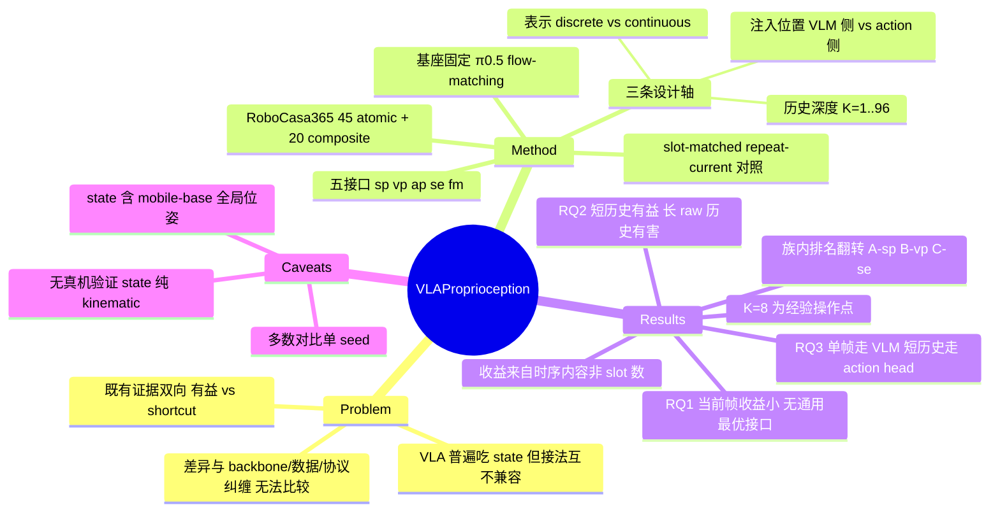

## Summary

本文把 VLA 里"proprioceptive state 怎么用"这个长期靠惯例决定的问题拆成三条可测量的设计轴——表示形式、历史长度、注入位置——在固定 backbone、数据、action 表示与评测协议的前提下，用同一套 π0.5 scaffold 实现 5 种代表性 state interface 并在 RoboCasa365 的 45 个 atomic + 20 个 composite 任务上闭环对比。结论是：当前帧 state 的收益不大且没有任务无关的最优接口；短历史有界有益、长 raw 历史有害；注入位置的偏好随时间预算翻转——单帧走 VLM 侧，短历史走 action 侧。

## Problem & Motivation

几乎所有近期 VLA 都吃 proprioceptive state，但接法互不兼容：[[2504-Pi05]] 把 state 量化成文本 token 拼进 language prompt，[[2502-OpenVLA-OFT]] 和 [[2503-GR00TN1]] 则把它连续投影成 embedding（前者进语言模型序列，后者直接喂 action head）；时间维上绝大多数方法只用当前单帧。

问题在于这些差异从来没被单独测过。每种接法都活在不同的 backbone、pretraining、数据和评测协议里，报出来的数字把 state interface 和其他一切混在一起，导致既有的证据同时指向两个方向：一边有工作把 state 当对齐监督、cross-embodiment 归一化表示或执行风险线索来用；另一边有工作警告 naive fusion 会让 state 压过视觉（策略靠内部进度"宣布"任务完成而无视视觉失败）、抑制运动相位切换处的视觉学习，或在 behavioral cloning 里变成 action-correlation shortcut（causal confusion / copycat）。作者的立场是：在没有共识的情况下，唯一能推进的方式是把其他变量全部钉死，只动 state 这一个自由度。

## Method

**Testbed**：以 π0.5（VLM + flow-matching action expert）为唯一基座策略，所有变体从同一 pretrained checkpoint 全参数微调，共享 data pipeline、action 表示（EEF delta）、学习率 schedule 与训练预算。

**State 表示**：原始 state 是 16 维——base frame 下的 end-effector 位置与四元数、world frame 下的 mobile-base 位置与四元数、两个 gripper joint position。作者自己点明 base pose 携带 world-frame 定位信息，因此这个信号不能读作纯粹的内部本体感受。除 discrete prompt 外，所有连续接口共用一个两层 projector（16 维零填充到框架固定的 32 维后升维），保证跨历史深度的编码过程一致，但不等价于参数量或算力对齐。

**五种 state interface**（同一 scaffold 内实现）：

| 接口 | 注入位置 | 机制 | 单帧新增参数 |
|:--|:--|:--|:--|
| State Prompt (sp) | VLM prompt | 每维量化成 256 bin，走原生 tokenizer 序列化成约 66 个 prompt token；唯一与 language 共享 embedding 空间的路径，**构造上只支持当前帧** | 0 |
| VLM Prefix (vp) | VLM 双向 prefix | state token（d=2048）插在 image/language token 之后，先参与多模态上下文建模，再经 conditioning prefix 间接影响动作 | 4.26M |
| Action Prefix (ap) | action expert 因果后缀 | state token（d=1024）放在 noisy action token 之前，每个 denoising step 直接参与速度场预测；从 state 到 action 最短的路径 | 1.08M |
| State Expert (se) | 独立分支 | 给 state 一条自己的 transformer 序列建模流，生成时与 action module 交换信息 | 199.30M |
| Feature Modulation (fm) | action expert 每层 | state 作为独立 conditioning memory，各层通过 cross-attention 读取并预测 per-feature 的 scale γ 与 shift β 持续调制 action feature | 123.84M |

**评测协议**：RoboCasa365。atomic 任务**按控制语义事前划分**（不是按模型表现事后聚类）成三族，各 15 个共 45 个：A 为 rearrangement / pick-and-place，B 为 articulated-object 交互，C 为旋钮开关等小工作空间高精度控制；每族单独训一个 category expert，每任务 50 次闭环 rollout。composite 用 lifelong_learning_phase2 的 20 个任务类型（每个串 2–3 个 atomic 子目标，每任务 25 次 rollout），单一策略联合训练，只留出新 episode，因此测的是 in-distribution 多阶段控制而非语义泛化。

**两级 claim 的区分**（本文方法论上最值得抄的一点）：独立训练的系统之间比较回答"完整接口有没有用"；而"真历史 vs 重复当前帧"的 **slot-matched control**——固定图像、语言、state slot 数、expert action 与初始 flow noise，只抽掉时间变化——回答"收益是来自时序内容还是来自多出来的 conditioning 容量"。历史长度从 1 扫到 96 帧。

## Key Results

**RQ1 — 当前帧 state 有用，但幅度小且没有通用最优接口。** 45 个 atomic 任务上 no-state baseline 是 54.6%，五个接口点估计全部高于它，但区间只有 +1.1（ap）到 +3.1（sp）。**只有 sp 的 57.7% 对应的配对 task-bootstrap 95% 区间 [0.2, 6.1] 排除了 0**，其余四个接口的区间都含 0，作者据此只把它们读作"一致的正向倾向"而非各自成立的效应。

族内排名则直接翻转：A 族 sp 最优（68.7%，+7.0）而连续接口只有 −0.1 到 +2.6；B 族 vp 反超到 68.8%（+6.1），se/fm 紧随（+5.8/+5.5），sp 掉到中游（+1.6）；C 族最难（no-state 39.5%）也最挑剔，se 领先 42.8%（+3.3），**vp 是唯一低于 baseline 的接口（38.3%，−1.2）**。一个 benchmark-wide 平均会把这套结构完全抹掉。

**算力代价差两个数量级。** sp 那 66 个 prompt token 意味着训练侧边际 +1114 GFLOPs/sample、10 步推理 +282 GFLOPs/policy call，是最贵的设计；连续接口便宜得多：vp 16.9/4.3，ap 3.5/7.6，se 仅 2.6/0.7，fm 45.4/114。se 与 fm 用极小的边际算力拿到几乎相同的 macro 点估计（57.6%）。

**RQ2 — 短历史有界有益，长 raw 历史有害。** atomic 上历史深度呈明显非单调：短历史优于对应单帧模型，更深的未压缩历史不再带来收益并最终损害控制；A、B 族相对耐受，**C 族在长历史下显著掉点，经 VLM prefix 注入时尤甚**。作者取 K=8 作为后续默认，并明确说这是经验操作点而非普适最优。

composite 上 K=1→8 的收益集中在 action 侧（EEF-pose state）：ap 28.2→39.0（**+10.8**），vp 34.4→33.8（−0.6），se 25.8→28.0（+2.2），fm 27.8→32.2（+4.4）。slot-matched 对照给出关键排除项：把 8 个 slot 全填当前帧的副本只有 30.8%，真实有序历史 39.0%，**差 +8.2 点且配对区间排除 0**——收益不能用"多了几个 conditioning slot"解释。换成 joint-angle state 同一协议重跑，方向复现（ap 31.4→36.2 即 +4.8，vp 33.6→35.8 即 +2.2），说明短历史的有用性不绑定某个坐标系。

**RQ3 — 注入位置的偏好随时间预算翻转。** 单帧时 VLM 侧胜：composite 上 vp1 34.4% vs ap1 28.2%（joint-angle 下 33.6% vs 31.4%），而其余单帧条目都在 28.4% 的 no-state baseline 附近几点内；atomic 上单帧诸接口彼此相差 0.1 点以内，偏好未被分辨。短历史时优势决定性地转向 action 侧：K=1→8 的增益 ap 拿到 +10.8（composite EEF）、+4.8（composite joint）、+3.9（atomic 55.7→59.6），同样的历史走 vp 只有 −0.6、+2.2、+0.6；**K=8 时 ap 在三个 panel 全部是最佳入口（atomic 59.6%，composite 39.0%），而它在单帧时是最弱或接近最弱的接口**。设计规则因此是：单帧塞进 VLM，多帧历史路由到 action head。

**机制侧的定点 probe（Appendix A/B，descriptive 而非 causal）。** 固定 checkpoint 下对比 true-state 与 state-off 前向：vp1/vp8 在最后 6 层 VLM 里造成的 language-to-image 注意力重分配为 17.3%/22.0%，image token 表示的相对 ℓ2 变化 19.6%/26.2%；关掉 ap8 则这些 prefix 量完全不变——即 VLM 侧 state 有一条早期上下文化路径，action 侧 state 只能在 action expert 内部直接起作用。flow 轨迹上，ap1→ap8 使末端 correction 与 expert residual 的对齐从 0.079 升到 0.270、归一化幅度 0.174→0.382，45 任务配对差 +0.191 / +0.208，95% 区间 [+0.143,+0.239] / [+0.171,+0.244]。PrepareToast 案例（50 组配对 seed）把收益定位到后期阶段切换：ap1 与 ap8 在放置两个物品的 S1/S2 上接近（90%/64% vs 96%/68%），分化发生在"回身关柜"的 S3——30% vs 56%，**+26 点，配对 episode-bootstrap 区间 [+10,+42]**；条件于到达 S2，S3 完成率 46.9%→82.4%。同一 checkpoint 内把有序历史换成重复当前帧，动作变化幅度在阶段内 0.198、边界前 0.361、**边界处 1.033**、边界后 0.748，边界敏感度是阶段内的 5.2 倍。作者明确声明这是 use pattern 的关联证据，不是 mediation。

## Evidence Ledger

| Claim ID | Claim | Type | Source locator | Evidence excerpt | Status |
|:--|:--|:--|:--|:--|:--|
| C1 | no-state baseline 在 45 atomic 上 macro SR 54.6%，五个接口点估计全部超过它（55.7–57.7%） | number | Sec 5.2 RQ1 + Table 1 | "the no-state model reaches a macro success rate of 54.6%, and the point estimates of all five state interfaces exceed this baseline" | source-verified |
| C2 | 只有 sp 的 atomic macro 增益（57.7%，+3.1）配对 task-bootstrap 95% 区间 [0.2,6.1] 排除 0，其余四个含 0 | number | Sec 5.2 RQ1 para 1 | "sp reaches 57.7% with a paired task-bootstrap 95% interval of [0.2,6.1]" | source-verified |
| C3 | 族内最优接口翻转：A 族 sp 68.7%（+7.0），B 族 vp 68.8%（+6.1），C 族 se 42.8%（+3.3）且 vp 是 C 族唯一低于 baseline 的接口（38.3%，−1.2） | comparison | Sec 5.2 RQ1 "no task-agnostic best interface" + Table 1 | "se leads at 42.8% (+3.3), and vp is the only interface that falls below the baseline (−1.2)" | source-verified |
| C4 | 单帧下 sp/vp/ap/se/fm 分别新增 0、4.26M、1.08M、199.30M、123.84M 可训练参数 | number | Sec 4.3 末段 | "sp, vp, ap, se, and fm add 0, 4.26M, 1.08M, 199.30M, and 123.84M trainable parameters, respectively" | source-verified |
| C5 | sp 边际算力最贵（约 66 token，训练 +1114 GFLOPs/sample、10 步推理 +282 GFLOPs/call），se 最省（2.6/0.7）；vp 16.9/4.3、ap 3.5/7.6、fm 45.4/114 | number | Sec 5.2 RQ1 "computational cost" + Fig 2 | "adding about 1114 training GFLOPs per sample and 282 GFLOPs per ten-step policy call" | source-verified |
| C6 | composite（EEF-pose）K=1→8：ap 28.2→39.0（+10.8），vp 34.4→33.8（−0.6） | number | Table 2 EEF-pose block (p.7) + Fig 4 中panel | "AP 28.2 39.0 +10.8 VP 34.4 33.8 −0.6" | source-verified |
| C7 | slot-matched 对照（8 个 slot 重复当前帧 vs 8 帧有序历史）30.8→39.0，+8.2 且配对区间排除 0 | causal-mechanism | Table 2 末行 + Sec 5.2 RQ2 | "AP: current-only → genuine history 30.8 39.0 +8.2" | source-verified |
| C8 | joint-angle state 下 K=8 时 ap 36.2% vs vp 35.8%，落在配对 bootstrap 噪声带内 | comparison | Sec 5.2 RQ3 "Scope of the routing rule" + Fig 4 右panel | "under joint angles the two routes converge at K=8 (36.2% versus 35.8%)" | source-verified |
| C9 | 历史深度效应非单调（扫 K=1..96）：短历史有益、深层未压缩历史最终损害控制，C 族退化最重且经 VLM prefix 注入时尤甚 | causal-mechanism | Sec 5.2 RQ2 para 1 + Fig 3 caption (p.6) | "substantially degrade performance on family C, especially when injected through the VLM prefix" | source-verified |
| C10 | 基座为 π0.5（VLM + flow-matching expert），benchmark 为 RoboCasa365；45 atomic（3 族×15，每族单独训 category expert，每任务 50 rollouts）+ 20 composite（lifelong_learning_phase2，每任务 25 rollouts） | benchmark-setting | Sec 4.1 + Sec 5.1 | "Each family contains 15 representative tasks (45 in total) and trains a separate category expert" | source-verified |
| C11 | se 与 fm 因硬件分配训练样本曝光略低，作者声明不用它们做 capacity-matched claim | benchmark-setting | Sec 5.1 "Experimental notes" | "se and fm train with a slightly lower nominal sample exposure due to hardware allocation" | source-verified |
| C12 | state 为 16 维（EEF 位置+四元数 in base frame、mobile-base 位置+四元数 in world frame、两个 gripper joint），零填充到 32 维；作者承认 base pose 含 world-frame 定位，不能读作纯内部本体感受 | causal-mechanism | Sec 4.2 | "the base pose also carries world-frame localization, so its effect cannot be read as purely internal motor feedback" | source-verified |
| C13 | 定点 probe：ap1→ap8 使末端 correction 对齐 0.079→0.270、归一化幅度 0.174→0.382；45 任务配对差 +0.191/+0.208，区间 [+0.143,+0.239] / [+0.171,+0.244] | number | Appendix A.3 | "raises final alignment from 0.079 to 0.270 and normalized magnitude from 0.174 to 0.382" | source-verified |
| C14 | PrepareToast（50 配对 seed）：ap8 在 S3 达成率 56% vs ap1 30%，+26 点，区间 [+10,+42]；条件于 S2 后 S3 完成率 46.9%→82.4% | number | Appendix B.1–B.2 | "ap1 reaches ... S3 in 30% of episodes, whereas ap8 reaches it in 56%" | source-verified |
| C15 | 作者自陈局限：无真机验证；所研究 state 纯为 kinematic，不含 force / tactile 等模态 | benchmark-setting | Sec 6 Conclusion 末段 | "Our experiments lack real-robot validation, and the state studied here is purely kinematic" | source-verified |
| C16 | 多数对比依赖单一训练 seed；interface×depth sweep 属 exploratory 且未做多重比较校正 | benchmark-setting | Sec 5.1 "Experimental notes" + Sec 5.2 RQ3 | "most comparisons rely on a single training seed" | source-verified |
| C17 | atomic 上 K=1→8：ap +3.9（55.7→59.6）vs vp +0.6（56.8→57.4）；K=8 时 ap 在每个 panel 都是最佳入口（atomic 59.6%，composite 39.0%） | number | Sec 5.2 RQ3 para 2 + Fig 4 (PDF p.6) | "ap holds the best entry in every panel (59.6% atomic, 39.0% composite)" | source-verified |
| C18 | 作者与机构：HKUST(GZ) / MMLab CUHK / AI2 Robotics X-Lab；2026-08-04 提交 arXiv | number | PDF p.1 title block + arXiv stamp | "arXiv:2608.03052v1 [cs.RO] 4 Aug 2026" | source-verified |

## Strengths & Weaknesses

**方法论比结论更值钱。** 这篇的贡献不在于某个新模块，而在于把一个被惯例决定的接线选择变成三条可测量的轴，并且在实验设计里坚持了两件很多 ablation 论文做不到的事：一是每个 claim 都建立在**独立训练的系统**之间，而不是对单个 checkpoint 做扰动；二是给每个历史模型配了 **slot-matched repeat-current 对照**，把"时序内容"和"多出来的 conditioning 容量"这两个总被混为一谈的因素分开。任务族是按控制语义**事前**划分而非按模型表现事后聚类，这一点尤其重要——否则族内排名翻转就成了循环论证。作者对不确定性的处理也罕见地克制：只有一个区间排除 0，他们就只认这一个效应，其余全部说成"一致的正向倾向"。

**最反直觉、也最值得记住的一点是"接口偏好随时间预算翻转"。** ap 在单帧时是最弱接口之一，加到 8 帧后在所有 panel 变成最强。这说明"state 该注入到哪"根本不是一个独立于其他设计的问题——单帧 state 更像给多模态上下文提供一个静态锚点（适合 VLM 侧），有序历史更像一个需要在去噪过程中反复被读取的动力学信号（适合 action 侧）。Appendix 的 probe 给这个解释提供了数据流层面的佐证：关掉 ap8 完全不改变 VLM prefix，说明它压根没有早期上下文化路径。

**但结论的实用强度需要打折。** 几点我自己的读法：

1. **RQ1 的答案其实偏负面。** 45 任务、每任务 50 rollout 的规模下，五个接口的 atomic macro 全部落在 55.7–57.7 这 2 个点的带子里，只有一个 CI 排除 0。诚实的表述是"当前帧 state 只带来很小的平均收益，且平均意义上选哪个接口几乎无关紧要"——真正的信息全在族内翻转里。
2. **+10.8 这个 headline 数字的基准偏低。** composite 上 ap1 是 28.2%，而 no-state baseline 是 28.4%——单帧走 action prefix 在长程任务上等于白给。+10.8 是从这个几乎为零的起点量的。跨设计的诚实比较应该是 ap8（39.0%）对上最好的单帧设计 vp1（34.4%），也就是 **+4.6 点**。这不改变"路由到 action 侧更好"的方向，但把幅度压到原来的一半以下。
3. **se/fm 的样本曝光偏低是双刃的。** 作者主动披露并声明不做 capacity-matched claim，态度可嘉；但 se 在 C 族领先（42.8%）这个结论本身就落在这个 caveat 下——好在偏差方向是保守的（欠训练还赢了），所以这个正向结论反而更可信，需要小心的是那些 se/fm **没赢**的地方不能被读成"se/fm 不行"。
4. **"proprioception"这个词在本文里是掺水的。** 16 维 state 里有 7 维是 world frame 下的 mobile-base 位姿，那是全局定位而非本体感受。A 族（大范围重定位 + 移动底盘）恰好是 sp 增益最大的一族（+7.0），这里有一个很难排除的替代解释：sp 的收益可能主要来自把**全局位置**离散化后塞进语言空间——这跟"proprioception 帮助运动控制"是完全不同的机制。作者点出了这个边界但没有做去掉 base pose 的消融，这是我最想看到而没有的实验。
5. **统计强度整体薄。** 多数条目是单 seed 点估计，bootstrap 区间量的是评测与任务采样的不确定性而非优化方差；interface×depth 的整片 sweep 未做多重比较校正。加上无真机验证、state 纯 kinematic（无 force/tactile），"design guideline"更应该被当成**在 RoboCasa365 + π0.5 这一组合下的先验**，而不是可以直接搬去真机的规则。
6. **sp 的处境很尴尬，而论文没有正面处理。** 它是唯一在 atomic 上拿到区间支持的接口，也是训练侧最贵的接口（贵两个数量级），同时因为构造上只支持当前帧，**被排除在整个历史实验之外**。最终的设计默认（单帧进 VLM、短历史进 action head）里，"单帧进 VLM"这一半的最强证据来自 sp，但作者在 RQ3 讨论里主要拿 vp 做 VLM 侧代表。sp 与 vp 都属 VLM 侧却在族内排名上相反（A 族 sp 赢、B 族 vp 赢、C 族 vp 唯一掉点），说明"注入位置"这一个变量并不足以刻画它们的差别——离散 token 化 vs 连续投影这条表示轴，在本文的三轴框架里其实没有被干净地分离出来。

**对领域的影响。** 短期最有用的是那个可复用的评测协议：按控制语义事前分族 + slot-matched 时序对照，这套东西可以直接搬去审计任何一个声称"我加了 X 模态/X 记忆所以变好了"的 VLA 工作。中期看，"长 raw 历史有害、且在需要精细 state-to-action 对齐的任务上最有害"这个观察，把压缩式记忆（latent memory / memory token）的必要性从"工程优化"抬到了"避免退化的必需品"，与 memory-VLA 那条线形成了自然的接口。

## Mind Map

## Notes

**相关笔记**：本文直接对照的三种主流接法分别对应 [[2504-Pi05]]（discrete state prompt，也是本文基座）、[[2502-OpenVLA-OFT]]（连续投影进语言序列）、[[2503-GR00TN1]]（state embedding 直喂 action head）。方法论上最近的同类是 [[2605-PixelsToTokens]]——同样是"固定一切、只动一个设计轴"的受控研究，只不过对象是 latent action supervision；这两篇加起来可以看作 VLA 领域"受控组件研究"这个 genre 的两个样本。基座谱系见 [[2410-Pi0]]，state-conditioned visuomotor policy 的前身见 [[2303-DiffusionPolicy]]。

**待验证的疑问**：

1. 去掉 16 维 state 里的 mobile-base 位姿（保留纯 EEF + gripper）重跑 A 族，sp 的 +7.0 还剩多少？这决定了"proprioception 有用"和"把全局定位塞进语言空间有用"哪个才是真实机制。
2. 长历史退化的形态是什么？是 copycat shortcut（策略复制自己最近的轨迹）还是单纯的上下文稀释？如果是前者，C 族退化最重就有了解释——小工作空间里相邻帧的 state 高度自相关，最容易被复制。论文只报了掉点没有做失败模式归因。
3. 压缩式历史（latent memory / 时序下采样）能否在 K 更大时保住收益？本文只测了 raw frame stack，"长 raw 历史有害"不等于"长历史无用"。
4. 接口偏好翻转是否依赖 flow-matching 这个特定的 action head？ap 的优势建立在"每个 denoising step 都能重读 state"上——对单步回归式 action head（如 OpenVLA-OFT 的并行解码）这个机制不存在，结论未必迁移。
