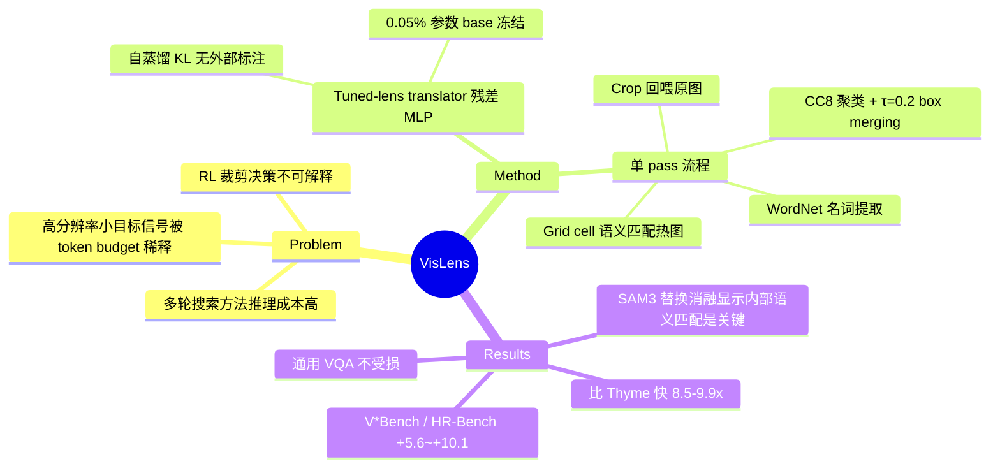

## Summary

MLLM 在高分辨率图像中找小目标时信号被固定 token budget 稀释，现有 visual search 方法要么多轮推理成本高、要么 RL 训练后决策不可解释。VisLens 用 tuned lens（残差 MLP 把早期 visual token hidden state 映射到最终层表示空间再过 frozen LM head 解码）在**单次 forward pass 内**读出每个空间位置的语义、匹配 query 目标、裁剪放大后回喂模型，在 V\*Bench / HR-Bench 上使三个 7-8B backbone 提升 +5.6~+10.1 点，且比 Thyme 快 8.5-9.9x。

## Problem & Motivation

Fine-grained visual search（在高分辨率图像中定位小目标或稀有目标）是 MLLM 的已知短板：目标只占场景极小部分，而 MLLM 在固定分辨率与 token 预算下编码图像，目标信号被稀释。现有两类方案各有代价——training-free 的多轮搜索方法（ZoomEye、UG-Search 等）每个样本需要多次 query，推理成本成倍增加；RL 训练的方法（如 Thyme）产生不透明、不可控的裁剪决策。

论文的核心洞察：**MLLM 的早期 visual token 状态已经编码了图像各空间位置的语义信息**——定位所需的信息模型内部本来就有，只是标准解码路径没有把它显式利用起来。

## Method

VisLens 的流程全部发生在一次 forward pass 内：解码早期层 visual token 语义 → 与 query 目标匹配 → 构造 crop → crop 连同原图一起产生最终回答。

**1. Tuned-lens translator**
- Logit lens 基础：把 frozen LM head（final layer norm + unembedding）套在中间层 hidden state 上近似该层的"预测"。
- 直接 logit lens 在早期层不可靠，因此训练一个轻量残差 MLP translator：`g_ℓ(h) = h + MLP_ℓ(h)`，初始化近恒等（MLP≈0，从 plain logit lens 解出发）。
- 训练目标是 vocabulary 空间的 KL 蒸馏：teacher 是模型自身最终层 hidden state 的解码分布，**不需要任何外部标注（无 box/localization 监督）**。base MLLM 全程冻结，只更新 translator，参数量约占 8B MLLM 的 0.05%。
- 默认从 pre-layer 1（visual projector 之后、进入任何 LM 层之前）读取，visual token 与空间 grid cell 一一对应，解码分布可直接拼成空间热图。

**2. Visual search pipeline**
- **Target extraction**：用 WordNet 对 query 做 POS tagging，保留指向可定位物体的 content noun，丢弃属性词。
- **Semantic matching**：每个 grid cell 按其 lens token 与目标短语的最佳匹配概率打分（短语中任一词匹配即算）。
- **Clustering**：匹配 cell 用 8-邻接连通分量（CC_8）聚类，按 mass 打分。
- **Box merging**：从最强分量开始合并，包围盒面积超过图像面积的比例 τ（默认 0.2）前停止。
- 得到的 crop 与原图一起回喂模型产出最终答案。

## Key Results

**主结果（Table 2，overall accuracy）**：

| Backbone | V\*Bench | HR-Bench-4K | HR-Bench-8K |
|:--|:--|:--|:--|
| LLaVA-OneVision-7B | 73.3 → 81.7 (+8.4) | 63.8 → 69.4 (+5.6) | 58.5 → 68.6 (+10.1) |
| Qwen2.5-VL-7B | 64.9 → 74.3 (+9.4) | 62.1 → 70.6 (+8.5) | 56.5 → 65.1 (+8.6) |
| InternVL3-8B | 71.7 → 81.7 (+10.0) | 69.9 → 76.0 (+6.1) | 61.5 → 67.9 (+6.4) |

**推理效率（Table 3，Qwen2.5-VL-7B）**：对比 RL 方法 Thyme，精度相当或更高、速度快 8.5-9.9x（V\*Bench：74.30 @ 0.98s vs 72.25 @ 8.78s）。相对多轮搜索方法 ZoomEye（外推到同等精度），在 V\*Bench / HR-Bench-4K / HR-Bench-8K 上分别快 4.8x / 12.5x / 22.2x。

**通用 VQA 不受损（Table 4）**：A-OKVQA / GQA / POPE 上与 frozen baseline 差距在约 1 点以内（LLaVA-OV-7B 三项均小幅上升；Qwen2.5-VL、InternVL3 个别项有 ≤1 点微降）。

**关键消融**：
- **Source layer（Table 5）**：不同源层的 translated readout 之间 spread ≤0.010，pre-layer 1 与更深层相当（与真正 final-layer baseline 的差距约 0.02）——定位信息在极早期 visual token 状态中已存在。
- **外部 detector 对比（Table 8，V\*Bench）**：用 SAM3 替换 lens matcher 后增益大幅缩水（LLaVA-OV-7B +1.0 vs VisLens +8.4；InternVL3-8B +5.3 vs +10.0），说明 VisLens 不只是 crop-and-reprompt 启发式，模型内部语义匹配本身有价值。
- **Crop 构造（Table 6/7）**：面积上限 τ=0.2 在 context 与 distractor 之间平衡最好。

**Limitations（作者自述）**：diagram 类图像会被切碎成语义片段；对 OCR / 数学符号 / chart / 全局 layout 推理不可靠；方法面向 object-centric 搜索，证据分布在全局结构时失效；过紧的 crop 会切掉关系推理所需的空间上下文。

## Evidence Ledger

| Claim ID | Claim | Type | Source locator | Evidence excerpt | Status |
|:--|:--|:--|:--|:--|:--|
| C1 | V\*Bench 上 LLaVA-OV-7B 73.3→81.7 (+8.4) | number | Table 2 | "V*Bench... LLaVA-OneVision-7B: 73.3; with VisLens: 81.7 (+8.4)" | source-verified |
| C2 | V\*Bench 上 InternVL3-8B 71.7→81.7 (+10.0) | number | Table 2 | "InternVL3-8B: 71.7; with VisLens: 81.7 (+10.0)" | source-verified |
| C3 | HR-Bench-8K 上 Qwen2.5-VL-7B 56.5→65.1 (+8.6) | number | Table 2 | "HR-Bench-8K... Qwen2.5-VL-7B: 56.5; with VisLens: 65.1 (+8.6)" | source-verified |
| C4 | 比 Thyme 快 8.5-9.9x 且精度相当或更高（V\*Bench 74.30@0.98s vs 72.25@8.78s） | comparison | Table 3 | "V∗Bench \| 72.25 \| 74.30 \| 8.78 \| 0.98 \| 9.0×" | source-verified |
| C5 | 相对 ZoomEye（外推同精度）快 4.8x/12.5x/22.2x | comparison | Sec 4.3 text | "Relative to ZoomEye extrapolated to our accuracy, this is 4.8×, 12.5×, and 22.2× faster" | source-verified |
| C6 | base MLLM 冻结，只训 translator（约 0.05% of 8B） | benchmark-setting | Method | "The base MLLM stays frozen... only the translator parameters θℓ are updated... (∼0.05% for an 8B MLLM)" | source-verified |
| C7 | 源层消融 spread ≤0.010，最早层与 final-layer baseline 差距约 0.02 | causal-mechanism | Table 5 + text | "the spread among translated readouts is at most 0.010 absolute per metric" | source-verified |
| C8 | SAM3 外部 detector 增益远小于 VisLens（+1.0 vs +8.4；+5.3 vs +10.0） | comparison | Table 8 | "LLaVA-OV-7B 74.3 (+1.0)... InternVL3-8B 77.0 (+5.3)" | source-verified |
| C9 | 通用 VQA 不受损（LLaVA-OV-7B：A-OKVQA +0.2、GQA +0.2、POPE +1.0） | benchmark-setting | Table 4 + text | "within about one point of each frozen baseline... without harming general VQA" | source-verified |
| C10 | KL 蒸馏以自身 final-layer 分布为 teacher，无需外部标注 | causal-mechanism | Method | "the teacher ϕ(hL(i)) is the model's own final hidden state, so no external labels are required" | source-verified |
| C11 | 从解码到最终回答在单次 forward pass 内完成，无重复 query | benchmark-setting | Abstract | "The whole process, from decoding to the final answer, completes in a single forward pass without repeated queries" | source-verified |
| C12 | 面积上限 τ=0.2 为最优默认值 | number | Table 7 + text | "The area cap τ=0.2 gives the best balance between context and distractors" | source-verified |

## Strengths & Weaknesses

**亮点**
- **把 interpretability 工具变成能力工具的少见案例**：logit lens / tuned lens 此前主要用于分析，这里直接变成推理期的定位机制，且带来实打实的精度和 8.5-9.9x 速度收益。"模型内部早已知道目标在哪，只是回答时用不上"这一发现本身比 crop 流程更有价值。
- **SAM3 消融是最有信息量的实验**：外部 detector（分割能力更强）替换 lens matcher 后增益反而大减，说明关键不在"crop 得准"，而在 crop 与模型自身语义表示对齐——这是对 crop-and-reprompt 类方法的一个机制性区分证据。
- **训练代价极低且无标注需求**：自蒸馏 + 0.05% 参数 + base 冻结，通用 VQA 能力不受损，工程上接近免费午餐。
- 定位过程逐步可解释（热图 → 连通分量 → box），相对 RL 裁剪策略可审计。

**局限**
- **只支持名词性 object-centric 查询**：WordNet POS 提取丢弃属性词，属性绑定、关系推理、文本/chart/diagram 类查询是明确失效区（作者自认）。lens 词表匹配对多词表达和同义词的鲁棒性文中未充分展开。
- **单次 crop 无修正机制**：匹配错了没有迭代纠错的机会——这是 single-pass 换来的代价，与多轮方法的 trade-off 在难样本上如何分布，文中未按错误类型细分。
- τ、padding 等超参在评测 benchmark 上手工调定，跨域（如 GUI 截图、文档）泛化未验证。
- 评测全部是 7-8B 开源模型，更大模型或原生高分辨率架构下"信号稀释"前提是否仍成立，属于未回答问题。

**潜在影响（推测）**：单 pass 内部定位的思路对 GUI agent grounding 有直接启发——GUI 截图同样是"高分辨率 + 小目标"设定，若 GUI 元素语义也能从早期 visual token lens 读出，可作为低成本 grounding 前置模块；但 GUI 元素多为文本/图标，恰好落在本文自认的弱区，需要实验验证。

## Mind Map

## Notes

- 未发现代码发布（arXiv 页与正文均无仓库链接）；translator 训练是自蒸馏、成本低，第三方复现门槛主要在细节超参。
- 对 GUI grounding 方向的潜在移植价值见 Strengths & Weaknesses 末段【推测】；GUI 元素以文本/图标为主，恰在本文自认弱区，移植前需先验证 lens 对 UI 语义的可读性。
