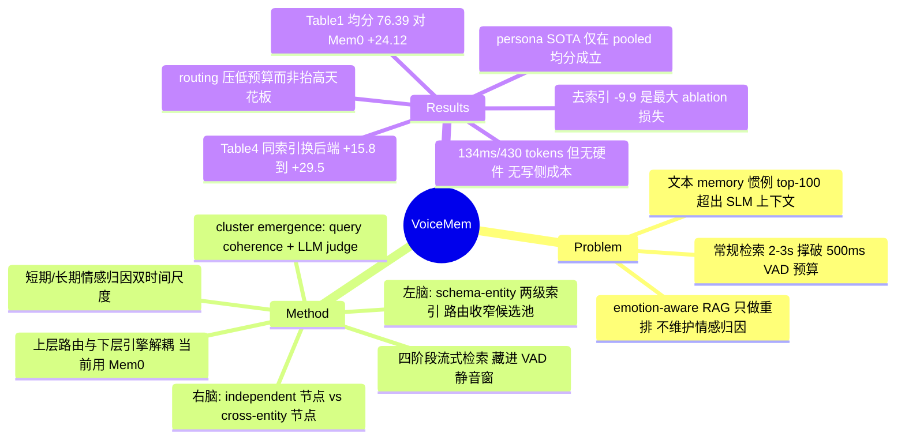

## Summary

VoiceMem 在 Mem0 之上加一层 schema–entity 语义索引（"左脑"）与一层 persona/情感节点图（"右脑"），先把候选池按 schema 路由收窄再交给后端检索，从而在 top-5 这种极小注入预算下保住准确率；配套的四阶段流式查询把整条检索藏进 VAD 的 500 ms 静音窗内（自报 134 ms）。LoCoMo/LongMemEval/Memora 三个 information benchmark 上均分 76.39，比它自己的后端 Mem0（52.27）高 24.12 分；同一索引层换到 LangMem/Zep 后端也带来 +15.76/+22.92 分。核心机制主张是"小 K 下决定成败的是候选池语义密度而非 ranking 精巧度"，这条被 ablation 单独隔离了出来。

## Problem & Motivation

作者要解决的是 memory 系统与实时语音对话在**两个预算维度上的不兼容**：(i) 文本 agent memory 的惯例是 top-100 注入，speech language model 的上下文吃不下；(ii) 常规 memory pipeline 检索耗时 2–3 s，而实时对话只允许 100–200 ms 的额外延迟才不破坏 turn-taking。第三个动机是情感/persona：作者认为对话系统需要"情绪归因"（这份情绪指向谁、因何而起），而现有 emotion-aware retrieval（Emotional RAG、KEEM）只是把 affect 当作重排权重，没有把 person-directed attribution 维护成一份独立演化的状态。

值得注意的是，作者把问题定义为**在保持准确率的前提下把注入预算从 100 压到 5**，而不是"提高检索天花板"——§5.4 明确承认 schema routing "does not raise the ceiling, it lowers the budget needed to reach it"。这个自我限定比 abstract 的措辞诚实得多。

## Method

### "左脑/右脑"在机制上到底是什么

去掉神经科学包装，这是**两张并行维护的上层索引图 + 一个共享的下层向量存储**，二者都不是新的存储介质，只是决定"哪些 memory item 进入最终 ranking"的路由层。

**左脑 = 两级 schema–entity 索引（事实侧）**。`G^L = (S, V, E)`：每个 entity `v` 归属唯一一个 schema `s`，entity 持有指向后端 memory item 的索引 `I_v`。边分 micro（entity–entity）与 macro（schema–schema）两类，用于一跳扩展；schema 归属直接编码在 entity 上而不建 schema–entity 边，避免递归遍历。检索时：用部分转写做流式匹配得到 `(V_t, S_t)` → 并上匹配 schema 下的全部 entity → 再并上 strong/weak 一跳邻居 → 得到扩展集 `Z_t` → 取其 memory item 并集为候选池 `C_t` → 后端只在 `C_t` 内做 top-K，而不是在全量 `M` 上。

**cluster emergence**：随 cluster 变大信息密度下降，但按规则硬拆会撕裂相关记忆。作者改成让子簇从检索模式里"涌现"——用 query coherence `ρ(H) = (1/|Q|) Σ_q |A_q ∩ H| / |A_q ∪ H|`（`A_q` 为 query q 激活的 entity 集）度量一组 entity 是否总被一起检索，超阈值 α 的最大连通子图再交 LLM judge 按 relevance/importance/completeness 三判据决定是否升格为新 cluster（Algorithm 1）。

**右脑 = 两类 persona 节点（人物/情感侧）**。`G^R = (V^I, V^C)`：independent node `v^I` 编码用户内在属性（稳定性情、行为规律、情感倾向）；cross-entity node `v_e^C` 带一条指向左脑 entity `e` 的链接 `ρ_{v,e}`，编码"针对某人某事的情境性情感"。作者强调这个区分是本质的——合并两者会把情境反应误当稳定人格，或抹掉情感的现实指向。维护分两个时间尺度：short-horizon 在每轮内用 affect estimator `e_t = φ(x_t)` 增删改节点；long-horizon 在 session 结束后对整条 `(x_t, e_t)` 序列做 Consolidate，只把反复出现的证据固化为 independent node。右脑检索复用左脑的 `Z_t`：取"直接匹配到的 persona 节点" ∪ "挂在当前活跃 entity 上的 cross-entity 节点"。

一句话概括：**左脑管"发生了什么"并按语义聚类路由，右脑管"这个人是谁 / 这份情绪指向谁"并按 entity 挂载**；两者共用同一个后端引擎，只是各自维护一套候选池收窄规则。

### 流式 memory I/O

四阶段切分，全部塞进 VAD 的静音判定窗：
- listening / speech tail（0–200 ms）：流式 ASR + 双脑 schema/entity 匹配 + 说话人识别同步进行；
- anticipation（200–400 ms）：静音达 200 ms 即假定用户说完，计算 query embedding 并做双脑图扩展；
- searching（400–500 ms）：只剩后端检索，两脑各取 top-K 后合并进 prompt。

关键点是**图扩展在用户还没说完时就已经完成**，真正落在关键路径上的只有最后的向量检索。写侧（fact 抽取、schema/entity 分配、cluster emergence、persona 更新）声明为异步、off the critical path。

### 解耦架构与训练

上层路由与下层引擎完全解耦（`MemSearch` 抽象），当前实例化用 Mem0 作后端。训练侧用 black-box on-policy distillation 把 Qwen2.5-Omni / Qwen3-Omni / Step-Audio2-Mini 改造成能读 memory 的 SLM，四阶段流水线（memory world 构建 → SLM 校验的在线蒸馏 → 人工精修 → 验证）产出 ChatMem-400K 训练集，其中一个困难子集切出来做 ChatMem-Bench。

## Key Results

**Information memory（Table 1，11 个子类，LLM-judge %）**：VoiceMem 均分 76.39，Mem0 52.27（+24.12）、Full-Context 60.49（+15.90）、MemOS 65.83、EverMemOS 65.75。11 个子类里领先 7 个（笔者与 verifier 各自逐列复核一致）；输的四类是 LongMemEval-Extraction（83.20 < MemOS 86.77）、LongMemEval-Update（77.50 < EverMemOS 89.74）、Memora-Remember（66.80 < Full-Context 85.54）、Memora-Recall（50.50 < MemOS 62.64）。差距最大在需要多条记忆同时到位的 temporal reasoning（对 Mem0 +54.9），最小在 update tracking（+7.4）——后者单条最新记忆就能答，索引层帮不上忙。

**Persona memory（Table 2）**：pooled 11 类均分 74.16（GPT-4o-mini 应答）/ 76.56（微调 Qwen3.6 应答），对最强 baseline MemOS（72.27）分别 +1.89 / +4.29。但**分 benchmark 看结论不成立**：按论文自己在 Table 1 用过的"未加权列均值"口径重算，ES-MemEval 块 Emotional RAG 75.10 > VoiceMem 73.30（两个 VoiceMem 行都输，主要输在 conflict detection 69.10 vs 77.30）；PersonaLens 块 MemOS 82.31 > VoiceMem 82.10（微调行 82.72 才反超）。只有 PersonaMem 块是干净领先（69.08 vs MemOS 66.48）。论文只报 pooled 均分，未给分 benchmark 均值。

**ChatMem-Bench（Table 3，自建，316 题 / 15,314 turns / 53 小时音频）**：VoiceMem 68.73，MemOS 53.95、Mem0 48.64、Full-Context 45.96；14 类领先 11 类（输 Synthesis / Abstention / Profile）。领先幅度最大的是 Paralinguistics & Environment——所有纯文本系统在三个声学子类落在 3.23–26.92，VoiceMem 45.16–53.84。这是结构性的：文本 baseline 只拿到转写，没有声学证据可取。

**效率（Fig. 5–6）**：K=5 时 LoCoMo 91.2 / 430 memory tokens / 134 ms；EverMemOS 83.13 需要 1,899 tokens。延迟对 K 近似平坦（K=3→100 都在 134 ms 附近），因为 schema 路由在 ranking 前就把候选池定死了。K 从 5 加到 10 只涨 1.3 分、加到 100 涨 2.3 分但 token 翻 8 倍。

**Ablation（Fig. 7，K=5，四数据集为 LoCoMo / ES-MemEval / ChatMem-Bench / Memora）**：去掉上层索引损失最大（−9.9 / −5.3 / −6.7 / −4.4），其次是去掉右脑（−6.3 / −4.3 / −5.4 / −4.4），emergent clustering（−5.5 / −2.0 / −3.4 / −0.2）与 dual-horizon updating（−5.4 / −2.0 / −3.2 / −1.4）在 session 最长的 LoCoMo 上最明显，joint retrieval 最小（−2.6 / −3.1 / −2.7 / −0.4）。另有一条更精细的对照：只关掉 schema routing 但保留索引，K=3 掉 4.53 分、到 K=5 就收敛到 0.05 分以内——**routing 的作用是压低达标所需预算，不是抬高天花板**。

**后端可迁移性（Table 4，LoCoMo）**：Mem0 61.68 → 91.20（+29.52）、LangMem 56.18 → 71.94（+15.76）、Zep 62.93 → 85.85（+22.92），未做阈值重调。但 LangMem 与 Mem0 裸分只差 5.50，加索引后差 19.26——后端质量仍是上限。

**Cluster 维护对照（Appendix B.2，ES-MemEval P1，n=252）**：emergence 74.40 > static 72.60 > random_split 72.40 > size_threshold 71.61。关键是 random_split 被强制拆同样多次仍差 2.00 分，说明收益来自"拆对地方"而非"拆了"。

## Evidence Ledger

| Claim ID | Claim | Type | Source locator | Evidence excerpt | Status |
|:--|:--|:--|:--|:--|:--|
| C1 | Abstract 称"top-5 检索下左脑比 top-200 的 Mem0 高近 30 分" | comparison | Abstract; §5.1; §5.4 + Fig. 6 | "outperforms classical systems such as Mem0 at top-200 by nearly 30 points" | abstract-only —— 正文无 K=200 实验，§5.1 的扫描区间为 K∈{1,3,5,10,30,100}；最接近的正文依据是"neither Mem0 nor Zep exceeds 63 at any budget"（91.2−63≈28） |
| C2 | Table 1 均分 76.39，对 Mem0 +24.12、对 Full-Context +15.90 | number | Table 1; §5.2 | "averages 76.39, beating Mem0, its own storage backend, by +24.12 and full-context... by +15.90" | source-verified |
| C3 | Table 2 pooled 74.16（GPT-4o-mini）/ 76.56（微调），对 MemOS 72.27 +1.89 | number | Table 2; §5.2 | "reaches 74.16... and 76.56 with our fine-tuned response model, passing the strongest baseline, MemOS, by +1.89" | source-verified —— arXiv 页面元数据 abstract 写 "+4.29"（= 76.56−72.27，微调行），HTML v1 正文 abstract 写 "1.89"（GPT-4o-mini 行），二者取的不是同一行 |
| C4 | ChatMem-Bench 316 题 / 15,314 turns / 53 小时；14 类领先 11 类 | number | Table 3; §5.3 | "316 questions drawn from 15,314 turns and 53 hours of dialogue... leads on 11 of the 14 categories" | source-verified（verifier 逐列复核；输 Synt./Abst./Prof.） |
| C5 | K=5 时 LoCoMo 91.2 / 430 tokens / 134 ms；EverMemOS 83.13 / 1,899 tokens | number | §5.4 [RQ2]; §3.3 | "VoiceMem at K=5 reaches 91.2 with 430 memory tokens and 134 ms of retrieval" | source-verified —— **但全文未给任何硬件、向量库或延迟测量协议**，134 ms 无归属条件 |
| C6 | Table 4 后端迁移 +29.52 / +15.76 / +22.92（Mem0 / LangMem / Zep） | number | Table 4 | "Mem0 \| 61.68 \| 91.20 \| +29.52" | source-verified |
| C7 | Table 4 的 "+ ours" 91.20 与 Table 1 的 VoiceMem 行自洽 | number | Table 1 LoCoMo 四列 vs Table 4 | Table 1 VoiceMem LoCoMo: "94.60 / 91.60 / 89.80 / 85.60" | **contradicted** —— 未加权列均值口径可精确复现三个 baseline（Mem0 61.68、Zep 62.93、LangMem 56.18），但 VoiceMem 得 90.40 ≠ 91.20（微调行 91.25 也不等）。论文未说明 Fig. 5–6 与 Table 4–6 用的是哪一行应答模型；Mem0 的 +29.52 因此比 Table 1 能支撑的多 0.80 |
| C8 | Tables 1/2/3 的对比是同等检索预算下的对比 | benchmark-setting | §5.1 Implementation details | "All baseline systems use GPT-4o-mini... temperature 0"（K 的说明只覆盖 VoiceMem） | **unsupported** —— 全文未声明 baseline 在主表用的 K，头条对比在记录上不可判定是否预算匹配 |
| C9 | 默认配置下进入最终 ranking 的候选池均值：LoCoMo 292.0 项、ES-MemEval 144.1 项 | number | Appendix B.1, Table 5 | "Pool is the mean number of items entering final ranking" | source-verified —— "top-5" 指最终注入 prompt 的条数，不代表检索只看 5 条 |
| C10 | 去上层索引 −9.9/−5.3/−6.7/−4.4；去右脑 −6.3/−4.3/−5.4/−4.4 | number | §5.4 [RQ3] 正文 | "Removing the upper-layer index is the largest loss everywhere (−9.9 / −5.3 / −6.7 / −4.4)" | source-verified（五组 ablation 差值均在正文列出，无需读图；各 panel 绝对基线仅在图中且不从零起） |
| C11 | 11 个 information 子类中领先 7 个 | comparison | §5.2; Table 1 | "our method leads seven of the eleven information sub-categories" | source-verified（正文误引为 Tab. 2，实为 Tab. 1） |
| C12 | 所训模型是"据我们所知首批具备显式 memory 访问的 speech language model" | sota-novelty | §4 开篇 | "to our knowledge, the first speech language models with explicit memory access" | source-verified（仅确认作者声称，首创性未独立证实） |
| C13 | ChatMem-Bench 由与 ChatMem-400K 同一条人工精修语料切出；benchmark 细节推迟到后续技术报告 | benchmark-setting | §4.1 Stage III / Stage IV; Fig. 4 caption | "a challenging subset is curated into ChatMem-Bench"；"we defer a detailed introduction of the benchmark... to a separate follow-up technical report" | source-verified |
| C14 | 写侧（fact 抽取 / schema 分配 / cluster emergence LLM judge / persona consolidate）的成本 | number | §3.1 Fast Update; §5.4; Appendix A–B | "off the critical path; implementation details are deferred to the appendix" | **unsupported** —— 全文无任何写侧延迟、token 或 LLM 调用次数；且 §3.1 承诺的 appendix 实现细节在附录中并不存在（附录只有 Related Work 与 Additional Ablations） |
| C15 | 论文内的产物链接 | license-code | 首页脚注 | "https://xzf-thu.github.io/VoiceMem/" | source-verified —— 论文内只给 project page，无 GitHub；代码库 https://github.com/xzf-thu/VoiceMem（Apache-2.0）经笔者从 project page 跟进核实存在，非论文正文所载 |
| C16 | Abstract 称"在三个 persona benchmark 上均达到 SOTA" | comparison | Abstract; Table 2 | Table 2 ES-MemEval 四列：VoiceMem 82.80/67.30/69.10/74.00 vs Emotional RAG 82.30/67.10/77.30/73.70 | **unsupported** —— 按论文在 Table 1 可精确复现的未加权列均值口径重算，ES-MemEval 块 Emotional RAG 75.10 > VoiceMem 73.30（微调行 72.83 亦输）。论文只报 pooled 均分 |
| C17 | 同上，PersonaLens 块 | comparison | Table 2 | PersonaLens 三列：VoiceMem 70.91/83.75/91.63 vs MemOS 72.72/82.75/91.47 | **unsupported** —— 同口径下 MemOS 82.31 > VoiceMem 82.10（差 0.22，微调行 82.72 才反超） |

> C16 / C17 为笔者依 Table 2 原始数字重算得出，未经独立 verifier 复核；其算法口径（未加权列均值）之所以可信，是因为它在 Table 1 上能把 Mem0 / Zep / LangMem 三行精确复现到 Table 4 的 bare 列（61.68 / 62.93 / 56.18）。论文未明示分 benchmark 的聚合方式，若其实际采用按题数加权则结论可能改变。

## Strengths & Weaknesses

**亮点**

- **机制主张干净且被单独隔离**："top-K 很小时，决定成败的是候选池的语义密度，而不是更精巧的 ranking"——这句话有三层证据支撑：去掉索引在四个数据集上都是最大损失（−9.9/−5.3/−6.7/−4.4）；只关 schema routing 时 K=3 掉 4.53 分而 K=5 收敛到 0.05 分以内（证明它压预算而非抬天花板）；同一索引层换三个后端都涨 15.8–29.5 分（证明收益不绑定某个 store）。这三条加起来比头条数字有价值得多，而且完全可以脱离语音场景迁移到文本 agent memory。
- **Table 4 是真正受控的 Mem0 对照**。VoiceMem 就是"Mem0 + 索引层"，所以 bare 61.68 → +ours 91.20 是在存储介质固定下的层级消融，比 Table 1 的跨系统横比可信得多。这是本文最硬的一块证据。
- **cluster emergence 的对照设计到位**。random_split 被强制拆同样次数仍差 2.00 分，直接排除了"拆本身有益"的平凡解释；size_threshold 甚至比不拆还差 0.99 分，说明拆错位置有实害。这种"强制等量干预"的对照在系统类论文里并不常见。
- **右脑的 independent / cross-entity 二分有可检验的动机**。把"稳定人格"和"针对某对象的情境情感"分开存，避免情境反应被固化成 trait；ablation 里去掉右脑在四个数据集上都掉 4.3–6.3 分，说明它承载的信息确实不在事实存储里，不是装饰性模块。

**局限**

- **头条对比不是 apples-to-apples，而且缺口在多处**。(1) abstract 的"top-5 vs Mem0 top-200"在正文里从未跑过——扫描只到 K=100，且 baseline 在主表用的 K 全文未声明（C8），所以三张主表能否称为预算匹配对比，在记录上无法判定。(2) "top-5"只统计最终注入 prompt 的条数；Table 5 显示进入最终 ranking 的候选池在 LoCoMo 上平均 292 项、ES-MemEval 上 144 项，所以这是一个**上下文预算**对比，不是**检索代价**对比。(3) VoiceMem 的索引层由 LLM 驱动（fact 抽取、schema/entity 分配、Algorithm 1 的 LLM judge、persona Consolidate），而裸 Mem0 的写路径轻得多——两边的总 LLM 开销根本不在一个量级，论文却只把读侧的 430 tokens / 134 ms 摆上台面。
- **写侧成本完全缺席，"Cheap"这个词只覆盖读侧**（C14）。异步只是把成本挪出关键路径，不是消灭成本；对长期运行的语音助手而言，每轮触发的 fact 抽取 + 每 session 触发的 persona consolidate + 周期性的 emergence LLM judge 才是主要账单。更糟的是 §3.1 承诺"implementation details are deferred to the appendix"，而附录里根本没有这一节。这条恰好是 [[2606-SkillMemoryBudget]] 那类预算对称性批评的靶心。
- **134 ms 无归属条件**（C5）。没有硬件、没有向量库实现、没有测量协议、没有 memory store 规模。而 Fig. 8 显示实验中的左脑只有 510 项、右脑 251 项——这是一个**极小**的 store。在这个规模上，"schema 路由把 292 项候选池筛出来"与"直接对 510 项全量检索"的延迟差异恐怕有限，路由的价值论证在真实规模（10⁵–10⁶ 条）下是否成立完全没测。索引本身随 store 增长的维护成本同样未测。
- **一处数字对不上（C7）**。用能精确复现三个 baseline 的同一口径算，Table 1 的 VoiceMem LoCoMo 均值是 90.40，而 Fig. 5、Fig. 6、Table 4、Table 5 与结论一致使用 91.20。微调行给 91.25，也不等于 91.20。论文从未说明这几处用的是哪个应答模型，于是"+8.1 分 vs EverMemOS"存在把微调应答模型与 GPT-4o-mini baseline 混比的可能——而 EverMemOS 的 83.13 恰好能从 Table 1 精确复现（83.125），说明它取的确实是 GPT-4o-mini 口径。
- **persona 的 SOTA 主张过度概括**（C16/C17）。分 benchmark 看，ES-MemEval 输给 Emotional RAG（73.30 vs 75.10，主要输在 conflict detection），PersonaLens 输给 MemOS（82.10 vs 82.31）；只有 pooled 均分成立。abstract 写成"across three persona benchmarks"是把聚合层级的胜利说成了逐个 benchmark 的胜利。而 +1.89 这个幅度本身在 LLM-judge 打分上也接近噪声量级——论文未报任何 seed 方差或置信区间。
- **ChatMem-Bench 与方法同源**（C13）。训练集 ChatMem-400K 与评测集出自同一条人工精修流水线，benchmark 细节推迟到"后续技术报告"，当前无法审计。三个声学子类更是结构性地保证纯文本 baseline 必输（它们只拿到转写）——这可以合理地展示"存音频有用"，但不能当作 memory 架构之间的公平对比。
- **微调应答模型的收益是不一致的，论文未讨论**：VoiceMem‡ 在 persona 上从 74.16 涨到 76.56，却在 information 上从 76.39 掉到 75.65、在 ChatMem-Bench 上从 68.73 掉到 66.96。一个专门为 memory 使用而蒸馏的模型在自家 benchmark 上反而不如 GPT-4o-mini，这是个值得解释的负结果，全文没提。

**对领域的意义**：把"检索预算"当作一等设计约束、并给出一个可迁移的收窄层，这个思路对任何有严格上下文预算的 agent（不止语音）都成立，Table 4 的后端不可知性使它有被复用的现实可能。但本文作为"证据"的说服力明显弱于作为"工程方案"的说服力：真正被扎实证明的是"上层语义索引在小 K 下有用"，而不是 abstract 所主张的那些幅度。

## Mind Map

## Connections

- [[2607-ZeroMem]] — 最直接的对照面。Zero-Mem 主张 memory 运营应当零 LLM 调用、保留到原始 trace 的可追溯链；VoiceMem 恰好走反方向，路由层的 fact 抽取、schema 分配、emergence judge、persona consolidate 全是 LLM 驱动，而且成本一概未报。两者在 LoCoMo 上都有数字，是一组值得放在同一张成本-精度平面上比较的样本。
- [[2606-SkillMemoryBudget]] — 方法论上的直接检验。该文证明 online 增强模块的表面收益大多是预算不对称的产物；VoiceMem 的"top-5 vs top-200"正是一个只报读侧预算、不报写侧预算的案例。把它的预算匹配协议套到 Table 4 上（给裸 Mem0 同等的总 LLM 开销）是一个具体可做的复核。
- [[2606-AgentMemorySystem]] — 该文按"表示/存储、提取、检索路由、维护"四模块拆解 12 个 memory 系统，结论是没有架构通吃、有效性取决于与 workload 的结构匹配。VoiceMem 的贡献恰好落在**检索路由**这一格，Table 4 的后端不可知性正是这套分解的一个正面验证；反过来该文的"局部维护比全局重组更划算"也解释了为什么 emergence 打得过 size_threshold。
- [[2606-AlwaysOnAgents]] — 治理视角的空缺清单。VoiceMem 的右脑把情感倾向固化成 independent node 并让它长期影响回复，这正是该 survey 所说"被保留的状态如何 authorize 未来行为"；论文没有任何撤销、纠错、过期或用户可见性机制。
- [[2601-MemRL]] — 另一条"不改权重、只改检索"的路线：MemRL 用环境 reward 更新条目的 Q 值重排，VoiceMem 用语义结构收窄候选池。两者正交，原则上可叠加。
- [[2608-MemoryLies]] — 该文的核心发现是"记忆过期后被无审计地信任会造成实害"。VoiceMem 的 persona 节点由 long-horizon consolidate 固化且无过期机制，是这个失效模式的一个现成暴露面。
- [[2605-AudioLLMSurvey]] — 音频侧背景。VoiceMem 把 voiceprint 与声学 embedding 存进记忆并跨 session 复用，恰好落在该 survey 指出的隐私/认证维度上，而本文未讨论。
- [[SelfEvolvingAgents-Survey]] — cluster emergence 是 memory 结构自演化的一个实例（结构从检索模式中涌现，而非预设 taxonomy），可作为该 survey memory evolution 支线的一个候选条目。

## Notes

- **rating 3 的理由**：真正稳固的贡献是一条机制结论（小 K 下候选池密度 > ranking 精巧度）加一个受控消融（Table 4）。但评测记录有若干未审计的洞——baseline 的 K 未声明、写侧成本全缺、134 ms 无硬件归属、store 规模只有几百条、benchmark 与训练同源、一处均值对不上——使它更接近"有参考价值的工程方案"而非"重要结果"。
- **代码可用**：论文正文只给 project page，但该页链出 https://github.com/xzf-thu/VoiceMem （Apache-2.0，2026-08-17 建库，仍在更新），另有 ChatMem-400K 数据集与一个 QLoRA 模型权重在 HuggingFace。属于系统/基建类工作且实现是主要贡献载体，适合另起一轮 repo-digest 核实上层索引的实际实现（尤其是写侧的 LLM 调用次数与 emergence 的触发频率——这正是论文缺的那块账）。
- **可检验的疑问**：schema 路由的收益是否随 store 规模单调增长？实验里的 store 只有 510（左）+ 251（右）项，而路由的全部价值在于"全量检索会被无关同实体条目淹没"——这个前提在几百条时并不成立，收益却已经有 9.9 分。一个直接的解释是收益主要来自**去噪**（把同一 entity 在无关语境下的条目排除），而非**降本**；若成立，那么在小 store 上就该看到同样的增益，与规模无关。论文没有做 store 规模扫描，无法区分这两种机制。
- **另一个悬空点**：abstract 的 "+4.29"（arXiv 元数据）与 "1.89"（HTML 正文）取自 Table 2 的不同行。前者用微调应答模型对比 GPT-4o-mini 的 MemOS，后者同口径。引用这篇时应明确取 1.89。
