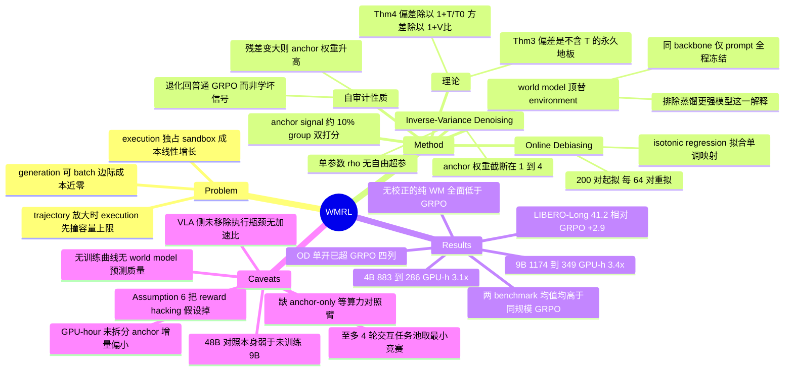

## Summary

WMRL 把 AutoResearch agent 的 RL 训练里最贵的一环（把每个候选方案放进独占 sandbox 真跑一遍拿分）换成一个 frozen、只靠 prompt 工作的语言模型读代码直接预测 leaderboard percentile，并保留约 10% 的 group 同时走真执行作为 anchor，用 isotonic regression 在线重标定（Online Debiasing）、用 inverse-variance 权重融合两路梯度（Inverse-Variance Denoising）。MLE-Dojo/DSBench 上 4B 与 9B agent 把 GRPO 的 883/1174 GPU-hour 压到 286/349（3.1×/3.4×），两个 benchmark 的均值同时更高。但支撑"偏差会随训练消失"的 Theorem 4 依赖 Assumption 6，即 world model 的偏差必须是真分数的单调畸变，这恰好把 reward hacking 这一真正危险的失效模式排除在定理覆盖范围之外。

## Problem & Motivation

一条 AutoResearch trajectory 由 agent generation 与 environment execution 两部分组成，而两者的 scaling 行为完全不同。generation 由 vLLM/SGLang 这类推理后端服务，batching 让并发 trajectory 共享算力，多一条 trajectory 的边际成本接近零；execution 侧每个候选方案都要进一个独占 sandbox，加载数据、在真 GPU 上训模型，成本无法摊薄，总量随 trajectory 数线性增长。trajectory 一放大，execution 先撞上容量上限。

这个观察是全文最有价值的部分，它把"agent RL 贵"这个模糊感受拆成了一个可操作的结构性判断：贵的不是 policy 更新，也不是采样，而是奖励的获取方式。顺着这条线，作者提出两个问题——能否用一个同样可 batch 的信号替换 execution，以及这个替换的代价是什么、怎么付。

## Method

### 用 world model 顶替 environment

world model 是一个语言模型，输入与真环境相同的 task context 加 agent 当前方案，输出对执行结果的模拟，从中读出估计分 $\hat r(\tau_i)$ 顶替真分 $r(\tau_i)$。接口完全一致，GRPO 的其余部分不变，advantage 换成 $\hat A_i = \hat r(\tau_i) - \frac{1}{n}\sum_j \hat r(\tau_j)$。

两条工程约束值得单独记下：world model 与 agent **共用同一 backbone**（4B 对 4B、9B 对 9B），且**只靠 prompt、全程不更新**。前者排除了"收益其实来自隐式蒸馏一个更强模型"这一竞争解释（C15），是本文选得最好的一个对照。

### Anchor signal 与两个校正

把偏差写成 $\hat r(\tau) = r(\tau) + b(\tau) + \xi(\tau)$，$B := \sup_\tau|b(\tau)|$，$\sigma := \sup_\tau \mathrm{std}(\xi(\tau))$。$b$ 与 $\xi$ 都是相对真分定义的，估计它们必须见到真分，所以 WMRL 保留一条细的 ground-truth 流：一小部分 group 同时由 world model 和真执行打分，产出分数对 $\mathcal{P} = \{(\hat r_j, r_j)\}$。

**Online Debiasing** 在 $\mathcal{P}$ 上用 isotonic regression 拟合单调映射 $\hat f$，所有 world model 分在形成 advantage 前先过 $\hat f$；$\hat f$ 在攒够 200 对前是恒等映射，之后每 64 对新数据重拟合一次，以跟踪训练中的漂移（C9）。

**Inverse-Variance Denoising** 处理噪声。噪声无法逐点估计，只能压。每步的 group 分成 anchor 集 $\mathcal{G}_E$ 与 world model 集 $\mathcal{G}_{WM}$，按各自方差的倒数加权融合两路梯度。实现上只剩一个未知量 $\rho := V_{WM}/V_E$，理论给出 $\rho = 1 + c\sigma^2$，其中 $\sigma^2$ 用 anchor group 上校准分与真分的均方残差 $\hat\eta^2$ 测量，$c$ 用 warmup 末尾记录的一次残差取倒数固定，最终 $\rho = 1 + \hat\eta^2/\hat\eta^2_{\mathrm{cal}}$，**不引入自由超参**；实现中把 anchor 权重截断在 $[1, 4]$（C10）。

这套设计有一个值得记住的性质：$\hat\eta^2$ 同时是 world model 的在线审计量。审计变差则 anchor 权重自动升高，梯度主要由真执行的 group 承担，WMRL 退化回普通 GRPO，而不是继续学一个已经失真的信号。混合比例是被测出来的，不是事先定死的。

### 理论

Theorem 3 给出只用 world model 奖励时的收敛界，比真执行多出 $O(M^2B^2)$ 与 $O(\gamma V_{WM})$ 两项。偏差项不含 $T$ 也不含 $\gamma$，因此训练再久、步长再怎么调都消不掉，是一条永久地板（C11）。Theorem 4 给出加上两个校正后的界：偏差项变成同一个 $M^2B^2$ 除以 $1+T/T_0$，随训练收缩且极限为零；方差项变成 $\gamma V_{WM}$ 除以 $1+V_{WM}/V_E$，低于任一单路（C12）。

Theorem 4 的前提是 **Assumption 6**：$b(\tau) = \phi(r(\tau)) - r(\tau)$，$\phi$ 非降。即 world model 的系统偏差只通过真分依赖 trajectory（C13）。这正是"偏差可被单调拟合学到"的原因，也是本文理论最大的让步。Lemma 11 的 $1/\sqrt{t}$ 速率还额外要求 $\Delta_\phi > 0$（畸变不把两个分数档位压成同一个）与 $q > 0$（每个档位都分到 anchor 对）（C14）。

## Key Results

**设置**：MLE-Dojo 被重新切分——每个类别（tabular/text/image）取数据量最小的 20 个竞赛，最小的 15 个作训练、其余 5 个留出，audio 因装不进 sandbox 排除，一个留出任务因 grader 依赖缺包丢弃，最终 45 训练 / 14 留出（C16）。这条规则有个有用的副作用：每个留出任务都比同类别所有训练任务更大，所以留出评测同时测了从小任务到大任务的外推。DSBench 作为完全不相交的迁移集，从 74/75 个任务中保留能在 sandbox 里端到端跑通的 60 个（C29）。指标是 leaderboard percentile，per-task avg@8，Avg 为**类别均值的平均**而非任务均值（C18）。训练侧每步 8 个 group、每 group $n=8$ 条 trajectory、每条至多 4 轮交互、每轮至多 4096 token，真执行单次预算 1200 秒（C17）。

**Table 1（GPU-hour 与两个 benchmark 的 Avg）**：

| Method | GPU-h | MLE-Dojo Avg | DSBench Avg |
|:--|--:|--:|--:|
| Qwen3.5-4B（未训练） | — | 7.3 | 17.1 |
| Qwen3.5-9B（未训练） | — | 9.6 | 23.9 |
| Kimi-48B-A3B | — | 8.1 | 17.3 |
| Nemotron-120B-A12B | — | 20.5 | 31.7 |
| Qwen3.5-4B-GRPO | 883 | 15.2 | 25.7 |
| Qwen3.5-9B-GRPO | 1174 | 18.8 | 31.2 |
| Qwen3.5-4B-WM（无校正） | 269 | 12.9 | 23.1 |
| Qwen3.5-9B-WM（无校正） | 330 | 16.1 | 28.0 |
| **Qwen3.5-4B-Ours** | **286** | **16.4** | **28.8** |
| **Qwen3.5-9B-Ours** | **349** | **21.6** | **32.8** |

三条读法，可靠性递减。**第一条最硬**：加速真实存在且性能不掉，883/286 = 3.1×、1174/349 = 3.4×，两个 benchmark 均值同时高于同规模 GRPO（C1、C2、C3）。**第二条同样干净**：不带校正的纯 world model 在两个规模、两个 benchmark 上全部低于同规模 GRPO（C4），说明两个校正机制是承重的，不是装饰。

**第三条是全表最不该被引用的一句。**"4B 超 48B、9B 超 120B"里，Kimi-48B-A3B 的 8.1/17.3 低于未训练的 Qwen3.5-9B（9.6/23.9），DSBench 上与未训练的 Qwen3.5-4B（17.1）基本持平（C5），它在这个 scaffold 里本身就弱。Nemotron 一侧的差距只有 +1.1/+1.1，且分类目上 Nemotron 在 MLE-Img（7.6 vs 7.4）、DSBench-Regress（40.7 vs 39.2）、DSBench-Other（20.6 vs 19.8）三项更高（C6）。两个 baseline 名字里的 A3B/A12B 是 MoE 激活参数，按激活算这是 4B-dense 对 3B-active、9B-dense 对 12B-active，不是"48B/120B"字面暗示的量级差；论文全文未给出激活参数说明（C25）。

分类目上 WMRL 相对同规模 GRPO 还有两处回退：4B 的 MLE-Text 16.1（↓0.5）与 9B 的 DSBench-Regress 39.2（↓1.2）（C7）。

**Table 3 消融**（所有行消耗同样两路信号、同样比例，只差哪个校正开启）：

| OD | IVD | 4B MLE | 4B DS | 9B MLE | 9B DS |
|:--|:--|--:|--:|--:|--:|
| ✗ | ✗ | 13.5 | 25.3 | 16.8 | 29.5 |
| ✗ | ✓ | 14.9 | 26.2 | 18.0 | 31.2 |
| ✓ | ✗ | 15.7 | 28.1 | 19.4 | 31.7 |
| ✓ | ✓ | 16.4 | 28.8 | 21.6 | 32.8 |

未校正的直接混合在四列上全部低于同规模真执行 GRPO；IVD 单开加 0.9–1.7，OD 单开加 2.2–2.8，两者同开加 2.9–4.8（C22）。OD 的份额更大与 Theorem 3 的预测一致——偏差以全尺寸进入界，噪声被步长压过一档。

论文自己没点破的一条：**OD 单开就已在全部四列超过真执行 GRPO**（15.7 > 15.2、28.1 > 25.7、19.4 > 18.8、31.7 > 31.2，C23），IVD 在其上再加 +0.7/+0.7/+2.2/+1.1。如果只能实现一个机制，是那张 isotonic 映射表。

**Table 2 迁移到 VLA**（LIBERO-Long 成功率 %）：SFT 37.4 → 真执行 GRPO 38.3 → 纯 world model 39.2 → WMRL 41.2。相对 GRPO 是 +2.9（表内箭头），相对 SFT 是 +3.8（正文措辞），两个数字都出现在论文里但基线不同（C19、C30）。In-Domain Best@8 有一处回退：47.5 vs GRPO 48.8。

## Evidence Ledger

| Claim ID | Claim | Type | Source locator | Evidence excerpt | Status |
|:--|:--|:--|:--|:--|:--|
| C1 | 4B 规模：GRPO 883 GPU-h / MLE 15.2 / DS 25.7；WMRL 286 GPU-h / 16.4 / 28.8 | number | Table 1，rows Qwen3.5-4B-GRPO 与 -Ours | "Qwen3.5-4B-GRPO \| 883 \| ... 15.2 ... 25.7"；"-Ours \| 286 \| ... 16.4 ... 28.8" | source-verified |
| C2 | 9B 规模：GRPO 1174 GPU-h / 18.8 / 31.2；WMRL 349 GPU-h / 21.6 / 32.8 | number | Table 1，rows Qwen3.5-9B-GRPO 与 -Ours | "Qwen3.5-9B-GRPO \| 1174 \| ... 18.8 ... 31.2"；"-Ours \| 349 \| ... 21.6 ... 32.8" | source-verified |
| C3 | Sec 5.2 称 3.1× 与 3.4×，abstract 称 3–4× | number | Sec 5.2 + Abstract | "cuts the training compute of real-execution GRPO by 3.1× and 3.4×" | source-verified |
| C4 | 纯 world model（无校正）：4B 269 GPU-h / 12.9 / 23.1，9B 330 GPU-h / 16.1 / 28.0，均低于同规模 GRPO | number | Table 1，block "RL with Pure World Model" | "Qwen3.5-4B-WM \| 269 \| ... 12.9 ... 23.1" | source-verified |
| C5 | Kimi-48B-A3B 为 8.1 / 17.3，低于未训练 Qwen3.5-9B（9.6 / 23.9），DSBench 上与未训练 4B（17.1）持平 | comparison | Table 1，rows Kimi-48B-A3B / Qwen3.5-9B / Qwen3.5-4B | "Kimi-48B-A3B \| — \| 12.3 \| 10.1 \| 2.0 \| 8.1 \| ... 17.3" | source-verified |
| C6 | Nemotron-120B-A12B 20.5 / 31.7 对 9B-Ours 21.6 / 32.8（+1.1/+1.1）；Nemotron 在 MLE-Img、DS-Regress、DS-Other 三个类目更高 | comparison | Table 1，rows Nemotron-120B-A12B 与 Qwen3.5-9B-Ours | "Nemotron-120B-A12B \| — \| 35.1 \| 18.8 \| 7.6 \| 20.5 \| 38.7 \| 26.6 \| 40.7 \| 20.6 \| 31.7" | source-verified |
| C7 | 相对同规模 GRPO 存在两处类目回退：4B MLE-Text 16.1（↓0.5）、9B DS-Regress 39.2（↓1.2） | number | Table 1，WMRL 两行的箭头标注 | "16.1 ↓0.5"；"39.2 ↓1.2"（全表仅两个红箭头） | source-verified |
| C8 | anchor group 约占全部 group 的 10%；Appendix D 另规定每步 8 个 group、至少 1 个走真执行 | benchmark-setting | Sec 3.3 footnote 2 + App D "Training configuration" | "anchor groups make up about 10% of all groups"；"every step at least one group is graded by real execution" | source-verified |
| C9 | Online Debiasing 用 isotonic regression；映射在攒够 200 对前为恒等，之后每 64 对重拟合 | causal-mechanism | Sec 3.3 Eq (4) + App D "Recalibration" | "is the identity until 200 anchor pairs have accumulated ... refit after every 64 new pairs" | source-verified |
| C10 | IVD 归约为单参数 $\rho = 1 + \hat\eta^2/\hat\eta^2_{\mathrm{cal}}$；anchor 权重截断在 $[1, w_{\max}]$，$w_{\max}=4$ | causal-mechanism | Sec 3.3（Eq 5 之后）+ App D "Bounded anchor weight" | "bound the anchor factor ... within [1, w_max] with w_max = 4" | source-verified |
| C11 | Theorem 3 的偏差项 $O(M^2B^2)$ 不含 $T$ 与 $\gamma$，论文称训练时长与步长均无法消除 | causal-mechanism | Theorem 3（Sec 4.2）及其后段 | "The bias term contains neither T nor γ, hence no amount of training and no choice of step size removes it" | source-verified |
| C12 | Theorem 4 把偏差项除以 $1+T/T_0$、方差项除以 $1+V_{WM}/V_E$ | causal-mechanism | Theorem 4（Sec 4.3） | "M²B²/(1+T/T₀)"（contractive bias）；"γV_WM/(1+V_WM/V_E)"（reduced variance） | source-verified |
| C13 | Theorem 4 依赖 Assumption 6：偏差须为真分的单调畸变 $b(\tau)=\phi(r(\tau))-r(\tau)$，$\phi$ 非降；噪声跨 trajectory 独立且 $\|\xi\|\le 1$ | causal-mechanism | Assumption 6（App B.3） | "b(τ) = φ(r(τ)) − r(τ) for a non-decreasing φ, and the noise ξ is independent across trajectories" | source-verified |
| C14 | Lemma 11 的速率仅在 $\Delta_\phi>0$ 且 $q>0$ 时有意义（无档位被压并、无档位缺 anchor 对） | causal-mechanism | Lemma 11 证明（App B.4） | "informative when Δφ > 0 and q > 0 ... no level is starved of anchor pairs" | source-verified |
| C15 | world model 与 agent 共用同一 backbone、仅 prompt、不微调、训练中冻结；论文称此设计排除蒸馏更强模型 | benchmark-setting | Sec 5.1 "Models and training" + App D | "Sharing one backbone also rules out any external knowledge, so the gains cannot come from implicitly distilling a stronger model" | source-verified |
| C16 | 任务池规则：每类取最小 20 个竞赛，15 训练 / 5 留出；排除 audio；丢弃 billion-word-imputation；得 45 训练 + 14 留出；每个留出任务大于同类所有训练任务 | benchmark-setting | App C "Why these training and test sets" | "the 20 smallest competitions ... leaving 45 training and 14 held-out competitions" | source-verified |
| C17 | 每步 8 group、$n=8$、每条 trajectory 至多 4 轮交互、每轮 ≤4096 token、观测截断 1024 token；真执行 1200 秒预算；sandbox 单卡约 40 GB | benchmark-setting | App D "Training configuration" / "Sandbox environment" | "eight groups per step and n=8 trajectories per group, with up to four interaction turns ... at most 4096 generated tokens per turn" | source-verified |
| C18 | 指标为 MLE-Dojo leaderboard percentile，per-task avg@8 先按类别内平均，Avg 为类别均值的平均 | benchmark-setting | Table 1 caption + Sec 5.1 "Metrics" | "Scores are per-task avg@8, averaged within each category, and Avg is the mean over categories" | source-verified |
| C19 | LIBERO-Long Overall：SFT 37.4 / GRPO 38.3 / 纯 WM 39.2 / WMRL 41.2（表内箭头 +2.9），正文另称 +3.8；In-Domain Best@8 Ours 47.5 低于 GRPO 48.8 | number | Table 2 + Sec 5.3 | "MiniVLA-1B-Ours \| 41.2 ↑1.9 \| 47.5 ↓1.3 ... \| 41.2 ↑2.9" | source-verified |
| C20 | VLA 侧 world model 是 Robometer，从每条 rollout 采 8 帧预测 progress 作 dense reward；anchor 是 rollout 末端的稀疏成功信号；全文未给 VLA 的 GPU-hour 或加速比 | benchmark-setting | Sec 5.3 + Table 2 + App D "VLA setup" | "Robometer predicts a progress value for eight frames sampled from each rollout as the dense reward" | source-verified |
| C21 | Table 2 的 OOD 是同一批任务的未见初始状态（训练用前 16 个官方初始状态，评测用全部 50 个），不是未见任务 | benchmark-setting | App D "VLA setup" + Table 2 caption | "Training uses the first 16 official initial states of each task while evaluation uses all 50" | source-verified |
| C22 | Table 3：未校正混合 13.5/25.3/16.8/29.5，四列均低于同规模 GRPO；IVD 单开 +0.9–1.7，OD 单开 +2.2–2.8，同开 +2.9–4.8 | number | Table 3 + Sec 5.4 | "Inverse-Variance Denoising alone adds 0.9 to 1.7 points, Online Debiasing alone adds 2.2 to 2.8 points" | source-verified |
| C23 | OD 单开（15.7 / 28.1 / 19.4 / 31.7）已在四列全部超过真执行 GRPO（15.2 / 25.7 / 18.8 / 31.2） | comparison | Table 3 第三行 vs Table 1 GRPO 两行 | Table 3 OD-only："15.7 \| 28.1 \| 19.4 \| 31.7" | source-verified |
| C24 | 代码开放于 github.com/xiyuanyang45/WMRL（Python，public），但论文正文只印项目页 URL、未印 GitHub 链接 | license-code | 题名页（仅印项目页）+ 项目页 GitHub 按钮 + GitHub API | 论文："Project Page: https://xiyuanyang45.github.io/WMRL/"；repo API 返回 "private": false | source-verified |
| C25 | 论文全文未报告两个大 baseline 的激活参数，激活规模只能从 A3B / A12B 的命名推断 | benchmark-setting | 全文检索无 "active" / "MoE"；Abstract + Sec 5.1 Baselines | abstract："outperform much larger open-weight agents of 48B and 120B" | source-verified |
| C26 | 元数据：11 位作者，UIUC + Amazon，一作 Amazon 实习期间完成；v1 2026-08-12、v3 2026-09-10；cs.LG；CC BY 4.0 | number | arXiv abs 页 + HTML 作者块与脚注 | "[Submitted on 12 Aug 2026 (v1), last revised 10 Sep 2026 (this version, v3)]"；"Work done during an internship at Amazon" | source-verified |
| C27 | abstract 与 conclusion 称 3–4×，但仅有的两次实测比值为 883/286 = 3.09× 与 1174/349 = 3.36×，上界未被任何 run 达到 | number | Abstract + Sec 6 vs Table 1 | conclusion："cut the training compute by three to four times" | source-verified |
| C28 | anchor 比例论文内部不一致：Sec 3.3 脚注称约 10%，App D 的"每步 8 group 至少 1 个真执行"意味着下限 12.5%，两者不能同时紧 | benchmark-setting | Sec 3.3 fn 2 vs App D "Training configuration" | "about 10% of all groups" vs "eight groups per step" + "at least one group" | source-verified |
| C29 | DSBench 只保留 74/75 个任务中的 60 个（数据过大 7 / 缺 sample submission 8 / 列数超限 1）；正文写排除 15 个，但分项和为 16 | benchmark-setting | App C "DSBench" | "We keep the 60 tasks ... The other 15 are excluded because ... (seven tasks) ... (eight tasks), or ... (one task)" | source-verified |
| C30 | Sec 5.3 散文里的 +0.9 / +1.8 / +3.8 均以 SFT（37.4）为基线，Table 2 的箭头（+2.9 overall）以 GRPO（38.3）为基线 | number | Sec 5.3 vs Table 2 | 正文："lifts the overall success rate by 3.8 points" | source-verified |

> 30 条高风险 claim 全部 source-verified，其中 C27–C30 由独立 verifier 在核查过程中额外发现，属于论文内部数值或口径不一致。source-verified 仅表示 primary source 确实这么写，不表示结果已被独立复现。独立 verifier 另行核对通过：Table 1 全部 12 行的 Avg 均等于其类目均值，Tables 1–3 的所有箭头增量均等于行差，Table 2 的 Overall 列在五行上均等于 0.32·In-Domain + 0.68·OOD（与 App D 的 16/50 训练状态划分吻合）。

## Strengths & Weaknesses

**问题拆解比方法本身更值钱。** "generation 可 batch、execution 不可 batch，所以 execution 先撞墙"是一句可操作的结构性判断，它把一个笼统的成本抱怨变成了一个有明确攻击面的工程问题。对照 [[2608-AgenticESOpt]] 会更清楚：那篇攻击的是 backprop 的显存，这篇攻击的是环境的 wall-clock，两者都在改预算而不改目标，但只有这篇把"预算花在哪里"先量化成了一条不对称性。

**anchor 的自审计性质是最值得复用的一笔。** $\hat\eta^2$ 既是 IVD 的权重来源，又是 world model 的在线体检指标：代理信号一旦失真，残差变大，anchor 权重自动升高，梯度回落到真执行的 group 上，系统退化成普通 GRPO 而不是继续学一个坏信号。混合比例被测出来而非事先设死，这一点比两个校正本身更有迁移价值。共用 backbone 排除蒸馏（C15）、留出任务一律大于训练任务（C16）也都是选得很干净的对照。

**但 Assumption 6 把最危险的失效模式排除在定理之外。** Theorem 4 的偏差收缩要求 $b(\tau)=\phi(r(\tau))-r(\tau)$ 且 $\phi$ 非降，即 world model 的系统误差只通过真分依赖 trajectory（C13）。在这个假设下最大化 $\mathbb{E}[\hat r]$ 就是最大化真分的一个单调变换，policy 在原理上**无法**利用 world model。可学习奖励代理之所以危险，恰恰是因为它们的错误与 policy 能搜索到的结构相关：某个被高估的库调用、某种让预测分变高的写法。这类偏差是 $\tau$ 的函数而不是 $r(\tau)$ 的函数，而 isotonic regression 只在预测分这一维上拟合一条标量映射，看不见它。论文的 related work 明确引了 reward over-optimization 的文献，但定理覆盖的正是把这个现象假设掉之后的世界。$\hat\eta^2$ 审计是实证上的补丁，但它是探测器不是校正器，而且只能探测到**落在 anchor group 上**的那部分 gaming。

**与之配套的是一整块缺失的诊断。** 全文只有两张示意图（Figure 1、Figure 2）和三张结果表，没有任何随训练步数变化的曲线。Theorem 4 的核心动态主张是偏差地板按 $1/(1+T/T_0)$ 收缩，而这个主张的全部实证支撑是消融表里的四个末态数字。论文也从未报告 world model 的独立预测质量（与真分的相关系数、rank correlation 之类），也没有 $\hat\eta^2$ 的训练轨迹。最该给的两张图恰好都没有。

**更关键的是缺一条对照臂：等算力下的 anchor-only GRPO。** Table 3 的四行全部同时消耗两路信号，只切换校正开关，因此无法回答"只用那 10% 的真执行 group、完全不要 world model，能到多少"。这条臂的成本与 WMRL 同量级（286 vs 269 的差距见下），却是唯一能证明 world model 本身贡献了信息、而不仅仅充当一个方差缩减先验的实验。少了它，C23 的读法（OD 单开就已超过 GRPO）就格外刺眼：如果绝大部分收益来自那张用真执行数据拟合的重标定映射，那么真正在起作用的可能是 anchor 流，而不是 world model 流。

**GPU-hour 的账对不上，而加速比是本文的头号卖点。** 以下是我的推算，不是论文的陈述：4B 规模上纯 world model 是 269 GPU-h，WMRL 是 286，anchor 只多花 17（+6.3%）；同规模真执行 GRPO 是 883。若两种 run 的 generation 成本相同，则 generation $\le$ 269（269 里还含 world model 的前向），于是 execution $\ge 883-269=614$。给 10% 的 group 补真执行应加约 61 GPU-h，按 App D 的 12.5% 下限（C28）则约 77，实测只有 17，差 3.5 到 4.5 倍。可能的良性解释有几种：两种 run 的训练步数不同，anchor 执行未跑满 1200 秒预算，或 GPU-hour 按占用而非墙钟计。论文没有把 GPU-hour 拆成 generation / execution / world-model 三块，所以从文本无法判定是哪一种。

**头条比较应当整条丢弃。** "4B 超 48B、9B 超 120B"里，48B 那半边的对照 Kimi-48B-A3B 连未训练的 Qwen3.5-9B 都不如（C5），120B 那半边的差距是 +1.1/+1.1 且分类目上对方赢三项（C6），而 A3B/A12B 的激活参数分别是 3B 和 12B，按激活算根本不存在 12 倍规模差（C25）。真正的结果是相对同规模 GRPO 的那四个数字，其余是装饰。

**设置比"自动化实证研究"这个标题浅得多。** 每条 trajectory 至多 4 轮交互、每轮 4096 token、单次执行 1200 秒，任务池刻意取每类**数据量最小**的竞赛（C16、C17）。在这个规模下，从代码预测 leaderboard percentile 远比在一个 24 小时的 MLE-Bench run 上可行，因为后者的结果依赖训练动力学、超参运气和资源上限。论文的 Discussion 自己承认了这条边界（"outcome hinges on randomness that no reading of the solution reveals"），而任务选取规则恰好最小化了这种情况。留出任务一律更大这一条是有分量的反证，但它只放大了数据规模这一个维度，没有放大交互轮数或执行时长。

**VLA 那一节讲的不是同一个故事。** LIBERO 的 rollout 仍然必须在仿真器里真跑（每任务每步 64 条 rollout、每条至多 520 步），Robometer 替换的只是**奖励标注器**，把末端稀疏成功变成逐帧 dense progress（C20）。执行瓶颈一点没被移除，Table 2 里也确实没有任何 GPU-hour 或加速比。这一节真正证明的是"两个校正机制在融合 dense 学习奖励与 sparse 真值奖励时有效"，属于 dense reward shaping + 标定，与"world model 顶替 environment"是两回事。加上 OOD 只是同任务的未见初始状态（C21）、真执行 GRPO 相对 SFT 只涨 0.9 分（基线很低），这一节的说服力明显弱于主表。

**统计强度不足以支撑 1 分量级的结论。** 留出集只有 14 个 MLE 任务分三类、60 个 DSBench 任务分四类，avg@8 但无种子重复、无 error bar、无跨 run 方差。9B 在 DSBench 上相对 GRPO 的 +1.6 伴随一个类目 −1.2，和 Nemotron 的 +1.1 更是落在这种样本量的噪声里。C27–C30 四处内部口径不一致虽然都不致命，但合在一起说明校对深度有限。

## Mind Map

## Notes

- **最想要的那条对照**：等算力下的 anchor-only GRPO，即只用那 10% 真执行的 group 训练、完全不接 world model。Table 3 的四行都同时吃两路信号，所以现有证据无法区分"world model 提供了信息"与"world model 只是个方差缩减先验、真正干活的是拿真执行数据拟合出来的那张重标定映射"。考虑到 OD 单开就已在四列全部超过 GRPO（C23），这个替代解释并不牵强。代码已开放（C24），这件事可查。

- **Assumption 6 是最自然的下一个攻击点**。它要求偏差只通过真分依赖 trajectory，从而让 isotonic 这样的一维标量映射足以吸收它。现实里的 world model 偏差大概率依赖 solution 的可观测特征（用了哪个库、写法风格、代码长度），这些恰好是 policy 能搜索的方向。把标量重标定换成**以 solution 特征为条件的标定**（保留单调性但条件化），在理论上对应把 $\phi$ 从 $\phi(r)$ 放宽到 $\phi(r \mid z)$，在工程上只是把一张 isotonic 表换成若干张。这是一个有机制假设、有可学习组件的改动，不是纯基建。需要先检索是否已有人做过 conditional monotone calibration 用于 RL 奖励代理。

- **anchor 分配应该是主动的而不是均匀的**。现在是每步固定至少一个 group 走真执行（C8、C28）。但 $\hat\eta^2$ 这个审计量已经在算了，完全可以用它决定**执行哪些 group**：优先执行 world model 最不确定的、或者组内预测 advantage 最悬殊因而对梯度影响最大的那些。固定采样率变成主动学习问题，这是在同样的 anchor 预算下榨更多校正信号的直接路线。

- **一个未解的观察**：Table 2 里未训练的 MiniVLA-1B 三列完全相同（In-Domain 5.6/5.6/5.6，OOD 2.9/2.9/2.9）。App D 说评测是 greedy、每个初始状态重复 8 次、且仿真器物理是随机的。若真有随机性，Best@8 应严格大于 All@8。三列相等意味着该模型在每个初始状态上的 8 次结果完全一致，即这批 rollout 事实上是确定性的。这不影响主结论，但说明 8 次重复在这个设置下可能没有提供它看起来提供的那种统计冗余。此处未采信任何进一步推论。

- **待验证的怀疑**：GPU-hour 的账（见 Strengths & Weaknesses 第六段）。286 − 269 = 17 与 10–12.5% 的真执行份额对不上一个数量级里的 3.5–4.5 倍。仓库里的训练脚本应该能看出 anchor 执行是否跑满 1200 秒预算、以及两种 run 的步数是否相同。值得挂一轮 `repo-digest`。

- 相关笔记：[[2608-EnvACE]]（同样在 agentic RL 里去掉真实环境，但把 world model 内化进 policy 自身、用 role-wise GRPO 联合优化，且完全没有 ground-truth anchor，因而也没有本文的审计机制；两者对"代理信号失真了怎么办"给出了不同答案）、[[2608-WorldProxy]]（position 文章，主张按"让查询它的 agent 变好多少"评价 world model，WMRL 恰好是其 L2 训练期信号那一格的具体实例，且 Table 1 测的正是这个量）、[[2604-AgenticWorldModel]]（decision-centric evaluation 的更早提法）、[[2608-AgenticESOpt]]（同样是压低 long-horizon agent RL 的训练成本，攻击的是 backprop 显存而非环境墙钟）、[[2609-HarnessDev]]（把 harness 本身当研究对象）。
