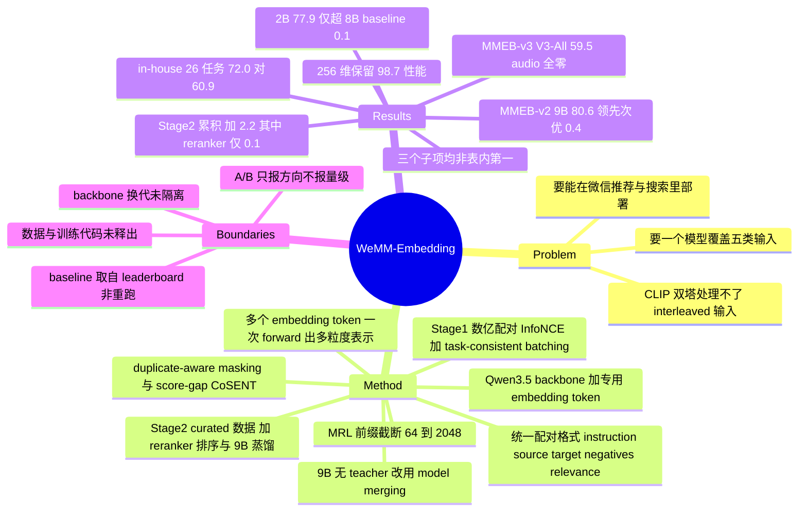

## Summary

WeMM-Embedding 把 classification、QA、retrieval 等异构多模态任务统一成 (instruction, source, target, hard negatives, graded relevance) 的配对格式，在 Qwen3.5 backbone 上先用数亿量级配对做对比对齐，再在约十分之一规模的 curated 数据上加 reranker 排序监督与 9B→4B/2B 的 embedding 蒸馏。9B 变体在 MMEB-v2 报 80.6 overall，比表内次优的 DME-Large 高 0.4 分，但它在 Image、Video、VisDoc 三个子项上都不是表内第一。

## Problem & Motivation

CLIP 式双塔把文本和图像分别编码，天然处理不了 interleaved 输入——图文混排文档、composed query、视频配 ASR 转写都落在它的表达能力之外。MLLM 出现后，直接把其 hidden state 当作 embedding 成为新的主流路线，因为它本来就接受任意顺序的多模态 token。

这篇报告不提新范式，目标是把这条路线做到产品可用：一个模型同时覆盖 text、image、video、visual document 与 interleaved 五类输入，输出维度可在 64 到 2,048 之间截断，并且在微信的推荐与搜索链路里真的部署起来。它的分量因此不在算法新意，而在"一份完整配方 + 一批公开榜单读数 + 一批线上读数"这个组合本身。

## Method

**统一配对格式。** 每条样本写成 z = (I, q, c, N, y)：可选的 task instruction、source、target、可选 hard negative 集合、可选 graded relevance 分数。classification 被改写成 source–label 配对，QA 改写成 question–answer 配对，于是所有任务共享同一个 source–target 匹配结构，可以进同一条 multi-task pipeline，batch 内其他样本的 target 直接充当 in-batch negative。

**编码。** 三个尺度分别建在对应的 Qwen3.5 backbone 上。序列尾部追加一个专用 `<embedding>` token，取其最后一层 hidden state 做 L2 归一化。因为是 causal attention，可以在序列不同位置插多个 `<embedding>` token——视频 token 之后放一个、ASR 转写之后再放一个，一次 forward 同时拿到 video-only 与 video+text 两种表示。MRL 用前缀截断加重新归一化实现，推理时一次 forward 导出全部支持维度。

**Stage 1，数亿配对。** InfoNCE，每个 batch 只从单一数据集采样，保证 in-batch negative 的任务定义与候选空间一致；再对 source 与 target 两侧做 duplicate-aware masking，相似度超过 τ_dup 的候选从负例池剔除。带人工分级标注的样本走 score-gap-weighted CoSENT，权重取 |y_i − y_j|，只约束相对序而不约束绝对相似度。两个 loss 都在每个 MRL 维度上分别计算再加权求和。

**Stage 2，约 1/10 规模的 curated 数据。** 数据侧三步：用中间 checkpoint 编码后拟合三层 RQ-KMeans 得到 Semantic ID，按码本占用密度反向重采样以压制高频语义；再用 MLLM 判定 source–target 是否符合目标匹配关系并改写噪声文本；最后补 hard negative，文本 target 由 MLLM 生成、图像与视频 target 由中间 checkpoint 检索，其中一小部分再用 reranker 打分。训练侧在 task loss 上加 λ·L_Emb，teacher 与 student 的 batch 内相似度矩阵在 q→c 和 c→q 两个方向各做一次 softmax 后取 KL。2B 与 4B 的 teacher 是冻结的 9B；9B 没有更大的 teacher，改成训多个 Stage-2 变体再做 model merging。

## Key Results

- **MMEB-v2（78 datasets，Table 1）**：9B 80.6、4B 79.2、2B 77.9。所有 baseline 数字取自官方 MMEB leaderboard，不是作者重跑。
- **领先幅度是 0.4 分**：表内次优为 DME-Large 80.2 与 Octen-VL-Large 80.1，两者分别标注为"未公开权重的闭源榜单提交"和"参数量未公开的商用模型"。
- **三个子项一个第一都没有**：Image-Overall（36 datasets）WeMM-9B 81.9，QQMM-embed-v4 82.0；Video-Overall（18）WeMM-9B 74.3，Octen-VL-Large 76.0、DME-Large 74.4；VisDoc（24）WeMM-9B 83.3，DME-Large 83.4。80.6 的榜首来自三项按数据集数加权后的合成。
- **"2B 超 8B" 是 0.1 分**：WeMM-2B 77.9 对 Qwen3-VL-Embedding-8B 77.8。同尺寸对比才是实的：Qwen3-VL-Embedding-2B 73.2（+4.7）、DME-Small(2B) 74.8（+3.1）。
- **MMEB-v3（190 tasks）**：9B 59.5、4B 58.2、2B 56.0，最强 baseline Qwen3-VL-Embedding-8B 53.5。V3-All 对不支持的任务记 0 分，WeMM 在全部 11 个 audio task 上拿 0 仍居首。
- Text 组（53 tasks）9B 48.8 对 Qwen3-VL-8B 42.5，增益集中在 reasoning retrieval（31.8 vs 18.2）、instruction following（52.8 vs 44.8）与 long-context（64.5 vs 58.0）；general retrieval 基本持平（61.1 vs 61.2），multi-condition retrieval 反而落后（58.3 vs 61.2），且 9B 在这一项低于自家 2B 的 59.7。
- Agent 组（47 tasks）9B 51.0 对 Qwen3-VL-8B 38.4，其中 GUI retrieval 子项 43.3 对 33.5。
- **Cross-modal retrieval（12 benchmarks，Table 3）**：2B 79.8、4B 80.8、9B 81.7，Gemini Embedding 2 为 79.5。三个商用模型的数字直接引自 Gemini Embedding 2 技术报告，只有 Qwen3-VL-Embedding 与 WeMM 由作者自评。ViDoRe V2 上 2B（61.4）与 4B（62.1）均低于 Qwen3-VL-8B（62.8）、Gemini（64.9）与 Voyage（65.5），只有 9B（66.3）领先；Image→Text 组则是 4B（91.4）高于 9B（90.3）。
- **in-house 26 任务**：2B 72.0 对 Qwen3-VL-Embedding-2B 60.9，五个类目全面领先，表中只有这一个 baseline。
- **Stage-1 ablation（Table 5，作者自称 small-scale，full configuration 只有 71.9）**：去掉 task-consistent batching −3.4，去掉 task instruction −0.8，去掉 duplicate-aware masking −0.5。
- **Stage-2 是累积而非留一（Table 6）**：75.7 → 76.6（curated data）→ 76.7（reranker supervision）→ 77.6（embedding distillation）→ 77.9（扩大视觉输入预算），合计 +2.2；reranker supervision 单步只有 +0.1。
- **MRL**：2B 在 256 维保留 2,048 维性能的 98.7%（image 与 video 均是），visual document 对降维明显更敏感。
- **部署**：14 次线上 A/B 全部为正，覆盖视频号、公众号、朋友圈与电商内容，但全文没有给出任何一次 A/B 的指标或效应量。

## Evidence Ledger

| Claim ID | Claim | Type | Source locator | Evidence excerpt | Status |
|:--|:--|:--|:--|:--|:--|
| C1 | MMEB-v2 overall 80.6（9B）；论文称按 2026-08-24 快照在官方 leaderboard 排名第一 | sota-novelty | §4.1.1；Intro footnote 1 | "raises the overall score to 80.6, ranking first on the official MMEB-v2 leaderboard" | source-verified |
| C2 | 表内次优为 DME-Large 80.2、Octen-VL-Large 80.1，分别标注为未公开权重的闭源提交与参数量未公开的商用模型 | comparison | Table 1 及 caption | "Closed-source leaderboard submission without publicly released model weights ... Proprietary commercial model with an undisclosed parameter count" | source-verified |
| C3 | 子项上 WeMM-9B 均非第一：Image 81.9（QQMM-embed-v4 82.0）、Video 74.3（Octen-VL-Large 76.0、DME-Large 74.4）、VisDoc 83.3（DME-Large 83.4） | comparison | Table 1 | "WeMM-Embedding 9B 80.6 81.9 76.2 82.2 81.7 95.6 74.3 87.4 77.7 67.4 58.5 83.3" | source-verified（列映射经加权算术复核） |
| C4 | 2B 77.9 对 Qwen3-VL-Embedding-8B 77.8，差 0.1；正文措辞为 slightly surpassing，abstract 措辞为 surpasses | number | §4.1.1；Abstract；Table 1 | "slightly surpassing Qwen3-VL-Embedding-8B" | source-verified |
| C5 | MMEB-v2 的 baseline 数字取自官方 leaderboard，非作者重跑 | benchmark-setting | Table 1 caption | "Baseline results are taken from the official MMEB leaderboard." | source-verified |
| C6 | Table 3 的三个商用模型数字引自 Gemini Embedding 2 报告，仅 Qwen3-VL-Embedding 与 WeMM 由作者自评 | benchmark-setting | §4.2 | "we use the results reported in the Gemini Embedding 2 technical report ... are evaluated by us" | source-verified |
| C7 | V3-All 对不支持任务记 0 分；WeMM 的 11 个 audio task 全为 0，仍列最高 | benchmark-setting | §4.1.2；Table 2 | "the 11 audio tasks are scored as zero for the current WeMM-Embedding models, which do not support audio input" | source-verified |
| C8 | MMEB-v3：9B 59.5（Text 48.8 / Agent 51.0）、2B 56.0，Qwen3-VL-Embedding-8B 53.5 | number | Table 2 | "WeMM-Embedding 9B 59.5 48.8 31.8 52.8 64.5 58.3 61.1 51.0" | source-verified |
| C9 | in-house 26 任务：2B 72.0 对 Qwen3-VL-Embedding-2B 60.9，表中仅此一个 baseline | benchmark-setting | Table 4 | "Qwen3-VL-Embedding 2B 60.9 ... WeMM-Embedding 2B 72.0" | source-verified |
| C10 | 释出 weights 与推理/评测代码；训练数据（含 in-house collections）与训练代码未释出，全文无 limitations / reproducibility 段落 | license-code | Abstract；§2.1；GitHub repo tree | "We have released the model weights and code to facilitate future research." | source-verified（论文未明写数据不释出；该判断由释出措辞的范围与仓库内容推得，仓库含推理与 mmeb_v3_eval，无训练脚本与训练配置） |
| C11 | Stage-1 ablation（small-scale 2B，full 71.9）：−task instructions 71.1、−task-consistent batching 68.5、−duplicate-aware masking 71.4 | number | §4.4.2；Table 5 | "Full configuration 71.9 / w/o task-consistent batching 68.5" | source-verified |
| C12 | Stage-2 为累积而非留一：75.7→76.6→76.7→77.6→77.9，合计 +2.2，reranker 单步 +0.1 | causal-mechanism | §4.4.3；Table 6 | "Stage-1 checkpoint 75.7 / + curated data 76.6 / + reranker supervision 76.7" | source-verified |
| C13 | 256 维保留 2,048 维性能的 98.7%（image 与 video） | number | §4.4.1 | "At 256 dimensions, the model retains 98.7% of its 2,048-dimensional performance on both image and video tasks" | source-verified |
| C14 | backbone 为 Qwen3.5（2026 年 2 月发布）；全文无同 backbone 对照，也未讨论 baseline 的 backbone 世代 | causal-mechanism | §3；§3.1；ref [39] | "built on the corresponding natively multimodal Qwen3.5 backbones" | source-verified（"backbone" 一词全文仅出现于 §3/§3.1 与 ref [39]） |
| C15 | 14 次线上 A/B 全部为正，但全文无任何 A/B 的指标或效应量 | number | Abstract；§4.3；§5 | "delivered consistent gains in 14 online A/B tests across these systems" | source-verified |
| C16 | Stage-1 数亿配对、Stage-2 约其 1/10；无精确数据量，也无 learning rate / batch size / GPU 规模，符号常数均未赋值 | number | §1；§2.2；§3.2.1–3.2.2 | "several hundred million heterogeneous pairs"; "a curated dataset approximately one tenth its size" | source-verified |
| C17 | 9B 无更大 teacher，改为多个 Stage-2 变体做 model merging；无隔离该步的 ablation | causal-mechanism | §3.2.2 Training Configuration | "no larger embedding teacher is available for the 9B variant, we instead train multiple specialized Stage 2 variants" | source-verified |
| C18 | 80.6 的榜首位置是 2026-08-24 的快照；当前 leaderboard 排名未独立核对 | benchmark-setting | MMEB Leaderboard（HF Space） | — | not-checkable（动态 Gradio 页，静态抓取只返回 loading 占位） |
| C19 | Table 2 部分 baseline 的 Text-Overall 与按任务数加权重算的值不符（Qwen3-VL-8B 42.5 vs 41.83、GME-8B 37.1 vs 36.53、VLM2Vec-V2-2B 24.5 vs 24.05），而 WeMM 三行与 Qwen3-VL-2B 均一致 | number | Table 2（本笔记重算） | "# tasks 190 53 20 9 6 5 13 47" | not-checkable（论文未写明 group Overall 的聚合口径，无法判定是笔误还是口径不同） |

C1–C17 由独立 verifier 定位原文核查，均为 source-verified，仅表示原文确实包含该信息，不表示结果已被独立复现。C18 与 C19 无法核查，已就地标注边界。

## Strengths & Weaknesses

**Strengths**

- **reranker 的负结果被写进正文而不是藏起来。** 原文写 "reranking candidates retrieved by our embedding models does not consistently improve performance across multimodal tasks"，并据此把 reranker 监督限制在有稳定收益的任务上。Table 6 里这一步只值 +0.1，作者没有把它包装成核心贡献。技术报告主动缩小自家组件适用范围的写法并不多见。
- **audio 零分照实计入 V3-All。** MMEB-v3 的口径对不支持的模态记 0，WeMM 因此在 11/190 的任务上白丢分，作者没有换成"支持任务子集平均"这种更好看的口径。
- **duplicate-aware masking 是少数动机清晰、代价近乎为零的设计。** 把所有任务压进同一个 InfoNCE 之后，classification 的 label 空间必然在 batch 内重复，false negative 是这个统一化的直接副作用；用相似度阈值屏蔽是对症的，ablation 给 −0.5，量级也与"修一个特定 failure mode"相称。
- 多 `<embedding>` token 一次 forward 出多粒度表示，是被部署需求逼出来的设计（视频侧要同时有 video-only 与 video+ASR 两种向量），实现成本几乎为零，属于 simple 且可迁移的那一类。

**Weaknesses / 证据边界**

以下为我的判断与推断，非论文自身 claim；证据定位见上方 Evidence Ledger。

- **80.6 这个第一名撑不起"方法更强"。** 领先 DME-Large 0.4 分，而 WeMM-9B 在构成这个平均的三个子项里一个第一都没拿到：Image 输给 QQMM-embed-v4 0.1 分，Video 输给 Octen-VL-Large 1.7 分、输给 DME-Large 0.1 分，VisDoc 输给 DME-Large 0.1 分。合成第一意味着它在各子项都足够好而非任何一项最好，这本身是合法的工程结论，但与 abstract 里 "a new state-of-the-art overall score" 的读感不同。加上 baseline 全部来自 leaderboard 提交、作者不控制其评测流程、多数参数量与训练数据规模未公开——这是一个排行榜名次，不是受控的方法比较。
- **backbone 换代没有被隔离，这是最大的归因缺口。** WeMM 建在 Qwen3.5（2026 年 2 月发布）上，主要 baseline Qwen3-VL-Embedding 建在 Qwen3-VL 上。全文没有任何一组"同 backbone、不同配方"的对照，也没有讨论 baseline 的 backbone 世代。于是两阶段配方的贡献与 backbone 换代的贡献完全绑在一起。最便宜的补救是把同一套 Stage-1/Stage-2 配方跑在 Qwen3-VL 上报一个数，报告里没有。
- **Stage-2 的分解是累积式的，读不出单个组件的贡献。** Table 6 每一行都以前面所有行为前提，换个顺序结果就会变；"curated data +0.9" 还把 Semantic-ID 重采样、MLLM 质量清洗、hard negative 三件事捆在一起，谁贡献了这 0.9 分无从判断。最后一行 "+expanded visual input budget +0.3" 是提高分辨率与抽帧密度，属于推理侧算力，把它计入"Stage-2 训练策略共 +2.2"会高估训练方法本身。此外 MRL 损失、graded-relevance CoSENT、以及 9B 的 model merging 都没有任何形式的 ablation。
- **Stage-1 ablation 在另一个工作点上做的。** Table 5 的 full configuration 只有 71.9 AVG，而最终 2B 是 77.9；作者自己标注这是 small-scale study。task-consistent batching 的 −3.4 在低分区间成立，不能直接外推到完整配置——in-batch negative 的质量效应通常随数据规模和模型能力变化。
- **完全无法复现，而报告没有承认这一点。** 训练数据是数亿量级、含 in-house collections，未释出；仓库有推理与 MMEB-v3 评测代码，没有训练代码与训练配置；正文引入了 τ_dup、λ_Emb、γ、α_d 与 MRL 维度集这些符号，但一个数值都没给，learning rate、batch size、GPU 规模全篇为零。全文没有 limitations 或 reproducibility 段落。释出权重值得肯定，但外部读者能验证的只有"这组权重在这些榜单上确实是这个分数"，验证不了任何一条方法论断。
- **in-house 的 +11.1 分说明不了方法好。** Table 4 只有一个 baseline，而 WeMM 的训练数据本就包含微信的 in-house collection。在自家域内数据上训练、在自家域内 benchmark 上评测，领先 11 分是数据分布的结果，与"embedding 方法更好"是两件事。要把它们分开只需一组对照：同配方去掉 in-house 数据再评这 26 个任务——报告没有做。
- **14 次 A/B 只有方向没有量级。** 这句话在 abstract、§4.3、§5 各出现一次，但全文没有任何一个 A/B 的指标或效应量（正文里仅有的两个百分号都在 MRL 分析里）。作为写给外部读者的证据，这条不可证伪。
- **9B 与 2B/4B 不是同一配方的三个尺度点。** 9B 走 model merging，2B/4B 走 9B 蒸馏。于是 77.9 → 79.2 → 80.6 这条曲线里混进了"最后一步换了做法"，不能读作 scaling。cross-modal 的 Image→Text 组上 4B（91.4）反超 9B（90.3），与总分排序相反，也和这个差异一致。

## Mind Map

## Notes

- **与库内工作的关系。** 同一个 WeChat Vision 团队（Fengyun Rao、Jing LYU 作者重叠）的 [[2606-WeMMU]] 走生成方向，本文走判别与检索方向。检索侧的背景见 [[2502-Ask in Any Modality- A Comprehensive Survey on Multimodal Retrieval-Augmented Generation]]，agent 侧最近的接口是 [[2500-RetrievalAugmentedGuiAgents]] 与 [[2606-ViLoMem]]。库内目前没有 MMEB 系列的笔记，Qwen3-VL-Embedding（arXiv 2601.04720）、DME / Douyin Multimodal Embedding（arXiv 2608.02148）、MMEB-v3（arXiv 2604.23321）都尚未消化——其中 MMEB-v3 是理解本文 Agent 组读数的前置。
- **对 GUI 方向唯一有用的读数在 MMEB-v3 的 Agent 组。** GUI retrieval 8 个任务上 WeMM-9B 43.3、2B 38.9，对比 Qwen3-VL-Embedding-8B 33.5、2B 30.4。绝对分很低，说明"检索 GUI 内容"这件事当前的通用多模态 embedding 模型都做不好。如果 GUI agent 的长期记忆要走检索路线，这是一个尚未被填的洞；但要先读 MMEB-v3 确认这 8 个任务测的到底是什么，再判断这个低分是任务难还是训练数据里根本没有 GUI 分布。
- **Table 2 有一处对不上的账（本笔记重算，非论文 claim）。** Text-Overall 若按子组任务数加权（RR 20 / IF 9 / LC 6 / MC 5 / GR 13 = 53），WeMM 三行都能对上（9B 48.75→48.8、4B 47.87→47.9、2B 45.33→45.3），Qwen3-VL-2B 也对得上（39.17→39.2）；但 Qwen3-VL-8B 重算 41.83 而表里写 42.5，GME-8B 36.53 对 37.1，VLM2Vec-V2-2B 24.05 对 24.5。论文没有写明 group Overall 的聚合口径，因此无法从原文判定是笔误还是口径不同。偏差方向对 baseline 有利，不是自利的方向。V3-All 本身则对所有行都能按 190 任务加权对上。
- **一个可做的最小实验。** 本文最有信息量的单条 ablation 是 task-consistent batching 的 −3.4——把 multi-task 对比学习的 batch 组织方式当成一等设计变量，这个效应量比 Stage-2 全部策略加起来（+2.2）还大。但它只在 71.9 这个工作点上测过一次。在完整配置上重测一遍，并把"任务一致"拆成"候选空间一致"与"instruction 一致"两个变量分开测，是一个便宜且结论明确的实验。
