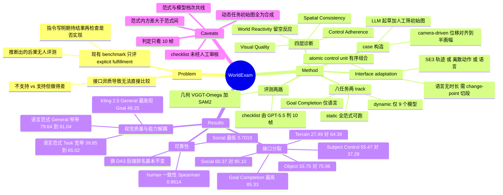

## Summary

WorldExam 把可控视频生成模型的评测拆成四个诊断层级——Visual Quality、Control Adherence、Spatial Consistency、World Reactivity——其中 World Reactivity 只给出发控制、刻意不写明预期的场景反应，考察模型能否从初始场景自行推断"世界应当如何回应"。1,474 个 case、8 个任务，同一控制意图被适配成 SE(3) 相机轨迹、离散动作序列或自然语言 prompt，从而把 camera-、action-、language-driven 三类模型放到同一批 case 上。20 个模型的结论是能力沿接口分裂且互补：action-driven 主体控制更准（Subject Control 55.47 vs language-driven 最好 37.28）却常让世界毫无反应（Terrain 27.49 vs 64.39），language-driven 反过来。

## Problem & Motivation

现有 world-model benchmark 绝大多数评的是 **explicit instruction fulfillment**：预先指定一个 layout、相机轨迹、动作序列或交互后果，然后检查它是否被实现。作者认为这漏掉了一类关键能力——从初始状态可以推出、但指令里没有描述的后果。主体走上台阶时运动应随地形改变高度并保持接触；靠近障碍物时应出现接触、绕行或阻挡；进入另一个 agent 的社交距离时对方应有合理反应。这些都不是输入的直接描绘，而是场景条件下的推论，作者把它们统称为 inherent reactivity。

Table 1 把这个空缺落到了具体工作上：WorldScore 只覆盖 Camera Control 与 Scene Revisit；MIND、WorldMark、iWorld-Bench 把评测扩到 subject control 与统一动作表示；Omni-WorldBench、WBench、WorldOlympiad 确实评交互后果，但作者用 † 标注它们的指令已经写明了期待的交互结果；WorldRoamBench 覆盖最广，仍不含 Social Interaction 与 Goal Completion。WorldExam 的定位就是把"指令里写明的"与"必须自行推断的"分开报告。

第二个动机是接口异质性。三类范式的输入格式完全不同，直接同表比较会把"接口不支持某能力"与"支持但做得差"混为一谈。

## Method

**Interface adaptation（跨范式可比的关键）**。把可控行为表示成 atomic control unit 的有序组合（{W, S, A, D, ↑, ↓, ←, →, ∅}），再适配到各范式的原生接口：camera-driven 得到 SE(3) 轨迹，action-driven 得到离散动作序列，language-driven 得到自然语言（"W"接"→"变成 "The camera moves forward, then pans right. [Scene description]."）。这里有一处必要但不对称的让步：语言 prompt 只保留控制顺序、不指定各段时长，因此 language-driven 的恢复轨迹要先用 change-point detection（ruptures）切成 N 段再逐段与控制级参考比对，而 camera-/action-driven 是按预分配帧区间比对。

**四层 × 八任务**

| 诊断层级 | 任务 | 评测方式 |
|:--|:--|:--|
| Visual Quality | 无专属任务，task-agnostic 指标 | VBench 系 + 几何/光流一致性 |
| Control Adherence | Camera Control、Subject Control | 几何重建后逐段轨迹比对 |
| Spatial Consistency | Scene Revisit | 往返轨迹 + 回视帧外观比对 |
| World Reactivity | Terrain / Object / Social Interaction、Physical Reaction、Goal Completion | Terrain 走几何，其余四个走 checklist |

reaction 类的四个任务只给一个触发用的 atomic control，把由此诱发的场景反应留空；Goal Completion 只给高层目标与含干扰项、前置条件、约束的初始场景，不给执行步骤。Scene Revisit 用去程 0.4 / 回程 0.6 的时间分配，给返回留更长窗口。

**两条 track，不做全局排名**。static-scene track（Camera Control + Scene Revisit）三类范式全可跑；dynamic-interaction track（Subject Control + 五个 World Reactivity 任务）只跑能可靠控制可见第三人称主体的模型；Goal Completion 仅限 language-driven。作者的理由是避免把"接口不支持"记成失败，也避免把不同场景假设下的分数平均到一起。

**评测协议分两类**

- **几何类**（Camera Control、Scene Revisit、Subject Control、Terrain Interaction）：用 VGGT-Ω 从生成视频恢复相机位姿/内参/深度，SAM2 跟踪指定主体或 anchor。Camera Control 分数是平移误差与旋转误差归一化后的几何平均 $S_{\mathrm{cam}}=100\sqrt{s_t s_r}$；Scene Revisit 把 revisit 成功率与 PSNR/LPIPS/SSIM 做几何平均，必须"既回得去又长得对"才拿高分。Terrain Interaction 先用 Subject Control 分数做 gate，未通过的 case 直接记 0，通过的再看主体高度轨迹与投影到地形上的轨迹在局部极值点与终点处是否同向变化。
- **checklist 类**（Object Interaction、Social Interaction、Physical Reaction、Goal Completion）：GPT-5.5 作 VLM judge，输入是从生成视频均匀采样的 10 帧有序图像加 case-specific checklist，逐条二值判定，分数为满足比例；证据矛盾、缺失、模糊、出画或以其他方式无法核实一律记为不满足。

**Case 构造**。static-scene 两个任务从已有数据集（Flickr2K、DL3DV、MIND）取第一人称场景配控制组合。六个 dynamic-interaction 任务走生成式流水线：task pattern → schema-guided LLM case composer 展开成结构化草稿（场景描述、初始图生成 prompt、控制意图或高层目标、语言 prompt，四个 checklist 任务另含 checklist）→ 用该 prompt 合成 N 张候选初始图并人工筛选（要求相关实体可见、布局支持目标行为、留有运动空间，且排除已经呈现待评事件的图）→ image-conditioned case refiner 按选定图重写实体指代、空间关系、prompt 与 checklist → 定稿。

**camera-driven 的图像空间位移对齐**。不同 camera-driven 模型对同样的平移量解释不同，导致图像空间位移不可比。作者在正式生成前先跑一次校准：用 SAM2 跟踪 anchor，测默认输入下的水平像素位移 $d_{m,c}$，把输入平移乘以 $k_{m,c}=W/(2d_{m,c})$，将所有 camera-driven 模型的位移统一到半个画幅。所有 camera-driven 结果都应用了这一校准。

## Key Results

评测覆盖 20 个模型：6 个 camera-driven、7 个 action-driven、7 个 language-driven。全部 20 个跑 static-scene track；dynamic-interaction track 只有 9 个（action-driven 的 WorldPlay 与 LingBot-World，加全部 7 个 language-driven），其余 5 个 action-driven 因不支持或无法可靠控制第三人称主体被排除，camera-driven 因接口只控相机整体排除。

**Static-scene track（Table 2）**。Camera Control 上，重建 3D 先验再重投影的路线明显更强：NeoVerse 97.33、InSpatio-World (1.3B) 85.94；把相机位姿编成 learned token/embedding 的 ReCamMaster 与 FantasyWorld 只有 38.64 与 18.46，而它们的 General 均值分别是 80.97 与 80.23。action-driven 最好的是 WorldPlay 92.74，language-driven 最好的是 Hailuo 2.3 63.29。Scene Revisit 上 NeoVerse 与 InSpatio-World 的 Revisit Success 都是 1.000、分数 89.25 / 85.90；WorldPlay 以 0.790 / 72.51 领跑 action-driven（按综合分；Matrix-Game 3.0 的 Revisit Success 更高，0.860，但综合分只有 64.25），Hailuo 2.3 以 0.505 / 48.70 领跑 language-driven。

**Dynamic-interaction track（Table 4）——本文的核心对照**

| 任务 | action-driven 最好分 | language-driven 最好分 |
|:--|--:|--:|
| Subject Control | **55.47**（LingBot-World；WorldPlay 49.75） | 37.28（Veo 3.1） |
| Terrain Interaction | 27.49 | **64.39**（Vidu Q3；Hailuo 2.3 61.57） |
| Object Interaction | 33.75 | **75.96**（Veo 3.1；Vidu Q3 71.59） |
| Social Interaction | 60.37 | **85.10**（Veo 3.1；Vidu Q3 81.91） |
| Physical Reaction | 33.43 | **63.84**（Hailuo 2.3；Veo 3.1 61.76） |
| Goal Completion | 接口不支持 | **85.33**（HappyHorse 1.0；Veo 3.1 85.30） |

> 27.49 / 33.75 / 60.37 / 33.43 是论文文本给出的"最好 action-driven 分数"，论文未指明各自属于 WorldPlay 还是 LingBot-World（dynamic track 上 action-driven 只有这两个）。

一个方向反转：Control Adherence 上 action 接口领先，World Reactivity 上 language 接口大幅领先，且反转幅度远大于领先幅度（Subject Control 差 18 分，Object Interaction 差 42 分）。论文对失败模式的描述是：把请求的主体运动变成相机运动或让场景静止；让被接触物体保持不变或让主体穿过去；让附近 agent 毫无反应。

**Visual Quality 与其余三层解耦**——本文最有引用价值的一组数字：

- dynamic track 上 language-driven 的 General 均值挤在 79.64–81.04 这个 1.4 分的窄带里，而它们的 Task 均值从 39.85 铺到 65.02。
- ReCamMaster / FantasyWorld 的 General 是 80.97 / 80.23，Camera Control 却只有 38.64 / 18.46。
- Kling 2.5 在 dynamic track 上 General 均值最高（81.04），Goal Completion 却只有 48.25。

**可靠性检查**

- VLM judge 与人的一致性：800 个实例（每任务 200）、5,793 个 checklist item，3 名标注者独立看同样的 10 帧、多数票为参考标签。总体 Spearman ρ = 0.8614、PLCC = 0.8583；分任务 Goal Completion 最高 0.8960，Social Interaction 最低 0.7019。
- 换重建后端（VGGT-Ω → Depth Anything 3）：static track 的 Overall 平均绝对相对变化 3.09%（camera-driven 0.44% / action-driven 3.08% / language-driven 5.36%）；dynamic track 平均 0.57%、最大 1.16%，且所有范式内排名保持不变。checklist 类任务的分数不受影响。
- 平移倍率消融（NeoVerse，0.10× → 2.00×）：Camera Control 98.25 → 95.32，Scene Revisit 90.98 → 88.37，General 80.42 → 75.05，其中 Photometric Consistency 掉得最狠（80.17 → 62.45）。

**Benchmark 组成**：第一人称视角占 31.4%；场景内容最大类（交通场景）只占 14.7%；五个 World Reactivity 任务内没有任何语义子类超过其所属任务的 35%。

## Evidence Ledger

| Claim ID | Claim | Type | Source locator | Evidence excerpt | Status |
|:--|:--|:--|:--|:--|:--|
| C1 | 1,474 个 case、8 个任务、四个诊断层级（Visual Quality / Control Adherence / Spatial Consistency / World Reactivity） | benchmark-setting | Abstract + Fig.1 caption + §3.4 | "hierarchical diagnostic benchmark spanning four levels... It comprises 1,474 cases across eight dedicated tasks" | source-verified |
| C2 | 评测 20 个模型：6 camera-driven / 7 action-driven / 7 language-driven | benchmark-setting | §5.1 | "We evaluate 20 representative video world models: 6 camera-driven, 7 action-driven, and 7 language-driven models." | source-verified |
| C3 | dynamic-interaction track 只含 9 个模型（WorldPlay、LingBot-World + 7 个 language-driven），其余 5 个 action-driven 因第三人称主体控制不可靠被排除，camera-driven 全排除，Goal Completion 仅 language-driven | benchmark-setting | §5.1 + §8 appendix + Table 4 | "includes WorldPlay, LingBot-World, and all seven language-driven models. The other five action-driven models either do not support third-person subject control" | source-verified |
| C4 | Camera Control：NeoVerse 97.33、InSpatio-World 85.94；ReCamMaster 38.64、FantasyWorld 18.46，而两者 General 均值为 80.97 / 80.23 | number | §5.2 + Table 2 | "much lower Camera Control scores of 38.64 and 18.46 despite competitive General averages of 80.97 and 80.23" | source-verified |
| C5 | Camera Control 上 action-driven 最好为 WorldPlay 92.74，language-driven 最好为 Hailuo 2.3 63.29 | number | §5.2 + Table 2 | "WorldPlay is the strongest action-driven model at 92.74... Hailuo 2.3 achieving the strongest score of 63.29" | source-verified |
| C6 | Scene Revisit：NeoVerse / InSpatio-World Success 均 1.000、分数 89.25 / 85.90；WorldPlay 0.790 / 72.51；Hailuo 2.3 0.505 / 48.70 | number | §5.2 + Table 2 | "NeoVerse and InSpatio-World both achieve 1.000 Revisit Success... WorldPlay performs best with 0.790 Revisit Success and a score of 72.51" | source-verified |
| C6b | WorldPlay 在 action-driven 中"领先"是按综合 Scene Revisit 分数；Matrix-Game 3.0 的 Revisit Success 更高（0.860）但综合分只有 64.25 | comparison | Table 2, Matrix-Game 3.0 行 | Success 0.860 / Scene Revisit Score 64.25 vs WorldPlay 0.790 / 72.51 | source-verified |
| C7 | Subject Control：LingBot-World 55.47、WorldPlay 49.75 高于 language-driven 最好的 Veo 3.1 37.28 | number, comparison | §5.4 + Table 4 | "LingBot-World scores 55.47 and WorldPlay scores 49.75, compared with the best language-driven score of 37.28 from Veo 3.1" | source-verified |
| C8 | 四个 reaction 任务上顺序反转：language 最好 64.39 / 75.96 / 85.10 / 63.84，action 最好 27.49 / 33.75 / 60.37 / 33.43 | number, comparison | §5.4 + Table 4 | "Vidu Q3 and Hailuo 2.3 lead with 64.39 and 61.57, whereas the best action-driven score is 27.49" | source-verified |
| C9 | Goal Completion：HappyHorse 1.0 85.33、Veo 3.1 85.30；Kling 2.5 仅 48.25，而其 General 均值 81.04 为 language-driven 最高 | number | §5.4 + Table 4 | "Kling 2.5 scores only 48.25 despite having the highest General average among language-driven models" | source-verified |
| C10 | dynamic track 上 language-driven 的 General 均值范围 79.64–81.04，Task 均值范围 39.85–65.02 | number | §5.5 + Table 4 | "the language-driven General averages occupy a narrow range of 79.64–81.04, while their Task averages range from 39.85 to 65.02" | source-verified |
| C11 | Table 4 的 Task 均值：WorldPlay 37.86、LingBot-World 39.91、Kling 2.5 39.85——language-driven 的 Kling 2.5 低于 action-driven 的 LingBot-World | number, comparison | Table 4, Task 列 | WorldPlay 37.86；LingBot-World 39.91；Kling 2.5 39.85 | source-verified |
| C12 | 四个任务由 GPT-5.5 作 VLM judge，输入 10 帧均匀采样的有序图像 + checklist，逐条二值判定，无法核实的证据记为不满足 | benchmark-setting | §4 + §4.3 | "the VLM receives 10 temporally ordered frames uniformly sampled... otherwise unverifiable evidence is counted as unsatisfied" | source-verified |
| C13 | human alignment：800 实例（每任务 200）、5,793 checklist item、3 名标注者多数票；总体 Spearman 0.8614 / PLCC 0.8583；Social Interaction 最低 0.7019 | number | §5.6 + Table 5 | "800 evaluation instances and 5,793 checklist items, with 200 instances per task. Three human annotators independently label each item" | source-verified |
| C14 | 换 DA3 后端：static Overall 平均绝对相对变化 3.09%（0.44 / 3.08 / 5.36% 分范式），dynamic 0.57% 平均、1.16% 最大，dynamic 范式内排名全保持 | number | §5.7 | "mean absolute relative change in Overall score is 3.09% across all 20 models: 0.44% for camera-driven, 3.08% for action-driven, and 5.36% for language-driven" | source-verified |
| C15 | 几何评测用 VGGT-Ω 恢复位姿/内参/深度、SAM2 跟踪主体或 anchor；Terrain Interaction 由 Subject Control 分数 gate，未通过记 0 | causal-mechanism | §4.1 + §4.3 | "use it as a gating check; cases that fail this check are considered not to follow the control and receive a Terrain Interaction score of zero" | source-verified |
| C16 | camera-driven 生成前用 $k=W/(2d)$ 校准平移，使图像空间位移对齐到半画幅；NeoVerse 消融 0.10×→2.00× 时 Camera Control 98.25→95.32、Scene Revisit 90.98→88.37、General 80.42→75.05、Photometric Consistency 80.17→62.45 | number, causal-mechanism | §4.2 + §5.3 + Table 3 | "the Camera Control score decreases from 98.25 to 95.32, the Scene Revisit score from 90.98 to 88.37, and the General average from 80.42 to 75.05" | source-verified |
| C17 | 组成统计：第一人称 31.4%；最大场景类（交通）14.7%；World Reactivity 任务内无子类超过 35% | number | §3.4 | "first-person viewpoints accounting for 31.4%... the largest category, traffic scenes, accounts for only 14.7% of the cases" | source-verified |
| C18 | 六个 dynamic-interaction 任务的初始场景是合成图（LLM 起草 prompt → 生成候选 → 人工筛选）；static-scene 两个任务改用已有数据集 Flickr2K / DL3DV / MIND 的第一人称场景 | benchmark-setting | §3.3 | "we pair suitable first-person scenes from existing datasets [Flickr2K, dl3dv, ye2026mind]"；"used only to synthesize N candidate initial images" | source-verified |
| C19 | 论文未指名合成初始图所用的图像生成模型，未给出候选数 N 的取值，也未说明 curation 阶段有人工审核 checklist 本身（人工只筛初始图；checklist 由未具名的 LLM case composer 起草、image-conditioned refiner 改写后定稿） | benchmark-setting | §3.3 + 全文 grep（含附录） | "The initial-image generation prompt is used only to synthesize $N$ candidate initial images. Human filtering retains candidates in which the relevant entities are visible" | source-verified |
| C20 | Table 8 的 Backend 列显示 7 个 language-driven 模型全部为 API，7 个 action-driven 模型全部为 Local（6 个 camera-driven 也是 Local） | benchmark-setting | Table 8, §8 | Backend 列：action-driven 7 行均 "Local"，language-driven 7 行均 "API" | source-verified |
| C21 | 作者自陈局限：指标测的是可观测的端到端行为，不能判定推理发生在何处，也不能证明视频生成器学到了内部因果表示；闭源商用系统的 proprietary prompt enhancement 可能参与场景 grounding 与执行规划 | causal-mechanism | §6 Conclusion | "rather than determining where reasoning occurs or establishing that the video generator itself has learned an internal causal representation" | source-verified |
| C22 | 数据与评测工具包为"将会公开"，论文只给出项目主页 https://WorldExam.github.io，全文无 GitHub 代码仓库地址 | license-code | §1 contributions + \checkdata 行 + 全文 URL 扫描 | "We will publicly release the benchmark data and evaluation toolkit" | source-verified |
| C23 | 机构为 CASIA / SLAI / CUHK / AMAP / THU；arXiv v1 时间戳 03 Aug 2026，主分类 cs.CV | benchmark-setting | 作者块 + arXiv 头 + abs 页 | "arXiv:2608.02603v1 [cs.CV] 03 Aug 2026"；"1]CASIA 2]SLAI 3]CUHK 4]AMAP 5]THU" | source-verified |

> 全部 23 条高风险 claim 由独立 verifier 逐条定位原文核对，状态均为 `source-verified`。这只表示原文确实包含这些信息，不表示结果已被独立复现。两处措辞边界需随数字一起传播：(a) C20 只支持"Backend = API"，论文并未断言 7 个 language-driven 模型全部闭源商用，原文只在 §5.1 说 "Some closed-source commercial language-driven systems apply proprietary prompt enhancement"；(b) C19 说的是 curation 阶段没有人工审核 checklist，§5.6 的三名标注者确实逐条看了 5,793 条 checklist item，但他们判的是"该条在视频里是否被满足"，验证对象是 judge 而非 checklist 本身。

## Strengths & Weaknesses

**亮点**

- **"explicit fulfillment vs. inherent reactivity"是一个干净且可操作的切分。** 它不是又一个概念口号：落到实现上就是"model-facing input 只写触发控制或高层目标，把诱发的反应留空"，Table 1 的 † 标注进一步把这个差别锚定到 Omni-WorldBench / WBench / WorldOlympiad 这些同期工作上——它们评交互后果，但后果已经写进指令。这个区分是可复用的，不限于视频生成。
- **两条 track 而非一个总榜。** 明确拒绝把"接口不支持"记成"做得差"，也拒绝把不同场景假设下的分数平均到一起。这在 benchmark 设计上是正确的取舍，代价是牺牲了单一排行榜的传播力。
- **Terrain Interaction 的 gate 方向对结论有利，这让结论比表面数字更硬。** gate 用 Subject Control 分数，而 action-driven 的 Subject Control 明显更高（55.47 / 49.75 vs 37.28），所以这个 gate 系统性地更宽容 action-driven 模型；它们在 Terrain Interaction 上仍然只有 27.49 对 64.39。"水平控制准 ≠ 垂直地形适配"这条因此站得住。
- **Visual Quality 解耦的证据是多点位的，不是单个反例**：语言范式内 General 窄带 79.64–81.04 对 Task 宽带 39.85–65.02；ReCamMaster / FantasyWorld 的高 General 配低 Camera Control；Kling 2.5 的高 General 配低 Goal Completion。三处证据分布在不同范式与不同层级上。
- 两个可靠性检查（human alignment、backend swap）都做了，而且报告了分任务弱项（Social Interaction ρ=0.7019）而非只报总体，也报告了 language-driven 对后端最敏感（5.36%）。这种披露密度在同类 benchmark 里不常见。

**局限**

- **接口范式与模型档次共线，这是最主要的问题。** dynamic-interaction track 上的 action-driven 只有 WorldPlay 与 LingBot-World 两个本地部署模型，language-driven 全部 7 个走 API（Table 8）。"action 接口 → 世界不反应"与"这两个特定模型 → 世界不反应"在这份数据里分不开，而论文自己也承认闭源系统的 proprietary prompt enhancement 可能在贡献场景 grounding 与执行规划。要拆开这条共线需要同一底座接两种接口的对照，本文没有做，也没有把它列为限制。
- **范式内方差大于范式间差距，作者未突出。** Kling 2.5 的 dynamic Task 均值 39.85 低于 action-driven 的 LingBot-World 39.91；language-driven 内部 Task 均值从 39.85 铺到 65.02，跨度 25 分。也就是说"language-driven 更会反应"这条其实由 Veo 3.1 / Vidu Q3 / Hailuo 2.3 三个最强系统撑起，落到范式属性上是过度概括。摘要那句 "language-driven models perform better on interaction" 读起来比数据支持的更强。
- **checklist 是四个任务的 ground truth，但 checklist 本身没有被人工审核。** curation 阶段的人工介入只在候选初始图筛选；checklist 由未具名的 LLM case composer 起草、image-conditioned refiner 改写后定稿。§5.6 的 human alignment 验证的是"VLM judge 按给定 checklist 打分与人一致"，不是"checklist 抓对了该发生的物理/社会反应"。Conclusion 里 "Strong agreement between human and VLM checklist scores... supports the reliability of these findings" 一句把这两件事合并了，而它们的失效模式完全不同。
- **判定视频只用 10 帧。** 一段 125–192 帧的视频被降到 10 帧交给 judge，而 Social Interaction 与 Physical Reaction 要判的恰恰是时序上的东西（timely adjustment、premature onset、freezing）。Social Interaction 的人机一致性也正好是四个任务里最低的 0.7019。10 这个数没有做敏感性分析。
- **"无法核实记为不满足"可能让视觉质量从后门漏进 reactivity 分数（推测，论文未做相关分析）。** 画面越糊、artifact 越多，judge 越难确认某条 checklist 成立，就越容易记 0。dynamic track 上 action-driven 的 Aesthetic / Imaging Quality 确实低于 language-driven。若这条路径存在，会部分削弱"visual quality 与 reactivity 解耦"的主张——注意论文对解耦的直接证据里，只有 Kling 2.5 那条落在 checklist 类任务上，ReCamMaster / FantasyWorld 两条都来自几何类任务。
- **六个动态任务的初始场景全是合成图，且未说明用哪个图像生成模型、N 取多少。** 这既影响可复现性，也留下一个未测的问题：结论能否迁移到真实拍摄的初始帧。static track 反而用了真实数据集（Flickr2K / DL3DV），两条 track 的输入分布并不同源。
- Task / General / Overall 都是跨异质指标的算术平均（几何法恢复的 0–100 分与 checklist 满足比例混在一起），聚合分只适合粗看，跨范式引用单个 Overall 数字意义有限。
- 数据与工具包写的是 "will publicly release"，目前只有项目主页、无代码仓库，暂时无法复现。

**对领域的判断（推测）**。这篇的长期价值大概率不在排行榜，而在两处可复用的东西：一是"输入只给触发、把后果留空"这个 case 构造原则，它可以直接搬到 GUI / embodied 的环境评测上（例如只给一次点击，不说明界面应当出现什么后续状态）；二是"visual quality 的窄带对 task 分数的宽带"这组数字，它是一条现成的反驳素材，用来反对拿 FVD / aesthetic score 之类的指标论证 world model 质量。反过来，"三种接口能力互补"这条结论的保质期可能很短——它高度依赖当前特定模型的训练配方，一旦有人把强动作接口接到强生成底座上，整张表就会重画。

## Mind Map

## Notes

- **与库内工作的关系。** 分类学层面最该并读的是 [[2604-AgenticWorldModel]]：它提出 levels × laws（L1 Predictor → L2 Simulator → L3 Evolver × physical/digital/social/scientific），WorldExam 的四层则是**可测量的**版本——Visual Quality/Control Adherence 大致对应 L1，Spatial Consistency + World Reactivity 才踏进 L2。两者拼起来能回答一个具体问题：现有模型卡在 L1→L2 的哪一步。宏观脉络见 [[2411-WorldModelSurvey]]。被评的 action-driven 一类在库内的代表是 [[2607-AlayaWorld]]（可实时游玩的自回归视频世界）与 [[2402-Genie]]（这条路线的源头），生成侧还有 [[2604-HYWorld2]]、[[2501-Cosmos]]、[[2408-GameNGen]]、[[2405-Vista]]；[[2604-MultiWorld]] 把 action-conditioned 世界模型推到多 agent 多视角，正好是 WorldExam 的 Social Interaction 想测但没有对应模型可测的场景。几何一致性这条线上 [[2604-WorldR1]] 是"用 RL 把 3D 约束灌进视频生成"，可以看成对 WorldExam 的 Spatial Consistency 层的直接优化。
- **跨论文 pattern（值得进 DomainMap）：contact 是当前视频世界模型的共同失效点，而视觉指标看不见它。** [[2607-GigaWorld1]] 从 policy evaluation 角度独立得到几乎同构的结论——evaluator 质量取决于 long-horizon action fidelity 与可迁移 physical prior 而非短期视频观感，且 video model 对 contact-sensitive failure 有 optimistic bias。WorldExam 从生成质量角度给出对应证据：Object Interaction 的典型失败就是"被接触物体不变"或"主体穿过去"，最好的 action-driven 只有 33.75。两篇的评测目标、数据、团队都不同，结论指向同一处，这比任何单篇的 SOTA 都更值得写进 mental model。相邻的 [[2604-dWorldEval]] 与 [[2606-PiLWorld]] 同属"world model 当评估器"这一支，可一并放进这条脉络。
- **VLM-judge 与人的一致性正在形成一个可比较的量纲。** WorldExam：Spearman 0.8614 / PLCC 0.8583（800 实例、5,793 item、3 标注者）。[[2607-GigaWorld1]] 的 WMES：与人 exact agreement 87.80%、QWK 0.7349、Spearman 0.7574（5,000+ 视频）。两个独立测量都落在 Spearman 0.75–0.86 区间。这个区间可以当作后续论文报告 VLM judge 时的参照带——低于它需要解释，高于它需要核对是否任务本身太容易。
- **一个可以直接做、不需要复现的检验。** WorldExam 的 Table 4 已经给出 9 个模型 × 6 个任务的完整分数与 4 个 general 指标。把每个模型的 General 均值对其 Task 均值作回归，可以直接量化"视觉质量对能力的解释力"到底有多低（作者只给了范围，没给相关系数）。如果相关系数接近 0 甚至为负，这就是一条比现有表述更强、也更好引用的结论。同样的分析可以横向搬到 GUI agent 领域：把各 GUI benchmark 上"界面渲染保真度/截图质量"类指标与任务成功率作同样的回归。
- **对我们自己 idea 的启发：留空诱因（elicitation by omission）是一种可迁移的评测构造法。** WorldExam 的做法是"给触发、不给后果"。搬到 GUI agent 上对应的问法是：只告诉 agent 点哪里，不告诉它界面应当出现什么后续状态，再用 checklist 判它生成/预期的后续状态是否合理。这能把"会执行"和"知道会发生什么"分开——后者正是 GUI world model 与 GUI verifier 都需要但当前 benchmark 不测的能力。注意这个想法必须先做 novelty 检索再动，[[2604-AgentWorld]]、[[2605-MobileWorldModelGUI]] 与 [[2512-MobileWorld]] 是首先要排查的先例。
- **证据边界备忘。** 单个模型的 5 个 World Reactivity 任务分数只由 9 个模型支撑，Goal Completion 只有 7 个；引用"20 个模型"时必须说明这是 static-scene track 的规模，reactivity 层的实际样本是 9。另外每个 case 只跑一次生成，论文未做重复采样取平均——对以随机采样为核心的生成模型来说这是一个未量化的方差来源。
- 代码与数据尚未发布（只有项目主页 https://WorldExam.github.io），因此 frontmatter 的 `code` 留空，暂不适合 repo-digest；待其 toolkit 公开后可另起一轮看 checklist 与 judge prompt 的实际实现，那是本文最需要审视但正文披露最少的部分。
