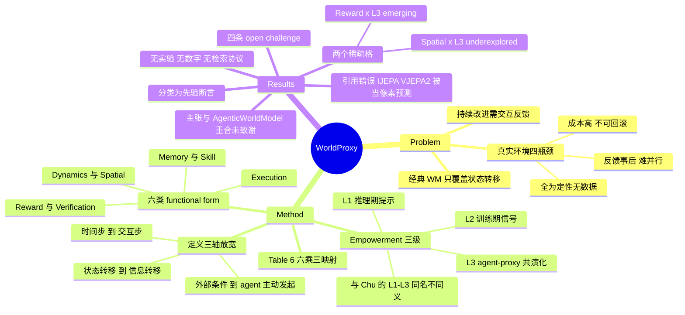

## Summary

这是一篇 position 文章（无实验、无文献检索协议、正文零量化数字），主张把 world modeling 从"预测物理状态转移"改写为 **Agent-Centric World Proxy**：形式上用 agent 主动发起的 interaction step $\ell$ 取代物理时间步 $t$、用 information transition 取代 state transition，即 $\hat{s}_{\ell+1}=\mathcal{WP}(s_\ell, u_\ell^{\mathcal{F}})$，从而把 dynamics / spatial / execution / memory-experience / skill / reward-verification 六类模块收进同一框架，再与"对 agent 介入深度"三级（L1 推理期提示 / L2 训练期信号 / L3 agent-proxy 共演化）交叉成 6×3 设计空间。全文真正的落点是验收标准之争：world model 应按"让查询它的 agent 变好多少"评价，而非按生成保真度——但这一主张在 4 个月前的 [[2604-AgenticWorldModel]]（共享两名作者）已作为 "decision-centric evaluation" 具名提出，本文未就此致谢（C18）。

## Problem & Motivation

出发点没有争议：持续改进的 agent 需要交互反馈，而真实环境交互有四条瓶颈（Table 1）——成本高/慢、不可回滚且有不可逆风险、反馈是事后的因而难支持多步前瞻、难以像 simulator 那样并行。四条全是定性说明加举例，没有任何成本或风险的量化数据（C17）。因此需要一个介于 agent 与真实环境之间的 proxy。

真正的动作是定义层面的。经典 world model 是 $\hat{s}_{t+1}=\mathcal{WM}(s_t,a_t)$，作者认为这只覆盖了 agent-world 交互的一种机制；agent 实际需要的反馈还包括"这条命令/API 会返回什么""我以前遇到过类似情况吗""这个 plan 安不安全""这条轨迹该得多少分"。于是沿三个轴放宽（Table 2）：physical time step → interaction step；state transition → information transition；external condition → agent-initiated interaction。配套给出三条 Key Requirements（Agent-Facing Closed Loop / Real-Environment Grounding / Actionable Information Gain）与 Table 3 五条 criteria（Groundedness、Controllability、Feedback Usefulness、Cost and Scalability、Forward-Looking Ability）（C13）。

需要先说清楚这篇的性质：它不是 survey。全文检索 inclusion / exclusion / screening / PRISMA / systematic review / selection criteria / methodolog 等词零命中，没有语料规模、没有筛选标准、没有任何从语料导出的统计（C9）。对照组很清楚：Chu et al. 自述 "synthesize over 400 works and summarize more than 100 representative systems"，本文没有对应表述。所以下面所有"分类"都应读作作者的断言，而非从证据聚出来的结构。

## Method

**定义与两轴.** 核心公式 $\hat{s}_{\ell+1}=\mathcal{WP}(s_\ell,u_\ell^{\mathcal{F}})$，其中 $\mathcal{S}$ 是"信息状态空间"，可以装 physical state、observation、memory、knowledge、execution result、verification、guidance "and more"；$u_\ell^{\mathcal{F}}$ 是 agent 在某个 proxy function 下主动发出的 query/action/intervention。四步闭环：agent 提问 → proxy 预测信息转移 → 反馈返回 → agent 用于 planning/学习/改进。

**Empowerment 三级（Section 3）.** L1 Inference-Time Guidance：proxy 输出只进 context（$s^{agent+}_\ell = s^{agent}_\ell \oplus \hat{s}^{guide}_{\ell+1}$），不改参数，可逆且便宜，天花板是 agent 已有能力；L2 Training-Time Optimization：proxy 当 reward model / verifier / critic / simulator，输出转成 SFT/DPO/PPO/GRPO 目标，抬的是能力上限，代价是"有偏的 reward 会悄悄教出有偏的行为"；L3 Agent-Proxy Co-Evolution：真实环境证据更新 proxy，proxy 的知识蒸馏回 agent，两者同步演进。

作者明确说 L1–L3 这套简写是从 [[2604-AgenticWorldModel]] 借来的，且两套刻度是**正交**的两个问题——Chu 那套问"world model 自身多强"（L1 Predictor / L2 Simulator / L3 Evolver），本文这套问"它把 agent 提升了多少"——原文措辞是 "rhyme without being identical" / "align in spirit, not in definition"，并用 Table 4 并置（C16）。这个 hedge 是诚实的，但复用同一批标签仍然制造了术语碰撞（见 Notes）。

**六种 functional form（Section 4）.** 每类给一条形式化公式、一段"它替代世界的哪一片"、一组典型工作：

| Proxy | Agent 输入 | 代理的对象 | 输出 |
|:--|:--|:--|:--|
| Dynamics（即经典 World Model） | state/history + action/future query | 真实动力学与时序转移 | 未来状态、rollout、预测 reward |
| Spatial | scene context + viewpoint/pose 查询 | 另一视角下的观测 | novel view、渲染图、空间表示 |
| Execution | code/command/click/API/tool call | 数字环境中可执行交互的后果 | 执行结果、状态变化、stdout/stderr |
| Memory / Experience | task context + 检索 query | 可复用的过往交互证据 | 经验、failure case、约束 |
| Skill | goal/context + skill query | 可复用的行为知识与 prior | skill 建议、action prior |
| Reward / Verification | plan/trajectory/answer/action | 评价反馈、偏好、准则 | reward、critique、preference、verification |

作者对相邻类别的切分理由都只有一句话：Execution 与 Dynamics 的区别是"连续物理 vs 数字系统离散且脆弱的逻辑"；Memory 与 Skill 的区别是"以前发生过什么 vs 现在能做什么"。文中唯一一处主动收紧边界是 Memory 节："An ordinary static memory store is not necessarily a World Proxy"——必须是 store-retrieve 的动态系统且返回决策相关信息才算。这条纪律没有被施加到另外五类。

**Table 6（Functions × Levels）.** 18 个格子，16 格填了代表系统，Spatial×L3 写 "underexplored"、Reward/Verification×L3 写 "emerging"，作者称这两个空角 "are not accidents but invitations"（C11）。这张表是全文唯一的"映射"产物，用到 23 条不同引用（占 216 条参考文献的约 11%）。

**Worked Example.** 用一个网购 web agent 串起三级：点 Purchase 前先让 proxy 想象结果页（[[2411-WebDreamer]]，C3）→ 把想象 rollout 回放成合成轨迹训策略（[[2511-DreamGym]]，C5）→ 部署后真实轨迹回流重训 proxy（WebEvolver，C4）。三个 rung 由三个不同系统拼成，没有任何单一系统同时做到 L1→L3。

## Key Results

**这篇没有实验结果。** 全文零 benchmark 数字、零指标、零百分号、正文除章节号外无多位整数，六张表全部是概念/分类表（C10）。因此"Key Results"只能是它的产出物本身：

1. **一个 6×3 设计空间**，每格配代表工作（Table 6）。这是可检索、可当 checklist 用的东西。
2. **两个显式稀疏格**：Spatial×L3、Reward/Verification×L3。这是全文最接近"实证发现"的输出，但因为没有系统检索，它是断言而非结论（C9 + C11）。
3. **四条 open challenge**（C14），是全文写得最锋利的部分：(i) fidelity 与想象的边界——生成模型可以看起来很像却违反它自称建模的动力学（引 Vafa et al.，C8），长 rollout 误差累积，缺的是 calibrated uncertainty 而非更清晰的像素；(ii) 何时该信 proxy——agent 必须在线判断该采信 proxy 反馈还是回到真实环境，"Today agents rarely make that judgment well"，把 proxy 当 oracle 会导致 silent failure（C7）；(iii) reward hacking 与安全——proxy 一旦成为 reward/verifier（L2），agent 就有动机去钻它的盲点，"同一个让高风险探索变安全的 sandbox 也打开了新的攻击面"；(iv) 评测应度量 information gain——现有 benchmark 打的是 realism/fidelity/controllability，仍然在孤立地给 proxy 打分，缺的是"这条反馈到底有没有让 agent plan/learn/improve 得更好"的 agent-centric 评测。
4. **216 条参考文献 + 配套 awesome-list 站点**（C12）。

**Claim 校验中发现的两处问题**（详见 Evidence Ledger）：一处确证的引用错误——把 I-JEPA / V-JEPA 2 举为 "in raw pixels" 预测的例子（C1，`contradicted`）；一处主张归属问题——头号论点与 [[2604-AgenticWorldModel]] 的 "decision-centric evaluation" 重合而未致谢（C18）。

## Evidence Ledger

| Claim ID | Claim | Type | Source locator | Evidence excerpt | Status |
|:--|:--|:--|:--|:--|:--|
| C1 | 文中把 I-JEPA [5] 与 V-JEPA 2 [6] 举为 "in raw pixels" 预测的例子，与 "learned latent space [194]" 对举 | sota-novelty | Sec 2.1 | "Even modern self-supervised variants that predict in a learned latent space [194] rather than in raw pixels [5, 6] inherit this backbone" | **contradicted**——I-JEPA 自述 "a non-generative approach"，做的是 "predict the representations of various target blocks"；V-JEPA 2 是 "action-free joint-embedding-predictive architecture"，其控制变体自述为 "latent action-conditioned world model"。两者恰是 latent 预测的代表作，引用方向被写反；[194] 本身是一篇 latent space 综述而非某个 latent 预测模型。文献表内真正的 pixel-space 例子（如 [8] FitVid "pixel-level video prediction"）未被使用 |
| C2 | 文中把 Chu et al. [31] 的能力层级概括为 L1 Predictor（单步/局部转移）、L2 Simulator（长时程 action-conditioned rollout）、L3 Evolver（world model self-reflection） | comparison | Sec 3 开头 + Table 4 | "L1 Predictor, which learns one-step local transition operators; L2 Simulator, which composes them into multi-step, action-conditioned rollouts"（[31] 原文） | source-verified（**转述被软化**：[31] 的 L3 是 "autonomously revises its own model when predictions fail against new evidence"，不是 self-reflection；且 [31] 的第二个轴 governing-law regimes 被整个略去，读者会以为那是一个三层阶梯） |
| C3 | WebDreamer [52] 作为 L1 execution proxy：点 Purchase 前先让 proxy 想象结果页再改 plan | comparison | Sec 3.1 + Worked Example L.1 | "employs a world model to simulate and deliberate over the outcome of each candidate action before committing to one"（[52] 摘要） | source-verified |
| C4 | WebEvolver [41] 作为 L3 co-evolution：真实轨迹回流重训 proxy，proxy 与 policy 同步演进 | comparison | Table 6 Execution×L3 + Worked Example L.3 | "Our framework co-trains a world model with the agent"（[41] Fig. 1） | source-verified（机制吻合；但 "Once deployed" 是本文的措辞——WebEvolver 的循环是 self-improvement 训练迭代，不是部署后遥测） |
| C5 | DreamGym [28] 作为 L2：proxy 打分并把想象 rollout 回放成 synthetic trajectories 与 preference pairs 供策略优化 | comparison | Worked Example L.2 + Table 6 Execution×L2 | "synthesize diverse experiences with scalability in mind to enable effective online RL training for autonomous agents"（[28] 摘要） | source-verified（**部分不成立**：DreamGym 用 PPO/GRPO 在合成 rollout 上训练，DPO 在其论文中只作为 baseline 出现；"preference pairs" 这一半不属于 [28]，属于合引的 [168]/[161]） |
| C6 | DayDreamer [173] 填 Dynamics×L3 格，描述为 "online model learning on a real robot" | comparison | Table 6 | "we apply Dreamer to 4 robots to learn online and directly in the real world, without simulators"（[173] 摘要） | source-verified（描述属实；但 DayDreamer 是标准 model-based RL 的在线训练，没有独立于常规 MBRL 的 proxy→agent 蒸馏环节，只在对 L3 的宽松读法下才算 co-evolution） |
| C7 | "Today agents rarely make that judgment well"（agent 判断该信 proxy 还是回真实环境），由单条引用 [125] 支撑 | causal-mechanism | Sec 5 Open Challenge 2 | "Today agents rarely make that judgment well [125]; treating the proxy as an oracle invites silent failure." | source-verified（引用确实存在，但**证据强度远弱于断言**：[125] = "Current Agents Fail to Leverage World Model as Tool for Foresight"，arXiv 2601.03905，单篇 2026 preprint、有限任务集；且它测的是"何时调用 world model"而非"是否信任 proxy 输出"，其自身措辞更收敛："some agents rarely invoke simulation (fewer than 1%)"） |
| C8 | "Generative models can look convincing while violating the dynamics they claim to model"，引 Vafa et al. [153] | causal-mechanism | Sec 5 Open Challenge 1 | "our evaluation metrics reveal their world models to be far less coherent than they appear"（[153] 摘要） | source-verified |
| C9 | 六类 proxy function 与 L1–L3 三级为作者断言：全文无文献检索协议、无纳入/排除标准、无语料规模、无任何从语料导出的量化证据 | benchmark-setting | 全文 Sec 1–6 | "The mapping is illustrative rather than exclusive, since many systems span more than one level" | source-verified（检索 inclusion / exclusion / screening / PRISMA / systematic review / selection criteria / methodolog 全部零命中；对照 [31] 自述 "synthesize over 400 works and summarize more than 100 representative systems"） |
| C10 | 全文无实验、无 benchmark 数字、无任何量化统计；Tables 1–6 全为概念/分类表 | number | Tables 1–6 / 全文 | 正文零 "%" 字符；除章节号与 LaTeX 前导参数外无多位整数 | source-verified |
| C11 | Table 6 中 Spatial×L3 填 "underexplored"、Reward/Verification×L3 填 "emerging"，两格无代表系统 | benchmark-setting | Table 6 + Sec 4.8 末句 | "The blank corners, spatial and reward proxies at the co-evolution level, are not accidents but invitations." | source-verified |
| C12 | 216 条参考文献；project page 与 GitHub repo 均为 worldbench/awesome-agentic-world-model | license-code | 标题块 / References | "Project Page: https://worldbench.github.io/awesome-agentic-world-model GitHub Repo: https://github.com/worldbench/awesome-agentic-world-model" | source-verified（补注：该 repo 经 GitHub API 查为 HTML 站点、size 34 KB，即技术博客 + 阅读清单而非代码实现——**此项系笔者查验，非 verifier 判定**；故 frontmatter `code` 留空，不作 repo_candidate） |
| C13 | 形式定义 $\hat{s}_{\ell+1}=\mathcal{WP}(s_\ell,u_\ell^{\mathcal{F}})$，$\ell$ 为 interaction step 取代物理时间步；三条 Key Requirements + Table 3 五条 criteria | benchmark-setting | Sec 2.3 / Sec 1.3 / Table 3 | "interaction step, representing the ℓ-th interaction between the Agent and the World Proxy, not limited to physical time" | source-verified |
| C14 | Conclusion 列出**恰好四条** open challenge：fidelity 与想象边界 / 何时信 proxy / reward hacking 与安全 / 度量 information gain 的评测 | benchmark-setting | Sec 5 "Open Challenges" | "Evaluation that measures information gain. Current benchmarks score realism, fidelity, controllability, or human-aligned quality" | source-verified |
| C15 | 三实验室署名（Shanghai AI Lab KnowledgeX / ZJU APRIL / NUS LV-Lab）；Sec 6 把 20 名贡献者按 Concept & Design / Writing & Editing / Figures / Discussion / Advising 五类角色分组，全文无常规扁平作者序 | benchmark-setting | 标题块 + Sec 6 | "Concept & Design: Yu Yang, Xuemeng Yang, Licheng Wen • Writing & Editing: ..." | source-verified |
| C16 | 文中明说 L1–L3 简写是从 [31] 借用，两套刻度 "rhyme without being identical" / "align in spirit, not in definition" | comparison | Sec 3 + Table 4 caption | "We deliberately reuse the L1-L3 shorthand for this agent-centric axis, so the two scales rhyme without being identical" | source-verified |
| C17 | Table 1 列四条真实环境交互瓶颈（成本/不可回滚/事后反馈/难并行），全为定性说明 + 举例，无任何成本或风险的量化数据 | number | Table 1 | "Non-Rollbackable and Risky Interaction Incorrect operations in the real environment are often difficult to undo" | source-verified |
| C18 | 本文头号主张——world model 应按"让 agent 变好多少"验收而非生成保真度——在 [31]（2026-04）已作为具名原则提出，本文未就此致谢，全文仅两次引用 [31] 且均只用于 L1–L3 能力阶梯 | sota-novelty | [31] Sec 6.1 + 摘要；本文 Sec 5 challenge 4（引 [91,127,87]，未引 [31]） | "From prediction-centric to decision-centric evaluation"（[31] 节标题）；[31] 摘要另有 "propose decision-centric evaluation principles" | source-verified（两文共享作者 **Lingdong Kong、Wei Chow**，二人均列于本文 Writing & Editing） |

## Strengths & Weaknesses

**值得学的地方**

- **Open Challenges 是全文最有信息量的一节**，四条都提得准，尤其第三条把 sandbox 的两面性说透了："同一个让高风险探索变安全的 sandbox 也打开了新的攻击面"——这在库内已经有正面证据（[[2607-BadWAM]] 用黑盒视觉扰动让 action 与 imagined future 解耦，LIBERO 96.5%→43.1%）。第二条（agent 不会判断何时该信 proxy）也是真问题，虽然它的唯一证据比断言弱（C7）。
- **"按 agent 提升量验收 world model"这个立场是对的**，而且库内已有三条切法不同的独立证据支持（[[2607-PhiZero]] 生成 vs 判别背离、[[2607-GigaWorld1]] evaluator agreement、[[2608-WorldExam]] 分数分布）。问题只在于它不是本文首倡（C18）。
- **把 memory / skill / reward 也当作"世界的一部分被代理"是有启发的视角切换**。它逼你问：我们在 world model 上花的功夫，是不是本该花在更便宜的反馈通道上？——比如同样是"提前知道会不会出错"，[[2607-SeerGuard]] 用 8B 语义预测做二分类风险判定就够了，不需要像素级 rollout。
- **写作干净**，每节有 Key Point / Takeaway 收束，Table 2 的三轴对照（time step→interaction step、state→information、external→agent-initiated）是清晰的表达装置。

**该打折扣的地方**

- **分类学是先验断言，不是从证据里聚出来的（C9、C10）。** 没有检索协议、没有语料、没有计数，六类和三级都是作者拍的。这正好撞在本 vault 反复记过的那条：claim 不能建在先验分类学上——分类可以无限细分且没有终点，除非它被降级为实验输出（按某种可测干预的有效性事后聚类）。本文没有做这一步，所以 Table 6 只能读作一张检索索引，不能读作一张领域地图。
- **框架没有 falsifier，因而有变得空洞的风险。** 定义里 $\mathcal{S}$ 装 "physical state, observation, memory, knowledge, execution result, verification, guidance, and more"，于是 agent 调用的任何可查询模块——retriever、reward model、code interpreter、LLM judge——都是 World Proxy。全文只在 Memory 一节做过一次排除（"An ordinary static memory store is not necessarily a World Proxy"），且这条纪律没有推广到另外五类；Table 3 那五条 criteria 从头到尾没有被用来排除任何一个具体系统。最刺眼的落点是 Memory×L1 格填的是 Generative Agents [124] 与 CoALA [144]——后者是一篇认知架构的**概念框架论文**，在此前任何用法下都不是 world model。**一个什么都装得下的分类，什么也预测不了。**
- **相邻类别的切分没有被辩护。** Execution vs Dynamics 的理由是"数字 vs 连续物理"——那是领域差别不是功能差别；Spatial 本质上是"动作为相机位姿"的 Dynamics，作者没解释为什么它该独立成类；Memory vs Skill 的"过去发生过什么 vs 现在能做什么"在实践中不成立——skill library 就是从过往经验里蒸出来的，所以 Skill×L3 格只能重复引用 Skill×L1 和 L2 已经用过的同两篇（[157] Voyager、[75] CASCADE），这本身就说明该格没有独立内容。
- **L3 列整体虚。** 18 格里有 2 格自认为空（C11），Dynamics×L3 由 2022 年的 DayDreamer 顶着（C6，标准 MBRL 在线训练，无独立的 proxy→agent 蒸馏），Skill×L3 靠复用填。真实情况更像"L3 这一层目前几乎不存在"——这与 [[2604-AgenticWorldModel]] 那套刻度下的判断一致（DomainMap Pattern 2：现有 world model 只做到 L2 Simulator）。作者用 "invitations" 这个词把空白写成了机会，但没有区分"没人做"和"这么切本来就不成立"。
- **头号主张是 prior art，且来自共享作者的论文（C18）。** [[2604-AgenticWorldModel]] 的 Sec 6.1 标题就是 "From prediction-centric to decision-centric evaluation"，摘要里也写了 "decision-centric evaluation principles"；本文 Open Challenge 4 提出同一件事时引的是 [91,127,87] 三篇 benchmark，没有引 [31]。全文只引 [31] 两次，都用于借 L1–L3 阶梯。两文共享 Lingdong Kong 与 Wei Chow。这不是抄袭问题，是**定位问题**：本文把自己相对 [31] 的差异定位在"轴的正交性"上，而它最有说服力的那句话其实不是新的。
- **20 人 / 216 引的体量带来了引用精度的代价。** C1 是确证的方向性错误：I-JEPA 与 V-JEPA 2 被举为 raw-pixel 预测的例子，而这两篇恰恰是 latent 预测（joint-embedding）的代表作，V-JEPA 2 自述其控制变体就是 "latent action-conditioned world model"；文献表里真正的 pixel-space 例子（FitVid）反而没用上。C5 的 "preference pairs" 归属、C2 对 [31] 的软化转述属于同一类松弛。
- **零证据是设计选择，不是缺陷本身——但它决定了这篇能被引用的方式。** 它可以作为术语与阅读入口被引，不能作为任何经验结论的依据。

**对领域的影响判断**：最可能被沿用的是"Agent-Centric / World Proxy"这组词，以及 Table 6 的稀疏格作为选题指路牌。六类分法能否活下来取决于有没有人把它降级成可测量的东西——例如对同一 agent 任务，分别接六类 proxy，测各自带来的 information gain，用干预有效性事后聚类。在那之前它是词汇表而非知识。

## Mind Map

## Notes

**这套框架该不该更新 DomainMaps/WorldModel.md？——不该作为组织原则采纳，但有三处需要登记。**

1. **必须登记的是术语碰撞，而不是新分类。** 现在 `DomainMaps/WorldModel.md` 和 `Topics/WorldModel-Survey.md` 里的 L1/L2/L3 一律指 [[2604-AgenticWorldModel]] 的**内在能力**刻度（Predictor / Simulator / Evolver），而本文把同样的 L1/L2/L3 用于**对 agent 的介入深度**（Guidance / Optimization / Co-Evolution）。两套刻度正交，作者自己也说了 "rhyme without being identical"（C16）。建议：往后 vault 内凡写 L1/L2/L3 都限定成 `Chu-L3（Evolver）` 或 `Proxy-L3（Co-Evolution）`；DomainMap 的 "L3 Evolver 仍是 open problem" 那条 Pattern 应加限定词，否则半年后没人分得清。
2. **六类划分的真正用处是当覆盖审计，不是当路线图。** 现在 DomainMap 的六条路线（Video WM / Deterministic Geometric / Robotic Policy Eval / Environment Synthesis / UI-GUI WM / Conceptual Framework）全部落在本文的 Dynamics + Spatial + Execution 三类里；Memory、Skill、Reward-Verification 三类在 map 上没有位置，但**库里其实有对应的笔记**——[[2603-Memoir]] 把 imagination 当 retrieval query（memory proxy 形态）、[[2607-SeerGuard]] 做二值风险判定（verification proxy 形态）、[[2511-DreamGym]] 在文本抽象状态空间里推理式合成经验（execution + reward proxy 混合）。所以这篇的贡献是**暴露了 map 的一个盲区**：我们把"world model"默认等同于像素/几何预测，于是那些用更便宜表示做同样事情的工作被归到别处去了。这值得在 map 里加一条"非生成式 proxy"的路线，但理由是库内已有的观察，不是这篇的分类学。
3. **它的验收标准主张与 map 现有 Pattern 是一回事，不必新增。** map 在 2026-08-05 已经把"视觉质量不构成 world model 能力验收"升级为跨范式结论（[[2607-PhiZero]] / [[2607-GigaWorld1]] / [[2608-WorldExam]] 三条独立证据）。本文的 Open Challenge 4 说的是同一件事，且它是三者中唯一不带证据的那个。

**其他**

- Open Challenge 2（agent 不会判断何时该信 proxy）指向的 [125] "Current Agents Fail to Leverage World Model as Tool for Foresight"（arXiv 2601.03905）值得单独 digest——它是把"何时调用 world model"当作可测能力来做的实证工作，正好补上本文缺的那一半。注意它测的是**调用时机**，与本文说的**信任判断**不是同一件事（C7）。
- Table 6 那两个空格值得当选题看：Spatial×L3（agent 的真实观测回流去更新渲染/重建 proxy，与 agent 策略同步演进）在库内确实没有对应笔记，[[2607-RynnWorld4D]] / [[2604-dWorldEval]] 都停在单向使用；Reward×L3（verifier 随 agent 一起进化）也只有 [[2607-WCM]] 沾边（world prediction 进 critic 侧，但 critic 不回流更新）。前提是它们"没人做"这件事本身没被系统验证过（C9）。
- 与 [[2411-WorldModelSurvey]]（Ding et al., 本文 [36]）的关系：本文在 Conclusion 里用 [36] 代表"world modeling 长期被当作预测艺术"的旧范式。那篇的二分法是 understanding vs predicting，本文的是 predicting vs serving-the-agent——三篇（[36] / [[2604-AgenticWorldModel]] / 本文）在 20 个月内给出了三套互不兼容的顶层切法，而且都没有把切法降级成可测量的东西。这本身是 WM 方向"engineering-heavy, insight-light"之外的另一个症候：**taxonomy-heavy, evidence-light**。
- [[2606-EnvEngineeringSurvey]] 把 world model 放回 environment lifecycle（modeling→synthesis→evaluation→application），与本文的六类是又一套正交切法。若要在库内保留一套主组织，建议仍以 [[2604-AgenticWorldModel]] 的 Levels × Laws 为准（它至少报了语料规模），本文只作为词汇与稀疏格指针引用。
- 引用精度提醒（C1）：本文把 [[2506-VJEPA2]] 归为 raw-pixel 预测是错的。若后续 survey 引本文作为"JEPA 系属于像素预测"的依据，会把错误传下去——库内相关论断请回到 V-JEPA 2 原文。
