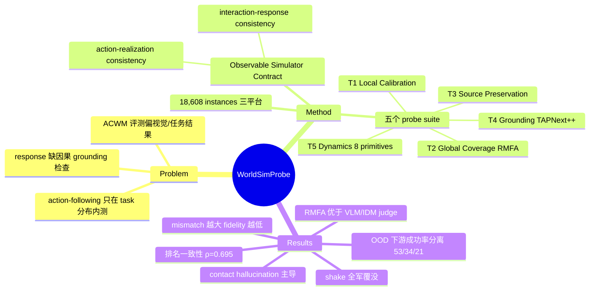

## Summary

提出 Observable Simulator Contract——action-conditioned world model（ACWM）要充当物理 simulator 必须满足的最小契约：supplied action 须诱导对应的 agent motion，environment response 须由 realized motion 物理支持。据此构建 WorldSimProbe：五个 controlled probe suite、18,608 个 evaluation instances（RoboTwin/ManiSkill/LIBERO），对 6 个开源 ACWM 做诊断式评测。结果揭示系统性的 action-realization 退化、以 contact hallucination 为主的 grounding 失败、以及跨模型共享的 interaction-dynamics 缺陷。

## Problem & Motivation

ACWM 被寄望为 embodied AI 提供可扩展的 predictive simulator（planning、policy evaluation、数据生成），但其定义性要求不是生成"plausible 的未来"，而是生成"supplied action 在当前场景下物理诱导的那个特定未来"。现有评测偏重视觉质量、任务结果或粗粒度的 rollout 级 responsiveness：action-following 通常只在 task-specific control 分布内评测，覆盖不了物理可行的 action 变异；也很少检验 environment response 是否被 supplied action 诱导的 motion 因果支持。后果是一个 rollout 可以"看起来 action-aware、physically plausible"，却既不忠实执行动作，interaction 也没有物理 grounding。论文的 Table 1 对比了 What-If World、WorldSimBench、MiraBench、RoboWM-Bench、WMBench、WorldArena、ACWM-Phys 等既有 benchmark，指出没有一个同时覆盖 local/global action 变异、source-diverse controls、causal probe 与 interaction 分解。

## Method

**Observable Simulator Contract（Sec 3.1）**：把 scene 分解为 agent state r_t 与 environment state e_t，rollout 分解为 realized agent motion 与 environment response，要求两个 linked consistency conditions 同时成立：
1. **Action-realization consistency**：r̂ ≈ Φ_R(r_t, e_t, a_{t:t+H})——生成的 agent motion 对应 supplied action；
2. **Interaction-response consistency**：ê ≈ Φ_E(e_t, r̂)——environment response 由 realized motion 与初始 environment state 物理支持。

Φ_R、Φ_E 是理想但不可直接观测的算子；benchmark 不要求访问它们，而是构造 controlled intervention 测其可观测后果。另有 feasible motion coverage 论证：物理 simulator 覆盖全部可执行轨迹分布 A_phys，而 ACWM 通常只在窄得多的 task 子集 A_task 上训练和评测——即使 A_task 含失败轨迹，也不构成 task 分布外的覆盖。

**五个 probe suite**（前三个测 action realization，后两个测 interaction）：
- **T1 Local Action Calibration**：从成功轨迹出发，对单个非 gripper action 维度在固定窗口施加小/大两档扰动（幅度取自 {0.0025,...,0.020} 原生单位），保持任务语义与成功结果不变。用 temporally aligned full-video MSE 计算模型内响应比 r 并与 simulator oracle 的 r* 对比，得 oracle-relative calibration score——刻意用比值消除各模型视觉误差 scale 的差异。
- **T2 Global Trajectory Coverage**：cross-task receiver–donor replay——把 donor task 的动作流在 receiver 场景中执行，simulator 重放提供 counterfactual reference。评测用 **RMFA（Robot-Masked Flow Alignment）**：RobotSeg 只在 simulator reference 上分割 robot arm（回避生成视频上的分割质量问题），在活动像素上比较 DPFlow 稠密光流的生成-参考误差。
- **T3 Action-Source Behavior Preservation**：同一 episode 下收集 expert、5 名 human teleoperator 模仿、π0.5 的 early（5k step）/late（50k step）checkpoint 轨迹，测模型是否保留 source-specific 执行风格（速度、平滑度、纠正行为），还是回退到 canonical execution。
- **T4 Interaction Grounding**：构造 simulator 验证过的 no-contact 场景（三种触发：distractor object / open-gripper appearance-induced false contact / spatial proximity 移位目标），用 TAPNext++ 追踪目标物体，位移超过阈值即判 contact hallucination。设计依据一个 audit：50 个观察到的 grounding failure 中 50/50 全是 false positive（hallucinate 而非 omit interaction）。
- **T5 Interaction Dynamics**：8 个 interaction primitive（push/pull/drag/rotate/shake/tap/knock-over/drop），primitive 标签经 simulator state 判据构造并由三人标注验证（1,864 条分层样本 100% 达成 ≥2 人共识）；用 Qwen3-VL-8B 作 deterministic VLM judge 判 realized primitive（该 judge 在 human-verified reference set 上与多数人工标签一致率 94–97%）。

**评测协议**：6 个模型 = 4 个 action-injection 架构（IRASim、Ctrl-World、BWM、DreamDojo）+ 2 个 unified action–video 架构（LingBot-VA、Cosmos-3-Nano）；每个模型在各 simulator 官方 split 上按其 released recipe 单独训练；每 instance 六模型共享相同 initial observation、native action trajectory、simulator seed、reference horizon 与三个 diffusion seeds，得分取三次生成平均。

## Key Results

- **总体（Table 2）**：跨平台排名一致性 mean pairwise Spearman ρ=0.695。LingBot-VA 在 RoboTwin（51.6）和 ManiSkill（63.5）Overall 领先，Ctrl-World 在 LIBERO（55.5）领先、其余平台第二。两类架构均横跨高低名次——架构本身不解释 simulator faithfulness。suite 级排名与 Overall 排名不一致（如 Interaction Grounding 上 Ctrl-World 在 RT/LB 领先），说明单一环节的强不代表整体 fidelity。
- **Action realization 系统性退化**：T2 中六模型 fidelity 随 receiver–donor motion mismatch 增大整体下降，平均 Spearman ρ=−0.433（该分析在 RoboTwin 上）——与模型在偏离熟悉轨迹时愈发依赖 scene/task-associated motion priors 的解释一致。T3 中全部六模型在 late-policy checkpoint 上比 early-policy 高 10.8–16.1 分（RoboTwin）：即便是 task-directed 轨迹，只要执行风格不熟悉，realization 就退化。
- **Local calibration**：模型响应普遍衰减（检测到 action 变化≠calibrated response scaling）。StackCube（ManiSkill）case study：LingBot-VA 的 action-failure threshold 为 0.374（simulator 阈值的 7.48 倍），Cosmos-3-Nano 为 1.78（35.6 倍），simulator boundary 为 0.05。
- **Interaction grounding（Table 3）**：三种 no-contact 触发的跨模型跨平台均分：distractor 75.0 > spatial proximity 54.5 > appearance-induced false contact 38.6——模型最挡不住"有接触视觉线索但无控制支持"的场景。
- **Interaction dynamics（Figure 6）**：primitive 间差异大于模型间差异：tap 最强（40.8–56.9），shake 几乎全灭（0.0–1.2），六模型均分区间仅 17.7–21.8——跨模型共享的 primitive-specific bias。人工对 model generations 的验证一致率 93–95%。
- **Benchmark validity（Table 4，750 个人工标注 rollouts）**：Diverse/OOD controls 上 RMFA 与 graded human ratings 的 ρ=0.750，显著高于 VLM 二元判断（agreement 0.450：VLM 对 91.7% 的样本判 positive action following，人类只判 42.2%）与 IDM（ρ=0.284，且在正确 simulator reference 上 IDM 误差对 OOD control source 即已升高 3.1×/5.6×，说明是 inverse-model decoding failure 而非 fidelity 信号）。
- **Downstream（Figure 7 / Table S7）**：单个 RoboTwin task 上用各 ACWM 生成的 synthetic data 训练 policy：standard 轨迹下成功率聚在 78–86%（六模型扩展后 78–89%）难以区分，OOD 轨迹下分离为 Ctrl-World 53% / BWM 34% / Cosmos-3-Nano 21%，与 WorldSimProbe 排序一致——success-oriented 训练评测会掩盖熟悉控制之外的 fidelity 差异。

## Evidence Ledger

| Claim ID | Claim | Type | Source locator | Evidence excerpt | Status |
|:--|:--|:--|:--|:--|:--|
| C1 | Observable Simulator Contract 由 action-realization 与 interaction-response 两个 linked consistency conditions 构成 | benchmark-setting | Sec 3.1 | "Simulator faithfulness requires two linked consistency conditions" | source-verified |
| C2 | 五个 suite：Local Calibration / Global Coverage / Source Preservation / Interaction Grounding / Interaction Dynamics；前三测 action realization 后两测 interaction | benchmark-setting | Sec 4, Sec 1 | "The first three characterize complementary aspects of action realization" | source-verified |
| C3 | 6 个开源 ACWM、18,608 instances（RT 5,498 / MS 6,610 / LB 6,500） | number | Table 2; Sec 5.1; Table S2 | "Table S2 reports the final 18,608 controlled evaluation instances" | source-verified |
| C4 | T2 fidelity 随 receiver–donor mismatch 增大下降，平均 Spearman ρ=−0.433（RoboTwin） | causal-mechanism | Sec 5.3; Fig 5(a) | "declines overall for all six models... average Spearman correlation of ρ=−0.433" | source-verified |
| C5 | T3 全部六模型 late-policy 比 early-policy 高 10.8–16.1 分（RoboTwin） | number | Sec 5.3; Fig 5(b) | "All six models score 10.8–16.1 points higher on late- than early-policy" | source-verified |
| C6 | T4 三触发均分：distractor 75.0 / proximity 54.5 / false contact 38.6 | number | Sec 5.4; Table 3 | "strongest for distractors (75.0) and proximity (54.5)... false contact (38.6)" | source-verified |
| C7 | T5 primitive 间差异>模型间：tap 40.8–56.9，shake 0.0–1.2，模型均分 17.7–21.8 | number | Sec 5.4; Fig 6 | "Tap is strongest (40.8–56.9)... shake is nearly absent (0.0–1.2)" | source-verified |
| C8 | 跨平台排名一致性 ρ=0.695；LingBot-VA 领先 RT/MS，Ctrl-World 领先 LB 且其余第二 | comparison | Sec 5.2; Table 2 | "mean pairwise Spearman ρ=0.695... LingBot-VA leads RoboTwin and ManiSkill" | source-verified |
| C9 | 750 人工标注 rollouts 上，Diverse/OOD：RMFA ρ=0.750 vs VLM 0.450 vs IDM 0.284；VLM 判 positive 91.7% vs 人类 42.2% | benchmark-setting | Sec 5.5; Table 4; App E | "VLM predicts positive action following for 91.7%... versus 42.2% by humans" | source-verified |
| C10 | T5 VLM judge 与多数人工标签一致率 94–97%（reference set）；model generations 上 93–95% | number | Sec 4 Task 5; Sec 5.4 | "the VLM judge agrees with the majority human label on 94–97%" | source-verified |
| C11 | Downstream：standard 78–86% 聚集，OOD 分离 53/34/21%，与 benchmark 排序一致；六模型扩展 standard 78–89%、OOD 21–53% | number | Sec 5.5; Fig 7; Table S7 | "standard trajectories clustered at 78–86%... at 53%, 34%, and 21%" | source-verified |
| C12 | Code and data available（项目页 evophys.com/WorldSimProbe）；arXiv license CC BY 4.0；附录为将来时 release 承诺 | license-code | Abstract; App A.5 | "Code and data available here... We will release the complete filtered test set" | source-verified |
| C13 | T4 设计依据 audit：50 个 grounding failure 中 50/50 均为 false positive（contact hallucination），无 false negative | benchmark-setting | App A.2 T4 | "all 50 (100%) were false positives... We observed no false negatives" | source-verified |
| C14 | StackCube：LingBot-VA failure threshold 0.374（7.48×），Cosmos-3-Nano 1.78（35.6×），simulator boundary 0.05 | number | Sec 5.3; Fig 4(b) | "LingBot-VA crosses at 0.374 (7.48× the simulator threshold)" | source-verified |
| C15 | 每 instance 六模型共享 observation/action/simulator seed/horizon/三个 diffusion seeds；各模型按 released recipe 在各平台官方 split 单独训练 | benchmark-setting | Sec 5.1; App A.4, C.1 | "all six ACWMs receive the same initial observation, action stream, simulator seed" | source-verified |

## Strengths & Weaknesses

**亮点**
- **Problem formulation 干净**：把"world model 评测"从输出打分（视觉质量/任务成功）改写为契约核查——契约两条件（action→motion、motion→response）可观测、可干预、可分环节定位失败。这比又一个 aggregate score 有信息量得多。
- **每个 intervention 都有 simulator-grounded reference**：所有测试实例先在 simulator 中完整执行并通过 validity 过滤（manifest 在模型推理前冻结），counterfactual 也有可执行的 ground truth，这是纯视频 benchmark 做不到的。
- **Evaluator 自身做了 validity 论证**：RMFA 对 robot-region corruption 的敏感性做了配对对照（drop 30.55 vs 背景对照 7.93）；并用 750 条人工标注证明 RMFA 在 OOD controls 上比 VLM judge 和 IDM 更贴近人类判断——顺带给出一个有普遍意义的方法论发现：**VLM rollout judge 在 OOD controls 上系统性偏乐观（91.7% vs 42.2%），IDM 的误差主要是 inverse-model decoding failure**。这对所有用 VLM/IDM 评 action-following 的 benchmark 是直接警告。
- **跨模型 shared failure pattern**：shake 全军覆没（0.0–1.2）、六模型 T5 均分区间仅 17.7–21.8、false-contact 触发普遍最弱——这些跨模型一致的结构性缺陷比排名本身更有价值，指向训练分布而非单个架构的问题。

**局限**
- **全部在 simulation 内**：单一外部视角、三个仿真平台，未触及 real-world rollouts、长 horizon 闭环、deformable/多物体交互（作者在 Conclusion 明示为 future work）。
- **测的是 in-domain fine-tune 后的 fidelity**：每个模型在各平台官方 split 上单独训练，结论不能直接推广到通用 pretrain ACWM 的 zero-shot 表现（推测：generalist 模型在此协议下的表现可能更差，但论文未测）。
- **关键机制性分析平台范围有限**：ρ=−0.433 与 late/early 10.8–16.1 两项均只在 RoboTwin 上报告；downstream study 只有一个 RoboTwin task，作者自称 controlled case study 而非普适验证。
- **T5 仍依赖 VLM judge**：虽有 94–97%（reference）/93–95%（generation）的人工一致率支撑，shake 等低分 primitive 的绝对数值仍部分受 judge 分辨力影响（推测，论文未单独 ablate per-primitive judge 误差）。
- **Code 可得性**：摘要称 code and data available，附录实际是将来时的 release 承诺；项目页与 GitHub repo（pxxq25/WorldSimProbe）已上线，但数据/脚本的完整性未核验。

## Mind Map

## Notes

- 与 vault 关联：[[2608-WorldExam]]（同月的 world model 评测，走 appearance→reactivity 轴，与本文的 simulator-contract 轴互补）；[[2604-dWorldEval]]、[[2607-GigaWorld1]]（本文 Related Work 中的 downstream-utility 评测路线，本文批评其 aggregate success 缺 failure localization）；[[2608-WorldProxy]]（world model as interactive proxy 的立场文，本文可视为其"proxy 何时可信"的诊断工具）。
- 最值得记住的跨论文信号：**VLM-as-judge 在 OOD controls 上的 91.7% vs 42.2% 偏乐观**——与 vault 中多篇依赖 VLM judge 的评测工作（如 rollout-level action-following 评测）直接相关，属于矛盾/修正类证据。
- 疑问：T1 的 oracle-relative ratio score 依赖 full-video MSE，对背景无关变化理论上仍有暴露；论文用 ratio + 共享 seed 缓解，但未给 T1 evaluator 的 corruption 对照（T2 的 RMFA 有）。
- 团队署名含 EvoPhys AI 与 JD Joy Future Academy，corresponding author 为北大 Shanghang Zhang。
