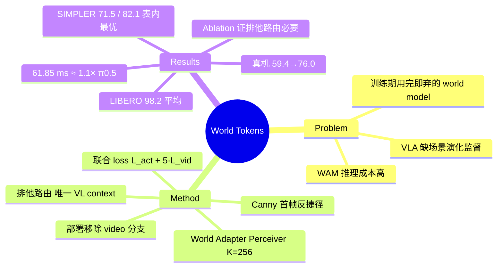

## Summary

提出 World Tokens：训练时把 VLM 特征经 World Adapter 压成 256 个 world tokens，同时作为 future-video denoiser 的条件和 action expert 的**唯一** visual-language context，使 world modeling 监督被迫塑造 policy 所用表征；部署时整个 video 分支移除，推理保持 VLA 级延迟（61.85 ms/chunk，π0.5 的 1.1× 内）。2B backbone 无 embodied pretraining 下取得其对比表内 SIMPLER 最优平均（WidowX 71.5% / GoogleRobot 82.1%）、LIBERO 98.2%，真机成功率 59.4%→76.0%。

## Problem & Motivation

VLA 模型闭环控制高效，但训练中缺乏对物理场景如何随动作演化的显式监督；world-action model（WAM）路线借预训练 video model 引入时空动态先验，代价是把 future generation 或大型 video backbone 留在控制回路里，推理成本大幅上升（对比表中 Cosmos Policy 610 ms、Fast-WAM 182 ms/chunk）。核心问题：能否让 world modeling 只在训练期改善控制表征，训练结束后把 world model 彻底移除？

关键难点不是"加一个辅助 video loss"——若 action expert 仍可绕开被监督的表征直接访问 VLM 特征，video 目标会与 action 目标竞争而非塑造它（ablation 中 w/ VLM bypass 变体证实了这一点）。

## Method

**架构（训练期）**：VLM（Qwen3-VL-2B-Instruct）→ World Adapter → K=256 world tokens → 同时条件化两条支路：
1. **Future-video denoiser**（Cosmos Predict2.5-2B，flow/denoising 目标预测未来视频 latent）；
2. **Action expert**（DiT-B，flow matching 生成 action chunk），world tokens 是其唯一的 visual-language context（排他路由）。

**World Adapter**：Perceiver resampler，L=12 blocks、K=256 learned queries、宽度 d=2048；每个 block 由 query 对 VLM 特征的 cross-attention、query 间 self-attention 和 FFN 组成，把变长 VLM 序列映射为定长 world tokens。

**训练目标**：L = L_act + λ_w·L_vid，λ_w=5。两条梯度路径在 world tokens 处汇合，预测性监督直接塑造 policy 消费的表征。

**Canny 首帧条件**：video denoiser 的首帧条件用 Canny edge map 而非 RGB，抑制颜色/纹理线索——否则 denoiser 依赖外观捷径，削弱对 world tokens 的依赖（ablation：RGB anchor 掉到 91.5%，甚至低于无 world modeling 的 baseline）。

**部署**：移除整个 video 分支（video encoder、denoiser 及相关投影），只保留 VLM + World Adapter + action expert；action 生成用 4 步 flow integration。World Adapter 带来约 10 ms 额外推理开销。

## Key Results

- **LIBERO**（四 suite 数据汇总训练单一 policy）：Spatial 99.6 / Object 98.8 / Goal 97.4 / Long 97.0，平均 **98.2%**，2B backbone 无 embodied pretraining；对比 π0.5 (2B, pretrained) 96.9%、StarVLA (4B) 97.8%、World2Act (3B) 98.1%。注意：**并非 LIBERO 最优**——WAM 类 Cosmos Policy (2B) 98.5%（610 ms）、DiT4DiT (2B) 98.6%（136 ms，H100 跨硬件数字，论文自述仅作量级参考）更高，本文卖点是延迟-性能权衡。
- **SIMPLER**（BridgeV2 + Fractal 联合训练）：WidowX 平均 **71.5%**（spoon 74.0 / carrot 85.0 / stacking 32.0 / eggplant 95.0），高于 Qwen-GR00T (4B) 65.3%、StarVLA (4B) 65.2%；GoogleRobot 平均 **82.1%**，高于 Qwen-GR00T 75.3%、SpatialVLA (3B) 75.1%、StarVLA 74.3%。论文声称为 "best reported averages on SIMPLER"（相对其对比表内 baseline）。
- **真机**：Galaxea R1 Pro 右臂 + 头戴 fisheye 视角，4 个抓放任务各 24 trials 共 96 次：整体 **76.0% vs 59.4%**（matched Qwen-GR00T baseline）；分任务 Lemon 70.8 vs 54.2、Strawberry 83.3 vs 58.3、Mango 75.0 vs 75.0、Banana 75.0 vs 50.0。
- **延迟**：61.85 ms/8-action chunk，π0.5（56.32 ms）的 1.1× 以内，同时 LIBERO 平均高 1.3 点。
- **Ablation（LIBERO-Long）**：full 97.0 > w/o wm（仅 adapter）95.0 > w/ VLM bypass 94.1 > FFN adapter 93.4 > Qwen-GR00T 92.8 > RGB anchor 91.5。排他路由与 Canny anchor 均为必要设计。
- **注意力分析**：World Tokens 空间注意力熵 3.29 bits vs w/o wm 的 5.22 bits（uniform=6 bits），且随任务阶段呈 approach→place 结构性转移。

## Evidence Ledger

| Claim ID | Claim | Type | Source locator | Evidence excerpt | Status |
|:--|:--|:--|:--|:--|:--|
| C1 | LIBERO 平均 98.2%（99.6/98.8/97.4/97.0），2B、无 embodied pretraining | number | Table 1 / Abstract / Sec 4.2 | "99.6 98.8 97.4 97.0 [Avg] 98.2"; "With a 2B backbone and no embodied action pretraining" | source-verified |
| C2 | 声称 SIMPLER "best reported averages"：WidowX 71.5、GoogleRobot 82.1 | sota-novelty | Abstract / Table 3 | "attains the best reported averages on SIMPLER" | source-verified |
| C3 | WidowX 71.5 > Qwen-GR00T 65.3 / StarVLA 65.2；GoogleRobot 82.1 > Qwen-GR00T 75.3 / SpatialVLA 75.1 / StarVLA 74.3 | comparison | Table 3 | "Qwen-GR00T (4B): 65.3, 75.3; StarVLA (4B): 65.2, 74.3; SpatialVLA (3B): 42.7, 75.1" | source-verified |
| C4 | R1 Pro 真机 96 trials，76.0% vs baseline 59.4%，分任务数字见 Key Results | number | Table 4 / real-world section | "right arm of a Galaxea R1 Pro… 24 trials per task, for 96 evaluation trials" | source-verified |
| C5 | 延迟 61.85 ms/chunk，π0.5 的 1.1× 内；WAM 对比 Cosmos Policy 610 / Fast-WAM 182 / DiT4DiT 136 ms | comparison | Table 1 / Sec 4.2 / Appendix B | "stays within 1.1× of π0.5 (61.85 vs. 56.32 ms per chunk)" | source-verified |
| C6 | Ablation（Long）：full 97.0 / w/o wm 95.0 / VLM bypass 94.1 / FFN 93.4 / RGB anchor 91.5 / Qwen-GR00T 92.8；排他路由与 Canny 条件是关键 | causal-mechanism | Table 2 / Sec 4.3 | "Qwen-GR00T 92.8, w/o wm 95.0, w/ VLM bypass 94.1, FFN adapter 93.4, RGB anchor 91.5, full 97.0" | source-verified |
| C7 | 组件与设置：Qwen3-VL-2B-Instruct + Cosmos Predict2.5-2B（仅训练）+ DiT-B；K=256、λ_w=5；LIBERO 四 suite 汇总、SIMPLER 用 BridgeV2+Fractal；部署移除 video 分支 | benchmark-setting | Sec 3.5 / Sec 4.1 | "λ_w=5"; "pool the training data from all four suites"; "BridgeV2 and Fractal" | source-verified |
| C8 | 论文未提供公开代码或模型链接 | license-code | 全文 | 全文无 code release/project page；唯一 "code" 指 "released code and weights of the three baselines" | source-verified |
| C9 | 空间注意力熵 3.29 vs 5.22 bits（uniform 6 bits），注意力随任务阶段呈 approach–place 转移 | causal-mechanism | Sec 4.3 / Figure 3 / Appendix D | "averages 3.29 bits versus 5.22 for w/o wm (uniform is log₂64=6)" | source-verified |

> 核查备注：C7 初稿曾从摘要式抓取误录 λ_w=0.5，独立 verifier 以原文 grep 判 contradicted 并纠正为 λ_w=5，上表为修正后已核实版本。C2 的 "best reported" 仅相对论文对比表内 baseline 成立，非全领域普查。

## Strengths & Weaknesses

**亮点**
- **机制清晰的信息瓶颈设计**：与"加辅助 video loss"的常见做法不同，本文的核心贡献是**排他路由**——world tokens 是 action expert 唯一的 visual-language 入口，预测性监督无处可逃、必须写进 policy 表征。VLM bypass ablation（94.1 vs 97.0）直接证明：没有排他性时 video 目标反而与 action 目标竞争。这是对 "world model 作为训练信号为何 work / 何时 break" 的一条可检验机制解释。
- **Canny anchor 是聪明的反捷径设计**：RGB 首帧让 denoiser 走外观捷径后成绩（91.5）甚至低于完全不做 world modeling（95.0）——辅助任务设计不当会净伤害，这个负结果比主结果更有信息量。
- **部署零 video 开销**：只留 ~10 ms adapter 开销，延迟与 π0.5 同量级，正面回应了 WAM 路线最大的落地障碍。
- 附带注意力熵的表征分析，给"world modeling 改变了什么"提供了超出成功率的证据。

**局限与边界**
- **训练成本自认可观**：video denoiser 联合训练的开销未量化对比；Canny anchor 是 hand-designed（作者自己列为 limitation）。
- **"best reported" 的适用边界**：仅相对其表内 baseline；SIMPLER 上没有与保留 video 分支的 WAM 方法直接对比（WAM 对比只在 LIBERO），因此"训练期 world modeling 是否损失了推理期 world modeling 的上限"未被回答。
- LIBERO 上并非最优（DiT4DiT 98.6、Cosmos Policy 98.5 更高），且 DiT4DiT 延迟为跨硬件数字，延迟-性能 Pareto 论证不完全干净。
- 真机仅 4 个同构抓放任务、单平台、96 trials；WidowX 的 block-stacking 仅 32.0%，长程/精细任务的边界未探。
- 无代码发布，K=256、λ_w=5 等关键超参无 sweep，复现与敏感性未知。

## Mind Map

## Notes

- 同批消化的 [[2608-SimWAM]]（驾驶域，video 分支训练后丢弃）与 [[2608-JEPAWAM]]（V-JEPA latent 空间 WAM）据 run 上下文同属 "world model 只当训练信号" 路线。本文可核实的差异点：它不只把 world modeling 当辅助 loss，而是用排他路由强制监督流经 policy 表征，并用 VLM bypass ablation 论证了非排他版本会退化——值得在三篇齐后对比各家如何处理 video/action 目标竞争问题。
- 待验证的问题：Canny anchor 本质是人工选择的 invariance prior（保结构、弃外观）；若换成 learned bottleneck（如 JEPA 式 latent 目标）是否能同时去掉 hand-design 并保住反捷径效果？这与作者自列的 future work 方向一致。
- SIMPLER stacking 32.0% 提示 world tokens 对接触密集/多物体依赖任务帮助有限，值得跟踪后续工作是否在此类任务上检验 training-time world modeling 的边界。
