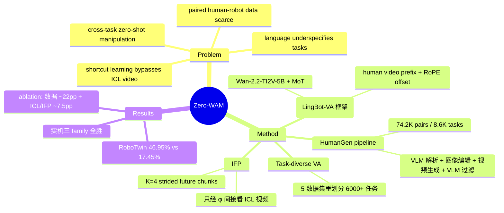

## Summary

Zero-WAM 把 zero-shot cross-task manipulation 重述为 in-context 任务规约问题：以 human video 作为任务说明，让 causal video-action model（LingBot-VA 框架、Wan-2.2-TI2V-5B 底座）按视频提示自回归预测未来 robot video 与可执行 action。数据侧用生成式 pipeline 把 task-level 采样的 robot 轨迹自动转成语义匹配的 human video（HumanGen，74.2K 对 / 8.6K 任务），训练侧用 in-context future chunk prediction（IFP）辅助目标抑制"只靠 robot history 外推"的 shortcut。RoboTwin 2.0 七个 unseen 任务平均成功率 46.95%，比 LingBot-VA 高 29.50 pp——但 ablation 显示其中约 22 pp 来自 task-balanced 数据重采样本身（见 Weaknesses）。

## Problem & Motivation

Zero-shot cross-task generalization（不采集对应 robot 数据、不更新参数就执行 unseen 任务）是通用操作策略的核心难题。现有 VLA 与 video-action 模型几乎都以 language 为任务接口，但 language underspecifies manipulation：空间约束、中间状态、时序结构难以言明，也不提供场景应如何演化的直接视觉证据。作者借 LLM 的 in-context learning 视角，主张 manipulation 的自然任务规约是 human demonstration video——直接呈现期望的视觉状态变化与时间演化。

规模化利用 human video 有两大障碍：(1) task-rich 的 human-robot paired 数据稀缺，人工采集昂贵（RH20T 也只有 147 个任务类）；(2) teacher forcing 训练下，seen task 的下一 robot video chunk 往往可从 robot history + text 直接外推，模型学会绕过 in-context 视频（shortcut learning），到 unseen task 恰恰需要视频信号时反而不用它。

## Method

**数据：Task-diverse VA + HumanGen。**
- **Task-diverse VA**：把 AgiBot、InternData-A1、Open-X-Embodiment、RoboCOIN、RoboMIND 五个公开数据集（与 LingBot-VA 预训练同源）按"操作动作 × 物体"重划分为 >6,000 个任务，按任务限额采样，每 epoch 约 400K 轨迹——避免预训练被少数任务的重复遥操作轨迹主导。
- **In-context human video generation pipeline**：对 task 采样的 robot 视频，VLM（Gemini 3.1 Pro / Qwen3.6-Plus）做任务解析并产出 image-editing prompt → 图像编辑模型（Nano Banana 2 / Qwen-Image-2.0）把 robot 首帧改写成人类操作场景初帧 → VLM 生成视频 prompt → 视频生成模型（Wan 2.7 / Kling AI 3.0）合成人类操作视频 → VLM 按任务语义保持与物理合理性过滤。生成视频刻意注入背景 / 视角 / 环境风格 / 物体实例 / 摆位变化，逼模型学 task-level 对应而非逐帧动作复制。
- **HumanGen 四个子集**：Pre-train ICL External（5,062 任务 / 41,188 对，>45 embodiments，刻意加大 human-robot 视觉错位）、Pre-train ICL In-house（3,522 任务 / 30,247 对，更视觉对齐）、Simulation ICL（RoboTwin 50 任务 × 50 样本）、Real-world ICL（252 对，实采）。合计 74.2K 对 / 8.6K 任务。

**模型：causal video-action + human video prefix。**
- 沿 LingBot-VA 框架：p(x^{i+1}, a^{i+1} | x^{≤i}, a^{≤i}, c) 分解为 video prediction + inverse-dynamics action decoding，flow matching 训练；Mixture-of-Transformers 设计（video / action 分参数、共享 attention），由 Wan-2.2-TI2V-5B 改造（hidden 3072、video 分支 30 层）。
- human video **h 作为 prefix memory** 前置，仅 video Transformer attend 到它；action Transformer 不直接看 h——任务语义先被吸收进预测的下一 robot video chunk，action 解码保持标准 inverse dynamics（action loss 始终只 condition 在 language 上）。human video latent 用 height 轴 RoPE offset（Δ_H=32 > H_mv）与 robot latent 区分坐标域，避免同一 VAE latent 空间内的表征混淆。
- **IFP（in-context future chunk prediction）**：训练期附加 K=4 个 stride s=2 的未来 chunk 去噪模块（各为单层 video Transformer 拷贝，从末层初始化），只 condition 在主干多层中间特征融合出的 φ^{i+1} 上、**不直接看 h**——若直接给 h，辅助分支会自学一个 human-video-conditioned 预测器而绕过主干；推理时 IFP 模块全部移除，故增益必须体现在主干表征里。
- 训练：Task-diverse VA（language 条件）与 HumanGen（{h, ℓ} 条件 + IFP loss）按 1:5 采样；ICL 样本把 language dropout 从 0.1 提到 0.4，逼模型依赖视频。预训练 15,360 GPU hours。推理支持 language-only 与 ICL 两模式（video CFG 5）。

## Key Results

- **RoboTwin 2.0 仿真**（43/7 task-level split，每 unseen 任务 100 closed-loop rollouts × 3 seeds）：Zero-WAM 平均 46.95%±0.72，vs LingBot-VA 17.45%、WAN-Action（同底座、只用 seen 任务训练）10.98%，即 +29.50 / +35.97 pp；七个任务全胜，place empty cup 达 84.87%，stack blocks three 是唯一非零成功的方法（9.00%）。
- **实机 bimanual Franka**（每 task family 30 trials）：object-to-container placement 53.3% vs 43.3%；three-object sequential manipulation 33.3% vs 10.0%；two-table-leg insertion 16.7% vs 0.0%。注意接口不对等：Zero-WAM 只给 human video（无 language），LingBot-VA 给详细文本指令。
- **Ablation 三分解**：(1) 只用 43 个 seen 任务训练时，加 human-video ICL 指令把平均从 10.98%（WAN-Action）提到 36.36%；(2) text-only 变体（预训练中 mask 掉 human video 条件）达 39.44%，超 LingBot-VA 21.99 pp——task-balanced 数据重采样单独贡献巨大；(3) IFP 把平均从 28.55% 提到 46.95%，并把 stack blocks three 从 0% 破到 9%。
- **可比性说明**：stamp seal 与 move stapler to pad 两个任务的成功判据被作者修改（对所有方法一致），数字不可与 RoboTwin 2.0 官方设定直接比。

## Evidence Ledger

| Claim ID | Claim | Type | Source locator | Evidence excerpt | Status |
|:--|:--|:--|:--|:--|:--|
| C1 | 七个 unseen RoboTwin 任务平均 46.95%，vs LingBot-VA 17.45% / WAN-Action 10.98%（+29.50 / +35.97 pp） | number | Sec 4.2, Table 2 | "average success rate of 46.95%, compared with 17.45% for LingBot-VA and 10.98% for WAN-Action" | source-verified |
| C2 | HumanGen 含 74.2K human-robot ICL 对、8.6K 任务，自动生成而非人工采集 | number | Abstract; Sec 2.3, Table 1 | "yielding HumanGen, a dataset of 74.2K human-robot ICL pairs across 8.6K tasks" | source-verified |
| C3 | 43/7 task-level split；每 unseen 任务 100 rollouts × 3 seeds；2 个任务判据修改且对所有方法一致 | benchmark-setting | Sec 4.2 + footnote 1 | "43 tasks are used for post-training and 7 tasks are reserved … same modified criteria to all methods" | source-verified |
| C4 | IFP 把七任务平均从 28.55% 提至 46.95%，stack blocks three 0%→9% | causal-mechanism | Sec 4.4, Fig 6 right | "adding IFP improves the seven-task average from 28.55% to 46.95%" | source-verified |
| C5 | 仅用 43 seen 任务训练时，human-video ICL 把平均从 10.98% 提至 36.36% | number | Sec 4.4, Fig 5 | "adding human video instructions raises the average success rate from 10.98% to 36.36%" | source-verified |
| C6 | text-only 变体（mask 掉 human video）达 39.44%，超 LingBot-VA 21.99 pp | number | Sec 4.4, Fig 6 left | "text-only Zero-WAM variant achieves a 39.44% seven-task average, outperforming LingBot-VA by 21.99 percentage points" | source-verified |
| C7 | 实机 30 trials/family：53.3 vs 43.3、33.3 vs 10.0、16.7 vs 0.0；Zero-WAM 仅视频条件、LingBot-VA 用详细文本 | number | Sec 4.3, Table 3 | "conditions on the human video instruction alone … LingBot-VA baseline is provided with detailed textual task descriptions" | source-verified |
| C8 | Wan-2.2-TI2V-5B 底座 + MoT（d=3072、video 30 层）；IFP K=4、s=2、推理时移除；预训练 15,360 GPU hours | benchmark-setting | Sec 3.1/3.3/4.1 | "we instantiate Zero-WAM from Wan-2.2-TI2V-5B … pre-training takes 15,360 GPU hours" | source-verified |
| C9 | pipeline 链：VLM（Gemini 3.1 Pro / Qwen3.6-Plus）→ 图像编辑（Nano Banana 2 / Qwen-Image-2.0）→ 视频生成（Wan 2.7 / Kling AI 3.0）→ VLM 过滤 | benchmark-setting | Sec 2.2 | "(Gemini 3.1 Pro or Qwen3.6-Plus) … (Nano Banana 2 or Qwen-Image-2.0) … (Wan 2.7 or Kling AI 3.0)" | source-verified |
| C10 | 论文 Table 1 中 HumanGen 是唯一 multi-source、auto-generated 数据集，>45 embodiments、任务覆盖最广（8.6K vs RH20T 147） | comparison | Table 1, Sec 2.3 | "HumanGen (ours) ✓ >45 ego & third auto-generated ✓ 74.2K 8.6K" | source-verified |
| C11 | 五个公开数据集重划分为 >6,000 任务、每 epoch 采样约 400K 轨迹 | number | Sec 2.1 | "we sample more than 6,000 tasks and approximately 400K corresponding robot trajectories in each training epoch" | source-verified |
| C12 | action Transformer 不直接 attend human video；任务语义只经预测的下一 robot video chunk 传导，action loss 只 condition 在 language | causal-mechanism | Sec 3.2/3.4 | "task semantics conveyed by h are already absorbed into the predicted next robot video chunk" | source-verified |

## Strengths & Weaknesses

**亮点**
- 把"paired human-robot 数据稀缺"翻转成数据合成问题：human video 侧完全不需要真人采集，规模随 robot 数据走，8.6K 任务覆盖约为人工采集数据集（RH20T 147 任务）的 60 倍。相比 AGNOSTOS 测试时需提供 unseen-task robot 轨迹的做法，部署时只需一段 human video，成本更低。
- IFP 有明确机制假设：shortcut 是 teacher-forcing next-chunk prediction 的结构性病灶；"辅助模块只经主干特征 φ 间接接触 ICL 视频"的设计理由讲得清楚（防辅助分支旁路主干），且 ablation 增益大（+18.4 pp）、推理零开销。
- ablation 把三个因素（ICL 接口、task-balanced 数据、IFP）分别归因，拆解干净，少见。

**局限（批判性阅读）**
- **主表增益的大头来自数据而非 ICL 接口**（由已验证的 ablation 数字推算）：text-only 变体已达 39.44%，即对 LingBot-VA 的 +29.50 pp 中约 22 pp 来自 task-balanced 重采样与预训练数据差异，human-video ICL + IFP 在其上净增约 7.5 pp。论文叙事以 ICL 为中心，但主对比同时改了数据与接口。
- **仿真评测的 human video prompt 是同一 pipeline 生成的**（"the task is specified by a generated human video instruction"），与训练分布同源；真人视频作为 prompt 的证据只有实机每 family 30 trials 的小样本，生成视频→真人视频的 domain gap 未被系统量化。
- 实机对比接口不对等（human video vs language），衡量的是"接口+模型"整体而非同接口下的模型差异；论文在 Table 3 caption 有如实标注，但不应解读为同条件胜出。
- "Open-ended" 措辞强于证据：7 个 unseen 任务与 43 个训练任务同属 RoboTwin 任务家族（同分布的桌面双臂操作）；长时程 stack blocks three 仅 9%；作者自己也把范围限定在 stationary tabletop。
- pipeline 依赖多个闭源商用模型（Gemini 3.1 Pro、Nano Banana 2、Kling AI 3.0 等），VLM 过滤的通过率与生成数据质量未量化报告，复现成本与数据 license 存疑。

## Mind Map

## Notes

- **上游谱系**：直接建在 LingBot-VA 系（Causal World Modeling for Robot Control / Native Video-Action Pretraining）之上，数据同源、框架同构；IFP 借鉴 Next Forcing 的 multi-chunk prediction。与 [[2602-DreamZero]]（WAM as zero-shot policy，处理 visual-domain shift 而非 cross-task）构成 WAM zero-shot 两条线；与 WAM-TTT / RoboTTT 的 test-time training 路线相对：Zero-WAM 把泛化成本移到预训练数据构造，测试时零适应。vault 同月笔记 [[2608-JEPAWAM]]、[[2608-GameWAM]]、[[2606-WALLWM]] 可对照 WAM 谱系。
- **值得追问**：(1) 真人 in-the-wild 视频（非 pipeline 生成分布）作 prompt 的成功率衰减多少？(2) VLM 过滤通过率与失败模式未报告——生成数据质量的下界在哪里？(3) 目前是 one-shot（单视频）ICL，多视频 few-shot 是否有增益？(4) "数据贡献 22 pp vs 接口贡献 7.5 pp"的分解提示：task-balanced 重采样可能是被低估的普适技巧，值得在其他 WAM/VLA 预训练上单独验证。
- repo_candidate: https://github.com/robbyant-research/Zero-WAM（贡献含数据 pipeline 与训练基建，可考虑 repo-digest）
