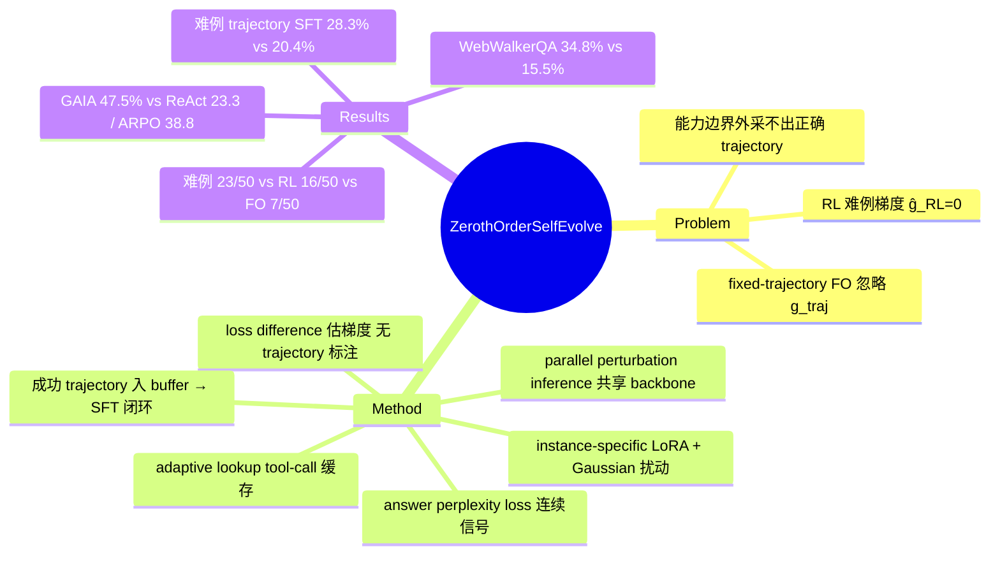

## Summary

针对 self-evolving LLM agent 在能力边界外的 difficult examples 上采不出正确 trajectory、学习信号归零的问题，提出零阶（zeroth-order, ZO）自进化框架：对 instance-specific LoRA 参数加 Gaussian 扰动，用 perturbed 与 baseline 策略在 answer perplexity loss 上的差分估计梯度，无需任何 trajectory 标注就把 agent 推到边界外找到成功 trajectory，再将其入 buffer 做 SFT 形成闭环。GAIA 上 Qwen-3-8B backbone 达 47.5% 平均准确率，显著超过 ReAct（23.3%）与 ARPO（38.8%）。

## Problem & Motivation

Self-evolving agent 的主流路线（rejection sampling / RL）依赖 agent 自己采样出正确 trajectory 作为学习信号，因此天然被限制在模型当前能力边界内："On difficult examples, the agents cannot sample correct trajectories for further improvement."

论文把 self-evolution 目标的梯度分解为两项（Eq. 5）：**g_fixed**（把 trajectory 当固定输入的显式 answer-loss 梯度）与 **g_traj**（参数变化如何重塑 trajectory 分布）。由此给出两类现有方法的失效机制：

- **Fixed-trajectory first-order 方法**只算 g_fixed（Eq. 6），不考虑参数变化对后续 reasoning、query formulation、tool selection 的影响；
- **RL 方法**在所有采样 trajectory 都失败、reward 同为常数 b 时，估计梯度 ĝ_RL=0（Eq. 7 之后）——难例上梯度信号完全消失。

这是一个机制层面的诊断：问题不在数据不够，而在"用自己采样的成功轨迹学习"这一范式在边界外没有信号。

## Method

整体是三阶段闭环：**ZO 优化发现 trajectory → 成功/低 answer-loss trajectory 入 buffer → SFT 更新模型**。

**1. Instance-specific LoRA 的 ZO 梯度估计**（Eq. 10, 14）。对每个难例 (q_i, y_i) 挂一个专属 LoRA (A_i, B_i)，采 K 组 Gaussian 扰动：θ_{i,k} = θ + (B_i+σε^B)(A_i+σε^A)。用扰动策略与 baseline 策略各跑一次 agent rollout，以 loss 差分估计 A、B 的梯度：ĝ(A_i) = (1/BK)ΣΣ[(ℓ⁺_{i,k}−ℓ⁰_i)/σ]·ε^A_{i,k}（B 对称）。整个过程只需前向 rollout + loss 计算，**不需要正确 trajectory 标注**——这正是它能越过能力边界的原因：ZO 在参数空间做随机搜索，不依赖当前策略能采出成功样本。

**2. Parallel perturbation inference**（Sec 3.3）。利用 LoRA 低秩结构：backbone 输出 θx 只算一次共享，K 个扰动分支只并行计算轻量的 (B+ε^B)(A+ε^A)x。K=4 时单例推理时间 656s→305s（降 53.5%）。

**3. Adaptive lookup**（Sec 3.4）。多次扰动 rollout 会重复调用相似 tool call。维护共享的 tool-call 结果池：search 用语义 query 匹配，webpage visit 用 URL+visit goal 的更严格匹配，未命中才真正外部执行并注册。K=4、30 轮优化下 150 次 search 命中 + 84 次 visit 命中省约 1290 秒。

**4. Answer perplexity loss**（Eq. 16-17）。二值 reward 或相似度 loss 不连续，导致 ZO 差分噪声大。改用只在 ground-truth answer tokens 上计算的 token-normalized NLL：ℓ_ans = −(1/M)Σ log π_θ(y_j|q,τ_{∖ans},y_{<j})。"A lower loss means that the current trajectory makes the reference answer less surprising to the model"——即使 rollout 最终答案错误，只要 trajectory 检索到支持性证据就有连续的下降信号。

## Key Results

- **主结果（Table 1，Qwen-3-8B，controlled setting：同 backbone family、同 search API/webpage parser/decoding/tool budget）**：GAIA 平均 47.5%（L1 56.4 / L2 42.3 / L3 41.6），ReAct baseline 23.3%；WebWalkerQA 平均 34.8% vs ReAct 15.5%。paper-reported 行对比：WebDancer（Qwen-2.5-7B）31.0%、SimpleDeepSearcher 36.9%、ARPO（Qwen-3-8B）38.8%。
- **难例设定（Sec 4.1）**：304 个 training examples 中 baseline Pass@1 只答对 67 个（22.0%），其余 237 个即 difficult examples。
- **边界外发现能力（Table 6）**：50 个难例上 fixed-trajectory first-order 解出 7 个、RL 解出 16 个、ZO 解出 23 个——支持"ZO 能拿到 RL 拿不到的信号"，但也说明仍有过半难例未解。
- **难例 trajectory 的训练价值（Table 2）**：用 ZO 发现的 trajectory 做 SFT 得 GAIA 平均 28.3%（42.8/24.2/10.0），用 initial trajectories 训练仅 20.4%。
- **Loss ablation（Sec 4.3.1, Fig 4）**：hard examples 上 BERT-based loss 与 LLM-as-a-Judge loss 不下降，answer perplexity loss 正常收敛。
- 泛化性在 BrowseComp-en/zh 上测试（具体数字本笔记未逐项核对）。

## Evidence Ledger

| Claim ID | Claim | Type | Source locator | Evidence excerpt | Status |
|:--|:--|:--|:--|:--|:--|
| C1 | 现有方法在难例上采不出正确 trajectory；RL 中所有 trajectory 同 reward 时 ĝ_RL=0 | causal-mechanism | Intro + Sec 3.1 (after Eq. 7) | "if all sampled trajectories fail and receive the same correctness reward R(τᵢ)=b, resulting in ĝ_RL=0" | source-verified |
| C2 | 扰动 instance-specific LoRA，用 loss difference 估计梯度，无 trajectory 标注 | causal-mechanism | Sec 3.2, Eq. 10 & 14 | "θᵢ,ₖᵖ = θ + (Bᵢ+σεᵢ,ₖᴮ)(Aᵢ+σεᵢ,ₖᴬ)"; "requires no annotated trajectories" | source-verified |
| C3 | parallel perturbation inference 共享 backbone 计算；K=2: 328s→232s，K=4: 656s→305s (53.5%) | number | Sec 3.3 + Table 12 | "compute the backbone output θx once and share it" | source-verified |
| C4 | adaptive lookup 共享 tool-call 池；K=4、30 rounds 下 150 search + 84 visit 命中省约 1290s | number | Sec 3.4 + Table 13 | "shared pool of recent tool calls... semantic query matching... stricter matching based on the URL and visit goal" | source-verified |
| C5 | answer perplexity loss 为 answer tokens 上的 token-normalized NLL；难例上 BERT/LLM-Judge loss 不收敛而该 loss 收敛 | causal-mechanism | Eq. 16-17 + Sec 4.3.1 Fig 4(b) | "LLM-as-a-Judge loss and BERT-based loss fail to decrease, whereas our loss still converges" | source-verified |
| C6 | GAIA（Qwen-3-8B）Ours 47.5% avg vs ReAct 23.3%、WebDancer 31.0%、SimpleDeepSearcher 36.9%、ARPO 38.8% | number/comparison | Table 1 (Qwen-3-8B block) | "Ours-SFT: 56.4/42.3/41.6, Avg 47.5" | source-verified |
| C7 | WebWalkerQA 平均 34.8% vs ReAct 15.5% | number | Table 1 | "Ours-SFT Avg 34.8; ReAct Avg 15.5" | source-verified |
| C8 | 304 个训练例中 baseline Pass@1 仅对 67（22.0%），难例为其余 237 | benchmark-setting | Sec 4.1 | "correctly answers only 67 examples under Pass@1 and fails on the remaining 237" | source-verified |
| C9 | 50 难例上 first-order 7/50、RL 16/50、ZO 23/50 | number/comparison | Table 6 + Sec 4.3 | "RL solves 16... Our method solves 23" | source-verified |
| C10 | 代码开源于 github.com/hidk1911/ZOForLLMAgents，仓库可访问（HTTP 200） | license-code | Abstract + GitHub 实测 | "The code and released artifacts are available at" | source-verified |
| C11 | 难例 trajectory SFT：GAIA 28.3% avg（42.8/24.2/10.0）vs initial trajectories 20.4% | number | Table 2 | "Ours: 42.8/24.2/10.0, Avg 28.3; initial: 38.1/13.6/5.0, Avg 20.4" | source-verified |
| C12 | backbone 为 Qwen-3-4B/8B；controlled 对比同系统配置；成功 trajectory 入 buffer 供 SFT 闭环 | benchmark-setting | Sec 4.1 + Sec 3 | "same backbone family and the same system configuration, including the search API, webpage parser, decoding setting, and tool budget" | source-verified |

## Strengths & Weaknesses

**亮点**：
- **问对了问题**。多数 self-evolving 工作在"怎么筛更好的自采样 trajectory"上做文章，本文指出范式本身在能力边界外信号归零（RL 难例梯度为 0 有明确推导），然后换了信号来源——参数空间随机搜索不依赖当前策略能采出成功样本。这是机制层面的贡献，不是 +0.3% 式改进。
- **Answer perplexity loss 是关键使能件**。把不连续的 correctness reward 换成 answer tokens 上的连续 NLL，使失败 rollout 也提供梯度信号；ablation 显示 BERT/LLM-Judge 替代 loss 在难例上直接失效，说明这不是可有可无的选择。
- 工程配套（parallel perturbation 共享 backbone、tool-call 缓存）让 per-instance ZO 的成本降到可用区间，且有具体计时数据支撑。

**局限与边界**：
- **"无标注"只对 trajectory 成立**：方法必须有 ground-truth answer y 才能算 answer perplexity loss，因此只适用于有 gold answer 的 QA 型任务；对无参考答案的开放任务（如真实 GUI 操作）不直接可用。
- **成本仍高**：每个难例独立跑 30 轮 ZO 优化、每轮 K 次 rollout（K=4 优化后仍约 305s/轮量级），扩展到万级训练集的可行性存疑（推测，论文未讨论大规模 scaling）。
- **信号可能被捷径利用**（推测）：answer perplexity 下降不必然意味着 trajectory 包含正确推理——检索到含答案字符串的页面即可压低 loss；buffer 同时接纳"sufficiently low answer loss"的非正确 trajectory，可能引入 false positive 监督。论文未报告对此的检查。
- 与 WebDancer / SimpleDeepSearcher 的对比是 paper-reported 数字且 backbone 不同（Qwen-2.5-7B vs Qwen-3-8B），跨行比较需谨慎；controlled 对比只覆盖 ReAct 与 ARPO 等。
- 23/50 说明边界外仍有过半难例解不了；作者自述未扩展到 multimodal agent。

**影响**：为 self-evolving agent 提供了 rejection sampling / RL 之外的第三条信号来源（参数空间 ZO 搜索 + 连续 answer likelihood surrogate），与 MeZO 一脉的 ZO fine-tuning 在 agent 场景合流。对 deep research 方向，难例 trajectory 的自动发现比单纯堆数据管线更接近问题本质。

## Mind Map

## Notes

- 与 vault 中 self-evolving 方向的关联：[[2507-SelfEvolvingAgentsSurvey]] 与 [[2508-SelfEvolvingAIAgentsSurvey]] 均把 self-evolution 的信号来源归为自采样 trajectory 的筛选/加权，本文的"参数空间 ZO 搜索"是这两份 survey taxonomy 之外的新信号来源，值得在 survey refresh 时作为矛盾/扩展点并入。
- 开放疑问：ZO 优化出的 instance-specific LoRA 在 SFT 后是否被丢弃？若每个难例的 LoRA 不共享，发现的"能力"完全靠 SFT 蒸馏回主模型，蒸馏损失有多大论文未量化。
- 可与 GUI agent 场景对照：GUI 任务多数无 gold answer（只有环境 reward），answer perplexity loss 不可直接迁移——这是把该范式搬到 computer-use 的主要 gap。
