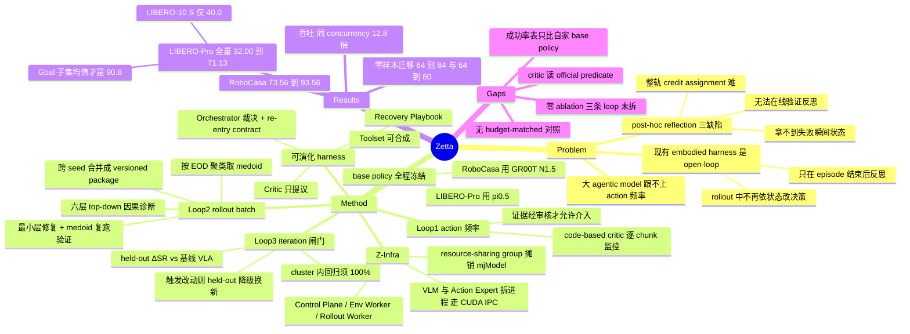

## Summary

Zetta 在 base VLA 权重全程冻结的条件下把闭环下沉到 action frequency：code-based runtime critic 逐 action chunk 产出结构化 proposal，由 Orchestrator 裁决是否切出 VLA 执行 recovery skill，并按 re-entry contract 交还控制权；rollout-batch 层做失败聚类与逐层因果诊断生成候选 critic/recovery，iteration 层用 cluster 全通过 + held-out ΔSR 双闸门决定是否入 skill memory。配套的 Z-Infra 把 agent 逻辑与环境/模型 worker 池解耦，把 rollout 吞吐从 1.72 提到 35.1 episodes/min。RoboCasa 18 任务 macro-average 从 73.56% 升到 93.56%，LIBERO-Pro 全部 40 个 task-setting pair 从 32.00% 升到 71.13%（摘要标的 90.8% 只是 Goal 两个 setting 的均值）。

## Problem & Motivation

作者的判断是：用 LLM 编排 policy/tool/code 这条 embodied agent 路线并没有真的实现"从自我探索中学习"。现有 harness 一旦开始 rollout 就不再根据环境状态改决策——沿固定 skill 或预规划轨迹执行，只在 episode 结束后反思。

限制的根源被归到频率：物理任务要求决策耦合到毫秒级变化的机器人-环境状态，而大 agentic model 达不到这个频率，所以反思只能落在 episode/trajectory 层。论文列了 post-hoc reflection 的三个结构性缺陷：无法在线试另一个动作来验证反思是否正确、整条轨迹的 credit assignment 困难、事后分析拿不到失败瞬间的精确状态。结果是总结出的经验难以复用。

Zetta 的切入点不是让大模型跑得更快，而是让大模型在离线阶段生成"能在 action frequency 上跑的代码"：critic 是代码函数不是模型调用，频率问题因此消失，agentic model 被整体移出在线关键路径。

## Method

### 固定件与可演化件

不参与演化的有两个：frozen action policy π（LIBERO-Pro 用 π0.5，RoboCasa 用 GR00T N1.5）与 Orchestrator Agent A_O（一个 multimodal reasoning model，负责审核证据、批准 mode 切换，决策逻辑在演化中不变）。

可演化的 harness H = {Critic C, Recovery Playbook R, Toolset T}：

- **Critic**：高频监控函数集合，扫轨迹 τ_{0:t} 产出 proposal P_t = ⟨e_t, σ̂_t⟩，e_t 是可审计的失败证据（碰撞、进度停滞），σ̂_t 是建议执行模式。critic 只提议，不执行动作也不宣布成功。
- **Authority hierarchy**：最终模式 σ_t = A_O(P_t, R, T, K) 由 Orchestrator 裁决，K 是任务知识（milestone、成功判据、环境约束）。critic 频率再高，介入也必须经证据审核。
- **VLA Re-entry Contract**：Ψ(s_t) = 1(FailureCleared) ∧ 1(Stability(s_t) > γ)。原始失败证据被清除、且接触扭矩振荡与抓取力进入平衡态，才把控制权交回 VLA，防止 recovery 后立刻二次失败。
- **Toolset**：可被生成、实例化、选择、细化的可执行工具（planner、grasp detector、recovery module 等），演化的是工具本身而不只是既有工具的参数。

### 三条 timescale-separated loop

**Loop 1（action 频率）— Critic-Governed Action Loop**。frozen policy 执行，critic 逐 action chunk 监控并提议，Orchestrator 批准后切入 recovery，满足 re-entry contract 后切回。Phase I 的采样阶段也在这一层：在 50 个 development seed 上跑纯 VLA 建 baseline，显式区分 infrastructure failure 与 policy failure（前者用原逻辑 seed 强制重跑，避免统计分布因非策略因素漂移），产出 successful reference index 与 failed-seed manifest，并对每条失败轨迹算 First Missing Milestone。

**Loop 2（rollout batch）— Candidate Optimization**。

- *聚类与诊断*：按 Earliest Observable Divergence（首次偏离成功分布的时刻）把失败分簇，每簇取 medoid seed 深挖。诊断走严格 top-down 六层——Evaluation → Critic → State Representation → Planning/Control → Recovery → Parameter，原则是"高层逻辑能解决就绝不动低层参数"，目的是避免 over-parameterized repair 破坏 VLA 的 action distribution。视觉证据锁定单一 primary view，证据不足时回退到 simulator 内部状态与传感器信号，而不是换视角。
- *修复与验证*：Repair Agent 生成最小 patch，先做 diagnostic replay 确认新 critic 能定位 t_EOD，再从初始状态跑一次全新闭环 rollout；只有到达 goal milestone 且所有 intervention 都被 Orchestrator 按 re-entry contract 批准，patch 才算通过。
- *合并打包*：跨 seed 把 patch 合成 versioned harness package（SKILL.md / tools/ / plans/ / params/），critic 触发条件取逻辑或、噪声阈值动态放宽。因为 code/skill 没有梯度，作者参照自家的 SkillOpt 与 EmbodiSkill 构造了一个类 SGD 的有界代码空间更新过程。

**Loop 3（iteration）— Validation-Gated Skill Update**。双闸门：

1. *Historical Regression*：合并后的 harness 必须把原簇内所有失败 seed 全部做成 100% 成功。
2. *Held-out Evaluation*：在严格隔离集上算 ΔSR = SR(D_heldout | H_merged) − SR(D_heldout | π_VLA)。
3. *Dynamic Transition Protocol*：若 held-out 暴露新失败机制并触发了对 H 的修改，该 held-out seed 降级为 development seed，必须另取一批未见过的 seed 重做终验。

### Z-Infra

三层架构。Control Plane 统一 API、维护 session registry、心跳容错。Env Worker 管 session 生命周期（CREATE → RUNNING → TERMINATED），resource-sharing group 把 mjModel 编译与 render context 用 fork 语义摊销到多 slot，step 路径用 C++ controller 重写并释放 GIL。Rollout Worker 做 FCFS 批处理 + work stealing；把 VLM 与 Action Expert 拆成两个进程、中间激活走 CUDA IPC，平均推理延迟降 53%、200ms SLO 下 goodput 2.4×；对 π0.5 的 prefix MLP 用 W8A8 量化，1.18–1.32× 加速且不掉 LIBERO 成功率。基于 Ray 实现，五条 bounded channel 分离控制流、数据流与推理请求。

## Key Results

| 口径 | base policy | frozen baseline | Zetta |
|:--|:--|:--|:--|
| RoboCasa Atomic-Seen 18 tasks（每任务 50 个隔离 test seed） | GR00T N1.5 | 73.56% | **93.56%**（+20.00 pp） |
| LIBERO-Pro 全部 40 个 task-setting pair | π0.5 | 32.00% | **71.13%** |
| ├ Goal (T) | | 31.0% | 92.5% |
| ├ Goal (S) | | 38.0% | 89.0% |
| ├ LIBERO-10 (T) | | 50.0% | 63.0% |
| └ LIBERO-10 (S) | | 9.0% | 40.0% |

摘要与 intro 的 90.8% = (92.5 + 89.0)/2，只覆盖 Goal 两个 setting；同理 "34.5% → 90.8%" 的起点 34.5 = (31.0 + 38.0)/2。全量口径写在正文里，是 71.13%。40 对中 32 对提升、8 对持平、无一回退；LIBERO-10 (T) 的 Task 3/Task 9 与 (S) 的 Task 7/Task 8 从 0% 停在 0%。RoboCasa 的四轮全局 repair 轨迹为 73.56 → 78.71 → 84.85 → 90.54 → 93.56。

**零样本迁移**。PnP-Stove 上演化出的 pregrasp alignment / bounded regrasp / stable placement 三件套原样搬到 PnP-Sink、PnP-Cabinet、PnP-Toaster，迁移任务 macro-average 64% → 84%；TurnOffStove 上的 target localization / collision-aware approach / stable contact 搬到 TurnOnSinkFaucet、OpenCabinet、TurnOnMicrowave，64% → 80%。

**"Aha moment"**。LIBERO-Pro Goal-T2 10% → 15%(v1) → 95%(v2)，Goal-T8 5% → 10% → 60%，Goal-S6 停在 5% → 90%；RoboCasa 到 L2-v2 时 TurnOnElectricKettle 88 → 94、SlideDishwasherRack 76 → 94、CloseToasterOvenDoor 82 → 96。v0/v1/v2 是单个 failure cluster 内部的 repair 版本快照，不是独立的 outer-loop round，也不涉及任何 VLA 训练。

**Z-Infra**（8×A100，LIBERO Goal）。concurrency 16 时吞吐 22.09 ep/min，比 "Ours w/o Z-Infra"（2.88）高 7.7×、比 RPent（1.72）高 12.8×；concurrency 64 饱和在 35.1 ep/min，两个 baseline 在 concurrency > 16 时 OOM。延迟 39s@c8 → 57s@c32 → 95s@c64，RPent 因每个决策点都要调 LLM 而停在 392–513s。

**数字口径需要注意三处**：摘要/intro 的 "11.1× inference speedup"（91% 延迟下降）与 §4.6 的 "per-episode latency 降 11.9×" 互不一致；"1.7 → 35.1 = 20.6×" 是拿 concurrency 16 的 RPent 比 concurrency 64 的 Z-Infra；benchmark 实验在 8×RTX 4090 上跑，而 Z-Infra 性能评测在 8×A100 上跑。

## Evidence Ledger

| Claim ID | Claim | Type | Source locator | Evidence excerpt | Status |
|:--|:--|:--|:--|:--|:--|
| C1 | 摘要 headline 90.8% 是 Goal(T) 92.5% 与 Goal(S) 89.0% 的均值；全部 40 个 task-setting pair 的 macro-average 为 71.13% | number | §4.4 Libero-Pro + Table 3 + §1 bullet | "improves the overall macro-average from 32.00% to 71.13%"；Goal "31.0% to 92.5% and from 38.0% to 89.0%" | source-verified |
| C2 | RoboCasa 18 任务 macro-average 73.56% → 93.56%，+20.00 pp（vs frozen GR00T post-trained） | number | §4.4 RoboCasa + Table 2 | "improves the macro-average success rate from 73.56% to 93.56%, an absolute gain of 20.00 percentage points" | source-verified |
| C3 | LIBERO-Pro 总体 32.00% → 71.13%；LIBERO-10 T 50.0 → 63.0、S 9.0 → 40.0 | number | §4.4 Libero-Pro + Table 3 | "On LIBERO-10, Zetta improves the T and S settings from 50.0% to 63.0% and from 9.0% to 40.0%" | source-verified |
| C4 | RoboCasa 每任务 50 dev seed + 50 隔离 test seed；LIBERO-Pro dev 排除 seeds 1–20、迭代到 dev SR ≥50%、终验只用 seeds 1–20 | benchmark-setting | §4.1 | "strictly isolated set of 50 RoboCasa environment seeds (disjoint from the development set)"；"exclusively on the strictly isolated seeds 1 through 20" | source-verified |
| C5 | 全文无 component-level ablation，未单独隔离 runtime critic / recovery skill / validation gate 或三条 loop 中任一条的贡献 | causal-mechanism | 全文检索（"ablat*" 零命中）；Tables 1–5 | 全部表格为 API primitives、RoboCasa SR、LIBERO-Pro SR、两张任务名映射 | source-verified |
| C6 | 无 budget-matched 对照：baseline 未获得同等额外执行步数、bounded retry 或 GraspGen/CAP/motion planner/segmentation 等外部工具 | benchmark-setting | §4.1、§4.4、§4.6、Tables 2–3 | Table 2/3 baseline 行仅 "Pure VLA (GR00T)" 与 "π0.5" | source-verified |
| C7 | 闸门 = cluster 内 100% historical regression + held-out ΔSR；ΔSR 无数值接受阈值 | causal-mechanism | §2.6.2 | "requiring it to successfully resolve all failed rollouts within the originating cluster Ki with a 100% success rate" | source-verified |
| C8 | 摘要/intro 的 11.1×（91% 延迟下降）与 §4.6 的 11.9× per-episode latency 下降互不一致 | number | Abstract、§1 bullet、§4.6 | "decreases by 91% compared to RPent, i.e., an 11.1× speedup" vs "reducing per-episode latency by 11.9×" | source-verified |
| C9 | 20.6× 吞吐提升跨 concurrency 比较（RPent@16 1.72 vs Z-Infra@64 35.1）；同 concurrency 为 12.8× / 7.7×，baseline 超过 16 即 OOM | number | §1 bullet、§4.6 Throughput Scaling、Fig 14/15 | "22.09 ep/min at concurrency 16—7.7× higher than Ours w/o Z-Infra (2.88) and 12.8× higher than RPent (1.72)" | source-verified |
| C10 | 摘要称 SOTA，但两张成功率表只有自家 frozen base policy 作对照，无任何其他已发表方法或 harness 入表 | sota-novelty | Table 2、Table 3、§4.4 | Table 2 行为 "Pure VLA (GR00T) / Zetta"；Table 3 行为 "π0.5 / Zetta" | source-verified |
| C11 | base policy 为 π0.5（LIBERO-Pro）与 GR00T N1.5（RoboCasa），全程不微调；benchmark 用 8×RTX 4090，Z-Infra 评测用 8×A100 | benchmark-setting | §4.1、§4.6 | "does not involve fine-tuning the weights of these base VLA models"；"All experiments run on 8×A100 GPUs" | source-verified |
| C12 | 零样本迁移 PnP 组 64% → 84%（+20 pp），articulated 组 64% → 80%（+16 pp） | number | §4.3.2 | "macro-average success rate over these transfer tasks increases from 64% to 84%" | source-verified |
| C13 | Aha moment 数值：Goal-T2 10→15→95、Goal-T8 5→10→60、Goal-S6 5→90；RoboCasa 88→94 / 76→94 / 82→96 | number | §4.2.1、§4.2.2 | "(10%→15%)... jump to 95%"；"88% to 94%... 76% to 94%... 82% to 96%" | source-verified |
| C14 | 仅有 project page（air-embodied-brain.github.io/zetta），论文正文、脚注、附录与 arXiv abs 页均无代码仓库链接 | license-code | 标题块 Project Page 行 + 全文检索 | "Project Page: https://air-embodied-brain.github.io/zetta" | source-verified |
| C15 | 未指明 Orchestrator / Evolutionary Agent 用哪个模型（仅泛引 Claude Sonnet 4.5 / GPT-5.5 / GPT-5.6 发布页）；唯一 agent 基线 "RPent" 全文四次出现均未展开，其引用 [5] 指向 Harness VLA (2607.08448) | causal-mechanism | §2.1.1（refs 72–74）、§4.6、参考文献 | "Acting as a fixed multimodal reasoning operator [72, 73, 74]" | source-verified |
| C16 | 40 对中 32 对提升、8 对持平、无回退 | number | §4.4 Libero-Pro + Table 3 | "Zetta improves 32 task-setting pairs and matches the baseline on the remaining eight" | source-verified |
| C17 | runtime critic 的监控信号包含 official grasp predicate，Algorithm 1/2 直接以 official task predicate 判定成功；全文未讨论这些谓词在真机上不可得 | benchmark-setting | Appendix C critic 信号列表、Algorithm 1/2 line 4、Appendix D | "including the official grasp predicate, bilateral finger contact"；"if the official task predicate is satisfied then return success" | source-verified |
| C18 | 全文未报告演化消耗的 rollout 总数、agent/LLM 调用数、wall-clock 或 GPU-hours；"under our current rollout budget" 无任何数字支撑 | benchmark-setting | 全文含 Appendix A–D、Abstract、§4.1 | "Under our current rollout budget, Zetta achieves state-of-the-art task success" | source-verified |
| C19 | 论文未评测自家系统的 episode-level / post-hoc reflection 变体，也未把任何既有 open-loop harness 放进成功率表；对 RPent 的唯一比较是延迟/吞吐 | causal-mechanism | Tables 2–3、§4.2–4.6 | 表内非 Zetta 行仅 frozen base policy；"episode-level" 零命中，"post-hoc" 只出现在 Abstract 与 §1 的动机段 | source-verified |

## Strengths & Weaknesses

### 亮点

**频率分离这个 formulation 是对的，而且落地很干净。** 把"闭环"从"让 agentic model 跑得更快"改写成"让 agentic model 离线写出能在 action 频率跑的代码"，critic 于是与 VLA 推理开销解耦。§4.6 里 RPent 每个决策点调一次 LLM，导致 392–513s/episode，Zetta 把 agent 整体挪到离线。这不是一次优化，而是把 agent 从在线关键路径上移走的架构选择；代价是在线阶段丧失语义级重规划——critic 只能识别它被写出来时预想到的失败模式。

**闸门的 outcome 侧接的是环境官方谓词而非 self-review。** Eq. 13 要求到达 goal milestone，Loop 3 的 ΔSR 用官方 success rate，Appendix 的 algorithm 直接查 official task predicate。这一半比常见的 LLM-as-judge 自评闸门硬得多。

**逐层诊断 + "高层能修就不动低层参数" 是对 code-space self-evolution 通病的直接回应。** 论文明确把 over-parameterized repair 认成威胁（改低层控制参数强行让单个 seed 成功，会破坏 VLA 的 action distribution 从而在 held-out 上崩），并用诊断层序把 patch 约束在最小有效层。这比"让 agent 自由改代码"可控。

**把 rollout 吞吐当成 evolution 的 rate limiter 并真的去做 infra，这条线上少见。** self-evolving 系统的瓶颈确实在采样而不在 idea，Z-Infra 是这个判断的兑现。

### 局限

**三条 loop 一条都没有单独消融（C5）。** 全文无 ablation 章节、无 ablation 表。三个最接近的东西都替代不了：Fig 6–8 的 cumulative 曲线是"逐条加机制"的累加而非留一法，且完全不覆盖 validation gate 这一维；§4.5 的 LIBERO Goal-S5 Round 2 vs Round 3 固定了 seed 与 policy RNG，但只隔离了一个 carry-retry 机制、单任务单 seed；§4.6 的 "Ours w/o Z-Infra" 只是 infra 对照。于是 vault 关心的那个问题在论文里没有答案：退回 episode 级反思（去 runtime critic）、critic 只报警不接管（去 recovery skill）、候选全收不设闸（去 validation gate），分别塌多少——全部未测。

**论文的核心因果断言没有对照组（C10、C19）。** 中心论点是"action-frequency 闭环优于 episode 级 post-hoc reflection"，但成功率表里唯一的非 Zetta 行就是自家 frozen base policy：既没有把自己降级成 episode-level reflection 跑一遍，也没有把任何既有 open-loop harness 放进表（HarnessVLA、Guava、CaP-X 都在 related work 里，一个都没进）。§4.4 的小节标题写着 "Final best accuracy vs other SOTA"，正文却只比 π0.5。摘要的 "state-of-the-art" 在这个证据结构下站不住——它证明的是"Zetta 比自己的 base policy 强"。

**没有 budget-matched 对照，增益无法归因给闭环机制本身（C6、C18）。** Zetta 相对 pure VLA 至少多了三样东西：额外执行步数与 bounded retry（Algorithm 1/2 明写 "if the retry fails, add it to F and repeat within budget"）、base policy 之外的外部工具（GraspGen 合成抓取位姿、CAP 稳定放置、motion planner、segmentation）、critic 提供的额外状态量。没有任何一个 baseline 拿到其中任何一样。全文唯一的 "same execution budget" 出现在 Fig 8 的 harness 版本互比，不是 Zetta vs 加了预算的 pure VLA。因此 RoboCasa 的 +20 pp 里，多少来自"闭环治理"、多少来自"多试几次并挂了一个专用抓取器"，论文无法区分。雪上加霜的是 evolution 消耗的 rollout 数、agent 调用数、wall-clock 一概未报，摘要的 "under our current rollout budget" 是一个没有数字的限定语。

**headline number 是子集口径（C1）。** 90.8% 是 Goal 两个 setting 的均值，全量 40 对是 71.13%。LIBERO-10 是长程组合任务，本该是这套方法最该证明自己的地方，恰恰最弱：S setting 只有 40.0%，且四对任务从 0% 停在 0%。把 Goal 子集数字放进摘要、把 71.13% 留在正文，是选择性呈现。

**runtime critic 读取 benchmark 提供的判定谓词（C17）。** Appendix C 明写 critic 监控的信号包含 "the official grasp predicate"，Algorithm 1/2 的成功判定直接查 official task predicate。这些量在 simulator 里免费，在真机上不存在。结论节把"扩展到真机"列为下一步，全文却没有讨论把 critic 从 official predicate 换成纯感知估计后会掉多少——而这正是整套方法能否离开 simulator 的关键。（*推断*：论文只陈述了 critic 读这些谓词的事实，未讨论其对真机迁移的影响，也无 limitations 节。）

**闸门的独立性只有一半（C7）。** outcome 侧接官方谓词（强），process 侧的"所有 intervention 都被合规裁决"由做出这些裁决的同一个 Orchestrator 自评（弱）。ΔSR 没有数值接受阈值，"robust performance" 是定性表述。patch 级验证在诊断所用的同一 medoid seed 上进行（train-on-test），只靠后续 cluster regression 与 held-out 兜底。另外 §2.6.2 的 Dynamic Transition Protocol（held-out 一旦触发改动就降级为 dev、另取新 held-out）与 §4.1 把 LIBERO-Pro held-out 固定为 seeds 1–20 之间存在张力：要么该协议在 LIBERO-Pro 上从未触发，要么 seeds 1–20 需要迁移——论文没说是哪种。

**可复现性细节缺失（C14、C15）。** Orchestrator 与 Evolutionary Agent 用的是哪个模型全文没写，只泛引三个前沿模型的发布页。唯一的 agent 基线 "RPent" 出现四次都没有展开，其引用 [5] 指向的论文题名是 Harness VLA。无代码仓库，只有 project page。数字口径也不统一：11.1× vs 11.9×（C8）、20.6× 跨 concurrency 比（C9）、benchmark 与 infra 评测不在同一硬件上（C11）。这些不改变结论方向，但说明数字没有做过统一核对。

### 对领域的判断

值得留意的是 formulation 而非分数。"把在线可靠性检查编译成低成本代码谓词、把大模型赶到离线" 这个拆法在 GUI/web agent 上同样成立——如果在线检查能编译成廉价谓词，agent 的延迟与可靠性就能解耦。但这篇给出的证据只够支持"这套系统在两个 simulator benchmark 上比自家 frozen base policy 高 20–39 pp"；不够支持"增益来自闭环机制"，更不够支持 SOTA。

## Mind Map

## Notes

- 这是 vault 里 harness self-evolution 簇的 embodied 版本。与 [[2608-DarwinX]] 对照很有意思：两者都把 base model 冻结、只演化 harness，但 DarwinX 的准入靠 benchmark verifier 的 avg@k + preserve-and-extend contract 且自陈了哪些算子没随机化，Zetta 的闸门更严（cluster 内须 100%）却完全没有 ablation。两篇都没解决"演化收益 vs 额外预算"的归因问题。
- 与 [[2608-LongHorizonHarness]] 是同一病灶的两个器官：那篇也是"只有独立核验过的环境事实能进 state"，也同样零 role-level ablation，也同样在增益里混进了工具面的变更（GUI-only → GUI+CLI）。看起来 2026 年这一批 harness 论文有一个共同的方法论缺口：机制主张强、拆解证据弱。可以作为一条 cross-paper pattern 记进 DomainMap。
- 与 [[2606-AffordanceFieldInterventio]]、[[2608-HyMeS]] 构成"steering 冻结 VLA"谱系的第三个耦合深度：AFI 用 3D affordance field 做 test-time 检测与轨迹重排（无记忆、无演化），HyMeS 把 memory 放进 code、motor skill 留在 weight，Zetta 把 critic 与 recovery 都放进 code 并加了一层准入闸门。三者的共同前提是 base VLA 不动，差别在"外挂的东西能不能自己变"。
- 引用了自家前作 [[2605-SkillOpt]] 与 EmbodiSkill 作为代码空间"类 SGD 有界更新"的来源，作者列表也重叠。这套 code-space 优化的稳定性证据主要在那两篇里，本篇没有重复验证。
- 唯一的 agent 基线 RPent 指向 Harness VLA (2607.08448)，vault 里尚无该篇笔记，但 [[2608-HyMeS]] 已引用过。若要评估 Zetta 的"闭环 vs 开环"主张，把 HarnessVLA 消化掉是必要的一步——它是 Zetta 唯一比较过的 harness，却只被拿来比延迟。
- 开放问题：(1) 演化出的 critic/recovery 有多少是任务无关的物理不变量、多少是 benchmark 特有的？零样本迁移都发生在同一 benchmark 内的近邻任务（PnP → PnP、articulated → articulated），跨 benchmark 迁移未测。(2) critic 数量随演化轮次单调增长时，误触发率与在线开销怎么变？论文只报成功率，没有 false-positive 率或 intervention 频次统计。(3) 若把 critic 的 official predicate 换成从像素/力觉估计的近似谓词，这套闸门还成立吗——这决定它是一个 simulator 内的方法还是一条真机路线。
- Project page: https://air-embodied-brain.github.io/zetta （无代码仓库；`code` 字段留空，不建议标 repo_candidate）。
