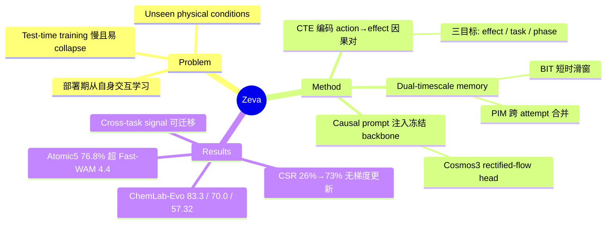

## Summary

Zeva 提出 In-Context Causal Learning (ICCL)：把机器人已执行的 action 及其引发的 state change 编码为 causal interaction signal，存入 dual-timescale causal memory，检索后作为 causal prompt 注入**冻结的** policy model，使机器人在部署期无梯度更新地从自身物理交互中持续改进。在真实世界 ChemLab-Evo 与仿真 RoboCasa365-Atomic5 上超过对比的 frontier VLA/WAM baseline，且 cumulative success rate 随交互积累从 26% 升至 73%（4 次 attempt 内）。

## Problem & Motivation

Embodied foundation model 靠 pretraining 无法覆盖真实部署中的 unseen physical condition（摩擦、重量、容器形变等）。现有两条路都不理想：test-time weight update 慢且易 collapse；单纯的 task generalization 不利用部署期机器人自己产生的交互证据。作者的立场是：机器人应当在部署期从**自身物理交互**中即时学习并用于后续动作，同时保持 policy model 冻结——把适应问题从参数空间移到 context 空间。论文自称是第一个实现这一设定的框架（见 C1，属 novelty claim，未经第三方检索确认）。

## Method

三个组件构成 ICCL 闭环，policy backbone 采用 Cosmos3 的 rectified-flow action-generation head（WAM = World-Action Model，统一 action generation 与 future visual prediction）：

1. **Causal Interaction Extractor / Causal Transition Encoder (CTE)**：以 gated recurrence 形式（B_τ = GRU(B_{τ-1}, [s_τ; u_τ; d_τ])）融合 visual latents、action encoding 与观测到的 effect，输出 Phase Token（任务进度）与 Causal Interaction Signal（局部动力学）。训练用三个目标：causal effect prediction（由 signal+action 解码预测视觉状态变化）、task identity clustering（supervised contrastive）、phase progression（单调进度约束）。训练在部署前完成（原文未用 "offline" 字面表述，但部署时全参数冻结可推知，见 C8）。
2. **Dual-timescale causal memory**：短时的 Brief Interaction Trace (BIT) 是 attempt 内滑窗、每次 attempt 重置；长时的 Persistent Interaction Memory (PIM) 跨 attempt 积累，用相似度合并去冗（S_merge = β_p·sim(p) + β_e·sim(e)，phase 与 effect 相似度加权）。
3. **In-context policy injection**：按当前 phase 从 PIM 做 phase-conditioned retrieval，与 BIT 一起构成 causal prompt，注入冻结 backbone 的 attention（原文表述为 condition "the full-attention blocks of the diffusion path"，更细的层级/机制论文未给出）。部署期所有模型参数冻结，只有 memory 在线更新。

## Key Results

- **真实世界 ChemLab-Evo**（ARX manipulator，7 个化学实验室任务，atomic / short-sequence / complex 三级，每任务 20 randomized episodes）：atomic 级平均 SR 83.3%、short-sequence 70.0%、long-horizon process score 57.32，分别领先 6.6 / 5.0 / 12.59 点。注意三项的"最强 baseline"是不同方法（依次为 Fast-WAM 76.7 / LingBot-VA 65.0 / Cosmos3-Nano 44.73），不是稳定压制单一对手。
- **仿真 RoboCasa365-Atomic5**（5 个厨房任务，每任务 50 randomized episodes）：平均 SR 76.8%，超 Fast-WAM 4.4 点。baseline 含 LingBot-VA、Xiaomi-Robotics-1、τ0-WM、Fast-WAM、Cosmos3-Nano、π0.5（π0.5 仅真机实验）。
- **部署期 self-evolution**：Atomic5 上 cumulative success rate 从 Evolve 1 的 26% 升至 Evolve 4 的 73% 后趋平——全程无梯度更新，这是论文核心 claim 的直接证据。
- **Ablation**（Table III）：移除 PIM 降 SR 10–20 点；移除 BIT 降 15–30 点（Pour Water / Titration 上最大）；两者皆去最差。短时 trace 比长时记忆更关键。
- **Cross-task transfer**：用最近邻的跨任务 signal 替换本任务 signal，SR 仅小幅变化（Pick Up Test Tube 100%→95%、Pour Water 保持 80%）；random substitution 则跌至 55% / 45%——说明 signal 编码的是物理效应等价类而非任务表面特征。
- **Human warm-up**：一条 task-matched human demonstration 可在自身交互学习之外进一步提升性能；abstract 称 "up-to 15%"，但实验节（Sec IV-E2）按任务最大增益为 20 个百分点（Place Beaker），存在 abstract 与正文的表述不一致（见 C9）。

## Evidence Ledger

| Claim ID | Claim | Type | Source locator | Evidence excerpt | Status |
|:--|:--|:--|:--|:--|:--|
| C1 | 自称首个在 policy 冻结下从自身物理交互做 in-context learning 的框架 | sota-novelty | Abstract + Sec I | "the first framework that enables in-context learning from a robot's own physical interaction experience while keeping the policy model frozen" | source-verified |
| C2 | ChemLab-Evo：83.3 / 70.0 / 57.32，领先 6.6 / 5.0 / 12.59 点 | number | Table I (Sec IV) | "Zeva: 83.3 (atomic), 70.0 (short), 57.32 (process)" | source-verified（三项次优方法各不相同：Fast-WAM / LingBot-VA / Cosmos3-Nano） |
| C3 | RoboCasa365-Atomic5 平均 SR 76.8%，超 Fast-WAM 4.4 点 | number | Table II | "Zeva: 76.8%; Fast-WAM: 72.4%" | source-verified |
| C4 | CSR 从 Evolve 1 的 26% 升至 Evolve 4 的 73% | number | Sec IV-E1, Fig. 3 | "cumulative success rate rises from 26% at Evolve 1... plateaus at 73% by Evolve 4" | source-verified |
| C5 | 去 PIM 降 10–20 点，去 BIT 降 15–30 点 | number | Sec IV-D, Table III | "Removing PIM reduces the SR by 10-20 percentage points, while removing BIT causes a larger decrease of 15-30" | source-verified |
| C6 | 跨任务最近邻 signal 100→95% / 80%，random substitution 55% / 45% | comparison | Sec IV-F1, Fig. 7 | "SR changes from 100% to 95% on Pick Up Test Tube and remains 80% on Pour Water... reduces SR to 55% and 45%" | source-verified |
| C7 | baseline 为 LingBot-VA、Xiaomi-Robotics-1、τ0-WM、Fast-WAM、Cosmos3-Nano、π0.5；backbone 为 Cosmos3 rectified-flow head | benchmark-setting | Sec IV-A4 + Tables I–II；Sec II-A | "adopts Cosmos3's rectified-flow action-generation head as the policy backbone" | source-verified |
| C8 | CTE 部署前以三目标训练；部署期全参数冻结、仅 memory 在线更新 | causal-mechanism | Sec III-C + Sec III-F | "During deployment, all parameters remain frozen. The agent updates its causal memory online" | source-verified（原文无 "offline" 字面词，由部署冻结推知） |
| C9 | 一次人类 demonstration warm-up 额外提升最多 15% | number | Abstract vs Sec IV-E2 / Fig. 6 | "The gain reaches 20 percentage points on Place Beaker" | abstract-only（"up-to 15%" 仅见于 abstract；正文按任务最高 20 点，本笔记已按正文改写） |
| C10 | ChemLab-Evo：真实化学实验室、ARX、三级难度、20 episodes/任务；Atomic5：5 厨房任务、50 episodes/任务 | benchmark-setting | Sec IV-A2/A3/A4 + Table I/II captions | "ARX manipulator... 20 randomized episodes... 50 independently randomized episodes" | source-verified |

## Strengths & Weaknesses

**亮点**

- Problem formulation 干净：把部署期适应从参数空间（test-time training，慢且易 collapse）移到 context 空间（frozen model + 可检索的交互记忆），是 LLM in-context learning 范式向物理交互域的一次结构性移植，而非表面类比——"context" 的内容是编码过的 (action → state change) 因果对，不是文本。
- 最有信息量的证据不是主表而是两条曲线：CSR 随 attempt 单调上升（26%→73%，无梯度更新）直接支撑 self-evolution claim；cross-task signal 替换实验（最近邻几乎无损、random 大幅掉点）说明 signal 空间确实按物理效应组织。这两个实验设计比 +4.4 点的 benchmark 数字更能说明机制成立。
- Ablation 显示 BIT（短时）比 PIM（长时）更关键，这个反直觉结果诚实报告了：当前 attempt 内的即时反馈比历史经验对闭环控制贡献更大。

**局限与边界**

- **增益归因不完全干净**（推测）：Zeva 用 Cosmos3 backbone，baseline 里是 Cosmos3-Nano；论文未（就我们读到的部分）说明二者规模/训练是否可比，主表领先中有多少来自 memory 机制、多少来自 backbone 差异，无法从现有信息判断。ablation 内部对照（去 memory 掉 10–30 点）是更可靠的机制证据。
- CTE 训练依赖 task identity clustering（需任务标签的训练 episode），跨任务泛化证据仅来自 7 任务小集合内的替换实验；对训练分布外的物理效应类别是否仍能对齐检索，未知。
- 作者自陈局限：只从任务执行的 attempt 中被动学因果，不做主动探索式交互采集。
- 评测规模小（真机每任务 20 episodes、Evolve 曲线只到 4 次 attempt）；长期部署下 PIM 的膨胀、合并错误、错误因果归因污染记忆等问题未测试。检索与注入的 latency/compute 开销论文未报告。
- Abstract 与正文的 warm-up 数字不一致（15% vs 20 点）是小的严谨性瑕疵。

**领域影响**：如果 signal 空间的物理效应对齐在更大任务集上成立，这条 "frozen policy + 可积累交互记忆" 的路线对 VLA 部署很有吸引力——它把 continual learning 的稳定性问题转化为 memory 管理问题。值得关注后续是否有人在更大 backbone 与开放任务集上复现 self-evolution 曲线。

## Mind Map

## Notes

- Project page: https://air-embodied-brain.github.io/Zeva（已确认存在，页面链接 GitHub repo）。
- 与 vault 内 WAM 方向笔记（如 [[2608-JEPAWAM]]、[[2608-SimWAM]]）及 memory/self-evolution 方向（[[2608-AgentMemoryDistill]]、[[2608-ZerothOrderSelfEvolve]]）可能互参，具体连接待 survey-refresh 时判断。
- 待追问：causal prompt 注入的具体机制（prefix token 还是 cross-attention、注入哪些层）论文正文未给细节；PIM 容量上限与遗忘策略同样未说明。若 repo-digest 跟进可优先看这两处实现。
