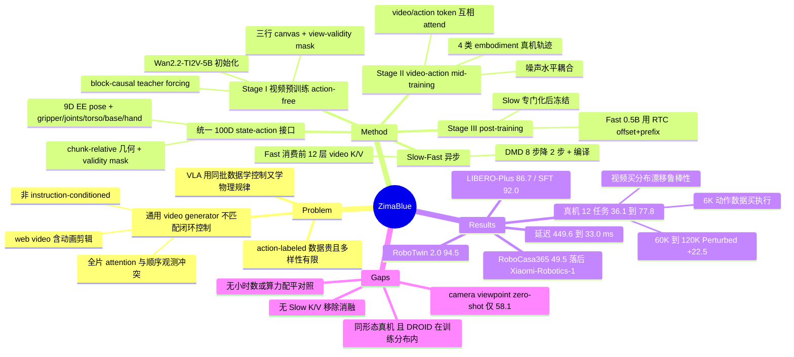

## Summary

ZimaBlue 把无 action label 的第一视角视频当作 World Action Model 的主要 scaling 轴：先在 12 万小时人类与机器人视频上做 causal video pre-training，再用 6K 小时跨形态轨迹经统一 100 维 state-action 接口把视觉动力学接到可执行控制，最后针对目标机器人 post-training，并用 Slow(5B)-Fast(0.5B) 异步双系统把闭环延迟压到 33 ms。在同一台 7-DoF Franka 上的 12 个 held-out 任务上，成功率从只做 DROID post-training 的 36.1% 升到 77.8%。

## Problem & Motivation

VLA 的泛化上限被 action-labeled 机器人数据卡住，而这类数据既贵、多样性又有限。作者的判断是：reactive policy 用同一批 action 数据既学控制、又学感知与物理规律，本身是一种浪费——后者本可以从大得多的视频语料里学到。WAM 把这两件事拆开：视频负责 causal visual dynamics，少量 action 数据只负责把这套动力学接到可执行控制上。

但直接拿现成 video generator 初始化 WAM 不够。论文列了三条 mismatch：generic video model 优化的是 descriptive prompt 下视觉上说得通的重建，而机器人需要的是 instruction-conditioned、与干预后果绑定的预测；很多 video backbone 在整段 clip 上做 attention 或一次生成长块，而部署时控制器只能顺序拿到观测；web video 里的动画、特效与剪辑转场会稀释 contact-rich manipulation 需要的先验。结论是 WAM 应该经过专门的 embodied video pre-training，而不是从通用视频生成模型改装。

## Method

**统一 100 维 state-action 接口**。每个 end-effector 占 9 维（3D 平移 + 6D 连续旋转），其余 slot 覆盖 gripper、arm joints、torso、mobile base 与 dexterous hands；每个 embodiment 只激活自己原生接口定义的坐标，其余置零并由 validity mask 从 loss 里排除（DROID 激活 17 维）。动作用 chunk 相对表示：以 chunk 首帧的 proprioceptive state 为 anchor，$\Delta p_h = R_0^{-1}(p_h - p_0)$、$\Delta R_h = R_0^{-1}R_h$，关节目标同样取相对差值，部署时再反变换回物理量。

**Stage I：action-free video pre-training**。从 Wan2.2-TI2V-5B 初始化，只训 Slow 分支，action 与 state 流仅作为 null placeholder，Slow 的 action loss 关闭。为兼容相机数不一致，所有样本压进同一个三行竖排 canvas，缺失视角 padding 并由 view-validity mask 屏蔽，既不进 video-token attention 也不进 flow-matching loss。视频 latent 切成 temporal block，每块独立采噪声、块内共享，block-causal teacher forcing 让多个未来块并行去噪而保持自回归 rollout 的依赖结构；默认 $8K+1$ 帧、$K=4$ 即 33 帧。语料分两阶段：先是包含 EPIC-KITCHENS、Egocentric-100K、EgoDex、HOT3D-Aria 等人类第一视角数据，以及 DreamDojo、GenRobot 等仿真源和 DROID、AgiBot、Galaxea、RoboMIND2、InternData-A1 等机器人数据的宽混合；再剔除低分辨率、无指令的 web 源，在 manipulation 为主的子集加上大量自有人类第一视角视频上继续训练。

**Stage II：video-action mid-training**。引入 DROID、AgiBot、Galaxea、RoboMIND2-Franka 四类 embodiment 的真机轨迹，Slow 分支对未来 video latent 与 24 步 action chunk 做联合 flow matching。关键在 attention 结构：noisy 的未来 video token 与 action token 互相可见，并共同 condition 在指令、state 与 clean 视频历史上——视频流据此生成与预测动作一致的未来观测，动作流据此反推驱动这些视觉变化所需的控制序列；两者的噪声水平在同一去噪步内耦合。这里没有 latent action，也没有 inverse dynamics 模块，grounding 完全发生在共享 backbone 内部的联合去噪里。

**Stage III：post-training 与 Slow-Fast**。先把 Slow 专门化到目标域（未见过的仿真 benchmark 另挂轻量 embodiment-specific encoder/decoder），再冻结 Slow、单独训 0.5B 的 Fast。Fast 由 Slow 前 12 层权重按通道插值初始化；推理时 action query 除了看自己的观测、状态与动作 token，还 cross-attend Slow 前 12 层缓存的 video K/V——它拿到的是中间层特征，而不是显式生成的未来视频。训练时用 RTC 式的 offset + prefix：随机采时间偏移 $\delta$ 让 Fast 看到执行一段之后的新观测，并把前 $p$ 步已提交动作作为干净 prefix teacher-force、只对后缀加噪，以复现异步闭环的信息模式。

**加速**。三条叠加：异步调度（Slow 低频更新 K/V guidance，Fast 高频出动作且不等 Slow）、DMD 两阶段蒸馏（先 Slow 后 Fast，各从 8 步降到 2 步 DiT evaluation，fake-score 每 5 次更新对应 generator 1 次）、torch compile。

## Key Results

真机部分在 7-DoF Franka 上做 12 个 held-out 任务，每任务 10 次 rollout（Toys 按 30 次单件放置计），同机器人、同相机位、同 reset、同 action decoder、同安全限位。四个 ZimaBlue 配置累加 pre-training 数据但共享完全相同的 DROID post-training 数据与优化 schedule，Baseline 直接从 Wan2.2-TI2V-5B 初始化。

| 配置 | Standard (8 任务) | Perturbed (4 任务) | Average (12 任务) |
|:--|--:|--:|--:|
| π0.5（>10K 小时机器人数据） | 65.4 | 32.5 | 54.4 |
| DreamZero（14B） | 61.7 | 37.5 | 53.6 |
| ZimaBlue Baseline | 46.7 | 15.0 | 36.1 |
| + 6K 小时多形态 video-action | 57.9 | 22.5 | 46.1 |
| + 60K 小时第一视角视频 | 82.9 | 35.0 | 66.9 |
| + 120K 小时第一视角视频 | 87.9 | 57.5 | 77.8 |

两种数据买到的东西不一样。6K 小时 action-labeled 轨迹主要改善执行：microwave closing 从 0/10 到 9/10，air-fryer opening 从 6/10 到 9/10。视频主要改善视觉泛化与多阶段进度跟踪：加 60K 小时后 bowl stacking 2/10→7/10、bread transfer 4/10→10/10、Toys 16/30→28/30。60K 到 120K 的增量分布最能说明问题——Standard 只 +5.0，Perturbed 却 +22.5，四个受扰任务全部改善。

部署架构与加速的消融（同一批 12 任务）：

| 部署配置 | Standard | Perturbed | Overall | 端到端延迟 |
|:--|--:|--:|--:|--:|
| 仅 Slow（8 步） | 80.8 | 30.0 | 63.9 | 449.6 ms |
| 异步 Slow-Fast（8 步） | 87.9 | 57.5 | 77.8 | 145.6 ms |
| + DMD 蒸馏（2 步）+ 编译 | 85.0 | 55.0 | 75.0 | 33.0 ms |

RTX 4090 上整体 13.6× 加速，蒸馏后总体成功率只掉 2.8 pp。三个仿真 benchmark 全部只用 Slow System 评测，未启用双系统。LIBERO-Plus zero-shot category-macro 86.7（InternVLA-A1.5 85.8、ImageWAM-9B 85.3、π0.5 85.2），SFT 后 92.0（CAC-VLA 90.1）；其中 Camera 一项 zero-shot 只有 58.1，低于 π0.5 的 78.4 和 InternVLA-A1.5 的 83.1，SFT 后跳到 95.4。附录 Table 12 显示这轮 SFT 在四个 suite 上都让 Robot Initial States 下降，Object 上 −16.8。RoboTwin 2.0 上 94.7（Clean）/ 94.3（Randomized）/ 94.5（Average），比最强 WAM baseline ABot-M0.5 高 0.4 pp。RoboCasa365 上 Atomic-Seen 78.1 / Composite-Seen 50.4 / Composite-Unseen 16.5 / Average 49.5，WAM 类别里最高，Composite-Unseen 是 ABot-M0.6 的两倍多（7.9→16.5）；但用 10 万小时真机轨迹的 VLA Xiaomi-Robotics-1 是 57.4 average、32.1 Composite-Unseen，仍高出一档。

## Evidence Ledger

| Claim ID | Claim | Type | Source locator | Evidence excerpt | Status |
|:--|:--|:--|:--|:--|:--|
| C1 | 唯一列出的机构是 Joy Future Academy；作者名上的数字上标是贡献分工而非机构 | affiliation | 标题块 / Sec. 8 Authors | "Listed by task with no indication of priority: 1Data, 2Pre-training, 3 Mid-training, 4Post-training" | source-verified |
| C2 | 12 任务真机 zero-shot task-macro 从 Baseline 36.1% 升到完整配置 77.8% | number | Table 3 / §6.1.2 | "overall success increases monotonically from 36.1% for our Baseline configuration to 77.8% for the full model" | source-verified |
| C3 | Table 3 四行是累加式 pre-training 配置，共享同一份 DROID post-training；Baseline 从 Wan2.2-TI2V-5B 初始化 | benchmark-setting | Table 3 caption / §6.1.1 | "The four ZimaBlue configurations are cumulative and exclude their common DROID post-training." | source-verified |
| C4 | 所有真机实验在单一 7-DoF Franka 平台上，12 个任务对 DROID post-training 全部 held out | benchmark-setting | §6.1.1 / Appendix A.1 | "All experiments are conducted on a 7-DoF Franka arm platform." / "All 12 tasks are held out from DROID post-training." | source-verified |
| C5 | 6K 多形态动作数据把总体成功率从 36.1% 抬到 46.1%，60K 视频到 66.9%，120K 到 77.8% | number | Table 3 / §6.1.2 | "raises ... Overall success from 36.1% to 46.1%" ... "Average success from 46.1% to 66.9%" | source-verified |
| C6 | 视频 60K→120K 在 Standard 上 +5.0，在 Perturbed 上 +22.5 | number | §6.1.2 | "yields a modest 5.0-point gain on Standard, but a striking 22.5-point jump on Perturbed" | source-verified |
| C7 | Stage I 的 action/state 流只是 null placeholder 且 Slow action loss 关闭；grounding 在 Stage II 靠 100 维接口上的联合 flow matching，不用 latent action / inverse dynamics | causal-mechanism | §4.2.2 / §4.3.2 / §3.1 | "Action and state streams are instantiated only as null placeholders: action supervision of Slow branch is disabled" | source-verified |
| C8 | Stage I 语料并非纯人类视频，同时含 DROID/AgiBot/Galaxea/RoboMIND2/InternData-A1 等机器人数据与仿真数据；论文未给出小时级构成拆分 | benchmark-setting | §4.2.1 | "EPIC-KITCHENS, Egocentric-100K, EgoDex, HOT3D-Aria, DreamDojo, GenRobot, RoboCOIN, DROID, AgiBot, Galaxea, RoboMIND2, InternData-A1" | source-verified（verifier 补充：全文只给 300h / 6K / 60K / 120K 总量，无 human/sim/robot 拆分） |
| C9 | Slow DiT 5B、Fast DiT 0.5B；Fast 由 Slow 前 12 层初始化并 cross-attend 前 12 层 video K/V；部署时 Fast 出最终动作，消费的是 K/V 缓存而非显式生成的未来视频 | number+mechanism | §3.2 / §4.4.2 | "A Slow DiT (5B) ... a lightweight Fast DiT (0.5B)" ; "Fast is initialized from the first 12 layers of the Slow DiT" | source-verified |
| C10 | 延迟 449.6 ms → 145.6 ms → 33.0 ms（RTX 4090），整体 13.6×；蒸馏版保留 75.0% 总体成功率，比未蒸馏低 2.8 点 | number | Table 4 / §6.2 | "reduces end-to-end inference latency from 449.6 ms to 145.6 ms" ; "further reduce latency to 33.0 ms ... 13.6× speedup overall" | source-verified |
| C11 | LIBERO-Plus zero-shot 86.7（InternVLA-A1.5 85.8）、SFT 92.0（CAC-VLA 90.1）；zero-shot Camera 58.1 低于 π0.5 78.4、ImageWAM-9B 79.8、ABot-M0.5 70.5、InternVLA-A1.5 83.1，SFT 后 95.4 | number+comparison | Table 5 / §6.3.1 | "ZimaBlue (Ours) 58.1 88.9 91.5 98.0 91.5 93.1 86.1 86.7" ; "from 58.1% to 95.4%" | source-verified |
| C12 | LIBERO-Plus 的 SFT 在全部四个 suite 上都让 Robot Initial States 下降，Object 上最大 −16.8 | number | Appendix B.1 / Table 12 | "Robot Initial States decreases in every suite, most on Object (-16.8 points)" | source-verified |
| C13 | RoboTwin 2.0 上 94.7 / 94.3 / 94.5，为表内最佳，较 ABot-M0.5 分别 +0.7 / +0.1 / +0.4 pp | number+comparison | Table 6 / §6.3.2 | "improvements of 0.7 percentage points (pp) on Clean, 0.1 pp on Randomized, and 0.4 pp on Average" | source-verified |
| C14 | RoboCasa365 Average 49.5，仅次于 Xiaomi-Robotics-1 的 57.4；Composite-Unseen 16.5 对 ABot-M0.6 的 7.9、ABot-M0.5 的 3.3；多数 baseline 数字取自官方 leaderboard 而非作者复跑 | number+comparison | Table 7 caption / §6.3.3 | "all other baseline results are taken from the official RoboCasa365 leaderboard" ; "ABot-M0.6 from 7.9% to 16.5%" | source-verified |
| C15 | 三个仿真 benchmark 全部只用 Slow System 评测，未启用 Slow-Fast 双系统 | benchmark-setting | §6.3 | "For simplicity, we conduct all evaluations exclusively on the Slow System." | source-verified |
| C16 | 完整 120K 配置在每个 Perturbed 任务上仍只有 5/10–7/10；剩余失败被归为"无法从正确中间态推进"与局部交互错误 | number+mechanism | §6.1.2 / Appendix Table 10 | "the full configuration achieves only 5/10–7/10 on each Perturbed task" | source-verified |
| C17 | 每个真机任务只跑 10 次 rollout（Toys 计 30 次放置），论文自承 per-task 结果有采样噪声且并非一致为正 | benchmark-setting | §6.1.1 / §6.1.2 / Appendix A.2 | "per-task results inherently exhibit sampling noise and are not uniformly positive" | source-verified |
| C18 | 全文含附录不存在把总数据小时数或算力配平后、用 action-free 视频替换 action-labeled 数据的对照；video-vs-action 证据只来自累加阶梯 | benchmark-setting | 全文（Tables 3/4/8–14、Figs. 7–8） | "The four ZimaBlue configurations are cumulative and exclude their common DROID post-training." | source-verified（verifier 另指出 Fig. 7 的跨方法数据构成图与 Fig. 8 的定性 ablation 均未配平小时数或算力） |
| C19 | 全文含附录不存在"保留 Fast 但移除/破坏 Slow video K/V guidance"的消融；Table 4 是整体部署架构的替换 | benchmark-setting | 全文（§5–6、Appendix A–C） | "we keep all configurations unchanged and vary only the deployment model architecture, yielding two variants: Slow and Slow–Fast" | source-verified |
| C20 | 代码在 github.com/ZimaBlue-WAM/ZimaBlue，项目页 zimablue-wam.github.io | license-code | 论文 abstract footer / Links | "Project: https://zimablue-wam.github.io/ Code: https://github.com/ZimaBlue-WAM/ZimaBlue" | source-verified（链接在论文 HTML 内；arXiv /abs 页无 Comments 字段、不含这两条。仓库是否已填充内容超出 primary source 范围） |
| C21 | arXiv v1 提交于 2026-08-31，标识符 2609.00188，分类 cs.CV | metadata | arXiv abs 页 submission history | "[v1] Mon, 31 Aug 2026 18:09:52 UTC" ; "arXiv:2609.00188 [cs.CV]" | source-verified |

## Strengths & Weaknesses

数据阶梯本身是这篇最有价值的部分。四个配置共用同样的 DROID 数据与优化 schedule，只改 pre-training 初始化，因此 36.1 → 46.1 → 66.9 → 77.8 这条曲线至少排除了目标域数据量这一混淆；真机协议（同机器人、同相机位、同 reset、同 action decoder、同安全限位）也比多数 WAM 报告的真机数字更可信。更有信息量的是收益的形状：6K 小时动作数据主要改善执行（microwave 0/10→9/10），视频主要改善视觉迁移与多阶段进度跟踪，而 60K→120K 的增量几乎全落在 Perturbed suite（+5.0 对 +22.5）。这说明视频小时数买到的不是"更会做这些任务"，而是"分布漂移时不崩"。架构上 Fast 拿 Slow 前 12 层的 video K/V 而非显式未来视频，绕开了 imagine-then-act 路线的 rollout 延迟与生成-真实观测失配，配合 DMD 8→2 步与编译做到 449.6 ms → 33 ms 只掉 2.8 pp。失败面也报得比较诚实：承认 10 次 rollout 有采样噪声，附录主动报告 SFT 在 Robot Initial States 上四个 suite 全线下降。

但支撑核心论断的对照是缺的。verifier 逐节核查全文与附录后确认（C18），论文没有任何把总数据小时数或算力配平后、用 action-free 视频替换 action-labeled 数据的实验；6K 小时动作数据对 60K/120K 小时视频的比较里，数据量、pre-training 步数与算力一起在变。因此"视频是更经济的 scaling 轴"只能作为工程结论——每小时视频比每小时遥操作便宜得多——不能读成"单位数据里视频的信息量可比"。

第二个问题是语料标签名不副实。Table 3 把那两档写成 "Egocentric Videos"，而 §4.2.1 列出的语料同时含 DROID、AgiBot、Galaxea、RoboMIND2、InternData-A1 等机器人数据与 DreamDojo、GenRobot 等仿真数据，且论文没有给出这 12 万小时在人类、仿真、机器人之间的小时级拆分（C8）。于是无法判断收益来自人类视频的多样性，还是来自"多看了很多帧无标注机器人视频"——后者对 DROID 部署几乎等价于目标域的额外自监督。第二阶段还混入了大量自有非公开人类视频，这条曲线外部无从复现。

Slow 分支的实际贡献也没有被单独测过。Table 4 只对比了 Slow-only 与 Slow-Fast 两种部署架构，同时改变了控制频率与是否有 K/V 条件；论文里没有"保留 Fast 但移除或打乱 Slow video K/V"这一档（C19）。Fast 只 cross-attend 前 12 层的浅层特征，这更接近表征迁移而非 model-based control；缺了这个消融，Perturbed 上 30.0→57.5 里有多少来自世界模型的预测内容、多少只来自 33 ms 的反应速度，是未知的。顺带一提，33 ms 是 Fast 分支的闭环延迟，Slow 的异步刷新周期全文未报，读者无法判断"世界模型"在什么时间尺度上过期。

真机结果是同形态的，且 DROID 全程在训练分布内。12 个任务都在同一台 7-DoF Franka 上，post-training 用 DROID，而 DROID 同时出现在 Stage I 视频语料与 Stage II 动作语料中。这里的 zero-shot 指未见过的 task-scene 配置，不是未见过的机器人；标题里的 generalizable 在 embodiment 维度上没有真机证据。每任务 10 次 rollout 的分辨率下 ±2/10 接近噪声，而 Baseline 在 microwave 上 0/10、π0.5 在 air-fryer 上 0/10 这类极端值更像设定不匹配而非能力差异。

最关键的反例来自论文自己的 Table 7。作者主张视频 pre-training 在 unseen 任务上最值钱，但同一张表里，用 10 万小时真机轨迹的 Xiaomi-Robotics-1 在 Composite-Unseen 上是 32.1，接近 ZimaBlue 16.5 的两倍。在这个 benchmark 上"更多 action-labeled 数据"仍是比"更多视频"更强的 unseen 泛化来源；论文把它划到 VLA 类别单独排除，而这恰恰是全文该正面回答的问题。LIBERO-Plus 的 camera 一项同样别扭：如果 12 万小时视频买到的是对视觉漂移的鲁棒性，视角变化应该最该受益，实际 zero-shot 只有 58.1，低于 π0.5 与 InternVLA-A1.5，一轮 SFT 就拉到 95.4。作者归因于 pre-training 数据多样性不足，但更直接的解释是以人类第一视角为主的语料在相机外参分布上本就窄，视频小时数补不上这一点。RoboTwin 2.0 上 +0.4 pp（5000 次 trial 量级）也不足以支撑 "consistently outperforms all compared VLA and WAM methods" 这句话的强度。

这篇的定位是工程报告而非新机制：它给出了目前公开最完整的一条"视频小时数 → 真机 zero-shot 成功率"阶梯，并把收益的形状指向 robustness under distribution shift 而非 skill acquisition。要让核心论断站住，缺的是小时数与算力配平的对照，以及人类视频与无标注机器人视频的拆分实验。

## Mind Map

## Notes

与 [[2602-DreamZero]] 同属 video-diffusion-backbone 的 WAM 路线，但 DreamZero 是 14B Wan2.1-I2V、直接把 WAM 当 zero-shot policy 用；ZimaBlue 用 5B Wan2.2-TI2V 加一个 0.5B 的执行分支，且在本文真机表里 DreamZero 的 12 任务均值只有 53.6。[[2607-FlowWAM]] 同样从 Wan2.2-TI2V-5B 出发，走的是 optical flow 作为统一动作表示，RoboTwin 2.0 上 92.5 对 94.5。[[2607-ABotM05]] 用 frame-level latent action 做中间层，而 ZimaBlue 明确不用 latent action，两条路线在 RoboCasa365 Composite-Unseen 上差得最开（3.3 对 16.5）。[[2607-XiaomiRobotics1]] 是本文所有表里唯一压过 ZimaBlue 的模型，靠的是 10 万小时真机数据——把这两篇并排看，"video hours 还是 robot hours 更值钱"目前没有答案，因为没人做过配平实验。

待查的三个问题：120K 小时里人类视频占多少，抽掉其中的无标注机器人视频后曲线还剩多少斜率；把 Slow 的 video K/V 换成过期缓存或随机缓存，Perturbed 上的 57.5 会掉到哪里；60K→120K 在 Standard 上只 +5.0 是否已接近该 suite 的天花板，换更难的 Standard 任务后视频 scaling 是否还有斜率。
