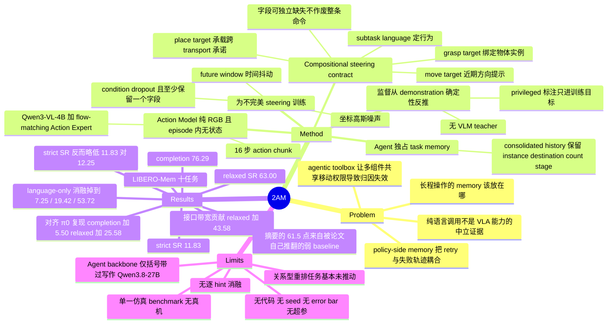

## Summary

2AM 把 long-horizon manipulation 的 task memory 全部留在 multimodal Agent 侧，底层只保留一个纯 RGB 输入、episode 内无状态的 Action Model，两者之间以「subtask language + 可选 2D grasp/place/move 点」这一 compositional steering contract 通信，steering 监督从 demonstration 标注确定性反推并在训练时施加 condition dropout、坐标高斯噪声与时间抖动。在 LIBERO-Mem 十任务上取得 76.29% completion / 63.00% relaxed SR / 11.83% strict SR；相对论文自建的 aligned π0 复现（70.79 / 37.42 / 12.25）completion +5.50、relaxed +25.58，但 strict SR 反而略低，论文自陈"证据不支持一致的成功率提升"。

## Problem & Motivation

长程操作里"memory 放在哪"目前有两条主流路线，各自都带着归因问题。第一条把 visual history、recurrent state 或 learned memory 塞进 VLA 本身（MemoryVLA、Embodied-SlotSSM、Mem-0 一类）。论文指出这条路有一个被忽视的副作用：policy 主要用成功 demonstration 训练，一旦把 persistent task memory 留在策略内部，一次 retry 就会被它之前那条失败轨迹耦合住；反过来，episodically stateless 的控制器可以在 Agent 修订意图后从当前观测重新起步，不继承对失败的 latent 记账。第二条把 VLA 放进 agentic toolbox，旁边配 planner、几何原语和 task-specific policy，还常常额外使用 depth 或标定几何（Hi Robot、RoboClaw、Goal2Skill、Harness VLA 一类）。这条路提升了系统能力，但让多个组件同时拥有"移动机器人"的权限——涨点可能来自更丰富的传感或替代的运动通路，掉点则分不清是 policy 本身不行，还是语言接口没把 instance、destination、motion 说清楚。论文由此下了一个尖锐的判断：一次纯语言的调用不是 VLA 能力的中立证据。

问题的提法值得注意。论文不问"谁来记忆"，而问两件事：把 Agent 记住的状态变成物理意图需要什么样的 contract，以及什么样的实验设置才能把行为真正归因给 Action Model。为让这个问题可判定，它故意选了一个受限的设计点——更少的工具广度，更高的接口带宽。形式化地说，它检验的假设是：一条紧凑命令 c_k 能否让下一步局部动作在给定 c_k 的条件下独立于完整历史 H_k。论文明确声明这比"所有物理行为都是无记忆的"要窄得多——精确时序、隐藏的力状态、轨迹模仿仍然可能需要策略内部的时间状态。

## Method

**两模型加一条显式 contract。** Agent 产出 c_k = AM_agent(g, I_k^a, H_k)，其中 H_k 是 consolidated 的有限记录（选择性观测、已发命令、可见结果）；consolidation 允许压缩冗余帧，但必须保住下一步决策需要的 task 变量：object identity、destination、count、stage。Action Model 产出 â_{t:t+L-1} = AM_action(I_t^a, I_t^w, s_t, c_k)，只看当前 agent-view 与 wrist-view RGB、robot state 和 c_k；H_k 从不拼接进它的 policy 输入，跨 Agent 调用不保留 episode 状态。两者以不同时钟运行：Agent 每个短 action chunk 更新一次，Action Model 在 chunk 内做局部控制。论文强调"memoryless"指 episodically stateless，不是对当前运动与本体状态失明。Agent 输出里不含 end-effector pose、gripper command、duration 或 trajectory——approach 几何、wrist 对齐、抓合、transport、从数据里学到的避障、release 全部归 Action Model。

**Compositional steering contract。** c_k = (ℓ_k, q^grasp, q^place, q^move)，2D 点以当前 agent-view 图像为参照、左上为原点、归一化到 [0,1000]² 范围；缺失字段直接省略而非用特殊点表示，因为字段的可用性本身是 stage-dependent 的。三类点绑定不同时间尺度的物理参数：

- **grasp_target** 绑定下一个 object instance，在接触前最有用（同类多物体消歧）。物体被明显握住或 stage 变化后该字段消失——论文明确指出保留 stale grasp point 会把控制器拉回物体的原始图像位置。
- **place_target** 承载更长的 commitment，transport 期间目的地可能远离 wrist view 或被手臂遮挡；全局点让目的地保持显式，而不要求 Agent 生成路径。
- **move_target** 是近期方向 cue：若干 demonstration step 之后一个有用的 gripper 位置，被解释为局部方向提示，而非必须到达的 waypoint 或需要跟随的轨迹。

关键设计在于这三个字段互补且可独立缺失，不是同一个目标的替代编码，也不是一个不可分割的 spatial prompt。approach 阶段可能同时用 language + grasp + move，transport 阶段撤掉 grasp 保留 place + move，release 阶段 place 单独就够。重复循环可以共享同一句 subtask language（如 "place the bowl on the plate"），由 grasp/place 点选出当前历史所要求的那只碗和那个目的地。compositionality 的直接收益是：某个字段缺失或有噪声只降级一个角色，不作废整条命令。

**监督从 demonstration 确定性反推，不用 VLM teacher。** 每条同步轨迹提供 RGB、robot state、action、demonstration stage、object box/mask、gripper contact、object motion；一个 deterministic preprocessing pass 反推当前 subtask、active instance、destination 以及每个 hint 的有效区间。grasp/place 监督用 box 的归一化中心 q = 1000·((x+w/2)/W, (y+h/2)/H)——论文自己声明这是 semantic target，不是"几何中心即最优接触点"的主张，可行接触点要由控制器从两路图像、状态和 demonstration 里自行推断。move 监督用投影的末端轨迹 robot_xy，采样 Δ ~ U{10,…,20} 取 q^move_t = robot_xy_{t+Δ}，窗口采样防止模型把某个精确时间偏移当成 move point 的定义，也更匹配变化的 Agent 延迟。所有 privileged annotation 只用于构造训练目标，部署观测里完全不出现。动作窗口只在 episode 边界裁剪，允许跨越 subtask 边界，以免教会运动策略在 grasp/lift/release 附近为等 Agent 而停顿。

**为不完美 steering 而训练。** 设 v_t ∈ {0,1}⁴ 标记哪些字段在 t 帧语义上可用，采样 mask m_t ⪯ v_t 且 ‖m_t‖₀ ≥ 1——在语义合法范围内独立丢弃字段，但绝不把所有意图来源同时抹掉。保留的点加各向同性高斯噪声 ε ~ N(0, σ²I₂) 后 clip 回 [0,1000]²。dropout、空间噪声、future-window 采样分别对应接口的三种主要误差：omission、localization error、temporal misalignment。mask 概率被明确定义为 training hyperparameter 而非接口定义的一部分（其具体取值论文未给出）。

**实现与闭环。** Action Model 用 Qwen3-VL-4B backbone + flow-matching Action Expert，学 16 步 action chunk，不存在分开的 grasp/place/move 控制器；论文称这套 conditioning 接口适用于大多数带 language-conditioning 的 VLA/WAM。每个 chunk 结束后 Agent 重新观测全局 RGB、更新 H_{k+1}、可修订 subtask 或任一 hint；不暴露 benchmark state 或学到的 completion oracle，仿真终止只在没有下一帧观测时结束 episode。

## Key Results

评测在 LIBERO-Mem 的十个任务上进行，从单次 lift-and-return 一直到重复放置、碗序重排、以及取决于先前篮子占用情况的放置；局部 pick-and-place 行为反复出现，而历史决定正确的 instance、destination、count 或 stage。部署时 2AM 只收到 task language、agent-view RGB、wrist RGB 和 robot state；depth、segmentation、box、object id 与 pose、oracle subgoal、reward、stage flag、benchmark completion predicate 全部移除。

| 方法 | Strict SR | Relaxed SR | Completion |
|:--|--:|--:|--:|
| Best published（SlotSSM） | 0.00 | – | 14.80 |
| π0 reproduced（论文自建 aligned baseline） | 12.25 | 37.42 | 70.79 |
| Language-only subtask（接口消融） | 7.25 | 19.42 | 53.72 |
| 2AM | 11.83 | 63.00 | 76.29 |

核心结论分三层，且互相牵制：

**一、摘要主打的数字建立在一个被论文自己推翻的 baseline 上。** 摘要写 "76.3% average completion, a 61.5-point improvement over the strongest reported baseline of 14.8%"，这个 14.8% 是 published SlotSSM。但 §4.2 紧接着说这些已发表数字"substantially underestimate the policy under our current implementation"——同一 backbone 下的 in-house π0 复现就有 70.79% completion，已发表的 π0 只有 5.0%。所以这 61.5 点几乎全部来自 baseline 太弱，不是 2AM 的净贡献；论文在正文里也确实改用复现值做主比较。

**二、对齐比较下的真实增量是"进程推进"而非"成功率"。** 相对 π0 复现，completion +5.50 点、relaxed SR +25.58 点，但 strict SR 从 12.25 略降到 11.83。论文原话是"the evidence does not support a uniform success-rate improvement"。63.0% relaxed 与 11.8% strict 之间近 5 倍的落差被论文读作：到达目标状态与恰好停在那个状态是两个分开的问题，当前接口改进的是前者。

**三、承载 interface 论断的是 language-only 消融。** 保持同一个 Agent、同一个 Action Model、同样的观测和 chunk 长度，只去掉全部 2D hint，三项指标掉到 7.25 / 19.42 / 53.72；加回 grounded hint 分别 +4.58 / +43.58 / +22.57。relaxed 的涨幅（43.58）是 strict 涨幅（4.58）的约 9.5 倍，这个不成比例的分布是论文机制解释的直接依据。

任务级模式：2AM 在全部十个任务上 relaxed SR 更高，在七个任务（T1–T6、T9）上 completion 更高；π0 复现在 T1–T6 的 strict SR 更高，2AM 在 T7–T10 更高——后四者正是 relation 与 occlusion 加重 object/destination 绑定负担的任务。失败模式方面，论文观察到三类通过同一接口进入 Action Model 的 Agent 侧错误：grasp 点定位不准、subtask 选错、destination 绑到错误的篮子；dropout 与空间噪声能让控制器容忍遗漏和不精确，但无法纠正已经编码了错误高层意图的 subtask 或 object binding。

## Evidence Ledger

| Claim ID | Claim | Type | Source locator | Evidence excerpt | Status |
|:--|:--|:--|:--|:--|:--|
| C1 | LIBERO-Mem 上 2AM 聚合 completion = 76.29%（摘要记作 76.3%） | number | Table 2 / Table 3 "2AM (Ours)" / Abstract | "2AM reaches 76.3% average completion" | source-verified（独立按 Table 2 逐任务重算 = 76.2920） |
| C2 | 摘要"61.5-point improvement over ... 14.8%"比的是 published SlotSSM，不是论文自建的更强复现 | comparison | Abstract；§4.1；§4.2；Table 3 | "a 61.5-point improvement over the strongest reported baseline of 14.8%" | source-verified。**注**：Table 3 的 14.80 与其自身 Table 2 列的均值 14.76 不符（高 0.04），为论文唯一的内部数值不一致；61.5 的结论不受影响（76.29−14.76 = 61.53） |
| C3 | 2AM 聚合 Strict SR = 11.83%、Relaxed SR = 63.00% | number | Table 3 "2AM (Ours)" | "2AM (Ours) \| 11.83 \| 63.00 \| 76.29" | source-verified（重算 11.8340 / 62.9990） |
| C4 | 论文自建 π0 复现达 70.79% completion、37.42% relaxed、12.25% strict | number | Table 3 "π0 reproduced"；§4.2 | "it reaches 70.79% completion" | source-verified（重算 70.7850 / 37.4180 / 12.2500；completion 恰为 .785 平局值，需 round-half-up 才得 70.79） |
| C5 | 相对 aligned π0 复现，2AM completion +5.50、relaxed +25.58，但 strict 略低（11.83 vs 12.25），论文自陈不支持一致的成功率提升 | comparison | §4.2 ¶1 | "so the evidence does not support a uniform success-rate improvement" | source-verified。**注**：+5.50 是用取整后的聚合值算的；按逐任务原值为 5.507（应记 5.51） |
| C6 | Language-only 消融（同 Agent/同 Action Model/同观测/同 chunk 长度，仅去掉 2D hint）= 7.25 / 19.42 / 53.72；加回 hint 分别 +4.58 / +43.58 / +22.57 | number | §4.1 消融定义；§4.2 ¶2；Table 3 | "subtask language alone reaches 7.25% strict success, 19.42% relaxed success, and 53.72% completion" | source-verified（三个 delta 精确吻合）。**边界**：该消融在 Table 2 无逐任务列，其三个聚合值无法独立重算，只有 delta 可核 |
| C7 | 相对 π0 复现，2AM 在全部 10 个任务 relaxed 更高、7 个任务 completion 更高；π0 复现在 T1–T6 strict 更高，2AM 在 T7–T10 更高 | comparison | §4.2 ¶3；Table 2 | "2AM obtains higher relaxed success on all ten tasks and higher completion on seven" | source-verified（逐任务核对：relaxed 10/10，completion 7/10，π0 在 T7/T8/T10 更高；strict 分界恰在 T6/T7，无并列） |
| C8 | 部署时只给 task language + agent-view RGB + wrist RGB + robot state；depth/segmentation/box/object id 与 pose/oracle subgoal/reward/stage flag/completion predicate 全部移除；privileged annotation 仅用于构造训练目标 | benchmark-setting | §4.1 ¶2；§2.1 ¶2；§3.1 ¶2 | "Privileged annotations are used only to construct training targets" | source-verified |
| C9 | 依据 benchmark 作者澄清，所有已发表 baseline 的 strict success 均为 0，且未报告 relaxed success | benchmark-setting | §4.1 ¶2；Table 2/3 caption | "all published baselines have 0 strict success; relaxed success was not reported" | source-verified（Table 3 该列为 "–"） |
| C10 | 已发表 π0 在 LIBERO-Mem 的平均 completion 为 5.0% | number | §4.2 ¶1；Table 2 | "compared with 5.0% for the reported π0" | source-verified（重算恰为 5.0000，仅 T1 = 50.0） |
| C11 | relaxed 相对 strict 的不成比例增益表明 grounded hint 主要帮助把记住的意图推过有序进程，接口本身不解决 semantic termination | causal-mechanism | §4.2 ¶2–¶3 | "improves task progression; it does not by itself solve semantic termination" | source-verified（论文明述，且 43.58 vs 4.58、63.00 vs 11.83 与之一致） |
| C12 | Action Model = Qwen3-VL-4B backbone + flow-matching Action Expert，16 步 action chunk；Agent backbone 原文写作 "Qwen3.8-27B" | number | §3.2 末；Figure 2 caption；§6 | "Our implementation uses a Qwen3-VL-4B backbone and a flow-matching Action Expert" | source-verified。**注**："Qwen3.8-27B" 全文仅在 §6 Limitations 括号内出现一次，无引用，无公开同名模型，论文未澄清 |
| C13 | π0 复现使用与 2AM Action Model 相同的 Qwen3-VL-4B backbone、双路 agent+wrist RGB、16 步 chunk，差别在于没有 2AM 的 grounded steering 接口 | benchmark-setting | §4.1 ¶1 | "same Qwen3-VL-4B backbone as our Action Model, dual agent-view and wrist-view RGB inputs, and 16-step action chunks" | source-verified |
| C14 | 论文未提供任何代码、项目页或 GitHub 链接 | license-code | 全文（raw HTML 全局检索） | 无任何作者提供的 repo/project URL | source-verified（唯一 github.com 命中为 arXiv/LaTeXML 基础设施；无 "code will be released"） |
| C15 | 2D hint 归一化到 [0,1000]²、左上原点；move 监督 Δ ~ U{10,…,20}；保留点加高斯噪声后 clip；dropout 受 ‖m‖₀ ≥ 1 的 nonempty-condition 约束 | number | §2.3 ¶1；Eq. (4)(5)(6)(7) | "Coordinates use the current agent-view image, the upper-left origin, and a [0,1000]2 range" | source-verified（四个子项逐一确认） |
| C16 | LIBERO-Mem 为十个任务；strict success 要求按序完成全任务且重复次数正确（三循环任务若开始第四轮即失败）；completion 为有序 subgoal 达成比例；relaxed success 是本文新增指标 | benchmark-setting | §4.1 ¶1–¶2 | "a three-cycle task fails if the robot begins a fourth cycle" | source-verified（"we additionally report relaxed success" 确认为本文新增） |
| C17 | 论文未报告每任务评测 episode/trial 数、seed 数、error bar、学习率、epoch、batch size、demo 数量、hint 噪声 σ、以及 dropout mask 概率取值；无 appendix | benchmark-setting | 全文（目录止于 §7 → References） | "The mask probabilities are training hyperparameters, not part of the interface definition." | source-verified（确认缺失；已明述的仅 L=16、flow-matching、Qwen3-VL-4B、Δ~U{10,…,20}、[0,1000]²、双路 RGB） |

## Strengths & Weaknesses

**Strengths**

- **Problem formulation 比方法本身更有价值。** 论文没有去做"又一个 agentic VLA 系统"，而是先把归因问题讲清楚：当 planner、几何原语和 policy 同时有权移动机器人时，任何涨点都不可归因。它据此故意砍掉工具广度与 privileged geometry，换来一个可判定的实验设置。"一次纯语言调用不是 VLA 能力的中立证据"这句判断本身就值得带走。
- **接口设计有机制假设，不是特征堆叠。** grasp/place/move 被显式映射到三个不同的时间尺度（接触前 / 跨 transport / 未来数步），且论文给出了各自的失效条件——例如 stale grasp point 会把控制器拉回物体原始图像位置，因此该字段必须在物体被握住后撤掉。这类"什么时候该撤掉一个条件"的论述在同类工作里不常见。
- **训练时的鲁棒化与部署时的误差形态对齐。** dropout / 高斯噪声 / future-window 三者分别对应 omission、localization error、temporal misalignment，且 §4.2 的定性分析确实观察到这三类错误。nonempty-condition 约束（‖m‖₀ ≥ 1）也是个干净的设计：保证接口永远有至少一个意图来源。
- **监督不依赖 VLM teacher。** 从 demonstration 标注确定性反推 subtask/instance/destination/有效区间，比让 VLM 给轨迹配旁白更便宜也更可复核。
- **负结果没有被藏在附录里。** strict SR 略低于自家 baseline 这件事写在 §4.2 正文、Conclusion 和 Limitations 三处，措辞是"evidence does not support a uniform success-rate improvement"。这种自我约束在当前的 VLA 论文里是少数。

**Weaknesses 与存疑**

- **摘要与正文存在明显的口径落差。** 摘要主打 "+61.5 points over the strongest reported baseline"，正文第一段就说这个 baseline 严重低估了策略能力并改用自家复现。读者只看摘要会得到一个与作者自己结论不同的印象。按论文自己承认的对齐口径，净增量是 completion +5.5 点、strict SR −0.4 点。
- **一个论文没有正面讨论的读数（本笔记基于已核对的 Table 3 数值自行相减，解读属笔记作者）：** language-only 消融（7.25 / 19.42 / 53.72）在三项指标上全面低于 π0 复现（12.25 / 37.42 / 70.79），差 5.00 / 18.00 / 17.06 点。也就是说，插入一个只输出 subtask language 的 Agent，比不插入 Agent 更差；2AM 要靠 2D hint 才把 completion 拉回并超过 π0 复现约 5.5 点。需要立即加一条限定：这两行不是单因子对照——训练配方（是否按 steering 条件训练）与是否插入 Agent 同时变了，论文也没写 π0 复现到底接收原始 episode 指令还是 Agent 生成的 subtask。因此这只能当作提示而非结论。但它足以说明"grounded hint 带来 +22.57 completion"里有相当一部分是在补偿插入 Agent 造成的损失，而不是纯粹的净增益。这是全文最该被补上、却没有的一个对照（同一 Action Model、同样条件训练、不插 Agent 直接给 episode 指令）。
- **strict SR 的优势高度集中在两个任务上。** 按 Table 2 自算：2AM 的 11.83 聚合 strict SR 里有 7.33 点（约 62%）来自 T9 + T10 两个 occlusion 任务，而它在 T1–T6 全面落后于 π0 复现。"2AM 在 T7–T10 更强"这个论断在任务计数上成立，但强度几乎全靠两个任务撑。
- **relation 类任务基本没被推动。** T7（swap two bowls）与 T8（rotate three bowls）上 2AM 的 relaxed SR 只有 10.0%，completion 甚至低于 π0 复现（42.22 vs 44.72、41.25 vs 46.67）。这恰恰是最需要"记住当前该动哪个、放到哪"的任务族，说明 2D 点绑定并没有解决关系型重排。
- **每个数字都是单次未重复的点估计。** 论文无 appendix，未报告每任务 rollout 数、seed 数或 error bar，也未给出学习率、epoch、demo 数量、hint 噪声 σ 和 dropout mask 概率（后者被明确称作超参却拒绝给值）。逐任务数值（30.83、6.67、1.67 等）与 120 次/任务的量级相容，但论文从未说明，此处属推测。没有代码与项目页，第三方无法复现。
- **Agent 侧是最大的黑箱。** 承载全部 task memory 的 Agent backbone 只在 Limitations 里括号带过，原文写作 "Qwen3.8-27B"——无公开同名模型，无引用，全文仅出现一次。没有 Agent prompt、没有 consolidation 策略的细节、没有 Agent 侧消融，也没有更强 backbone 的对比。对一篇主张"memory 可以完全留在 Agent 侧"的论文来说，这是实质性的欠规格。
- **没有逐 hint 的贡献拆分**（论文自承），因此 grasp / place / move 三者各自值多少、以及 compositionality 是否真的必要（相对于一个不可分割的 spatial prompt），目前无证据。steering 频率与能力/延迟的 trade-off 同样未测。
- **privileged annotation 的迁移成本未讨论。** 训练监督依赖 demonstration 里的 box/mask、contact、object motion、stage label——在仿真里免费，搬到真机数据需要一整套检测/跟踪/分段管线。论文只说这些标注不进入部署观测，但没有讨论"在真机上怎么拿到它们"。
- **结论的适用边界是论文自己划的，且划得比较窄：** 单一仿真 benchmark，且只覆盖"历史的当前后果可以在 RGB 里 grounding"的那类 task memory。2D 接口暴露不了隐藏几何、力状态或连续运动历史。

**对领域的潜在影响**：如果后续工作能在 RMBench / RoboMemArena / RoboMME 上复现"接口带宽 > memory 位置"这一读数，那么 hierarchical VLA 的评测规范应当改变——语言接口下的 VLA 成绩不应再被直接当作该 policy 的能力上界，任何声称 policy 不足的论文都需要先排除接口欠规格。另一个更直接的产出是 relaxed / strict 的分离指标：它把"推进到目标"和"在目标处停住"拆成两个可分别攻击的问题，而后者目前在所有方法上都近乎未解。

## Connections

- [[Papers/2410-Pi0]]：本文的直接 baseline，但用的是自建复现而非原论文权重——同 Qwen3-VL-4B backbone、双路 RGB、16 步 chunk。这个复现（70.79% completion）比 LIBERO-Mem 已发表的 π0（5.0%）高一个量级，本身就是一条关于"benchmark 已发表 baseline 可能严重低估策略"的证据，任何引用 LIBERO-Mem 原始数字的地方都应注意。
- [[Papers/2502-HiRobot]]：最接近的对照。Hi Robot 同样是 high-level VLM 把 open-ended 指令拆成原子 skill 喂给 [[Papers/2410-Pi0|π0]]，但层间接口纯语言。2AM 的 language-only 消融正是把自己退化到这个接口形态，掉 43.58 点 relaxed SR——可以读作对"纯语言层间接口够不够"这一问题的一次定量回答（限于 LIBERO-Mem）。
- [[Papers/2502-HAMSTER]]：接口形态上的前身。HAMSTER 用高层 VLM 预测图像平面的 2D 路径来条件化低层 3D policy，但路径在 episode 开头只推理一次，且低层是 3D-aware 的。2AM 的差别是三点：接口拆成可独立缺失的 grasp/place/move 三个字段而非一条路径、低层纯 RGB 无深度、以及每个 action chunk 重新 steering。HAMSTER 的核心卖点是高层可用 action-free 数据训练，2AM 则完全不训高层（直接用通用 Agent）。
- [[Papers/2603-RoboClaw]]：论文在 Related Work 中把它列为"VLA 放进 agentic toolbox"这条路线的代表并明确划清界限——RoboClaw 用 VLM meta-controller 编排 forward/inverse policy 与 MCP 工具，2AM 则刻意删掉所有替代运动通路，使全部任务相关运动必须经过同一个 Action Model。两者恰好是"系统能力最大化"与"归因可判定性最大化"的两端。
- [[Papers/2608-HyMeS]]：同一问题（memory-dependent manipulation）下最有信息量的对照。HyMeS 把 memory 外化成 coding agent 维护的可执行程序、把 skill 冻在 π0.5 权重里，用可微 constraint 的梯度注入冻结 VLA 的 flow-matching velocity field 来 steering；2AM 则把 memory 放在通用多模态 Agent 里，用 2D 点 + 语言这种离散、人类可读的接口 steering 一个专门为容错而训练的 policy。两者都主张"memory 不该在 policy 内部"，但对"怎么把记住的东西传下去"给出了完全不同的答案——梯度级 vs token 级。值得注意的是 HyMeS 用的是 RoboMemArena，2AM 用的是 LIBERO-Mem，两条证据链暂时无法直接对比。
- [[Papers/2608-Zetta]]：同样冻结/固定底层 VLA 并靠上层闭环取分，但 Zetta 的闭环粒度是 action chunk 级的 critic + recovery skill 切出，2AM 的闭环是 chunk 级的 re-steering 且不切出。Zetta 需要一个 skill memory 和失败聚类流程，2AM 不需要——代价是它无法纠正 Agent 自己下错的 subtask（§4.2 的失败分析明确承认这点）。
- [[Papers/2607-LaMemVLA]]、[[Papers/2511-EchoVLA]]：policy-side memory 的两个代表（latent memory token 织进 VLA 注意力序列 / voxel scene memory + FIFO episodic buffer 经 cross-attn 注入 diffusion policy）。2AM 对这条路线提出的具体质疑是：persistent task memory 留在主要用成功 demonstration 训练的 policy 里，会把 retry 与之前的失败轨迹耦合住。这个论断在本文里只是动机性陈述，**没有做对照实验验证**——它与 LaMem-VLA / EchoVLA 的实测结果（均在各自 benchmark 上取得提升）构成一个尚未被解决的张力，是后续调研值得追的点。
- [[Topics/VLA-Survey]]：本文可作为"hierarchical VLA 的层间接口"这一支的新证据点，尤其是 language-only 消融给出的接口带宽量化。
- [[DomainMaps/EmbodiedAI]]：可更新的 mental model 是——long-horizon 能力的瓶颈至少可拆成三层（policy 学到了什么 / Agent 能多精确地下达 / 在正确状态停住），本文提供了第二层与第三层分离的第一手量化。

## Mind Map

## Notes

- **最值得追的 open question**：本文把"Agent 能多精确地 steer"确立为一个与"policy 学到了什么"平行的能力维度，但没有给出这个维度的度量。language-only 与 full-hint 之间只有两个点，中间的连续谱（只给 grasp、只给 place、点的定位误差 vs 性能曲线）完全空白。一个直接的后续工作是：固定 Action Model，把 hint 的定位误差从 0 扫到几十像素，画出性能降解曲线，从而定义"接口带宽"的可测版本。论文训练时用了 σ 的高斯噪声，具备做这个扫描的全部条件，却没做。
- **strict vs relaxed 的分离值得单独立题。** 63.0% relaxed 对 11.8% strict，说明"知道该做什么并做到了"与"知道该停了"是两个能力。后者本质是一个 termination/verification 问题，与 [[Papers/2608-Zetta]] 的 runtime critic、[[Papers/2608-HyMeS]] 的 PACE 多帧投票验证属于同一类问题的不同解法。2AM 把 Agent 当成唯一的 memory 持有者，却没让它承担 termination 判断——Agent 明明有完整历史（包括 repetition count），这是设计上一个没被利用的杠杆。
- **对"memory 放 policy 里会污染 retry"这条论断保持怀疑。** 这是本文的核心动机之一，但全文没有任何实验支持它（没有 retry 场景的对照，也没有与 policy-side memory 方法在同一 benchmark 上的直接比较）。它与 [[Papers/2607-LaMemVLA]]、[[Papers/2511-EchoVLA]] 的正面结果构成张力。这是一个可以设计实验证伪的具体假设，值得单独验证而不是继续沿用。
- **记一个书写层面的观察**：论文的摘要与正文对同一组数字给出了两种强度截然不同的叙述。这本身是一个有用的反面样本——正文的诚实（"evidence does not support a uniform success-rate improvement"）被摘要的 61.5 点抵消了大半。在自己写作时应避免同样的落差。
