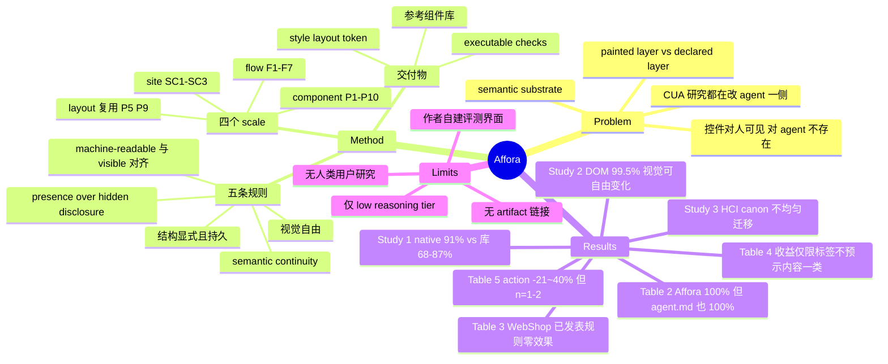

## Summary

把 CUA 研究的干预方向反转：不改 agent 去适应人类界面，而是规定界面在 DOM 里必须显式保留控件、名称、状态、可选项与结果（作者称 semantic substrate），视觉样式则自由变化。在作者自建的五个域上完成率从 46/60 (77%) 升到 60/60 (100%)，但同一张表里一个 agent.md 指令文件同样达到 60/60 (100%)。

## Problem & Motivation

Mind2Web、WebArena、VisualWebArena、SeeAct、BrowserGym、Set-of-Mark 这条线几乎都在改 reader 一侧——怎么 grounding、怎么压缩 observation、怎么标注截图。论文问的是另一侧：界面本身必须暴露什么属性，agent 才能可靠操作它，同时不限制它对人长什么样。

动机来自一个具体错配：一个控件对人「明显可点」，在 agent 收到的表示里可能根本不是 operable element，或者角色与当前状态无法恢复。作者据此把界面拆成两层——painted layer（颜色、排版、形状、间距、动效）与 declared layer（控件、名称、关系、状态、可选项、任务相关信息），后者即 semantic substrate。用 Norman 的话说，视觉外观可以对人构成强 signifier，而在 agent 收到的表示里没有对应的 signifier。

与 accessibility 的关系被明确划清而不是混为一谈：ARIA/WCAG 提供同一层地基，但它优化的是人（含辅助技术）的使用；Affora 问的是自主读者能否枚举可用动作、恢复任务状态并继续交互。作者特意声明不把 agent 与残障用户等同，只是说两者都让语义层欠规格的后果显形。

## Method

Affora 是 design system，不是模型或算法。

五条规则贯穿全系统：task-relevant structure 必须显式且持久（控件、选项、状态、结果不能只存在于交互历史里）；machine-readable 结构与可见结构对齐；presence over hidden disclosure（规划所需信息不得藏在 hover、展开、动画之后）；跨组件、步骤、页面保持 semantic continuity；视觉表达自由，只要不移除或矛盾于上述交互含义。

规则按四个 scale 展开。component scale 遵循 substrate invariant、skin variable，由 P1–P10 形式化。layout scale 不新增原则族，而是把 P5（视觉层级镜像语义层级）与 P9（结构同构）套到整页组合上。flow scale 要求界面携带读者继续任务所需的 progress、prior choices、requirements、recovery path 与 completion，由 F1–F7 与 FP1–FP5 编码。site scale 由 SC1–SC3 定义跨页面「功能↔名称↔表示」的稳定映射，约束的是语义连续性而非视觉统一。

交付物有三类：内建 substrate 的参考组件实现（forms、selection controls、dialogs、tables 等）、允许颜色与排版自由变化的 style/layout token、以及可执行检查（S1–S8 组件级、FC1–FC8 flow 级、K1–K3 site 级）。作者明说检查是 conformance floor，不是任务成功的预测器。

三个研究依次回答三个 RQ。Study 1 定位缺陷来源：60 个交互组件分别用 native HTML 与 8 个常用组件库实现，任务内容与目标固定，Figure 3 每格 3 次尝试。Study 2 固定 substrate 只变视觉：5 个组件跨 16 个主题与 6 种布局 archetype，另按有符号的五档强度扫视觉属性（从违背惯例、经中性、到强化惯例）。Study 3 把 Miller (1956)、Nielsen (1994)、Norman (2013)、Shneiderman et al. (2016) 的七条原则翻译成受控对照，任务信息固定只变设计决策，跨 3 个模型、2 个观察通道，每个复制条件目标 10 次重复。

评测用作者自建的 harness，ReAct 式 observe–reason–act 循环加有界重试，模型是 OpenAI ChatGPT 5.6 的 Luna 与 Terra 变体，均在 low reasoning tier。环境为本地 Docker 部署的 WebArena Magento 与 WebShop，加四个独立第三方应用（shadcn-admin、Ant Design Pro、MUI dashboard template、Atomic CRM）。

## Key Results

**Study 1（缺陷在哪）**：native semantic HTML 达 91%，8 个组件库落在 68.3%–86.7%。受控修复序列显示两级效果——只修语义把成功率从 43% 抬到 67%，再把 agent 相关的可选项与状态暴露出来才到 90%。作者的读法是语义正确必要但不充分，失败集中在三类表示差异：只有交互后才出现的选项、角色或状态难以恢复的控件、在渲染结构里表示微弱的交互结果。

**Study 2（视觉能变多少）**：substrate 固定时，DOM 通道 completion 99.5%，与 native 持平；pixel 92%，native 对照 94%。五档视觉线索 sweep 落在 98.7%–99.8%，且没有随线索增强而单调改善。作者据此明确拒绝「视觉线索越强越 agent-friendly」的排序，并自己指出这里的 pixel reader 是 marked-pixel、已经收到枚举目标，不能外推到纯 raw-pixel agent。

**Study 3（HCI 原则怎么变）**：canon 不均匀迁移。explicit remedy 改善恢复；额外的确认步骤增加交互成本；recognition 的价值取决于当前观察通道暴露了什么，而非信息此前是否出现过；表单分步只增加成本、没有可证的完成率收益；解释 disabled 状态跨复制无一致收益。机制解释是读者模型变了——agent 可能每步重新观察界面、跨 context 边界丢失任务状态、或从观察通道直接拿到已枚举的候选动作。

**Table 2（与替代干预对比，作者自建的五个域）**：primary set 上 baseline 46/60 (77%)、ARIA 与 structured data 45/60 (75%)、instruction file (agent.md) 60/60 (100%)、Affora 60/60 (100%)。harder set 上 baseline 28/33 (85%)、ARIA 29/33 (88%)、agent.md 32/33 (97%)、Affora 33/33 (100%)。WebMCP-style tools 在其适用动作集上 55/55 (100%)，但分母不同，论文单列且声明不是 matched comparison。

**Table 3（迁移与规则覆盖）**：Magento 三模型 deletion–restoration 中，引入定向缺陷把完成率从 33/216 (15%) 压到 16/216 (7%)，修复后回到 34/216 (16%)；重写本已合格的组件 7/40 (18%) 不变。WebShop 则把规则覆盖与实现忠实度分开：已发表规则留在 9/117 (8%) 完全不动，只有把规则集扩展到覆盖 hidden-radio idiom 后才升到 80/117 (68%)。作者自己把这次扩展定性为对新遇到 idiom 的诊断性响应，不是原规则集已泛化的证据。

**Table 4（四个独立应用）**：收益几乎全部集中在「标签不预示内容」这一个 target class——shadcn-admin 16/71 (23%) → 46/72 (64%)，Ant Design Pro 12/18 (67%) → 18/18 (100%)。其余为近零或负：shadcn-admin 的「可预测标签」组 70/89 (79%) → 66/89 (74%)、already-visible 82/88 (93%) → 81/90 (90%)；Ant Design Pro 的「可预测标签」组 baseline 为 0/79 (0%) → 11/78 (14%)；MUI 全类 95/120 (79%) → 97/120 (81%)；Atomic CRM 全类 71/98 (72%) → 70/99 (71%)。

**Table 5（完整 workflow 的交互成本）**：四个 model–channel 条件上 action 数下降 21%–40%、total token 下降 24%–41%，方向一致；reasoning token 混合，从 −58% 到 +52%。completion 只在 Luna vision 条件从 1/2 变 2/2，其余三个条件本来就是 2/2。论文自己限定：每条件只有 1–2 对成功 episode，这是交互成本降低的初步证据，不是效率增益的一般估计。

**Appendix Principle index 自报无效**：P8「One concept, one word」标为 measured, null；P6 与 F3 标为 null；SC3 标为 null with history。

## Evidence Ledger

| Claim ID | Claim | Type | Source locator | Evidence excerpt | Status |
|:--|:--|:--|:--|:--|:--|
| C1 | Study 1：native HTML 91%，8 个组件库 68.3%–86.7%（mid-tier model） | number | Sec 4.1 | "Plain semantic HTML reaches 91%, while the eight component libraries range from 86.7% to 68.3% on the mid-tier model" | source-verified |
| C2 | 修复序列：语义 43%→67%，加 choices/state →90% | number | Sec 4.1 | "correcting semantics raises success from 43% to 67%, and additionally exposing agent-relevant choices and state raises it to 90%" | source-verified |
| C3 | Study 2：DOM 99.5%，pixel 92%（native 94%） | number | Sec 4.2 | "DOM-channel completion remains at 99.5%; pixel performance is 92%, compared with 94% for native controls" | source-verified |
| C4 | 视觉线索五档 98.7%–99.8%，无单调改善 | number | Sec 4.2 | "completion ranges from 98.7% to 99.8% across the five signed strengths, without a monotonic improvement" | source-verified |
| C5 | primary set：baseline 77%、ARIA 75%、agent.md 100%、Affora 100% | comparison | Table 2 | "Baseline 46/60 (77%); ARIA and structured data 45/60 (75%); Instruction file (agent.md) 60/60 (100%); Affora 60/60 (100%)" | source-verified |
| C6 | harder set：Affora 33/33，agent.md 32/33；WebMCP 55/55 分母不同 | comparison | Table 2 | "28/33 (85%); 29/33 (88%); 32/33 (97%); 33/33 (100%); WebMCP-style tools (applicable action set) 55/55 (100%)" | source-verified |
| C7 | WebShop 已发表规则零效果，扩展覆盖后 8%→68% | number | Table 3 + Sec 6.3 | "published rules 9/117 (8%) → 9/117 (8%); extend hidden-radio coverage 9/117 (8%) → 80/117 (68%)"; "diagnostic response to a newly encountered pattern" | source-verified |
| C8 | Magento 三模型：引入缺陷 15%→7%，修复 7%→16% | number | Table 3 | "introduce targeted deficit 33/216 (15%) → 16/216 (7%); repair targeted deficit 16/216 (7%) → 34/216 (16%)" | source-verified |
| C9 | shadcn-admin：不可预测标签 23%→64%，可预测标签反降 79%→74% | comparison | Table 4 | "Predictably labelled group 70/89 (79%) → 66/89 (74%); Label does not predict target 16/71 (23%) → 46/72 (64%)" | source-verified |
| C10 | Ant Design Pro 可预测标签 baseline 0/79；MUI 与 Atomic CRM 近零 | number | Table 4 | "Predictably labelled group 0/79 (0%) → 11/78 (14%); MUI 95/120 (79%) → 97/120 (81%); Atomic CRM 71/98 (72%) → 70/99 (71%)" | source-verified |
| C11 | workflow：action −21~40%、token −24~41%，每条件仅 1–2 对成功 episode | number | Sec 6.4 + Table 5 | "reduces action counts by approximately 21–40% and total token use by 24–41%"; "With only one or two successful pairs per condition" | source-verified |
| C12 | 评测模型为 ChatGPT 5.6 Luna / Terra，均 low reasoning tier | benchmark-setting | Sec 6 | "We instantiate this harness with the OpenAI ChatGPT 5.6 Luna and ChatGPT 5.6 Terra variants, both at the low reasoning tier" | source-verified |
| C13 | Study 3：7 原则 × 3 模型 × 2 通道，每条件目标 10 次重复 | benchmark-setting | Sec 4.3 | "seven established interaction-design principles ... targeting ten repetitions per replication condition" | source-verified |
| C14 | Study 1 规模：60 组件 × (native + 8 库)，每格 3 次尝试 | benchmark-setting | Sec 4.1 + Fig 3 | "sixty interactive components using native HTML and eight commonly used component libraries"; "Each cell reports successes out of three attempts" | source-verified |
| C15 | 全文与 arXiv comments 均无代码/artifact 链接，尽管声称组件 distributed as source | license-code | abs comments + 全文链接表 | "20 pages, 8 figures"（comments 字段全部内容；正文、脚注、链接列表无仓库或项目页 URL） | source-verified |
| C16 | 单作者 Independent Researcher；五个对比域由作者自建，release workflow 为作者改编的社区模板 | benchmark-setting | 作者块 + Sec 6.1 | "Jin Gao ... Independent Researcher, San Francisco, CA, USA"; "release workflow is an author-built adaptation of a community template" | source-verified |
| C17 | Study 2 的 pixel reader 是 marked-pixel、收到枚举目标，作者禁止外推到 raw-pixel | causal-mechanism | Sec 4.2 | "Its marked-pixel reader also receives enumerated targets, so the result should not be generalized to agents that locate actions from raw pixels alone." | source-verified |
| C18 | Appendix 自报 P8 为 measured/null，P6、F3 为 null | number | Appendix Principle index | "measured, null P8 One concept, one word"; "null P6 Constraints are stated before the attempt"; "null F3 Constraints precede attempts" | source-verified |
| C19 | Limitations 自陈只测 small/mid-tier 模型，应用集中于后台与电商，检查是 conformance floor | benchmark-setting | Sec 7.5 | "We evaluate small- and mid-tier models rather than frontier systems"; "a conformance floor rather than a predictor of task success" | source-verified |
| C20 | 论文含 Generative AI 使用声明，覆盖语言编辑、结构调整与实现支持 | license-code | Generative AI Use Disclosure | "Generative AI tools were used for language editing, restructuring, and implementation support during manuscript and artifact preparation." | source-verified |

20 项高风险 claim 全部 source-verified，数字、分母与方向均与原文一致。三处需要随 claim 一起携带的边界：Studies 1–3 的聚合百分比只以散文形式出现，底层 per-cell 数据在 Figure 3–5 的图像里，因此 91% / 43% / 67% / 90% 与 98.7–99.8% 的分母无法从正文恢复，Study 1 的 "mid-tier model" 始终未命名；C16 的「自建」对五个对比域精确，但 release workflow 是在社区模板上改的；C18 的「已测量但无效」只对 P8 成立，P6 与 F3 是裸 null，附录未定义该标记的证据来源。

## Strengths & Weaknesses

**亮点**。干预方向的反转本身有价值。整条 CUA 线把界面当作给定环境去适应，这篇把界面当作设计变量，并且给出了一个可操作的划分——painted 与 declared 分离，前者自由、后者受约束。Study 2 是这个划分最有说服力的支撑：substrate 固定时，16 个主题与 6 种布局的剧烈视觉变化不损伤 DOM 通道完成率，说明「对 agent 友好」不必以牺牲视觉表达为代价，这正是设计团队采纳与否的关键顾虑。

诚实度明显高于单作者 preprint 的平均水平。agent.md 打平、ARIA 低于 baseline、WebShop 上零效果、Table 4 的负向格子、附录自报三条原则为 null——这些都留在正文和表里，而不是藏进脚注。论文还主动标注 Study 2 的 marked-pixel 边界、把 executable check 定位为 conformance floor 而非成功预测器、把 supervisability 收益标为 design implication 而非 measured claim。这些自我限定在方法论上是加分项。

**问题**。最要命的一条是核心对照自我否定：Table 2 上，一个 agent.md 文件与整套 design system 在 primary set 上都是 60/60，harder set 只差一例（32/33 vs 33/33）。一个要求重写组件库、引入 token 体系与检查套件的方案，与一个 markdown 文件，成本差若干数量级，而论文没有给出前者值得这个代价的证据。作者的措辞是两者都支持「让所需信息通过 agent 消费的表示可得」，这是准确的，但它同时说明本文的贡献不在于 substrate 这个特定机制。

泛化性被自己的实验证伪了一次。WebShop 上已发表的规则集效果严格为零（9/117 不变），只有事后针对 hidden-radio 补规则才有效。这说明规则集目前更接近对已见 idiom 的枚举，而不是可外推的原则。作者的定性是诚实的，但它把「design system」这个定位的底盘抽掉了一块。

证据强度弱。headline 的 23pp 提升来自作者自建的界面；真正独立的四个应用上，两个（MUI、Atomic CRM）是零效果，shadcn-admin 有两个 target class 为负。workflow 的效率结论建立在每条件 1–2 对成功 episode 上，全文无统计检验，论文明确声明表格颜色不代表显著性。这些数字可以当作存在性证据，不能当作效应量估计。

Target class 的分类本身不稳定。「可预测标签」这一类在 shadcn-admin 上 baseline 79% 且 Affora 后下降，在 Ant Design Pro 上 baseline 是 0/79。同一个类在两个应用上行为相反，说明它不是一个跨应用可比的变量，按它分组解释收益来源的说服力有限。0/79 这种 baseline 也提示对应任务规格可能本身有问题，而非界面缺陷。

模型覆盖是个结构性隐患。论文只测 low reasoning tier 的 small/mid-tier 变体，而 Affora 修的恰恰是「表示里信息缺失」这类问题——更强的模型更有能力从残缺表示里恢复意图。收益随模型能力衰减是一个可检验的预测，论文既没测也没讨论。这不是可以留给 future work 的细节，它直接决定这套设计在部署时还剩多少价值。

artifact 缺位。论文声称提供 plug-and-play UI building blocks、组件「distributed as source」、以及一整套 executable checks，但全文、脚注与 arXiv comments 字段都没有仓库或项目页链接。对一篇贡献主体就是 artifact 的论文，这是实质缺陷——规则的 P/F/SC/S/FC/K 编号在附录里有索引，但外部无法核验或复用任何一条。

**与本 vault 的关系**。同向最近的是 [[2607-AgentReadyWeb]]，Affora 在实验严格度上更进一步。真正的正面碰撞在 [[AgentFacing-WebRuntime]] 与 [[AFE-MiniSuite]]——那条线的前提也是「把环境设计成 dual-interface」，Affora 落在其 observe / semantic-target 轴上，novelty 窗口收窄。可区分的是 Affora 只约束 rendered DOM 的静态结构，不提供 checkpoint/restore、verify_probe、guard 这类运行时 affordance，也没有 evaluator-only 控制臂，因此那条线在 flow-level 运行时能力上仍有空间。

两个最硬的技术反驳在 vault 里已有对应笔记。[[2607-GUIStateBelief]] 的发现意味着，当结构证据与像素冲突时 agent 会强烈倾向结构且极少自我纠正——一个过期或错误的 substrate 因此比没有 substrate 更危险，而 Affora 全文没有 freshness 或 provenance 机制。[[2608-ScreenshotsOrTools]] 与 [[2510-OSWorldMCP]] 则显示暴露出来的层未必被使用，提高采纳率也未必转化为准确率；Affora 的 substrate 是被动读取而非主动调用，受这条影响小于 tool layer，但 Table 4 的近零结果是否属于同一现象，论文没有分析。反向支持 Affora 前提的是 [[2604-ToolIllusion]]：人写的语义层有效而合成的无效，说明「authored substrate」这个假设有独立证据。

vault 里没有 Liu et al. 2026（arXiv:2605.02729, Augmenting Interface Usability Heuristics for Reliable Computer-Use Agents）的笔记，那是本文最近的实验性先例，值得单独消化以判断 Affora 的增量。同样缺 WebMCP 与 llms.txt 的独立笔记。

## Mind Map

## Notes

几个值得追的点：

1. **收益是否随模型能力衰减**。这是判断 Affora 实用价值的核心检验，也是论文唯一没碰的大变量。最小实验：在同一批 Table 4 任务上换 high reasoning tier 重跑 baseline 与 Affora 两臂，看「标签不预示内容」那一类的 gap 是否收窄。如果收窄，这套设计的价值窗口就绑定在弱模型上。

2. **substrate 与 agent.md 的成本—收益对照没人做**。Table 2 已经把问题摆出来了：两者打平。真正有信息量的实验是让两者在同一批任务上分开失败——找出 agent.md 无法覆盖而 substrate 能覆盖的 case 类型（猜测是动态状态与流程中途的 recovery path，指令文件写不进运行时状态），这比再加一个 100% 的格子有用得多。

3. **stale substrate 的风险没有处理**。结合 [[2607-GUIStateBelief]]，一个声称权威的 declared layer 如果与实际渲染不同步，会成为比缺失更强的错误证据。Affora 的 executable checks 只验证属性存在，不验证属性与运行时状态一致。这是个现成的空位：把 freshness/provenance 做成 substrate 的一等属性。

4. **「可预测标签」这个 target class 需要重新定义**。它在两个应用上行为相反，当前形态不支持跨应用聚合。如果要沿用这套分类，应该按干预有效性事后聚类，而不是先验分档。

5. 对 [[AFE-MiniSuite]] 的直接影响：Affora 占住了静态 DOM substrate 这一格，该项目的差异化需要更明确地压在运行时 affordance（checkpoint/restore、verify_probe、guard）与 evaluator-only 控制臂上。建议在 related work 里把 Affora 作为最近邻处理，并把「静态结构 vs 运行时接口」写成显式的对照维度。

待读：Liu et al. 2026 (arXiv:2605.02729) Augmenting Interface Usability Heuristics for Reliable Computer-Use Agents——本文最近的实验性先例，需要它才能判断 Affora 的真实增量。
