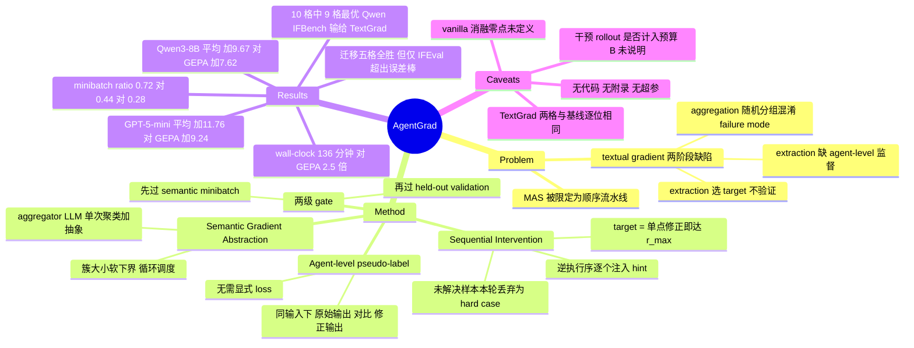

## Summary

AgentGrad 把 MAS prompt optimization 的两个环节都换成"先定位、再泛化"：对每个失败样本按逆执行序逐个给单个 agent 注入含 ground-truth 的 hint，谁的单点修正能把系统 reward 拉到 r_max 谁就是 target agent，而该 agent 注入前后中间输出的差别直接充当 agent-level pseudo-label，使 textual gradient 不再需要显式 loss；随后由 aggregator LLM 把语义相近的 sample-level gradient 聚成 semantic minibatch 并抽象成一条 generalized gradient，替代 TextGrad/GEPA 的随机分组拼接。五个 MAS benchmark 上，GPT-5-mini 平均比 no-PO 基线 +11.76 点（GEPA +9.24）、Qwen3-8B +9.67 点（GEPA +7.62），平均 wall-clock 优化时间 136 分钟、约为次快基线 GEPA（337 分钟）的 1/2.5。

## Problem & Motivation

LLM-based MAS 的表现高度依赖每个 agent 的 prompt，而 textual gradient（自然语言批评当作梯度方向）已成为 MAS prompt optimization 的主流范式。作者指出这条范式在两个阶段各有一个结构性缺陷。

**gradient extraction 阶段有两个问题。**其一，target prompt 的选择没有经过验证——现有做法要么同时更新全部 agent prompt（成本高），要么 round-robin 轮流改，都没有检验"改这一个 agent 是否真能修好这次失败"。其二，梯度是从系统级最终输出反推的，缺少对该 agent 中间输出的 agent-level 监督；作者承认这类监督在多数 MAS 设定下本来就不存在。

**gradient aggregation 阶段的问题是随机分组。**sample-level gradient 被随机凑成 minibatch 再直接拼接，常把互不相关的 failure mode 混在一起，让 prompt optimizer 拿不到一致的更新方向，产出的 prompt 泛化不了。

值得先划清楚的边界：论文的 MAS 形式化是一条固定的顺序流水线（π¹…π^N，x^n 由前序 agent 的输出构造），不是任意通信图，也没有多轮往返交互。逆序干预、"resolve 一次失败只需改一个 agent"这些设计都依赖这个链式假设。

## Method

**1）Sequential intervention 定位 target agent（§4.1）。** 先用当前 prompt 集 P 在 D_train 上跑一遍，取出失败集 F。然后从 n=N 到 n=1 逆序逐个 agent 干预：把 hint H 追加到 π^n 的 prompt 后重跑系统，凡是 reward 被拉到 r_max 的样本构成 T^n，即认定 π^n 为该样本的 target agent，并从未解决集合中移除。逆序的理由是作者"观察到失败集中在靠后的 agent"，能减少期望干预次数——但这条观察在全文没有任何数据支撑（Ledger C10）。走完 n=1 仍未解决的样本被当作 hard case 本轮丢弃，下一轮 F 从 D_train 重建时会再被捞回来。

**2）Hint 构造（§4.1）。** H 由 ground-truth y_i 或最终输出需满足的约束，加上 dataset/MAS/agent role 的描述拼成。论文强调 H 只在训练期使用，推理时部署的是不含 hint 的优化后 prompt。

**3）Agent-level pseudo-label 与梯度抽取（§4.2）。** 同一输入 x^n 下有两个输出：失败执行里的原始输出 ŷ^n 与注入 hint 后的修正输出 ỹ^n。二者之差隔离了干预引起的行为变化，于是把 ỹ^n 当作该 agent 的 pseudo-label，梯度为 δ = LLM_∇(p^n, x^n, ŷ^n, ỹ^n)。这是本文最干净的一步：标准 textual gradient 需要一个由系统级输出与 ground-truth 比较得到的显式 loss L，而这里的 ŷ/ỹ 对比隐式提供了 agent 级监督，不再需要 L。

**4）Semantic textual gradient abstraction（§4.3）。** aggregator LLM 在单次调用里同时做两件事：把 Ω^n 里语义相近的 sample-level gradient 聚成若干 semantic minibatch D_j^n，并把每簇抽象为一条 generalized gradient δ̄_j^n。簇数 M_n 由 LLM 自行决定。簇大小给一个**软**下界（不强制），并按循环调度在迭代间变化（论文给的例子是 5→3→1→5→…），意图是在"覆盖面广的粗粒度模式"与"更具体的细粒度修正"之间交替。

**5）更新与两级 gate（§4.4）。** 按 semantic minibatch 规模从大到小依次更新：候选 prompt 先在自己的 D_j^n 上评，改善了才触发在 held-out D_val 上评，两级都过才接受，否则丢弃换下一条梯度。

## Key Results

设置：五个 MAS benchmark——HotpotQA（multi-hop QA）、HoVer（claim verification）、PUPA（privacy-conscious delegation）、IFBench（instruction following）、MATH（math reasoning）。前四个的 MAS 结构、数据划分与 reward function 沿用 GEPA，MATH 沿用 MACM。backbone 为 GPT-5-mini 与 Qwen3-8B，且同一 backbone 在所有算法里同时充当 task LLM 与全部 optimizer 组件。对手是 MIPROv2 / TextGrad / GEPA 加一个 no-PO 基线。

**主结果（Table 1-2）。** GPT-5-mini 下 AgentGrad 平均比 no-PO 基线高 +11.76 点，GEPA +9.24、TextGrad +6.33、MIPROv2 +5.66；Qwen3-8B 下 +9.67，GEPA +7.62、MIPROv2 +6.27、TextGrad +6.06。四个 Improvement 列在两张表上都经独立重算复现。

但论文正文那句"AgentGrad achieves state-of-the-art performance across five MAS benchmarks on both backbone settings"逐格核对不成立：**Qwen3-8B 的 IFBench 上 TextGrad 42.52±0.45 高于 AgentGrad 41.42±0.99**，论文自己的表格也是给 TextGrad 加粗的。准确说法是 10 个格子里赢 9 个、两个 backbone 上平均增益均最高（Ledger C3，contradicted）。同一列还暴露另一件事：该格上 GEPA（37.53）与 MIPROv2（40.08）都**低于**不做任何优化的 40.82，Qwen3-8B + IFBench 是所有 prompt optimizer 集体失灵的格子，AgentGrad 也只高出基线 0.60。

**Wall-clock（Table 4，GPT-5-mini）。** AgentGrad 在全部五个 benchmark 上都是最快，平均 136 分钟，对 GEPA（337）2.5×、对 TextGrad（647）4.7×。需要注意口径：这个 2.5× 是**两列均值之比**（336.8/136.4=2.47），不是五个逐 benchmark 加速比的平均——按论文自己那行"vs. next-best"的五个数（3.2/1.6/2.0/3.0/1.4）取平均只有 2.24；而且那一行标的是 next-best，但 PUPA 的 next-best 其实是 MIPROv2、MATH 是 TextGrad，Avg. 格却填的是纯 GEPA 比值（Ledger C5）。

**消融（Table 3，HotpotQA/PUPA，GPT-5-mini）。** vanilla 67.89/85.74 → +TI 69.33/89.58（+1.44/+3.84）→ +TI+AS 70.89/92.23 → +TI+STGA 71.89/93.13 → 全量 73.89/95.17。六个增量全部重算吻合。三个组件各自为正、且 AS 与 STGA 在 TI 之上可叠加。论文未写出的两个数更能说明分工：全量相对 +TI+AS 是 +3.00/+2.94，相对 +TI+STGA 是 +2.00/+2.04。

**机制侧证据（Figure 4，数值在正文中逐字给出）。** minibatch improvement ratio（候选更新在自己那个 semantic minibatch 上改善、从而触发 validation 的比例）AgentGrad 0.72，TextGrad 0.44，GEPA 0.28；validation improvement ratio 0.27 / 0.21 / 0.14。组件层面 TI 与 AS 主要抬 minibatch ratio（0.51→0.87），STGA 用一点 minibatch ratio 换 validation ratio。这是全文最有解释力的一张图：它把"更快"和"更能泛化"拆成了两个不同组件的功劳。

**Rollout 效率（Figure 3）。** HotpotQA 上 AgentGrad 约 1,000 rollout 达到 ~70%，GEPA 需要 6,000 以上才接近同等水平，MIPROv2/TextGrad 在该水平线下持平。但同段正文写的是"on both benchmarks"，而 Figure 3 只画了 HotpotQA 一个（Ledger C16）。

**迁移（Table 5）。** 优化后的 prompt 不再训练直接用到同域未见 benchmark：2WikiMultiHopQA 51.22、EX-FEVER 33.11、PUPA-TNB 94.38、IFEval 95.00、OlympiadBench 68.33，五格全部第一。但按报告的 standard error 看只有 IFEval 一格的领先幅度超过双方 SE 之和；EX-FEVER 领先次优者（MIPROv2 32.89，不是论文行文暗示的 GEPA）只有 0.22，比任一侧 SE 都小；PUPA-TNB 的 +2.87 小于 GEPA 自己的 ±3.11（Ledger C9）。

## Evidence Ledger

| Claim ID | Claim | Type | Source locator | Evidence excerpt | Status |
|:--|:--|:--|:--|:--|:--|
| C1 | GPT-5-mini 五 benchmark 平均增益：AgentGrad +11.76 / GEPA +9.24 / TextGrad +6.33 / MIPROv2 +5.66 | number | Table 1 | "AgentGrad (Ours) 73.89 / 64.78 / 95.17 / 76.08 / 87.62 / +11.76" | source-verified（四个均值独立重算：11.762 / 9.236 / 6.330 / 5.664） |
| C2 | Qwen3-8B 平均增益：AgentGrad +9.67 / GEPA +7.62 / MIPROv2 +6.27 / TextGrad +6.06 | number | Table 2 | "AgentGrad (Ours) 60.45 / 52.11 / 91.51 / 41.42 / 85.81 / +9.67" | source-verified（重算 9.674 / 7.624 / 6.272 / 6.058） |
| C3 | "两个 backbone、五个 benchmark 全面 SOTA" | comparison | §5.2 正文 vs Table 2 IFBench 列 | "AgentGrad achieves state-of-the-art performance across five MAS benchmarks on both backbone settings" | **contradicted**——Qwen3-8B/IFBench TextGrad 42.52 > AgentGrad 41.42，论文表中该格加粗给了 TextGrad；实为 10 格中 9 格最优 |
| C4 | AgentGrad 五 benchmark 全部最快，平均 136 分钟，较 GEPA 2.5×、较 TextGrad 4.7× | number | Table 4 | "completing optimization in 136 minutes on average — 2.5× faster than GEPA … and 4.7× faster than TextGrad" | source-verified（行均值重算 136.40/336.80/647.00；比值 2.469/4.743。小瑕：MIPROv2 均值 608.60 印成 608，应为 609） |
| C5 | 2.5× 是两列均值之比，非五个逐 benchmark 加速比的平均 | number | Table 4 "Avg." 列与 "vs. next-best" 行 | "AgentGrad vs. next-best 3.2 / 1.6 / 2.0 / 3.0 / 1.4 / 2.5" | source-verified（ratio-of-means=2.469；五个 next-best 比值均值=2.241；且 PUPA/MATH 的 next-best 并非 GEPA） |
| C6 | 消融：vanilla 67.89/85.74；+TI +1.44/+3.84；AS 叠加 +1.56/+2.65；STGA 叠加 +2.56/+3.55；全量 73.89/95.17 | number | Table 3 + §5.3 | "Target identification (TI) using sequential-intervention alone yields +1.44 and +3.84 points" | source-verified（六个增量全部重算吻合） |
| C7 | HotpotQA 上 AgentGrad 约 1,000 rollout 达 ~70%，GEPA 需 >6,000 | number | §5.3 Optimization Trajectory 正文 | "achieves approximately 70% by 1,000 rollouts, while GEPA requires over 6,000 rollouts" | source-verified（数值在正文逐字给出；Figure 3 曲线未做像素读取） |
| C8 | minibatch improvement ratio 0.72 / 0.44 / 0.28；validation ratio 0.27 / 0.21 / 0.14；TI+AS 把 minibatch ratio 从 0.51 抬到 0.87 | number | §5.3 + Figure 4 caption | "a minibatch improvement ratio of 0.72 versus 0.44 for TextGrad and 0.28 for GEPA" | source-verified（值在正文逐字给出；0.51/0.87 对应哪两个消融档位论文未点名，需从图例推断） |
| C9 | 迁移到五个同域未见 benchmark 全部第一 | comparison | Table 5 | "AgentGrad achieves the best transfer performance on all five target benchmarks" | source-verified，但边界须标注：仅 IFEval 一格领先幅度超双方 SE 之和；EX-FEVER +0.22 小于任一侧 SE，且次优是 MIPROv2 32.89 而非 GEPA |
| C10 | 逆序干预 + "target agent = 单点修正即可把 reward 拉到 r_max" + 干预后输出作 pseudo-label 故无需显式 loss | causal-mechanism | §4.1-4.2, Algorithm 1 行 9-14, Eq. 3 | "our gradient requires no explicit loss; the contrast between ŷ and ỹ implicitly provides agent-level supervision" | source-verified；但"失败集中在靠后 agent"这条逆序依据是纯断言，全文无任何测量支撑 |
| C11 | Hint 由 ground-truth 或输出约束构造，仅训练期使用，推理不注入 | benchmark-setting | §4.1 Hint Construction | "H is used only at training time; the optimized prompts are deployed without any hint injection at inference time" | source-verified |
| C12 | 四个 benchmark 的 MAS/划分/reward 沿用 GEPA，MATH 沿用 MACM；同 backbone 兼任 task LLM 与全部 optimizer 组件；三 seed mean±SE | benchmark-setting | §5.1 + Table 1/2/5 caption | "the same backbone serves as both the task LLM and all optimizer components across all optimization algorithms" | source-verified，但"全部结果三 seed mean±SE"需收窄：仅 Table 1/2/5 caption 明示，Table 3 有 ± 而未声明协议，Table 4 是裸整数无 ± 无 seed 说明 |
| C13 | GPT-5-mini 下 TextGrad 的 IFBench 与 MATH 数字与 no-PO 基线逐位相同（含 SE），即零改进 | number | Table 1 Baseline 行 vs TextGrad 行 | Baseline "73.07 ± 0.60 / 76.48 ± 0.91"；TextGrad "73.07 ± 0.60 / 76.48 ± 0.91" | source-verified；Table 5 同样复现（IFEval 91.22±0.11、OlympiadBench 59.33±0.00 均与基线一致），论文对此退化运行未作任何说明 |
| C14 | 论文未提供任何代码/prompt/配置发布链接 | license-code | 全文 + references + arXiv abs comments | 无 code availability 语句 | source-verified（全文外部链接仅 NeurIPS proceedings 页与 OpenAI gpt-5-mini 文档；GitHub 字样全部属 arXiv 页面自身 UI） |
| C15 | 未说明 sequential intervention 的额外 rollout 是否计入预算 B；无 Limitations 节、无附录 | benchmark-setting | Eq. 1 / Algorithm 1 行 6、行 10；章节结构 | "while rollout budget is not exhausted do" / "s.t. #rollouts ≤ B" | source-verified（章节为 1-6 + References，13 页无附录；B 的数值、D_train/D_val 规模、各 benchmark 的 agent 数 N 均未给出） |
| C16 | §5.3 称"both benchmarks"而 Figure 3 只画了 HotpotQA 一个 | number | §5.3 首两句 vs Figure 3 caption | "Validation curves on HotpotQA of AgentGrad and 3 baselines." | source-verified（内部不一致；Figure 4 才是 HotpotQA+PUPA 平均） |
| C17 | Table 3 的 vanilla 基线是什么，论文全篇未定义 | benchmark-setting | Table 3 caption + §5.3 | "We progressively add … to a vanilla baseline." | source-verified；vanilla HotpotQA 67.89 与 Table 1 的 TextGrad 67.89 数值相同但 SE 不同（±0.80 vs ±1.31），PUPA 则 85.74 ≠ 89.72，消融的零点无法从论文确定 |

## Strengths & Weaknesses

**最有价值的一点，是把 failure attribution 从"判官打分"换成了"做实验"。** 大多数 step/agent 级 credit assignment 靠一个 LLM critic 或 PRM 去判断哪一步该负责，信号本身就会错、还会被 hack（[[Papers/2607-SEED]] 与 [[Papers/2607-EvoCUA15]] 指出的同一隐患）。AgentGrad 的 target agent 是由环境 reward 判定的：注入 hint 之后 r 是否真的到 r_max。这是一个可证伪的反事实实验，不是一次自评。这个设计的代价也很清楚——它需要 ground-truth 才能造 hint，因此只适用于有可验证 reward 的离线优化场景，和 [[Papers/2606-RHO]] 那种"无标注 validation 也要优化 harness"的路线互补而非竞争。

**pseudo-label 那一步比 target identification 更根本。** 干预不只告诉你"谁该改"，还顺手给出了"该改成什么样"——ŷ 与 ỹ 在同一输入下的对比，把一个原本需要跨越整条流水线反传的信用分配问题，压缩成一次局部的 input-output 对照。这解释了为什么它不需要显式 loss，也解释了 Figure 4 里 minibatch improvement ratio 从 0.51 跳到 0.87：梯度本来就是从"这个 agent 具体改哪句话"推出来的，候选 prompt 自然更容易在自己的 minibatch 上生效。simple 且 generalizable，是我认为这篇最值得记住的部分。

**Figure 4 的解释比主表更有信息量。** 它把 speed 与 generalization 拆给了不同组件（TI/AS 提命中率、STGA 让通过的更新更能泛化），并且诚实地承认 STGA 会让 minibatch ratio 从 0.87 掉回 0.72。这种"我的组件在某个指标上是负的"的披露，比五张全胜表格更可信。

**但成本口径没有交代清楚，这是全文最脆的一环。** sequential intervention 对每个失败样本最多要跑 N 次系统执行，这正是方法的主要额外开销；Algorithm 1 里这些干预调用的是同一个 r_P（也就是 rollout），但论文从未明说它们是否计入预算 B（C15）。这件事直接影响 Figure 3 的可读性——那张图的横轴就是 rollout 数，如果干预不计入，"1,000 rollout 达 70% vs GEPA 6,000"就不是同一把尺子。论文没有给出任何逐方法的 rollout 消耗账目。

**一处明确的 overclaim。** "两个 backbone、五个 benchmark 全面 SOTA"在 Qwen3-8B/IFBench 上不成立（C3），而论文表格自己给 TextGrad 加了粗——正文与表格互相打脸。同一格还藏着一个更值得注意的负性结果：三个 prompt optimizer 里有两个跑到了 no-PO 基线之下，说明弱 backbone + 指令跟随任务这个组合下，prompt 优化整体可能是有害的。论文对此一字未提，而这恰恰是最有信息量的 failure case。

**TextGrad 基线有两格是退化运行。** GPT-5-mini 的 IFBench 与 MATH 上，TextGrad 的数字连 standard error 都与 no-PO 基线逐位相同（C13），意味着它一次更新都没接受；Table 5 的 IFEval/OlympiadBench 同样如此。论文既未说明也未排查，而这两格直接把 AgentGrad-vs-TextGrad 的平均差距推高了。基线是否被合理调优，缺乏证据。

**可复现性接近于零。** 13 页、无附录、无代码、无 prompt 发布；预算 B 的数值、D_train/D_val 规模、各 benchmark 的 agent 数 N、cluster 大小调度的完整参数、aggregator 的 prompt 一概未给。Table 3 的 vanilla 零点甚至没有定义（C17）。全文方法依赖四个不同角色的 LLM 调用（干预、LLM_∇、aggregator、prompt optimizer），却没有一个 prompt 被公开。在这种条件下，2.5× 的加速与 +11.76 的增益都只能当作作者报告值，不具备被独立复现的条件。

**适用边界比标题窄。** "Multi Agent Systems"在本文实际等于固定拓扑的顺序流水线。逆序干预依赖执行序可枚举；"单个 agent 的修正足以解决失败"这个 target 定义在存在交互回路、agent 互相质询或并行分支的系统里会直接失效——那时失败往往是多点耦合的，走完 n=1 全被扔进"hard case"。论文把这类样本整轮丢弃（只在后续轮次靠 prompt 更新后重试捞回），但从未报告 hard case 占失败集的比例。这个数字如果很大，方法的有效覆盖面就比表格显示的小得多。

## Connections

- [[Topics/SelfEvolvingAgents-Survey]] — 该 survey 已梳理 APE → OPRO → ProTeGi/TextGrad → PromptBreeder/EvoPrompt → DSPy/MIPRO 的 prompt optimisation 谱系，并按判据把多数归为 offline optimisation 而非部署后持续演化。AgentGrad 属同一支（训练期用 ground-truth 造 hint，推理期冻结 prompt），但给这条谱系补上了"梯度来源"这一维：从系统级 loss 反推改为 agent 级反事实干预。
- [[Topics/StepCreditAssignment-Survey]] — 该 survey 的三条轴（信号从哪来 / 衡量什么 / 如何消费）正好可以套上 AgentGrad：信号来自反事实干预下的终局 reward，衡量的是"该 agent 的修正是否充分"，消费方式是 prompt 编辑而非 loss mask 或 advantage shaping。它也补上了 survey 指出的偏斜——这条线的实验场长期集中在数学域，AgentGrad 把同类判据带到了 QA / claim verification / privacy delegation。
- [[Papers/2607-HarnessBank]] — 同样用 held-out gate 挡住 regression，且同样以 GEPA 为主要对照。HarnessBank 的教训（gate 判决与 proposer 强度必须分开对齐）值得对照 AgentGrad：后者用同一 backbone 兼任 task LLM 与全部 optimizer 组件，反而规避了 proposer 强度混淆——这一点在 §5.1 是明确声明的，比 HarnessBank 干净。
- [[Papers/2608-AutoSaddler]] — 同样做失败根因诊断 + 结构化 patch + dev-set 过滤。AutoSaddler 的 patch 分布分析（无结构约束时 91.5% 的 patch 塌缩为文本编辑）解释了纯 prompt 优化器的天花板，正好是 AgentGrad 的适用边界：AgentGrad 只改 prompt，不动工具与代码层。
- [[Papers/2605-SkillOpt]] — 同构的两级 validation gate（先局部、再 held-out）与"只在严格提升时接受更新"的纪律，但优化对象是 persistent skill artifact 而非 agent prompt；该笔记已显式区分过自身与 GEPA/TextGrad。
- [[Papers/2606-RHO]] — 最直接的对立面：RHO 的出发点就是"OPRO/DSPy/TextGrad/GEPA 都需要 labeled validation metrics"，改用 self-preference 无标注优化。AgentGrad 反其道而行，把标注用得更狠（ground-truth 不只用于评分，还进入 hint 直接引导中间行为）。两篇合起来界定了这条线的标注光谱两端。
- [[Papers/2607-MetaSkillEvolve]] — 递归自改的对照：AgentGrad 演化的是被优化物（prompt），改进流程本身（干预策略、聚类调度）是写死的，按 MetaSkill-Evolve 的判据属 self-improving 而非 recursively self-improving。
- [[Papers/2508-SelfEvolvingAIAgentsSurvey]] — 其 Multi-agent 分支的 prompt 一类（AutoAgents、DSPy、MIPRO）是 AgentGrad 的直接坐标系。
- [[Papers/2607-SEED]] — 反面参照：SEED 的 Δ 度量"token 与 hindsight 建议的一致性"而非对成功的 counterfactual 贡献，笔记已指出这使 gate 无法识别有害 skill。AgentGrad 的干预恰好是真正的 counterfactual 贡献度量，这组对比是"credit 该锚定环境状态变化"的一个正例。
- [[DomainMaps/AgenticRL]] — 归入 Credit Assignment 路线（该节此前只有 step-level 的 SOLAR-RL / GRSD / ADMIRE），AgentGrad 提供了 agent-level 而非 step-level 的干预式归因；同时呼应 Pattern 3 Verifier-First——它的可行性完全建立在存在可自动判定的 reward 上。

## Mind Map

## Notes

- **最该追问的一个数**：hard case（走完 n=1 仍未被任何单点干预解决的失败）占失败集的比例。论文一次也没报。这个比例直接决定了"改一个 agent 就够"这个假设在真实 MAS 上的覆盖率；若它很高，说明多数失败是耦合的，AgentGrad 只在容易的那部分失败上工作，而主表的增益就带了幸存者偏差。
- **一个自然的扩展方向**：现在的干预是单点的（一次只改一个 agent），因此对耦合失败结构性失效。把干预从单点扩到"最小修正集"（k>1 的 agent 子集）会立刻面临组合爆炸，但逆序 + 贪心很可能能拿到一个可用的近似——这是个 formulation 层面的开口，而不只是加实验。
- **与 [[Papers/2606-RHO]] 的组合值得想**：AgentGrad 的干预需要 ground-truth 造 hint，RHO 用 self-preference 完全不要标注。中间地带是：用 self-consistency 或多数投票伪造 hint 做干预，只保留那些"干预后 reward 变化足够显著"的样本。这样能把反事实归因的纪律带到无标注场景，同时用干预的显著性过滤掉伪标签噪声。
- **Figure 4 那个解释链需要复核**："更高的 minibatch improvement ratio 直接转化为单位时间更多的 rollout 使用量，因此解释了 wall-clock 加速"——这条因果只在"所有方法都跑满同一个预算 B"时成立（那样消耗更快就是结束更早）。论文既没说预算是否对齐，也没给各方法的终止 rollout 数。在拿这条机制解释去引用之前，需要先确认口径。
- Qwen3-8B + IFBench 那一格（三个 optimizer 有两个跌破 no-PO 基线）是全文最有信息量的负性结果，却被完全略过。"弱 backbone 上 prompt 优化可能有害"如果能在更多任务上复现，比这篇的正面结论更值得写成一篇。
