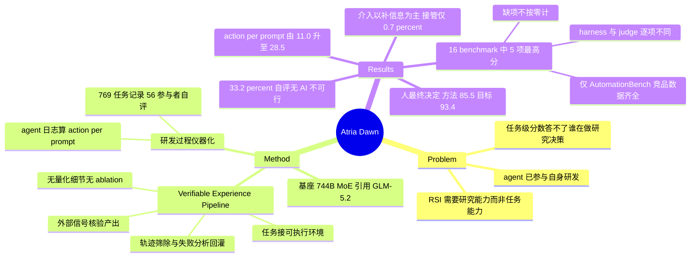

## Summary

Atria Dawn Preview 是在一个 744B MoE 基座（论文引用为 Z.ai GLM-5.2）上做 agentic post-training 的模型，配方称作 Verifiable Experience Pipeline——每个训练任务接到真实可执行环境，产出用外部信号核验，只有"任务—轨迹—产物—验证证据"链条完整的经验才进入训练。16 个 benchmark 中 5 项取得所报最高分，但这 5 行里只有 AutomationBench 的竞品数据是齐的，各 benchmark 的 harness 与 judge 互不相同，论文自陈缺项不按零计。真正的独有增量不在模型而在把自身研发过程仪器化：56 名参与者的 769 条任务记录加 agent 日志，量化出"agent 提方案、人做决定"的分工——方法/参数决策中人拿 85.5% 的最终选择权，目标/范围上拿 93.4%。

## Problem & Motivation

论文的出发点不是"再涨几个点"，而是一个 benchmark 分数答不了的问题：在一个真实的模型研发项目里，是谁在识别值得做的问题、在候选方法中做选择、解释不确定的结果、决定下一步往哪走？任务级性能只说明 agent 能完成被指派的工作，说明不了它能否推动研究本身前进。

作者把这个问题挂在 recursive self-improvement（RSI）的框架下：更强的模型更好地参与研发，产出更强的后继模型，形成自我强化的循环。他们的判断是这个循环目前并未闭合——§3.2 明确论证，agent 能执行实验、也能起草研究计划，但"实验做完了"不自动告诉你该不该改进路线、回头质疑假设、还是换方向；而且在训练任务上变强不等于在"发展自己的后继者"上变强。于是论文同时做两件事：发布一个模型，以及把这个模型的研发过程本身当作人机协作的案例来量化。

值得先记下的张力：标题叫 "The Dawn of Agentic Superintelligence"，正文 §3.2 与 §5 却系统性地论证 AI 尚不具备自持 RSI 能力、人类判断仍不可替代。正文的分寸感明显强于标题。

## Method

### Verifiable Experience Pipeline（训练）

核心约束是"经验必须可外部核验"。一次 rollout 中 agent 观察环境状态、选工具、检查工具输出、根据反馈修正动作；最终产出用领域相关的外部信号判定——可执行测试、实验指标、文件与应用状态、几何检查、来源支持，或人定义的判据。随后做 trajectory curation，删掉不完整、自相矛盾、重复或行为无效的样本，保留"任务—轨迹—产物—验证证据"之间的链接；只有链条完整的经验才被吸收为模型的可复用能力。

失败分析反过来驱动任务构造与环境改进：工具选择失当、验证不完整、证据缺失、恢复失败这类反复出现的问题，会催生新的任务与质检项；失败的 run 在结果能被独立确认时也可以当诊断样例用。长流程的记录额外包含起任务、查日志与产物、改执行计划。

需要明说的是：**§2.1 全节只有三段散文，没有任何量化信息**——不给训练数据规模、不给 RL 算法、不给 compute、不给超参、不给任何 ablation。这一节能支撑的只是"配方的设计意图"，支撑不了"这个配方带来了多少增益"。

### 评测口径（Appendix B，关键）

Table 1 的 caption 写明结果是"as reported on the official release website"。Appendix B 给了每个 benchmark 的协议，读下来 harness **并不统一**：

| 口径问题 | 具体内容 |
|:--|:--|
| 自建 harness | DeepSearchQA / BrowseComp / WideSearch 三项全部走作者的 in-house harness（search/visit/python 工具、500 步、256K 上下文、64K 输出）；Atria 的 5 项"最高分"里有 2 项落在这组 |
| 各模型 harness 不同 | Workspace-Bench(-Lite)：GPT 系走 Codex，其余模型走 Claude Code。Terminal-Bench 2.1：GPT 系用 Terminus 2；且**所报 Claude Opus 5 配置在部分任务上回落到 Opus 4.8** |
| judge 各不相同 | Doubao Seed 2.0 Lite（Workspace-Bench）、glm-5.3（GDPval）、Grok-4.3（JobBench）、GPT-5.5（DeepResearch Bench II）、GPT-5.2（τ³-Bench 的 user simulator 与 judge） |
| 统一 harness 的少数项 | SWE-bench Pro 全部走 OpenHands v1.23.0（断网、抹掉 git history）；SkillsBench 全部走 OpenHands/AgentCompass，79 题，三次取平均；DeepResearch Bench II 全部走 Claude Code，四小时上限 |

两处可留意的利益相关：GDPval 用 glm-5.3 当 judge，而 GLM 5.3 本身是表中的对比模型之一；Atria Dawn 的基座又是同门的 GLM-5.2。

### 研发过程的仪器化（论文的方法论新意所在）

两条数据源：**任务记录**——56 名参与者按任务填写的回顾式问卷，覆盖是否用 AI、无 AI 情况下需要多少工时或是否根本不可行、方案由谁提出 / 由谁拍板（分目标与范围、方法与参数、验收标准三类）、最主要的困难如何被推进、AI 产出的处置与修订由谁执行；**agent 日志**——用于计算每位参与者过去七个日历日的 agent action 总数除以 human prompt 总数。

这个设计里有价值的一点是把"谁提议"和"谁选择"拆开量化，而不是把整个任务粗暴归给人或 AI 一方。局限也来自同一处：所有角色归属与"无 AI 是否可行"都是参与者自评、事后回忆、无对照组、无盲测。

## Key Results

### 1. Benchmark（Table 1，16 项）

| Benchmark | Atria Dawn | DeepSeek V4 Pro 0813 | KIMI K3 | Qwen 3.8 Max | GLM 5.3 | GPT 5.6 sol | Claude Opus 5 |
|:--|--:|--:|--:|--:|--:|--:|--:|
| AutomationBench | **53.8** | 41.7 | 45.9 | 49.7 | 49.2 | 45.7 | 49.4 |
| BFCL v4 | **77.0** | 71.4 | 69.1 | – | 74.1 | – | – |
| CyberGym | **86.5** | 83.3 | 78.7 | 73.8 | 84.5 | 83.6 | – |
| DeepSearchQA | **96.0** | – | 95.9 | – | 94.7 | 93.2 | – |
| BrowseComp | **92.5** | 83.4 | 91.2 | – | – | 92.2 | 90.8 |
| Workspace-Bench-Lite | 68.2 | 58.1 | 65.8 | 67.4 | 67.7 | 60.5 | **70.1** |
| SkillsBench | 66.4 | 65.0 | 51.9 | **66.7** | 63.3 | 62.5 | 63.7 |
| Workspace-Bench | 65.0 | 55.7 | 60.6 | 63.9 | 63.9 | 56.0 | **65.8** |
| MLE-bench Lite | 86.2 | 86.8 | 85.8 | 81.3 | 80.8 | **88.9** | 88.0 |
| WideSearch | 81.9 | – | 79.6 | 81.9 | 82.7 | **83.3** | – |
| DeepResearch Bench II | 51.1 | 46.6 | 51.3 | 49.2 | 52.7 | 50.7 | **54.1** |
| τ³-Bench Banking | 41.2 | 44.3 | 37.1 | **55.2** | 40.2 | 46.9 | 48.7 |
| Terminal-Bench 2.1 | 78.3 | 78.7 | – | 89.3 | 85.4 | 85.1 | **90.2** |
| GDPval | 1583 | 1517 | 1611 | 1722 | 1667 | 1682 | **1768** |
| SWE-bench Pro | 59.6 | 58.3 | 61.6 | 65.1 | 60.3 | 61.4 | **74.7** |
| JobBench | 50.3 | 54.1 | 54.3 | 52.7 | 58.2 | 45.4 | **68.0** |

**"最高分 5 项"的口径要看清**。这 5 项是 AutomationBench、BFCL v4、DeepSearchQA、BrowseComp、CyberGym，但：

- 论文明写 "Rankings refer to the available entries in each row; missing results are not treated as zero"。5 行里**只有 AutomationBench 七个模型全部有数**（领先亚军 Qwen 3.8 Max 4.1 分，是唯一在完整对照下的明确胜出）。BFCL v4 缺 3 个、DeepSearchQA 缺 3 个、BrowseComp 缺 2 个、CyberGym 缺 Claude Opus 5。
- BrowseComp 的 92.5 只比 GPT 5.6 sol 的 92.2 高 **0.3 分**，且跑在自建 harness 上、未报多次 run 的方差。DeepSearchQA 的 96.0 比 KIMI K3 的 95.9 高 0.1 分。这类"最高分"的判别力接近于零。
- 反过来，落后幅度大的都在长程专业交付与工程执行：SWE-bench Pro 59.6 vs 74.7、JobBench 50.3 vs 68.0、GDPval 1583 vs 1768（均为 Claude Opus 5）、Terminal-Bench 2.1 78.3 vs 90.2、τ³-Bench Banking 41.2 vs 55.2（Qwen 3.8 Max）。论文自己承认 GDPval 与 JobBench "retain the clearest headroom"。

**全文没有任何 ablation**，也没有基座对照——Verifiable Experience Pipeline 到底买来了什么，表里读不出来。

### 2. 与基座的对照缺席（本笔记据 Table 1 推算，非论文断言）

论文从不报 GLM-5.2 基座的分数，表中最接近的参照是同门的 GLM 5.3。逐行相减：Atria 在 9 项领先（MLE-bench Lite +5.4、AutomationBench +4.6、SkillsBench +3.1、BFCL v4 +2.9、CyberGym +2.0、DeepSearchQA +1.3、Workspace-Bench +1.1、τ³ Banking +1.0、Workspace-Bench-Lite +0.5），6 项落后（GDPval −84、JobBench −7.9、Terminal-Bench −7.1、DeepResearch Bench II −1.6、WideSearch −0.8、SWE-bench Pro −0.7），BrowseComp 无 GLM 5.3 数据。形状是：search / tool-call / 安全类有增益，terminal 与长程专业交付类反而更弱。但 **GLM 5.3 ≠ GLM-5.2，这不是受控消融**，只能当一个弱信号读。

### 3. 769 条任务记录（论文最有信息量的部分）

覆盖率：769 条记录 / 56 名参与者；739 条对"是否用 AI"有明确回答，其中 713 条（96.5%）用了 AI。

- **可行性**：455 条"已完成且有可用回答"的 AI 辅助任务中，151 条（33.2%）被自评为"无 AI 则不可行"，来自 56 人中的 27 人。作者据此区分"省下的工时"与"本来根本不会被尝试的工作"。
- **提议 vs 决定**：方法与参数决策上，"AI 提议、人选择"是最常见模式，占 55.4%；人在方法/参数上握有 85.5% 的最终选择权，目标/范围 93.4%，验收标准 81.9%；AI 的最终决定份额始终在 6.1%–9.2% 之间。AI 的**提议**份额随决策类型剧烈变化（目标/范围 16.9% → 方法/参数 55.4%，三倍多的摆幅），但**决定**份额几乎不动。在那 151 条"无 AI 不可行"的任务里，人选定最终目标的比例反而更高（144/151 = 95.4%）——依赖 AI 的程度并不随 AI 的决策自主性同向移动。
- **卡住之后怎么走**：588 条有记录困难的任务中，76.0% 靠人介入推进，23.0% agent 自行恢复，1.0% 未解决。人介入的构成才是关键：补上下文/澄清需求 35.2%、诊断问题或换方法 34.7%，而人直接动手的部分很少——局部编辑 3.2%、接管 0.7%。论文据此说"人的帮助改变 agent 所知的概率，约是改变谁来干活的 18 倍"。
- **产出修订**：627 条有明确处置的任务中 354 条（56.5%）经过实质修订；这 354 条里 75.4% 是人给反馈、AI 自己改，19.2% 是人直接编辑。合计 95.9% 的 AI 产出以某种形式进入了交付物，只有 1.0% 被弃用。
- **自主度趋势**：2026-08-07 至 09-04，22 人队列（每日 21–22 人有效）的"agent action 数 / human prompt 数"日中位数从 11.0 升到 28.5（每人取过去七个日历日的比值）。论文自己给了正确读法：四分位距同期变宽，移动不均匀；而且既然人仍握有 85.5% 的决定权，这个比值上升意味着**每一次人类判断被摊到了更多 agent 动作上**，不等于自主性提高。

### 4. Case study（作者自陈是 selected demonstrations，非平均成功率）

- **天气预报**：关闭网络搜索，处理 >100 GB 气象数据，实现 >0.4B 参数的 ViT 类网络，训练 45,000 步，建模 69 个气象变量。图注明写"不报预报精度"。
- **GDN decode 优化**：从 Triton 切到原生 CUDA，七个代表性 batch size 上基线与候选延迟求和之比为 1.46×；论文自述这是开发期测量，正式 54 个 workload 中 52 个通过但缺完整正式均值，**该比值不是最终 benchmark 分数**。
- **MiniOS**：一次记录在案的 run 从空工作区起约 20 分钟构建出含串口 shell、磁盘访问、持久化文件系统与解释器的系统，并跨两次 QEMU 会话验证了持久化与 autorun。
- 另有 CAD（四缸发动机、人形机器人、关节模组、火箭）、报告与 slides 生成、以及隔离环境中的 Web 漏洞诊断—修复—复验。图注同样声明 CAD 视图"不是机械或制造验证"。

## Evidence Ledger

| Claim ID | Claim | Type | Source locator | Evidence excerpt | Status |
|:--|:--|:--|:--|:--|:--|
| C1 | 基座为 744B MoE，引用指向 Z.ai GLM-5.2 的 HF model card | number | §1/§2；References "Z.ai (2026)" | "Built on a 744-billion-parameter mixture-of-experts foundation model (Z.ai, 2026)" | source-verified |
| C2 | 16 项中恰好 5 项取得所报最高分：AutomationBench 53.8 / BFCL v4 77.0 / DeepSearchQA 96.0 / BrowseComp 92.5 / CyberGym 86.5 | sota-novelty | §2.2, Table 1 | "achieves the highest reported score on five of them"；Table 1 加粗行与此一致 | source-verified |
| C3 | 这 5 行中只有 AutomationBench 竞品数据齐全，其余各有缺项，且论文明说缺项不按零计 | benchmark-setting | Table 1, §2.2 | "Rankings refer to the available entries in each row; missing results are not treated as zero." | source-verified |
| C4 | BrowseComp 领先次高的 GPT 5.6 sol（92.2）仅 0.3 分 | number | Table 1 | Atria 92.5（加粗）；GPT 5.6 sol 92.2 | source-verified |
| C5 | DeepSearchQA / BrowseComp / WideSearch 全部使用作者自建 harness | benchmark-setting | Appendix B | "in-house harness that provides search, visit, and python tools... 256K-token context window" | source-verified |
| C6 | 至少两项 benchmark 的 harness 因模型而异；Terminal-Bench 所报 Claude Opus 5 在部分任务回落到 Opus 4.8 | benchmark-setting | Appendix B | "GPT models run in Codex, while all other models run in Claude Code"；"Claude Opus 5 configuration falls back to Opus 4.8 on a subset of tasks" | source-verified |
| C7 | judge 模型逐 benchmark 不同（Doubao Seed 2.0 Lite / glm-5.3 / Grok-4.3 / GPT-5.5 / GPT-5.2） | benchmark-setting | Appendix B 各小节 | "LLM Judge (glm-5.3)"；"Grok-4.3 serves as the LLM judge" | source-verified |
| C8 | 多项落后幅度显著：SWE-bench Pro 59.6 vs 74.7、JobBench 50.3 vs 68.0、GDPval 1583 vs 1768、Terminal-Bench 78.3 vs 90.2、τ³ Banking 41.2 vs 55.2 | number | Table 1 | 加粗项与上述数值一致 | source-verified |
| C9 | 769 条记录 / 56 人；739 条有明确 AI 使用回答，713 条（96.5%）用了 AI | number | §4 | "Of the 739 tasks with a clear response about AI use, 713 involved AI, or 96.5%." | source-verified |
| C10 | 455 条已完成 AI 辅助任务中 151 条（33.2%）自评"无 AI 不可行"，来自 27/56 人 | number | §4.1 | "151 were reported as infeasible without AI, or 33.2%... from 27 of the 56 participants." | source-verified |
| C11 | 该数字为回顾式参与者自评（固定 scope/quality/resources），非受控或随机化对照 | causal-mechanism | §4.1 | "we asked participants in the task review whether they could have completed their own part of the work without AI" | source-verified |
| C12 | 人的最终决定份额：方法/参数 85.5%、目标/范围 93.4%、验收标准 81.9%；AI 最终决定份额在 6.1%–9.2% | number | §4.2 | "humans made the final choice in 85.5%... AI made the final choice in 9.2%"；"stays between 6.1% and 9.2%" | source-verified |
| C13 | 55.4% 在 §4.2 同时被用作"AI 提议+人选择"的联合占比与"AI 提议份额"；§6 又以 64.6% 表述 567 条方法与决策中的 AI 提议率 | number | §4.2, §5.1, §6 | "'AI proposes, human selects'... 55.4%"；"AI's share of proposals ranges... to 55.4%"；"AI proposed 64.6%" | source-verified（三处表述在原文中未被调和，见 Notes） |
| C14 | 588 条有困难记录的任务：76.0% 靠人介入、23.0% agent 自恢复、1.0% 未解决；补上下文 35.2%、诊断/换方法 34.7%、局部编辑 3.2%、接管 0.7% | number | §4.3, Figure 9 | "76.0% moved forward through human intervention... only 1.0%"；"3.2% and takeover at 0.7%" | source-verified |
| C15 | 627 条中 354 条（56.5%）经实质修订；其中 75.4% 由 AI 依人类反馈改、19.2% 人直接改；95.9% 产出进入交付物 | number | §4.3, Figure 10 | "354 involved substantive revisions, or 56.5%"；"75.4%... 19.2%... 95.9%" | source-verified |
| C16 | agent action / human prompt 的日中位数 2026-08-07→09-04 从 11.0 升至 28.5，22 人队列（每日有效 21–22 人），七日滑窗，四分位距同期变宽 | number | §4, Figure 6 | "rose from 11.0 at the start of the interval to 28.5 at the end"；"21–22 participants each day" | source-verified |
| C17 | GDN 案例 1.46× 为开发期测量；54 个正式 workload 通过 52 个但缺完整正式均值，该比值非最终 benchmark 分数 | number | §2.3 | "52 of 54 formal workloads have passed, but a complete formal mean is unavailable" | source-verified |
| C18 | 天气案例：关搜索、>100 GB 数据、>0.4B 参数 ViT、45,000 步、69 个气象变量；图注声明不报预报精度 | number | §2.3, Figure 2 caption | "45,000 steps to model 69 meteorological variables"；"does not report forecast accuracy" | source-verified |
| C19 | MiniOS 案例：空工作区起约 20 分钟，含串口 shell、磁盘访问、持久文件系统与解释器，跨两次 QEMU 会话验证 | number | §2.3 | "builds MiniOS in approximately 20 minutes... across two QEMU sessions" | source-verified |
| C20 | §2.3 案例自陈为 selected demonstrations 而非平均成功率估计；全文无独立 Limitations 章节 | benchmark-setting | §2.3, 目录 | "These are selected demonstrations rather than estimates of average task success" | source-verified |
| C21 | Table 1 结果取自 "official release website" | benchmark-setting | Table 1 caption, §2.2 | "as reported on the official release website" | source-verified |
| C22 | 代码/项目地址位于 arXiv Comments 字段 | license-code | arXiv abs 页 Comments | "23 pages, 10 figures, this https URL" → github.com/atria-asi/Atria-Dawn-Preview | source-verified |
| C23 | 署名为 Atria Team，Project Lead 为 Honglin Guo 与 Tao Gui，通讯至 fudan.edu.cn；机构 logo 含 ECNU/HIT/CASIA/ISCAS/RUC/Shanghai AI Lab | license-code | 标题区, Appendix A.1 | "Correspondence: tgui@fudan.edu.cn, qz@fudan.edu.cn" | source-verified |
| C24 | 研发中大量使用 Codex yolo 模式与 Claude Code skip-permissions 模式，权限边界由便利性而非审慎分配决定 | causal-mechanism | §5.2 Open Challenge 4 | "Convenience, rather than any deliberate allocation of authority, is what set the boundary in practice." | source-verified |
| C25 | MLE-bench Lite 的 86.2 为 HumanRank 分（Claude Code、12 小时上限），且 Atria 非该项最高分（GPT 5.6 sol 88.9） | number | Table 1, Appendix B | "Results are reported as HumanRank scores"；Table 1 加粗 GPT 5.6 sol 88.9 | source-verified |

> 独立 verifier 复核了以上全部 25 条，均为 source-verified。`source-verified` 仅表示 primary source 确实包含该信息，不表示结果已被独立复现。本笔记中"与 GLM 5.3 的逐行差值"一段为笔者据 Table 1 自行推算，论文未做此对照，不计入 ledger。

## Strengths & Weaknesses

**把"谁提议"和"谁决定"拆开，是这篇最该被记住的方法论动作。** 当下关于"AI 研究员"的讨论几乎都栽在一个粗糙的二分上——任务是 AI 做的还是人做的。这篇用 769 条记录给出的答案是：这个问题本身问错了。AI 的提议份额随决策层级从 16.9%（目标/范围）摆到 55.4%（方法/参数），三倍多的摆幅；而它的最终决定份额从头到尾卡在 6.1%–9.2%。变化的是谁生成选项，不是谁挑选项。更有说服力的是那 151 条"无 AI 不可行"的任务——按朴素直觉，最依赖 AI 的任务应该也是 AI 自主性最高的任务，实际恰好相反，人选定最终目标的比例升到 95.4%。这个反向结果不是作者能轻易编出来的，它对"依赖度 = 自主度"这个隐含假设构成了直接反例。

**人介入的构成比频率更有信息量。** 76% 的困难靠人推进，听上去像人还在干活；拆开看，35.2% 是补上下文、34.7% 是诊断换法，而真正上手的局部编辑 3.2%、接管 0.7%。稀缺的是判断不是执行。同一逻辑解释了那条容易被误读的曲线：agent action / human prompt 从 11.0 涨到 28.5，作者自己拒绝把它读成"自主性上升"——人的决定权份额没动，所以这条曲线的意思是**每一次人类判断现在要穿过更长的 agent 工作链**。这恰恰是 §5.2 担心的东西：权威还在人手上，但人已经没法细看自己签字的那条链了。这个"责任—可审查性"剪刀差，比论文里任何 benchmark 数字都更值得带走。

**模型那半篇几乎不可用作证据。** §2.1 三段散文，零量化：不给数据量、不给 RL 算法、不给 compute、不给超参。全文零 ablation。最致命的是没有基座对照——论文引用 GLM-5.2 作基座却从不报它的分数，于是 Verifiable Experience Pipeline 到底买来了什么，表里读不出来。我拿同门的 GLM 5.3 做了逐行差值（9 项领先 6 项落后，增益集中在 search/tool-call/安全，terminal 与长程专业交付反而更弱），但 5.3 不是 5.2，这只是弱信号，不能当消融用。

**"5 项最高分"经不起细看。** 这 5 行里只有 AutomationBench 七个模型全部有数，也只有它的领先幅度（4.1 分）算得上明确；BFCL v4 缺 3 个竞品、DeepSearchQA 缺 3 个、BrowseComp 缺 2 个、CyberGym 缺 Claude Opus 5，而论文明说缺项不按零计——换言之"最高分"是在一个由数据可得性决定的子集上定义的。再加上 DeepSearchQA 领先 0.1 分、BrowseComp 领先 0.3 分且跑在自建 harness 上、无多 run 方差，这两项的判别力接近于零。Appendix B 的诚实反而放大了问题：同模型在不同 benchmark 用不同 harness（Codex vs Claude Code）、judge 换了五个、Terminal-Bench 里"Claude Opus 5"实际上是 Opus 5 与 Opus 4.8 的混合配置。作者愿意把这些写进附录值得肯定，但写清楚了不等于可比。

**§4 的方法学天花板要认。** 全部角色归属与"无 AI 不可行"都是参与者事后自评，无对照组、无盲测、无 inter-rater 一致性。"无 AI 不可行"尤其难——它要求受访者对一个反事实做估计，而人对"我本来能不能做成"的判断系统性乐观或悲观都不奇怪。分母还一路在变：769 → 739（有明确 AI 回答）→ 455（已完成且可用）→ 588（有困难记录）→ 627（有处置记录），每一步的缺失都没有报告，缺失是否与结果相关无从判断。加上样本是同一家机构、同一个项目、同一个月的 56 个人，外推到别的研发组织是没有依据的。这些不是致命伤，但它把 §4 的结论从"发现"降格为"一个有量化的案例观察"——这也正是作者自己用的措辞（"an initial perspective"）。

**标题与正文的落差值得单独记一笔。** 叫 "The Dawn of Agentic Superintelligence"，正文 §3.2 与 §5.1 却系统地论证 agent 提的多是研究者已固定方向内的变体、失败教训留在 session 里而没有内化、"在训练任务上变强不等于在发展后继者上变强"。这是一篇结论克制的论文穿了一件不克制的外衣。§5.2 那句关于 Codex yolo 模式与 Claude Code skip-permissions 的自陈——"Convenience, rather than any deliberate allocation of authority, is what set the boundary in practice"——是全文最有价值的一句坦白，也是对整个行业当前实践的准确描述。

**对我的用处**：§4 的数字可直接作为"人在 agentic 研发回路中的位置"的经验锚点，尤其是提议/决定分离、以及 18:1 的信息型介入 vs 接管比。模型那半篇当作 release note 读即可，不要引用为方法证据。

## Mind Map

## Notes

**原文内部不一致（verifier 独立复核确认，非笔记转述错误）**：55.4% 在 §4.2 被同时用于两个不同的量——"AI 提议、人选择"这一联合模式在方法/参数决策中的占比，以及"AI 的提议份额"；§5.1 沿用后一种读法（"agents proposed the option in 55.4% of method and parameter decisions"）；而 §6 结论又写"Among 567 reported methods and decisions, AI proposed 64.6%"。若 64.6% 是方法/参数上 AI 的提议总份额，则它与 55.4% 的差（约 9.2 个百分点）恰好等于"AI 最终决定"的份额，逻辑上自洽；但原文从未做这个说明，也没说清 567 这个总体与 §4.2 讨论的方法/参数决策是否同一批。引用这组数字时应写"§4.2 的 55.4% 指 AI 提议+人选择的联合占比"，不要直接当作 AI 提议率。

**另一处小算术**：§4.3 写 "only 1.0% were not adopted and 3.2% were used for ideas alone, so 95.9% of outputs entered the deliverable"，100 − 1.0 − 3.2 = 95.8，与 95.9 差 0.1，应是底层计数取整所致，不影响结论。

**机构归属为推断**：论文按 "Atria Team" 署名，无逐作者 affiliation 映射。frontmatter 的 institute 依据是标题区的机构 logo（ECNU、HIT、CASIA、ISCAS、RUC、Shanghai AI Lab）加通讯邮箱（fudan.edu.cn），以及 Appendix A.4 顾问名单的已知单位；具体作者与单位的对应关系原文未给。

**与 vault 的连接**——第三篇"标题谈 RSI、正文不 claim RSI"的 2026 技术报告：
- [[2607-FrontisMA1]]：本篇 MLE-bench Lite 的 HumanRank 计分法直接引用它（Yang et al., 2026b）。FrontisMA1 同样在 Limitations 中明确不 claim 已实现 RSI，全文只训到 generation 1。
- [[2609-NeoHorse1]]：自陈只跑完一轮 evaluation–selection–update，"递归从未真正发生"。
- 三者合起来是一个值得追的 pattern：2026 年下半年的 RSI 类报告，**标题的强度与正文的克制系统性背离**，而它们各自缺的都是同一样东西——把"任务能力提升"与"研究能力提升"分开测量的手段。Atria 的 §5.1 把这一点说得最清楚（"progress on general benchmarks does not reveal the research capabilities"），却也同样没有提出测量方案。这正是一个空白：**能否设计一个直接测"研究能力增量"而非"任务成绩增量"的评估？**
- [[9905-MixedInitiative]]：Horvitz 1999 的 mixed-initiative 原则与本文 §4.2 的"提议/决定分离"是同一结构的两次表述，相隔 27 年。Horvitz 讲的是界面何时该主动、何时该让位；Atria 的数据给出了这个问题在 agentic 研发场景下的经验分布。值得考虑把本篇的数字补进 `hci` 线索。
- [[2608-CoEvolutionSurvey]]、[[Topics/SelfEvolvingAgents-Survey]]：本篇的 Open Challenge 2（经验停留在 session 内、无法转为内在能力）与该 survey 的核心张力一致，可作为一条来自真实工业研发的经验证据补入。

**留待验证的疑问**：
1. GDPval 用 glm-5.3 作 judge，而 GLM 5.3 既是对比模型、又与 Atria 的基座同门（GLM-5.2）。论文未讨论这一潜在的 judge 偏好问题。Atria 在该项本就落后，所以对结论影响有限，但口径上应当被指出。
2. §2.1 说"只有链条完整的经验才进入训练"，但没有给出被筛掉的比例。若 curation 的通过率很低，这个 pipeline 的真实成本（环境搭建 + 验证器构造）可能是它最大的实际门槛，而这恰恰是论文完全没披露的部分。
3. code 链接指向 `atria-asi/Atria-Dawn-Preview`，但正文从未提及该仓库，仅出现在 arXiv Comments 字段。仓库内容（是否放权重、是否放 pipeline 代码）需另行核实——若含实现，本篇符合 `repo-digest` 的候选条件。
