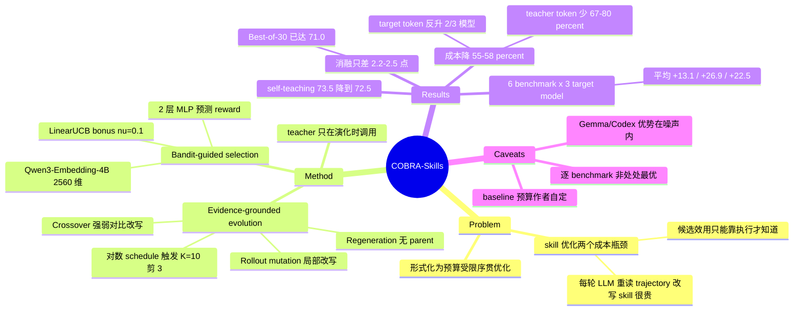

## Summary

把 agent skill 优化形式化为"固定评估预算下、候选集动态演化的序贯优化"，用 contextual bandit（neural reward predictor + LinearUCB bonus）决定每轮评估哪个候选 skill，并周期性地用 regeneration / rollout mutation / crossover 三个 evidence-grounded 算子替换低优先级候选。在 6 个 benchmark × 3 个 target model 上平均分优于 SkillOpt，同时把总优化成本降低 55%–58%。

## Problem & Motivation

Agent skill（写成 SKILL.md 之类的可复用文本过程性知识）现在主流做法是从真实 trajectory 里归纳，再用 generate–evaluate–refine 循环迭代精炼。这条路有两个成本瓶颈：**候选效用只能靠执行才能知道**，于是大量预算花在最终被证明没用的 skill 上；**refine 本身也贵**，因为每轮都要让 LLM 重新读 trajectory、诊断失败、改写 skill。

作者的 framing 是：在有限算力和有限任务样本下，真正的问题不是"怎么写出更好的 skill"，而是**怎么分配评估预算、怎么复用已有执行证据**。"给一堆效用未知的候选分配有限评估"天然是 bandit 问题；而 skill 会被不断演化出新候选，arm 集合逐轮变化且可用 embedding 描述——这正是 contextual bandit 的设定。

## Method

**问题形式化**：给定小规模优化集 $\mathcal{D}_{\mathrm{opt}}$ 和初始 no-skill trajectory $\mathcal{T}_0$，在固定 $T$ 轮预算内搜索能泛化到同分布未见样本的 skill $s^\star$。target model 全程冻结，只改文本 skill。

**Bandit-guided selection**。每个候选 skill $s$ 用固定 embedding model 映射为 $z_s = \phi(s)$（Qwen3-Embedding-4B，2560 维，L2 归一化）。优先级分数是两项之和：

- exploitation：一个 $2560 \to 64 \to 1$ 的两层 MLP $f_\theta$ 预测 reward，每轮评估后重新初始化并在全部历史上重拟合 50 个 full-batch epoch；
- exploration：LinearUCB 式置信上界 $b_t(z_s) = \nu\sqrt{z_s^\top A_{t-1}^{-1} z_s}$，$A_{t-1} = \lambda I + \sum z_{s_i} z_{s_i}^\top$，$\nu = 0.1$、$\lambda = 0.03$。

每轮选 $U_t(s) = f_{\theta_{t-1}}(z_s) + b_t(z_s)$ 最高的候选，让 target agent 在全部 50 个优化样本上跑一遍，得到 reward 和 rollout。

**Evidence-grounded evolution**。population 固定 $K=10$，按对数间隔 schedule（$t - t_{\text{last}} \ge d=3$ 且 $\log(t/t_{\text{last}}) \ge \eta=0.35$）触发更新，每次用同一优先级分数剪掉 $m=3$ 个最低分候选，再用三个算子补位：

| 算子 | 证据来源 | 作用 |
|:--|:--|:--|
| Regeneration | 原始 no-skill trajectory（采 8 条） | 生成不依赖任何 parent 的独立候选，维持多样性、避免过早收敛 |
| Rollout mutation | 本轮被评估 skill 的成功/失败 rollout（采 8 条） | 对 parent 做局部修正，把 bandit 评估直接接到局部精炼上 |
| Crossover | 历史中的 top-4 / bottom-4 skill | 以一个强 skill 为 backbone，另一个强 skill 作正证据、两个弱 skill 作负证据改写；不需要额外 rollout |

crossover 在评估过 >8 个不同 skill 后才启用；启用前后算子配比分别为 2:1:0 和 1:1:1。新生成的 skill 不继承 reward，必须重新进入 bandit 评估循环。最终输出历史中平均 reward 最高的 skill。

关键的成本设计在于：teaching model（GPT-5.5）**只在 scheduled population update 时被调用**，而不是每轮都重读 trajectory，这是后面成本优势的主要来源。

## Key Results

**Benchmark 与模型**：6 个 benchmark——SearchQA、SpreadsheetBench、DocVQA、LiveMathematicianBench、SocialMaze(HRD)、ALFWorld（前 5 个沿用 SkillOpt 评测套件中的 5 个，SocialMaze 为作者新增）；3 个 target model——Qwen3.6-35B-A3B、GPT-5.4-Nano、Gemma-4-26B-A4B-it；teaching model 为 GPT-5.5（medium reasoning effort）。测试集统一 100 例，3 次独立运行报 mean ± SE。

**主结果（Table 1，平均分）**：

| Target model | No Skill | LLM Skill | Trace2Skill | SkillOpt | COBRA-Skills |
|:--|:--|:--|:--|:--|:--|
| Qwen3.6-35B-A3B | 60.4±0.8 | 66.2±0.3 | 64.4±0.7 | 69.6±0.6 | **73.5±1.0** |
| GPT-5.4-Nano | 30.0±0.7 | 48.3±1.1 | 43.2±0.9 | 53.7±1.1 | **56.9±0.9** |
| Gemma-4-26B-A4B-it | 46.4±0.3 | 55.2±3.4 | 53.6±0.6 | 67.6±0.6 | **68.9±0.5** |

相对 no-skill 分别 +13.1 / +26.9 / +22.5 个点。需要注意：**优势只在平均分层面成立**，18 个 benchmark×model 格子中有 6 个存在更强的方法（Qwen/SearchQA 被 SkillOpt 反超 86.3 vs 84.3；Nano 上 LiveMath 48.7 vs 47.7、SocialMaze 51.3 vs 50.5；Gemma 上 SpreadsheetBench 56.0 vs 54.7、DocVQA 被 LLM Skill 反超 81.0 vs 80.3、LiveMath 被 Trace2Skill 反超 38.3 vs 36.0）。no-skill baseline 则在任何格子上都没有超过 COBRA-Skills。

**成本（Table 2）**：相对 SkillOpt 总成本降 55%–58%，Cost/ΔScore 降 60%–69%。绝对值上 Qwen \$121.02 → \$54.10、Nano \$133.59 → \$58.46、Gemma \$92.14 → \$38.98。成本优势的来源是 teaching model token 少用 67%–80%（15.16M→3.00M / 14.28M→3.78M / 12.51M→4.13M）；**target model token 反而在 3 个模型中的 2 个上升了**（Qwen 93.77M→115.92M、Gemma 89.38M→125.16M，仅 Nano 168.97M→110.07M）。成本按固定 OpenRouter 价表折算，GPT-5.5 为 \$5/\$30 per M token，而 Qwen 仅 \$0.10/\$0.95。

**样本预算不对等**：COBRA-Skills 每个 benchmark 固定用 50 个优化样本，Trace2Skill / SkillOpt 用 150/120/130/53/170/130（SearchQA…ALFWorld），约为前者的 2–3 倍。但这些也**不是两个 baseline 的官方发布配置**——论文明确说官方 Trace2Skill SpreadsheetBench 复现用 200 例、官方 SkillOpt SearchQA split 是 400 train + 200 val，作者出于算力考虑自行选择了更小的 benchmark-specific 预算。

**消融（Table 4，Qwen，native harness）**：w/o Bandit（随机选）71.3，−2.2；w/o Evolution（固定 30 候选池）71.1，−2.4；Best-of-30（同样大小固定池、全评估取最优）71.0，−2.5。三个变体彼此几乎无差别。w/o Evolution 用的是调过的 $\nu = 0.3$ 而非默认 0.1。

**其他**：Claude Code / Codex 外部 harness 下 COBRA-Skills 平均 68.2 / 72.4，SkillOpt 为 64.0±0.5 / 71.1±3.2；self-teaching（Qwen 自己当 teacher）平均从 73.5 降到 72.5、成本约减半，SkillOpt 同设置 68.4——但这个"只掉 1 个点"是平均数掩盖的结果，ALFWorld 上 self-teaching 从 72.3 掉到 63.3，反而低于 self-teaching 的 SkillOpt（70.7）；36 个 cross-model transfer 格子里 34 个优于对应 no-skill baseline；$\nu$ 敏感性在 0.1 处取峰。OfficeQA 被排除，理由是作者按官方配置无法可靠复现 SkillOpt 的报告结果。

## Evidence Ledger

| Claim ID | Claim | Type | Source locator | Evidence excerpt | Status |
|:--|:--|:--|:--|:--|:--|
| C1 | 相对 SkillOpt 总成本降 55%–58%、Cost/ΔScore 降 60%–69%，与 Table 2 绝对值一致 | number | §4.2 Optimization Efficiency; Table 2 | "reducing total cost by 55%–58% and cost per point of improvement by 60%–69% compared with SkillOpt" | source-verified |
| C2 | 6 个 benchmark、3 个 target model、teaching model 为 GPT-5.5 | benchmark-setting | §4.1 Benchmarks/Models | "we use GPT-5.5 as the teaching model with medium reasoning effort" | source-verified |
| C3 | 3 个 target model 上平均分均为最高；相对 no-skill +13.1/+26.9/+22.5 | comparison | §4.2; Table 1 | "improves the average performance by 13.1, 26.9, and 22.5 percentage points" | source-verified |
| C4 | COBRA 用 50 例；baseline 用 150/120/130/53/170/130，且非官方发布配置 | benchmark-setting | App. A.2 Data Splits and Sample Budgets | "we choose benchmark-specific optimization budgets for Trace2Skill and SkillOpt by jointly considering computational cost and baseline performance" | source-verified |
| C5 | 消融：w/o Bandit −2.2、w/o Evolution −2.4、Best-of-30 −2.5；w/o Evolution 用 ν=0.3 | number | Table 4; App. A.1 Bandit Configuration | "we accordingly set ν=0.3, which performs better than the default ν=0.1 for this larger static pool" | source-verified |
| C6 | 成本优势主要来自 teaching token 少用 67%–80%；target token 在 Qwen/Gemma 上反而更高 | causal-mechanism | §4.2; Table 2; Table 6 | "COBRA-Skills uses 67%–80% fewer teaching-model tokens than SkillOpt" | source-verified |
| C7 | self-teaching 下 73.5→72.5、成本约减半；SkillOpt 同设置 68.4；但 ALFWorld 单项从 72.3 掉到 63.3 | number | §5.2; Table 7 | "decreases only slightly from 73.5 to 72.5 under self-teaching, while its optimization cost is reduced by roughly half" | source-verified |
| C8 | OfficeQA 被排除，因作者无法可靠复现 SkillOpt 的报告结果 | benchmark-setting | App. A.3 OfficeQA | "we were unable to reliably reproduce the reported SkillOpt results using its released OfficeQA configuration" | source-verified |
| C9 | 外部 harness 下平均 68.2（Claude Code）/ 72.4（Codex），均为最高 | comparison | Table 3; §4.2 | "reaching 68.2 on Claude Code and 72.4 on Codex" | source-verified |
| C10 | 代码开源于 github.com/Jerry-LuP/COBRA-Skills | license-code | Abstract | "Code is available at https://github.com/Jerry-LuP/COBRA-Skills" | source-verified |
| C11 | 18 个 benchmark×model 格子中有 6 个存在比 COBRA-Skills 更强的方法（no-skill baseline 无一超过） | comparison | Table 1 | Qwen SearchQA: SkillOpt 86.3±0.3 vs COBRA-Skills 84.3±0.3 | source-verified |
| C12 | 超参：embedding 2560 维、MLP 2560→64→1、ν=0.1、λ=0.03、T=30、K=10、m=3 | number | Table 5; App. A.1 | "Skills are represented by L2-normalized Qwen3-Embedding-4B embeddings of dimension 2560" | source-verified |

## Strengths & Weaknesses

**值得肯定的**

问题 framing 是对的。把 skill 优化重述为"预算受限的序贯分配"而不是"怎么写更好的 prompt"，抓住了这类方法真正贵在哪里。成本口径也做得比同类工作诚实：明确列出 token 价表、拆开 teacher/target token、报 Cost/ΔScore 而不只报最终分数，并且愿意在附录里承认 OfficeQA 复现失败所以删掉——这是加分项，很多论文会悄悄留着一个自己都没跑通的 benchmark。

self-teaching 实验是全文最有信息量的一个：换成 target model 自己当 teacher，平均只掉 1 个点、成本减半。这说明"需要更强的外部老师"并不是这条路线的必要条件，对想本地部署这套流程的人很有用（但要注意 ALFWorld 单项掉了 9 个点，这个"只掉 1 点"是平均数抹平的结果）。cross-model transfer（36 格中 34 格为正）也支持了 skill 学到的是任务级策略而非模型特异的技巧。

**主要疑问**

**1. 算法本身的增量比标题给人的印象小得多。** Table 4 里最该看的不是两个 w/o 消融，而是 Best-of-30：在同等评估预算下生成 30 个候选、全部评估、取最优，就能拿到 71.0，而完整 COBRA-Skills 是 73.5——bandit + evolution 这整套机制只买到 2.5 个点（SE 分别 0.3 和 1.0）。而且 Best-of-30 不做 evolution，teacher 调用更少、成本更低。换句话说，如果只关心"给定评估次数拿最高分"，最朴素的穷举基线已经吃掉了绝大部分收益。同理，什么优化都不做的 LLM Skill 在 GPT-5.4-Nano 上已经拿到 +18.3（占 +26.9 的 68%），剩下的 8.6 个点才是所有 bandit/evolution 机制的贡献。论文没有在正文里正面处理这个对比，而是把 Best-of-30 和两个 ablation 并列，视觉上稀释了它。

**2. "consistently strongest" 在统计上并不 uniform。** Gemma 上 68.9±0.5 vs SkillOpt 67.6±0.6，差 1.3 点、差值 SE 约 0.78，n=3；Codex harness 下 72.4±1.1 vs 71.1±3.2 完全不可区分。真正稳的只有 Qwen（+3.9，约 3.3σ）和 Nano（+3.2，约 2.3σ）。逐 benchmark 更是互有胜负。abstract 里的 "consistently achieves the strongest average performance" 字面上没错（每个模型的平均分确实最高），但读者很容易读成"每个 benchmark 都更好"。

**3. 成本优势在很大程度上是价目表的产物（推测）。** GPT-5.5 的单价是 Qwen3.6 的 50×（输入）/ 31×（输出），SkillOpt 在 Qwen 上 15.16M teacher token 大致对应总成本的九成。所以"成本降 55–58%"本质上是"少调用那个贵 50 倍的老师"，而不是"更聪明地花 target-agent 评估"——后者的证据方向反而是反的：target token 在 3 个模型中的 2 个上升了 24%–40%。如果 teacher 和 target 同价（self-teaching 就是这种情形），这个差距会明显收窄；论文自己的 self-teaching 结果也确实显示成本只减半而非再降 55%。这条是我从 Table 2 + Table 6 的数字推出来的，论文没有直接给这个拆分。

**4. LinearUCB 在 2560 维、30 轮下的机制存疑（推测）。** 按论文给的 $\nu = 0.1$、$\lambda = 0.03$，一个与已评估方向正交的候选拿到的 exploration bonus 是 $0.1 \times \sqrt{1/0.03} \approx 0.58$，而 reward 本身在 $[0,1]$、MLP 初值为 0.5。也就是说 exploration 项的量级可以盖过整个 exploitation 项的动态范围；而 $d = 2560 \gg T = 30$ 意味着设计矩阵几乎不可能被填满，bonus 对大多数候选接近饱和。这套机制实际上更像"惩罚与已评估 skill 语义相近的候选"的多样性过滤器，而不是教科书意义上在学到的 reward 与不确定性之间做权衡的 UCB。间接旁证是 w/o Bandit（纯随机选）只掉 2.2 分——如果 bandit 真在做有效的 reward 建模，这个 gap 应该更大。论文没有报 reward predictor 本身的预测精度（例如留一法上的相关系数），这是个可以直接做但缺失的诊断。

**5. baseline 预算是作者自己定的。** SkillOpt 官方 SearchQA split 是 400 train + 200 val，这里缩到 100 + 50。作者给的理由（三模型三次重复跑不起）是合理的，也如实披露了，但结论"COBRA-Skills 更 sample-efficient"就少了一半支撑：我们看到的是"50 例的 COBRA vs 被削减到 150 例的 SkillOpt"，而不是"50 例的 COBRA vs 满配的 SkillOpt"。至少需要一个 benchmark 上的满配对照来固定这个结论。

**6. 优化信号本身可能过窄。** 每轮把选中的 skill 在全部 50 个优化样本上跑一遍，得到一个标量平均分作为 reward。50 例上的 accuracy 在 benchmark 难度不均时噪声不小（SpreadsheetBench 的 SE 普遍 2–5 个点），而 bandit 完全依赖这个标量排序。论文没有讨论 reward 噪声对 arm 选择的影响，也没有做重复评估/置信区间层面的处理。

**对领域的意义**：这篇的实际价值更多在"成本口径怎么报"和 self-teaching / harness 泛化这两组 data point 上，而不在 contextual bandit 这个具体算法。它顺带给出了一个有用的负面信号：在当前的 skill 优化设定里，候选生成的质量（evidence grounding）远比候选选择的策略重要——从 no-skill 到 LLM Skill 的跳幅远大于从 Best-of-30 到完整框架的跳幅。

## Mind Map

## Notes

- 与 [[2605-SkillOpt]] 是直接的父子关系：COBRA-Skills 沿用其 5 个 benchmark 与"skill 即可训练对象"的设定，但把"每步都改写"换成"周期性演化 + bandit 选评估"。值得对照的是 SkillOpt 原文报的平均增益（约 +23.5，数字取自本 vault 的 SkillOpt 笔记，未在本轮回原文重核）与本文复现下 Qwen 上的 +9.2 之间的落差——benchmark 套件与 target model 都不同，不能直接比，但提示这类 skill 优化方法的报告增益对 no-skill 基线的 headroom 极其敏感。
- 与 [[2606-SkillMemoryBudget]] 的问题意识互补：那篇问"skill/memory 模块在 token 预算下是否值回票价"，这篇问"生产 skill 的过程本身值不值"。两篇合起来指向同一个未被系统回答的问题——skill 这条路线的端到端 ROI（生产成本 + 部署时 context 成本 vs 收益）。
- 可追问的实验：(a) 固定评估次数下，Best-of-N 随 N 增长的曲线在哪里饱和？如果 N=100 的穷举就能追平 COBRA-Skills，bandit 的意义主要是省 teacher 钱而非提分。(b) reward predictor 的留一预测精度是多少？这是判断 bandit 是否真在工作的最直接诊断。(c) 把 embedding 换成低维（如 PCA 到 32 维）后 LinearUCB 是否反而更有效？
- 归属 survey：[[SelfEvolvingAgents-Survey]]（skill evolution 分支）。
