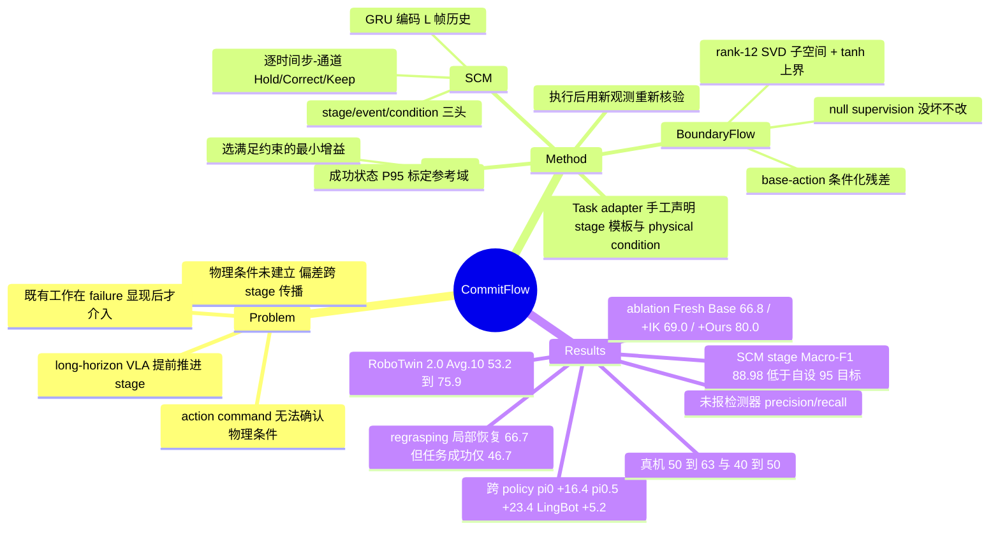

## Summary

CommitFlow 把 long-horizon VLA 的失败重述为一类 mismatch：policy 已经推进到下一 stage，但当前 stage 本该建立的物理条件（作者称 semantic commitment）还没建立，于是后续动作从错误物理状态出发、偏差逐级传播。方法是三件套闭环——SCM 在关键 stage transition 前核验 commitment 并按 (时间步, 通道) 粒度扣住依赖动作，BoundaryFlow 生成以 base action 为条件的低秩残差，RGC 从候选增益里挑满足几何与关节约束的最小值，执行后用新观测重新核验。RoboTwin 2.0 十个公共任务上 π0.5 从 53.2% 提到 75.9%（+22.7 绝对点）；base policy 参数全程冻结，但 SCM 与 BoundaryFlow 本身需要标注与专家修正数据训练。

## Problem & Motivation

Long-horizon manipulation 的各 stage 互相依赖：当前 stage 的物理结果决定后续 stage 能否正确进行。作者观察到的具体失效是，policy 会在当前 stage 的物理效果尚未达成时继续推进任务序列，甚至直接切到下一 stage——比如 handover 里 sender 在 receiver 尚未确认抓稳时就松手，或者在放置动作仍在进行时提前去抓 basket。核心论点很简洁：**action command 本身无法确认一个物理条件是否已经建立**，所以纯粹靠动作序列推进的开环执行没有能力拦住这类推进。

现有路线（SAFE 的跨任务失败风险估计、DoReMi 的约束违反检测、REFLECT 的多模态失败解释、FLARE 的 Retry/Reset、CycleVLA 的 subtask backtracking）作者归纳为一个共同特征：**介入时机在失败征兆已经明显之后**。此时恢复要面对更复杂的失败状态，而 replan / reset / subtask 回退还可能破坏已经建立且仍然有效的抓握、支撑或交互关系。另一条线（V-GPS 的 value ranking、TACO 的 action chunk 选择、CAPS 的漂移局部采样、VLA-Corrector 的视觉偏差截断）优化的是动作质量或轨迹漂移，但作者指出这些量本身回答不了「stage 转换的前置条件是否满足、哪些依赖动作应当暂不放行」。

CommitFlow 的主张因此是把介入点**提前到 critical stage transition 之前**，在偏差演化成任务失败前修掉。

## Method

**任务表示与 adapter（承重墙）**。RGB-D 特征、测量关节与运动学提供状态证据。一个手工定义的 task adapter 给出 pre-alignment / reaching / grasp closure / lifting 四类模板，每个模板显式声明涉及的 object、arm role、physical condition、geometric relation 以及后继 action。把感知到的物体绑定到激活模板后，计算事件坐标系下的相对位置 $r_t^i=(R_i^w)^\top(p_t^{\mathrm{tgt}}-p_t^{\mathrm{src}})$，朝向等几何量单独表示。视觉特征喂给 SCM 和 BoundaryFlow，度量关系用于 RGC 在物理坐标下做检查与标定。

**SCM（Semantic Commitment Monitor）** = causal state estimator + commitment verifier。

- 状态估计：一个 GRU 编码 $L$ 帧历史 $x_t=[f_t;\,r_t^i;\,q_t]$（视觉特征、度量关系、关节）。stage 与 event 两个 softmax 头，外加一个 sigmoid 头预测 holding / support / contact / release 概率。注意这里**不是大 VLM，是轻量时序模型**。
- 监督：标注的 causal window，$\mathcal{L}_{\mathrm{obs}}=\mathcal{L}_{\mathrm{stage}}+\beta_e\mathcal{L}_{\mathrm{event}}+\beta_p\mathcal{L}_{\mathrm{condition}}$（stage/event 交叉熵 + 物理条件 BCE），标签由规则生成，无效标注被 mask。
- 核验与权限：对当前 event，SCM 把 adapter 声明的 required condition 与状态估计、度量关系、历史对照，条件分 pending / blocking / violated 三态。输出是逐 (时间步 $k$, 通道 $d$) 的三值权限：$\Gamma_{t,k,d}\in\{\textsc{Hold},\textsc{Correct},\textsc{Keep}\}$。**Hold 优先于 Correct，Keep 保留不受影响的 base motion；stage 预测不能覆盖未解决的 commitment**——这条是整个设计的保守性来源。

**BoundaryFlow（可训练残差分支）**。条件 $z_t$ 包含局部视觉特征、归一化的 object–arm 关系及其 protected-boundary 预测、测量关节、base prefix、stage/role 证据；把 base prefix 也放进条件，是为了让残差考虑「这个 prefix 本身对偏差的影响」。对训练集里 expert−base 残差做无中心 SVD 取前 $r=12$ 个左奇异向量构成 $B_r\in\mathbb{R}^{60\times r}$，残差为 $c_t=c_{\max}\tanh f_\theta(z_t)$，$\Delta A_t^c=\mathrm{reshape}(B_r c_t,K,6)$，作用在 $K=10$ 步 × 6 关节窗口上。低秩基把修正方向限制在训练子空间内，并给出硬上界 $\|\mathrm{vec}(\Delta A_t^c)\|_2\le\sqrt{r}\,c_{\max}$。

训练目标是五项之和：系数监督 $\mathcal{L}_{\mathrm{coef}}$（对着 $c_t^\star=B_r^\top\mathrm{vec}(M^{\mathrm{corr}}\odot[A^{\star}-A_B])$）、允许坐标上的专家动作监督 $\mathcal{L}_{\mathrm{act}}$、flow 接口的 $\mathcal{L}_{\mathrm{denoise}}$、几何收缩项 $\mathcal{L}_{\mathrm{contract}}$（FK 算出终端 margin 不足与沿窗口进展不足两部分的 hinge），以及对 nominal 样本的 $\mathcal{L}_{\mathrm{null}}=\|c_t\|_2^2$——也就是显式训练「没坏就输出零修正」。专家的角色是在保持不变量、且不提前触发受保护效果的前提下修复关系。

与 flow policy 的接口做法值得单记：先把权限合成 $A_t^{(\alpha)}=A_t^{\mathrm{gate}}+\alpha M^{\mathrm{corr}}\odot I_a(\Delta A_t^c)$ 作用在 clean-action 估计 $\bar A_B^\tau=x_\tau-\tau v_B^\tau$ 上，再映回速度场 $v_{\mathrm{exec}}^\tau=v_B^\tau-(\bar A_{\mathrm{exec}}^\tau-\bar A_B^\tau)/\tau$，$\bar A_{\mathrm{exec}}=\bar A_B$ 时恒等还原 $v_B^\tau$。

**RGC（Relation and Gain Calibration）**。离线把成功的 boundary state 按 approach direction 与 action configuration 分组，fitting split 给逐坐标中位数 $\mu_i$ 与逐轴标准差 $S_i$，独立的 success-calibration split 用 $q_i=\mathrm{Quantile}_{0.95}(\{\|S_i^{-1}(r_n^i-\mu_i)\|_\infty\})$，令 $D_i=q_iS_i$，得 margin $m_i(r)=1-\|D_i^{-1}(r-\mu_i)\|_\infty$ 与参考域 $\mathcal{R}_i=\{m_i\ge 0\}$、修复目标域 $\mathcal{R}_i^\delta=\{m_i\ge\delta\}$；fitting 与 evaluation 用不相交场景。运行时在有序候选集 $\mathcal{A}\subset(0,1]$ 上取满足「FK 预测终点 margin $\ge\delta$」且「关节 / 步长 / 权限约束」的**最小** $\alpha$；可行集为空则保持 hold、刷新证据或重新生成修正。gain 与参考域在评测前固定。

**闭环**：定位 checkpoint（依据夹爪变化、低速位置、运动学方向）→ 算 boundary residual trace 做短程几何筛查 → 核验 commitment 派权限 → 需要修正则走 BoundaryFlow + RGC → 执行 prefix → 刷新观测重新核验 → 只有 event 完成且后继就绪才推进。

## Key Results

**Setup**：仿真为 RoboTwin 2.0 的 11 个 long-horizon 交互任务（handover、hanging、directional placement、multi-target placement），每任务 100 trial、不同随机种子；真机 2 个任务各 100 trial。训练与评测期间 base policy 参数全部冻结，每个 base policy 配一个与其动作表示兼容的 correction head。

**主表（Avg.10，排除 Hang Mug）**：

| Method | Avg.10 |
|:--|--:|
| RDT | 23.6 |
| π0.5 | 53.2 |
| π0.5 + TACO | 58.7 |
| π0.5 + CAPS | 61.5 |
| π0.5 + CommitFlow | **75.9** |

Abstract 里的「improving by 22.7%」是 75.9 − 53.2 的**绝对百分点**，不是相对提升。排除 Hang Mug 的原因是 TACO / CAPS 未报该任务（表中记为「–」），并非对 CommitFlow 有利——含 Hang Mug 的 11 任务差值反而更大（+23.4）。**重要 evidence boundary**：论文明言「Table I includes the shared benchmark results reported in CAPS」，即 RDT / π0.5 / TACO / CAPS 四行是从 CAPS 论文引用的共享 benchmark 结果，非作者同批复跑。

**跨 base policy（Avg.11，base → base+CommitFlow）**：π0 36.5 → 52.9（+16.4）、π0.5 49.4 → 72.8（+23.4）、LingBot-VLA 81.4 → 86.6（+5.2）。单任务最大幅度出现在弱项上：Handover Block 24 → 66、Object Scale 45 → 85、Hang Mug 11 → 42（均为 π0.5）。作者主动点明增益非普遍：LingBot-VLA 在 Place A2B Left 停在 83 不变，在 Object Scale 从 96 **降到** 93。

**SCM 自身性能**：1,971 个闭环帧、六条流上，stage recognition Macro-F1 88.98%，event-class recognition 94.89%（Fig. 4b，该图自画了一条 95% 目标线，stage 一项在线下）。**全文未报告 commitment violation 检测的 precision / recall、误报率或误 Hold 率**——对一个以「扣住动作」为核心机制的系统，这是最关键的缺失指标。

**局部修正 ablation（6 任务，三个变体都会重新 query base）**：Fresh Base 66.8 / Fresh + IK 69.0 / Fresh + Ours 80.0。IK 单独使用在 Object Cabinet 上把 61 拉低到 57，作者解读为「单纯几何对齐未必与后续 base-policy 动作兼容」。

**修正强度 sweep**：Cabinet 在 α=0.60 得 71%，Basket 在 α=0.40 得 88%；α 增大过冲上升，Cabinet 在 α=0.90 时过冲 20.4 mm——这是 RGC 取最小可行增益的直接依据。

**修正复用**：只在 Handover Block 修正样本上训的 head，不给目标任务任何修正演示直接用到 Handover Mic，58 → 65；Object Basket 的 head 复用到 Can → Basket，40 → 58。

**真机（base 为 π0.5）**：Place Blackboard Eraser in Container 50 → 63，Stack Three Bowls 40 → 50。

**作者自报的天花板**：在触发 regrasping 的恢复样本里，π0 局部恢复成功率 45.8%（109/238），但最终任务成功只有 18.1%（43/238）；π0.5 分别是 66.7%（100/150）与 46.7%（70/150）。局部抓取恢复成功并不等于任务成功——CommitFlow 修的是局部偏差，给不了 base policy 本就没有的技能。

## Evidence Ledger

| Claim ID | Claim | Type | Source locator | Evidence excerpt | Status |
|:--|:--|:--|:--|:--|:--|
| C1 | Avg.10 上 π0.5+CommitFlow 75.9% vs π0.5 53.2%，+22.7 为绝对百分点而非相对提升 | number | Abstract; Table I | "achieves a mean success rate of 75.9%, improving on the base policy π0.5 by 22.7%" | source-verified |
| C2 | 同一 Avg.10 下 TACO 58.7%、CAPS 61.5%，均低于 CommitFlow | comparison | Table I | "π0.5+TACO … 58.7 / π0.5+CAPS … 61.5 / π0.5+CommitFlow … 75.9" | source-verified |
| C3 | Table I 的 RDT/π0.5/TACO/CAPS 数字引自 CAPS 论文，非作者复跑 | benchmark-setting | Sec. IV, Table I 前 | "Table I includes the shared benchmark results reported in CAPS [15]." | source-verified |
| C4 | 共 11 个任务，Avg.10 排除 Hang Mug；全 11 任务 π0.5 为 49.4 → 72.8 | benchmark-setting | Table I caption; Table II | "Avg.10 averages the 10 common tasks, excluding Hang Mug." | source-verified |
| C5 | 仿真 11 任务 × 100 trial（不同随机种子）；真机 2 任务 × 100 trial | benchmark-setting | Sec. IV-A; Sec. IV-E | "11 long-horizon interactive tasks … 100 trials with different random seeds" | source-verified |
| C6 | 跨 policy Avg.11：π0 36.5→52.9、π0.5 49.4→72.8、LingBot-VLA 81.4→86.6 | number | Table II | "Avg.11 36.5→52.9 49.4→72.8 81.4→86.6" | source-verified |
| C7 | 增益非普遍：LingBot-VLA 在 Object Scale 由 96 降至 93，Place A2B Left 持平 83 | number | Table II; Sec. IV-B | "remains at 83% on Place A2B Left and decreases from 96% to 93% on Object Scale" | source-verified |
| C8 | 训练与评测期间 base policy 参数全部冻结 | causal-mechanism | Sec. IV-A | "During CommitFlow training and evaluation, all base-policy parameters remain frozen" | source-verified |
| C9 | CommitFlow 本身非 training-free：SCM observer 需标注 causal window 训练，BoundaryFlow 为可训练模块，correction head 按 base policy 动作表示分别配置 | causal-mechanism | Sec. III-B/III-C/IV-A | "Annotated causal windows train the observer with … cross-entropy and … BCE" | source-verified |
| C10 | SCM 状态估计器是 GRU 编码 L 帧历史，非大 VLM；监督标签由规则生成 | causal-mechanism | Sec. III-B | "A gated recurrent unit (GRU) encodes an L-frame history" / "Rule-generated labels supply supervision only." | source-verified |
| C11 | RGC 参考域离线用 P95 分位从成功状态标定，gain 与参考域评测前固定 | causal-mechanism | Sec. III-D | "q_i=Quantile_0.95({d_n})" / "Gains and references are fixed before evaluation" | source-verified |
| C12 | SCM 仅报 stage Macro-F1 88.98%、event-class 94.89%，基于 1,971 帧 / 六条流 | number | Sec. III-B; Fig. 4(b) | "Macro-F1 scores of 88.98% for stage recognition and 94.89% for event-class recognition" | source-verified |
| C13 | 全文未报 commitment violation 检测的 precision / recall / 误报率 / 误 Hold 率 | number | 全文 | 全文检索无 "precision"/"recall"/"false positive"/"false hold" | source-verified |
| C14 | Fig. 4(b) 标注 95% 目标线，stage recognition 的 88.98% 在该线之下 | number | Fig. 4(b) caption | "The dashed line marks the 95% target." | source-verified |
| C15 | 6 任务 ablation：Fresh Base 66.8 / Fresh+IK 69.0 / Fresh+Ours 80.0；IK 使 Object Cabinet 由 61 降至 57 | number | Table III; Sec. IV-C | "80.0% mean success … versus 66.8% for Fresh Base and 69.0% for Fresh + IK" | source-verified |
| C16 | Table I 中 π0.5 在该 6 个任务上的成绩为 Cabinet 54 / Basket 69 / A2B-Left 51 / A2B-Right 39 / Scale 45 / Stand 68 | number | Table I | π0.5 行 "…51 39 69 68 45 54…" | source-verified |
| C17 | regrasping 恢复样本：π0 局部恢复 45.8%(109/238) 但任务成功仅 18.1%(43/238)；π0.5 为 66.7%(100/150) / 46.7%(70/150) | number | Sec. IV-C | "45.8% (109/238) and 18.1% (43/238) for π0, and 66.7% (100/150) and 46.7% (70/150) for π0.5" | source-verified |
| C18 | 真机（base 为 π0.5）：Eraser→Container 50→63，Stack Three Bowls 40→50 | number | Table IV; Sec. IV-E | "from 50% to 63% on … Eraser → Container … and from 40% to 50% on Stack Three Bowls" | source-verified |
| C19 | 修正复用：Handover Block 训的 head 零目标任务演示用到 Handover Mic 得 58→65；Object Basket head 用于 Can→Basket 得 40→58 | number | Sec. IV-D; Table IV | "Success increases from 58% to 65% on Handover Mic and from 40% to 58% on Can → Basket" | source-verified |
| C20 | BoundaryFlow 用 10 步 × 6 关节窗口与 rank-12 SVD 基，残差幅度有界 | causal-mechanism | Sec. III-C; Sec. IV-A | "BoundaryFlow uses a 10-step, six-joint window and a rank-12 basis" | source-verified |
| C21 | 唯一机构为 National University of Defense Technology；8 页 7 图，投 ICRA 2027；arXiv v1 日期 2026-09-18 | benchmark-setting | title block; arXiv comments | "8 pages, 7 figures. Submitted to … ICRA 2027" | source-verified |
| C22 | 论文正文未提供任何代码仓库或 project page 链接 | license-code | 全文 | 正文无 GitHub / project page URL（仅 arXiv 站点自身 UI 出现 "GitHub"） | source-verified |
| C23 | limitation 含：依赖 RGB-D 感知与时序状态估计（遮挡/无效深度/状态估计误差/时序异步）、任务相关的 event 与 precondition 定义限制 open-ended 扩展、局部修正不足以应对复杂接触动力学/避障/重抓/全局轨迹规划 | causal-mechanism | Sec. IV-C; Sec. V | "corrections may be insufficient for complex contact dynamics, obstacle avoidance, regrasping, or global trajectory planning" | source-verified |
| C24 | 在 ablation 的 6 个任务上，Table I 的 π0.5 均值为 54.3%，据此「SCM gating + 重新 query」约贡献 +12.5 点、学习到的局部修正再贡献 +13.2 点 | number | 由 C15/C16 推算 | 论文未给出该拆解；且 Table III 的 Fresh+Ours 80.0 与 Table I 同 6 任务均值 79.2 不完全相等，说明两表非同一次运行 | unsupported（笔记作者推算，非论文结论） |

## Strengths & Weaknesses

**亮点**

problem formulation 比方法本身更有信息量。把失败拆成「物理条件未建立 vs stage 已推进」这组 mismatch，直接推出一条可操作的时序结论：介入点应该在 critical transition **之前**而不是 failure 之后。这条区分同时把 CommitFlow 与两类相邻工作划开了——TACO / CAPS / V-GPS 那一类优化的是动作质量与轨迹漂移，而「漂移小」并不蕴含「前置条件已满足」；CycleVLA / FLARE 那一类做 subtask backtracking 与 retry/reset，粒度粗到会连带撤销仍然有效的进展。

权限机制的粒度设计是自洽的：三值 $\Gamma$ 落到 (时间步, 通道) 而非整条 chunk，Hold 优先于 Correct、Keep 保留未受影响的 base motion，配合「stage 预测不能覆盖未解决的 commitment」，整体是一个失效偏保守的门。BoundaryFlow 一侧也对应地做了三重约束——rank-12 子空间、$c_{\max}\tanh$ 硬上界、以及对 nominal 样本的 null supervision（显式学「没坏就别改」）；RGC 再取满足约束的最小增益。三者叠起来，「最小干预」不只是口号，是被写进目标函数和选择规则的。

诚实度高于同量级论文：报了 LingBot-VLA 上的单任务回退（96→93）与持平、IK ablation 的负结果（61→57）、以及 regrasping 子集上「局部恢复 66.7% 但任务成功仅 46.7%」的落差。最后这条实际上是作者自己给方法划的适用边界，比 main result 更有价值。

**局限**

*「frozen base policy」≠ 零训练，这是最容易被 abstract 误导的地方。* SCM 的 GRU observer 要标注 causal window 训练；BoundaryFlow 要「同一状态下 frozen base 与 expert 的配对 prefix」作监督，也就是需要成对的专家修正演示；RGC 要成功轨迹做 P95 标定；而且每个 base policy 要配一个兼容的 correction head 单独训。整条流水线对数据与标注的要求不比 fine-tune base policy 低，只是把成本从「策略参数」搬到了「adapter 定义 + 专家修正数据」。对照 VLA-Corrector 那种真正 training-free 的外挂监控器，CommitFlow 的性价比论证是缺失的。

*adapter 是方法真正的承重墙，也是泛化上限。* pre-alignment / reaching / grasp closure / lifting 的模板，以及每个模板下的 object、arm role、physical condition、geometric relation、后继 action，全部手工声明。这意味着 semantic commitment 并不是从任务里学出来的，而是人预先写死的——论文的核心概念其实被解决在了 adapter 层，而非 policy 层。作者在 limitation 里承认这限制了向 open-ended 任务与陌生交互关系的扩展，并把「从观测与语言指令推断 event 结构 / 操作角色 / 物理前置条件」列为 future work。那才是这个 formulation 真正有意思的问题，本文没有回答。从 simple / scalable / generalizable 的标准看，当前形态是反方向的。

*检测器自身的误差完全没量化。* 全文只有 stage / event recognition 的 Macro-F1，没有 commitment violation 的 precision / recall，也没有「误 Hold 造成的额外时延、卡死或 trial 超时」统计。对一个以「扣住动作」为核心机制的系统，false hold 的代价是直接且不对称的（false negative 让偏差通过，false positive 让任务停滞），却完全不可见——下游成功率把这两类错误的净效应糅成了一个数。而且 88.98% 的 stage Macro-F1 落在作者自己画的 95% 目标线以下，说明监控器远未饱和。这与 [[2609-FailBench]] 测出的现象可以对读：判断「这一步成没成」本身就是一个远未解决的问题，而 CommitFlow 把整个系统建在这个判断之上。

*baseline 数字跨来源。* Table I 的四行对照来自 CAPS 论文，CommitFlow 一行是作者自跑。RoboTwin 2.0 带强 domain randomization，不同随机种子、环境版本与 checkpoint 下的 100-trial 成功率漂移若干点是完全可能的，headline 的 +22.7 因此不是严格同源比较。真正同源的证据只有 Table II（作者自跑的 base → base+CommitFlow）和 Table III 的 ablation——所幸 Table II 的 π0.5 +23.4 与 headline 量级一致，主结论不至于被推翻，但强度应该按 Table II 而非 Table I 来读。

*增益随 base 变强而迅速衰减*：π0 +16.4、π0.5 +23.4、LingBot-VLA 仅 +5.2。这是所有「外挂纠正器」的共同曲线——修的是当前一代 policy 的时序承诺缺陷，base 自身变可靠后剩余空间收窄。论文列出了这条趋势线却没有讨论它意味着什么：如果 +5.2 是强 base 上的典型量级，那么整套 adapter + 标注 + 双模块训练的成本是否还成立，是个需要正面回答的问题。

*ablation 的分解方向不完整。* Table III 只拆了「局部修正怎么做」（Fresh Base / +IK / +Ours），三个变体都带 SCM，因此**没有任何一栏回答「SCM 的 gate 本身贡献多少」**。把 Table I 的 π0.5 逐任务数在同 6 个任务上取均值得 54.3%，与 Fresh Base 的 66.8% 相比，「在 transition 前停下来、丢掉 stale action、用新观测重新 query base」这个几乎零成本的动作可能已经吃掉了约一半提升，BoundaryFlow + RGC 这套学习机制再补另一半（需强调：这是笔者跨表推算，Table I 与 Table III 并非同一次运行——同 6 任务下 Table I 的 CommitFlow 均值 79.2 与 Table III 的 80.0 就不相等；论文未做此拆解）。若这个粗略分解方向正确，那么论文最有价值的发现其实是那个便宜动作，而不是它主推的学习组件。

*真机证据面窄*：只有 2 个任务、单一 base policy，且都属 placement / stacking 类，不足以支撑跨任务族的结论。

**对领域的意义**：值得留存的是 formulation 而非这一版实现。「semantic commitment」给「什么时候允许推进」提供了一个比 progress 估计、比轨迹漂移更贴近物理语义的判据；真正的开放问题是它能否从语言指令与观测里被推断出来（作者的 future work），以及监控器的 false-hold 代价如何度量——后者目前在整条 test-time 纠正的文献线上都缺位。

## Mind Map

## Notes

**Base policy 谱系**：本文的两个主力底座均已有笔记——[[2410-Pi0]]（flow matching VLA）与 [[2504-Pi05]]（open-world 泛化版本），Table I / II 里 π0.5 的绝对水平可以对照这两篇的原始报告读。RoboTwin 2.0 上的 long-horizon 另一条路线见 [[2603-SeedPolicy- Horizon Scaling via Self-Evolving Diffusion Policy for Robot Manipulation|SeedPolicy]]（自演化 diffusion policy），与 CommitFlow 的「冻结 base + 外挂纠正」构成两种不同的成本结构。

**同一条 test-time 纠正线上的近邻**（三篇都被本文在 Related Work 中引用，vault 里已有笔记）：

- [[2607-VLACorrector]] —— 最直接的对照物。同样是 frozen backbone + 外挂监控器，但它的 LVM 只有 ~40M 且 **training-free**，触发条件是潜空间视觉动态偏差，动作侧靠 Online Gradient Guidance 引导下一次 flow 去噪。CommitFlow 的监控器需要标注训练、纠正器需要专家配对数据，换来的是「按物理条件逐通道 gate」这一更细的语义粒度。两篇放在一起，正好把「监控信号该用视觉动态偏差还是显式物理条件」这个选择摆出来了；可惜没有直接的实验对照。
- [[2601-CycleVLA]] —— 本文明确要区分的对象。CycleVLA 在 subtask 边界由 VLM 判 transit/backtrack 并 reverse-execute 回退，粒度是 subtask 级；CommitFlow 的论点正是这种回退会破坏仍然有效的抓握/支撑关系。值得注意的是 CycleVLA 也缺真机验证，而 CommitFlow 至少有 2 个真机任务。
- [[2606-AffordanceFieldInterventio]] —— 另一个 test-time plug-in、不改 VLA 参数的范式（检测 Memory Trap → rollback → waypoint 采样 → 轨迹重排序），但它的判据是 3D affordance cost field 而非 stage 前置条件。三篇合起来是一个清晰的 pattern：**2026 年这条线的共识是「不动 base policy，外挂一个判据 + 一个局部动作修改器」，分歧在判据选什么**（视觉动态偏差 / affordance cost / 显式物理 commitment / progress 信号）。

**方法层的相邻工作**：[[2608-CofactVLA]] 同样以 π0.5 为底座、同样在 flow 的速度场上做减法（把 counterfactual 共线分量投影掉），但目的是消除 vision-override 的混杂而非修复执行偏差；两篇在「如何把一个外部信号插回 flow sampling」这个工程点上可以互相参考。[[2606-CounterfactualVLA]] 的 self-reflective adaptive reasoning 是另一种「让 policy 自己判断要不要多想一步」的思路。

**DomainMap 归属**：属于 [[EmbodiedAI]] 的 §5 Safety & Reliability，但该节目前的内容偏 adversarial / poisoning 的威胁分类，对「执行期可靠性」这一支覆盖不足。如果要更新地图，这一支已经能支撑一条独立的 pattern（见上段的三篇 pattern 归纳），判据的分歧点比任何单篇的结果都更值得记。

**待追问**

1. SCM 的 false hold 率到底是多少？一个稳妥的测法是统计「被 Hold 但实际条件已满足」的帧占比，以及由此导致的 trial 超时数。论文没有报，而这决定了这套机制在更长 horizon 上是否会累积成死锁。
2. C24 的拆解如果成立（纯 gate + 重新 query 已贡献约一半提升），那么一个极简 baseline——「在 checkpoint 无条件丢弃 stale action 并重新 query base」——值得单独测量。这是 first principles 意义上必须排除的 confound：多少收益来自「学到的修正」，多少只来自「多看一眼」。
3. semantic commitment 能否由 VLM 从 instruction + 观测里直接生成，从而替掉手工 adapter？这是作者自列的 future work，也是这个 formulation 能否 scale 的唯一关口。注意这会把误差源换成 VLM 的判断可靠性，而 [[2609-FailBench]] 的结果提示那条路当前的天花板不高（最强判官 0.77 macro balanced accuracy）。
4. 增益随 base policy 变强而衰减（+16.4 / +23.4 / +5.2），如果在更强的 2027 代 VLA 上继续收窄到个位数，这类外挂框架的存在价值是什么？可能的答案是它的价值不在成功率而在**可解释的停机条件**（知道为什么停、停在哪个 condition 上），但论文没有往这个方向论证。
