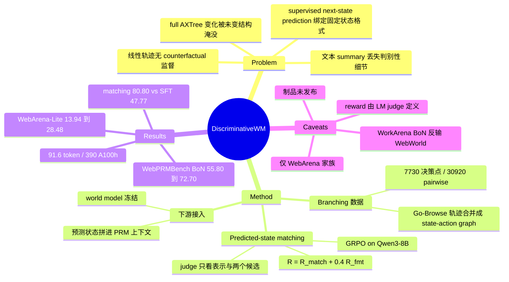

## Summary

现有 web world model 用 supervised next-state prediction 拟合一个预先选定的状态格式（文本 summary 或 AXTree 快照），而下游 ranker 真正需要的是"能把候选动作的后果彼此区分开"的表示——本文指出这两个目标错位，并提出 **predicted-state matching** 取而代之：world model 自由生成文本 next-state 表示，由一个只看到该表示与两个候选真实 next state、拿不到 instruction/history/current state/action 的固定 judge（Qwen3-32B）判断能否选中真值，以此二元 reward 做 GRPO，训练目标因此与状态格式无关。数据侧把 Go-Browse 的 WebArena 线性轨迹按重复 state 合并成 state-action graph，挖出 7,730 个 branching decision point / 30,920 个 pairwise 例子。三层结果：held-out matching 80.80%（WebDreamer-7B 74.51 / WebWorld-8B 70.17 / 同数据同基座的 AXTree SFT 47.77），WebPRMBench 受控对比平均 BoN 55.80→72.70，WebArena-Lite 端到端 13.94%→28.48%。

## Problem & Motivation

Web navigation 是部分可观测的多步决策问题，主流的 reactive next-action prediction 不显式比较同一状态下的候选动作。近来的解法是 test-time action selection——采样多个候选动作、用 PRM/ranker 挑一个；model-based planning 再进一步，用 world model 预测每个候选的 next state，让 ranker 在执行前比较"预期后果"。

于是问题变成：**predicted next state 到底该表示什么**。现有 web world model（WebDreamer 的自然语言 transition summary、WebWorld 的 AXTree 结构快照、WebEvolver 等）一律用 supervised next-state prediction，把训练目标绑死在一个人为选定的状态格式上。作者的论点是这个绑定有代价：文本 summary 可能压缩掉恰好用来区分本动作与其他动作的那一处变化；full AXTree 则相反，真正变了的部分被埋在大量未变的页面结构里。两种失效模式都不会被"复刻目标字符串"的 loss 惩罚，因为该 loss 根本不度量区分性。

数据侧还有一层缺失：绝大多数 web-agent 数据集是线性轨迹，只记录实际走过的那一条路。它能支撑 reactive agent 的 SFT 和 supervised next-state prediction，但无法回答"同一状态下换个动作会怎样"。WebPRM 类数据给了候选动作的偏好标签，却不给"是哪处状态变化让一个动作更好"——而后者恰恰是 world model 需要学的东西。

## Method

### Branching 数据构造

Go-Browse 本身是线性轨迹，但不同轨迹会重访同一个浏览器状态。作者据此把轨迹合并成 state-action graph：节点是以 accessibility tree 表示的浏览器状态，有向边是执行过的动作及其观察到的 next state。出度大于 1 的节点自然成为 branching decision point，写作 $\mathcal{D}_t=\{(a_t^i, s_{t+1}^i)\}_{i=1}^K$。每个决策点再拆成 pairwise 例子：instruction、history、current state、queried action、其真实 next state、以及同一决策点上另一动作导致的 alternative next state。

关键在于 queried 与 alternative 两个动作**不带好坏标签**——任务纯粹是"预测的表示能否把二者的后果分开"，与偏好建模正交。最终得到 7,730 个决策点（来自 2,839 条轨迹）、30,920 个 pairwise 例子，按 WebArena 域分层切 train/eval（Shopping / CMS / Reddit / GitLab / Map）。零额外环境交互成本，全部从已有轨迹里挖出来。

### Predicted-state matching 目标

World model 生成文本表示 $\hat{z}_{t+1}$（作者刻意用 $\hat{z}$ 而非 $\hat{s}$，强调这是"预测状态的一个表示"而非环境状态本身），不被监督去匹配任何预定义字符串。一个固定 judge $J$（训练时为 Qwen3-32B）拿到 $(\hat{z}_{t+1}^{\rm qry}, s_{t+1}^{\rm qry}, s_{t+1}^{\rm alt})$，候选顺序随机，判断哪个候选与预测表示相符。

设计的要害是 **judge 拿不到 instruction、history、current state 和 queried action**——它只能靠 $\hat{z}$ 本身携带的信息去选。这就把"表示是否自带足够的判别信息"变成一个可直接优化的信号，而不是让 judge 从上下文里把答案猜出来。

奖励为 $R = R_{\rm match} + \lambda_{\rm fmt} R_{\rm fmt}$，其中 $R_{\rm match}$ 是 judge 选对的 0/1 指示，$R_{\rm fmt}$ 要求输出落在非空的 `<predicted_state>` XML 标签内以抑制退化解，$\lambda_{\rm fmt}=0.4$。优化用 GRPO（TRL 实现）：每个输入采 8 个 completion，用序列级总奖励算 group-relative advantage 再摊到 token 上，KL 系数 0.04，训练温度 1.0，推理 greedy，最大生成 2,048 token。基座为 Qwen3-8B。

### 下游接入

对每个候选动作 $a_t^i$ 生成 $\hat{z}_{t+1}^i$，把 (动作, 预测状态) 对拼进 PRM/ranker 的输入做 pairwise preference 预测；no-state 设置即省去 $\hat{z}$ 项。reward model 训练期间 world model 冻结，因此"换 world model"与"换 ranker 训练方式"两条轴是解耦的。

## Key Results

**1) Held-out predicted-state matching（两选一，随机基线 50%，Qwen3-32B judge）**

| Model | Shopping | CMS | Reddit | GitLab | Map | Overall |
|:--|--:|--:|--:|--:|--:|--:|
| GPT-4o | 44.44 | 47.80 | 48.22 | 47.00 | 55.81 | 49.40 |
| Qwen3-8B (prompted) | 67.90 | 55.50 | 68.00 | 56.50 | 68.30 | 62.86 |
| WebDreamer-7B | 72.80 | 70.80 | 75.63 | 75.00 | 76.70 | 74.51 |
| WebWorld-8B | 79.01 | 67.58 | 77.66 | 54.00 | 77.21 | 70.17 |
| 同数据 SFT（full AXTree target） | 45.68 | 46.15 | 47.72 | 46.00 | 51.63 | 47.77 |
| **Ours（predicted-state matching）** | 77.78 | 77.47 | 79.70 | **82.50** | **84.19** | **80.80** |

最有信息量的一行是 data-matched SFT baseline：同基座、同数据，只把目标换成"生成固定 AXTree"，结果 47.77——低于随机。它不是"稍差"，是几乎完全不可判别，说明差距确实来自目标函数而非数据。另一处值得注意的是 GitLab 列：WebWorld-8B 只有 54.00（近乎随机），而 WebDreamer-7B 75.00、本文 82.50——结构化全量快照方法在页面结构复杂的域上退化得最厉害。Shopping 是本文唯一输给 WebWorld-8B 的域（77.78 vs 79.01）。

**2) 换 judge 的鲁棒性**：Qwen3-32B / GPT-4o / Llama-3.1-70B 三个 judge 下，本文 80.80 / 81.26 / 79.31，均高于 WebDreamer-7B（74.51 / 76.91 / 76.10）与 WebWorld-8B（70.17 / 74.06 / 76.00）。但对 WebDreamer 的领先幅度从训练 judge 下的 +6.29 收窄到 GPT-4o 的 +4.35、Llama 的 +3.21。

**3) WebPRMBench 动作排序（受控对比：全部 Qwen2.5-7B，同 answer-only preference 训练，只换 next-state 信息）**

| Setting | Avg. Pairwise | Avg. BoN | WorkArena BoN |
|:--|--:|--:|--:|
| Direct (no state) | 82.02 | 55.80 | 52.88 |
| + WebWorld-8B states | 85.48 | 67.63 | **64.32** |
| + state-matching states (ours) | **89.36** | **72.70** | 62.26 |
| *WebArbiter-7B（非受控参照）* | 89.19 | 74.60 | 70.19 |

需要谨慎读的一点：本文平均 BoN 72.70 **低于** WebArbiter-7B 的 74.60（Pairwise 则 89.36 略高于 89.19）。论文自己的措辞是 "competitive with WebArbiter" 而非超越，这是诚实的——但代价对比对本文有利：WebArbiter 用 principle-guided reasoning + 推理蒸馏 + RL，本文只用 answer-only 监督。在 WorkArena 这个离 WebArena 最远的子基准上，本文 BoN 62.26 反而低于 WebWorld-8B 的 64.32，是四个子基准里唯一的翻转。

**4) 冻结 ranker（training-free）**：Qwen2.5-7B 平均 BoN 42.78（无状态）→ 51.53（WebWorld）→ 54.65（ours）；Qwen2.5-3B 26.76 → 36.76 → 42.96。值得注意的是加 WebWorld-8B 状态会让**平均 Pairwise 下降**（3B: 69.27→68.39；7B: 77.61→75.61），只有 BoN 上升；本文的表示两个指标都涨。这与"长 AXTree 稀释上下文"的假设一致。

**5) 端到端 WebArena-Lite（GPT-4o 作 policy，同一 harness 内实现三个 setting）**：ReAct 13.94%（作者称与 WebRL 报告的 GPT-4o 13.9% 吻合）→ Bo5 21.82% → Bo5 + state matching 28.48%。

**6) 效率**：预测表示平均 91.6 token，WebWorld-8B 为 412.7 token（且不含其额外的 reasoning token）；训练 4,830 步、8×A100 跑 48.75 小时共 390 A100 GPU-hours，WebWorld-8B 报告 1,568 A100 GPU-hours（WebDreamer-7B 用 64×H100 但未报告总时数）；数据量 30,920 pairwise 例子，对比 WebDreamer-7B 的 >3.1M 合成交互与 WebWorld-8B 的 1.06M 轨迹。

**7) 消融**：$\lambda_{\rm fmt}$ 取 0.2 / 0.4 / 0.6 / 1.0 时 matching 准确率 79.0 / 80.8 / 78.9 / 79.2，对该超参不敏感。

## Evidence Ledger

| Claim ID | Claim | Type | Source locator | Evidence excerpt | Status |
|:--|:--|:--|:--|:--|:--|
| C1 | Qwen3-32B judge 下 overall：ours 80.80 / WebDreamer-7B 74.51 / WebWorld-8B 70.17 / 同数据 AXTree SFT 47.77 | number | Table 1 (§4.1) | "WebDreamer-7B … 74.51  WebWorld-8B … 70.17 … Full AXTree target … 47.77 … Ours … 80.80" | source-verified |
| C2 | 换 judge：ours 81.26 (GPT-4o) / 79.31 (Llama-3.1-70B)，均高于两个 baseline，但领先幅度收窄 | comparison | Table 2 (§4.1) | "WebDreamer-7B 74.51 76.91 76.10  WebWorld-8B 70.17 74.06 76.00  Ours 80.80 81.26 79.31" | source-verified |
| C3 | WebPRMBench 受控三行 Avg：55.80 → 67.63 → 72.70 (BoN)，82.02 → 85.48 → 89.36 (Pairwise) | number | Table 3 (§4.2) | "Direct (no state) … 82.02 55.80  + WebWorld-8B states … 85.48 67.63  + state-matching states (ours) … 89.36 72.70" | source-verified |
| C4 | ours 平均 BoN 72.70 低于 WebArbiter-7B 的 74.60；论文措辞为 "competitive with WebArbiter" | comparison | Table 3 + §4.2 | "WebArbiter-7B … 89.19 74.60"；"while being competitive with WebArbiter" | source-verified |
| C5 | 冻结 ranker：加 WebWorld-8B 状态使 3B/7B 的平均 Pairwise 双双下降（69.27→68.39；77.61→75.61） | comparison | Table 4 (§4.3) | "No predicted state … 69.27 26.76  + WebWorld-8B states … 68.39 36.76"；"77.61 42.78 … 75.61 51.53" | source-verified |
| C6 | WebArena-Lite（GPT-4o policy）：ReAct 13.94% → Bo5 21.82% → Bo5+state matching 28.48% | number | §4.4 | "ReAct-style achieves 13.94% task success … Bo5 … 21.82% … Bo5 + state matching further improves … 28.48%" | source-verified |
| C7 | 数据集规模 7,730 决策点 / 2,839 轨迹 / 30,920 pairwise 例子，由 Go-Browse 轨迹合并成 state-action graph 得到 | number | §3.1 | "7,730 branching decision points from 2,839 trajectories, yielding 30,920 pairwise next-state matching examples" | source-verified |
| C8 | 奖励 $R=R_{\rm match}+0.4 R_{\rm fmt}$；judge 不接收 instruction / history / current state / queried action | causal-mechanism | §3.2 | "the judge does not receive the instruction, history, current state, or queried action" | source-verified |
| C9 | 训练 4,830 步 / 8×A100 48.75h = 390 A100 GPU-h，对比 WebWorld-8B 报告的 1,568；数据 30,920 vs >3.1M vs 1.06M | number | Appendix C.2 | "48.75 hours on eight A100 GPUs … total of 390 GPU-hours. In comparison, WebWorld-8B reports 1,568 A100 GPU-hours" | source-verified |
| C10 | 预测表示平均 91.6 token vs WebWorld-8B 412.7 token（后者不含其 reasoning token） | number | Appendix B | "average 91.6 tokens per state, compared with 412.7 tokens for WebWorld-8B, excluding its additional reasoning tokens" | source-verified |
| C11 | $\lambda_{\rm fmt}$ 消融 0.2/0.4/0.6/1.0 → 79.0/80.8/78.9/79.2，作者称对该选择相对鲁棒 | number | Appendix C.3 / Table 5 | "0.2 79.0%  0.4 80.8%  0.6 78.9%  1.0 79.2%" | source-verified |
| C12 | World model 与 data-matched SFT baseline 均由 Qwen3-8B 在同一 branching 数据上微调 | benchmark-setting | §4.1 | "both models are fine-tuned from Qwen3-8B on the same data" | source-verified |
| C13 | 论文称其 ReAct 13.94% 与 WebRL 报告的 GPT-4o 13.9% 吻合 | comparison | §4.4 | "closely matching the 13.9% GPT-4o result reported by WebRL (Qi et al., 2025)" | source-verified |
| C14 | GRPO 细节：每输入 8 completion、KL 0.04、训练温度 1.0、推理 greedy、最长 2,048 token、TRL 实现 | benchmark-setting | Appendix C.1 | "GRPO … implemented with TRL … sample 8 completions … KL regularization with coefficient 0.04 … 2,048 tokens" | source-verified |
| C15 | 截至核查时代码、数据、checkpoint 均未发布：项目页 Paper/Code/Data 三项全部标 "Coming soon"，无 GitHub / HuggingFace 链接 | license-code | §7 Ethical Considerations + 项目页 | 项目页："Paper · Coming soon  Code · Coming soon  Data · Coming soon"；论文："we will release scripts or processing instructions rather than the restricted artifacts" | source-verified |
| C16 | 作者自述局限：数据与端到端评测均限于 WebArena 家族 + GPT-4o；matching 准确率是 model-based proxy 可能带 judge 偏置；branching 数据不穷举每个决策点的全部动作 | causal-mechanism | §6 Limitations | "matching accuracy remains a model-based proxy and may reflect … biases"；"does not enumerate every possible action" | source-verified |
| C17 | Table 1 中 Shopping 是唯一输给 WebWorld-8B 的域（77.78 vs 79.01）；GitLab 列 WebWorld-8B 仅 54.00，WebDreamer-7B 75.00，ours 82.50 | comparison | Table 1 (§4.1) | "WebWorld-8B 79.01 67.58 77.66 54.00 77.21 70.17 … Ours … 77.78 77.47 79.70 82.50 84.19 80.80" | source-verified |
| C18 | Table 3 受控三行中，WorkArena BoN 上 ours 62.26 低于 + WebWorld-8B states 的 64.32（四个子基准里唯一翻转） | comparison | Table 3, WorkArena 列 (§4.2) | "Direct (no state) … 79.57 52.88 … + WebWorld-8B states … 81.21 64.32 … + state-matching states (ours) … 83.84 62.26" | source-verified |

## Strengths & Weaknesses

**动的是目标函数，不是模块。** 这篇的价值不在 80.80% 这个数，而在它把"world model 该按什么标准训"这个问题做成了一个可执行的 loss。[[2604-AgenticWorldModel]] 与 [[2608-WorldProxy]] 都主张 world model 应按"让查询它的 agent 变好多少"来评价而非按生成保真度，但都停在 position 层面；本文给出了这条主张在 web 场景下的一个具体实现——把"下游可区分性"直接写进 reward，而不是先生成再评估。判 judge 不给上下文这一条是整个设计的支点：它堵死了"judge 从 current state 和 action 反推答案、表示本身其实没信息"这条捷径，让奖励真正度量表示的自足性。

**Data-matched SFT baseline 是这类论文里少见的干净消融。** 同基座同数据只换目标，47.77% 低于两选一的随机水平 50%——这不是"稍逊一筹"，是训出来的表示在判别意义上几乎无信息。配合 91.6 vs 412.7 token、390 vs 1,568 GPU-h、30.9k vs 1.06M 样本的对比，"收益来自目标对齐而非规模"这个论断是站得住的。

**数据构造的复用性可能比方法本身更有价值。** 从已有线性轨迹按重复 state 合并挖 branching 结构，零额外环境交互，这条路对任何有大量轨迹沉淀的 agent 领域（GUI、terminal、tool-use）都成立，且与 [[2506-GoBrowse]] 的图式探索天然衔接。

以下是需要打折的地方：

**Reward 就是 judge，这是最大的结构性风险。** $R_{\rm match}$ 完全由 Qwen3-32B 定义，训练等价于把 world model 优化到"能被某个 LM judge 区分"。跨三个 judge 的一致性是必要检查，但三个都是同代 LM，共享偏置的可能性无法用它们互证——而且领先幅度在非训练 judge 上从 +6.29 收窄到 +3.21，方向上正是"部分收益来自对训练 judge 的适配"所预期的。作者在 Limitations 里承认了这点，但没有给出非 LM 的校验轴（比如用 AXTree diff 之类的程序化判别器做交叉验证）。

**两选一任务的难度分布未必匹配真实 Best-of-5。** 基准是 pairwise 二分类、随机 50%；alternative 只从"轨迹里恰好观察到的"其他动作里取，既非难负例挖掘，也不覆盖动作空间（作者承认）。但端到端用的是 Bo5，5 个由 GPT-4o 提议的候选彼此可能高度相似——训练分布上"随便另一个执行过的动作"与部署分布上"5 个都合理的近邻动作"之间的 gap 没有被度量。80.80% 本身也说明近 20% 的 pairwise 例子仍分不开。

**端到端增益的归因缺一个 ablation。** 13.94 → 21.82 → 28.48 中，Bo5→Bo5+state 的 +6.66pp 有多少来自"看到了正确的预测状态"、多少来自"ranker 多读了一段与动作相关的文本"，论文没做对照（例如喂随机/打乱的 predicted state，或给 ranker 等量的无关 token）。同时 Bo5 里 GPT-4o 同时充当 proposer 和 ranker，这个 setting 本身也没有与"换个独立 ranker"的对照。

**成本口径缺了 wall-clock 这一轴。** Bo5 + state matching 每步要跑 5 次 world model 前向，端到端的时延与 token 开销全篇未报。这一点对 [[2411-WebDreamer]] 尤其讽刺——WebDreamer 当年相对 tree search 的核心卖点恰恰是 wall-clock 只有约 1/4，而本文继承了它的 test-time simulation 框架却没有继承这条评价轴。

**外部效度基本未测。** 训练数据（Go-Browse）与端到端评测（WebArena-Lite）同源于 WebArena，train/eval 只做了域分层而非环境分割。WebPRMBench 上唯一跨出 WebArena 家族最远的 WorkArena，恰好是本文 BoN 输给 WebWorld-8B 的那一格（62.26 vs 64.32）——这个单点不足以下结论，但方向上与"域内过拟合"的假设一致，值得在后续工作里盯。

**制品未发布。** 项目页 Paper / Code / Data 三项全部 "Coming soon"，branching 数据的重建脚本、模型 checkpoint 均不可得；论文在 Ethical Considerations 里只承诺"受限制品改发脚本"。在这个数据构造本身就是主要贡献之一的工作里，这一条对复现的影响不小。

**对领域的意义**：如果"world model 按下游判别效用训练"这条路成立，它对 GUI/web 之外同样适用——凡是 world model 只用于排序候选动作而非渲染观测的场景（terminal agent、tool-use planner），生成保真度都是在为不需要的东西付代价。反过来，本文的方法对"需要真的把状态喂回 policy 继续 rollout"的场景（如 [[2511-DreamGym]] 那类用合成经验做 RL 训练的设定）不直接适用——判别性表示不足以支撑多步推演，这是两类 world model 用途的分野，本文没有讨论。

## Mind Map

## Notes

- 与 [[2411-WebDreamer]] 的关系是"同框架、换目标"：WebDreamer 直接拿 GPT-4o 当 world model + value function 做零训练的想象式规划，本文把 world model 变成一个专门训练出来的小模型，且训练信号是判别性而非保真度。两者可以叠加——用本文的表示替换 WebDreamer 的自由文本 imagination，是一个现成的组合实验。
- 与 [[2506-GoBrowse]] 是数据上下游关系：Go-Browse 的图式探索产出的轨迹恰好富含重访状态，是本文能挖出 branching 结构的前提。反过来看，"探索策略应当为下游 world model 的判别性训练服务"是 Go-Browse 论文没有提出的目标——如果探索时主动在同一状态上多试几个动作，branching 密度会显著高于被动重访。
- 与 [[2604-AgenticWorldModel]] / [[2608-WorldProxy]] 的 decision-centric evaluation 主张构成 position → instantiation 的配对，适合在 WorldModel survey 里放在一起讲。
- 与 [[2607-OSReward]]、Web-Shepherd / WebArbiter 这条 PRM 线是互补而非竞争：本文明确把自己定位为"给 PRM 加一路输入"，冻结 ranker 的实验（Table 4）是这一定位最干净的证据。可以并入 [[Topics/StepCreditAssignment-Survey]] 里"步级信号从哪来"的讨论——这里的信号既不是 outcome 反推也不是人工 checklist，而是"预测后果的可区分性"。
- 开放问题：judge-as-reward 的上限在哪？如果把 judge 换成程序化的 AXTree diff 匹配器（完全去掉 LM），matching 准确率会怎样？这既是对 judge 偏置的直接检验，也可能是更便宜的训练信号。
- 开放问题：判别性表示能否支撑多步 rollout？本文的表示只需在"两个真实候选中选对"这一任务上自足，未必包含继续预测下一步所需的信息。若不能，则说明"用于排序的 world model"与"用于合成经验的 world model"必须分开训——这个分野目前在 world model 文献里是模糊的。
- 制品状态需跟踪：项目页 https://dhruvpendharkar.github.io/dwm/ 当前 Paper/Code/Data 全部 "Coming soon"，若后续发布 branching 数据构造脚本，值得单独跑一轮 repo-digest。
