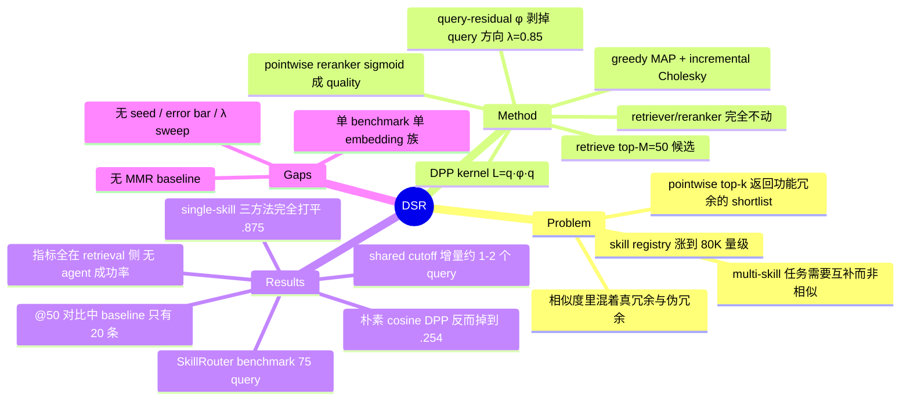

## Summary

把 skill routing 从 pointwise relevance ranking 改写成 subset selection：在 SkillRouter 的 retriever 与 reranker 完全不动的前提下，只把最后一步 top-k 截断换成 DPP greedy MAP，并用 query-residual kernel（先从 skill embedding 里减掉与 query 对齐的分量，再量 skill 之间的重叠）把"功能冗余"与"同为该 query 相关"分开。在 SkillRouter benchmark 的 75 个 query 上 recall 与 full coverage 小幅提升，multi-skill 子集提升略大。全文只有 retrieval 侧指标，没有端到端 agent 成功率。

## Problem & Motivation

Skill library 作为 LLM agent 的外挂能力已经涨到万级规模（SkillRouter 的 registry 约 80K），context window 装不下全部，无关 skill 还会干扰执行，于是 routing 本身成了瓶颈。现有 skill router 的做法是 pointwise：每个候选 skill 独立对 query 打分，取 top-k。作者指出这个 formulation 对单 skill 任务够用，但对 compositional 任务不够——一个请求可能同时需要解析表格、清洗字段、生成可视化三类不同 skill，而描述相近的冗余 skill 会一起拿高分、把必需但不相似的 skill 挤出 shortlist。

文章的主张是：大规模 skill routing 应当同时是 complementary set selection。DPP 是这类问题的现成工具，但直接套用有一个具体障碍：两个 skill 在 embedding 空间里靠近，可能因为它们互为替代（真冗余），也可能因为它们都服务于同一个 query（伪冗余）。均匀惩罚所有相似度会把真正互补的 skill 一起剔掉。整篇论文就是在修这一处。

## Method

**Pipeline。** 沿用 retrieve-and-rerank 两段式，DSR 只加一个选择层。（1）encoder retriever 把 query 与 skill 分别编码、L2 归一化，用 cosine 取 top-M 候选（实验中 M=50）；（2）pointwise reranker 对每个候选输出 relevance logit h_i(x)，经 sigmoid 得到非负 quality q_i(x)=σ(h_i(x))；（3）在候选集上建 DPP kernel 并做 greedy MAP 选出 k 个；（4）被选中的 skill 按 quality 分数排序输出。

**DPP kernel。** L_ij = q_i(x) · φ_x(s_i, s_j) · q_j(x)，子集得分取主子矩阵行列式 det(L_A)。行列式同时奖励高 quality 与低重叠。当 k=1 时 φ_x(s_i,s_i)=1，退化为普通 relevance ranking。

**query-residual diversity kernel（核心）。** 不用原始 skill embedding 算相似度，而是先剥掉 query 方向：

- 残差 r_i = e_i − (e_i·e_x) e_x
- 混合并归一化 z_i = normalize(λ·r_i + (1−λ)·e_i)，λ∈[0,1] 控制残差投影强度（实验取 0.85）
- φ_x(s_i,s_j) = (1 + z_i·z_j) / 2，映射到 [0,1] 且保证对角为 1

保留 (1−λ) 比例的原始 embedding 是出于数值稳定性考虑。这样多样性惩罚只作用于"扣除共同 query 相关性之后仍然重叠"的部分。

**Greedy MAP。** 精确 MAP 推理代价高，改用贪心：每步选 log-det 边际增益最大的候选，用 incremental Cholesky 更新避免重算行列式。空集时边际增益 = log q_i(x)²，因此**第一个被选中的 skill 必然是 quality 最高的那个**，与 pointwise baseline 的 top-1 一致；差异只发生在后续位置。

**变量隔离。** DSR 与 baseline 共用同一个 retriever（SR-Emb-0.6B）和同一个 relevance 模型（SR-Rank-0.6B），唯一变量是最后的选择步骤。

## Key Results

**评测规模（先说清楚）。** 单一 benchmark：SkillRouter，**75 个专家验证 query**（24 个 single-skill，51 个 multi-skill，后者需要 2–5 个目标 skill），覆盖 8 个 super-category 下的 55 个 domain，候选池约 80K skill，分 Easy（78,361 skill）与 Hard（79,141，含 780 个 LLM 生成的 distractor）两档，报告数字是两档的平均。全部实验在 A100 80GB 上跑。论文未报告任何 seed、重复运行、error bar 或显著性检验；λ 与 M 只给了单一取值，没有 sweep。

**主结果（Table 1，SkillRouter → DSR）。**

| 设置 | 指标 | @10 | @20 | @50 |
|:--|:--|:--|:--|:--|
| 全部 75 query | Recall | .705 → .712 | .754 → .768 | .754 → .808 |
| 全部 75 query | Full Coverage | .520 → .527 | .560 → .573 | .560 → .633 |
| multi-skill 51 | Recall | .659 → .668 | .704 → .739 | .704 → .773 |
| multi-skill 51 | Full Coverage | .424 → .432 | .458 → .492 | .458 → .551 |

**@50 那一栏不可比。** 论文在 §4.1 与 Table 1 caption 里明确写了：released 的 SkillRouter pipeline 只输出 20 条排序结果，所以它的 @50 等于 @20。也就是说最大的那组数字（Recall .754→.808、FC .560→.633）是 50 条列表对 20 条列表。作者自己说"把主要比较放在 shared cutoff 上"，但 abstract / intro / conclusion 中"larger gains at larger cutoffs"的说法依赖的正是这一栏。

**共享 cutoff 上的效应量很小。** Full Coverage 是 per-query 的 0/1 指标：75 个 query 上 .013 的差距折合约 1 个 query 翻转；multi-skill 51 个 query 上 .034 折合不到 2 个 query。@10 上 multi-skill FC 只差 .008，折合不到半个 query。

**single-skill 完全打平。** Table 3 中 embedding top-k 检索、SkillRouter、DSR 三者在 24 个 single-skill query 上的 R@10 与 FC@10 全部等于 .875。所有差异只发生在 multi-skill 子集。同表里 zero-shot LLM ranker（Qwen3-8B）multi-skill R@10 .616 / FC@10 .331，反而低于不做 rerank 的 embedding top-k（.630 / .381）。

**Ablation 比主结果更有信息量（Table 2，R@10 / multi-skill FC@10）。**

| Kernel | Quality | R@10 | Multi-FC@10 |
|:--|:--|:--|:--|
| 无（pointwise baseline） | Reranker | .705 | .424 |
| 标准 cosine | Embedding | .540 | .178 |
| 标准 cosine | Reranker | .534 | .254 |
| query-residual | Embedding | .618 | .237 |
| query-residual | Reranker | .711 | .441 |

关键读法：用朴素 cosine kernel 做 DPP 多样性，即便配上同样的 reranker quality，multi-skill FC@10 也从 baseline 的 .424 掉到 .254、R@10 从 .705 掉到 .534——**在 skill routing 上"加多样性"的默认效果是净伤害**。query-residual 版本（.711 / .441）只是把这个坑填平并略微超过 baseline。论文把这一节写成"query-residual kernel 是必要的"，但它同时也是"DPP 本身在这个任务上不自带收益"的证据。

**MRR 略降（Appendix A）。** 全部 query MRR@10：DSR .784 vs SkillRouter .788；multi-skill：.788 vs .792。作者用它论证 coverage 收益没有以早期精度为代价，方向上成立但确实是小幅下降。

## Evidence Ledger

| Claim ID | Claim | Type | Source locator | Evidence excerpt | Status |
|:--|:--|:--|:--|:--|:--|
| C1 | benchmark 为 SkillRouter，75 个专家验证 query（24 single-skill / 51 multi-skill，后者需 2–5 个目标 skill），约 80K 候选 skill | benchmark-setting | §4.1 Benchmark | "contains 75 expert-verified queries over approximately 80K candidate skills" | source-verified |
| C2 | 两档 robustness tier：Easy 78,361 skill，Hard 79,141 skill（含 780 个 LLM 生成 distractor）；报告值为两档平均 | benchmark-setting | §4.1 Benchmark | "Easy, with 78,361 candidate skills, and Hard, with 79,141 ... including 780 LLM-generated distractor skills" | source-verified |
| C3 | 全文未把 MMR 或任何其他 diversity reranking 方法作为实验 baseline（MMR 仅在 Related Work 被引） | comparison | §2；Tables 1/2/3 | Carbonell & Goldstein 仅出现于 §2 "Diversity-aware subset selection"；三张表均无 MMR 行 | source-verified |
| C4 | 全部报告指标为 retrieval 侧（Recall@k / Full Coverage@k / MRR@k），未报告任何端到端 agent 任务成功率 | benchmark-setting | §4.1 Metrics；Tables 1–4 | "We use two primary coverage metrics. Recall@k ... Full Coverage@k" | source-verified |
| C5 | 论文 Limitations 明确承认其指标不直接测量下游 agent 执行成功 | benchmark-setting | Limitations | "they do not directly measure downstream agent execution success" | source-verified |
| C6 | 全部 75 query：Recall@20 .754→.768，Full Coverage@20 .560→.573 | number | Table 1 | SkillRouter .754/.560；DSR .768/.573 | source-verified |
| C7 | multi-skill 51 query：Recall@20 .704→.739，Full Coverage@20 .458→.492 | number | Table 1 | SkillRouter .704/.458；DSR .739/.492 | source-verified |
| C8 | @50 比较不对等：released SkillRouter 只输出 20 条，其 @50 等于 @20，作者自陈 | benchmark-setting | §4.1 Implementation details；Table 1 caption | "its Recall@50 and Full Coverage@50 are equal to its Recall@20 and Full Coverage@20" | source-verified |
| C9 | single-skill 子集上 top-k 检索、SkillRouter、DSR 的 R@10 与 FC@10 全部为 .875 | number | Table 3 | 三行 Single-skill 列均为 .875 / .875 | source-verified |
| C10 | 标准 cosine kernel + reranker quality 得 R@10 .534 / multi-FC@10 .254，低于 pointwise baseline 的 .705 / .424 | number | Table 2 | "Cosine Reranker quality .534 .254"；baseline 行 ".705 .424" | source-verified |
| C11 | Table 2 的 residual+reranker 行报 R@10 .711 / multi-FC@10 .441，与 Table 1/3 中同配置 DSR 的 .712 / .432 不一致，论文未解释 | number | Tables 1, 2, 3 | Table 2 ".711 .441"；Table 1 DSR @10 ".712"、multi-FC@10 ".432" | source-verified |
| C12 | DSR 取 top 50 候选、λ=0.85；论文未报告 λ 或 M 的敏感性分析 | benchmark-setting | §4.1 Implementation details | "we retrieve the top 50 candidates ... residual mixing coefficient λ=0.85" | source-verified |
| C13 | 全文未报告 seed、重复运行、error bar 或显著性检验 | benchmark-setting | 全文 | 未检索到 seed / std / significance / error bar 相关表述 | source-verified |
| C14 | DSR 与 baseline 共用 SR-Emb-0.6B 与 SR-Rank-0.6B，唯一变化是最终选择步骤 | causal-mechanism | §4.1 DSR variant | "The only change is the final selection step" | source-verified |
| C15 | MRR 上 DSR 略低于 SkillRouter（全部 query @10 .784 vs .788；multi-skill @10 .788 vs .792） | number | Appendix A / Table 4 | "DSR obtains MRR@10 of 0.784, compared with 0.788 for SkillRouter" | source-verified |
| C16 | 论文未提供代码仓库或项目主页链接 | license-code | 全文 + arXiv abs 页 | abs 页与正文均无 code / project page 链接 | source-verified |
| C17 | 论文无插图，实验证据为 1 个算法框 + 4 张表（正文 3 张 + 附录 1 张） | benchmark-setting | 全文 | Algorithm 1 + Tables 1–4，无 Figure | source-verified |
| C18 | arXiv 2609.05824，主分类 cs.AI，作者与机构如 frontmatter 所列 | benchmark-setting | arXiv abs 页 + 论文页眉 | 见 abs 页 metadata 与 title block | source-verified |

## Strengths & Weaknesses

**变量隔离做得干净。** Retriever 与 relevance 模型逐字沿用 baseline，唯一的改动是最后一步怎么从候选里取子集（C14）。这意味着表里的任何差异都能归因到 selection objective 本身，而不是"换了更大的 encoder"。在 retrieval 类论文里这种自律不算常见，也是这篇文章最站得住的地方。

**真正有价值的是 ablation 里的负结果，而不是 main result。** 用朴素 cosine kernel 做 DPP，multi-skill Full Coverage@10 从 baseline 的 .424 掉到 .254（C10）——同样的 quality 分数、只换相似度度量，就掉了 40%。这条结果说明"给 agent 检索加 diversity"在默认设定下是有害操作，因为 query-conditioned 检索里的相似度天然包含"都跟这个 query 相关"这一共同分量。这个机制解释可迁移到 tool retrieval、memory retrieval、RAG chunk 选择，比论文自己报的那点 coverage 增益有用得多。query-residual 投影则是一个几乎零成本的修正（一次向量投影 + 混合），实现难度与 MMR 同级。

**缺 MMR baseline 是硬伤。** MMR 在 Related Work 里被规规矩矩地引了（Carbonell & Goldstein 1998），却没有进任何一张表（C3）。DSR 相对 pointwise baseline 的全部主张，逻辑上只支持"去冗余有用"；要支撑标题隐含的更强主张——需要 DPP、需要 query-residual——至少得跟 MMR、以及"MMR + query-residual 相似度"这个显然的消融比。现在读者无法区分收益来自 determinantal 结构、来自贪心去冗余、还是仅仅来自把列表拉长。DPP 用于 diverse reranking 从 2018 年的 YouTube 工作起就是标准操作，这篇的增量落在 φ 的定义上，而 φ 的定义完全可以塞进 MMR。

**效应量接近测量分辨率。** Full Coverage 是 per-query 的 0/1 量：共享 cutoff @20 上，75 个 query 的 .013 差距折合约 1 个 query，multi-skill 51 个 query 的 .034 折合不到 2 个 query（C6/C7）。@10 上 multi-skill 只差 .008。没有 seed、没有 error bar、没有任何区间估计（C13）；greedy MAP 本身是确定性的，但 benchmark 抽样的不确定性一点没被量化。更麻烦的是 λ=0.85 与 M=50 只给了单一取值、无 sweep（C12），而全部结果都报在这同一批 75 个 query 上——超参选择与结果报告共用一个 split。作者在 Limitations 里承认 query 数量有限，但没有把这一点与效应量放在一起谈。

**最大的数字建立在不对等比较上。** @50 一栏里 baseline 的列表只有 20 条，剩下 30 个位置是空的（C8）。论文在正文里老实交代了这件事，也说要把主要比较放在 shared cutoff，但 abstract、intro、conclusion 里反复出现的"larger gains at larger cutoffs"依赖的就是这一栏。一个诚实的对照只需要把 SR-Rank 的 pointwise 分数直接延长输出到 50 条，成本几乎为零——没做这件事让人怀疑做了之后差距会缩小。

**不能说"改善了 agent"。** 全部指标在 retrieval 侧（C4），论文自己也在 Limitations 里承认（C5）。这一点值得强调，因为它与文章的动机直接冲突：motivation 是"冗余 skill 浪费 context budget"，但全文从未测过 token 成本，也从未测过 agent 任务成功率。FC@50 高于 FC@20 的代价是塞进 context 的 skill 多了 2.5 倍——按它自己的动机逻辑，这很可能是净亏。vault 里 [[Papers/2606-SkillMemoryBudget]] 的预算匹配实验正是对这类"检索侧提升 = agent 提升"推断的直接反例。

**外部效度窄。** 单 benchmark、单个 retriever/reranker 族（SR-*-0.6B 这一对）。query-residual 是一个纯几何操作，它是否有效取决于该 embedding 空间里"query 方向"是否真的承载了共同相关性——换一个 embedding 模型是否还成立，论文没有测。此外 Table 2 的 residual+reranker 行（.711 / .441）与 Table 1/3 中同配置 DSR（.712 / .432）不一致且未解释（C11），虽然差异很小，但在一篇效应量本就是 .008 量级的论文里，这类不一致会直接吃掉结论的可信度。

**定位。** 5 页、无插图、单 benchmark、共享 cutoff 上增量 1–2 个 query 的 short paper（C17），当作 workshop/short track 投稿读是合适的，当作"skill routing 该怎么做"的答案读则证据远远不够。它的可复用价值集中在一条负结果和一个廉价修正上。

## Mind Map

## Notes

**这篇的可复用结论只有一条，但值得记住：query-conditioned 检索里直接上 diversity 会掉分。** Ablation 里朴素 cosine DPP 把 multi-skill FC@10 从 .424 打到 .254，机制是清楚的——检索出来的候选之所以彼此相似，很大一部分原因就是它们都跟同一个 query 相关，惩罚这部分相似度等于惩罚相关性本身。凡是要在 agent 的 tool / memory / skill / chunk 检索里加去冗余的场景，都应该先做 query 方向的正交化再算重叠。这个操作本身不需要 DPP。

**与 vault 内的张力。** 论文的动机"冗余 skill 浪费 context budget"从没被它自己测过，而 [[Papers/2606-SkillMemoryBudget]] 已经证明：在预算匹配的条件下，online skill/memory 模块相对 vanilla actor 的表面收益大部分是预算不对称的产物。把两篇放在一起，DSR 的 @50 结果尤其可疑——多塞 30 个 skill 换来 FC 提升 0.07，在预算匹配下是否还是净正完全未知。[[Papers/2607-ProgressiveDisclosure]] 提供了另一个角度：skill 的路由收益强条件于 harness 的原生导航能力，强 harness 下三种路由方式在误差内打平。DSR 只测了 routing 层的召回，没有任何 harness 维度的变化。

**没被问的问题：为什么 routing 要一次性定 shortlist？** 全文假设 router 在执行前一次选定 k 个 skill。但 agent 的实际形态是多轮的——第一步执行完之后，"还缺什么 skill"是可观测的。把 skill selection 做成随执行状态更新的序贯决策，比在静态 embedding 空间里做几何修正更接近问题本身。DPP 的 set-level 目标其实只是在补偿"没有执行反馈"这个缺失。

**待查。** SkillRouter 原文（arXiv 2603.22455）尚无 vault 笔记，但它是这篇的全部实验地基（benchmark、retriever、reranker 都是它的）；如果要继续跟这条线，应该先消化 SkillRouter 而不是它的 follow-up。SkillsBench（arXiv 2602.12670）同理。
