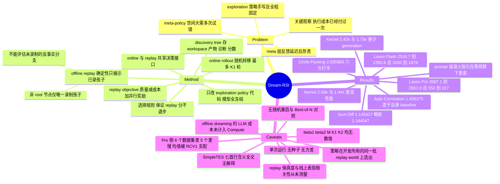

## Summary

Dream-RSI 把一轮跑完的 discovery tree 冻结成 replay simulator，让候选 exploration policy 在录好的分支上重走一遍拿到零执行成本的 off-policy 反馈，据此改写策略代码再放回线上，形成 meta-exploration 层的自改进循环——底层 coding agent、evaluator 与全部模型权重不变，只有 exploration policy 的代码在变。在 Lasso path、三个数学优化任务与四个 KernelBench kernel 上，它相对同初始化、策略冻结的 Recursive Fixed Exploration 用更少的 discovery-agent 调用（Lasso 侧 317 vs 550、1879 vs 3200）拿到持平或更好的结果。但 replay 只能重放录过的分支，全部实验单次运行、无任何方差估计，且 offline dreaming 本身的 LLM 成本未计入论文的 Compute 口径。

## Problem & Motivation

AlphaEvolve 一系的 discovery loop 把算力全投在候选解上，而决定"在哪条分支上继续、开几条新分支、并行多少、什么时候停"的 exploration 策略通常是手写且全程固定的。作者要把这一层也纳入优化，并且把障碍讲得比方法本身更清楚，这是全文最有价值的部分。

障碍有两条，都是结构性的。其一，meta 层的反馈延迟且昂贵：评一个候选解只要跑一次评测，评一个 exploration policy 却要看它如何塑造后续几十上百个 proposal–evaluation 循环。其二，meta-policy 空间很大，新写的策略大概率不如旧的，必须试很多个。两条合起来意味着每试一个策略都要付一次完整 rollout 的钱，而 RSI 恰恰需要反复试。

作者的切入点是：这笔钱已经付过了。一轮跑完的 discovery 过程本身就录下了一棵树，每个节点存着当时的 workspace、生成的产物、评测诊断和分数。既然执行结果都在，换一个策略去走这棵树就不必重新调用 coding agent 和 evaluator。论文把这个类比明确接到 model-based RL 与 Dreamer 一系上，并用脚注声明 replay simulator 与标题里的 "worlds" 同义。

## Method

系统里有四个角色，只有一个会变：固定的 discovery agent（Gemini CLI 驱动 Gemini-3.1-Pro 或 Gemini-3.7-Flash）、固定的 evaluator、可执行的 exploration policy（一段代码）、固定的 LLM policy-development agent。论文全文未说明最后这个角色用的是哪个模型（C17）。

**Discovery tree 与共享决策接口。** root $r$ 是初始 workspace，每个非 root 节点 $v$ 有唯一 primary parent，discovery agent 从 parent 存档的 workspace 续跑一次 generation–evaluation 尝试，节点里存下 filesystem snapshot、产物、评测诊断与分数 $s_v$。策略观察当前树 $\mathcal{T}$，可选节点为 $A(\mathcal{T})=\{r\}\cup\{\mathcal{T}\text{ 的叶子}\}$，动作是一个大小不超过并行 worker 数 $W$ 的 batch。online 与 replay 共用这同一个接口，区别只在选中 batch 之后的转移。

**Online rollout。** 第 $t$ 轮由 $\pi_t$ 指导，最多 $K_1$ 轮决策，每轮选中的节点并行展开各产出一个孩子。这个转移是随机的，同一个 workspace 可能生成不同结果。选空 batch 或跑满 $K_1$ 即结束，整棵树 $\mathcal{T}_t$ 进入 history $\mathcal{H}_t$。

**Offline replay（dreaming）。** $\mathcal{H}_t$ 冻结，构造 $M$ 个策略版本 $\pi_t^0,\dots,\pi_t^{M-1}$（$\pi_t^0$ 就是当前策略），每个版本在**每一棵**历史树上各评一遍。replay 的转移是确定性的：选中节点只"揭示"已录好的孩子——非 root 节点只有唯一一个录好的孩子，root 返回最早创建的那个尚未揭示的分支，录完即返回空集，最多 $K_2$ 轮（C10）。

这里有一条论文没有当作限制来写、却决定了整个方法适用边界的性质：**replay 只能重放录过的东西**。候选策略能做的是换顺序、换批次大小、多走或少走几步、早点停；它不能评估"如果在某个节点换个方向会怎样"，因为那个反事实结果从来没有被执行过。换句话说，被 dreaming 优化的其实是**预算分配、批处理与停止规则**，不是一般意义上的 exploration 策略。

**Replay objective（Eq. 1）。** $V_i^m=\max_v s_v-\beta_1 N_i^m+\beta_2 N_i^m/\max\{1,k_i^{m,\star}\}$，三项分别是发现质量（replay 中达到的最好分）、执行成本惩罚（揭示的非 root 节点数）、并行奖励（平均每轮决策执行的尝试数）。$\beta_1,\beta_2$ 的数值论文未给（C12）。

**策略选择。** $V^m=\frac{1}{t}\sum_i V_i^m$，$\pi_{t+1}=\arg\max_m V^m$。候选集包含当前策略，因此 $V^{m^\star}\ge V^0$。这是论文给出的唯一保证，它只在**固定 history 的平均 replay 分**上成立，不涉及线上表现（C11）。

## Key Results

三个域共 8 个任务。Compute 一律指累计 discovery-agent 调用数（C9）。

**算法工程：Lasso regularization path。** 在 SimpleTES 同款的 17 个合成实例上做 discovery，在 6 个 held-out 下游数据集上测 wall-clock 运行时（ms，越低越好），5 轮递归（C8、C17）。

| Method | Model | Compute | Gisette | RCV1 | DNA | Leukemia | Colon | Duke Breast | Avg. |
|:--|:--|--:|--:|--:|--:|--:|--:|--:|--:|
| sklearn | – | – | 11275.2 | 252881.7 | 93.8 | 227.2 | 229.8 | 374.0 | 44180.3 |
| glmnet | – | – | 9063.6 | 73072.8 | 351.9 | 45.0 | 24.2 | 47.7 | 13767.5 |
| SimpleTES | gpt-oss-120b | 51,200 | 3141.9 | 19625.6 | 15.9 | 15.5 | 11.6 | 18.1 | 3804.8 |
| SimpleTES† | gpt-oss-120b | 51,200 | 8651.0 | 41143.1 | 37.6 | 28.2 | 19.5 | 31.1 | 8318.4 |
| Recursive Fixed | Gemini-3.1-Pro | 550 | **1861.8** | 19550.1 | **41.5** | **26.1** | **14.5** | **28.4** | 3587.1 |
| Recursive Fixed | Gemini-3.7-Flash | 3200 | 1133.1 | 13873.0 | 29.8 | 24.1 | 15.7 | 24.4 | 2516.7 |
| Dream-RSI | Gemini-3.1-Pro | 317 | 2841.0 | 14616.0 | 49.9 | 30.2 | 16.4 | 32.5 | 2931.0 |
| Dream-RSI | Gemini-3.7-Flash | 1879 | 1091.9 | 12923.4 | 31.4 | 21.0 | 12.2 | 23.6 | 2350.6 |

（粗体为笔记标注的、Recursive Fixed 优于同 backbone Dream-RSI 的格子，非论文原有标注。）

论文的读法是"更好的 quality–compute 权衡"：Pro 侧 3587.1 → 2931.0 且 550 → 317，Flash 侧 2516.7 → 2350.6 且 3200 → 1879（C1、C2）。但逐列看，Pro 侧 Dream-RSI 在 6 个数据集里有 **5 个更慢**，只在 RCV1 上更快（C3）。RCV1 与其余五列相差三到四个数量级，而 Avg. 的算法论文从未定义（C4）——按未加权算术均值反算（以下为笔记推算，非论文陈述）：RCV1 单独贡献 $(19550.1-14616.0)/6=822.4$ ms 的改进，其余五列合计让均值**变差** $166.3$ ms，两者相加正好等于表中的 $3587.1-2931.0=656.1$。也就是说 Pro 侧的头条改进完全由一个数据集撑起，其余五个是净损失。Flash 侧结论相反，6 个里赢 5 个（只输 DNA），那一侧的"更好的权衡"是成立的。

对 SimpleTES 的比较同理：SimpleTES 在 DNA、Leukemia、Colon、Duke Breast 四个小数据集上更快，Dream-RSI 只赢 Gisette 与 RCV1（C4）。"两个数量级更少调用下取得更低平均运行时"字面为真，但这个平均同样是被 RCV1 支配的。

**数学优化（Table 1，10 轮，均用 Gemini-3.1-Pro）。**

| Method | LLM | Sum Diff ↑ | Auto Correlation ↓ | Circle Packing ↑ |
|:--|:--|--:|--:|--:|
| AlphaEvolve | Gemini-2.0 Pro + Flash | – | 1.455700 | 2.635862 |
| AlphaEvolveV2 | Gemini-2.0 Pro + Flash | 1.121936 | – | 2.635983 |
| OpenEvolve | - | – | 1.460000 | - |
| CodeEvolve | - | – | – | 2.635980 |
| ShinkaEvolve | Mixed | – | 1.457800 | 2.635982 |
| TTS-Discovery | Qwen3-8B | – | – | 2.635983 |
| ThetaEvolve | Distilled-Qwen3-8B | – | 1.493000 | 2.635983 |
| EvoX | Gemini-3.0-Pro | – | 1.458900 | 2.635900 |
| SimpleTES | GPT-OSS-120B | 1.143975 | **1.453675** | 2.635983 |
| Recursive Fixed | Gemini-3.1-Pro | 1.144047 | 1.456001 | 2.635983 |
| Dream-RSI | Gemini-3.1-Pro | **1.145427** | 1.456375 | 2.635983 |

三个任务里，相对受控 baseline 的净胜只有 Sum Diff 的 $+0.0014$（0.12%）。Circle Packing 上 Dream-RSI、Recursive Fixed、SimpleTES、AlphaEvolveV2、TTS-Discovery、ThetaEvolve 六方完全相同到小数点后六位。Auto Correlation 上 Dream-RSI 的 1.456375 **差于自己的 Recursive Fixed**（1.456001），也差于 AlphaEvolve 与 SimpleTES，加粗的是 SimpleTES 而非 Dream-RSI；论文的措辞是 "remaining competitive"（C6）。Table 1 没有 Compute 列，"50× 预算节省"只能靠正文的 "fewer than 1,000 generations" 与 SimpleTES 的 51,200 相除得到（C5）。

**GPU kernel（KernelBench，Figure 4）。** VGG16 与 LayerNorm 报"以 2.43× / 1.79× 更少 generation 达到相当性能"，ConvDiv 与 ConvMax 报"相同预算下性能高 2.09× / 1.44×"。四个任务用了两套比较轴，没有一个统一指标贯穿全部，也没有绝对数值表格（C7）。

**§5.1 消融（仅 ConvDiv）。** 把历史抽象成方向性建议注入 prompt，在等预算下对 Dream-RSI 与 Recursive Fixed **都**劣于不加指引的版本。作者的解释是强语义先验过度约束了并行探索的多样性（C16）。

**§5.2 行为演化（ConvDiv）。** 正文只给了"评估尝试数从 110 降到 50"这一句；Figure 6 的数据标签给出完整 9 轮（C15）：

| 轮次 | E0 | E1 | E2 | E3 | E4 | E5 | E6 | E7 | E8 |
|:--|--:|--:|--:|--:|--:|--:|--:|--:|--:|
| round-best (1/ms) | 0.427 | 0.625 | 0.855 | 1.403 | 1.488 | 1.499 | 1.770 | 1.880 | 1.898 |
| 评估尝试数 | 110 | 110 | 87 | 80 | 50 | 92 | 80 | 91 | 86 |

## Evidence Ledger

| Claim ID | Claim | Type | Source locator | Evidence excerpt | Status |
|:--|:--|:--|:--|:--|:--|
| C1 | Lasso/Gemini-3.1-Pro：Dream-RSI 2931.0 ms / 317 calls，Recursive Fixed 3587.1 ms / 550 calls | number | Figure 3(a) 表 + §4.1 Main Results | "reduces the average runtime ... from 3587.1 ms to 2931.0 ms while using only 317 discovery-agent calls, compared with 550" | source-verified |
| C2 | Lasso/Gemini-3.7-Flash：2350.6 ms / 1879 calls vs 2516.7 ms / 3200 calls | number | Figure 3(a) 表 + §4.1 | "further reduces the average runtime from 2516.7 ms to 2350.6 ms using 1879 calls instead of 3200" | source-verified |
| C3 | Gemini-3.1-Pro 下 Dream-RSI 在 6 个 held-out 中 5 个慢于 Recursive Fixed（2841.0/1861.8、49.9/41.5、30.2/26.1、16.4/14.5、32.5/28.4），仅 RCV1 更快（14616.0/19550.1） | number | Figure 3(a) 表 | 表行 "Dream-RSI / Gemini-3.1-Pro / 317 / 2841.0 / 14616.0 / 49.9 / 30.2 / 16.4 / 32.5 / 2931.0" | source-verified |
| C4 | SimpleTES 在 DNA/Leukemia/Colon/Duke Breast 四列快于 Dream-RSI-Pro；"Avg." 的计算口径论文未定义 | comparison | Figure 3(a) 表 + caption | caption 仅有 "Final wall-clock runtime on six held-out downstream tasks; lower is better" | source-verified（verifier 附注：Avg. 口径未定义；未加权算术均值读法经逐行反算成立） |
| C5 | Intro 声称对 SimpleTES 最多 162×、对 fixed-exploration 1.7× 的调用削减，数学侧 >50×，kernel 侧 1.79×–2.43× 或最多 2.09× | number | §1 Introduction | "reducing agent calls by up to 162× over SimpleTES and 1.7× over fixed-exploration baselines" | source-verified |
| C6 | Table 1：Sum Diff 1.145427 > 1.144047 > 1.143975；Auto Correlation（越低越好）1.456375 差于 Fixed 1.456001、AlphaEvolve 1.455700、SimpleTES 1.453675；Circle Packing 2.635983 六方相同 | number | Table 1 | "Dream-RSI / Gemini-3.1-Pro / 1.145427 / 1.456375 / 2.635983" | source-verified（Auto Correlation 加粗的是 SimpleTES，非 Dream-RSI） |
| C7 | KernelBench 仅给比值，四任务分用两套比较轴，无绝对数值表 | number | §4.3 + Figure 4 caption | "reaches comparable performance with 2.43× and 1.79× fewer generations" | source-verified |
| C8 | 每轮预算 Pro 10×11=110 calls、Flash 32×20=640 calls；Lasso 5 轮、数学 10 轮；Round 1 两法对齐 | benchmark-setting | §4 前言 + §4.1 + §4.2 | "10 parallel workspaces with up to 11 refinement steps (10×11=110 discovery-agent calls)" | source-verified |
| C9 | Compute 定义为累计 discovery-agent 调用数；offline dreaming 中 policy-development agent 的 M 次改写与 t 棵树的重放评估未计入任何报告成本 | benchmark-setting | §4 前言 + §3 Policy improvement | "The discovery cost is quantified by the total cumulative number of discovery-agent calls." | source-verified |
| C10 | replay 对非 root 节点只返回其唯一录制孩子、对 root 返回最早创建的未揭示分支，不生成 T_i 之外的结果 | causal-mechanism | §3 Offline evaluation | "replay returns recorded children of the selected nodes deterministically rather than generating new candidates" | source-verified |
| C11 | 单调性仅在固定 history 的平均 replay 分上成立；论文未给线上改进保证，也未测量 replay 分与线上表现的相关性 | causal-mechanism | §3 Policy improvement and selection；全文 | "no worse than the current policy π_t in average replay score on the fixed history H_t" | source-verified |
| C12 | β₁、β₂、M、K₁、K₂ 全文只有符号、无数值 | benchmark-setting | §3；全文 | "For fixed coefficients β₁, β₂ ≥ 0, the replay score is" | source-verified（Finder 曾误判 Appendix A 为空，verifier 核实其确有三个数学任务的形式定义，已更正） |
| C13 | 全文无随机种子、无重复运行、无 error bar、无标准差 | benchmark-setting | 全文 | (no matching text found) | source-verified |
| C14 | 唯一受控 exploration 对照为 Recursive Fixed Exploration；无随机 / 随机重启 / Best-of-N / 随机 meta-policy 对照 | sota-novelty | §4 前言、§4.1–4.3、§5 | "Our primary controlled baseline is Recursive Fixed Exploration, which ... keeps the exploration policy fixed across recursive discovery rounds." | source-verified |
| C15 | §5.2 正文只给 "110 → 50"；Figure 6 数据标签给出 9 轮 round-best 0.427→1.898 与尝试数 110/110/87/80/50/92/80/91/86 | number | §5.2 + Figure 6(a)(b) 数据标签 | "reducing the number of evaluated attempts from 110 to 50" | source-verified |
| C16 | §5.1：prompt 级语义指引在等预算下对两种范式都劣于不加指引；实验仅在 ConvDiv 上做 | comparison | §5.1 + Figure 5 | "explicit directional guidance consistently underperforms its unguided counterpart across both paradigms under equivalent discovery budgets" | source-verified |
| C17 | 8 任务 / 三域；Lasso 用 SimpleTES 同款 17 个合成实例 + 6 个 held-out；kernel 为 VGG16/LayerNorm/ConvDiv/ConvMax；policy-development agent 用哪个模型全文未说明 | benchmark-setting | §1、§3、§4.1、§4.3 | "A fixed LLM-based policy-development agent uses this feedback to revise the exploration policy code" | source-verified |
| C18 | Figure 3(a) 含 SimpleTES† 行（8651.0 / 41143.1 / 37.6 / 28.2 / 19.5 / 31.1 / Avg. 8318.4，同为 51,200 generations），全文无处解释 † | number | Figure 3(a) 表 + caption | "SimpleTES † / gpt-oss-120b / 51,200 / 8651.0 / 41143.1 / 37.6 / 28.2 / 19.5 / 31.1 / 8318.4" | source-verified（† 在全文仅出现一次，无对应说明） |
| C19 | 论文列出 github.com/zhengkid/Dream-RSI 与 dream-rsi.com；未声明 license，也未明确声明代码已发布 | license-code | 题名页链接行 | "github.com/zhengkid/Dream-RSI \| dream-rsi.com" | source-verified |
| C20 | 17 位作者；渲染出的机构为 Google、Google Deepmind、University of Maryland College Park、University of Virginia；cs.CL；12 页；2026-09-14 v1 | number | 题名页 + arXiv abs 页 | "arXiv:2609.14858v1 [cs.CL] 14 Sep 2026" | source-verified（HTML 中的 "\thepa" 为宏未展开的渲染残留，PDF 中该机构为 Google） |
| C21 | Appendix B.2 Listing 2 告知 policy-development agent：replay 中超出冻结轨迹 branch/refine 计数的 plan "out of support and cannot earn replay reward" | causal-mechanism | Appendix B.2, Listing 2 | "a requested plan beyond the frozen trace's ... is out of support and cannot earn replay reward" | not-checkable |
| C22 | Listing 2 的排序口径为 "pareto.reward = pareto.auc - lambda * parallel_penalty"（对策略的单个 beta 旋钮做 sweep），与 §3 Eq.(1) 的标量 V 不是同一函数 | benchmark-setting | Appendix B.2, Listing 2 vs §3 Eq.(1) | "The evaluator sweeps your single ``beta`` knob and ranks the resulting curve by: pareto.reward = pareto.auc - lambda * parallel_penalty" | not-checkable |
| C23 | Listing 2 设 "Learn from history without leaking outcomes" 一节，要求 "never copy a trace-specific branch, cell id, score, or target into policy logic"；未见 replay world 的训练/验证划分 | causal-mechanism | Appendix B.2, Listing 2；§3–§5 | "never copy a trace-specific branch, cell id, score, or target into policy logic" | not-checkable |

> C1–C20 由独立 verifier 逐条定位核对，两处 Finder 误读已被纠正并写回正文（Appendix A 实有内容；机构以 PDF 渲染为准）。C21–C23 为 Finder 从 Appendix B.2 Listing 2 摘出的原文，独立核查未在本轮时限内返回，故一律降级为 not-checkable——下文凡引用这三条处均已标明边界，它们不进入 Summary 与 Key Results。source-verified 仅表示 primary source 确实这么写，不表示结果已被独立复现。

## Strengths & Weaknesses

**问题选得对，而且拆解得干净。** 把"改进候选解"与"改进产生候选解的搜索过程"分成两层，并指出后者的瓶颈是反馈延迟而非算力短缺，这是 AlphaEvolve 一系没有正面处理的问题。机制本身也符合 simple 的正确用法：replay 不训练任何 dynamics model、不做任何额外执行，只是把已经付过的执行成本回收再用一次。策略是**可读可审计的代码**而不是权重或 prompt，$V^{m^\star}\ge V^0$ 的选择规则又提供了一个廉价的保底，避免了 self-evolution 里常见的"改坏了也照用"。这几点合起来是一个值得记住的设计模板。

**§5.1 的负面结果比主结果更有信息量。** 把历史压缩成 prompt 里的方向性建议，在等预算下对两种范式**都**更差（C16）。这条和 [[Papers/2607-RethinkSkillEvolve]] 的结论指向同一件事：历史的价值在于它是一个可被重新检索、重新排序的结构，而不在于它能被总结成什么结论；一旦压缩成语义先验，损失的是搜索多样性。这是一个可迁移的判断，不限于本文的 setting。

**但 replay 的保真度从头到尾没有被验证过，而全文的说服力都押在它上面。** 论文唯一的保证是 replay 分上的单调性，且这个选择是在**开发策略所用的同一批 replay world** 上做的——没有 held-out replay world，没有"把选中的策略放到它没见过的历史树上再评一遍"，因此对 replay 过拟合的风险既没有被防住也没有被测量（C11、C23）。更根本的是覆盖问题：非 root 节点只有唯一一个录好的孩子（C10），所以 replay 里根本不存在"换个方向会怎样"的反事实结果。被 dreaming 优化的只能是预算分配、批处理与停止规则。这条边界论文没有明说，而它直接决定了"exploration policy"这个词在本文里的实际含义比字面窄得多。off-policy 的分布漂移还是自我强化的：history 由当前策略产生，候选策略越偏离它，可 replay 的覆盖就越差，而 Eq. (1) 里没有任何 pessimism、importance weighting 或覆盖度项来处理这件事。

> 以下一段基于 Appendix B.2 Listing 2 的原文摘录，对应 C21/C22，独立核查未完成，作为待验证的怀疑记录，不作为结论使用。给 policy-development agent 的 prompt 把 replay 环境描述成 "a frozen, irregular branch×attempt grid"，并写明超出冻结轨迹宽度/深度的 plan "out of support and cannot earn replay reward"。若这一条成立，则 replay 目标**系统性地惩罚任何比产生该历史的策略更激进的探索**，而观察到的"学会省算力"（317 < 550、110 → 50）就有一个平凡解释：它可能是目标函数支撑集的产物，而不是学到的洞察。同一段 prompt 里的排序口径 `pareto.reward = pareto.auc - lambda * parallel_penalty` 与正文 Eq. (1) 的标量 $V$ 也不是同一个函数，正文从未提及 beta sweep、`pareto.auc`、`lambda` 或 `plan_grid`。这两条如果属实，是本篇最该补的实验与最该补的说明。

**最朴素的对照缺席。** 唯一的受控 baseline 是 Recursive Fixed Exploration，没有随机重启、没有 Best-of-N / parallel sampling、也没有"随机 meta-policy 在同一批 replay world 上"的地板对照（C14）。这一缺口在本文格外要紧，因为 Dream-RSI 的省钱正是通过**少花**实现的——317 是在 550 的上限下只用了 317，不是在同样花费下做得更好。没有随机对照，就无法排除"策略只是变保守了"这个解释。vault 里 [[Papers/2607-RethinkSkillEvolve]] 恰好补过这一刀：oracle Parallel Sampling 在 SearchQA 上只落后 evolved skill 0.43 点，在 SpreadsheetBench 上才落后 30.96 点——即"多花推理算力"能替代一部分演化增益、替代不了另一部分，而区分这两类正需要本文没做的对照。

**递归轮数够，但每轮增益是否降到噪声无法判断。** Lasso 5 轮、数学 10 轮、ConvDiv 分析 9 轮（C8、C15）。ConvDiv 是唯一有逐轮数字的任务，按 Figure 6 的数据标签推算（以下为笔记推算，非论文陈述）：八次转移的增量为 $+0.198,+0.230,+0.548,+0.085,+0.011,+0.271,+0.110,+0.018$，最后一轮只有 $+0.018$（约 1%）。增益不是平滑递减而是块状的——E3 一轮独占全程总增益的 37%，E5 几乎为零，E6 又跳起来。更值得注意的是，尝试数与增益并不同向：论文叙述为"进展停滞时重新加大探索投入并伴随进一步收益"，但尝试数最多的那一轮（E5，92 次）恰好产出全程最小的增益（+0.011），而随后增益最大的 E6 只用了 80 次。这个机制主张在它自己的数据上支持得很弱。配合单次运行、零种子、零方差估计（C13），而 Table 1 的差距落在小数点后第四位、Circle Packing 干脆完全打平——在这个精度上没有重复实验就无法把增益与噪声分开。

**计算成本的口径与 baseline 不对齐。** Compute 只数线上 discovery-agent 调用（C9）。offline dreaming 里 policy-development agent 要做 $M$ 次代码改写，每次还要在 $t$ 棵 replay 树上评估——这些都是真实的 LLM 推理，而 $M$ 从未给出数值（C12），也从未计入任何报告数字。论文说 replay "negligible execution cost" 只对 evaluator 与执行器成立。随着 $t$ 增大，offline 成本至少线性增长，线上成本却在被压缩，所以 162× 与 1.7× 不是端到端口径。这与 [[Topics/SelfEvolvingAgents-Survey]] §7.5 记下的那条系统性缺口是同一种：报告的是"某个演化机制 + 某项未计价资源"的联合效应，而结论被写成前者的效应。

**可复现信息偏薄。** $\beta_1,\beta_2,M,K_1,K_2$ 全无数值，policy-development agent 用的是哪个模型未说明（C12、C17）。Figure 3(a) 里的 SimpleTES† 行（Avg. 8318.4，比 SimpleTES 自报的 3804.8 差一倍以上）在全文没有任何地方解释 † 是什么（C18）——若这是作者的复现结果，那它同时说明表内 baseline 数字的来源并不统一，而这正是"两个数量级更少调用"那个对比的分母。代码链接与项目页有，但论文既未声明 license 也未明确声明已发布（C19）。

**放进 vault 的谱系里。** 按 [[Topics/SelfEvolvingAgents-Survey]] §7.5 给出的三条判据——generation ≥2、演化系统本身是否也在被演化、权重更新是否发生在部署后——Dream-RSI 满足第一条（5–10 轮）、不满足第二条（policy-development agent 与其 prompt 全程固定，只有被它改写的 exploration policy 在变）、第三条不适用（完全不动权重）。所以它的 "recursive" 指的是同一层策略被反复替换，而不是改进机制本身被改进，与 [[Papers/2607-MetaSkillEvolve]] 的两级递归不在同一层。这不降低它的价值，但标题里的 RSI 与实物之间确实存在该 survey 已经记录过的那种系统性错位。

**影响判断。** 如果 replay 保真度能被独立验证，"把已完成的搜索树当成零成本的 off-policy 评估环境"是一个可以搬到任何 tree-structured agent search 上的通用原语。本文没有给出这个验证，所以目前它更接近一个论证充分的 position 加一批初步证据。笔记 rating 给 4 是给这个原语和那条负面消融的，不是给当前的证据强度——按证据强度单独打分应该是 2。

## Mind Map

## Notes

- **最想要的那条实验，成本几乎为零**：把 replay world 做训练/验证划分。现在 $\pi_{t+1}$ 是在开发它所用的全部 $t$ 棵树上按平均 replay 分选出来的（C11），留一棵出来做 held-out 就能直接量出"replay 分在没见过的历史树上还剩多少预测力"。再进一步，把每一轮选出的策略的 replay 分与它实际部署后的线上收益配对，画一张散点图算个相关系数——这是整篇论文最该有而没有的一张图，也是 replay simulator 这个概念能不能承重的唯一判据。

- **第二条实验：地板对照。** 在同一批冻结的 replay world 上跑一个随机 meta-policy 和一个"固定预算平均分配"的策略，看 Eq. (1) 的分数分布。如果 dreaming 选出的策略与随机策略的 replay 分分布重叠得厉害，那么 $M$ 次 LLM 改写买到的东西就很有限。这条与线上的 Best-of-N 对照（C14 缺口）是互补的：前者测 meta 层的搜索是否有效，后者测 meta 层是否必要。

- **一个可以立刻做的组合**：[[Topics/SelfEvolvingAgents-Survey]] §7.3 记下了一个悬而未决的对照——DGM 的即时分数、HGM 的 clade 级聚合（CMP 与真实改进 Pearson 0.778 vs DGM guidance 0.285）、[[Papers/2607-MANTA]] 的过程 flag，这三类 parent-selection 信号从未在同一 testbed 上比过。Dream-RSI 的 replay simulator 恰好就是那个 testbed：录好的 discovery tree 上可以零执行成本地把三种选择规则各跑一遍。这是把本文的工具与 vault 里一个明确空白直接对接的路子，且不需要重新跑任何昂贵的 discovery。需要先检索是否已有人在 recorded search tree 上做过 parent-selection 信号的对照。

- **replay 覆盖是这个方法的真正天花板，也是最自然的攻击点。** 现在的 replay 只能重放录过的分支（C10），所以它能改进的东西被限制在"何时停、怎么批、先走哪条"。要突破这一层，需要的不是更大的 history，而是一个能对未录制分支给出**带不确定度的**结果估计的组件——即把纯查表的 replay 换成 replay + 一个学到的残差预测器，并在 Eq. (1) 里对落在低覆盖区域的动作加 pessimism 项。这是一个有机制假设、有可学习组件的改动，方向上与 [[Papers/2608-WMRL]] 的 anchor 自审计思路同构（用少量真执行校准一个便宜的代理信号），但作用的层次不同：WMRL 校准的是候选解的分数，这里要校准的是 exploration 决策的后果。

- **待验证的怀疑**（对应 C21/C22，独立核查未完成）：Appendix B.2 里 "out of support and cannot earn replay reward" 这一条，以及 Listing 2 的 `pareto.reward` 口径与正文 Eq. (1) 的关系。前者若成立，则本文观察到的"学会省算力"很可能是目标函数支撑集的产物；后者若成立，则正文的形式化与实际实现不是同一个目标。代码仓库应该能直接看出来，值得挂一轮 `repo-digest`（`code` 字段非空，且这是一篇贡献主要在 orchestration 实现里的工作）。

- 相关笔记：[[Papers/2607-MetaSkillEvolve]]（同样做"递归"，但它把改进流程本身也纳入演化，是真正的两级；Dream-RSI 的 policy-development agent 固定，只有一级）、[[Papers/2607-RethinkSkillEvolve]]（提供了本文缺的那类对照——oracle Parallel Sampling，并给出"哪类增益能被 test-time scaling 吃掉"的判据）、[[Papers/2608-WMRL]]（同样用便宜代理替代昂贵执行，但保留 anchor 流做在线校准与自审计，这正是 Dream-RSI 缺的保真度机制）、[[Papers/2511-DreamGym]]（同样"在想象里训练"，但它**合成**新经验、Dream-RSI 只**重放**旧经验；两者对覆盖不足给出了相反的答案）、[[Papers/2505-DarwinGodelMachine]] 与 [[Papers/2510-HuxleyGodelMachine]]（自改代码谱系；HGM 的 parent-selection 洞察与本文的 exploration policy 是同一个问题的两种写法）、[[Topics/SelfEvolvingAgents-Survey]] §7.2–§7.5。
