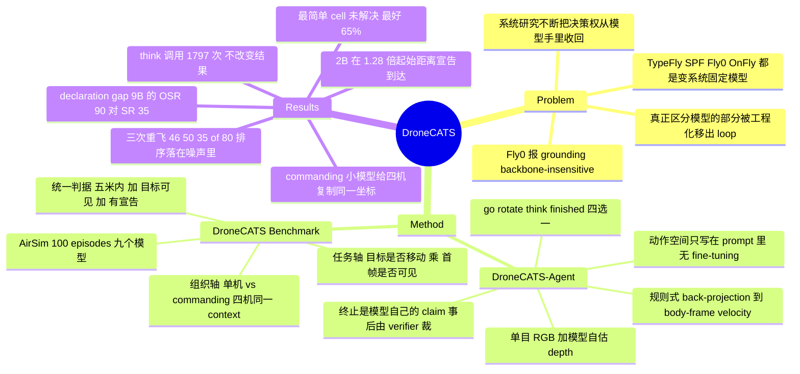

## Summary

把 MLLM 直接放进无人机控制闭环——动作空间只用自然语言写在 prompt 里（go / rotate / think / finished），搜索、思考与"宣告到达"都交还给模型自己决定——然后固定这套 agent、只换模型，横评 9 个 MLLM。核心发现是小模型的瓶颈不在飞行而在 protocol adherence：Qwen3.5-9B 进入 5 m 成功半径的比例（90%）高于任何 frontier 模型，却只有 35% 转化成成功，因为它平均在起始距离的 0.63 处就宣告到达。

## Problem & Motivation

现有 MLLM 无人机系统有一条共同轨迹：不断从模型手里收回决策权。TypeFly 让模型只当 detection 之上的 planner；See, Point, Fly (SPF) 把控制降为在图像上指一个像素；Fly0 把 MLLM 限制在 semantic grounding，飞行交给 LiDAR + Ego-Planner；OnFly 加一个 verifier，在模型输出到达执行器前先纠正它。每一步都报告"这样做有效"。

问题是这些工作全都在**变系统、固定模型**，因此回答不了反向的问题：embodied drone control 里到底哪一部分真正依赖模型能力。Fly0 的数据把这个盲点摆在明面上——限制在 grounding 角色后，GPT-5、Gemini 3 Pro、Claude 3.7 Sonnet 与 Qwen2.5-VL-32B 落在彼此 1.1 分以内（70.4%–71.5% 成功率），连 3B 模型都只落后最好者不到 6 分。作者的解读不是"backbone 不重要"，而是：grounding 恰恰是这些模型已经会做的部分，真正区分模型的那一部分被工程化地移出了 loop，所以没被测到。

本文把它移回来：固定 agent，只换模型。

## Method

### DroneCATS-Agent：动作空间只存在于 prompt 里

模型每步收到一张 egocentric RGB 帧 + instruction + 最近 5 个动作，返回**一个** JSON object，四选一：

| Action | 载荷 | 作用 |
|:--|:--|:--|
| `go` | 图像点（两轴归一化到 0–1000）+ depth（米） | 沿 SPF 的 point-and-distance 接口，把 grounding 与推进耦合在一起 |
| `rotate` | yaw 角（prompt 要求每步 ≤ ±90°） | 让 out-of-view search 可表达——不在视野里的目标无法被指点 |
| `think` | 无 | 悬停一步；把 test-time compute 变成一个可显式调用的动作 |
| `finished` | 无 | 宣告到达 |

三个设计选择值得单独拎出来：

**终止是模型自己的 claim。** `finished` 物理上也只是悬停，episode 并不结束——scaffold 记下这次 declaration 继续飞，由 verifier 事后判定它是否成立。作者的论证不是"这样更准"，而是 composability：一台能被 commander 委派的无人机必须自己知道任务完成并上报，而"盯着真实距离的外部裁判"只存在于 benchmark 里，真实部署中不存在。这一条直接决定了 commanding 设置能不能成立。

**`think` 是为下一步买单，不是为当前步。** scaffold 检查上一个动作，只有当它是 `think` 时才为**当前**调用打开 extended reasoning（默认全程关闭）。也就是说模型请求的是"下一步想清楚一点"，prompt 里也是这么写的。从不发 `think` 的模型全程跑在便宜档。

**模型下面的一切都是 rule-based、model-agnostic。** pinhole back-projection：f = W/(2·tan(φ/2))，φ=90°，1280×720，principal point 取图像中心；水平 bearing 超过 8° deadband 先原地 yaw，垂直分量小于水平距离的 0.15 就丢弃、保持高度；剩余位移 clamp 到 3 m，以 body-frame velocity setpoint 保持 2.5 s（因此速度 ≤1.2 m/s，且从不侧移，横向运动全靠先转）；depth < 5 m 步长 ×0.6，< 2 m 归零刹车。`rotate` 是 60°/s 的 rate command 保持 |θ|/60 s。唯一为模型让的步：`[x, y]` 还是 `[y, x]` 按模型训练惯例切换，parser 同步跟随。

传感器只有单目 RGB。模型报的 depth 是它自己的估计——不给 intrinsics、不给焦距——作者明确把它当"步长提议"而非标定的 metric depth。

### DroneCATS：两条轴、一个判据

任务轴是 2×2：目标是否移动 × 首帧是否可见 → Approaching / Searching / Tracking / Search-and-Track。组织轴是单机 vs commanding（N=4，四路视图按固定顺序进同一个 context，模型在一次回复里给四架各出一条指令）。

**统一成功判据**：存在至少一次 arrival declaration，其发生时刻无人机在 3D 距目标中心 ≤ δ=5 m 且目标对相机可见。三条推论——同一条规则打分全部四个 cell（早期版本给 tracking 用 10 秒 dwell window、其他用距离，导致列间不可比）；所有 declaration 都算而非只看最后一次；穿过 goal region 但从不 declare 记失败。判定 post hoc 从 declaration log + 2 Hz pose trace 重算，所以 δ 可以改而不用重飞。

**规模**：AirSim 1.8.1 + 内置 SimpleFlight（非 PX4 SITL），residential 与 campus 两张 Unreal 图，每 cell 每图 10 episode → 20/cell、80 单机；commanding 另加 20（10 residential + 10 Blocks），共 100 episodes，全部在仿真里。Roster 9 个模型：GPT-5、Claude Opus 5、Gemini 3.7 Flash、Gemini Robotics-ER 2（API frontier）+ Qwen3.5 的 2B/4B/9B/27B 阶梯 + Cosmos3-Edge-2B（只服务其 reasoner tower）。全部 zero-shot，temperature 0.4，8192 output cap；5 个开源模型走 JSON schema 约束解码，4 个 API 模型自由解码——全 run 只有 2 条 reply 解析失败，作者据此排除"格式问题"作为失败解释。

**Commanding 的额外设计**：场景里放 4 个同款同色 look-alike，只有铭牌不同（residential 是车牌、Blocks 是招牌文字），且只有近距离可读，instruction 点名铭牌。作者用 stationary probe 把"读数距离"这个混杂变量先量掉：招牌（字高 0.136 m）两个 Gemini 读到 13 m、多数 roster 10 m、Claude Opus 5 8 m；车牌（数字 0.10 m）9 个模型里 8 个读到 8 m、GPT-5 6 m、10 m 无人能读。起始网格距目标 12–32 m，所以识别不需要进 5 m 成功半径，而 roster 内读数距离跨度只有 2 m（车牌）/ 5 m（招牌），远小于 commanding 成绩的跨度。

## Key Results

**（1）最简单的 cell 没有被解决。** 首帧可见的静态目标，最好的模型（Gemini 3.7 Flash）65%（13/20）；把目标从首帧撤走，同一模型掉到 40%，且没有任何模型超过 40%。

一机四 cell 成功率（SR，%，n=20；OSR = 轨迹曾进入 δ、忽略 declaration，是诊断量不是成绩）：

| Model | App SR/OSR | Sea SR/OSR | Trk SR/OSR | S&T SR/OSR | 四格均值 SR |
|:--|:--|:--|:--|:--|:--|
| Gemini 3.7 Flash | 65 / 70 | 40 / 40 | 80 / 85 | 45 / 45 | 57.5 |
| Gemini Robotics-ER 2 | 35 / 40 | 30 / 30 | 75 / 75 | 50 / 50 | 47.5 |
| Qwen3.5-27B | 25 / 25 | 5 / 10 | 60 / 60 | 45 / 45 | 33.8 |
| GPT-5 | 60 / 65 | 35 / 40 | 15 / 30 | 5 / 15 | 28.8 |
| Claude Opus 5 | 35 / 40 | 10 / 15 | 30 / 35 | 30 / 40 | 26.3 |
| Qwen3.5-9B | 35 / **90** | 10 / 25 | 20 / 65 | 20 / 30 | 21.3 |
| Qwen3.5-4B | 15 / 35 | 15 / 35 | 15 / 25 | 5 / 5 | 12.5 |
| Qwen3.5-2B | 0 / 30 | 0 / 50 | 0 / 35 | 0 / 20 | 0 |
| Cosmos3-Edge-2B | 0 / 25 | 0 / 0 | 0 / 30 | 0 / 0 | 0 |

模型排序在 cell 之间不稳定：GPT-5 的 approaching 只比最好者差一个 episode（60 vs 65），tracking 却只有 15% 对 80%。embodiment 特化没买到 headroom——Gemini Robotics-ER 2 四格均值 47.5% 低于同门 generalist 的 57.5%（作者自己指出这个差距与方差审计同量级）。Qwen3.5 阶梯在 SR 上单调（27B/9B/4B/2B = 33.8 / 21.3 / 12.5 / 0）。

**（2）核心发现：失败在宣告，不在飞行。** Approaching 的三个嵌套量（进入 δ / 宣告到达 / 两者兼有）在 frontier 模型上同步变化，在小开源模型上劈开：

| Model | SR | OSR | 宣告到达率 | approach ratio | NE (m) | 宣告距离/起始距离 |
|:--|:--|:--|:--|:--|:--|:--|
| GPT-5 | 60 | 65 | 70 | 0.64 | 21.0 | 0.20 |
| Claude Opus 5 | 35 | 40 | 75 | 0.65 | 10.2 | 0.39 |
| Gemini 3.7 Flash | 65 | 70 | 90 | 0.71 | 8.7 | 0.24 |
| Gemini Robotics-ER 2 | 35 | 40 | 80 | 0.58 | 23.0 | 0.30 |
| Qwen3.5-27B | 25 | 25 | 90 | 0.51 | 10.1 | 0.48 |
| Qwen3.5-9B | 35 | 90 | 75 | 0.82 | 13.6 | 0.63 |
| Qwen3.5-4B | 15 | 35 | 45 | 0.62 | 8.7 | 0.42 |
| Qwen3.5-2B | 0 | 30 | 25 | 0.57 | 24.3 | 1.28 |
| Cosmos3-Edge-2B | 0 | 25 | 0 | 0.52 | 15.2 | — |

Qwen3.5-9B 是最锋利的一例：进入 δ 的比例 90% 高于任何 frontier 模型，approach ratio 0.82 也是全场最高，但只转化 35%，平均在起始距离的 0.63 处就宣告到达。两端失败是同一种能力的两侧——Qwen3.5-2B 在 1.28 倍起始距离处宣告（一米没走完就说到了）且从不成功；Cosmos3-Edge-2B 会飞（25% 的 episode 进入 δ，平均关闭一半起始距离）但一次都不宣告。2B/4B 仍分别关闭 57%/62% 的起始距离——小端的约束不是导航。frontier 模型的宣告距离比在 0.20–0.39。per-cell OSR 表明这不是 approaching 独有：Qwen3.5-9B 在四个 cell 里 OSR 都高于 SR，Qwen3.5-2B 四个 cell 都进过 δ 而一个都没转化。

**（3）Commanding 把同一条裂缝放大。** 单机排序不迁移：

| Model | 单机 App SR | Commanding Reached | Declared | Commanding SR |
|:--|:--|:--|:--|:--|
| Gemini 3.7 Flash | 65 | 80 | 90 | 80 |
| Gemini Robotics-ER 2 | 35 | 75 | 90 | 65 |
| GPT-5 | 60 | 45 | 35 | 20 |
| Qwen3.5-27B | 25 | 15 | 100 | 15 |
| Qwen3.5-9B | 35 | 55 | 30 | 15 |
| Qwen3.5-2B | 0 | 5 | 85 | 5 |
| Claude Opus 5 | 35 | 5 | 20 | 0 |
| Qwen3.5-4B | 15 | 10 | 20 | 0 |
| Cosmos3-Edge-2B | 0 | 20 | 0 | 0 |

两个 Gemini 保住了协议（reach 80/75%、declare 90%、转化 80/65%）；其余模型在"辨认铭牌"这件事被考到之前就已经输掉 episode。GPT-5 reach 45% 但只 declare 35%，每 episode 只走 16 个 team-step（Gemini 是 45），失败的 episode 全部耗尽 300 秒预算；Qwen3.5-27B 与 2B 反过来，declare 100%/85% 而 reach 只有 15%/5%，verifier 一条条驳回。

还有一种单机不可能产生的失败：**把四路视图当成一路**。在四架同时收到 `go` 的步上，Qwen3.5-9B 有 70% 的情况给四架发同一个像素点、27B 有 58%，而 GPT-5、Claude Opus 5、Gemini Robotics-ER 2 从不这样做，Gemini 3.7 Flash 只有 1%。一次回复粘贴进四个不同场景，四条指令里至多一条是 grounded 的。

**（4）think 没有改变结果。** roster 在本次 run 里调用了 1,797 次 `think`。与同等推进速率的非 think 步匹配后，think 之后的三步只多走 +0.03 m/step（739 次观测）；think 打破停滞的比例 1/230 低于普通步的 103/8401；目标出框时三步内重新捕获的比例 13.5%（think）对 13.4%（普通）。作者明确标注这是 run 内的 step-level 观察而非对该动作的 ablation，并把"physical agent 的 test-time deliberation 应该长什么样"留作 open question。

**（5）方差与判据审计（少见地做了）。** 用 Gemini 3.7 Flash 在同一设置下把整套 suite 飞了三遍，总分 46 / 50 / 35（满分 80），即 43.7±7.8（54.6±9.7%），每格标准差 1.7–2.5 个 episode ≈ 9–13 个百分点，与二项期望吻合。作者据此明确说：tier 结构站得住，但**同一 tier 内相邻模型的排序落在噪声里，不应过度解读**。Appendix B 把判据换成三个替代规则重算同一批 log：只看第一次 declaration 会把 182 个成功里的 95 个翻成失败，只看最后一次翻 58 个；把"轨迹进过 δ"直接算成功会把 337 个从不宣告的失败里的 61 个转正，使成功数虚增三分之一。

## Evidence Ledger

> 全部 16 条经独立 verifier 逐条定位原文核对，状态均为 `source-verified`。`source-verified` 仅表示 primary source 确实包含该信息，**不表示结果已被独立复现**；C11 / C16 为负向断言，由 verifier 扫描 roster、全部表格、related-work 引用与全文 "ablat-" 出现处后确认无反例，这类断言的证据强度弱于正向数字。

| Claim ID | Claim | Type | Source locator | Evidence excerpt | Status |
|:--|:--|:--|:--|:--|:--|
| C1 | 最好模型 Approaching SR 65%（13/20）；Searching 无模型超过 40% | number | Sec 5.1 / Table 3 | "at 65% for the best model; withholding it from the first frame drops that model to 40%, and no model exceeds 40%" | source-verified |
| C2 | Qwen3.5-9B Approaching OSR 90%（高于任何 frontier 模型）但 SR 仅 35%，平均在起始距离 0.63 处宣告 | number | Sec 5.2 / Table 4 | "passes within δ in 90% of episodes, more often than any frontier model, and converts 35%" | source-verified |
| C3 | Qwen3.5-2B 在 1.28 倍起始距离宣告、四格 SR 全 0；Cosmos3-Edge-2B 宣告率 0% | number | Sec 5.2 / Table 4 | "declares in 25% of episodes at 1.28 of the start distance, announcing arrival without having closed any of it" | source-verified |
| C4 | 共 100 episodes（80 单机 + 20 commanding N=4），δ=5 m、300 s cap，全部在 AirSim 仿真，无实机实验 | benchmark-setting | Sec 4.3 / 4.5 / Sec 6 | "The benchmark has 100 episodes." / "Results are in simulation" | source-verified |
| C5 | 四动作 go/rotate/think/finished 全部只在 prompt 声明，无 fine-tuning、无 function-calling schema；单目 RGB，depth 为模型自估 | causal-mechanism | Sec 3.1 | "the action space is declared in natural language in the prompt — no action head, no action tokenizer, no function-calling schema" | source-verified |
| C6 | Commanding N=4 的 SR：Gemini 3.7 Flash 80%、Gemini Robotics-ER 2 65%、GPT-5 20%、Claude Opus 5 0%；单机排序不迁移 | comparison | Table 5 / Sec 5.3 | "GPT-5 at 60% with one drone wins 20% of commanding episodes and Claude Opus 5 at 35% wins none" | source-verified |
| C7 | 四机同时 go 的步上，Qwen3.5-9B 70%、27B 58% 复制同一坐标；三个 frontier 模型 0%，Gemini 3.7 Flash 1% | number | Sec 5.3 | "Qwen3.5-9B emits an identical point for all four in 70% of cases and Qwen3.5-27B in 58%" | source-verified |
| C8 | 三次重飞 Gemini 3.7 Flash：46/50/35（满分 80），43.7±7.8；每格 s.d. 1.7–2.5 successes ≈ 9–13 个百分点 | number | Sec 5.4 / Table 6 | "the total varies as 43.7±7.8 of 80 episodes (54.6±9.7%, mean ± s.d.)" | source-verified |
| C9 | think 调用 1,797 次未改变结果（+0.03 m/step；破停滞 1/230 vs 103/8401；重捕获 13.5% vs 13.4%），作者标注为 observation 而非 ablation | number | Sec 5.6 | "on step-level observation within the run (not an ablation of the action) the switch does not move the outcome" | source-verified |
| C10 | Gemini Robotics-ER 2 四格均值 47.5% 低于 Gemini 3.7 Flash 的 57.5%，embodiment 特化未带来 headroom | comparison | Sec 5.1 | "Gemini Robotics-ER 2 averages 47.5% across the four cells against Gemini 3.7 Flash's 57.5%" | source-verified |
| C11 | benchmark 内未运行任何非 MLLM 基线（无经典 visual servoing、无训练过的 RL 或 VLA policy），参赛者全部是插进同一 agent 的 9 个 MLLM | benchmark-setting | Table 2 / Sec 4.6（负向） | "four frontier API models, the Qwen3.5 family at four sizes, and Cosmos3-Edge-2B" | source-verified |
| C12 | 判据审计：只看首次 declaration 翻掉 182 个成功中的 95 个、只看末次翻 58 个；337 个从不宣告的失败里 61 个曾进入 δ | number | Appendix B / Sec 4.3 | "Scoring only the first declaration flips 95 of the 182 successes to failure; scoring only the last flips 58" | source-verified |
| C13 | 代码"将会"开放于 github.com/naver-ai/DroneCATS；单位为 NAVER Cloud Drone AI Team | license-code | Code 节 / 首页 affiliation | "The code will be available at https://github.com/naver-ai/DroneCATS" | source-verified |
| C14 | history 以像素渲染坐标而 prompt 定义模型坐标为 0–1000，从 history 抄坐标每往返一次被缩放 1.28/0.72；论文未度量其代价 | benchmark-setting | Appendix A.2 (History) | "The coordinates in that history are pixels, while the prompt defines the model's own coordinates as 0–1000" | source-verified |
| C15 | scaffold 不执行 prompt 声明的 ±90°/步 rotate 上限：6401 次旋转中 215 次越界，几乎全来自同一模型 | benchmark-setting | Appendix A.2 (Executing rotate) | "the scaffold does not enforce it: 215 of 6401 rotations in the suite exceed that" | source-verified |
| C16 | 论文未对 scaffold / prompt 本身做 ablation；唯一的替代规则研究（Appendix B）变的是事后判据而非 agent | benchmark-setting | 全文 / Appendix B（负向） | "the three alternatives the criterion replaced score differently enough to change the paper's conclusions" | source-verified |

## Strengths & Weaknesses

### 立得住的地方

**问题 formulation 比结果更有价值。** 这篇论文真正的贡献不是那张成绩表，而是一个测量原语：把"到达"从外部距离阈值改成模型自己提交、事后被 verifier 裁决的 claim。这一个改动同时做到两件事——让"模型知不知道自己完成了"变成可测量的量，并暴露出一个此前被系统设计吃掉的能力差。作者对既有文献的诊断（grounding 看起来 backbone-insensitive，是因为 grounding 正是这些模型已经会的部分，而区分它们的部分被工程化地移出了 loop）是全文最有信息量的一句话，而且它给出了可检验的推论并真的去检验了。

**declaration gap 是一个可迁移的结论。** "小模型能走到、但不会正确停下"不是无人机专属。GUI / computer-use agent 里 stop 与 submit 动作的误用、agentic RL 里 terminal action 的 credit assignment，都是同一种 competence 的不同外壳。这条与 [[Topics/Harness-Component-Attribution]] 的主线直接咬合：当 harness 把某个组件外置（这里是终止判定），它同时也把该组件对应的模型能力从测量里移除了，于是 harness 的"收益"和模型的"缺陷"被混在了一起。

**自我打分的纪律在同类工作里罕见。** 三次重飞的方差审计、判据替代方案的逐条重算、把"读数距离"作为混杂变量先量掉再谈 commanding、明确写出"tier 内排序落在噪声里不应过度解读"、把 think 的分析标注为 observation 而非 ablation——这些都是在主动缩小自己结论的适用范围。数据本身也自洽：Table 3、Appendix D 的分图明细与 Appendix B 的 182 个成功三方对得上。

### 值得打折扣的地方

**没有任何非 MLLM 基线。** 全场 9 个参赛者都是插进同一个 agent 的 MLLM，benchmark 内没有跑过经典 visual servoing、训练过的 RL policy 或 VLA policy。于是"连最简单的 embodied 设置都远未解决"这句话缺一个刻度：我们不知道 65% 是任务本身难，还是这套 2.5 s 步长 / ≤1.2 m/s / 单目自估深度的 harness 难。哪怕加一个"detector + 朝检测框中心飞 + 距离阈值停"的 oracle-lite 控制器，都能把"任务上限"与"模型缺陷"分开。

**没有对 scaffold 本身做 ablation——而 protocol adherence 恰恰是 scaffold 的函数。** 全文唯一的替代规则研究变的是**事后判据**，不是 agent。prompt 措辞、history 长度、步长、宣告协议都是单点。这在这篇论文里不是小事，因为核心 claim 就是"模型守不住 prompt 里声明的协议"——而"模型守不住"与"这一版 prompt 没能从小模型里 elicit 出来"在当前证据下不可区分。三处具体的 scaffold 细节把这个担忧变成了实指：

1. **prompt 给的停止判据与被评分的判据不是同一件事。** system prompt 教模型用外观判断（目标必须填满画面很大一部分；四周还有空白余量就说明还在 10 m 之外；地面物体的底部应到达画面下三分之一），而评分用的是 3D 距目标**中心** ≤ 5 m。外观到 5 m 的映射依赖目标尺寸，而 residential 图上目标在 16 m 处的画面占比跨越 0.40%–12%（30 倍），campus 图用的是场景原生 fixture。也就是说，模型被要求执行的协议本身就是一个对被评分量保真度不一、且随目标而变的代理。论文在 A.6 承认"到中心"与"到 3D bbox 最近点"是两回事并且都记录了，却只报告了按中心的 SR。
2. **history 的坐标制与模型的坐标制不一致。** 最近 5 个动作以像素渲染（`GO x=612 y=430`），而 prompt 定义模型自己的坐标是 0–1000；从 history 抄坐标的模型每往返一次就被横向缩放 1.28、纵向 0.72。论文平铺直叙地写出了这一点，没有度量它的代价——而这恰恰会不对称地惩罚更依赖 history 复制的弱模型，"弱模型协议崩坏"正是论文的头条。
3. **prompt 要求的 ±90°/步 rotate 上限没有被执行**（6401 次旋转里 215 次越界）。数目很小，但它说明"协议"在 scaffold 侧本身就是软的。

**头条数字是单点、n=20、且从未重飞。** 全文最重的一个证据是 Qwen3.5-9B 的 OSR=90%。按论文自己给出的每格 9–13 个百分点噪声，90% 与 Gemini 3.7 Flash 的 70% 相差 4 个 episode，约 2σ；而三次重飞的方差审计只覆盖 Gemini 3.7 Flash，9B 这个决定性的格子一次都没有重复测量。"小开源模型往往比 frontier 模型更可靠地进入成功半径"（abstract）在 roster 里其实只有一个模型支撑——同族 approaching OSR 按规模是 27B=25、9B=90、4B=35、2B=30，完全非单调，9B 是离群点。正文措辞（"最锋利的那个小开源模型"）比 abstract 谨慎，abstract 做了它数据支撑不了的概括。

**SR 与 OSR 的落差混了三个通道。** OSR 忽略 declaration，也忽略可见性；SR 同时要求"在 δ 内""目标可见""有宣告"。论文把整个落差归给 declaration，但"宣告时目标恰好不可见"是第三条未被量化的通道。宣告距离比（9B 的 0.63、2B 的 1.28 对 frontier 的 0.20–0.39）确实独立支持过早宣告的读法，所以主结论大概率成立，但归因的精度被高估了。

**think 的结论受限于它自己的接线。** `think` 买的是**下一步**的推理预算，因此在定义上无法改善触发它的那个决策。"test-time deliberation 不管用"这个观察，很大程度上是"这一种 deliberation 接线不管用"。作者没有把它写成一般性结论，这是对的。

**仿真的边界。** 全部结果在 AirSim + SimpleFlight 里，无实机。作者自己承认，并指出 agent 命令的 body-frame velocity setpoint 正是真实 autopilot 在 offboard 模式暴露的接口，所以同一个 loop 可以直接上机——这是一条诚实且可执行的下一步，但现在还是承诺不是证据。另外 tracking 对 harness 常数极敏感：无人机上限 1.2 m/s，目标 0.3 m/s（residential）/ 0.15 m/s（campus），GPT-5 与 Claude Opus 5 在快图上 tracking 都是 0/10，在慢图上分别是 3/10 和 6/10。速度比是 scaffold 参数，不是模型属性。

### 净判断

作为"MLLM 能不能开无人机"的答案，这篇的证据太薄：单 scaffold、纯仿真、每格 20 个 episode、无外部基线。作为"如何设计一个能把模型能力测出来、而不是把它工程掉的 embodied 评测"的范例，它比同类工作有想法得多——把终止变成被评分的模型动作这一个改动，就让一个此前不可见的能力差显形了。值得取走的是这个 move，不是这张表。

## Mind Map

## Notes

**与已有笔记的连接**

- [[Papers/2606-WorldFly]]、[[Papers/2601-AirNav]]：UAV 侧另外两条路线（world-model VLA、真实世界 VLN 数据集）。本文与它们正交——不训练 action，只把现成 MLLM 插进闭环测。
- [[Topics/Harness-Component-Attribution]]：本文是"harness 把某组件外置 → 该组件对应的模型能力从测量里消失"的一个航空实例。那边的结论是组件净效应与基线轨迹质量负相关；这里给出的是更强的版本——外置终止判定不只是改变收益大小，而是让一整类失败模式不可见。
- [[Topics/AgentHarness-Design]]：动作接口设计轴上的一个数据点。DroneCATS 的接口比 SPF 宽（多了 search / deliberate / terminate），代价是把 protocol adherence 变成了新的 bottleneck。
- [[Topics/VLN-Survey]]：本文明确把自己与 micro-manage 式 VLN 区分开——只给高层目标，不给 step-by-step routing。

**我的疑问**

1. prompt 里的停止判据是外观规则，评分是 3D 距中心 5 m。如果把 prompt 换成"报告你估计的到目标距离，低于 5 m 时宣告"，declaration gap 还剩多少？这是本文最该做而没做的那个 ablation——它能把"模型守不住协议"和"这一版协议表述得不好"分开。
2. 小模型的 declaration 失败是双向分布的（2B 过早、Cosmos3-Edge 从不），这看起来更像 instruction-following 的先验偏置而非缺少某种能力。用同一批 episode 做 SFT 把 finished 学进 weights（作者 Conclusion 提到的方向）应该很容易把 SR 抬上去——真正的问题是这样学到的是"知道自己完成了"，还是又一个被拟合的外观阈值。
3. `think` 只对下一步生效这个接线值得单独实验。让 think 对当前步生效、或允许模型在一步内先 think 再 act，第 5.6 节的结论可能完全不同。
4. Qwen3.5-9B 的 OSR=90% 是全文最重的一个数，n=20 且未重复测量。若重飞后回落到 60–70%，declaration gap 的叙事会明显变弱（但不会消失——宣告距离比 0.63 对 frontier 的 0.20–0.39 是独立证据）。

**repo**：论文写的是代码"将会"开放；digest 时 github.com/naver-ai/DroneCATS 已可访问。适合另起一轮 repo-digest 看 prompt 模板、controller 常数与 verifier 实现——这三处是本文所有结论的地基，尤其值得核对 OSR 是否也检查可见性、以及 history 的像素/千分制不一致在代码里是否已修。
