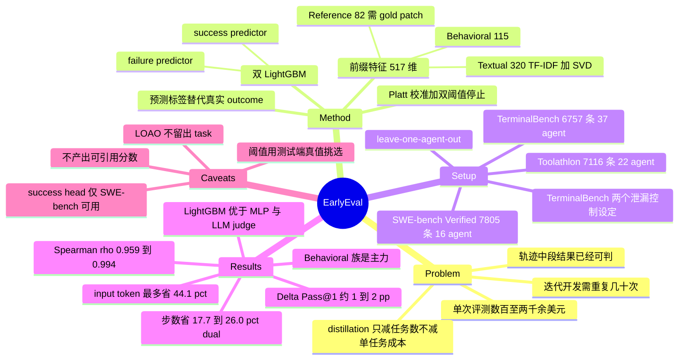

## Summary

EarlyEval 把 agent 评测降本的轴从"少跑几个任务"换成"每个任务少跑几步"：用其他 agent 的历史轨迹离线训练一对 LightGBM success/failure 分类器，逐步给当前前缀打分，任一侧的校准概率越过阈值就掐断 rollout 并把预测标签写成该任务得分。在 SWE-bench Verified / TerminalBench / Toolathlon 三个 benchmark 上，leave-one-agent-out 协议下砍掉 13%–26% 执行步数与最多 44.1% input token，per-agent resolve rate 偏差 1–2 个百分点，Spearman ρ 保持 0.959–0.994。代价是它明确不产出可引用的 benchmark 分数，且跨 benchmark 稳健工作的实际上只有 failure predictor 那一半。

## Problem & Motivation

出发点是一笔可以直接报价的账。作者引 OpenHands Index（2026 年 6 月检索）：用 OpenHands 跑一遍 SWE-bench Verified，Claude 5 / GPT-5.5 / Gemini 3.1 Pro 分别要 \$715 / \$760 / \$935；rollout 更长的 SWE-bench Multimodal 最贵一档到 \$2,270。而一次开发迭代要在调 prompt、换 scaffold、换底座模型之后反复重跑，还要给每个 baseline 各跑一遍——单次几百美元乘以几十次，频繁评测就成了多数团队负担不起的东西。

现有的降本工作几乎全部集中在 benchmark distillation 这一条轴上：Anchor Points 挑代表性样本、tinyBenchmarks 造小规模代理测试集、Efficient Benchmarking 研究粗到细的预算分配。这些方法减的是任务数，被保留下来的任务该跑多少步还是跑多少步，单任务执行成本一分没动。

论文的切入点是一个经验观察：对多数任务，agent 不需要跑完就能确定它的最终得分。作者用一条公开的 OpenHands 轨迹（tianocore/edk2-pytool-library-372）说明——全程 45 步，step 20 写出复现脚本，step 23 做出唯一一次源码修改（把路径分隔符规范化，一行），此后再没碰过源码，只是在各个方向上继续测试。一个能看到 gold patch 的观察者在 step 23 就可以下结论，停在那里能以约一半的成本得到完全相同的评测结果。作者进一步指出这类信号不必依赖 reference：一个反复对着不变的报错重试同一处修改的 agent，其实已经宣告了自己的失败。

## Method

**问题形式化。** agent 在任务上产生轨迹 τ = (e1, …, eT)，benchmark 在终止时给出二值分数 y。early-outcome predictor 在任意 k < T 步可以给出预测 y-hat 并终止运行；一旦触发，predictor 的输出就**替代**真实 outcome 记为该任务的分数。信心不足则放行继续。

**特征。** Table II 把前缀 τ:k 映射成定长向量，分三族：

- **Behavioral（115 维）**——activity counts 37（累计步数/动作/工具调用/文本长度，以及 file view、search、create/replace/insert/undo、test、Python、CLI、git、submit 各类计数）、last step 11、event timing 18（各类关键事件首次发生的步号、是否发生、距上次发生多少步）、working pattern 32（读写比、编辑测试比、停滞与重复动作、未测试就提交等）、error & test status 17（各类报错与测试结果是否出现、最新与最好失败数、失败数是否在下降）。
- **Textual（320 维）**——task prompt、完整动作历史 + 最近一次动作、全部环境反馈 + 最近一次反馈，共 5 个语义块各自独立做 word 1–2 gram TF-IDF（min_df=5，词表上限 30,000），再用 Truncated SVD 各压到 64 维。
- **Reference（82 维）**——gold descriptors 28（patch 字符数/行数/hunk 数、改动文件数、fail-to-pass 与 pass-to-pass 测试数、API/import/exception token 数、目录深度、仓库、难度、版本）与 prefix–gold overlap 54（agent 已触及的文件、API 符号、测试名与 gold solution 的 Jaccard 重叠与命中数）。

三族相加，reference 可用时 517 维，reference-free 时 435 维。TerminalBench 与 Toolathlon 不发布 per-task reference solution，因此这两个 benchmark 上 reference 族整体关闭。

**训练。** 每条轨迹展开成 T+1 个前缀，全部继承该轨迹的最终 label；短于 10 步的轨迹整条丢弃。为避免长轨迹主导 loss，每个前缀样本按 1/(T+1) 加权，使每条轨迹贡献相同质量。训练两个独立的 LightGBM ensemble：success predictor h+ 拟合 y=1，failure predictor h− 拟合 1−y=1。作者给出的理由是成功与失败由本质上不对称的行为触发，分开训还能显式造出一个"两边都低"的不确定区间供 agent 继续跑。超参全 benchmark 共用一套：lr 0.03、31 leaves、max depth 6、min child samples 200、行/列采样 0.75/0.70、L1 0.5 / L2 10.0、最多 2,000 轮 boosting，50 轮无提升则早停，seed 42。

**校准与停止规则。** 正则化的树集成输出概率尺度失真，因此用 Platt scaling（一维 logistic 回归 p = σ(a·logit(s) + b)）把原始分映射成校准概率；参数在每折保留的 15% 训练轨迹上按前缀权重拟合，每个 predictor 每折各一个校准器。因为变换单调，校准不改排序也不改 AUC，唯一作用是让两个 predictor 与各折之间的阈值含义一致。推理时 p+ ≥ s 或 p− ≥ f 的第一步即停止并记录预测标签；同一步两边同时越界则取时间上更早的那次。阈值事先固定，构成 early-stop 早晚与预测可靠性之间的调节旋钮。

选择 LightGBM 而非 LLM judge 的理由写得很直白：树集成在单核 CPU 上评估几百维向量远不到 1 毫秒，每步重打分的开销可忽略；而 LLM judge 每步一次 forward，推理成本会把 early stopping 省下的执行算力直接吃回去。

## Key Results

**RQ1 — 各 benchmark 推荐操作点（Table III，Dual 配置）。** 推荐操作点的选择规则是"使 Dual 的 Δ|Pass@1| 保持在约 2 个百分点以内的最低阈值"，即在守住 headline 指标的前提下最激进的一档。

| Benchmark（阈值） | ΔSteps | ΔToken_in | ΔToken_out | Δ\|Pass@1\| |
|:--|:--|:--|:--|:--|
| SWE-bench Verified (0.95) | -26.0% | -32.7% | -28.7% | 1.1 pp |
| TerminalBench, no same model (0.90) | -25.4% | -42.7% | -27.9% | 2.1 pp |
| TerminalBench, no same scaffold (0.85) | -17.7% | -29.2% | -17.4% | 2.0 pp |
| Toolathlon (0.90) | -23.0% | -44.1% | -29.4% | 0.9 pp |

token 侧的节省系统性地大于步数侧，作者归因于 early termination 砍掉的正是 context window 已经膨胀到最贵的尾部步骤。阈值可单调换算力：SWE-bench 从 0.95 降到 0.75，步数节省从 26.0% 拉到 63.4%，Δ|Pass@1| 从 1.1 涨到 4.1 pp。

**两个 predictor 完全不对称。** success predictor 只在 SWE-bench Verified 上可用（全阈值 precision 88.3%–93.9%）；在 TerminalBench no-same-scaffold 上掉到 61.4%–69.0%；在 Toolathlon 上 coverage 直接归零（0.90 及以上阈值 coverage 0.0%，precision 列为空）。failure predictor 则处处稳健：SWE-bench 96.7%、TerminalBench 89.4%–96.6%、Toolathlon 96.6%–99.4%。作者由此建议实践者按 benchmark 单独验证两个 head，挑更可信的那个用。

**加性观察。** 几乎每个操作点上 Dual 的步数节省等于 success-only 与 failure-only 之和（SWE-bench 0.95: −10.6% + −15.4% = −26.0%）。既然轨迹在第一次越界时就停，这个加性说明两个 predictor 几乎从不在同一条轨迹上触发——正向与负向证据很少在一条轨迹里同时出现。

**scaffold 比模型更难建模。** 抽掉留出 agent 的 scaffold 对 success predictor 的伤害大于抽掉它的底座模型：论文表述的 peak precision 从 82.7%（no same model）降到 69.0%（no same scaffold），推荐操作点上可达的步数节省从 25.4% 缩到 17.7%。解释是 scaffold 决定轨迹的结构性节奏（动作、环境反馈、里程碑如何排列），换 scaffold 直接扰动 behavioral 特征，换模型则留下相对稳定的结构骨架。

**RQ2 — 排序保真（Table IV）。** 注意这里的配置换了：只有 SWE-bench 用完整 dual 机制排序，TerminalBench 与 Toolathlon 只用 failure predictor，因此 Table IV 这两行的 ΔSteps 对应的是 Table III 的 failure-only 列。

| 设定 | agent 数 | Spearman ρ | 名次完全不变比例 | ΔSteps |
|:--|:--|:--|:--|:--|
| SWE-bench Verified (0.95) | 16 | 0.991 | 81% | -26.0% |
| TerminalBench, no same model (0.90) | 37 | 0.959 | 59% | -24.6% |
| TerminalBench, no same scaffold (0.85) | 37 | 0.994 | 70% | -12.7% |
| Toolathlon (0.90) | 22 | 0.994 | 70% | -23.0% |

**RQ3 — 特征消融（SWE-bench Verified）。** 全特征基线 coverage 34.8% / accuracy 95.0% / ΔSteps −26.0% / Δ|Pass@1| 1.1%。去掉 Behavioral 族伤得最重（coverage 23.4%，ΔSteps −16.4%）；去掉 Reference 族只轻微下滑（32.1% / −24.7%），这正是它能迁移到无 gold patch 的 benchmark 的原因；去掉 Textual 族反而略微上升（35.9% / −26.5%）。族内单组消融的影响都在 0.5 pp 以内（reference 子组最多 1.3），说明信号在族内是冗余编码的。

**RQ4 — backbone 消融（SWE-bench Verified，0.95）。**

| 变体 | Coverage | Accuracy | ΔSteps | Δ\|Pass@1\| |
|:--|:--|:--|:--|:--|
| LightGBM（本文） | 34.8% | 95.0% | -26.0% | 1.1 |
| Direct MLP | 26.9% | 87.9% | -20.0% | 3.3 |
| Linear, dense LR | 9.7% | 43.8% | -7.7% | 5.5 |
| Linear, TF-IDF LR | 2.4% | 79.5% | -2.0% | 0.3 |
| Qwen-0.5B LoRA judge | 18.7% | 90.7% | -17.9% | 0.8 |

TF-IDF LR 的低失真是"几乎从不出手"的平凡后果（只在 2.4% 轨迹上触发）；Qwen LoRA judge 是唯一在保真度上有竞争力的对手，但只省下一半的步数，且每步一次前向，其运行时开销正好抵消 early stopping 想省的算力。

## Evidence Ledger

| Claim ID | Claim | Type | Source locator | Evidence excerpt | Status |
|:--|:--|:--|:--|:--|:--|
| C1 | SWE-bench Verified 阈值 0.95 dual：-26.0% steps / -32.7% in / -28.7% out / 1.1 pp | number | Table III, SWE-bench 0.95 行 Dual 列 | "-26.0% ... -32.7% ... -28.7% ... 1.1%" | source-verified |
| C2 | Toolathlon 阈值 0.90 dual：-23.0% / -44.1% / -29.4% / 0.9 pp | number | Table III, Toolathlon 0.90 行 Dual 列 | "-23.0% ... -44.1% ... -29.4% ... 0.9%" | source-verified |
| C3 | TerminalBench no-same-model 0.90 dual -25.4%/2.1 pp；no-same-scaffold 推荐点 0.85，dual -17.7%/2.0 pp | number | Table III 对应行；Sec V-B 操作点列表 | "operating points selected in RQ1 (0.95 ... 0.90 ... 0.85 for the TerminalBench no-same-scaffold split)" | source-verified |
| C4 | 轨迹池 7,805 / 6,757 / 7,116 条，来自 16 / 37 / 22 个 agent，协议为 leave-one-agent-out | benchmark-setting | Sec IV-A 第 2-4 段；Sec IV-B | "paired with 16 base LLMs ... for 7,805 trajectories in total" | source-verified |
| C5 | TerminalBench 与 Toolathlon 不发布 per-task reference solution，故关闭 Reference 特征族 | benchmark-setting | Sec IV-A 末段 | "neither TerminalBench nor Toolathlon releases per-task reference solutions... disables the Reference-Solution features" | source-verified |
| C6 | Table III 只给 success-only / failure-only 的 precision，Dual 无 accuracy 列 | number | Table III 表头；Table V-VI 是仅有的 Accuracy 列，且限 SWE-bench | Dual 列为 "ΔSteps \| ΔTokenin \| ΔTokenout \| Δ\|Pass@1\|" | source-verified |
| C7 | ρ = 0.991 / 0.959 / 0.994 / 0.994，名次完全不变 81% / 59% / 70% / 70% | number | Table IV 汇总行；Sec V-B 第 2 段 | "ranging from 59% on the no-same-model split up to 81% on SWE-bench Verified" | source-verified |
| C8 | RQ2 排序在 TerminalBench 与 Toolathlon 上只用 failure predictor，非 dual | benchmark-setting | Sec V-B 第 1 段 | "rank agents using the full dual mechanism on SWE-bench, but rely solely on the failure predictor for TerminalBench and Toolathlon" | source-verified |
| C9 | 特征消融：全特征 34.8%/95.0%/-26.0%；w/o Behavioral 23.4%/-16.4%；w/o Reference 32.1%/-24.7%；w/o Textual 35.9%/-26.5% | number | Table V | 见表内对应行 | source-verified |
| C10 | backbone 消融五行数值（LightGBM / MLP / dense LR / TF-IDF LR / Qwen-0.5B LoRA） | number | Table VI；Sec V-D | "LightGBM 34.8/95.0/-26.0/1.1; Direct MLP 26.9/87.9/-20.0/3.3; ... Qwen LoRA 18.7/90.7/-17.9/0.8" | source-verified |
| C11 | dual 步数节省 = success-only + failure-only，据此推断两 predictor 几乎不在同一轨迹触发 | causal-mechanism | Sec V-A "Moreover, at nearly every operating point..." | "this additivity implies that the two predictors almost never fire on the same trajectory" | source-verified |
| C12 | success predictor 仅在 SWE-bench 可靠（88.3–93.9%），TB no-same-scaffold 61.4–69.0%，Toolathlon coverage 归零 | number | Sec V-A | "precision consistently ranges between 88.3% and 93.9%... coverage collapses toward zero on Toolathlon" | source-verified |
| C13 | 训练数据构造时丢弃长度 <10 步的轨迹 | benchmark-setting | Sec III-C | "Trajectories shorter than 10 steps are discarded, as they rarely contain sufficient signal" | source-verified |
| C14 | OpenHands Index 成本：SWE-bench Verified \$715/\$760/\$935；SWE-bench Multimodal 最贵 \$2,270 | number | Table I；Sec II-A | "exceeding \$2,200 for the most costly model" | source-verified |
| C15 | 代码与实验数据在 github.com/inphotoo/earlyeval；arXiv HTML 页 License CC BY 4.0 | license-code | Data Availability Statement；arXiv HTML 页头；独立 curl 检查 | "accessible on https://github.com/inphotoo/earlyeval"；curl 返回 HTTP 200 | source-verified |
| C16 | early outcome prediction 被定位为与 benchmark distillation 互补而非替代的新效率维度 | sota-novelty | Abstract；Sec I 贡献第 1 条 | "this approach complements, rather than replaces, existing benchmark distillation methods" | source-verified |
| C17 | 推荐操作点 = 使 dual Δ\|Pass@1\| 在约 2 pp 内的最低阈值 | benchmark-setting | Sec V-A 第 2 段 | "the lowest threshold where the dual-mechanism absolute deviation... remains within approximately 2 percentage points" | source-verified |
| C18 | 阈值扫 {0.75…0.97}；LightGBM 超参、seed 42、每折 15% 训练轨迹作 validation | number | Sec V-A；Sec IV-D | "learning rate 0.03, 31 leaves, maximum depth 6, minimum child samples 200... seed 42... 15%" | source-verified |
| C19 | 抽 scaffold 比抽 base model 更伤 success predictor，peak precision 82.7% → 69.0%，归因于 scaffold 决定轨迹结构节奏 | causal-mechanism | Sec V-A 倒数第 2 段 | "peak precision to drop from 82.7% (no same model) to 69.0% (no same scaffold)... a scaffold dictates the structural rhythm" | source-verified |
| C20 | abstract 的 "13%-26% steps" 下界 13% 来自 RQ2/failure-only 的 -12.7%，不对应任何推荐操作点的 dual 值；Introduction 另给 13%-25% | number | Abstract；Sec I；Table IV no-same-scaffold 行 | "EarlyEval saves 13% to 25% of execution steps at 89% to 97% accuracy"（Sec I）vs abstract "13%–26%" | source-verified |
| C21 | Sec III-D 的 task 级划分只用于 calibration/early-stopping，LOAO 只留出 agent 不留出 task；留出 agent 面对的任务与训练时相同 | benchmark-setting | Sec III-D；Sec IV-B；Sec IV-A | "Each unique agent configuration attempts the full task pool"；"holding out one test agent at a time" | source-verified |
| C22 | 作者六人及四家机构；arXiv:2609.02783v1 [cs.CL] 02 Sep 2026 | number | 标题块与 arXiv 页头 | "1Shanghai Jiao Tong University... 2Singapore Management University... 3East China Normal University... 4Shanghai Innovation Institute" | source-verified |

## Strengths & Weaknesses

**问题选得对，切口也真的正交。** 把"评测降本"从任务数轴上拆出一条任务内轴，是一个此前空着的位置。论文没有把它包装成替代方案，而是老实说与 distillation 互补——两条轴可以叠乘，这个定位比强行争 SOTA 更有说服力。

**"简单方法赢"这次是被证出来的，不是被断言的。** RQ4 的对照做得很干净：Qwen-0.5B LoRA judge 在保真度上确实能打（90.7% accuracy、0.8 pp 失真），但只省 17.9% 步数，且每步一次前向的开销直接冲抵 early stopping 的收益；LightGBM 亚毫秒推理拿到 34.8% coverage 与 26.0% 步数节省。在一个默认"上 LLM judge"的时代，这是把"手工特征 + 树模型足够"落到实处的证据，而不是设计偏好。

**评测协议对得起 claim，也肯自曝短板。** leave-one-agent-out 之上，TerminalBench 还额外拆 no-same-model / no-same-scaffold 两个泄漏控制设定，并诚实报告后者更难。Discussion 明确划界：因为 early stopping 引入约 1–2 pp 的系统性偏差，最终 leaderboard 条目与 headline claim 仍应跑完全程；EarlyEval 只服务于"同一个 benchmark 上反复评测演进中的 agent"这个迭代开发场景。

**但"dual"在很大程度上是包装，真正跨 benchmark 干活的只有 failure predictor 一半。** success predictor 出了 SWE-bench 就崩：TerminalBench no-same-scaffold 上 precision 61.4%–69.0%，Toolathlon 上 coverage 直接 0.0%。RQ2 的排序实验因此在两个 benchmark 上退回纯 failure-only。这意味着框架实际交付的能力是"提前判定这次会失败"，而这恰恰是最容易被任务难度先验解释掉的那一半——加性观察（两个 head 几乎从不在同一轨迹触发）也侧面说明这不是一个统一机制，而是两个各自为战、其中一个基本不出手的分类器。

**阈值是用测试端的 ground truth 选出来的。** 推荐操作点定义为"使 Δ|Pass@1| 保持在 2 pp 内的最低阈值"（C17），而 Δ|Pass@1| 只有在跑完全程、拿到真实 resolve rate 之后才算得出来。部署时面对一个从未见过的 agent，你恰恰没有这个量。论文没有给出"在训练/验证轨迹上选定阈值，再在留出 agent 上兑现"的前瞻性实验。因此 1–2 pp 这个卖点带有事后选择的成分——这是我的判断，论文未讨论此问题。

**task 级泄漏没有被隔离，而这一点已由原文证实（C21）。** Sec III-D 那句"按 task 划分"只管 calibration 与早停，LOAO 协议留出的是 agent 不是 task；每个 agent 都跑完整任务池，所以留出 agent 面对的 500 / 89 / 108 个任务在训练时已被其他 agent 跑过并带标签进了训练集。特征里还有 gold descriptors 的 repository / difficulty / version 与 task prompt 的 TF-IDF。原则上模型可以学到"这个任务谁都做不出来"而非"这个 agent 正在往坑里走"。Table V 提供了一定反证——去掉整个 Textual 族（含 task prompt）coverage 反而升到 35.9%，去掉 Reference 族也只降到 32.1%，主力确实是 Behavioral——但这削弱而未排除该担忧：Behavioral 族里的错误类型、测试结果、失败计数趋势同样与任务难度强相关。缺一个 held-out-task 对照，这个问题就悬着。

**fidelity 指标的口径偏宽松。** Spearman ρ 与"名次完全不变比例"衡量整张榜的秩相关，而迭代开发真正要回答的是"我这次改动有没有变好"这种相邻小差距的成对判断。TerminalBench no-same-model 下 37 个 agent 只有 59% 保住确切名次，Table IV 列出的前三名里就有两个位移 1–2 名。ρ = 0.959 与"能正确判断两个相邻 agent 谁更好"不是一回事，而论文声称的适用场景恰恰是后者。

**报告口径上还有两处需要留意。** 其一，abstract 的"13%–26% 步数节省"是拼出来的区间：下界 12.7% 来自 RQ2 的 failure-only 配置，上界 26.0% 来自 SWE-bench 的 dual 配置，四个推荐操作点的 dual 值实际是 17.7%–26.0%（C20）；Introduction 给的又是另一个区间 13%–25%。其二，"89%–97% prediction accuracy"在 Table III 里找不到对应的 dual accuracy 列（C6），它更像是 failure predictor 在各操作点上 precision 的取值范围（89.4%–96.7%），以"prediction accuracy"之名呈现。数字本身都对得上原文，但读者容易把单 head 的 precision 读成整个系统的准确率。

**适用边界。** 三个 benchmark 全是 code / shell / tool-use，观察是文本，特征工程（edit / test / traceback / git / fail-to-pass 计数）高度贴合 SWE 类轨迹。搬到观察是截图、没有 test suite 可解析的 GUI 或具身场景，Behavioral 族里 error & test status 这一整组（17 维）与 event timing 的多数信号直接不存在。论文没有声称覆盖这些场景，但这就是它当前的边界。另外 <10 步的轨迹在训练时被丢弃（C13），论文未说明 ΔSteps / ΔToken 的分母是否也排除了它们；短轨迹恰恰是最便宜的那批，若被排除在外，报告的相对节省会偏乐观。

## Mind Map

## Connections

- [[Papers/2607-AgentBenchmarkBudget]] —— 同一目标的另一条轴，也是最值得放在一起读的对照。AgentBenchmarkBudget 走"少跑几个 task"，EarlyEval 走"每个 task 少跑几步"，两者原则上可以叠乘。真正的张力在 fidelity 口径上：AgentBenchmarkBudget 用 pairwise decision error + coverage failure + unresolved rate 三重目标，结论是 SWE-bench Verified 要到 90% task budget 才能复现完整 benchmark 的成对结论（25% budget 时 93.64% 的比较仍处于 unresolved）；EarlyEval 用 Spearman ρ 与名次不变比例，报告 ρ=0.991、81% 名次不变。同一个 benchmark 上一个说"几乎省不了"、另一个说"能省四分之一"，差别多半不在方法而在"什么叫保住了结论"。把 EarlyEval 放进前者的 decision-preservation 框架里重测（早停后还剩多少 pairwise 比较可判、error 是否超 5%），是一个现成且必要的检验。

- [[Papers/2510-HAL]] —— HAL 花约 \$40,000 跑 21,730 次 rollout 建 cost-controlled leaderboard，正是 EarlyEval 想砍掉的那笔账；EarlyEval 的轨迹池规模（21,678 条）几乎与之等量，说明这类历史轨迹的可得性假设在今天成立。互补之处是 HAL 明确批评"用 token 数当 cost proxy 具高度误导性"，而 EarlyEval 同时报 ΔSteps、ΔToken_in、ΔToken_out 三个口径并观察到 token 节省系统性大于步数节省——这恰好是对 HAL 那条批评的一个正面回应：步数与账单不成正比，因为 context window 在累积。但 HAL 的另一条结论（scaffold 对 accuracy 与 cost 都有决定性影响）对 EarlyEval 是负面信号，与其 no-same-scaffold 设定下 success predictor 掉到 69.0% 相互印证。

- [[Papers/2607-ProtocolValidity]] —— 提供了审视 EarlyEval 的另一个角度。ProtocolValidity 主张只有当 intended capability 对成功仍是必要条件时，分数才支撑 capability claim，并用 Expose → Exploit → Mislead 证据链做事后审计。EarlyEval 做的是一件在这个框架里需要单独辩护的事：它用一个分类器的预测标签**替代**真实执行结果写进得分。这不是 agent 在钻协议的空子，而是评测方主动把协议的最后一环换成了代理量，因而引入一类新的失效模式——若 failure predictor 学到的是任务难度先验而非 agent 行为，那么"分数下降"可能只反映该 agent 碰上了历史上大家都失败的任务。论文自己划的边界（不用于产出可引用分数）正是在回避这个问题，但没有从 validity 角度正面论证。

- [[Topics/StepCreditAssignment-Survey]] —— 机制上同源，目的完全不同。survey 里 Monte-Carlo prefix rollout 那一族（Math-Shepherd 起）做的就是"从前缀估计最终 outcome"，EarlyEval 的 success predictor 本质上是同一个量的离线判别式版本：不做 rollout，改用其他 agent 的历史轨迹训一个手工特征 + LightGBM 的 prefix value 估计器。这给 survey 补了一个此前没有的信号来源维度（跨 agent 历史轨迹的监督学习），成本比 prefix rollout 低几个数量级。同时 EarlyEval 的结果也给 survey 的一条判断提供了域外证据：它的 Behavioral 消融显示"错误类型、测试结果、失败计数趋势"这组信号是主力，而 survey 指出 GUI/Web 场景恰恰缺少可自动校验的终局信号——EarlyEval 之所以成立，很大程度依赖 SWE/shell 轨迹里天然带着可解析的 test 与 traceback，这正是把它平移到 GUI 的第一道障碍。

- [[Topics/AgentHarness-Design]] —— 直接落在该 survey 的"上下文预算"轴上。survey 的核心论断是三条设计轴共用同一份 per-step 预算，任一轴上报告的收益只有在预算口径对齐时才可解释。EarlyEval 提供了一个新的量化点：截断轨迹尾部时 input token 的节省系统性地超过步数的节省（SWE-bench 32.7% vs 26.0%，Toolathlon 44.1% vs 23.0%），也就是说轨迹后半段的每一步都比前半段贵得多。这为 survey 里"按步计费会低估长轨迹成本"提供了跨三个 benchmark 的直接证据，也提示任何用"平均每步 token"折算总成本的 harness 对比都会低估长尾。

## Notes

- **最该被追问的一个实验，论文没做**：用训练/验证轨迹前瞻性地选定阈值，再在留出 agent 上兑现，看 Δ|Pass@1| 是否仍在 2 pp 内。现有的操作点选择用到了测试端真值，这让所有 fidelity 数字都带上了事后成分。这是一个成本极低的补充实验（数据都在手上），却是判断该方法能否真正部署的关键。

- **第二个缺口是 held-out-task 对照**（见 C21）。若把留出 agent 的任务也一并从训练集里移除，failure predictor 还剩多少 coverage？两者之差就是任务难度先验的贡献量。这个数字目前完全未知，而它决定了 EarlyEval 究竟在读 agent 的行为还是在读任务的难度。

- 原文有一处措辞需要留意：Sec V-A 说 success precision 的 peak 从 82.7%（no same model）掉到 69.0%（no same scaffold），但 Table III 全阈值扫描下这两列的真实最大值是 83.8%（0.95，coverage 仅 0.2%）与 77.0%（0.90）。"peak" 实指参考阈值处的值而非全扫描最大值。这不影响结论方向（coverage 0.2% 时的 precision 本无意义），但引用该数字时应带上阈值。

- 一个可以顺手做的延伸：把 EarlyEval 的 failure predictor 换个用途——不用来省评测钱，而是当作训练期的 rollout 早停器。[[Papers/2605-RolloutPassRateControl]] 已经在论证 agentic RL 里大量算力浪费在必然全 0 的 rollout group 上；一个亚毫秒推理、96%+ precision 的失败判别器天然适合掐掉这些 rollout。区别在于评测场景可以接受 1–2 pp 的系统性偏差，训练场景对早停引入的分布偏移是否同样宽容，需要单独验证。
