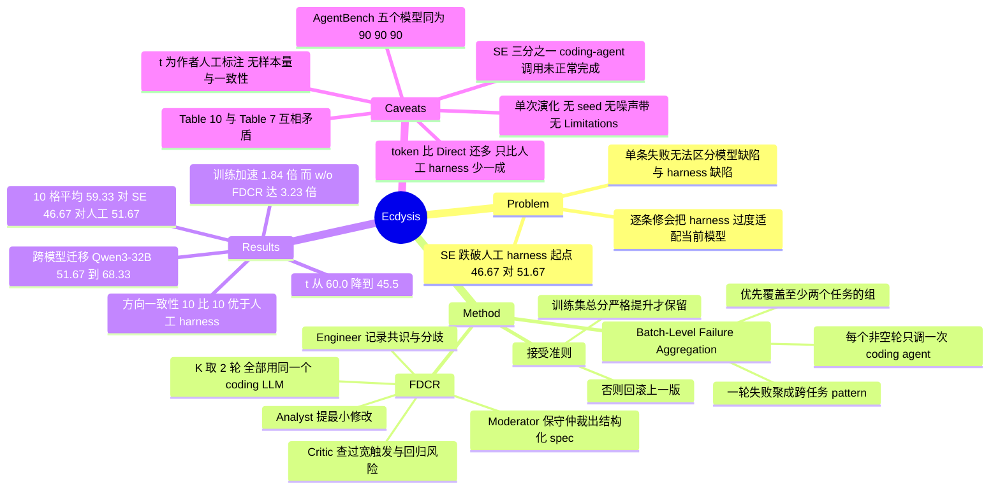

## Summary

Ecdysis 把 harness 自演化的更新粒度从「每条失败改一次」换成「每轮改一次」：一轮里所有失败轨迹先聚成跨任务的 failure pattern，再由 Analyst / Critic / Engineer 三角色两轮辩论加一个 Moderator 产出一份结构化修改 spec，最后只调一次 coding agent 落地，训练集总分严格提升才保留。动机是 failure attribution——单条失败分不清是模型自身的毛病还是 harness 的系统缺陷，逐条修会把 harness 过度适配到当前模型上。5 个 LLM × 2 个 τ²-Bench 子集上平均准确率 59.33% 对 Self-Evolution 46.67%、人工 harness 51.67%，训练最多快 1.84×；但最有信息量的是基线本身：Self-Evolution 在 10 个格子里有 7 个跌破它自己的起点 Human-Aug harness（C2）。

## Problem & Motivation

harness 自演化的标准做法是 iterative search：跑任务、看失败、让 coding agent 改 harness 代码、重新评估。作者指出这条路上有一个没被处理的前提问题——**一次失败到底是谁的错**。观察到的失败既可能来自当前模型的行为特点（model-specific deficiency），也可能来自 harness 的系统缺陷（systematic harness deficiency）。前者应当忽略，后者才值得改；而单条失败本身提供不了区分二者的证据，收集更多单条失败也不会让歧义消失。

不区分的后果被写成一个概念性分解：把一轮内 coding agent 发出的所有独立修改决策聚合起来，记 `ΔH = t·ΔH_model + (1−t)·ΔH_harness`，其中 `t` 是「适配模型」那一类决策的占比。`t` 大意味着快速消掉了观察到的失败，但代价是 harness 被绑死在当前模型和当前训练任务上。论文给的具体失效形态很具体：演化 agent 为了绕开某个模型错误，直接删掉一个合法动作选项，把本该由模型按情境决定的分支变成 harness 级的全局禁令——评测那一格确实好了，但 harness 的合法动作空间被永久缩小。

作者的假设是：**跨任务反复出现的失败模式，比孤立失败更像系统缺陷的证据**。论文明确写明这是 inductive bias 而非因果归因的证明（C10）——这句自我限定值得记住，因为 abstract 与 conclusion 之后并没有一直守住它。

论文自己的 preliminary 数据把动机做实了：6 个 Qwen3 模型–领域组合上，拆掉全部 harness 层平均 29.72%，固定的人工 harness 50.28%，而「逐条失败串行改」只有 43.33%（C16）。也就是说在这个设置下，naive self-evolution 是**净负收益**。

## Method

### 训练循环

给定冻结的 task model θ、固定运行环境 ℰ、训练任务集、初始 harness `H_base`，每一轮走三步（Algorithm 1）：

1. **Collect**：用当前 harness 跑全部训练任务，拿到轨迹集；固定评测框架给每条轨迹打分 S(τ)，`f_λ(τ) = 1[S(τ) < λ]` 定义二值失败信号。失败轨迹转成结构化记录，保留 task id、failure decision、termination reason、tool-call history 与必要执行上下文。
2. **Refine**：失败记录聚成 failure groups，产出结构化修改 spec，交给 coding agent 生成候选 harness。
3. **Validate**：候选只在训练集总分**严格提升**时被接受（`J_train(H_i^c) > J_train(H_{i-1})`），否则回滚到上一版。该准则只约束总分，不要求逐任务都变好。

R 轮后冻结最后一版。

### Batch-Level Failure Aggregation

关键的粒度改动在这里。失败记录按 pattern 分组，**优先覆盖至少两个不同任务的组**——同一任务反复失败不能说明机制可泛化；只含单个 task id 的组保留为辅助证据。failure group 被定位成 diagnostic evidence 而非必修项：它用来判断这是不是 harness 缺陷，以及决定修改层级、触发条件、作用范围与安全约束，候选 harness 不必覆盖每一个观察到的 group。

成本侧的直接后果：设第 i 轮有 `n_i` 条失败记录，逐条处理需要 `n_i` 次 coding-agent 调用，Ecdysis 每个非空轮只调一次，于是 `N_round = Σ 1(n_i > 0) ≤ Σ n_i = N_serial`，只要有一轮含多条失败该不等式就严格。

### Failure-Driven Collaborative Refinement

FDCR 把「失败诊断与修改规划」和「实际改代码」拆开。三个角色共享一份 transcript 顺序执行、各自读到累积上下文：

| 角色 | 职责 |
|:--|:--|
| Analyst | 指出潜在 harness 缺陷，提最小化、有针对性的修改 |
| Critic | 拿观察到的失败证据核对提案，专查触发条件过宽、误挡合法行为、违反 runtime contract、以及对已成功任务的回归 |
| Engineer | 记录已达成共识与未解分歧，标出下一轮需澄清的问题 |
| Moderator | 读完整 transcript 与失败证据，做保守仲裁，输出结构化修改 spec |

Moderator 只出 spec，不直接改 harness；coding agent 拿 spec + 执行证据 + 当前 harness 源码去实现。实验里 K = 2 轮，四个角色与 coding agent（OpenCode）全部用 DeepSeek-V4-Pro（C19）。论文**没有**对 K 或角色组合做任何 ablation。

### 对照配置

底座 harness 是 Life-Harness。五个配置：Direct（拆掉 harness 层，只留 τ²-Bench 必需的 agent loop / message handling / tool interface）、Human-Aug.（人工优化的固定 harness，不演化）、Self-Evolution（逐条失败各调一次 coding agent，修改串行累积成一个轮级候选再统一评估）、Ecdysis w/o FDCR、Ecdysis w/ FDCR。**三个演化方法都从同一份 Human-Aug harness 起步**，共享同一套训练评测、接受、回滚与早停协议，最多 3 轮候选生成（C11、C12）。

## Key Results

**设置**：每个子集各取训练 20 题 / 测试 20 题，每道测试题 3 次独立 trial（每次 reset 环境），即每个（模型, 子集, 方法）60 条 held-out 轨迹；温度 0.0；全部 LLM 走 API（C11）。演化**只用 Qwen3-8B 做 task model**，得到的 harness 直接搬给另外四个模型，不再演化（C13）。

**主表（5 个 LLM × 2 个 τ² 子集，10 格平均）**：

| Method | Accuracy AVG (%) | Pass@3 | Pass^3 | Tokens (M) | Time (s) |
|:--|--:|--:|--:|--:|--:|
| Direct | 38.17 | 53.50 | 22.50 | 8.701 | 87.91 |
| Human-Aug. | 51.67 | 66.00 | 37.00 | 11.349 | 118.53 |
| Self-Evolution | 46.67 | 63.50 | 29.00 | 11.567 | 126.08 |
| Ecdysis (w/o FDCR) | 54.67 | 66.50 | 42.00 | 10.354 | 131.42 |
| **Ecdysis (w/ FDCR)** | **59.33** | **71.50** | **45.00** | 10.157 | 118.69 |

逐格重算全部复现（C1）。三条读法需要分开：τ² 两子集上 Ecdysis 对 SE 的相对增益是 27.1%，对 Human-Aug 是 14.8%；abstract 的 **18.56% 是把 AgentBench 并进来后的三数据集相对增益**（SE 58.67 → 69.56），不是百分点（C3）。逐格方向性比平均值更硬：Ecdysis w/FDCR 在 **10/10** 个 τ² 格上高于 Human-Aug，9/10 高于 w/o FDCR。

**训练效率与成本**（C5、C6、C7）：

| 指标 | SE | Ecdysis w/o FDCR | Ecdysis w/ FDCR |
|:--|--:|--:|--:|
| τ²-Retail 训练时间 | 1,831.4 s | 1,292.4 s（1.42×） | 1,405.9 s（1.30×） |
| τ²-Airline 训练时间 | 8,120.6 s | 2,510.8 s（3.23×） | 4,403.0 s（1.84×） |
| AgentBench 训练时间 | 1,955.3 s | 1,136.6 s（1.72×） | 1,890.5 s（1.03×） |
| τ²-Retail API 成本 | \$8.484 | \$2.485 | \$5.763 |
| τ²-Airline API 成本 | \$6.382 | \$2.136 | \$2.609 |
| AgentBench API 成本 | \$2.030 | \$1.511 | \$1.833 |

abstract 的「up to 1.84×」是 w/FDCR 在 τ²-Airline 的最好情况；同一配置在 AgentBench 只有 1.03×，等于没加速。论文自己的最大加速 3.23× 属于 w/o FDCR。

**跨模型迁移**：Qwen3-8B 演化出的 harness 放到未参与演化的 Qwen3-32B / τ²-Airline 上，51.67%（SE）→ 68.33%（Ecdysis），比同格 Human-Aug 的 56.67% 高 11.66pp（C18）。

**推理侧**：held-out token 10 格平均 SE 11.57M → w/o FDCR 10.35M → w/FDCR 10.16M（相对降 10.48% / 12.19%）。但 Direct 只用 8.701M、Human-Aug 11.349M，所以「降低推理开销」只相对 SE 与 Human-Aug 成立，对 Direct 是多用 16.7%（C8）。

**model-accommodation ratio**：作者对训练过程做人工细粒度标注，得 SE `t = 60.0%`、Ecdysis `t = 45.5%`，降 14.5 个百分点（C9）。论文据此提出目标是把 `t` 衰减为 `t' = βt`。

**数据 curation**（Table 13，仅 Qwen3-32B / τ²-Retail 一格）：只用 5 条训练失败（原训练集的四分之一）得 71.67%，Full 75.00%，随机选 5 条 65.00%；训练成本 \$0.291 对 \$5.763。但 Reduced 的 Pass^3 是 45.00 对 Full 的 60.00，且随机基线恰好与 SE 打平在 65.00（C15、C25）。

## Evidence Ledger

| Claim ID | Claim | Type | Source locator | Evidence excerpt | Status |
|:--|:--|:--|:--|:--|:--|
| C1 | 主表 10 格平均：Direct 38.17 / Human-Aug 51.67 / SE 46.67 / w/o FDCR 54.67 / w/FDCR 59.33 | number | Table 1 (§5.1) 对照 Table 2 (§6.1) | "Ecdysis (w/ FDCR) 59.33 ± 25.03 71.50 45.00" | source-verified（逐格独立重算全部复现：38.167 / 51.666 / 46.666 / 54.667 / 59.333；Pass@3、Pass^3 同样复现） |
| C2 | Self-Evolution（46.67）低于它自己的起点 Human-Aug（51.67），且 10 格中 7 格绝对下降 | comparison | Table 1 + Table 2 + §4.1 | "all three evolution-based methods … are initialized from the same Human-Aug. harness" | source-verified（Pass@3 63.50<66.00、Pass^3 29.00<37.00 同向；论文全文未讨论此回归） |
| C3 | abstract 的 18.56% 是**相对**增益且覆盖 3 个数据集（SE 58.67 → 69.56），τ² 单独算是 27.1% | number | Abstract + §6.1 + Tables 2, 7 | "the average accuracy increases from 58.67% under SE to 69.56% … a relative gain of 18.56%" | source-verified（15 格重算 58.666 / 69.555，相对 18.5616%；绝对差 10.89pp） |
| C4 | AgentBench 上 Ecdysis w/FDCR 对全部五个模型给出完全相同的 90.00 / 90.00 / 90.00 | number | Table 7 | "Llama-3.1-8B Direct 5.00 5.00 5.00 … Ecdysis (w/ FDCR) 90.00 90.00 90.00" | source-verified（AVG = Pass@3 = Pass^3 意味每个模型三次 trial 结果完全确定且任务集合一致；Llama-3.1-8B 从 5.00 跳到 90.00；论文零评论） |
| C5 | "up to 1.84× speedup" 仅对应 w/FDCR 在 τ²-Airline；同配置 Retail 1.30×、AgentBench 1.03× | number | Abstract + Table 6 + Table 12 | "τ²-Airline 8,120.6 2,510.8 4,403.0 3.23× / 1.84×" | source-verified（重算 1.8443 / 1.3027 / 1.0343） |
| C6 | w/o FDCR 在三个数据集上加速均大于 w/FDCR：3.23 / 1.42 / 1.72 对 1.84 / 1.30 / 1.03 | number | Table 6 + Table 12 | "τ²-Retail 1,831.4 1,292.4 1,405.9 1.42× / 1.30×" | source-verified（论文最大加速 3.23× 属于不含 FDCR 的配置） |
| C7 | 训练 API 成本：τ²-Retail SE \$8.484 / w/o \$2.485 / w/ \$5.763；τ²-Airline \$6.382 / \$2.136 / \$2.609 | number | Table 4（AgentBench 见 Table 11） | "τ²-Retail Self-Evolution \$0.609 \$7.875 \$8.484" | source-verified（六组 Training Evaluation + Evolution 分列求和精确到分；70.71 / 66.53 / 32.07 / 59.12% 的降幅均复现） |
| C8 | held-out token 10 格平均 SE 11.57M / w/o 10.35M / w/ 10.16M；但 Direct 仅 8.701M、Human-Aug 11.349M | number | Table 3 + §6.2 + Table 1 | "final evaluation tokens are 11.57M for SE, 10.35M for Ecdysis (w/o FDCR), and 10.16M for Ecdysis (w/ FDCR)" | source-verified（重算 8.7013 / 11.3492 / 11.5665 / 10.3542 / 10.1570；w/FDCR 比 Direct 多 16.7%，只比 Human-Aug 少 10.5%） |
| C9 | model-accommodation ratio t = 60.0%（SE）对 45.5%（Ecdysis），来自作者自己的人工标注 | causal-mechanism | §8.3 + §1 第四条贡献 | "we observe t=60.0% for Self-Evolution (SE), compared with t=45.5% for Ecdysis" | source-verified（数值与"fine-grained manual analysis"出处确认；**全文无样本量、无标注协议、无 codebook、无标注者间一致性**，45.5% 与 5/11 这类小分母相容，按现有报告不可证伪） |
| C10 | 论文自述跨任务复现性只是 inductive bias，不是因果归因的证明 | causal-mechanism | §3.1 | "Cross-task recurrence is used as an inductive bias rather than as proof of causal attribution." | source-verified（原文一句，仅出现一次，后文未再守住） |
| C11 | 每子集训练 20 题 / 测试 20 题，每题 3 trial = 60 条 held-out 轨迹；最多 3 轮候选生成；温度 0.0 | benchmark-setting | §4.1 | "we select 20 tasks from the training split and 20 tasks from the test split … contains 60 held-out trajectories" | source-verified（AgentBench 的任务数量论文从未给出，Table 7 的 5.00 粒度只能推测为 20 题） |
| C12 | 三个演化方法均从同一份 Human-Aug harness 初始化，底座为 Life-Harness | benchmark-setting | §4.1 | "we adopt Life-Harness, a mature and well-structured harness framework [27]" | source-verified（Life-Harness 与 SE baseline 同出自 ref [27], arXiv 2605.22166） |
| C13 | 所有 harness 只用 Qwen3-8B 演化，之后直接复用到另外四个模型且不再演化 | benchmark-setting | §4.1 + Table 13 caption | "directly reusing the harnesses evolved with Qwen3-8B … without further evolution" | source-verified |
| C14 | SE 的 coding-agent 调用在 τ²-Retail 约 67%、τ²-Airline 约 97% 正常完成，Ecdysis 两域均 100% | benchmark-setting | §7.1 | "approximately 67% of the coding-agent calls from SE completed normally, compared with approximately 97% in τ²-Airline" | source-verified（未给调用总数、未定义"completed normally"、无失败分类；SE 的时间/成本/准确率三项均在含约三分之一失败调用的 run 上测得，论文未重跑） |
| C15 | 数据 curation：Reduced（5 条失败）71.67 对 Full 75.00 对 Random 65.00，成本 \$0.291 对 \$5.763；仅 Qwen3-32B / τ²-Retail 一格 | number | Table 13 + §8.2 | "Ecdysis (Reduced) 71.67±7.64 90.00 45.00 \$0.291" | source-verified（Reduced 的 Pass^3 45.00 低于 Full 的 60.00，相对降 25%，正文"comparable to full-data training"未提；Reduced 的 Pass@3 90.00 反高于 Full 85.00） |
| C16 | preliminary：6 个 Qwen3 组合上 Direct 29.72 / Human-Aug 50.28 / 逐条串行 43.33 | number | §3.1 | "removing all harness layers yields an average accuracy of 29.72%, whereas a fixed, human-configured harness achieves 50.28%" | source-verified（由 Table 2 六个 Qwen3 格重算 29.7233 / 50.2767 / 43.3333） |
| C17 | 代码在 https://github.com/cuiyu-ai/Ecdysis；论文未声明任何 license | license-code | 作者脚注块 + Links 列表 | "https://github.com/cuiyu-ai/Ecdysis" | source-verified（全文 grep "licen[sc]e" 零命中；亦无"code is available"/"we release"句，URL 只以拼接形式出现在 affiliation 脚注中。仓库经独立访问确认存在，含 scripts/ 与 src/ecdysis/，README 未列 license） |
| C18 | 跨模型迁移：τ²-Airline 上 Qwen3-32B 从 SE 51.67 提到 Ecdysis 68.33，该模型未参与演化 | number | §6.1 + Table 2 | "Qwen3-32B improves from 51.67% under SE to 68.33% with Ecdysis" | source-verified（同格 Human-Aug 为 56.67，故相对人工起点是 +11.66pp；SE 在该格反而低于 Human-Aug） |
| C19 | FDCR = Analyst / Critic / Engineer + Moderator，K = 2 轮，全部角色与 coding agent（OpenCode）用 DeepSeek-V4-Pro | benchmark-setting | §3.4 + Algorithm 1 + §4.1 | "the Analyst, Critic, Engineer, and Moderator also use DeepSeek-V4-Pro" | source-verified（未对 K 或角色组合做任何 ablation） |
| C20 | w/FDCR 并非一致优于 w/o FDCR：MiniMax/Retail 96.67 对 100.00，Qwen3-8B/Airline Pass^3 40.00 对 45.00 | comparison | Table 2 + Table 7 | "Ecdysis (w/o FDCR) 100.00 ± 0.00 100.00 100.00 Ecdysis (w/ FDCR) 96.67 ± 2.89 100.00 90.00" | source-verified（另有 Qwen3-14B/Retail Pass^3 30<35、MiniMax/Airline Pass^3 70<80；Table 7 中 w/o FDCR 在演化所用的 Qwen3-8B/AgentBench 上 85.00 反低于 SE 90.00） |
| C21 | 全文无 evolution seed、无重复演化 run、无演化过程的方差，也无 Limitations 节 | benchmark-setting | §4.1 + §6.2 + 全文 | "we report the full means and standard deviations in Table 3 rather than only the aggregate" | source-verified（grep "seed"/"runs"/"repeated" 无相关命中；每个（method, dataset）均描述为单次演化） |
| C22 | Tables 1 / 2 / 13 中 ± 的含义是 3 次 held-out trial 的离散度 | benchmark-setting | Tables 1, 2, 13 | 论文仅对 Table 3 称其为 "standard deviations"，Tables 1/2/13 从未定义 | **unsupported**（唯一被明说的重复是 3 次 trial，但"± 即 trial 离散度"是推断而非原文陈述；本笔记不据此对方差做任何论断） |
| C23 | Table 10 与 Table 7 在同一 (Qwen3-8B, AgentBench, harness) 上互相矛盾 | number | Table 10 对照 Table 7 | Table 10: "Ecdysis (w/o FDCR) 91.67 100.00 85.00"；Table 7: "Ecdysis (w/o FDCR) 85.00 85.00 85.00" | source-verified（Table 10 的 caption 未说明用哪个 split，两表按字面不可调和） |
| C24 | "Final Evaluation Tokens" 在 §3.5 与 §6.2 有两种定义，且 Table 10 与 Table 8 的量级差约 3× | number | §3.5 对照 §6.2；Table 10 对照 Table 8 | §3.5 "tokens consumed by the task model"；§6.2 "consumed by the task model and user simulator" | source-verified（AgentBench + Qwen3-8B：Table 10 报 4,106,142/3,851,561/4,532,939，Table 8 报 1.418/1.413/1.413 M） |
| C25 | Table 13 的随机基线与 SE 精确打平在 65.00，且 Pass@3 80.00 反超 SE 的 75.00 | comparison | Table 13 | "Ecdysis (Random) 65.00±8.66 80.00 45.00 \$0.505" | source-verified（正文只说 random 劣于 Reduced/Full，未提它并未劣于 SE 基线） |
| C26 | τ²-Retail 上 w/FDCR 的输入 token（20.49M）多于 SE（18.33M），成本优势来自 cache hit rate 而非少干活 | number | Table 5 + §7.2 | "Notably, on τ²-Retail, Ecdysis (w/ FDCR) incurs substantially lower total API cost than SE despite using more input tokens." | source-verified（九个 cache hit rate 全部由 cached/total 两列精确复现；Retail 95.42% 对 89.35%） |

> 26 条高风险 claim 中 25 条由独立 verifier 判为 source-verified，C22 因原文从未定义 ± 的含义而降级为 unsupported，正文不据其做任何方差论断。source-verified 只表示原文确实这么写，不表示结果已被独立复现。C4、C23、C24、C25 是论文内部的数值不一致或口径不一致，本笔记按「原文如此」记录，不替作者调和。

## Strengths & Weaknesses

**最有信息量的不是 Ecdysis 赢了多少，而是 Self-Evolution 输给了自己的起点。** 三种演化方法都从同一份人工调好的 Human-Aug harness 出发（C12），跑完之后 SE 的 10 格平均从 51.67 掉到 46.67，7 个格子绝对下降，Pass@3 与 Pass^3 同向（C2）；6 个 Qwen3 组合上是 50.28 → 43.33（C16）。「让 coding agent 看着失败轨迹改 harness」在这个设置下是净负收益。论文把这当动机一笔带过、之后再没回头讨论，但它比任何一个 +X% 都更值得记住：harness 自演化的默认收益不是正的，起点越好越容易被改坏。

**把效率来源和准确率来源拆开了，而且拆得诚实。** Table 6 与 Table 4 合起来看，聚合本身（w/o FDCR）拿走几乎全部效率收益（3.23× / 1.42× / 1.72×，成本降 66–71%），FDCR 把其中大部分还回去换 4.67pp 准确率（C5、C6）。论文自己写明 "Ecdysis decouples efficient failure-driven evolution from costly collaborative refinement"，没有把两个 headline 硬绑成一个卖点。代价是 abstract 里那句「1.84× speedup 且准确率 +18.56%」取的是同一配置在不同数据集上的最好情况：同一配置在 AgentBench 只有 1.03×，而论文自己的最大加速 3.23× 属于不带 FDCR 的配置。

**10/10 的方向一致性是全文最硬的一条证据，可惜论文没用它论证。** Ecdysis w/FDCR 在全部 10 个 τ² 格上高于 Human-Aug，跨 8B 到 230B 四个模型家族、两个子集；9/10 高于 w/o FDCR。单格差异都落在噪声里，但符号全对不容易靠运气拿到——这比 59.33 这个平均值更能支持「改动确实有效」。

**但 AgentBench 那一块不能当证据用。** Table 7 里 Ecdysis w/FDCR 对五个模型给出完全相同的 90.00 / 90.00 / 90.00（C4）：AVG = Pass@3 = Pass^3 意味着每个模型都在同样的 18/20 上三次全对、另外 2 个三次全错，而这五个模型从 Llama-3.1-8B（Direct 只有 5.00）到 MiniMax-M2.7-230B 跨了一个数量级。最自然的解释恰好是论文自己诊断 SE 时描述的失效形态——"promoting a particular training-task answer into a general runtime constraint"，即 harness 把任务答案编了进去，用哪个模型就不再重要。论文对此零评论。需要说清楚的是问题不在数字方向：去掉 AgentBench 后 τ² 单独的相对增益是 27.1%，比 headline 的 18.56% 还高，所以这块不是在抬高结论，而是**整块不可解释**，却占了 headline 平均的三分之一。

**SE 这个基线可能是被基建拖垮的，而不是被范式拖垮的。** τ²-Retail 上 SE 的 coding-agent 调用只有约 67% 正常完成，Ecdysis 是 100%（C14）。SE 的训练时间、API 成本、最终准确率三项都是在含约三分之一失败调用的 run 上测出来的，论文把它当成一个「发现」报告，没有重跑。同时 SE 的实现本身也偏弱：它把一轮内 n_i 条 per-failure 编辑**未经单独验证**地串行累积成一个候选再统一评估——这既不是限流也不是逐条 gate，是两者里最差的组合。「每条失败改一次但每条都单独 validate」这个更强的 SE 从未被测过。于是「跨任务复现性是有效成分」和「少改几次就是有效成分」目前分不开。这是我对这篇最主要的保留。

**t 是全文的因果主干，也是证据最弱的一环。** `ΔH = t·ΔH_model + (1−t)·ΔH_harness` 是定义式不是推导式，它不约束任何可观测量；t = 60.0% 对 45.5% 来自作者对自己 run 的人工标注，没有样本量、没有 codebook、没有第二标注者、没有一致性指标（C9），45.5% 这个值与 5/11 这类分母相容，规模很可能只有十几个决策。论文在 §3.1 明确写了这只是 inductive bias 而非因果证明（C10），但 abstract 与 conclusion 仍把「减少 model accommodation」当作跨模型泛化变好的解释。按证据只能读到一个假说加一个手标相关量，不能读成机制已被确立。

**统计功效与自洽性。** 每格 20 道测试题 × 3 次 = 60 条轨迹，分辨率 1.67pp；每个（method, dataset）只演化一次，全文没有任何 evolution seed 或重复 run，也没有 Limitations 节（C21）。更棘手的是论文自己的两张表对不上：Table 10 与 Table 7 在同一个 (Qwen3-8B, AgentBench, harness) 上分别给出 91.67/100.00/85.00 与 85.00/85.00/85.00，而 Table 10 的 caption 没说用的是哪个 split（C23）；"Final Evaluation Tokens" 在 §3.5 与 §6.2 有两种定义，对应数字差约 3 倍（C24）。Tables 1/2/13 里 ± 是什么，全文从未定义（C22），因此无法判断报告的离散度覆盖了哪一层随机性。

**「降低推理开销」只对 SE 成立。** 10 格平均 token 10.157M 低于 SE 的 11.567M，但比 Direct 的 8.701M 多 16.7%，只比 Human-Aug 的 11.349M 少 10.5%（C8）；平均每轨迹耗时 118.69s 与 Human-Aug 的 118.53s 无实质差别，而 Direct 只要 87.91s。训练成本那侧同理：τ²-Retail 上 w/FDCR 的输入 token（20.49M）其实比 SE（18.33M）更多，省下的钱来自 95.42% 对 89.35% 的 cache hit rate（C26），不是少干了活。

**覆盖面窄。** 两个 τ²-Bench 子集加 AgentBench，全是带 user simulator 的对话式 tool-use；没有 coding / SWE / GUI / 长程环境——而 harness 工程在实践中最吃重、论文自己引用文献最密集的恰恰是后者。harness 也只有 Life-Harness 一份（C12），「按轮聚合优于逐条串行」究竟是范式性质还是这一份代码结构的性质，未测。

## Connections

- [[2609-HarnessDev]] —— 最该并排读的一篇。HarnessDev 实测同一 commit 重跑的噪声带是 ±4.75 分，并发现 64 次官方版本切换里只有 2 次给出超噪声带的正向证据。Ecdysis 的 FDCR 增量恰好是 4.67pp，而它完全没有测自己的噪声带（C21）。两篇对「harness 演化的增益该凭什么被相信」给出的证据标准差了一个量级。
- [[2607-HarnessEvolution]] —— 固定 LLM、跑 35 个真实 harness release 的观测研究：resolve rate 无显著趋势，token 成本 +70%。Ecdysis 的 SE 基线基本复刻了这个「改得越多、只涨成本」的图景；Ecdysis 的主张则是换一种提出编辑的方式能翻转它——但两篇的证据形态不同（观测 vs 单次受控 run），不能互相当验证。
- [[2607-HarnessBank]] —— 同样是「让自演化不退化」，走的是另一条路：MAP-Elites 式变体库 + validity / activation / significance 三道确定性 gate。Ecdysis 的接受准则（训练集总分严格提升）是这三道 gate 里最弱的一种，两者的干预点（证据粒度 vs 接受判据）正交，原则上可叠。
- [[2509-Misevolution]] —— Ecdysis 的 t 实质上是一个手标的 misevolution 率，而「为绕开某个模型错误而删掉合法动作选项」正是该文风险分类里的具体实例。把 t 接到那套威胁模型上，会比论文自己的 β 衰减叙事更有解释力。
- [[2608-EvoHarnessRL]] —— 相反的杠杆：不改 harness 代码，而是用 RL 教 agent 何时值得付一步代价去读写 harness state。同一个「harness 是可优化对象」的前提，落点一个在代码、一个在策略。
- [[2608-StrongToWeakHarness]] —— 另一种「冻结模型、只动 harness」的设定，且同样报告 harness 可跨模型迁移；它的 builder 只看得到 5% validation，对过拟合的控制比 Ecdysis 的「训练集总分严格提升」更严。
- [[2607-HarnessHandbook]] —— 被 Ecdysis 列为 related work（ref [24]）。它解决的是修改请求到源码位置的定位，正是 Ecdysis 把 Moderator 的 spec 交给 coding agent 之后那一步的瓶颈；两者在流水线上是相邻而非竞争关系。
- [[2606-RecursiveAgentHarness]] —— 同属「把增益归给 harness 而非 model」的一类主张，但它没有 ablation、没有 token/compute matching、基线全部引用自他文。Ecdysis 至少固定了初始 harness 与接受协议，可作对照看这类主张的证据下限在哪。
- [[Topics/SelfEvolvingAgents-Survey]] —— canonical 归属。该 survey 的 keywords 已含 harness evolution / evolution gate / misevolution，Ecdysis 应作为「证据粒度」这一新增干预轴并入，同时把「SE 跌破人工起点」补进负性结果那一节。
- [[Topics/AgentHarness-Design]] —— 声明 `scope: web-agent-only`，而 Ecdysis 没有任何 web/GUI 成分，因此不属于该 survey 的收录范围；列在这里是为了标明边界，避免后续 survey-refresh 误挂。

## Mind Map

## Notes

- **最想补的那组对照**：给 SE 同样「每轮只调一次 coding agent」的预算，但证据仍只取单条失败（比如随机抽一条）。如果这样就补回大部分差距，那有效成分是**限制编辑速率**而不是**跨任务复现性**，整个 framing 要改写。论文把这两件事绑在同一个设计变更里，没有任何实验能把它们分开——这是最便宜也最关键的一次消融。
- **t 可以做成机械量而不是人工标注**：一次 harness 编辑的 guard condition 会不会在它没被派生自的任务上触发；编辑前后 harness 的合法动作空间是否收缩。两个都能自动计算、都能在大样本上重复，也都直接对应论文自己描述的失效形态（把训练任务答案升格为全局禁令）。把 §8.3 从人工 case study 换成可批量测的 proxy，是这条线最值得做的升级；现在的 t = 45.5% 连分母都推不出来。
- **AgentBench 的 90/90/90 是可查的**：仓库有 `scripts/` 与 `src/ecdysis/`，把演化出的 harness 拉下来，看 guard / prompt 里有没有写进任务特定的答案或条件，一轮 `repo-digest` 就能定性。这是唯一能解决该块可信度问题的低成本动作。仓库未声明 license（C17），使用前需确认。
- **可迁移的一条**：无论 Ecdysis 的机制解释成不成立，「自演化的默认方向是把 harness 特化到当前模型」这个观察对 GUI / computer-use 的 harness 演化同样成立，而那里的「模型特异性」更隐蔽——比如为绕开某个 VLM 的坐标偏差而在 harness 里硬编偏移。检验方法是现成的：换一个底座模型重跑演化后的 harness，看增益还剩多少。Ecdysis 的跨模型表（C18）正是这个检验，只是它没被当成诊断工具用。
- **未采信**：Tables 1/2/13 的 ± 含义论文未定义（C22），因此本笔记没有对任何差异做「落在误差内 / 超出误差」的判断，只用逐格符号一致性作为替代证据。
