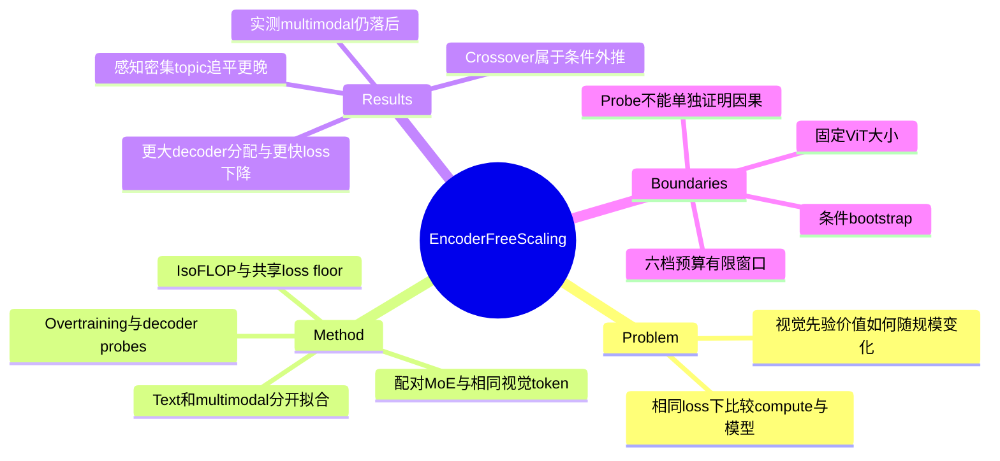

## Summary

该研究在共享 MoE decoder、训练数据和 visual-token 粒度的条件下比较 encoder-free 与 encoder-based 多模态预训练，作者报告：移除视觉 encoder 后，multimodal loss 随 compute 下降得更快，compute-optimal 分配也更偏向 decoder 容量，而 text scaling 接近不变。实测区间内 encoder-free 的 multimodal compute efficiency 仍较低；约 $10^{22}$ FLOPs 追平的结论来自固定 encoder、共享 loss floor 等条件下的外推，尚未由交叉点处的训练实验验证。Decoder 内部的 attention、表征变化和 expert routing 为视觉计算向 decoder 迁移提供线索，但不足以单独确证作者提出的学习机制。

## Problem & Motivation

预训练视觉 encoder 给 MLLM 提供现成的视觉表示，raw-pixel encoder-free 架构则需要 decoder 同时学习视觉表征和语言建模。单一模型在一个预算上的领先或落后，无法回答这种额外学习成本能否随着规模扩大被摊薄。本文把问题写成两类架构在相同 validation loss 下的 compute 与模型规模比较，并区分 text、multimodal 和不同视觉主题，避免把总体 loss 改善直接解释为所有感知能力一起追平。

## Method

### 配对模型与计算口径

作者使用 11 档 sparse MoE decoder，总参数 1.1B–44B、激活非 embedding 参数 71M–2.4B；两组共享数据、优化设置及模型规模序列，同一档采用相同超参数（C1）。Encoder-based 前端是固定约 400M 的 SigLIP 2 ViT，加 ConvPool 和 projector；ViT 与 decoder 联合训练，固定的是其架构大小，并非冻结权重。Encoder-free 前端将 raw pixels 经 normalization、linear projection 和二维位置编码送入 decoder；两者看到相同像素、使用相同 token 数，每个 visual token 对应 $32\times32$ 区域（C2）。

主比较还包含 attention 差别：encoder-free 同一图像内的 visual tokens 双向交互，其余保持 causal；encoder-based decoder 全部 causal。作者另跑 encoder-free 全 causal 对照，用于检查 allocation shift 是否仅由 mask 改变造成。

数据采用固定的 text / multimodal 混合；主要指标分别是纯文本 next-token loss 和图像条件下的文本预测 loss。Visual tokens 不直接承担 loss，但保留在 $D_{\mathrm{mm}}$ 和 FLOP 计数中。正文主要计算 decoder FLOPs，并按 objective 定义 $C_o=M_oD_o$，其中 $M$ 是 FLOPs/token；这些数字不能直接当成包含视觉前端成本的完整训练总账（C4）。

### Scaling fit 与同 loss 比较

在各个 IsoFLOP 预算内改变模型规模，用 $\log M$ 上的二次拟合估计最优点，再拟合：

$$M_{\mathrm{opt}}\propto C^a,\qquad D_{\mathrm{opt}}\propto C^{1-a},\qquad \mathcal L^*(C)=E+KC^{-\gamma}.$$

Text 和 multimodal 各使用六档预算，分别覆盖 $2\times10^{19}$–$2\times10^{20}$ 和 $10^{20}$–$10^{21}$ FLOPs（C3）。每个 objective 的两类架构共享一个 $E$，各自拟合 $K,\gamma$；共享 floor 是结构假设，有限区间数据没有识别真实渐近下界（C10）。

效率比的方向很重要：$\mathrm{EG}^C=C_{\mathrm{based}}/C_{\mathrm{free}}$，$\mathrm{EG}^M=M_{\mathrm{based}}/M_{\mathrm{free}}$。小于 1 表示 encoder-free 为达到相同 loss，需要更多训练 compute 或更大的 FLOPs/token。Overtraining 在 compute-optimal 模型大小上把 token 数乘以 $k$，因此实际 compute 是 $kC_{\mathrm{base}}$；作者固定 compute-optimal 拟合的 $E,K,\gamma$，以较小规模实验估计随 $k$ 改变的 multiplier。

## Key Results

### 实验支持的 scaling 趋势

| Objective | 架构 | Model allocation $a$ | Loss–compute $\gamma$ |
|:--|:--|--:|--:|
| Text | Encoder-free | 0.427 | 0.0973 |
| Text | Encoder-based | 0.422 | 0.0979 |
| Multimodal | Encoder-free | 0.570 | 0.3778 |
| Multimodal | Encoder-based | 0.464 | 0.2998 |

来源：Table 2（C5–C7）。Multimodal 的 $a$ 对应 central 80% conditional bootstrap 区间分别为 free 的 [0.546, 0.595] 和 based 的 [0.458, 0.472]。Encoder-free 的 model allocation 与 loss–compute 指数都更大，但在整个主要实测 multimodal 范围内，它达到相同 loss 所需的 compute 仍然更多（C8）。同 loss 下 $\mathrm{EG}^M\approx0.80$，即 encoder-free 使用约 1.25 倍 decoder FLOPs/token；这一结果也提醒我们，架构组件更少不等于推理更省（C12）。

### 追平预算是条件外推

| 情形 | Crossover 点估计 | Central 80% conditional bootstrap 区间 | 证据性质 |
|:--|--:|:--|:--|
| Compute-optimal | $6.1\times10^{21}$ FLOPs | $[4.2\times10^{21},1.0\times10^{22}]$ | 超出主拟合实测范围的外推 |
| $5\times$ overtraining | $1.2\times10^{22}$ FLOPs | $[8.4\times10^{21},2.0\times10^{22}]$ | 固定指数、另估 multiplier 后外推 |

来源：§3.2、§B.4（C9、C11）。这些预算采用正文计算口径，并以各自训练 regime 下的 compute 比较。$5\times$ overtraining 并未使 encoder-free 更快追平：最大拟合预算处，$\mathrm{EG}^C$ 从 0.62 降至 0.52，$\mathrm{EG}^M$ 从 0.80 降至 0.74（C13）。

稳健性检查支持局部趋势，但没有直接验证交叉点：

- Held-out multimodal 检查从较小预算拟合后预测 $2.5\times$ compute 处的 optimum，free / based 的 loss 相对误差为 −0.01% / +2.19%；它测试的是短程 loss 预测，不是两条曲线真正交叉（C21）
- 在共享 $E$ 的 ±10% 扰动中，compute-optimal crossover 落在 $[4.8,9.0]\times10^{21}$，$5\times$ overtraining 落在 $[0.9,1.9]\times10^{22}$；这些是敏感性范围，不能当成统计置信区间（C23）
- Bootstrap 重采样固定六档预算上的 paired residuals；overtraining multiplier 在 replicate 中不重新估计。因而区间描述条件拟合不确定性，不能覆盖更换架构、数据分布、loss-law 形式等结构风险（C10）
- 加计视觉前端训练 FLOPs 后，based 的 $\gamma$ 变为 0.362，free 约为 0.378，指数差明显缩小。作者指出额外成本有利于 free 的同 loss 比较，但没有为 full accounting 重拟合一个数值 crossover（C22）

### 不同视觉主题与 downstream 表现

在每个实测 multimodal topic 上，encoder-free 都没有达到 compute-efficiency parity。作者外推的追平次序为 STEM 最早、Charts 其次，GUI、OCR、Caption 更晚（C14）。这只是各 topic 的条件 loss scaling；GUI 子集的结论不等于 GUI agent 的 grounding 或闭环操作成功率结论。

Downstream 使用 pretrained checkpoints，不再训练；相同 3-shot 示例、prompt 和图像预处理，且不使用外部 OCR 或 test-time fine-tuning。评测覆盖 CV-Bench、POPE、MME、ChartQA、DocVQA、AI2D、TextVQA、RealWorldQA、MMStar、MMBench-EN、ScienceQA-IMG；平均值是不同 benchmark 分数的未加权平均（C16）。

| 约 100B training tokens 的模型 | Encoder-based 平均分 | Encoder-free 平均分 |
|:--|--:|--:|
| 6.1B-A425M | 43.5 | 35.5 |
| 33B-A2.2B | 57.7 | 51.2 |

来源：Table 6（C15）。这两个端点的差距有所缩小，但仍未整体追平；单项 benchmark 有例外，模型尺寸增长下的分数也并非逐项单调。应把 downstream 结果作为 loss 趋势的辅助证据，不能写成大模型已取得同等视觉能力。

### Decoder 接管视觉计算的线索

8B encoder-free 模型的 multimodal loss 先下降缓慢，再出现短暂快速下降；对应 layer 12 的 visual attention mass 从 0.217 增到 0.645。作者据此提出视觉表征先缓慢形成、随后吸引更多文本 attention 并加速学习的假说；这是相关性与机制解释，论文没有用干预实验隔离该因果链（C18）。

Causal 对照的 multimodal allocation $a=0.557$，与双向版本的 0.570 接近，支持 allocation shift 不全由 attention mask 引起；不过最大预算的 causal IsoFLOP vertex 本身是外推（C17）。双向 visual attention 在 multimodal 上的好处随 compute 增长；以 causal 为 target 的 observed compute EG，text 为 1.011、multimodal 为 0.990，平均效应较小，不能描述为大幅收益（C24）。

Layerwise cosine similarity 显示，free 的 visual tokens 在浅层更早偏离输入，而 text 表征轨迹接近；四个最大模型的 visual-token MaxVio 也更高，说明视觉 token 路由更集中（C19、C20）。这些 probe 与早期层承担视觉处理、部分 experts 专门服务视觉的解释相容，但表征位移不等于已测得语义质量，routing imbalance 也不等于已证明功能性 specialization。

## Evidence Ledger

全文来源为 [arXiv v1 HTML](https://arxiv.org/html/2609.35457v1) 与 [PDF](https://arxiv.org/pdf/2609.35457)。以下 24 条高风险 claim 已由独立核查者与原文逐项核对；`source-verified` 只表示原文一致性，不代表独立实验复现。原文短摘录仅保留最小定位线索，完整证据须结合 locator 阅读。

| Claim ID | Claim | Type | Source locator | Evidence excerpt | Status |
|:--|:--|:--|:--|:--|:--|
| C1 | 比较使用同一组 11 档 sparse MoE decoder，总参数 1.1B–44B、激活非 embedding 参数 71M–2.4B。 | benchmark-setting | PDF p.3 §2.3; p.16 §A.2 | 11 | source-verified |
| C2 | 两种视觉前端保持相同输入像素、每个 32×32 区域一个 visual token 和相同 visual token 数；encoder-based 使用固定约 400M SigLIP 2 ViT，并与 decoder 联合训练。 | benchmark-setting | PDF p.16 §A.1 | 32 | source-verified |
| C3 | 主要 IsoFLOP 拟合对每个 objective 使用六档预算：text 为 2×10^19–2×10^20 FLOPs，multimodal 为 10^20–10^21 FLOPs。 | benchmark-setting | PDF p.17 §A.5 | six | source-verified |
| C4 | 正文的训练 FLOPs 主口径只计 decoder；D_mm 包含视觉与文本 token，但 multimodal loss 只计算图像条件下的文本预测 token。 | benchmark-setting | PDF p.3 §2.4; p.17 §A.4 | decoder | source-verified |
| C5 | multimodal compute-optimal loss–compute 指数 γ 为 encoder-free 0.3778、encoder-based 0.2998。 | comparison | PDF p.5 Fig.4; p.17 Table 2; p.21 Table 4 | 0.3778 | source-verified |
| C6 | multimodal model-allocation 指数 a 从 encoder-based 0.464 升至 encoder-free 0.570；对应 central 80% conditional bootstrap 区间为 [0.458,0.472] 与 [0.546,0.595]。 | comparison | PDF p.4 §3.1; p.21 Table 4 | 0.570 | source-verified |
| C7 | text objective 的 a 为 encoder-free 0.427、encoder-based 0.422，γ 为 0.0973、0.0979，说明在该设置下两条 text scaling frontier 接近。 | comparison | PDF p.4 §3.1; p.5 §3.2.1; p.17 Table 2 | 0.0973 | source-verified |
| C8 | 在全部主要实测 multimodal compute 范围内，encoder-free 在同 loss 下仍需更多训练 compute。 | comparison | PDF p.5 §3.2.1; p.9 §5 | throughout | source-verified |
| C9 | compute-optimal multimodal crossover 的 6.1×10^21 FLOPs 是超出实测范围的拟合外推；central 80% conditional bootstrap 区间为 [4.2×10^21,1.0×10^22]。 | number | PDF p.5 §3.2.1; pp.20–21 §B.4 | Extrapolating | source-verified |
| C10 | crossover 外推条件包含固定视觉 encoder、两家族共用 irreducible loss floor、拟合法则延续；bootstrap 在固定六档预算的拟合残差上进行，5× overtraining 的 multiplier 不重新估计。 | benchmark-setting | PDF p.5 §3.2.1; p.19 §B.3; p.20 §B.4 | assumption | source-verified |
| C11 | 5× overtraining 的 extrapolated crossover 为 1.2×10^22 FLOPs，central 80% conditional bootstrap 区间 [8.4×10^21,2.0×10^22]。 | number | PDF p.6 §3.2.2; p.21 §B.4 | 1.2 | source-verified |
| C12 | multimodal 同 loss 比较的 model efficiency gain 约 0.80，相当于 encoder-free 使用约 1.25 倍 decoder FLOPs/token。 | comparison | PDF p.5 §3.2.1 | 1.25 | source-verified |
| C13 | 在最大拟合预算处，5× overtraining 将 multimodal compute efficiency gain 从 0.62 降至 0.52，model efficiency gain 从 0.80 降至 0.74。 | comparison | PDF p.6 §3.2.2 | 0.52 | source-verified |
| C14 | 所有实测 multimodal topic 中 encoder-free compute efficiency 都低于 encoder-based；拟合外推的 crossover 次序为 STEM 最早、Charts 其次，GUI/OCR/Caption 更晚。 | comparison | PDF p.7 §3.2.3 & Fig.6 | every | source-verified |
| C15 | 约 100B training tokens 下，6.1B-A425M 的 11 benchmark 平均分 based/free 为 43.5/35.5，33B-A2.2B 为 57.7/51.2；这两端模型都未追平。 | comparison | PDF p.27 Table 6 | 51.2 | source-verified |
| C16 | downstream 使用不再训练的 pretrained checkpoints、相同 3-shot 示例与 prompt；11 benchmark 的平均分为未加权平均，不用外部 OCR 或 test-time fine-tuning。 | benchmark-setting | PDF p.26 §§G.1–G.2; p.27 Fig.20 | 3-shot | source-verified |
| C17 | encoder-free causal attention 对照的 multimodal a 为 0.557，仍高于 based 的 0.464；最大预算的 causal IsoFLOP vertex 是外推，原文要求谨慎解读。 | comparison | PDF p.4 Table 1; p.23 §E.2 | extrapolated | source-verified |
| C18 | 8B encoder-free 模型在 loss 快速下降前后，layer 12 的 visual attention mass 从 0.217 增至 0.645；作者把 bootstrap visual representations 作为解释假说。 | causal-mechanism | PDF pp.7–8 §3.3 & Fig.7 | hypothesize | source-verified |
| C19 | 与 encoder-based 相比，encoder-free 的 visual token 表征在更浅 decoder layer 偏离 layer-0 输入，而 text 轨迹接近；证据为 layerwise cosine similarity probe。 | causal-mechanism | PDF p.8 §3.3 & Fig.9; p.23 §E.1 & Fig.16 | similarity | source-verified |
| C20 | 在四个最大模型上，encoder-free 的 visual-token expert MaxVio 更高，text 路由接近；作者将其解释为视觉容量专门化的相容证据。 | causal-mechanism | PDF pp.8–9 §3.3 & Fig.10 | MaxVio | source-verified |
| C21 | held-out multimodal extrapolation check 为 2.5× 预算外推，encoder-free / encoder-based loss 相对误差分别 −0.01% / +2.19%，并未直接测试预测 crossover。 | comparison | PDF pp.18–19 §B.2 & Fig.13 | +2.19% | source-verified |
| C22 | 计入视觉前端训练 FLOPs 后，encoder-based 的拟合 γ 为 0.362、encoder-free 为约 0.378；作者没有在 full-accounting 下重新拟合一个数值 crossover。 | comparison | PDF p.22 §§C.2–C.3 & Table 5 | 0.362 | source-verified |
| C23 | 在 shared multimodal loss floor 的 ±10% 扰动中，compute-optimal crossover 的敏感性范围为 [4.8,9.0]×10^21 FLOPs，5× overtraining 为 [0.9,1.9]×10^22；这些不是统计置信区间。 | number | PDF pp.19–20 §B.3 & Table 3 | [0.90,1.10] | source-verified |
| C24 | causal 对 bidirectional 的 encoder-free 对照中，text 的 observed compute EG 为 1.011，multimodal 为 0.990；比值大于 1 在该实验中偏向 causal。 | comparison | PDF p.8 §3.3 & Fig.8 | 0.990 | source-verified |

## Strengths & Weaknesses

论文最有价值的部分是把架构选择拆成可比较的 scaling 问题。相同输入像素和 token 数、相同 decoder ladder、text control、causal ablation，以及不同计算口径和 estimator 检查，使“额外视觉学习负担偏好更大 decoder”比单个 benchmark 优势更有解释力。下游评测仍然报告 free 的差距，也避免了仅凭 loss 外推宣布能力追平。

最重要的边界是固定视觉 encoder。随着 decoder 增大，固定 ViT 的容量占比降低；本文没有回答联合扩大 ViT 与 decoder 时哪种架构更优。Shared irreducible floor 还假定两类模型在足够规模下都能消除各自的 approximation error；§B.3 已明确这不是有限数据识别出的事实。指数的排序比某个精确 crossover 数字更值得保留。

泛化范围也有限：固定数据配比、单一 MoE 家族、有限 compute 窗口，没有直接覆盖 dense models、视频、生成、机器人行动或闭环 GUI 操作。数据来源与超参数说明不足以仅凭论文完整复现全部训练；当前全文未给出本研究代码仓库链接。正文的 FLOPs/token 比较也不是端到端时延、显存和系统吞吐测量，不能据此判断部署净收益。

对机制解释应保留更严格标准。Attention mass、cosine distance 和 MaxVio 是观察性统计；能够选择性干预视觉早期层或相关 experts，并测量任务损失、感知能力与恢复过程，才更接近验证“谁承担了哪些 encoder 功能”。

## Mind Map

## Notes

- 与 [[2607-Gemma4]] 的联系：本文使用的 encoder-free patch projection 借鉴 Gemma 4 12B Unified，并改变 patch merging 以匹配 token 粒度；它提供的是受控 scaling 证据，不能把 Gemma 的完整能力或系统效率直接归因于该实验
- 与 [[2605-SenseNovaU1]] 的联系：两者都讨论移除外部视觉 encoder，但本文的评价目标是图像条件下文本 loss 与理解 benchmark，不能直接外推到联合图像生成训练
- 对 GUI / OCR 方向的研究判断：优先测量细粒度 perception 的 compute gap，再考虑移除 encoder；本文的主题分解已经说明 aggregate crossover 可能掩盖这类任务的持续差距
- 最有信息量的后续实验：在预测交叉点附近做真正的大预算配对训练，并把 fixed-ViT 与 joint encoder–decoder scaling 放到同一 full-compute 约束下；同时报告 perception-heavy downstream 和部署成本，检查 loss parity 是否转化为实际能力与效率
