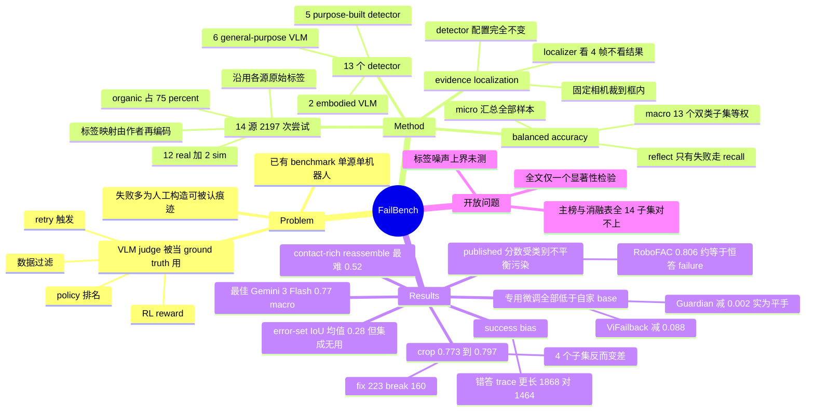

## Summary

FailBench 把 14 个独立采集的公开数据源统一成同一道题——给指令和录像，判断这次机器人操作成没成——测出 13 个 VLM 判官里最好的 Gemini 3 Flash 只有 0.77 macro balanced accuracy，且 5 个专为 failure detection 微调的模型全部低于各自的 base model。作者把误差归到"判断所需的视觉证据"而非机器人或任务类型上，并用一个不需训练、只裁剪输入视野的 localization pipeline 把最强判官从 0.773 抬到 0.797。

## Problem & Motivation

VLM 判官已经在整条 robot learning 流水线里被当 ground truth 用：RL reward、训练数据过滤、policy 排名、retry 触发器。但判官本身几乎没被单独评过——Guardian、RoboFAC、ViFailback 都只在自己论文里随 benchmark 一起发布的那个源上评一遍。

这带来两个可分离的问题。第一，已有的 failure benchmark 每个都来自单次采集活动，机器人、夹爪、相机位置、场景、任务族、标注流程全部被固定住，于是"这个检测器有多准"和"它是在哪被测的"混在同一个数字里。第二，多数 benchmark 的失败是构造出来的——扰动一条成功轨迹、或者把没动过的录像配上另一条指令——标签跟着构造流程走，检测器只要认出构造留下的痕迹就能拿分。真实运行中的失败要隐蔽得多：peg 停在离孔一点点的地方、夹爪看起来闭合但从没建立接触、零件早松了一下。

作者把范围收窄到 execution failure：动作执行了但没产生预期结果，且结果能从录像里判出来。不覆盖 planning failure（动作在执行前就已经选错），也不评估中间进度。这道题窄，但它是上面所有更丰富输出（解释、失败类型、纠正动作、dense progress、分级打分）共同依赖的底座。

## Method

**Benchmark 构造。** 从约 30 个候选语料筛到 14 个（12 real / 2 sim），三条准入规则：必须录到一次完整的操作尝试；必须自带 outcome label（"FailBench 里没有一条标签是我们自己看视频判的"）；必须补上集合里还没有的任务族、机器人或失败类型。其中 6 个 real 源本来根本不是给 failure detection 用的——armnetbench 和 roboarena 是评 policy 的，robometer 和 roboreward 是评 reward model 的，rh20t 和 reassemble 就是普通数据采集。

失败按来源分四类：organic（自然发生，占 75%）、planned（人为故意做错）、synthetic（录完之后构造出来的）、undocumented。最终 2,197 个样本，1,176 failure / 1,021 success，按样本加权 54% 是失败。

**标签映射是作者设计的再编码，不是原样照搬。** rh20t 把操作员打的 0-9 质量分二值化，0 和 1 算失败、2-9 算成功；roboreward 把 1-5 分里的 5 映射成功、2 和 3 映射失败，刻意剔掉表示"接近完成"的 4 分；armnetbench 只保留 π0.5 的 rollout（因为它在被评的 policy 里成功率最高）并丢掉 suboptimal 那一档；robometer 剔掉 partial progress 档。约 25% 样本人工抽检，发现标签错或模糊就从同源同分布换一个。

**指标。** balanced accuracy，chance 恒为 0.50。macro 是 13 个双类子集的算术平均，每个子集等权，与样本量无关（子集从 300 到 60 不等）；micro 把所有回答过的样本汇总成一个 balanced accuracy。reflect 只有失败样本，因此用 failure recall 计分，进 micro 但不进 macro。

**评测面板。** 13 个 detector 分三组：6 个通用 VLM（Gemini 3 Flash、Gemma-4-31B-it、GPT-4o、Qwen3-VL-Thinking 的 8B/4B/2B）、2 个 embodied VLM（Hy-Embodied-VLM-1.0、HY-Embodied-0.5）、5 个专用检测器（Guardian、RoboReward-8B、ViFailback-8B、RoboFAC-7B、FailSense-Calvin-3B）。用各模型 official prompt 与推荐 decoding；支持视频的直接喂视频，否则均匀取 32 帧。

**Evidence-localization pipeline。** 两步。localizer 只看跨越整段的 4 帧加任务句子，返回一个矩形，永远看不到 outcome——所以框本身不可能编码答案。固定相机裁到框内，wrist 和其他移动相机整帧送。detector 的 prompt、帧预算、decoding 一律不变，只有视野变了。

## Key Results

**主榜（Table 1，macro / micro balanced accuracy）**

| Model | Macro | Micro | 组别 |
|:--|:--|:--|:--|
| Gemini 3 Flash | 0.77 | 0.74 | general |
| Gemma-4-31B-it | 0.75 | 0.76 | general |
| Qwen3-VL-8B-Thinking | 0.69 | 0.69 | general |
| GPT-4o | 0.69 | 0.67 | general |
| Qwen3-VL-4B-Thinking | 0.65 | 0.65 | general |
| Guardian (thinking) | 0.63 | 0.61 | 专用 |
| RoboReward-8B | 0.62 | 0.59 | 专用 |
| Hy-Embodied-VLM-1.0 | 0.61 | 0.62 | embodied |
| ViFailback-8B | 0.59 | 0.56 | 专用 |
| HY-Embodied-0.5 | 0.54 | 0.53 | embodied |
| Qwen3-VL-2B-Thinking | 0.53 | 0.53 | general |
| RoboFAC-7B | 0.51 | 0.52 | 专用 |
| FailSense-Calvin-3B | 0.50 | 0.50 | 专用 |

最好的判官四次里错一次。每个专用检测器都低于除最小通用模型（Qwen3-VL-2B，0.53）之外的所有通用模型。

**专用微调让模型变差（Table 7）。** base 与 specialist 只差微调这一步，harness、prompt、输入配方全同，所以这个比较的内部效度是全篇最强的：Guardian −0.002、RoboReward-8B −0.057、ViFailback-8B −0.088、RoboFAC-7B −0.040、FailSense-Calvin-3B −0.003。方向一致，但幅度分化极大——真正有量级的只有 3 个，Guardian 和 FailSense 基本是平手。Guardian 那个近似平手还是靠它自家的 ur5fail 和 bdv2fail 撑的：去掉这两个子集、在剩下 11 个上比，Guardian 0.596 对 InternVL3-8B 0.639。

**published 分数受类别不平衡污染（Appendix B.1 / D）。** 这是全篇最有杀伤力的诊断。Guardian 通过了 harness 校验：UR5FAIL 0.741 对 published 0.77，BDV2FAIL 0.850 对 published 0.85。RoboFAC-7B 的 0.53 则不是复现失败——它在平衡子集上把 30 个 failure 全判对、30 个 success 只对了 2 个（recall 1.000 / 0.067），把这两个 recall 按其 published split 的 960:244 先验重加权得 0.811，对上 published 的 0.806。换句话说它的 published 分数接近"全判 failure"就能白拿的 0.797，一旦把类别平衡过来就掉回随机。ViFailback 的 published split 是 445:55，全判 failure 就有 0.890，而论文报的 Qwen3-VL-8B base 是 0.900——作者明确说这只是先验检查而非复现，因为 FailBench 里根本没有 ViFailback 的子集。

**难在证据类型，不在机器人或任务。** 最难的是 reassemble（NIST 装配板上的接触密集装配，slice mean 0.52），Table 2 里最好的 detector 是 0.60。作者由此在 abstract 里写"contact-intensive assembly 上没有模型超过 0.60"——但这条断言与论文自己的 Table 8/9 冲突，那两张表给出的 Gemma 全帧 baseline 在 reassemble 上是 0.608，masked blackout 变体更到 0.652（详见 Evidence Ledger C34）。反过来最容易的是 robofac（0.72），其次 ur5fail 和 roboreward 各 0.66。

**detector 之间不共错，但集成不划算。** 78 个模型对的 error-set IoU 均值 0.28；最高的 0.82 出现在 RoboFAC-7B 与 ViFailback-8B 之间，来自两者都近乎无条件回答 failure，是共享 bias 而非共享感知。排除这两个后，剩下 11 个共同错分 59 个样本。三强 majority vote 得 0.78，对"单最佳 0.76"（论文没说明这个 0.76 是在什么口径上算的，Table 1 里 Gemini macro 是 0.77），contact-rich 上只有 0.55，评测成本约三倍。

**sim 会掩盖差距。** real 与 sim 两半对 detector 的排序几乎一致（Spearman ρ=0.95），sim 平均容易约 1.3 点，但 real 的分数离散度明显更大（var ≈0.0135 对 ≈0.0089）。在 sim 上挑出来的判官，部署到真机时模型之间的差距会重新拉开。

**crop pipeline 是净收益而非稳定收益。** Gemini 既做 localizer 又做 detector，macro 从 0.773 到 0.797，fix 223 个、break 160 个，exact McNemar p=0.0015（这是全篇唯一一个推断统计量）。收益集中在"工作区大、决定性物体小"的子集：simplerenv +10.7、roboarena +7.0、robometer +5.0；但 14 个子集里有 4 个变差（robometersim −2.0、bdv2fail −4.0、phail −4.5、reflect −6.7），而它诊断出来的 contact-level 问题基本没被解决，reassemble 只从 0.567 到 0.591。Appendix C 的归因显示框和判官谁都单独扛不住结果：换成 Gemini-localizer + Gemma-detector 掉 0.01，且 simplerenv 上那批同样的框对 Gemini detector 值 +10.7、对 Gemma 一点用没有。渲染方式消融（Gemini 定位 + Gemma 判断）：native crop 0.787 > masked blackout 0.784 > upscaled crop 0.774 > 原图 0.768。

**success bias 不是想得少造成的。** Gemma-4-31B-it 错答的 reasoning trace 平均 1,868 字符，对答 1,464 字符，中位数同向。定性上模型会把感知工作做完、点名自己不确定的东西、然后照样判 success（一条 trace 以"Is there any reason to believe it failed? No."收尾）；会幻觉（reflect 里苹果在半路掉了、之后每一帧碗都是空的，模型的 verification step 却说苹果清楚地在碗里）；也不做多视角互校（一号相机里葡萄像是被夹着，另两个相机里葡萄还在桌上，模型写"black grapes are now inside the gripper jaws"）。

## Evidence Ledger

| Claim ID | Claim | Type | Source locator | Evidence excerpt | Status |
|:--|:--|:--|:--|:--|:--|
| C1 | 2,197 次尝试 / 14 源（12 real + 2 sim）/ 1,176 fail + 1,021 succ / 54% 失败 | number | Sec 3 结尾 + abstract | "The result is 2,197 samples, 1,176 failures and 1,021 successes" | source-verified |
| C2 | 75% 的失败是 organic 而非人为构造 | number | abstract + Fig. 1 caption | "75% of failures occur naturally rather than being deliberately constructed" | source-verified |
| C3 | 13 个 detector，最佳 Gemini 3 Flash 仅 0.77 macro balanced accuracy | number | Table 1 + Sec 4.2 | "the best detector ... is Gemini 3 Flash, whose performance reaches 0.77" | source-verified |
| C4 | 5 个 specialist 全部低于各自 base model；Guardian 最接近平手 0.627 vs 0.629 | comparison | Appendix B.1 + Table 7 | "All fine-tuned specialists score below the base model they were fine-tuned from." | source-verified |
| C5 | 每个专用 detector 都低于除最小通用模型外的所有通用模型 | comparison | Sec 4.2 | "Every purpose-built detector scores below every general-purpose model except the smallest" | source-verified |
| C6 | reassemble slice mean 0.52，Table 2 中最佳 detector 为 0.60 | number | Sec 4.2 + Table 2 slice-mean 行 | "the worst average performance is observed on reassemble (0.52), where even the best detector scores only 0.60" | source-verified |
| C7 | crop pipeline 使 Gemini macro 0.773→0.797，fix 223 / break 160，exact McNemar p=0.0015 | number | Sec 4.4 + Table 4 macro 行 | "rises +2.3 points, from 0.773 to 0.797, fixing 223 samples and breaking 160" | source-verified |
| C8 | 78 对 error-set IoU 均值 0.28；最大 0.82 在 RoboFAC-7B 与 ViFailback-8B 之间 | number | Sec 4.3 + Table 3 caption | "The average IoU across all 78 pairs is 0.28" | source-verified |
| C9 | 三强 majority vote 0.78 对单最佳 0.76，contact-rich 上仅 0.55，成本约三倍 | number | Sec 4.3 结尾 | "it scores 0.78 against 0.76 for the best model alone, and it reaches only 0.55" | source-verified |
| C10 | Gemma-4-31B-it 错答 trace 平均 1,868 字符，对答 1,464 字符 | number | Appendix B.2 末段 | "wrong answers carry longer reasoning than its right ones, 1,868 characters against 1,464" | source-verified |
| C11 | RoboFAC-7B 平衡子集 30/30 fail 对、2/30 succ 对，BA=0.533；按 published 先验重加权得 0.811 对 published 0.806 | number | Appendix B.1 + Appendix D | "catches all 30 failures but clears only 2 of the 30 successes"; "gives 0.811, against the reported 0.806" | source-verified |
| C12 | real 与 sim 排序 Spearman ρ=0.95；sim 平均易 ~1.3 点；var ≈0.0135 对 ≈0.0089 | number | Sec 4.2 | "rank the detectors almost identically, at Spearman ρ=0.95" | source-verified |
| C13 | harness 校验：Guardian UR5FAIL 0.741 对 published 0.77、BDV2FAIL 0.850 对 published 0.85 | number | Appendix B.1 | "Guardian agrees: 0.741 on UR5FAIL against a published 0.77, and 0.850 on BDV2FAIL against 0.85." | source-verified |
| C14 | 渲染消融：native crop 0.787 > masked 0.784 > upscaled 0.774 > 原图 0.768 | number | Table 9 macro 行 + Appendix C | "The original localization pipeline ... reaches 0.787, while ... darkening everything outside the box reaches 0.784" | source-verified |
| C15 | reflect 仅含 30 条失败，按 failure recall 计分，排除出 macro 但进 micro；RoboFAC-7B 在其上得 1.00 | benchmark-setting | Sec 4.2 + Appendix A + Table 2 | "its samples enter the micro average, and it is excluded from the macro average" | source-verified |
| C16 | 论文声明 release benchmark 与 evaluation harness；Project Home 为 metric-ai-lab.github.io/failbench；全文无 GitHub / HF 链接 | license-code | abstract + 标题块 Project Home 行 | "We release FailBench and the accompanying evaluation harness" | source-verified |
| C17 | 约 25% 样本人工抽检，标签错或模糊即从同源同分布替换 | benchmark-setting | Sec 3 结尾 | "We randomly select around 25% of the benchmark for manual inspection" | source-verified |
| C18 | 作者 Navasardyan / Danielyan / Davtyan，Metric AI Lab；arXiv v1，2026-09-03 | number | 标题块 + arXiv 戳 | "arXiv:2609.03611v1 [cs.RO] 03 Sep 2026" | source-verified |
| C19 | localizer 只看 4 帧 + 任务句、不给 outcome；固定相机裁框、wrist/移动相机整帧；detector 配置不变 | causal-mechanism | Sec 4.4 pipeline 描述 | "a localizer sees four frames ... never given the outcome ... same prompt, frame budget and decoding settings" | source-verified |
| C20 | 排除 RoboFAC-7B 与 ViFailback-8B 后，剩余 11 个 detector 共同错分 59 个样本 | number | Sec 4.3 | "there are 59 samples that are incorrectly classified by the rest of the eleven" | source-verified |
| C21 | 去掉 Guardian 两个 home subset 后，11 子集上 Guardian 0.596 对 InternVL3-8B 0.639 | number | Appendix B.1 | "Guardian reaches 0.596 against 0.639 for InternVL3-8B" | source-verified |
| C22 | abstract 写 "2.4 percentage points"，而 Sec 4.4 / Table 4 / Conclusion 对同一个 0.773→0.797 写 "+2.3"——论文内部不一致 | number | abstract 对 Sec 4.4 / Table 4 / Sec 7 | abstract "by 2.4 percentage points"; Conclusion "by 2.3 points without retraining" | source-verified |
| C23 | 作者断言难度由所需视觉证据决定，且明确承认 motion-vs-contact 这个区分没被标注也没被测量 | causal-mechanism | abstract + Appendix B.2 | "We did not annotate the benchmark according to this distinction ... a reading of the samples we examined rather than as a measurement." | source-verified |
| C24 | macro 对 13 个双类子集等权，与样本量无关；子集规模从 300 到 60 | benchmark-setting | Sec 4.2 + Table 1 caption + Table 6 | "every subset is weighted equally, independently of its sample size" | source-verified |
| C25 | Appendix C 归因：换 Gemma detector 掉 0.01；simplerenv 上同一批框对 Gemini 值 +10.7、对 Gemma 无效 | number | Appendix C 首段 + Table 8 | "on simplerenv those same boxes are worth +10.7 with a Gemini detector and nothing at all with Gemma" | source-verified |
| C26 | novelty 断言：无已发表评测在统一 protocol 下跨独立采集源评检测器；PRIMO R1 是作者已知唯一跨源结果（RoboFail 零样本 67%） | sota-novelty | Sec 2 结尾 + Sec 2 | "No published evaluation scores a detector across independently collected sources under one protocol" | source-verified |
| C27 | Sec 4.3 的 "0.76 for the best model alone" 与 Table 1 的 Gemini macro 0.77 / micro 0.74 都不对应，论文全篇未说明该 0.76 的口径 | number | Sec 4.3 对 Table 1 | 独立核查结论：论文 never states what set or aggregation the 0.76 refers to | source-verified |
| C28 | 标签映射为作者再编码：rh20t 0-1→fail / 2-9→succ；roboreward 5→succ、2-3→fail、剔除 4；armnetbench 只留 π0.5 且丢 suboptimal；robometer 剔除 partial progress | benchmark-setting | Appendix A 各源段落 | "map score 5 to success, scores 2 and 3 to failure, and exclude score 4" | source-verified |
| C29 | 全文未报告任何人类 balanced accuracy 基线、标注者一致率或标签噪声估计，因此没有可达上界 | benchmark-setting | 全文检索 human / annotator / agreement / ceiling | 仅有 "around 25% of the benchmark for manual inspection"，无任何一致率或人类分数 | source-verified |
| C30 | crop 在 4 个子集上变差：robometersim −2.0、bdv2fail −4.0、phail −4.5、reflect −6.7；reassemble 仅 0.567→0.591 | number | Table 4 | Table 4 Δ 列 | source-verified |
| C31 | Table 7 五个 delta 为 −0.002 / −0.057 / −0.088 / −0.040 / −0.003，且未报告任何方差、置信区间或显著性检验 | number | Table 7 delta 列 + caption | "Delta is specialist minus base, computed before rounding" | source-verified |
| C32 | Table 2 的 Gemma-4-31B-it 行与 Table 8 的 "Baseline Gemma" 行在全部 14 个子集上都不一致，最大差距达 10.0 点（roboarena 0.70 对 0.800）与 9.7 点（reflect 0.73 对 0.633）；macro 0.75 对 0.768 | number | Table 2 对 Table 8 / Table 1 对 Table 8 | Table 8 "Baseline Gemma \| None \| Gemma \| 0.768 \| 0.800 \| 0.669 \| ..." | source-verified |
| C33 | Sec 4.1 称 pipeline 对比实验用 "most possible deterministic setting"，但论文从未以此解释 Table 8 与 Table 1/2 的差异，也从未量化该 spread | benchmark-setting | Sec 4.1；全文检索 | "All experiments where the same model performance with different pipelines is compared are run with the most possible deterministic setting." | source-verified |
| C34 | abstract 断言 "no model exceeds 0.60 balanced accuracy on contact-intensive assembly tasks" | number | abstract 对 Table 8 / Table 9 | 论文自身 Table 8 "Baseline Gemma" 在 reassemble 上为 0.608，Table 9 masked blackout 为 0.652 | **contradicted**（被论文自身表格推翻；正文已降级为"仅在 Table 1/2 那一轮成立"） |

## Strengths & Weaknesses

**问题选得对，这是这篇最大的价值。** VLM 判官在整条 robot learning 流水线里被当 ground truth 用了很久，却几乎没人单独评过它。把"评判官"从各家 benchmark 的自评里拆出来，本身就是一个该有人做而没人做的动作。跨源这一步也做得干净：14 个源独立采集、沿用各源自己的标签、同一套 protocol，这让"检测器有多准"和"它在哪被测"第一次可分。

**最硬的结果是那个负结果，而且它的内部效度是全篇最强的。** base 和 specialist 之间只差微调这一步，harness、prompt、输入配方全同，所以"5 个专用检测器全部低于自家 base"这个比较很难被别的因素解释。配上 B.1 的算术——RoboFAC 的 published 0.806 几乎等于"全判 failure"白拿的 0.797，ViFailback 的 split 上全判 failure 就有 0.890 而它报的 base 是 0.900——这实际上是在说，这条技术线上相当一部分已发表数字是类别不平衡的产物。这个 diagnosis 比 benchmark 本身更有杀伤力，也更容易被后续工作直接引用。

**作者的 evidence discipline 值得单独表扬。** B.2 明写"Nothing in this subsection is a statistically supported claim"，明说 motion-vs-contact 的区分没标注、没统计；ViFailback 那段明说因为 FailBench 里没有它的 home subset，所以不投影、不宣称复现。这种自我设限在 benchmark 论文里不常见。

但有几处限制会实质影响结论怎么读。

**0.77 这个上限里混了多少标签噪声，论文完全没有拆。** 全部标签来自原始数据提供方，只有约 25% 人工抽检过，而且抽检只汇报了"发现问题就换掉"，没给出发现率。更关键的是标签映射本身是作者的再编码：rh20t 是把操作员的 0-9 质量分二值化，roboreward 是把 1-5 分映射并刻意剔掉表示"接近完成"的 4 分，armnetbench 只保留成功率最高的那个 policy。这些决定同时塑造了难度和标签质量，却一个都没做敏感性分析。全文没有任何人类 balanced accuracy 基线或标注者一致率，所以"最好只有 0.77"到底是模型不行、还是天花板本来就明显低于 1.0，读者无从判断。这是解读全篇头号结论时最大的未知量。

**头条机制的量化支撑只有一个子集。** "难度由所需视觉证据决定而非机器人或任务"是 abstract 级论断，但可测量的支撑基本只是 reassemble（n=124）最差、而它恰好是 contact-rich。作者自己承认没按 motion/contact 标注过。这条 claim 的证据强度和它在 abstract 里的位置不匹配——它更像一个有说服力的工作假设，而非已被测量的结论。

**更麻烦的是，这条 abstract 级断言被论文自己的表格推翻了。** "no model exceeds 0.60 balanced accuracy on contact-intensive assembly" 只在 Table 1/2 那一轮成立；Table 8 的 Baseline Gemma 在 reassemble 上是 0.608，Table 9 的 masked blackout 更到 0.652。

**而这不是孤例——Table 2 和 Table 8 在全部 14 个子集上都对不上。** 同一个 Gemma-4-31B-it 判同样的全帧、同样的子集，roboarena 差 10.0 点（0.70 对 0.800）、reflect 差 9.7 点、ur5fail 差 5.2 点、rh20t 差 4.1 点，macro 差 1.8 点；Gemini 那一行也有同样的问题。Sec 4.1 说 pipeline 对比实验用"最接近确定性的设置"，这大概率就是原因，但论文从头到尾没把两组数字对上过，也没量化这个 spread。后果很直接：一个未被声明、目视可达 1-4 点（个别子集到 10 点）的协议敏感性，和 crop pipeline 的 +2.3 点头条增益、以及 Table 7 里 Guardian −0.002 / FailSense −0.003 这两个 delta 是同一量级甚至更大。全文唯一的推断统计量是 crop 那一个 McNemar p 值，13 模型 × 14 子集的主榜没有任何方差、置信区间或误差棒。

**crop 干预是净收益而非稳定收益。** 223 fix 对 160 break，净 +63 / 2166；14 个子集里 4 个变差；对它自己诊断出来的 contact-level 问题基本无效（reassemble 0.567→0.591）。作者没有回避这些数字，但 abstract 里"input-level intervention is effective"的语气比数据要响。

**子集等权的 macro 把 n=30 和 n=300 拉平。** 好处是不让 rh20t 和 armnetbench 主导，坏处是最容易的 robofac（n=60，slice mean 0.72）和最难的 reassemble（n=124，0.52）对总分贡献相同，排名对"收了哪 14 个源"相当敏感。

**覆盖面。** 全是 tabletop 平行夹爪，无 humanoid、移动操作或灵巧手，双臂只有 armnetbench 的 98 条。不用 force-torque 和音频——而恰恰是最难的 contact-rich 子集本来就录了这些信号。所以"视觉判官在 contact 上接近随机"这个结论无法区分"VLM 不行"和"视觉这个模态本来就不够"，而这两者的后续研究方向完全不同。

**对领域的影响判断。** 这篇不提供新方法，价值在两处：给"用 VLM 当 reward / filter / 排名器"这一整类做法标了一个可靠性量级；给 failure-detection 专用微调这条路线泼了冷水，并给出了一个可复用的审计手法（把 published 分数按类别先验重算，看它离"恒答多数类"有多远）。如果结论站得住，直接推论是——contact-rich 任务上用 VLM judge 生成的 RL reward 基本是噪声，而这条线上已发表的 detector 分数需要按类别不平衡重读一遍。

## Mind Map

## Connections

- [[Papers/2504-AgentRewardBench]] —— web agent 侧的同构结论，也是本笔记最该对照着读的一篇。那篇发现没有任何 judge 的 precision 超过 70%，即 judge 判成功的轨迹约三成实际失败；FailBench 在机器人侧独立观察到同方向的偏斜，模型在证据模糊时把结论倒向 success。值得注意的是两边的诊断机制完全不同——web 侧是看不到副作用与重复操作，robot 侧是读不出接触状态——却收敛到同一个偏斜方向。这说明"judge 系统性乐观"可能来自 judge 的默认举证责任分配（把 failure 当作需要被证明的那一方），而不是某个模态的感知缺陷。这是把两个单域观察升级成跨域 pattern 的关键证据。
- [[Papers/2510-CUARewardBench]] —— 结论高度共振但对策相反，构成一个可直接做实验检验的矛盾。CUARewardBench 同样发现通用 VLM 优于领域专用 RM，并用 Unanimous Prompt Ensemble 拿 recall 换 precision 把 ORM precision 提到 89.8%；FailBench 试了三强 majority vote 却只从 0.76 到 0.78，判定不值三倍成本。矛盾点在于 FailBench 测出的 error-set IoU 只有 0.28，按理说错误互补性很强、正是集成该起作用的条件，结果却没起作用。低重叠不等于可集成——差别可能在于投票规则（unanimous-with-abstention 对 majority）而非模型多样性。把 UPE 的弃权机制搬到 FailBench 上重跑，是一个成本很低、结论很干净的实验。
- [[Papers/2607-InteractiveRewardAgent]] —— 解法上的对照组，也是对 FailBench 诊断的独立佐证。IRA 的出发点是"完成证据常不在截图里"，于是跳出像素去调工具查文件系统与应用状态，在 GUI-RewardBench 上做到 86.9%。FailBench 在机器人侧独立论证了同一个前提——决定成败的证据（peg 是否入孔、夹爪是否夹到）只占几十个像素——但机器人没有可查询的环境状态，作者只能退而做 crop，而 crop 恰恰在 contact 上没用。这组对照把瓶颈定位得很清楚：不是模型推理能力，是证据获取通道。它也直接指出 robot 侧的对应解法应该是接入 force-torque（FailBench 有四个源已经录了但没用），而不是继续加大 VLM。
- [[Papers/2604-HYEmbodied]] —— 直接的评价对撞，也是本 vault 里可以立刻做的一次 mental model 更新。那篇笔记记的是 HY-Embodied 在 22 个 embodied benchmark 中 16 个 SOTA、32B 超越 Gemini 3.0 Pro；FailBench 把 HY-Embodied-0.5 放进同一套 protocol 后是 0.54 macro，几乎贴着 chance，Hy-Embodied-VLM-1.0 也只有 0.61，两者都被 Gemma-4-31B-it 甩开 14 到 21 个点。这不构成矛盾（两边测的不是同一件事），但它说明 embodied benchmark 的"SOTA 覆盖面"里不含"判断一次尝试是否成功"这项能力，而这项能力恰恰是把模型用进 RL 闭环时最先被依赖的。
- [[Papers/2606-LearningFromFailure]] —— 上游可靠性的定价。那篇的 inference-time self-improvement 闭环整条链路都从"识别出这是一次失败"开始，然后才谈诊断失败模式、生成 patch。FailBench 给这个起点标了价：在机器人侧最好 0.77，contact-rich 上接近随机。CUA 域的失败识别未必有同样的天花板（GUI 有可查询状态，见上条 IRA），但这条对照提醒 failure-driven 的方法论必须先报告自己的失败识别精度，否则整个增益无法与"识别噪声带来的随机扰动"区分。
- [[Topics/StepCreditAssignment-Survey]] —— 这条 survey 的整条链路都建立在"trajectory-level 的 0/1 outcome label 可信"这个前提上，然后讨论如何把它反推到步级。survey 里已经点出"终局回溯与外部 critic 直接判对错，代价是引入一个本身会错的判官"，FailBench 给这句话补上了机器人域的具体数字。更进一步：survey 指出该线的评测偏斜在于数学域答案可自动校验、而 GUI/Web 缺少可自动校验的终局信号——机器人操作是第三种情况，终局信号存在但要靠视觉判官读出来，而这个判官在最需要它的 contact-rich 场景上接近随机。在这类任务上做 step-level credit assignment 之前，outcome label 这一层就已经站不住。
- [[Topics/EmbodiedAI-Survey]] —— 两处可直接落位。其一是 Datasets & Benchmarks 表已记录的趋势线"评测对象从 policy 扩展到 world model evaluator 本身（WMBench）"，FailBench 把这条线再推一格，评测对象变成 success judge 本身，且是跨 14 个独立源。其二是"归因与评测基础设施挑战"一节——该节已在批评触觉路线的证据基础（八个基准里只有一个第三方公开、真机 20 trials 量级、缺关断对照），FailBench 提供了同类型的第二个案例：published detector 分数可被类别不平衡解释掉大半，而主榜与消融表在全部 14 个子集上对不上却无人对账。两个案例合起来支持一个更一般的论断——这个领域的 benchmark 数字普遍缺少可比性审计，而不只是触觉一条线的问题。

## Notes

- **verification_status 为什么是 partial 而非 source-checked**：34 条高风险 claim 全部经独立 verifier 逐条定位核查，无一条 not-checkable。之所以不标 source-checked，是因为 C34 状态为 `contradicted`——论文 abstract 的 "no model exceeds 0.60 balanced accuracy on contact-intensive assembly tasks" 被其自身 Table 8/9 推翻（Baseline Gemma 在 reassemble 上 0.608，masked blackout 0.652）。正文已把该断言降级为"仅在 Table 1/2 那一轮成立"。这是论文的问题，不是本次核查的覆盖缺口。
- **抄表时的一次列错位**：C32 初稿把 Table 2 与 Table 8 的最大差距估为"约 4 个点"，roboarena 配成 0.70 对 0.740。按 Table 8 的实际列序（armnet / rh20t / rbmsim / simpler / botfail / ur5 / reasm / rbmtr / bdv2 / arena / reward / phail / robofac / reflect），arena 实为 0.800，最大差距是 10.0 点。记一笔是因为这类扁平化宽表的列错位是本 vault 抄数时的高频失误模式。
- **代码状态**：论文只给 Project Home `https://metric-ai-lab.github.io/failbench/`，全文无 GitHub / HuggingFace 链接。2026-09-04 抓取该页，Paper / arXiv / Code / Dataset 四个链接全是 `#` 占位符，页面只写 "benchmark, frozen subsets and evaluation harness released under the licenses of the underlying sources"。因此 frontmatter 的 `code` 填的是项目主页而非可分析代码库，暂不适合起 repo-digest；若日后放出 harness，值得回来看它怎么把 14 个源统一成一套 loader——这是这篇最可复用的工程资产。
- **可以直接做的两个实验**（成本低、结论干净）：其一，把 CUARewardBench 的 unanimous-with-abstention 规则搬到 FailBench 上重跑，检验"error-set IoU 0.28 却集成无效"到底是投票规则问题还是多样性问题。其二，在 reassemble / ur5fail 这些已录 force-torque 的子集上做单模态消融，把"VLM 不行"和"视觉模态不够"分开——这是论文自己列进 future work 但没做的那一项，而它决定了整条线该往"更强的判官"还是"更多的传感器"走。
- **一个待查的方法论问题**：论文用各模型的 official prompt 和推荐 decoding，这对通用模型公平，但专用 detector 的 official prompt 往往绑定它自己的输出格式（失败类型、纠正动作），被压成二分类时可能存在格式转换损失。Guardian 的 harness 校验（自家两个子集对上 published）只覆盖了 5 个专用模型中的 1 个，RoboFAC 是算术重构而非同域复现，ViFailback 连 home subset 都没有。所以"专用检测器普遍偏弱"这个结论的 harness 层面证据，实际上比读起来要薄。
