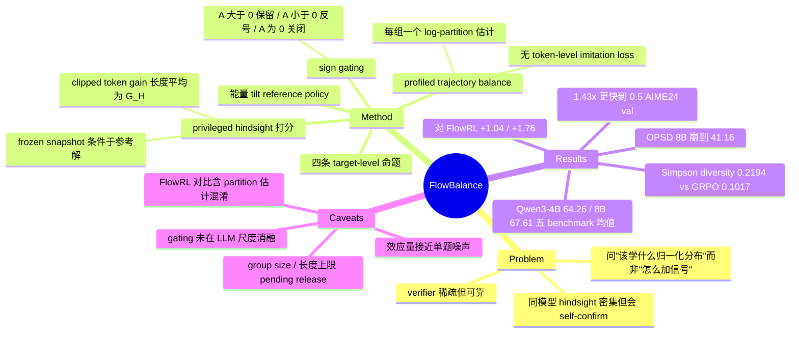

## Summary

FlowBalance 把 self-improvement 当作分布学习问题：用 verifier 的 group advantage 符号决定 privileged-hindsight 自评分的方向（advantage 为正保留、为负反号、为零关闭），把二者合成的 trajectory energy 对 reference policy 做指数 tilt，再用 rollout group 内 profile 出的 log-partition 做 trajectory balance 拟合，全程不引入独立的 token-level imitation loss。在 Qwen3-4B / Qwen3-8B 的数学推理上五 benchmark 平均为 64.26 / 67.61，比同属 trajectory-balance 家族但只用 outcome 的 FlowRL 高 1.04 / 1.76 点。

## Problem & Motivation

reasoning model 从自己的 on-policy 轨迹里改进，可用的监督只有两种，各有各的病。RLVR 的 terminal verifier 可靠但极稀疏——几百上千 token 只换回一个终局 reward；而让同一个模型开一个"看过参考解"的 privileged 视角去重新给自己采样出来的 token 打分，信号密集且几乎免费（不需要更大的外部 teacher，也不需要额外生成），但这个视角看到的是推理时拿不到的信息，它可能给一条最终被判错的"看起来很合理"的轨迹打高分，可能压缩推理长度、抑制不确定性驱动的探索，也可能把更新集中到一个局部模式上。作者把后者叫 self-confirmation：模型自己的错误偏好变成了下一次更新的监督。

论文的提问方式值得注意——它不问"怎么把 dense 信号加进 RL 目标"，而问"给定 on-policy 经验、稀疏但已验证的终局结果、以及密集但不可信的自我指导，下一个 policy 应该学一个什么样的归一化响应分布"。把更新对象从局部优化信号换成显式归一化的完整响应分布，是这篇工作与 GRPO / RLSD 一类方法在 problem formulation 上的真正分歧点。

## Method

**三个来源，一个能量。** 对 prompt $x$ 采一组 $N$ 条 on-policy response，verifier 按终局答案正误给 reward，算 group-relative advantage $A_\mathcal{G}(y)$（停梯度）。同一个 frozen snapshot 再以 training-only context $c$（参考解或任务反馈）为条件，对**已经采出来的** token 重新打分，得到 clipped token-level gain 并沿轨迹取平均：

$$G_H(y|x,c) = \frac{1}{T}\sum_t \mathrm{clip}\big(\log \pi_H(y_t|s_t,c) - \log \pi_\mathrm{ref}(y_t|s_t),\ -B,\ B\big)$$

hindsight 视角不重采任何 token，也不回传梯度。合成能量是：

$$E_\mathrm{FlowBalance}(y) = \eta_A A_\mathcal{G}(y) + \beta_G\, G_H(y)\,\mathrm{sgn}\big(A_\mathcal{G}(y)\big)$$

**sign gating 是全文的机制核心。** $A>0$ 时正向指导被保留（在已验证成功的轨迹内部做精细排序），$A<0$ 时同样的正向指导被**反号**（不让一个自信打分的失败变成自我强化的监督），$A=0$（组内全对或全错、advantage 归零）时 dense 分支整体关闭。作者的表述是"guidance refines the verifier's direction instead of overriding it"——verifier 垄断方向，dense 信号只负责同号内的相对强弱。

**目标分布与拟合。** 上述能量对 reference policy（初始 checkpoint 的固定副本）做指数 tilt，得到 $p^* \propto \pi_\mathrm{ref}\cdot\exp(E/\tau)$，再用 trajectory balance 残差拟合：

$$\Delta_\mathrm{TB}(y^{(i)}) = \tau\log\hat{Z}(x,c) + \tau\log\frac{\pi_\theta(y^{(i)}|x)}{\pi_\mathrm{ref}(y^{(i)}|x)} - E(y^{(i)}),\qquad \mathcal{L} = \frac{1}{2N}\sum_i \Delta_\mathrm{TB}^2$$

log-partition 不用辅助网络，而是从 rollout group 内 $N$ 条轨迹各自隐含的估计取平均 profile 出来（同样停梯度）。梯度只经过可训练 policy 的 log-prob。

**四条 target-level 命题。** Prop 1：profile 掉一个 group 级 partition 只吸收共同能量偏移，组内 $N-1$ 个概率对比方向全部保留；Prop 2：FlowBalance target 是在其达到的复合能量水平上、相对 reference 的唯一最小 reverse-KL 位移；Prop 3：固定 guidance 时增大 $\eta_A$ 单调提高 target 的期望 verifier reward；Prop 4：相对未 gate 的指导，sign gating 把"已验证成功 vs 被拒轨迹"的目标概率比精确乘上 $\exp(2\beta_G G_H(y_-)/\tau)$。作者明确说明这些都是关于 target 分布及其局部拟合目标的性质，不是任意神经网络优化器的全局收敛保证——这个边界划得很干净。

论文另外定义了 subtrajectory balance（在中间状态之间做同样的平衡，给长响应提供更密的拟合目标），但明确写明本文实验一律使用 complete-response 实现。

## Key Results

**主表（Table 1，两个 backbone，五 seed，step-180）。** AIME24 用 Pass@16，其余四个用 Pass@1；Avg. 是五个 benchmark 均值的无权平均。

| Backbone | Method | AIME24@16 | HMMT25@1 | Minerva@1 | MATH500@1 | Olympiad@1 | Avg. |
|:--|:--|:--|:--|:--|:--|:--|:--|
| Qwen3-4B | GRPO | 78.00±1.83 | 26.67±2.36 | 51.18±1.36 | 92.04±0.98 | 63.68±0.58 | 62.31 |
| | OPSD | 65.33±3.80 | 14.67±2.98 | 47.28±0.56 | 87.56±1.34 | 55.76±1.47 | 54.12 |
| | RLSD | 73.33±2.36 | 21.33±3.80 | 50.29±0.88 | 91.44±0.52 | 61.36±0.66 | 59.55 |
| | FlowRL | 75.33±1.83 | 30.67±4.94 | **51.99±1.51** | 92.84±0.62 | 65.25±0.49 | 63.22 |
| | FlowBalance | **80.00±0.00** | **32.00±2.98** | 50.51±0.56 | **93.28±0.59** | **65.49±0.92** | **64.26** |
| Qwen3-8B | GRPO | 85.33±1.83 | 31.33±7.67 | 52.87±1.02 | 93.16±0.83 | 64.78±0.62 | 65.49 |
| | OPSD | 48.67±3.80 | 4.00±3.65 | 38.46±3.85 | 74.56±4.81 | 40.09±3.57 | 41.16 |
| | RLSD | 82.67±3.65 | 28.00±1.83 | 52.94±1.38 | 93.44±0.17 | 63.56±1.19 | 64.12 |
| | FlowRL | 86.67±0.00 | 30.67±4.35 | 52.79±1.37 | 92.92±0.50 | 66.20±1.05 | 65.85 |
| | FlowBalance | **89.33±1.49** | **34.67±9.89** | **53.68±0.78** | **93.52±0.30** | **66.85±0.46** | **67.61** |

四个 baseline 里只有 FlowRL 与 FlowBalance 同属 trajectory-balance 家族。8B 上 FlowBalance 每个 benchmark 的均值都最好；4B 上 Minerva 输给 FlowRL（50.51 vs 51.99），也低于 GRPO 的 51.18。论文正文常引用的是剔掉 Minerva 的"core four-benchmark average"（4B 上 +1.67 / 8B 上 +1.98 over FlowRL），五 benchmark 全量口径则是 +1.04 / +1.76——两个口径都披露了，但摘要与 intro 主推前者。

**OPSD 崩塌得极其彻底。** 8B 上 OPSD 五 benchmark 平均只有 41.16，比 GRPO 低 24.33 点，HMMT25 掉到 4.00。作者引 Kim et al. 2026b 解释为"模仿 solution-conditioned privileged teacher 会压制 epistemic verbalization 并缩短推理"，并说与 Figure 2(c) 的响应长度崩塌一致。

**训练动态（Figure 2，Qwen3-8B）。** FlowBalance 约 100 步达到 0.5 的 AIME24 validation accuracy，GRPO 约 143 步（1.43×）；400 步内 FlowBalance 保持在峰值附近，GRPO 在约 step 180 后急剧退化；响应长度上 direct OPSD 迅速塌到短回答而 FlowBalance 维持长轨迹。注意主表恰好取在 step 180——正好是 GRPO 尚未退化的位置，对 GRPO 而言是宽松取点，但也意味着 FlowBalance 宣称的长程稳定性优势并没有体现在主表任何数字里。

**系数消融（Table 2/3 与附录 Table 6/7，均为 Qwen3-8B、step 180、五 seed）。** $\eta_A \in \{5,10,15\}$ → 65.65 / 65.41 / 67.61；$\beta_G \in \{1,2,3\}$ → 67.61 / 66.48 / 65.95。前者非单调（5→10 反而降 0.24），后者单调下降。作者把后者读作"更强的指导会掉点，说明校准是必要的"。

**语义策略多样性（Figure 3 + 附录 D.3）。** 用 GPT-5.5 judge 做两阶段（先逐条抽取策略摘要，再匿名打乱聚类，correctness label 在聚类之后才施加），在 AIME24 上取 correct-only Simpson diversity：FlowBalance 0.2194、RLSD 0.1456、GRPO 0.1017。协议是 seed 0 单种子、step-180 checkpoint、30 题 × 3 方法 × 16 采样 = 1440 条完整轨迹。FlowRL 与 OPSD 未参与这项对比。Table 4 的 case study 展示 AIME24 Problem 23 上 GRPO 走通用 Cayley–Menger 行列式路线，FlowBalance 则识别出 $41=4^2+5^2$、$80=4^2+8^2$、$89=5^2+8^2$，把四面体嵌进 4×5×8 长方体、用标量三重积算体积。

**合成诊断（附录 C）。** 四模态精确枚举里，reward-only shaping 的成功质量 0.818、ungated self-guidance 0.832、FlowBalance 0.900（robust-success 模式 0.440）。C.1.3 的 reliability–strength 扫描明确划出边界：低于某个可靠性阈值时更强的 guidance 反而降低 verified success，"sign gating 纠正失败上的假阳性，但不能为任意强度、在成功轨迹上系统性出错的 guidance 背书"。

**复现性缺口。** 附录 D.1 的 Table 5 把 rollout group size 与 maximum response length 都标为 "matched across methods; pending release"，训练 prompt 数据集全文未点名。代码仓库存在（Python，仓库描述写的是 "Codebase for FlowSD"）。

## Evidence Ledger

| Claim ID | Claim | Type | Source locator | Evidence excerpt | Status |
|:--|:--|:--|:--|:--|:--|
| C1 | Qwen3-8B 五 benchmark Avg：FlowBalance 67.61 / GRPO 65.49 / OPSD 41.16 / RLSD 64.12 / FlowRL 65.85 | number | Table 1（§5.2）Qwen3-8B 块 | "FlowBalance \| 89.33±1.49 \| 34.67±9.89 \| 53.68±0.78 \| 93.52±0.30 \| 66.85±0.46 \| 67.61" | source-verified |
| C2 | Qwen3-4B：FlowBalance 64.26、FlowRL 63.22；Minerva 上 FlowRL 51.99 高于 FlowBalance 50.51 | comparison | Table 1（§5.2）Qwen3-4B 块；§5.2 正文 | "FlowRL obtains the highest Minerva mean on this backbone" | source-verified |
| C3 | AIME24 用 Pass@16（16 采样中任一命中即计正确），其余四项 Pass@1；主表全部为 step-180、五 seed 的 mean±std | benchmark-setting | §5.2；App. D.1 "Evaluation protocol" | "each problem is decoded with 16 samples and is counted correct if any sample matches the final answer" | source-verified |
| C4 | 8B 上 FlowBalance 约 100 步达 0.5 AIME24 val acc（GRPO 约 143 步，1.43×）；400 步内稳定，GRPO 约 step 180 后退化 | number | Fig. 2 caption；§5.2 "Training Dynamics" | "reaches 0.5 AIME24 validation accuracy in about 100 steps, compared with roughly 143 for GRPO, a 1.43× reduction" | source-verified |
| C5 | $\eta_A\in\{5,10,15\}$→65.65/65.41/67.61（非单调）；$\beta_G\in\{1,2,3\}$→67.61/66.48/65.95；无 $\beta_G=0$ | number | Tables 2–3（§5.2）；Tables 6–7（App. D.2） | "Avg. \| 65.65 \| 65.41 \| 67.61" … "Avg. \| 67.61 \| 66.48 \| 65.95" | source-verified |
| C6 | Simpson diversity 0.2194 / 0.1017 / 0.1456（FlowBalance/GRPO/RLSD），seed 0、step-180、1440 轨迹、GPT-5.5 judge，未含 FlowRL 与 OPSD | benchmark-setting | §5.3（Fig. 3）；App. D.3 | "step-180 checkpoints of GRPO, RLSD, and FlowBalance. We use seed 0 only, decode 16 complete responses for each of the 30 problems" | source-verified |
| C7 | Table 5 把 rollout group size 与 max response length 标为 "pending release"；训练数据集全文未命名 | benchmark-setting | Table 5（App. D.1）；全文检索 | "Rollout group size \| matched across methods; pending release" | source-verified |
| C8 | 能量 $E=\eta_A A + \beta_G G_H \mathrm{sgn}(A)$；guidance 在 $A>0$ 保留、$A<0$ 反号、$A=0$ 关闭 | causal-mechanism | Eq. (11), §3.2（§5.2 复述为 Eq. 29） | "If A(y)<0, positive guidance is reversed… If A(y)=0, the dense branch is disabled." | source-verified |
| C9 | Prop 4：相对 ungated guidance，sign gating 把成功/被拒轨迹的目标概率比乘 $\exp(2\beta_G G_H(y_-)/\tau)$ | causal-mechanism | Prop. 4 / Eq. (28), §4.2；证明 App. B.2 | "sign gating changes their target probability ratio" ×"\exp(2\beta_G G_H(y_-\|x,c)/\tau)" | source-verified |
| C10 | 8B HMMT25：FlowBalance 34.67±9.89 vs GRPO 31.33±7.67，标准差大且区间重叠 | number | Table 1（§5.2）HMMT25@1 列 | "34.67\pm 9.89" … "31.33\pm 7.67" | source-verified |
| C11 | 代码 github.com/alexhuang13/FlowBalance、blog alexhuang13.github.io/FlowBalance-Blog/，CC BY 4.0 | license-code | 标题页 project links；HTML license 行 | "GitHub: github.com/alexhuang13/FlowBalance" / "License: CC BY 4.0" | source-verified |
| C12 | 四作者；Tencent HY LLM Frontier + University of Pennsylvania；v1 2026-09-03；cs.LG；28 页 7 图 10 表 | number | arXiv abs 页 metadata；HTML 标题块 | "[Submitted on 3 Sep 2026]"；"28 pages, 7 figures, 10 tables. Code and blog available" | source-verified |
| C13 | policy 只经 trajectory-balance 分布匹配目标更新，无独立 token-level imitation loss；hindsight 分数为停梯度特征 | causal-mechanism | §2.2, §3.1, §3.3, §6, Conclusion | "No token is resampled from π_H, and no gradient is propagated through π_H or G_H" | source-verified |
| C14 | 附录 C.1.1 四模态诊断：FlowBalance 成功质量 0.900、robust-success 0.440，ungated 0.832、reward-only 0.818 | number | App. C.1.1 | "reaching success mass 0.900 and robust-success mass 0.440" | source-verified |
| C15 | FlowRL 用 prompt-conditioned/学习式 partition 项，FlowBalance 用 rollout-group profile，故二者差异不止能量项 | comparison | §6 "Distribution matching and trajectory balance"；§3.4；App. D.1 | "FlowRL instantiate trajectory balance with a prompt-conditioned partition term… GFlowRL replaces the auxiliary partition network with an in-batch rollout-group estimate" | source-verified |
| C16 | Limitations 自陈四点：仅数学推理、长度非因果、多样性单种子单 checkpoint、非完整 self-evolving 系统 | causal-mechanism | §7 "Limitations and scope" | "does not establish that longer responses cause higher accuracy… at one checkpoint and seed… not by itself a full self-evolving system" | source-verified |

## Strengths & Weaknesses

**值得学的是 problem formulation，不是数字。** 这篇工作真正干净的地方在于它把"信任什么"拆成了两层：verifier 的方向是唯一被完全信任的东西，dense self-guidance 只被允许在同号内部做相对排序。这条原则简单、不依赖任何特定 scorer、也不依赖任何特定 verifier，可以直接搬到任何"有可靠终局判据 + 有廉价密集但可疑信号"的场景（agentic rollout、GUI 轨迹、code execution）。作者对理论边界的自我约束也做得比大多数同类工作干净——四条命题全部明确标注为 target 分布层面的性质，不冒充优化器收敛保证；附录 C.1.3 甚至主动画出"gating 也救不了的 guidance 可靠性下界"。

**但主结果的效应量撑不起论文的语气。** 五 benchmark 平均对最强 baseline FlowRL 只赢 1.04（4B）和 1.76（8B）点，而单项标准差普遍落在 0.5–10 之间，全文未报告任何显著性检验。最刺眼的是 8B HMMT25：FlowBalance 34.67±9.89、FlowRL 30.67±4.35、GRPO 31.33±7.67，三者区间几乎完全重叠；HMMT25 与 AIME24 都只有 30 题，单个 seed 上一题就是 3.33 点，也就是说 8B HMMT25 对 FlowRL 的"+4.00"约等于 1.2 题，4B AIME24 对 GRPO 的"+2.00"约等于 0.6 题。论文强调"最大增益出现在 AIME24 Pass@16"并解释为"把质量分配到多条正确轨迹尤其有用"，这个解释是自洽的，但 Pass@16 是"16 采样中任一命中"的 oracle 口径——任何提高正确解多样性的方法都会在这个指标上机械受益，用它来论证方法优越性等于用结论去验证结论。

**核心机制在 LLM 尺度上从未被消融。** sign gating 是全文的卖点，但两个消融只扫了 $\eta_A$ 和 $\beta_G$ 的**强度**，$\beta_G$ 的取值从 1 起步，没有 $\beta_G=0$，也没有"guidance 在但 gate 关掉"的对照。也就是说 gating 有效的直接证据全部来自附录 C 的精确合成诊断，LLM 实验只能间接地靠 FlowRL 对比来支撑。而 $\beta_G\in\{1,2,3\}$ 单调下降（67.61→66.48→65.95）其实有一个同样自洽但没被讨论的读法：dense guidance 项在 $\beta_G=1$ 已经处在有用性边界上，再往上就是净损害——论文把它读作"证明校准必要"，但它同样可以读作"这一项的可用窗口很窄"。

**FlowRL 对比不是干净的单变量。** 论文说"与 FlowRL 的比较隔离出了 self-guidance 在同一 trajectory-distribution 家族内的价值"，但按 §6 自己的描述，FlowRL 用的是 prompt-conditioned 的学习式 partition 项（GFlowRL 才是把辅助 partition 网络换成 in-batch group 估计的那篇），而 FlowBalance 用 rollout-group profile。两者至少差了**能量项**和 **partition 估计方式**两个变量。真正干净的对照应该是"FlowBalance 去掉 guidance 项"（即 $\beta_G=0$ 但保留 profiled partition），而这一格恰好没跑。

**"dense" 信号被消费成了一个标量。** 这是我认为最值得追问的地方。论文反复强调 privileged hindsight 提供 "dense within-trajectory evidence"，但 $G_H$ 是整条轨迹上 clipped token gain 的**长度平均**——最终进入能量的只是每条轨迹一个数。所谓 dense 信号在这里的作用其实是组内重排序，而不是 within-trajectory 的 credit assignment；token 级的定位信息在取平均那一步就被丢干净了。论文自己定义了 subtrajectory balance 作为更密的拟合目标，却明确说本文实验一律用 complete-response 实现——那个真正能兑现"dense"承诺的版本被留在了纸上。这一点与 vault 里 [[2608-OPSA]] 的发现直接冲突：OPSA 量化出 on-policy distillation 的增益高度集中在**低 log-prob token** 上，而长度平均恰好会把这种集中度洗掉。如果 OPSA 的机制诊断成立，FlowBalance 的 $G_H$ 很可能并没有捕捉到 hindsight 信号里最有信息量的那部分。

**复现门槛。** rollout group size 与 max response length 在附录里被直接标成 "pending release"，训练 prompt 集全文没有名字。对一篇核心主张是"在完全 matched 的设置下比较 policy-update 目标"的论文，把决定可比性的两个字段留白是自相矛盾的——matched 是论文自己的公平性论证前提，读者却无法核对匹配到了哪个值。代码仓库已公开（描述里还留着旧名 "FlowSD"），这些字段大概率能从配置文件里恢复。

**与 vault 内工作的关系。** gating 的谱系值得对照着看：[[2608-GatedHindsight]] 的 gate 是二值的"施加 / 不施加"（只在 student 失败且 hindsight teacher 能恢复正确动作时蒸馏）；[[2605-AntiSD]] 走到另一个极端，基于 PMI 分析把 self-distillation 的梯度方向**整体**反转；FlowBalance 处在中间——三值 gate（保留 / 反号 / 关闭），且触发条件是 verifier 而非启发式。三者共享同一个底层判断：same-model privileged teacher 的信号不能整体照单全收，区别只在于用什么当闸门、闸门有几档。另一条线是 [[2506-GFlowVLM]] 代表的 GFlowNet / trajectory balance 用于多步推理的谱系。

## Mind Map

## Notes

- **可以直接借用的设计原则**：verifier 只贡献方向、dense scorer 只贡献同号内排序。这条规则与具体 scorer 无关，迁到 GUI / agentic 轨迹上的前提只有一个——存在一个可靠的 terminal verifier。GUI 场景恰好常常没有（任务成功判据本身就是难题），所以迁移的真正瓶颈不在方法而在 verifier 质量，这一点论文没有讨论。
- **$A=0$ 关闭分支是个被低估的设计**：组内全对或全错时 group-relative advantage 归零，FlowBalance 直接放弃这一组的 dense 信号。但这恰恰是 RLVR 最缺信号的情形（全错组尤其常见于难题），也正是 dense 指导本该最有价值的地方。论文把"不知道方向就不用"当作安全性，代价是在最需要密集信号的样本上退化成 no-op。这是一个明确的 open problem。
- **待验证**：$\pi_\mathrm{ref}$ 是初始 checkpoint 的固定副本、全程不更新。400 步训练后，target 仍然是围绕初始分布做 $\exp(E/\tau)$ tilt，能达到的分布位移被 reference 支撑集硬性限制。论文用 Prop 2 把"位移小"论证成优点（minimum reverse-KL displacement），但没讨论长训练下这是否会变成能力天花板。
- **repo 可能补齐的字段**：rollout group size、max response length、训练 prompt 数据集、$\tau$ 与 clip bound $B$ 的取值。仓库为 Python，pushed 于论文投稿次日。
