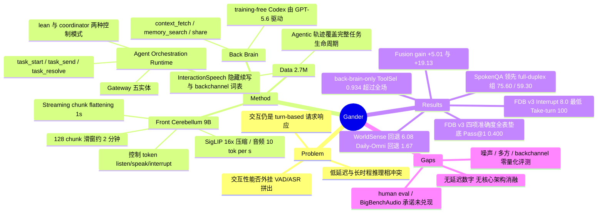

## Summary

Gander 用 Cerebellum-Brain 双层架构把 full-duplex omni 交互与 agentic 任务执行接到一起：9B 的 front cerebellum 以 1 秒 chunk 把音视频输入和自身输出压平成单条因果 token 流，每个 chunk 先预测 listen/speak/interrupt 控制 token 再决定说什么，并通过 task_start/task_send/task_resolve 把长时程任务委派给 training-free 的 Codex back brain。在 Full-Duplex-Bench v3 上它拿到全表最低的 8.0% 过早插话率与 100% take-turn 率，但 ToolSel/ArgAcc/RespQual/Pass@1 四项任务准确度在表内正文七行中全部垫底（Pass@1 0.400）。abstract 宣称的 internal human evaluation 与噪声干扰、多方对话、backchannel 鲁棒性，在正文中没有任何量化结果。

## Problem & Motivation

人机交互至今仍被约束在 text-based、turn-by-turn 的请求-响应循环里：用户说完一整句，模型才开始处理。真实的人际交流不是这样——参与者同时听和说、边看边讲、随时插入或改道。作者把这个落差拆成两个可以被证伪的问题，而不是笼统地说"要更自然"。

第一个问题是交互性的归属：真正的实时交互能否由 VAD、ASR 这类外挂模块拼装出来，还是必须是模型的内生能力？作者的立场是后者——spontaneous interruption、proactive engagement、噪声环境下的稳定应答、多方对话、backchannel 这些行为，靠一个独立设计的 endpointer 难以可靠覆盖，因为它只能从声学静默判断边界，拿不到语义是否已经完整。

第二个问题是能力的耦合：单个模型能否同时提供实时对话所需的低延迟响应和复杂 workflow 所需的长时程推理？作者认为这两者的计算与推理需求是冲突的，硬塞进一个 monolithic 模型会在"反应快"和"想得深"之间产生结构性 trade-off。

Gander 的回答是把这两个问题分开处理：交互性下沉为模型内生（chunk 级控制 token），智能上移为可替换的外部组件（training-free back brain）。

## Method

### 三部件系统

**Front cerebellum**：实时 full-duplex omni 模型，Thinker-Talker 架构，从 MiniCPM-o 4.5 初始化，9B。负责连续多模态感知、对话应答、以及把任务路由给后端。

**Agent orchestration runtime**：协调层。管理音视频流摄入、增量推理调度、static prefix caching、source-aware rate limiting，同时编排异步后台任务。核心组件 gateway 围绕五个持久实体组织执行——Project / Task / Run / WorkerEvent / Delivery，管状态迁移、worker 调度、workspace 隔离、并发控制、权限与结果投递。runtime 有 lean 与 coordinator 两种控制模式：lean 直接执行前端分类出的任务动作，路径短、确定性高；coordinator 插入一个独立控制平面模型，生成推理强度、提问策略、权限策略、投递策略的声明式指令，代价是额外调用、延迟与不确定性。当前实现里 coordinator 只参与 task_start。

**Back brain**：training-free、plug-and-play 的通用任务执行 agent，默认由 Codex app server 实例化，评测中由 GPT-5.6 驱动。除原生文件/命令行/检索工具外，额外暴露 context_fetch（取实时任务上下文与 artifact）、memory_search（跨 session 多模态记忆）、share（把已验证的中间结论回传前端）三个 runtime 接口。

### Cerebellum-Brain 协议

前端通过专用 special token 发出结构化 tool call，接口只有三个操作：

- `task_start` — 新建后台任务，任务描述即后续生命周期管理的标识符
- `task_send` — 把后续用户输入路由到已有任务，支持 main（并入主执行上下文，改变任务轨迹）与 fork（只读旁路查询，不改主任务状态）两种模式
- `task_resolve` — 生命周期控制，四个动作 cancel / allow_once / allow_session / deny

一个容易被忽略但重要的设计：runtime 把这三个操作绑定到**传输层确认的最终 user turn**，而不是前端自己生成的 tool 参数，以保证任务目标始终锚在经过认证的用户输入上。

前端传给后端的是音频 query 的转写文本加视频输入的相关末帧——作者明确说这是"最直接的做法"，并把"前端是否该先推理再传"、"可训练的后端能否直接吃完整多模态流"列为未解决的设计问题。后端结果回来后仍由前端总结并以口语形态输出。

### Streaming Chunk Flattening

这是 front cerebellum 的核心机制。把连续交互切成固定 1 秒窗口，每个窗口装配成一个 chunk，chunk 是三段时间对齐内容的展平拼接：该窗口内编码得到的音频与视觉 token、一个预测出的控制 token、以及模型选择输出的 N 个文本 token（N 由模型决定，可为 0）。连续 chunk 串成单一序列喂给标准 causal backbone。

在这个表述下，user request 不再是一个特权对话角色；输入语音和视觉被当作连续观测的世界状态，模型处在一个 always-on 环境里，每个 chunk 都要决定不只是"产生什么"，还有"要不要产生、何时产生"。proactive 行为因此从同一个机制里自然长出来，不需要外部 VAD 触发。

控制 token 取三值之一：listen（本窗口保持沉默继续观察，输出段无文本）、speak（承诺在本窗口生成内容）、interrupt（当上下文变化使进行中的回复过时时，中止当前话语）。关键设计是**控制决策先于任何内容生成**，把"要不要说"与"说什么"解耦。作者称这比把两者纠缠在单一预测步里更稳定，但这一点只有一句定性表述。

上下文用固定 128 chunk 预算管理，约两分钟的滚动时间感受野；满了之后最老的 chunk 被逐出，保证任意长 session 的单步推理成本稳定。

### Omni 感知与语音生成

视觉：any-resolution 分片，每片用 SigLIP ViT 独立编码，再由 query-based resampler 压成少量固定视觉 token，相对原始 patch grid 约 16× 缩减（作者称明显激进于多数 omni 模型的 4×），分辨率上限 448×448。

音频：streaming chunk-wise 语音编码器输出约 50 fps 帧级特征，经轻量 MLP projector 做 5× 时间下采样，降到约 10 token/s 再进 backbone。

语音生成两段式：backbone 末层 hidden state 投影后与文本 token 一起注入一个小的自回归 speech token decoder，产出 CosyVoice 式单码本低比特率离散语音单元；再由 streaming flow matching decoder 以 chunk-wise causal 方式渲染波形，条件于 multimodal system prompt 里的参考音频，因而自带 zero-shot 音色控制。Backbone 始终停留在文本域，避免让语言主干自回归高帧率声学单元而侵蚀语言能力。

### 数据

总计 2.7M 样本，四个族：

| 数据族 | 规模 / 占比 | 内容 |
|:--|:--|:--|
| Speech Interaction | ≈37% | Foundational dialogue 539.4K / 20.00%；Basic capabilities 26.9K / 1.00%；InteractionSpeech 260.8K / 9.67%；Spoken QA 165.1K / 6.12%；同传 19.0K / 0.70% |
| Audio-Visual Interaction | 1.1M / 40.66% | streaming video QA、event grounding、narration、proactive visual response |
| Agentic Interaction | 359.6K / 13.33% | audio agentic 320.2K / 11.87%；omni agentic 36.0K / 1.33%；tool-assisted reasoning 3.4K / 0.13% |
| Robustness & Negative | 229.7K / 8.52% | irrelevant video 116.2K；no-command 40.0K；anti-interference 64.7K；multi-party 8.8K |

其中 InteractionSpeech 的构造值得注意：full-duplex 行为是被显式合成的，不是从 turn-based 语料里继承的（后者按构造就没有打断和重叠）。竞争性打断里助手的剩余话语被保留为**隐藏续写**，与用户来话时间重叠但不合成为音频，使模型只观测到真实听者能拿到的声学证据；随后的用户回合还要被验证没有复用它听不到的信息。backchannel 与真正的抢麦用规则强制区分——必须嵌在对方话语内部、中文低于 8 字/英文低于 6 词、且命中词表或生成时显式标记；带疑问、请求、否定立场线索的候选被降级为普通回合。backchannel 实现从 266 个中文、170 个英文表达构成的双语词表采样，分 11 个意图类别。每个回合被赋予全局 onset、时长与重叠区间，使打断和 backchannel 的时序成为显式监督而非拼接的副产物。

Agentic 数据由 seed 驱动合成：结构化任务 seed 分层采样（task class / domain / category / task family）加上多样的 query 与交互模式，用 DeepSeek-V4-Pro 合成用户、前端、后端三方的交互轨迹，覆盖任务发起、追加请求、约束更新、澄清、进度询问、取消、结果投递的完整生命周期。Omni-agentic 的 36K 来自爬取轨迹、已有 GUI 数据集（OpenCUA）与 Codex 生成的 GUI 轨迹，先由 Qwen3.5-297B-A17B 转成环境状态与任务进度的结构化描述，再合成对话。

## Key Results

### Full-Duplex-Bench v3（100 scenarios，工具增强的口语服务场景）

| Model | ToolSel↑ | ArgAcc↑ | RespQual↑ | Pass@1↑ | Take-turn↑ | Interrupt↓ | Filler↓ |
|:--|:--|:--|:--|:--|:--|:--|:--|
| GPT-Realtime | 0.876 | 0.680 | 0.792 | 0.600 | 96.0 | 13.5 | 16.9 |
| Gemini Live 3.1 | 0.817 | 0.588 | 0.718 | 0.540 | 78.0 | 19.2 | 31.7 |
| Cascaded（Whisper→GPT-4o→TTS） | 0.803 | 0.562 | 0.600 | 0.450 | 100.0 | 33.0 | 26.9 |
| Grok | 0.797 | 0.542 | 0.617 | 0.430 | 94.0 | 25.5 | 44.3 |
| Ultravox v0.7 | 0.794 | 0.513 | 0.510 | 0.410 | 96.0 | 47.9 | 88.0 |
| Gemini Live 2.5 | 0.786 | 0.593 | 0.554 | 0.490 | 92.0 | 14.1 | 8.9 |
| **Gander** | 0.759 | 0.503 | 0.490 | 0.400 | **100.0** | **8.0** | 51.6 |
| Gander, back brain only† | 0.934 | 0.590 | 0.740 | 0.520 | — | — | — |

† 文本驱动，绕过前端与音频通道，作者标注其可比对象是 cascaded 而非 full-duplex 各行。

时序两项是 Gander 唯一领先的地方：100 个场景全部在合适时机接过话头，过早开口只占 8.0%，对比 GPT-Realtime 13.5%、最差的 Ultravox 47.9%。这两个指标必须合读才有意义——系统可以靠一直等来压低插话率，代价是根本轮不到自己说。表里两种失效都出现了：Gemini Live 3.1 插话率 19.2% 但只在 78.0% 场景应答；cascaded pipeline 用 33.0% 的插话率换来满分 take-turn，这正是外部 endpointer 只凭声学静默就提交话语边界的特征。Gander 两头都没让，这是"控制决策先于内容生成"这一设计目前最直接的经验支持。

四项任务准确度则全表垫底，且与最弱 baseline 的差距很窄（Pass@1 0.400 vs Ultravox 0.410，最强 0.600）。Filler 51.6% 是第二差（仅好于 Ultravox 88.0%，最优是 Gemini Live 2.5 的 8.9%）；作者解释 Filler 度量的是"接过话头到给出答案"之间的间隔，对一个无法在委派任务运行期间沉默的系统而言，占住话头是合理行为，该数字反映的是委派频率。注意 Filler 只在 100 个场景中的 91 个上定义。

准确度缺口的诊断来自最后一行：同一个 agent、同一套工具，在绕过前端与语音通道后 ToolSel 0.934 超过表中所有系统（含 GPT-Realtime 0.876），Pass@1 0.520、RespQual 0.740。执行层不是瓶颈。端到端与该行的两个差异——前端要自己决定何时委派、以及评分读的是合成语音的 ASR 转写而非文本——作者承认这两次运行**没有分离**（原文："These runs do not separate the two"）。

### SpokenQA + VoiceBench（2,052 utterances）

| Model | Size | Llama Q. | Web Q. | AlpacaEval | SD-QA |
|:--|:--|:--|:--|:--|:--|
| *Turn-based* ||||||
| Baichuan-Omni-1.5 | 7B | 78.50 | 59.10 | 4.50 | 43.40 |
| Qwen2.5-Omni | 7B | 75.33 | 62.80 | 4.49 | 55.71 |
| Freeze-Omni | 7B | 72.00 | 44.73 | 4.14 | 50.16 |
| Qwen2-Audio | 7B | 69.67 | 45.20 | 3.74 | 35.71 |
| Qwen2.5-Omni | 3B | 66.00 | 27.95 | 4.32 | 49.37 |
| Phi-4-multimodal | 5.6B | 60.20 | 26.60 | 3.81 | 39.78 |
| *Full-duplex streaming* ||||||
| Audio-Interaction | 3B | 67.31 | 54.34 | **4.28** | **52.14** |
| Moshi | 7B | 62.20 | 26.30 | 2.01 | 15.01 |
| **Gander** | 9B | **75.60** | **59.30** | 3.96 | 46.84 |

Gander 在 full-duplex 组的两个知识型 SpokenQA 子集上领先（较 Audio-Interaction +8.29 / +4.96），两个 VoiceBench 子集上组内第二（AlpacaEval 落后 0.32，SD-QA 落后 5.30）。放到全场九个系统看，SpokenQA 两项都排第二（Llama Q. 落后 Baichuan-Omni-1.5 2.90，Web Q. 落后 Qwen2.5-Omni-7B 3.50），AlpacaEval 第六、SD-QA 第五。作者的解读是：流式约束本身没有吃掉语言主干里的知识；两个偏弱的列分别是开放式生成质量与带口音语音，对应交互监督里没有的长篇表述训练和口音覆盖。

一个值得记下的观测：整个评测中 back brain 始终可用，但在 2,052 个样本上一次都没被调用。作者称这是路由策略的预期行为——只对长时程工具任务升级，不对自足的问答升级。

### Omni Understanding（WorldSense n=3,172 + Daily-Omni n=1,197）

| Model | WorldSense | Daily-Omni |
|:--|:--|:--|
| MiniCPM-o 4.5（Gander 基座） | 55.70 | 80.20 |
| Qwen3-Omni | 54.00 | 70.70 |
| Gemini 2.5 Flash | 52.60 | 79.30 |
| Gander | 49.62 | 78.53 |

相对基座 WorldSense 回退 6.08、Daily-Omni 回退 1.67。作者不回避这个回退，并给出两个边界条件：vision tower 冻结且 bit-for-bit 未变（因而回退不能归因于视觉编码退化），以及交互语料中的视频素材大量是"无关上下文干扰项"，教的是忽略不相关视觉事件。两个 benchmark 的不对称被读作"交互训练保住了它所锻炼的能力"——Daily-Omni 考的是跨模态时序对齐推理，WorldSense 考的是计数、定位这类细粒度感知属性。

模态消融（同题集，三种输入条件，共 13,107 次推理）：

| Benchmark | AV | Video | Audio | Fusion gain |
|:--|:--|:--|:--|:--|
| WorldSense | 49.62 | 44.61 | 43.32 | +5.01 |
| Daily-Omni | 78.53 | 59.40 | 57.81 | +19.13 |
| Overall | 57.54 | 48.66 | 47.29 | +8.88 |

两个 benchmark 上单模态成绩彼此都很接近（WorldSense 内差 1.3 点、Daily-Omni 内差 1.6 点），说明联合条件不是在跟随某个占优模态；且 fusion gain 的大小与 benchmark 对跨模态对齐的依赖程度一致。

## Evidence Ledger

| Claim ID | Claim | Type | Source locator | Evidence excerpt | Status |
|:--|:--|:--|:--|:--|:--|
| C1 | FDB v3 上 Gander Interrupt 8.0%，全表最低；GPT-Realtime 13.5%，最差 baseline 47.9% | number | Sec 5.2, Table 3 | "against 13.5% for GPT-Realtime and 47.9% for the weakest baseline" | source-verified |
| C2 | Take-turn 100.0%，仅 cascaded pipeline 与之持平 | number | Sec 5.2, Table 3 | "takes the floor at an appropriate moment in all 100 scenarios, matched only by the cascaded pipeline" | source-verified |
| C3 | 四项任务准确度（0.759 / 0.503 / 0.490 / 0.400）在 Table 3 正文七行中全部最低 | comparison | Sec 5.2, Table 3 | "On the four task-accuracy metrics it trails, though by a narrow margin at the lower end" | source-verified |
| C4 | Filler 51.6% 为表中第二差，最差 Ultravox 88.0%，最优 Gemini Live 2.5 8.9% | number | Sec 5.2, Table 3 | "Its 51.6% filler rate is the one interaction metric on which it does not lead" | source-verified |
| C5 | back-brain-only 条件 ToolSel 0.934 超过表中所有系统，Pass@1 0.520 vs 端到端 0.400 | number | Sec 5.2, Table 3 | "its ToolSel of 0.934 exceeds every other system in the table, GPT-Realtime's 0.876 included" | source-verified |
| C6 | Filler 只在 100 个场景中的 91 个上定义 | benchmark-setting | Sec 5.1 | "defined over the 91 of 100 scenarios that take the turn without interrupting" | source-verified |
| C7 | FDB v3 的 baseline 数字取自 benchmark release，非作者复跑；评分脚本未改动，用 GPT-4o judge | benchmark-setting | Sec 5.1 / Table 3 caption | "baseline numbers are from the benchmark release"; "released scoring scripts unmodified, with the GPT-4o judge" | source-verified |
| C8 | 作者为自己一侧补了 contract file，把 benchmark system prompt 的要求传给外部 back brain | benchmark-setting | Sec 5.1 | "we therefore place a contract file carrying the same requirement in its working directory" | source-verified |
| C9 | Gander 9B 在 SpokenQA/VoiceBench 上 75.60 / 59.30 / 3.96 / 46.84；组内 SpokenQA 领先、VoiceBench 第二 | number | Sec 5.3, Table 4 | "Gander 9B 75.60 59.30 3.96 46.84"; "places second in the group on the two VoiceBench subsets" | source-verified |
| C10 | SpokenQA/VoiceBench 的 baseline 数字取自 Audio-Interaction 论文，非作者复跑 | benchmark-setting | Table 4 caption | "Baseline numbers are taken from Audio-Interaction (Xie et al., 2026b)" | source-verified |
| C11 | WorldSense 49.62 / Daily-Omni 78.53，较基座 MiniCPM-o 4.5 分别回退 6.08 与 1.67 | number | Sec 5.4, Table 5 | "MiniCPM-o 4.5 55.70 80.20 Gander 49.62 78.53" | source-verified |
| C12 | 模态消融 fusion gain：WorldSense +5.01，Daily-Omni +19.13 | number | Sec 5.4, Table 6 | "WorldSense 49.62 44.61 43.32 +5.01 Daily-Omni 78.53 59.40 57.81 +19.13" | source-verified |
| C13 | vision tower 全程冻结且 bit-for-bit 未变，故 WorldSense 回退不能归因于视觉编码退化 | causal-mechanism | Sec 5.4 | "vision tower is bit-for-bit unchanged, frozen throughout training" | source-verified |
| C14 | 噪声干扰、多方对话、backchannel 三项在全文无任何量化评测结果，只出现在训练数据表与散文叙述中 | coverage | Sec 4.4 / Table 2 / Sec 5 全节 | "Anti interference 64.7K 2.40% ... Multi party interaction 8.8K 0.33%"（仅数据表） | source-verified |
| C15 | abstract 宣称 internal human evaluation 得出结论，但正文无任何 human eval 协议、评分者数或分数 | coverage | Abstract vs Sec 5 | "Internal human evaluations demonstrate that Gander maintains the natural and expressive spoken dialogue capabilities" | source-verified |
| C16 | Intro 称会 report BigBenchAudio，但实验节无任何 BigBenchAudio 结果 | coverage | Sec 1 vs Sec 5 | "by reporting results on established benchmarks such as BigBenchAudio" | source-verified |
| C17 | 全文无任何量化延迟测量（无 ms 级 time-to-first-token 或 barge-in 响应延迟） | coverage | Sec 3.3.3 / Sec 5 | "keeps the end-to-end latency of speech output low"（仅定性） | source-verified |
| C18 | 无针对 chunk flattening 与控制 token 前置预测的消融；唯一标注为 ablation 的是模态消融，另有 Table 3 的 back-brain-only 行作为双层拆分的组件移除对照 | coverage | Table 6 / Table 3 末行 | "To separate the two tiers we additionally report a back-brain-only condition that bypasses the front cerebellum" | source-verified（原始 claim 称"无任何架构消融"被判 unsupported，已按此收窄） |
| C19 | back brain 由 Codex worker provider training-free 实例化、GPT-5.6 驱动；SpokenQA/VoiceBench 的 2,052 个样本上一次未被调用 | setting | Sec 5.1 / 5.3 | "driven by GPT-5.6"; "never invoked on any of the 2,052 samples" | source-verified |
| C20 | 论文声明释出 models、code 与 data | license-code | Abstract / Sec 1 | "We release Gander together with its models, code, and data" | source-verified |
| C21 | 1 秒 chunk、128 chunk 上下文（≈2 分钟）、控制 token 三值、视觉约 16× 压缩上限 448×448、音频 5× 下采样至约 10 token/s | number | Sec 3.3.1–3.3.2 | "fixed windows of one second"; "128 chunks ... roughly two minutes"; "roughly a 16× reduction" | source-verified |
| C22 | 训练语料共 2.7M，audio-visual 1.1M / 40.66%，speech interaction ≈37% | number | Sec 4, Table 2 | "Total 2.7M 100.00%"; "Audio–Visual Interaction ... 1.1M 40.66%" | source-verified |
| C23 | FDB v3 的 Interrupt 度量的是模型在用户说完前开口（模型打断用户），全文无任何度量"系统被用户打断后如何处理"的指标 | benchmark-setting | Sec 5.1, Table 3 | "the fractions of turns taken at an appropriate moment (Take-turn), begun before the user has finished (Interrupt)" | source-verified |
| C24 | front cerebellum 为 9B，从 MiniCPM-o 4.5 初始化 | number | Sec 5.2 / Table 4 / Table 5 caption | "while running a 9B model"; "MiniCPM-o 4.5 is Gander's base model" | source-verified |
| C25 | 截至 2026-09-14，代码与权重已公开（GitHub 有 gander_runtime/ 与 minicpm_ft/；HF `Gander-Omni/Gander` 含 thinker/talker safetensors 与 token2wav 资产），但**数据未释出**，README 标注 "Dataset — Coming Soon" | license-code | GitHub README / HF 仓库（digest 时外部核查，非论文原文） | "The dataset is currently undergoing the open source release process and will be made publicly available soon." | source-verified |

## Strengths & Weaknesses

### 亮点

**把"何时说"从"说什么"里剥离成一个先行的离散决策，是这篇最可迁移的设计。** 它不只是工程上的整洁，而是有经验支撑的：Table 3 里两种失效模式同时出现——cascaded pipeline 靠外部 endpointer 拿到满分 take-turn 但 33.0% 的插话率，Gemini Live 3.1 把插话压到 19.2% 却只在 78.0% 场景里应答。Gander 在两个指标上都不让步，机制解释也说得通：控制决策与内容生成条件在同一份演化中的表示上，因而可以推迟到语义完整而非仅声学静默时再提交。这是 full-duplex 架构相对 VAD 外挂管线应当赢的那条轴，也是它唯一赢下来的轴。

**评测做了诚实的分层诊断。** back-brain-only 那一行把执行层从交互层里剥出来，直接暴露 ToolSel 从 0.934 掉到 0.759 是被前端加语音通道吃掉的。愿意在自己的主表里放一行"绕过我的核心贡献之后分数更高"，在 technical report 里不常见。WorldSense 回退也没有被解释掉：作者给出 vision tower 冻结这个边界条件，并指出 Daily-Omni 掉 1.67 而 WorldSense 掉 6.08 的不对称对应"语料奖励什么就保住什么"，明说"We state this as the present trade-off rather than explain it away"。

**runtime 把权限决策做成了显式的 tool state。** task_resolve 的 allow_once / allow_session / deny 不是散落在 prompt 里的约定，而是被 gateway 确定性执行的状态迁移；更关键的是 gateway 强制把任务目标绑定到传输层确认的真实 user turn，而不是前端自己生成的 tool 参数。对 GUI/computer-use agent 方向来说，这是一条针对前端幻觉与注入的结构性防线，比"让模型自己别乱调工具"的做法可靠。

**InteractionSpeech 的数据构造有真内容。** 隐藏续写（助手剩余话语保留为文本但不合成音频）保证模型只观测真实听者可得的声学证据，且验证后续用户回合没有复用它听不到的信息；backchannel 与真抢麦用长度阈值加立场线索强制区分，而不是靠标注者感觉。这类细节决定了合成 full-duplex 语料是否会教出捷径。

### 局限

**claim 与证据的落差是这篇最大的问题，而且是系统性的。** abstract 写"Internal human evaluations demonstrate that Gander maintains the natural and expressive spoken dialogue capabilities of SOTA open source models"，正文没有任何 human eval 的协议、评分者规模或分数；intro 说会按 GPT-4o / GPT-Live 的做法 report BigBenchAudio，实验节里没有；abstract 列举的噪声干扰、多方对话、backchannel 鲁棒性，全文只在训练数据表和散文里出现过，三项都没有任何量化评测。技术报告不做同行评审，这类"摘要承诺、正文不兑现"的模式正是需要逐条查证的原因。

**论文标题所指的两个核心能力都没有对应指标。** abstract 说"Users can interrupt the model at any time, while the model can also proactively provide intermediate feedback or ask follow up questions"——但 FDB v3 的 Interrupt 测的是模型过早打断用户（越低越好），不是系统被用户打断后的恢复质量；proactive feedback 只有训练数据类别（proactive visual response）和项目页 demo，没有任何 benchmark。全文最响的两个卖点落在了评测的盲区里。

**没有一个延迟数字。** 一个以 low-latency realtime 为立论前提、把 16× 视觉压缩和 5× 音频下采样都归因于实时约束的系统，全文没有一处 ms 级测量。最核心的设计目标没有被测量，"1 秒 chunk 是否够快"、"barge-in 到静音要多久"这类问题读者无从判断。

**核心贡献没有被消融。** chunk flattening、控制 token 前置预测两项都没有拿掉对比过；back-brain-only 行确实构成对双层拆分的一次组件移除，但它是为诊断准确度缺口设的，不回答"双层比单模型好在哪"。"预测控制 token 先于内容更稳定"只有一句"we find"，没有数据。这意味着论文的主要经验证据是"这套东西整体能跑到什么水平"，而不是"哪个设计带来了什么"。

**端到端任务准确度全面垫底，且归因未完成。** ToolSel/ArgAcc/RespQual/Pass@1 四项都低于表中所有 baseline。作者把缺口归给 ASR/TTS 通道与前端的委派决策，但承认这两次运行没有分离这两个因素（"These runs do not separate the two"），并断言二者"是训练格式与部署路径的属性而非架构的属性"——这个断言本身没有被实验支持，属于作者的推测。

**可比性需要打折。** FDB v3 与 SpokenQA/VoiceBench 的 baseline 数字全部外部引用，未复跑；FDB v3 上作者又单方面为自己的后端补了 contract file（理由合理，但确实改了自己一侧的条件）。跨行比较应按此打折读。

**参数量优势没有兑现成一致领先。** 9B 的 Gander 对 3B 的 Audio-Interaction 在 SpokenQA 上领先 8.29 / 4.96 点，但在 VoiceBench 两个子集上反而落后。三倍参数只在知识型问答上换来了优势。

**agentic 能力基本不是它训出来的。** back brain 是 training-free 的 Codex + GPT-5.6，Table 3 的 back-brain-only 行 ToolSel 0.934 高于全场，说明"agentic intelligence"这部分的上限由外部前沿模型决定。论文标题里的 agent 成分，贡献在编排接口和数据格式，不在能力本身——这一点论文自己讲清楚了（training-free、plug-and-play 是明确的设计选择），但读者不该把表 3 的执行能力算作 Gander 的训练成果。

### 对领域的意义

即便结果不强，两个东西值得留下：一是 chunk 级"先决定说不说、再决定说什么"的控制 token 形式，二是 task_start / task_send(main|fork) / task_resolve(cancel|allow_once|allow_session|deny) 这套把实时前端与异步后端解耦的最小接口。后者尤其值得 GUI agent 方向参考——它把"用户在任务执行中途改主意"这件事建模成了 main 与 fork 两种路由，而不是让模型自己在 prompt 里凑合。

## Mind Map

## Notes

- **最该被追问的一句**：控制 token 先于内容预测"比纠缠在一起更稳定"，全文只有一句 "we find yields more stable full-duplex behavior"，没有数据。要坐实它，需要的对照实验并不难做——同一语料下把控制 token 与内容 token 联合预测，比 take-turn 与 interrupt 两项。这个空缺恰好落在论文最想立的那个论点上。

- **与 [[Papers/2608-StreamArena|StreamArena]] 是同一个二层 pattern 的两次独立到达**：StreamMind 的 frontend workers（低延迟交互 + 主动监控）与 backend workers（异步记忆构建、检索、外部搜索）几乎就是 Gander 的 cerebellum-brain。两篇的分工边界一致（前端管时序与交互，后端管长时程与检索），但 Gander 的后端是 training-free 的外部 agent，StreamMind 的后端是自建记忆栈。更重要的是 StreamArena 提供了 Gander 在 Conclusion 里说"基本缺失"的那种统一评测——连续 audio-visual 流上联合考 real-time perception、historical retrospection、proactive interaction、multimodal tool use。**Gander 没有在 StreamArena 上报数**，而这正是能同时覆盖它 proactive feedback 与 agentic 两个未评测卖点的现成 benchmark。

- **Gander 自己指认了它 claim-evidence 落差的成因**：Conclusion 明确写现有 benchmark 把 omni understanding、duplex interaction、agentic execution 分开评，统一的 omni interaction agent 评测框架基本缺失，且现有 benchmark 不足以刻画 Brain-Cerebellum 协作。这个诊断是对的，但它解释不了为什么 abstract 要写没做过的 human eval。缺少 benchmark 与在 abstract 里断言未测能力，是两件事。

- **"被打断"和"打断别人"是两个能力，目前只有后者被测。** FDB v3 的 Interrupt 指标方向是"模型别抢话"，而 full-duplex 系统真正难的那一半——用户抢话后模型如何在半句里干净地停下、如何决定是否把已说内容作废重组——在这篇里只有 interrupt 控制 token 这个机制描述，没有任何度量。这可能是这个方向上一个实际的评测空白（需检索确认是否已有工作填补，本次未检索）。

- **与 [[Papers/2603-PIRABench|PIRA-Bench]] 的对照值得做**：PIRA-Bench 在 GUI 侧发现 proactive agent 的核心失败不是 recall 而是 false positive（不该动的时候动了），最佳模型 28.05 vs 人类 90.35。Gander 用 no-command（40.0K）与 irrelevant-video（116.2K）两类负样本专门监督"该沉默时沉默"，占语料 5.8%，但没有任何指标度量这个能力。两边合起来提示：proactive 系统的评测重心应该在 restraint 而不是 initiation，而 Gander 恰好在这一侧没有数。

- **repo 值得单独深挖**：GitHub 仓库含 `gander_runtime/`（agent orchestration runtime 实现）与 `minicpm_ft/`，权重已上 HF（`Gander-Omni/Gander`，HF 侧 base_model tag 为 `openbmb/MiniCPM-o-4_5`，独立佐证了基座）。论文对 gateway 的五实体模型、lean/coordinator 双模式、Worker Provider 接口只给了段落级描述，实现细节（尤其是 task 目标绑定到传输层 user turn 的具体机制、以及权限状态机）在代码里才看得到。这是一个典型的贡献在实现里的系统类工作。

- 基座笔记见 [[Papers/2604-MiniCPMo45|MiniCPM-o 4.5]]（同为 9B，Omni-Flow 统一流式框架）；always-on 流式助理的相邻工作见 [[Papers/2604-AURA|AURA]]。
