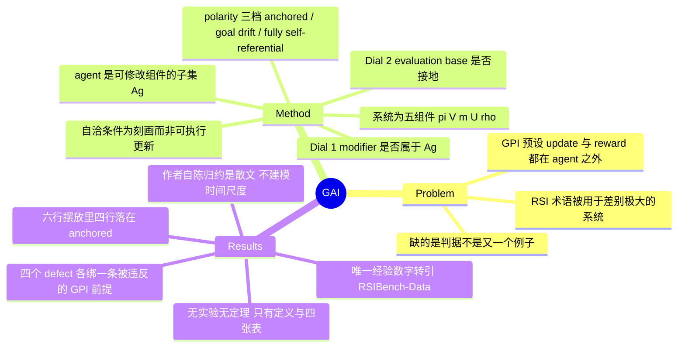

## Summary

GAI 把 generalized policy iteration 与 recursive self-improvement 写成同一个 evaluation–improvement 循环的两个实例：系统是五组件配置 χ = (π, V, m, U, ρ)，agent 是其中可修改的子集 Ag，两个 dial——modifier m 是否属于 Ag、evaluation base ρ 是否接地于 agent 之外——决定实例落在 GPI 还是 RSI，以及 anchored / goal drift / fully self-referential 三种 polarity。论文用这套坐标重排 fixed outer loop、Gödel machine 谱系与 co-evolving evaluator，并把 RSI 的四个 defect 各自钉到一条被违反的 GPI 前提上。全文无实验也无定理，作者自陈 RSI 到 GPI 的归约"是散文而不是带显式假设的命题"，唯一的经验数字转引自 RSIBench-Data。

## Problem & Motivation

RSI 这个词正在被用于差别极大的对象：改自己输出的 Self-Refine / Reflexion、改自己代码的 STOP / SICA、改自己 scaffold 的 Gödel Agent 与 Darwin Gödel Machine、在固定 evaluator 下搜程序的 AlphaEvolve、以及把 evaluator 一起演化的 Red Queen Gödel Machine。作者的判断是这个领域缺的不是又一个例子而是一条判据——"哪些系统算改进了自己，以及一旦改了会有什么不同"。

他们选择的锚点是经典侧的 GPI：它之所以有收敛性，前提是 update principle 与 reward 都躺在 agent 之外。递归情形恰好抽掉了这个前提，于是问题变成：能不能写一个把 GPI 当特例的账目，让 GPI 的每条保证在自指化之后逐条失效的位置都能被指出来。动机本身是站得住的，vault 里 [[Topics/SelfEvolvingAgents-Survey]] §7.5 已经独立记下过同一个症状（以 RSI 为题的工作与实际做到的事系统性错位），只是那里给的是操作性判据，这里要的是形式化坐标。

## Method

**系统与 agent 的定义。** 世界 W = (S, A, p, r) 与外部目标 G 被按假设固定在系统之外且不随系统改变。系统 χ 是五个组件当前内容的元组：policy π 选世界动作；action critic V 评价 π 行动得好不好；modifier m 提议系统该怎么改；modification critic U 评价一次提议是否服务 G；evaluation base ρ 是 critic 度量所对的标准。agent Ag ⊆ {π, V, m, U, ρ} 是其中可被修改的那些组件——这是全文最关键的一步：agent 不再是"策略"，而是"系统里可以被改动的那部分"。

**GAI 循环。** 交替两个操作：agent evaluation，当前 critic 拿 ρ 给 agent 部分打分，policy 层用 V、agent 层用 U；agent improvement，modifier 抽出一个新 agent 实例 ξ ~ m(·|χ)，系统换成 χ[ξ]。

**两个 dial。** Dial 1 问 m 是否在 Ag 里。m ∉ Ag 时它的内容被冻住，退化成 GPI 迭代的那个抽象 evaluation-improvement 算子；m ∈ Ag 时系统可以重写自己的 modifier，递归在 m 处闭合，不存在外层 meta-layer。Dial 2 问 ρ 的内容从哪来、agent 能不能改它，由此定出三种 polarity：内容来自外部且 ρ ∉ Ag 是 anchored；内容来自外部但 ρ ∈ Ag 是 goal drift——目标 G 没变，变的是度量进展的那把尺；ρ 没有外部内容、或者干脆依赖 U 自己，是 fully self-referential。

Remark 2 给了一个值得单独记住的切分：外部 judge 或 reward model 无论训得多不忠实都算 anchored，因为这个 dial 问的是标准放在哪里，不是它有多忠于目标；同一个 judge 一旦成为 agent 组件就变成 goal drift。

**自洽条件。** 论文给 m 与 U 写了一对 Bellman 形式的条件：U 要对 ρ 校准，m 只能提议在 U 估计下更优的实例。但作者明说这是 characterization conditions 而非被执行的更新，没有任何外部机制保证它们成立——这是全文唯一称得上"形式结果"的东西，且被自己降级为描述性的。

**Minimal Example 是全文信息量最大的一段。** 一个 coding agent 按通过测试的比例给修改打分，同一套构造在测试的三种放置下都满足上述自洽条件：测试被 held out 固定时报告的改进跟踪"写出能跑的代码"这个目标；测试放进 agent 自己的 repo 时，改测试成了一种合法改进；测试换成 agent 自己对何为改进的判断时就完全自指。三种都自洽，只有第一种服务目标。

**摆放与缺陷目录。** Table 3 把现有系统按 Ag / Dial 1 / Dial 2 放进同一张表。Table 4 列四个 defect，每个绑一条被违反的 GPI 前提：search over candidate selves 与 self-evaluation 由 Dial 1 触发，违反"改进步便宜且单调"与"评价者站在被评价者之外"；ungrounded base 与 goal drift 由 Dial 2 触发，违反"目标从 agent 之外被评价"。

## Key Results

**这篇论文不跑实验。** 没有 experiment / results / ablation 章节，没有作者自己的 benchmark 数字，附录只有一张符号表。四张表全是概念性归置，不是实测结果。所以"结果"应当读作"它交付了什么"。

**坐标化。** Table 3 的六行：policy/value iteration 与 PPO 是 Ag = {π, V} 的 anchored GPI；fixed outer loop 是 Ag = {π} 的 anchored GPI；Gödel machine 是 Ag = {π, m} 的 anchored RSI（带 proof gate）；Gödel Agent / Darwin Gödel Machine / STOP / SICA / Polaris / Hyperagents 挤在同一行，Ag = {π, m}、anchored RSI；Red Queen Gödel Machine 是 Ag = {π, m, U} 的 drifting RSI；closed-system proposals 是 fully self-referential RSI。

**坐标空间是空的。** 六行里四行落在 anchored，goal drift 只有 Red Queen Gödel Machine 一个系统，fully self-referential 只有 Schaul 的 position paper 一个条目。作者自己在 §3.3 承认"目前大多数被演示过的自改进系统都落在 anchored 行，下面两行主要由边界案例和 position paper 代表"。

**唯一的经验支撑是转引的。** §5.1 引 RSIBench-Data（Meng et al., 2026）：58.33% 的 setting 在第一次有效尝试之后有改进，而在拿到最好分之后仍继续搜索的那些 run 里，78.26% 最终尝试的分数低于最好分。论文用它说明"即使外部标准固定，改进步也不单调"。独立核对 arXiv:2607.25886 的 abstract，两个数字与含义与转述一致，没有失真。

**作者自陈的边界。** 定义不携带可达性与复杂度主张；不建模时间尺度，世界动作与 agent 更新的交替按步数计不按 compute 计；proof gate 与 benchmark 这类实际护栏被当作限制 modifier 提议空间的外部机制，护栏本身该不该是 agent 组件留作开放；人类审核者在形式化之外。§6 还明说"某个系统表现出某个 defect 时我们是引用它而不是测量它"。

## Evidence Ledger

| Claim ID | Claim | Type | Source locator | Evidence excerpt | Status |
|:--|:--|:--|:--|:--|:--|
| C1 | 全文无实验、无 ablation、无作者自测 benchmark，附录仅为符号表 | benchmark-setting | 全文 §1–§6 + Appendix: Notation | 目录无 experiments/results 节；"Appendix: Notation" 仅含符号-释义表 | source-verified |
| C2 | 转引 Meng et al. 2026：58.33% setting 首次有效尝试后改进；78.26% 继续搜索者终局低于最优 | number | §5.1 | "58.33% of settings improve on the first valid attempt, yet 78.26%…end with a lower-scoring final attempt" | source-verified |
| C3 | 作者自陈 RSI 到 GPI 的归约是散文而非带显式假设的命题 | causal-mechanism | §6 "From Catalogue to Results" | "the reduction from recursive self-improvement to GPI is prose rather than a proposition with explicit hypotheses" | source-verified |
| C4 | Table 4 给 Goal Drift 标 "Structural; observed"，§6 却承认是引用而非测量 | comparison | Table 4 + §6 Scope and Limitations | "Goal Drift…Structural; observed" / "where an existing system exhibits one, we cite it rather than measure it" | source-verified |
| C5 | Table 3 把 Gödel Agent/DGM/STOP/SICA/Polaris/Hyperagents 并为一行 anchored RSI；goal drift 仅 Red Queen；fully self-referential 仅 Schaul 2024 | sota-novelty | Table 3（polarity 定义见 Table 2） | "Gödel Agent, Darwin Gödel Machine, STOP, SICA, Polaris, Hyperagents…{π,m}…Anchored RSI" | source-verified |
| C6 | Definition 1 定义系统为五组件 χ = (π, V, m, U, ρ)，agent 为其中可修改子集 | causal-mechanism | §3.1 Definition 1 | "a system is a configuration χ=(π,V,m,U,ρ), a tuple of the current contents of five components" | source-verified |
| C7 | weights 与 harness 的边界只出现在 Table 3 括号注与 Remark 3，不是 dial 也不是 Definition 1 的组件 | causal-mechanism | Table 3 第四行 + Remark 3 + Definition 1 | "{π,m} (the harness; model weights and benchmark outside)" | source-verified |
| C8 | 世界 W 与目标 G 被按假设固定在系统之外 | benchmark-setting | §3.1 | "we hold both fixed in what follows, since such changes originate outside the system" | source-verified |
| C9 | Remark 1 把 self-proposed task 归为 self-improvement 的一种，理由是自设任务从属于不可编辑的外部目标 | causal-mechanism | §3.1 Remark 1 | "such self-set tasks remain subordinate to an external goal that is objective and cannot be edited by the agent" | source-verified |
| C10 | Eq. 4 的两条自洽条件被作者声明为 characterization conditions 而非被执行的更新 | causal-mechanism | §3.2（Eq. 4 之后） | "These are characterization conditions, not enforced updates…no external mechanism guarantees them" | source-verified |
| C11 | 四个 defect 为 search over candidate selves / self-evaluation / ungrounded base / goal drift，各配一条被违反的 GPI 条件 | causal-mechanism | Table 4 | "Table 4 collects the four defects"，每行带 "GPI condition violated" 列 | source-verified |
| C12 | 作者四人、机构为 Tianjin University 与 Shanxi University、arXiv:2609.13406v1 [cs.AI] 11 Sep 2026、全文无 code 链接 | license-code | 题名页 / 页脚 / abstract 页 | "1]Tianjin University 2]Shanxi University"；"arXiv:2609.13406v1 [cs.AI] 11 Sep 2026" | source-verified |
| C13 | §5.2 以 Ring & Orseau 的 delusion box 作为 ungrounded base 的早期形式类比 | causal-mechanism | §5.2 | "a reinforcement-learning agent can then satisfy its criterion without the cooperation of the world…delusion box" | source-verified |
| C14 | 58.33% 与 78.26% 在 RSIBench-Data 原文 abstract 中同样出现且含义一致，GAI 未失真 | number | arXiv:2607.25886 abstract | "in 58.33% of settings, they improve upon the first valid attempt"；"78.26% end with a lower-scoring final attempt" | source-verified |
| C15 | 论文明说不建模 time scale，交替按步数计不按 compute 计 | benchmark-setting | §6 Scope and Limitations | "we do not model time scales: the alternation…is counted in steps, not compute" | source-verified |
| C16 | 作者承认目前多数被演示的自改进系统落在 anchored 行，下面两行主要由边界案例与 position paper 代表 | sota-novelty | §3.3 | "most demonstrated self-improving systems fall into the Anchored row; the two lower rows…boundary cases and…position papers" | source-verified |

## Strengths & Weaknesses

**值得留下的。** 第一是 agent 的重新定义：把 agent 从"策略"改成"系统里可修改的那部分"，这一步让"改进机制是否属于被改进对象"成为一个可判定的二元问题，而不是修辞。第二是 Remark 2 对 judge 的切分——标准的位置与标准的忠实度是两件独立的事，一个被放在外面的不忠实 proxy 仍然是 anchored，而一个很忠实的 judge 一旦进了 agent 就变成 goal drift。这条切分直接可用：库里讨论 verifier gating 时经常把这两件事混着谈。第三是 Minimal Example——同一套自洽构造在测试的三种放置下都成立而只有一种服务目标，这正是自改进系统报告"我变好了"时不可信的根源，比论文其他任何一段都更说明问题。第四是诚实度：limitations 写了四条，自陈归约是散文、不建模时间、defect 是引用不是测量，没有把"formal framework"当成已经证明了什么。

**"formal framework"兑现有限。** 全文只有 Definition 1、Definition 2、三条 Remark 和四张表，没有任何 theorem / proposition / lemma 环境，唯一像结果的 Eq. 4 被作者自己降级成 characterization。所以它交付的是一套记号和一组坐标，不是一个能推出新结论的框架。作者自己把三个"从目录到结果"的目标列为 open：自洽条件的解集未刻画、归约未命题化、内部 monitor 能否判定自身 modification critic 的忠实度未知。

**坐标的判别力尚未被检验。** 六行里四行同色，非 anchored 的两格各只有一个占位者，其中一个还是 position paper。一个把当下几乎所有系统都归进同一格的坐标系，眼下只做到了"把 Red Queen 和 Socratic learning 从其余全部里分出来"。这不构成否定——早期框架本来就该先定坐标——但它意味着 Dial 2 的三档目前没有实证张力，真正被使用的只有 Dial 1。

**组件粒度漏掉了这条线最要紧的边界。** DGM 谱系的实际天花板是"只能改 scaffold、权重冻结"，而 weights 与 harness 都是 π 的 content space 内部的东西，不是 {π, V, m, U, ρ} 里的两个不同组件。于是这条边界只能写进 Table 3 的括号注和 Remark 3，进不了坐标。[[Topics/SelfEvolvingAgents-Survey]] §7.4 已经把它拆成两个可测量——单配置服务所有任务的"操作天花板"与允许逐任务选配置的"激发天花板"，[[Papers/2608-MacaronV1]] 实测二者相差一个数量级。GAI 在散文里认同这些系统是 bounded 的，但它的两个 dial 记不下 bounded 的程度。

**没有时间轴是更实际的缺口。** Dial 1 问的是 m 是否可改，不问它是否真被改过、改了几代。库里对同一谱系的判据是三条：是否存在 generation ≥ 2、演化系统本身是否也在被演化、权重更新是否发生在部署之后。GAI 的 Dial 1 精确对应第二条，另外两条没有对应物，作者也明说不建模 time scale。后果是具体的：[[Papers/2607-FrontisMA1]]、[[Papers/2608-MacaronV1]]、[[Papers/2609-RSIAgent]] 这三个按库内判据都停在 generation 1 的系统，在 GAI 坐标里与真正迭代多代的 DGM 无法区分。用这套坐标写综述会把"RSI 已有实物"这个结论抬高一档。

**"observed"标记偏软。** Table 4 给 goal drift 标 observed，依据是 Red Queen Gödel Machine 具有"evaluator 与 agent 共同演化"这个结构性质，而不是有人测到了系统偏离目标。§6 自己承认是 cite 而非 measure，两处应当对齐；应把 goal drift 读作 structural-only。

**唯一的经验数字里，第二个的条件化削弱了它。**（以下为笔记分析，非论文主张）78.26% 只统计"在拿到最好分之后仍继续搜索"的那些 run，而一旦继续搜索，终局尝试要么持平最好分要么低于它——高比例因此近乎由条件本身保证。它能支持"改进步不单调"这个定性结论，但 78.26% 这个量级不携带额外信息；真正承重的是 58.33% 那一半。

**环境不是组件。** world 与 goal 被按假设固定在系统之外，所以 agent-environment co-evolution 这条 2026 年很活跃的线在框架里没有位置；Remark 1 用"自设任务仍从属于外部目标"一句把 proposer-solver 一类整体归并进来，这是定义性的处置而不是被论证的结论。如果有人认为任务分布的自我生成本身就是一种标准漂移，GAI 的坐标无法表达这个分歧。

**潜在影响。** 作为词汇表有用，作为结论生产装置目前没有产出。它最可能的用途是给这条线的综述与讨论提供一组不含褒贬的坐标——"m 在不在 Ag 里"、"ρ 接不接地"比"是不是真 RSI"更容易达成一致。

## Mind Map

## Notes

**与库内最近前作的真实增量。** 最接近的是 [[Papers/2508-SelfEvolvingAIAgentsSurvey]]，它也给统一框架（System Inputs / Agent System / Environment / Optimiser 闭环，A\* = argmax O(A;I)）并按 model / memory / tool / workflow 四个演化对象组织领域。GAI 的差别是把"改进机制本身是否在被优化对象里"提成一等坐标，并把 evaluation base 的归属单独拎出来——这两件事在 self-evolving 那套分类里是被"演化对象"轴吸收掉的，看不见。代价对称：GAI 完全不谈 memory、tool、prompt 这些具体演化对象，两套框架是正交而不是替代关系。

**方法论上的一个提醒。** 这篇的贡献形态本身就是一套分类坐标，而库内的立场是 claim 不该建在先验分类学上。GAI 部分躲开了这个问题——它的两个 dial 是关于系统结构的可判定事实（m 在不在 Ag 里、ρ 能不能被改），不是按现象归纳出来的类别。但 Table 4 的四个 defect 就更像目录而非结论：它们是从定义直接读出来的，不构成新知识，作者也把它们叫做 catalogue。

**与库内判据的口径差异，值得在综述里写清楚。** [[Topics/SelfEvolvingAgents-Survey]] §7.5 与 [[DomainMaps/AgenticRL]] 已记下"以 RSI 为题、实际做到 generation ≥ 2 的库内一篇也没有"这一判断。GAI 的 Dial 1 会把 DGM、STOP、SICA、Gödel Agent 一律判为 RSI，比库内判据宽。两者不矛盾——GAI 问的是结构可能性，库内问的是实际发生——但混用会制造"RSI 已成实物"的错觉。若要在 survey 里引 GAI 的坐标，应当同时标注它不含时间维度。

**明确的读取缺口。** Red Queen Gödel Machine（arXiv:2606.26294，Iacob et al., 2026）是 GAI 里 goal drift 行的唯一占位者，也是 co-evolving evaluator 这条线的关键样本，库内没有笔记。Hyperagents（arXiv:2603.19461）与 Schaul 的 Boundless Socratic Learning（arXiv:2411.16905）同样缺。这三篇补齐之后，才谈得上检验 GAI 那两个空格子有没有内容。

**可以顺手拿来用的两条。** 一是 Remark 2 的 judge 位置/忠实度切分，写 verifier gating 时能省掉一段含混；二是 Minimal Example 的三重放置，是解释"自洽的自我报告为什么不等于真的变好"最省字的例子。

**存疑待查。** RSIBench-Data（arXiv:2607.25886）本身库内没有笔记，只在 [[Papers/2608-Aspire]] 里被提到过一次。它是目前唯一给这条线提供 negative 经验证据的 benchmark，值得单独 digest 一轮，而不是只留 GAI 的二手转引。
