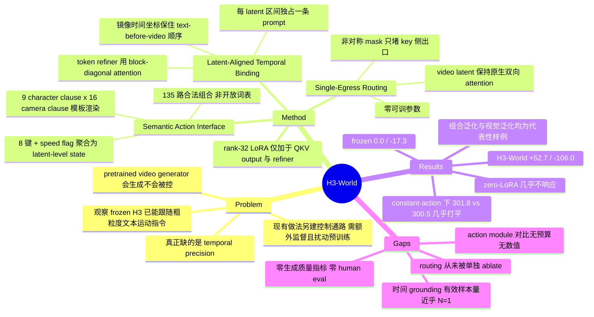

## Summary

H3-World 把 33B 的 MiniMax-H3 视频生成器改造成 interactive world model：不新增 action module，而是把 8 键 keyboard 状态查表翻成 character + camera 复合英文指令、与每个 video latent 区间一一绑定，再用 single-egress attention routing 把每条指令锁进自己的时间窗，仅用 7,872 段 gameplay clip、10,000 步 rank-32 LoRA、0.199% 可训参数完成适配。最有信息量的数字不是主结果而是它的对照组：constant-action 条件下冻结 H3 的全局 prompt 与 H3-World 的 directional separation 几乎相同（301.8 vs 300.5），说明 adaptation 买到的是 temporal binding 而非方向跟随本身。代价是全文除 Farneback 光流外没有任何定量指标，"优于 dedicated action module" 只有一张单例定性图支撑。

## Problem & Motivation

Interactive world model 需要一个 action interface，但 pretrained video generator 本身只暴露"生成"不暴露"控制"。现有做法一律是在预训练模型之上另建一条控制通路——discrete action embedding、conditional module、camera geometry、或直接改 backbone——都要额外的 action-video 对齐监督，增加计算与存储，且大幅适配会扰动预训练习得的能力。

作者的切入观察是：这条桥可能已经部分存在于模型内部。MiniMax-H3 未经任何 action-conditioned 训练，就已能对粗粒度的文本运动指令给出大致正确、视觉动态合理的响应（Fig. 1）。于是问题从"学一个新的控制表示"变成"把已有的粗糙语言接口做精"。

缺的具体是什么？是时间精度。video-level prompt 在整段 clip 内共享，当请求的动作在生成 horizon 内发生变化时（"前 15 个 latent 向左、后 22 个向右"），全局文本表示无法把每个方向绑定到各自的时间区间。

## Method

### 1. Semantic Action Interface

外部控制被表示为离散 control state：8 个记录下来的 character/camera 按键 + 1 个二值 camera-speed flag（训练时由估计的 camera yaw rate 导出，推理时由用户直接指定）。按 H3 VAE 的原生时间划分，把一个 latent 区间内出现过的按键聚合成 latent-level state（区间内任一帧出现即置位），对立按键先相消。

动作空间显式分解为 character 控制与 camera 控制，`a_k = (u_k, c_k)`，前者 9 个 clause、后者 16 个 clause，各自查表映射成短句后拼接。例如 backward-left 加 slow right-pan 得到 "the man walks backward and strafes left, camera pans right slowly."。全数据集的 character/camera 从句共享同一套语法结构。

需要看清楚的是：这不是开放词表的语言控制，而是一个 135 路离散动作空间的固定模板渲染。它把控制放进了 H3 的原生文本条件空间，同时保留了原动作空间的因子分解结构。

### 2. Latent-Aligned Temporal Binding

每个 latent 区间独占一条 action prompt，经共享的 H3 encoder 与一个共享的两层 token refiner 编码为 `A_k`。refiner 用 block-diagonal attention：同一 action span 内双向通信，不同 span 之间当作独立序列处理，从而在进入视频 backbone 前就保住每条指令的时间身份。

初始观测走两条互补路径：多模态 H3 encoder 联合处理静态语义条件与初始观测得到静态 token `S`，视觉 VAE 把初始观测映为保留细粒度外观的 first-frame condition `C_0`。全部打包成单序列 `X = [S; A_1; …; A_K; C_0; V_1; …; V_K; P]`。

位置编码用镜像时间坐标：`τ(A_k) = τ(V_k) − Δ, Δ > 0`。每个 action span 的位置跟随其匹配 latent 的时间顺序但留在文本侧的位置区间内，既保住预训练的 text-before-video 排序，又给每一对 (action, latent) 一致的相对时间偏移作为对齐线索。

### 3. Single-Egress Routing 与 LoRA

H3 是 packed single-stream self-attention，双向、一次性去噪整段未来 horizon，没有独立的 text cross-attention 层。所以仅靠位置对齐不足以约束信息流——action span 仍可直接与不匹配的 video latent 通信。

路由 mask 是非对称的：`A_k` 作为 attention key 时，只能被同 span 的 token 与其匹配的 `V_k` 读取，静态 token、first-frame condition、原生音频 token、其他 action span、不匹配的 video latent 都读不到它；`A_k` 作为 query 时则仍保留对静态上下文、first-frame condition、原生音频、自身 token 与 `V_k` 的访问。所有 video latent 之间维持 H3 原生的双向 attention 模式。

于是每条 action 有且仅有一个进入视觉流的直接入口（`V_k`），其效应随后经 video-to-video attention 自然扩散。既做到时间隔离，又不牺牲全 horizon 的运动连续性与场景一致性。

LoRA（rank 32）只加在 H3 self-attention 的 QKV 与 output 投影、以及两层 token refiner 上；backbone、H3 encoder、visual VAE 及其余部分全部冻结。routing mask 与 span 划分不引入任何可学习参数，训练目标仍是 H3 原生的 denoising objective。

### 数据与训练设置

训练与评测集切自 ABot-World-Explorer-500h（即 [[Papers/2607-ABotWorld0|ABot-World-0]] 的数据）：7,872 段训练 clip，另 128 段留作评测。每段 124 帧、24 fps、832×480，按上述时间划分得 37 条 latent-aligned action prompt（7,872 × 37 = 291,264，与 Fig. 3 的 prompt 总数自洽）。10,000 步、lr 1e-4；推理生成 124 帧、50 denoising step，pretrained-H3 对照组用完全相同的生成设置、只关掉 LoRA。

论文只给 0.199% 这个比例，从未给出绝对可训参数量；按 33B 折算约 6.6e7 量级（我的推算，非论文数字）。同理，7,872 段 × 124/24 s ≈ 11.3 小时素材，约为 500h 数据源的 2%（我的推算）——所谓"数据高效"部分是选择而非约束。

## Key Results

### 1. Adaptation 买到的是 temporal binding，不是 direction following（Sec 4.2, Fig. 4）

受控 schedule：前 15 个 temporal latent 向左 sharply pan、后 22 个向右 sharply pan，切换点恰好落在 latent block 边界；同一 clip 内反向使切换本身控制住场景漂移。累计 mean horizontal flow（论文约定：正值为向左，负值为向右）：

| 设置 | 切换前 | 切换后 |
|:--|:--|:--|
| frozen H3 + 单条全局运动指令 | 0.0 | −17.3 |
| 完整 per-latent 接口 + LoRA 全部置零 | −0.1 | 0.0（mean abs flow 0.003） |
| H3-World | +52.7 | −106.0 |

反转指令顺序结果一致：global prompting 给出 −11.9 / +24.1，zero-LoRA 仍不响应，H3-World 给出 −58.7 / +121.0。

而在 constant-action 对照下（整段只有一个相机方向），global prompting 与 H3-World 的 directional separation 几乎相同：301.8 对 300.5。

三条读数合起来是全文最有信息量的一段：frozen H3 确实已能跟随粗粒度方向指令，这支撑了论文的核心观察；zero-LoRA 说明"只给 span 级指令加 routing"本身完全不够，必须靠 LoRA 才让 backbone 用上这些时间绑定；而 LoRA 的增益集中在时变 schedule 上，不在方向跟随上。作者没有掩盖这个对自己不利的等号。

> 证据边界：`directional separation` 这个量的定义、样本数与 seed 全文未给出；301.8 / 300.5 verbatim 无误，但不构成可复现的测量。

### 2. 与 dedicated action module 的对比只有定性图（Sec 4.3, Fig. 5）

两个自实现的直接 action-conditioning 变体：additive-bias（照 ReactiveGWM 的机制，投影 action state 后加到 video 表示上）与 FiLM（AdaLN 之后做 feature-wise scale/shift）。论文称二者对变化的录制控制"produce weak or inconsistent changes"，而 H3-World 产生协调的 character 与 camera 变化。

但这是单条 held-out clip 上的一张图，无任何数值，也未报告两个 baseline 的训练步数、可训参数量或算力预算。

### 3. 泛化（Sec 4.4, Fig. 8 / Fig. 9）

135 个结构合法的 character-camera 组合中训练覆盖 83、留 52 未见；前 20 高频组合占全部 prompt 的 71.4%，前 40 占 95.4%，分布高度不均。论文取一个"character 与 camera 从句各自在别的配对里出现过、但从未同现"的组合，在 held-out gameplay 与 OOD 观测上都跟随了两个分量。另在 6 个与训练分布差异很大的初始观测（第一/第三人称、室内外、奇幻与科幻、不同渲染风格）上，同一套接口仍产生所请求的响应。均为代表性样例展示，非统计结果。

### 4. 全文零生成质量指标

没有 FVD / PSNR / SSIM / LPIPS / VBench，没有 human eval，没有 user study，全文零表格。唯一的定量手段是 Farneback 稠密光流累计的水平分量。abstract 中 "preserving strong generation quality" 一句在正文没有任何指标对应。

## Evidence Ledger

| Claim ID | Claim | Type | Source locator | Evidence excerpt | Status |
|:--|:--|:--|:--|:--|:--|
| C1 | 适配 33B MiniMax-H3，仅训 0.199% 参数，rank-32 LoRA、10,000 步、lr 1e-4 | number | Abstract; Sec 1; Sec 4.1 "Training and inference" | "We train the rank-32 LoRA parameters for 10,000 optimization steps with a learning rate of 1e-4" | source-verified |
| C2 | 训练 7,872 段 + 留出 128 段，均来自 ABot-World-Explorer-500h；124 帧 @24fps、832×480、每段 37 条 prompt | benchmark-setting | Sec 4.1 "Data." | "The training set contains 7,872 gameplay clips, and a separate set of 128 clips is held out for evaluation." | source-verified |
| C3 | 9×16=144 组合，135 合法，训练覆盖 83、52 未见；top-20 占 71.4%、top-40 占 95.4%，共 291,264 条 prompt | number | Sec 3.2; Fig. 3 caption | "Of 135 valid character-camera pairs, 83 occur in 291,264 prompts and 52 remain unseen." | source-verified |
| C4 | 切换 schedule 下累计水平光流：frozen 0.0/−17.3，zero-LoRA −0.1/0.0，H3-World +52.7/−106.0 | number | Sec 4.2 (Fig. 4 讨论) | "H3-World produces +52.7 before the switch and −106.0 afterward" | source-verified |
| C5 | constant-action 下 frozen H3 与 H3-World 的 directional separation 几乎相同（301.8 vs 300.5） | comparison | Sec 4.2 末段 | "global prompting and H3-World yield nearly identical directional separation, 301.8 and 300.5" | source-verified |
| C6 | 与 additive-bias / FiLM 两个 action module 变体的对比仅为单例定性图，未报告其训练预算与任何数值 | benchmark-setting | Sec 4.3 "Direct action conditioning."; Fig. 5 caption | "Figure 5 compares the three interfaces with the ground-truth video from the same held-out clip and recorded action sequence." | source-verified |
| C7 | 全文无生成质量定量指标、无 human eval；唯一定量手段是 Farneback 光流 | benchmark-setting | Sec 4.1 "Evaluation protocol."；全文关键词扫描零命中，无表格 | "we estimate dense optical flow using the Farneback method and accumulate the mean horizontal flow over each video" | source-verified |
| C8 | 作者自陈组合泛化与视觉迁移"主要通过代表性样例"评估，需更系统评测才能量化控制可靠性 | benchmark-setting | Sec 5 limitations | "more systematic evaluation across action combinations, scenes, and random seeds is needed to quantify control reliability" | source-verified |
| C9 | 机构为 Tencent / NUS / HK PolyU；放出 GitHub 代码与 HuggingFace 权重 | license-code | 题头 affiliation 脚注；front-matter 链接 | "Affiliation: 1 Tencent 2 National University of Singapore 3 The Hong Kong Polytechnic University" | source-verified |
| C10 | single-egress routing：action span 作为 key 只能被自身 span 与匹配 latent 读取；video latent 保持原生双向 attention | causal-mechanism | Sec 3.4 首段 | "an action span ... can be read by tokens in the same action span and by its matched video latent" | source-verified |
| C11 | 推理生成 124 帧、50 denoising step；pretrained-H3 对照用同样设置只关掉 LoRA | benchmark-setting | Sec 4.1 "Training and inference." | "At inference, we generate 124 frames with 50 denoising steps." | source-verified |
| C12 | 全文没有与任何外部已发表 action-conditioned world model 在同数据上的对比 | comparison | Sec 4.2–4.4 全部实验；Sec 2.1 仅作 related work 提及 | "We first compare the text-based action interface of H3-World with two direct action-conditioning variants." | source-verified |

> Verifier 补充的两处口径提醒（已并入正文）：C10 只引了 key 侧规则，routing 实为非对称，query 侧仍可读静态上下文与匹配 latent；C4 的 schedule 带 fast camera-speed flag（"sharply"），复现时不可省。Fig. 4 图像本身机器不可读，上述流量数字取自 Sec 4.2 正文明文，若图内另有数值则该部分 not-checkable。

## Strengths & Weaknesses

### 值得学的地方

**问题重述干净。** "control 是否必须从零学"这个提法比"再设计一个更好的 control module"有意思得多，而且是可证伪的。constant-action 对照（301.8 vs 300.5）是对它的直接证据，作者没有把这个显然对自己不利的等号藏起来——它等于承认在方向跟随这件事上自己的方法没有增益。

**三设置对照设计得当。** frozen / zero-LoRA / trained 三组把"接口结构"与"适配"两个因素分开了，得出的结论（接口结构必要但不充分，LoRA 让 backbone 学会使用时间绑定）比"我们的方法更好"具体得多。frozen backbone + global prompt 这条 baseline 应当成为此类工作的必备对照。

**single-egress routing 的非对称设计有品味。** 只堵 key 侧的出口而保留 query 侧的上下文读取，同时保住 video-video 双向 attention，用零可训参数换到时间隔离而不损失运动连续性。这是对 packed single-stream 架构约束的一个恰当回应。

### 主要问题

**1. "语言接口"名不副实，这直接冲击标题级的 claim。** 实际接口是 8 键 + 1 个 speed flag 构成的 135 路离散动作空间，经固定模板渲染成全数据集同构的英文短句。所谓 compositional generalization 是 9×16 笛卡尔积上的组合外推，不是自由语言控制。被复用的是预训练里的"动作语义先验"（"strafe left" 这个短语对应什么视觉变化），而不是语言的开放性。要支撑 "Turning Language Understanding into World Control"，至少需要同义改写、否定、程度副词、多实体指代、未见动词等测试——一项都没有。反过来说，如果只是想证明"预训练文本通路比新学的 action embedding 更省样本"，那么现有实验其实够了，标题才是过度的。

**2. 核心贡献之一从未被 ablate。** temporal attention routing 被列为独立贡献并声称 "reduces control leakage across actions"，但全文没有"训练好的 LoRA + latent-aligned prompt，但去掉 routing mask"这一组。Sec 4.2 的 zero-LoRA 组是带 routing 的，因此只证明了 LoRA 必要，完全没证明 routing 必要。"control leakage" 这个量也从未被定义或测量。按论文自己的实验设计逻辑，补这一组的成本极低（同一份训练脚本改一个 mask），没做很难解释。

**3. 与 dedicated action module 的比较不构成受控实验。** additive-bias 与 FiLM 都是作者自实现，无预算披露、无参数量、无数值、单例定性；也没有任何外部已发表的 action-conditioned world model（Matrix-Game 系列、GameFactory、Genie，乃至提供了数据的 ABot-World-0）在同数据上跑过一遍。所以"语言接口优于 dedicated action module"目前只能读作"在 8k 样本 + LoRA 级预算下，从头学 action embedding 不如复用预训练文本通路"。这是关于低预算 regime 的说法，不是关于两类接口的一般结论；而低预算下从头学的模块表现差，本来就是预期内的。要支撑一般结论，需要给 baseline 同等甚至更多的可训参数与步数，并展示 scaling 趋势。

**4. 时间 grounding 的评测有效样本量近乎 N=1。** 就一条手工 schedule 加它的反转，加一个 constant-action 对照。切换点还刻意对齐 latent block 边界，而论文自己指出一个 latent 区间覆盖多帧 RGB——边界内切换（也就是真实交互中最常见的情况）从未测试。character 控制从未被任何定量指标覆盖，光流只量到 camera yaw。128 条 held-out clip 明明存在，却只在图里用了 5 条。没有 human eval，没有自动指标，没有 seed 重复。

**5. "preserving strong generation quality" 无测量。** abstract 里的这句话在正文找不到对应指标。冻结 backbone + 0.199% LoRA 让它先验上可信，但"可信"不是"已测"。

**6. Incantation 之上的 delta 偏窄。** 作者自陈 Incantation 已用 per-latent-frame 自然语言与 local text cross-attention 表示动作；H3-World 的差异在于 MiniMax-H3 是 packed single-stream self-attention、无独立 cross-attention 层，因此需要 routing mask 来实现同样的时间隔离。这是把已有 formulation 迁到新架构的工程贡献，不是新 formulation。

**7. 作者自陈的边界（我认同）：** 短 horizon、固定长度片段、无持久世界状态、无实时交互、无 planning / policy learning。另：代码仓库（已开放，含对 DiffSynth 的 patch）无 LICENSE 文件。

### 对领域的影响（我的判断）

这篇的价值不在方法而在它抬对了 baseline。如果"大视频生成器已内含粗粒度控制先验、缺的只是时间绑定"这个观察成立，那么大量以"设计更好的 action embedding / conditional module"为主线的 world model 工作，都需要先证明自己赢过 frozen backbone + prompt 这条几乎零成本的对照。这条纪律比 single-egress routing 本身更值得被继承。至于论文自己，它离证明"语言是控制的自然接口"还差得远——它证明的是"模板化文本比同预算下从头学的 action embedding 更省样本"。

## Mind Map

## Notes

**与 vault 的连接**

- 数据来自 [[Papers/2607-ABotWorld0|ABot-World-0]] 的 ABot-World-Explorer-500h。两篇构成有意思的对照：ABot-World-0 是全栈系统工程（蒸馏 + 低比特 + KV cache，换单卡 16 FPS 流式长程 rollout），H3-World 是极轻量适配（0.199% 参数换时间可控性）。同一份数据上，一个在优化"跑得动"，一个在优化"控得住"，而两者都没有量化生成质量。
- [[Papers/2402-Genie|Genie]] 的 latent action interface 是本文的对立面：Genie 从视频里无监督学出动作表示，H3-World 主张动作表示已经在预训练语义里、只需对齐时间。这两条路线的分歧值得在 [[Topics/WorldModel-Survey]] 的"控制接口"维度上并置。
- [[Papers/2608-GameWAM|GameWAM]] 走的是联合生成观测与可执行动作轨迹的 WAM 路线；H3-World 只做 action → video 单向，不产出可执行动作，因此不能直接用于 policy learning，这一点作者也在 limitation 里承认了。
- [[Papers/2607-BadWAM|BadWAM]]（同作者 Xingyi Yang）被本文引用来支撑"控制接口会限制鲁棒性与泛化"的论点。BadWAM 的结论是 world-action model 会 dream right but act wrong；把它和本文的 frozen-vs-adapted 对照放在一起，会得到一个自然的追问：语言接口下"看起来动对了"和"动作语义真的被理解"之间还是同一个缺口，本文的光流指标恰恰无法区分这两者。

**值得追的问题（我的）**

1. routing mask 的消融是这篇最便宜也最缺的实验。如果去掉 mask 后 LoRA 仍能学会时间绑定（bidirectional attention 加镜像位置编码本身就是很强的对齐线索），那第二个贡献就不成立。这个实验代码已放出，可以自己跑。
2. "frozen backbone + global prompt" 应当被固化为 world model 控制类工作的默认对照。可以考虑在 WorldModel-Survey 里记一条方法学要求：任何声称自己的 action interface 有效的工作，必须报告冻结底座 + 朴素 prompt 的同条件结果。
3. constant-action 下 301.8 vs 300.5 这个近乎完全打平的结果，暗示预训练语义先验的"方向跟随"能力可能已经饱和。那么真正的 scaling 问题是：随着底座从 33B 继续变大，需要 LoRA 补的那部分（时间绑定）是变小还是不变？如果变小，这条路线的终点是不需要适配；如果不变，说明 temporal grounding 是预训练目标结构性缺失的东西，那就值得单独研究其预训练侧的补法。
4. 本文的动作空间是 135 路离散 + 模板渲染。一个直接的诊断实验：把模板换成随机但一致的无意义 token 串（保持一一映射与语法位置），如果性能不降，则"语言理解"完全没被用上，方法退化为"给离散动作找了一组恰好落在文本 embedding 空间里的编码"。这个对照能干净地判定标题 claim 的真伪，成本也低。
