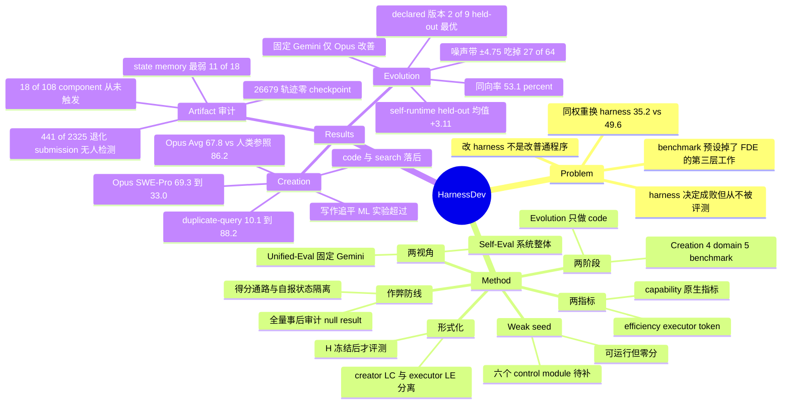

## Summary

HarnessDev 把 agent 评测的单位从"任务输出"换成"可运行的执行基建本身"：六个 creator LLM 拿到同一个跑得通但不解题的 weak seed（未修改时在全部下游 benchmark 得 0），先从零建 harness（Creation，4 个 domain / 5 个 benchmark / 2,207 个 instance），再用下游执行反馈迭代改自己的 harness（Evolution，只做 code domain），全程把 creator 与 executor 拆成两个模型。结论是 Creation 已经可用但域间落差极大——写作追平、ML 实验超过所选人类参照，code 与 search 显著落后（Self-Eval 最好的 Opus 4.8 平均 67.8，人类参照行 86.2）；Evolution 的增益则大多落在同一 commit 重跑 ±4.75 分的噪声带内，64 次官方版本切换里只有 2 次有超噪声带的正向证据。更硬的负面结论在选版本上：可见反馈与 held-out 分数同向率只有 53.1%，9 条 lineage 里只有 2 条 declare 出了 held-out 最优版本。

## Problem & Motivation

论文的起点是一个已经被反复观察到、但从没被当成评测对象的事实：同样的权重换个 harness，分数会变一大截——GPT-5 在 Terminus 2 里 Terminal-Bench 2.1 拿 35.2%，在 Codex CLI 里拿 49.6%。既然 harness 决定这么多，而现实里它需要被持续开发而非一次性实现，那么"LLM 能不能承担 harness 工程师这个角色"就是一个有实际后果的问题。

但主流 agent benchmark（SWE-bench、GAIA、WebArena、τ-bench、AgentBench）都在问题已经被做成可执行之后才开始：任务定好、judge 定好、scaffold 定好，harness 被算作实验配置的一部分，而不是被开发的产物。作者用 forward-deployed engineer 这个岗位来说明 benchmark 预设掉了什么：真实部署里目标是模糊的、反馈信号需要先被造出来、执行系统压根不存在。本文只做第三层。

第二个论点是这件事和普通改代码不同。改一个独立程序时目标行为有外部规格、成功是局部可验的；改自己的 harness 是在改自己赖以观察、规划、恢复的执行基底，一次修改影响此后所有任务，因此要求模型从执行轨迹里认出自己的行为缺陷、定位系统级瓶颈，并让改动累积成可复用的能力而非一次性补丁。

## Method

**形式化与角色分离。** creator LLM $L_C$ 在开发环境 $D$ 里产出 harness $H$；$H$ 冻结后由 executor LLM $L_E$ 在下游任务 $x$ 上运行，evaluator $J$ 打分：$(L_C,D)\rightarrow H$，$(H,L_E,x)\rightarrow y\xrightarrow{J}\text{score}$。$D$ 只用于造 $H$，$L_E$ 只在 $H$ 冻结后介入。这条分离是整篇论文所有可解释性的来源。

**Weak seed。** 所有 creator 收到同一个 $H_{\mathrm{seed}}$：一个可运行的兼容层而非解题 agent。它解析任务与模型配置、暴露被动的低层工具、写出规定的 result / trajectory / log 产物，但没有 agent loop、任务分解、tool policy、context management、持久 state、verifier、重试恢复与停止规则；最多发一次连通性探测，不尝试解题。未修改时全 benchmark 得 0，所以任何非零 Creation 分数都必须来自 creator 加的执行逻辑。creator 需要补上的是六个 control module：Loop / Tools / Context / State / Lifecycle / Verify。

**Creation（RQ1）。** creator 拿到 seed、任务族规格、工具与权限约束、一份简短设计教程和 1–3 个 development case，可以用这些 case 的反馈迭代，但看不到人类实现，也看不到 hidden evaluation set。每个 creator–benchmark 对独立造 3 个 harness，报 avg@3。

**Evolution（RQ2）。** creator 从自己 RQ1 的 code harness $H_0$ 出发，反馈集是固定的 100 题 SWE-Pro 子集加全部 89 题 Terminal-Bench。每个候选必须同时跑完两条腿才算一个 official version，控制器给 10 个 post-$H_0$ 完整评测 pair 的预算；两个计费 pair 之间最多做 2 次固定 5 题的 probe，probe 只作诊断、永不计入官方分。creator 自己 declare 最终 commit。冻结之后，每个 official version 再在与反馈集不相交的 630 题 SWE-Pro held-out 上评一遍，这些分数从不回传给 creator——于是"对可见反馈的适应"与"held-out 泛化"被分开记账，而且是沿整条轨迹逐版本记账。

**两种评测视角。** Self-Eval 令 $L_E = L_C$，量的是 creator–harness 这个整体系统；Unified-Eval 固定 Gemini 3.1 Pro 当 executor，让不同 creator 的 harness 直接可比。指标两轴：capability 用 benchmark 原生指标，efficiency 用 executor 侧 token（creator 造 harness 花的 token 不计）。

**作弊防线。** 规格明写禁止硬编码实例解、从 task id / 文件名白名单 / 已知答案推补丁、读取 hidden test 与 scorer 内部、绕过 provider-neutral runtime 接口。两条性质让约束可查而非停留在劝告：得分通路与 harness 自报状态隔离（SWE-Pro 只认 workdir 里真实的 repo diff，Terminal-Bench 只认最终环境状态），以及每次运行保留 trajectory / result / metric 产物与冻结源码供事后审计。全文所有运行都过了这道审计，结果报为 null result。

开发环境是 Claude Code 2.1.177，GPT-5.5 例外用 Codex 0.144.3。

## Key Results

**Creation / Self-Eval**（avg@3；`Avg.` 是 SWE-Pro、Terminal-Bench、EQ-Bench3、BrowseComp 四项的非加权均值，**不含 MLE-bench**）：

| Creator | SWE-Pro | Term-2.1 | MLE-bench (medal) | EQ-Bench3 | BrowseComp | Avg. |
|:--|--:|--:|--:|--:|--:|--:|
| $H_{\mathrm{seed}}$ | 0.0 | 0.0 | 0.0 | 0.0 | 0.0 | 0.0 |
| Opus 4.8 | 69.3 | 64.8 | 32.9 | 84.6 | 52.4 | **67.8** |
| Gemini 3.1 Pro | 43.6 | 68.8 | 32.4 | 74.8 | 35.2 | 55.6 |
| GPT-5.5 | 32.8 | 52.1 | 19.1 | 83.0 | 52.6 | 55.1 |
| DeepSeek V4 Pro | 28.9 | 35.6 | 19.6 | 75.4 | 40.9 | 45.2 |
| Qwen 3.7 Max | 33.5 | 41.3 | 3.1 | 68.7 | 32.3 | 44.0 |
| Seed 2.0 Pro | 10.8 | 6.0 | 5.3 | 71.1 | 3.2 | 22.8 |
| Human reference | 80.0\* | 88.8\* | 24.0 | 83.7 | 92.2\* | 86.2 |

\* 为作者未自跑的外部公开结果（取自 OpenAI GPT-5.6 release report），且人类参照行的每个 benchmark 配的是不同的 harness–executor 组合（SWE-Pro 配 Claude Fable 5，Terminal-Bench 与 BrowseComp 配 GPT-5.6 Sol，MLE-bench 是 MLEvolve + Gemini 3.1，EQ-Bench3 是 Kimi Writer + Opus 4.8），不是共同 executor 下的配对对照。

**Executor 依赖是 Creation 最强的信号。** 固定 Gemini 执行后排名大改：Opus 的 SWE-Pro 从 69.3 掉到 33.0、写作从 84.6 掉到 74.2，其 Search harness 的 duplicate-query 率从 10.1% 涨到 88.2%，说明它的去重、复查与终止规则是贴着原 executor 长出来的；Qwen 则反向获益，BrowseComp +17.6、MLE-bench +12.9，意味着原 executor 本身才是瓶颈。一个具体病例是某个 Opus code harness 把 120 步上限硬编码在原 executor 周围，换 executor 后近乎崩溃。成本同样离散：MLE-bench 的 token 消耗有约 19 倍差，而且贵不等于好——GPT-5.5 用 29.3M token 拿 19.1 medal，DeepSeek V4 用 208.4M token 拿 19.6。

**Artifact 审计比主表更有信息量。** 18 个 code artifact 全部实现了显式 execution loop，tools / lifecycle / verification 完整的分别是 13/18、13/18、15/18；state 与 memory 是明确的缺口——11/18 定义了 State class，但只有 1 个暴露 state-saving 接口、只有 1 个做周期 checkpoint，26,679 条记录轨迹里没有出现过一次 checkpoint 事件。声明与执行的差距普遍存在：108 个 code component instance 里 72 个真的在运行中触发、18 个只有部分证据、18 个从未被观察到，且未观察到的全部属于 state/memory；587 个 Writing feature 里 124 个确认是 dead code，36 个 Data 机制落在 dead path 上。验证多半是语法层的：2,325 个已执行的 Data 任务里有 441 个产出退化 submission，没有任何 harness 检测到；failed Data 任务有 77.8% 归因于 harness 缺陷而非 executor 能力。编辑量与效果脱钩——18 个 code artifact 共加 17,111 净行，加得最少的 Gemini（1,006 行）拿到最好的 Terminal-Bench 68.8。自测数量与下游分数的 Spearman 只有 0.13–0.26 且不显著，而 revision call 达到 0.57（p ≤ .0005）。

**Evolution（Table 6）**，feedback pair 是 SWE-Pro-100 与 Terminal-Bench-89 的等权均值，held-out 只用后跑的 SWE-Pro-630：

| Runtime | Creator | Feedback pair $H_0\to H_{\mathrm{dec}}$ | Held-out-630 $H_0\to H_{\mathrm{dec}}$ | 最终差距 |
|:--|:--|:--|:--|--:|
| Self | Gemini 3.1 Pro | 59.9 → 68.7 (+8.8) | 48.89 → 51.59 (+2.70) | 0.00 |
| Self | Opus 4.8 | 71.1 → 74.1 (+3.0) | 63.02 → 67.46 (**+4.44**) | 1.59 |
| Self | Qwen 3.7 Max | 41.8 → 55.7 (+13.9) | 42.22 → 43.65 (+1.43) | 3.17 |
| Self | DeepSeek V4 Pro | 47.2 → 60.6 (+13.4) | 47.30 → 50.48 (+3.17) | 1.75 |
| Self | GPT-5.5 | 59.2 → 65.1 (+5.9) | 48.25 → 52.06 (+3.81) | 0.00 |
| Fixed Gemini | Opus 4.8 | 58.8 → 68.6 (+9.7) | 48.10 → 50.79 (+2.70) | 2.54 |
| Fixed Gemini | Qwen 3.7 Max | 62.1 → 63.2 (+1.1) | 49.52 → 48.41 (**−1.11**) | 1.11 |
| Fixed Gemini | DeepSeek V4 Pro | 47.3 → 53.8 (+6.5) | 43.02 → 40.63 (**−2.38**) | 3.02 |
| Fixed Gemini | GPT-5.5 | 56.6 → 59.1 (+2.4) | 42.22 → 31.90 (**−10.32**) | 16.51 |

可见反馈上人人都涨，held-out 上五条 self-runtime lineage 全部改善（+1.43 到 +4.44，均值 +3.11），但换成固定 Gemini 执行后只有 Opus 还在涨，另外三条全部倒退。注意 feedback 增益与 held-out 增益的量级差：Qwen self-runtime 在可见反馈上 +13.9，在 held-out 上只剩 +1.43。

**稳定性与选版本。** 9 条 lineage 产出 73 个 official version、64 次相邻版本切换。这 64 次里 8 次两个 benchmark 都退、16 次单 benchmark 退、3 次跨 benchmark 权衡、7 次无可测变化、27 次的增益落在重复运行噪声带内、只有 2 次有超出噪声带的明确正向证据、还有 1 次根本不含可执行代码变更。同一个 commit 重复跑会差约 ±4.75 个 pair 分，所以小幅增益单看分数无法归因到代码改动。新加的代码也不一定活着：169 个新函数或类里 113 个从入口可达、31 个只能经 dead code 到达、25 个没有调用者。选版本环节最糟——creator 通常挑可见反馈分最高的附近，但可见反馈与 held-out 同向的只有 34/64（53.1%），9 个 declared version 里只有 2 个是 held-out 最优。

**编辑与反馈使用。** median 的 declared version 改 8 个文件、+476/−38 行。64 次切换中 58 次改执行或控制流、37 次改 tools、17 次改 lifecycle recovery、16 次改 context、只有 4 次改 state，没有一次改独立 verifier。诊断是最弱的一环：专用的 trajectory 接口全程只被调用两次，显式检查过的 case 只覆盖 189 个反馈任务的 0.5%–40.2%，creator 更多靠自写脚本和小 probe，而 probe 会和完整评测打架（一个 GPT-5.5 候选过了全部 5 个 Terminal probe，全集只有 0.584）。正面例子是 Opus：它发现 100 次运行里 99 次自报成功而实际只有 48 次通过，把差距定位到 premature completion，加了一道 completion gate。

## Evidence Ledger

| Claim ID | Claim | Type | Source locator | Evidence excerpt | Status |
|:--|:--|:--|:--|:--|:--|
| C1 | 4 domain / 5 benchmark / 2,207 instance；SWE-Pro 731、Term-2.1 89、MLE-bench 75、EQ-Bench3 46、BrowseComp 1,266 | number | Sec 3.3 / Table 2 | "the suites contain 2,207 unique downstream instances" | source-verified |
| C2 | 六个 creator LLM：Opus 4.8 / GPT-5.5 / Gemini 3.1 Pro / DeepSeek V4 Pro / Qwen 3.7 Max / Seed 2.0 Pro | benchmark-setting | Sec 4.1 | "six creator LLMs: Opus 4.8, GPT-5.5, Gemini 3.1 Pro, DeepSeek V4 Pro, Qwen 3.7 Max, and Seed 2.0 Pro" | source-verified |
| C3 | 未修改的 weak seed 在全部下游 benchmark 得 0，非零分必来自 creator 加的执行逻辑 | number | Sec 3.2 / Table 3 | "scores zero on every downstream benchmark. Any nonzero Creation score must therefore come from execution logic" | source-verified |
| C4 | Self-Eval 下 Opus 4.8 Avg 67.8 最高但低于人类参照 86.2；Avg 为四项非加权均值、不含 MLE-bench | number | Sec 4.2 / Table 3 caption | "Avg. is the unweighted mean over SWE-Pro, Terminal-Bench, EQ-Bench3, and BrowseComp" | source-verified |
| C5 | MLE-bench 上 Opus 4.8 (32.9) 与 Gemini 3.1 Pro (32.4) 均超过人类参照 24.0 | comparison | Sec 4.2 / Table 3 | "Opus 4.8 and Gemini 3.1 Pro lead MLE-bench with medal rates of 32.9 and 32.4" | source-verified |
| C6 | Opus SWE-Pro 69.3 → 33.0（换 Gemini executor）；Search harness duplicate-query 率 10.1% → 88.2% | number | Sec 4.2 | "score falls from 69.3 to 33.0 under Gemini... duplicate-query rate rises from 10.1% to 88.2%" | source-verified |
| C7 | 固定 Gemini 下 Qwen BrowseComp +17.6、MLE-bench +12.9 | number | Sec 4.2 | "Qwen gains 17.6 points on BrowseComp and 12.9 on MLE-bench" | source-verified |
| C8 | 18 个 code artifact 共加 17,111 净行；Gemini 加最少（1,006）却拿最好 Terminal-Bench 68.8 | number | Sec 4.2 / Table 5 | "The 18 Code artifacts add 17,111 net lines in total... Gemini adds the fewest lines (1,006)" | source-verified |
| C9 | state/memory 最弱：11/18 定义 State class，仅 1 个有 state-saving 接口、1 个做周期 checkpoint；26,679 条轨迹零 checkpoint 事件 | number | Sec 4.2 / Fig 5 | "11/18 artifacts define a State class, but only one exposes a state-saving interface" | source-verified |
| C10 | 108 个 code component instance 中 72 触发 / 18 部分 / 18 从未观察到且全属 state-memory；587 个 Writing feature 中 124 是 dead code | number | Sec 4.2 | "72 trigger in real runs, 18 have only partial evidence, and 18 are never observed" | source-verified |
| C11 | 2,325 个已执行 Data 任务中 441 个产出退化 submission 且无 harness 检测到 | number | Sec 4.2 | "441 of 2,325 executed Data tasks produce degenerate submissions that no harness detects" | source-verified |
| C12 | 自测数量与下游分 Spearman 仅 0.13–0.26 不显著；revision call 达 0.57 (p ≤ .0005) | causal-mechanism | Sec 4.2 | "Spearman correlation with downstream score is only 0.13–0.26 and is not significant, whereas revision calls reach 0.57" | source-verified |
| C13 | 五条 self-runtime lineage 在 held-out-630 全部改善，+1.43 至 +4.44，均值 +3.11；Opus 最大 +4.44 | number | Sec 4.3 / Table 6 | "with gains of +1.43 to +4.44 points and a mean gain of +3.11" | source-verified |
| C14 | 固定 Gemini 下仅 Opus 改善 (+2.70)，Qwen −1.11 / DeepSeek −2.38 / GPT-5.5 −10.32 | number | Sec 4.3 / Table 6 | "Under fixed Gemini, however, only Opus improves and the other three regress" | source-verified |
| C15 | 64 次 official switch：8 次双 benchmark 退、16 次单 benchmark 退、27 次落在噪声带内、仅 2 次超噪声带正向；同 commit 方差约 ±4.75 pair 分 | number | Sec 4.3 | "27 report gains that remain inside the repeated-run noise band, two have clear positive evidence" | source-verified |
| C16 | 可见反馈与 held-out 同向仅 34/64 (53.1%)；9 个 declared version 中仅 2 个 held-out 最优 | number | Sec 4.3 | "move in the same direction only 34 times (53.1%), and only 2/9 declared versions are held-out optimal" | source-verified |
| C17 | Evolution 协议：10 个 post-$H_0$ 完整 pair 预算，反馈集 = SWE-Pro-100 + Terminal-Bench-89，held-out = 不相交的 SWE-Pro-630；9 条 lineage 出 73 个 official version、64 次切换 | benchmark-setting | Sec 3.2 / Sec 4.3 | "The controller provides a budget of ten post-H0 full-evaluation pairs" | source-verified |
| C18 | 作者对全部报告运行做了源码与执行产物审计，结果为 null result：无 harness 走禁止路径得分，无运行因此被剔除 | benchmark-setting | Sec 3.4 | "no harness obtained score through a prohibited route, and no run is excluded" | source-verified |
| C19 | failed Data 任务的 77.8% 归因于 harness 缺陷 | number | Sec 4.2 | "77.8% of failed Data tasks are attributed to harness defects" | source-verified |
| C20 | 动机数据：同权重 GPT-5 在 Terminus 2 得 Terminal-Bench 2.1 35.2%，在 Codex CLI 得 49.6% | number | Sec 1 | "GPT-5 solves 35.2% of Terminal-Bench 2.1 inside Terminus 2 but 49.6% inside Codex CLI" | source-verified |
| C21 | Table 3 三个带星人类参照（80.0 / 88.8 / 92.2）是作者未自跑的外部结果，取自 OpenAI GPT-5.6 release report；人类行各 benchmark 配不同 harness–executor 组合 | benchmark-setting | Appendix B.2 / Table 9 | "external reports rather than local reruns... taken from OpenAI's official GPT-5.6 release report" | source-verified |
| C22 | 开发环境为 Claude Code 2.1.177，GPT-5.5 例外用 Codex 0.144.3；RQ1 每个 creator–benchmark 对独立造 3 个 harness 报 avg@3 | benchmark-setting | Sec 4.1 / Table 8 | "We use Claude Code 2.1.177 as the development environment D, except that GPT-5.5 uses Codex 0.144.3" | source-verified |
| C23 | Table 4 中 ‡ 单元含一个塌掉的 R3 replica；剔除后 Opus SWE-Pro 49.1、DeepSeek 43.8/57.3；GPT-5.5 的 EQ-Bench3 46.5 在剔除零分首个 harness 后为 69.7 | number | Table 4 caption | "dropping it gives post-hoc clean sensitivity means of 49.1 for Opus... 43.8/57.3 for DeepSeek" | source-verified |
| C24 | 论文把 HarnessOpt-Bench 列为与 Evolution 最接近的并发 benchmark，并以 Creation→Evolution 串联、creator/executor 分离、token 成本、逐版本 held-out 四点作差异化 | sota-novelty | Sec 5 | "HarnessOpt-Bench (Ursekar et al., 2026b) is the closest concurrent benchmark to Evolution" | source-verified（Evo-Bench 未被称 "closest"，Meta-Agent Challenge 被称与 Creation "closely related"） |
| C25 | MLE-bench token 消耗差约 19 倍且贵不等于好：GPT-5.5 19.1 medal / 29.3M token，DeepSeek V4 19.6 / 208.4M | number | Sec 4.2 / Appendix B.3 | "GPT-5.5 reaches a medal rate of 19.1 with 29.3M tokens while DeepSeek V4 reaches 19.6 with 208.4M" | source-verified |
| C26 | 机构为 ByteDance Seed / SUTD / Georgia Tech / M-A-P / TokenWave.AI；project page 为 self-developing-agents.github.io；日期 2026-09-01 | license-code | Title block / arXiv abs | "Project Page: https://self-developing-agents.github.io/" | source-verified |
| C27 | 尚未发布公开代码仓库；seed 实现、审计脚本与 held-out split "will be released with the benchmark" | license-code | Appendix C / arXiv abs | "The reference seed implementation, the audit script, and the held-out task splits will be released with the benchmark" | source-verified |
| C28 | 作者自述局限：Evolution 每个 creator–runtime cell 仅一条轨迹、held-out 只覆盖 SWE-Pro、开发环境 $D$ 两阶段固定 | benchmark-setting | Sec 6.1 | "one trajectory per creator–runtime cell... does not support uncertainty estimates" | source-verified |

## Strengths & Weaknesses

**问题 formulation 是这篇最值钱的部分。** creator / executor 分离加 Self-Eval / Unified-Eval 双视角，第一次把"harness 设计好"和"跑 harness 的模型强"变成两个可分别测量的量。它测出来的东西也确实只有这个设计能测：Opus 的 SWE-Pro 69.3 → 33.0 和 duplicate-query 10.1% → 88.2%，说的不是 harness 弱，而是 harness 的停止规则和去重逻辑长成了某个特定 executor 的形状。这个"co-adaptation 而非能力"的区分，在此前的 harness 文献里基本没有被量化过。零分 weak seed 是配套的干净设计：地板明确，任何分数都可归到 creator 的执行逻辑，避免了"复述 benchmark boilerplate 也能得分"的混淆。

**最有信息量的不是 main result 而是 artifact audit。** 18/108 个 code component 从未在真实运行中触发且全部属于 state/memory、124/587 个 Writing feature 是 dead code、169 个新函数里 25 个无调用者、26,679 条轨迹零 checkpoint——这组数字说的是 LLM 造 harness 时有相当一部分"设计"停留在声明层，从不进入执行路径。同类 harness 论文一般只报最终分数，没有人去查生成的机制到底跑没跑。它同时给出一个具体的能力画像：loop 和 tools 好写，state 与 recovery 是系统性缺口，而这恰好是长任务里最要紧的两块。

**噪声纪律罕见地诚实。** 论文先报同 commit 重跑约 ±4.75 pair 分的方差，再据此把 64 次版本切换中的 27 次判为"落在噪声内"，只承认 2 次超噪声带的正向证据。愿意用自己的噪声带把自己的大部分正向结果作废，在 benchmark 论文里不常见。逐版本 held-out 评测是另一个方法论增量：过拟合从一个终点数字变成一条可画的曲线，53.1% 同向率和 2/9 held-out 最优是很硬的结论。

以下是使用这篇数字时必须带上的边界。

**人类参照不是对照，而 Avg 列的口径又放大了这个问题。** Table 3 的 human 行把不同 harness–executor 组合的公开最好成绩拼在一起，其中三个是从 OpenAI GPT-5.6 release report 抄来的外部数字、作者没自跑，配对模型（Claude Fable 5、GPT-5.6 Sol）还比六个 creator 的 executor 更强。所以 67.8 vs 86.2 这个差距里同时混着 harness 质量差和 executor 能力差两项，作者在正文与图注都承认了，但这个数字仍然极容易被引成纯 harness 差距。反方向同理："MLE-bench 超过人类参照"只是超过 MLEvolve + Gemini 3.1 这一个组合的 24.0。更麻烦的是 Avg 是四项非加权均值、把 MLE-bench 排除在外——而 MLE-bench 恰好是模型唯一超过参照的那一域。引 67.8/86.2 必须同时说明它不含 MLE-bench。

**Creation 的 avg@3 撑不住方差。** Table 4 有多个单元含一个塌掉的 R3 replica，剔除后 Opus 的 SWE-Pro 从 33.0 变 49.1、DeepSeek 从 29.2/38.2 变 43.8/57.3、GPT-5.5 的 EQ-Bench3 从 46.5 变 69.7。也就是说 Unified-Eval 的排名有相当一部分由"这三次里有没有恰好抽到一个崩掉的 harness"决定。作者两套数都给了，这很好，但主表用哪套会改变谁排第二这类结论，n=3 在这个方差水平下不够。

**Evolution 的正向陈述与它自己的噪声带打架。** 论文用 ±4.75 的噪声带作废了 27 次 switch，却没有给 held-out 差值配同样的不确定度，而 held-out 增益的量级（+1.43 到 +4.44）与那条噪声带同量级，每个 cell 又只有一条轨迹。"五条 self-runtime lineage 全部改善、均值 +3.11"这句话按论文自己的标准是站不住的。负向结论不受影响——证明不稳定只需要反例，−10.32 那条就够了——但正向那半应该被读成"未被排除"而不是"已被确认"。

**Evolution 只做 code。** Creation 的结论是域间落差极大，search 落后最多，而最需要看"迭代能不能救回来"的恰好是 search，没做。held-out 也只覆盖 SWE-Pro，Terminal-Bench 侧的泛化完全没有 post-freeze 证据。

**归因仍停在相关层。** "revision call 相关 0.57 而 self-test 只有 0.13–0.26"是很有意思的观察，但能读懂失败并定点修改的 creator 本身也更强，这条相关不足以支撑"读失败再验证是有效做法"的因果版本。另外六个 creator 的开发环境不统一（Claude Code vs Codex），这条变量与 creator model 混淆且没有交叉设计。

**对领域的意义。** 它给 harness 自演化这条线提供了第一个把 Creation 与 Evolution 串起来、且带逐版本 held-out 轨迹的评测协议；但真正会被后续工作引用的应该是它的负面结论——"9 条 lineage 只有 2 条 declare 出 held-out 最优版本"直接质疑了整个以可见分数做接受判据的 gate 家族在 held-out 上的有效性，而声明-执行差距的审计方法可以直接搬去审别的 self-evolving 系统。

## Mind Map

## Connections

- **[[Papers/2607-HarnessEvolution]]（同一问题的两个方向，正好互补）** — 两篇都在问"harness 持续开发到底带来了什么"，但走的方向相反。HarnessEvolution 把 LLM 钉死（Qwen3-Next-80B 自托管），逐个跑 Qwen Code CLI 的 35 个**人类**release，结论是 resolve rate 无显著趋势（ρ=0.208, p=0.231）而 token 强显著上升（ρ=0.743，391K → 668K）——人类的持续开发只推高了成本。HarnessDev 把 harness 的作者换成 LLM，用 ±4.75 噪声带做同一件事的横截面版本：64 次 LLM 发起的版本切换里只有 2 次有超噪声带的正向证据。两篇合起来是一个相当强的联合结论：**harness 版本推进带来的可测能力增益，无论作者是人还是模型，都低于评测噪声**；HarnessEvolution 补的是成本单调上升这条趋势，HarnessDev 补的是 held-out 泛化与选版本失败这两条。差异点在于 HarnessEvolution 是观测性研究（35 个 release 是既成事实，无法做 revert 实验），HarnessDev 是干预性协议（seed、预算、held-out split 全部受控），因此后者能说"改了什么导致什么"，前者只能说"改了很多但分数没动"。

- **[[Papers/2608-EvoHarnessRL]]（同名不同层：改 harness 代码 vs 学会用 harness）** — 名字最像，做的事其实正交。EvoHarness-RL 的 harness 结构是**人给定的**（Belief / Progress / Experience 三类 state 与 track / commit / recall / note 四个 meta-action），被优化的是 policy 参数——用 SFT 教语义、再用 cost-aware GRPO 学"何时值得付一步代价去访问外部 state"，ALFWorld seen split 从 47.9% 推到 96.9%。HarnessDev 里模型权重从头到尾冻结，被改的是 harness 源码本身，而且明确把这条路线定位为 model-external learning、不主张能替代参数训练。两篇放在一起恰好构成一个对照：**同一份 state 机制，训进权重里有效（EvoHarness-RL 收敛后 harness 调用退火到约每 episode 一次），让模型自己写进代码里则几乎写不出来**——HarnessDev 的 18 个 code artifact 里只有 1 个实现周期 checkpoint、26,679 条轨迹零 checkpoint 事件，64 次版本切换里只有 4 次动了 state。这是一个值得单独追的矛盾：state 管理到底是"模型不知道要写"，还是"写了但在当前 benchmark 上没有回报"。

- **[[Topics/AgentHarness-Design]]（scope 不重叠，但预算审计口径可以直接迁移）** — 该 survey 的 scope 是 `web-agent-only`，三条设计轴（动作接口 / 执行循环 / 上下文预算）针对的是**人类设计的 web harness**；HarnessDev 不碰 web，五个 benchmark 里只有 BrowseComp 沾边，而且它评的是 harness 的作者而非 harness 的设计选择。真正可迁移的是方法论：该 survey 第 4 节审计十项工作发现只有一项做了算力对齐对照，反复出现的失配形态是"router 自身开销从未测量"和"headline 对着一个便宜 4 至 8 倍的对照"；HarnessDev 的 efficiency 轴（executor token 计入、creator token 明确排除、MLE-bench 19 倍成本差与"贵不等于好"的具体反例）正好是该 survey 呼吁的那种口径。此外 HarnessDev 的人类参照行是同一种失配的新实例——不同 harness–executor 组合拼成一行当基线——可以作为 survey 审计表的第十一个条目。

- **[[Topics/Harness-Component-Attribution]]（把归因缺口从"没做消融"推进到"组件根本没运行"）** — 该 survey 的核心诊断是 harness 论文报 bundle 级增益、把归因留给读者。HarnessDev 提供了一个此前不存在的证据层：不是"消融没做"，而是**声明的组件在真实运行中从未被触发**（108 个 code component 里 18 个零观察、169 个新函数里 25 个无调用者、124/587 个 Writing feature 是 dead code）。这意味着该 survey 表里若干"净效应"数字的分母可能本来就不对——被消融掉的组件有一部分可能压根没在主路径上。可以直接补进证据矩阵的还有 HarnessDev 的噪声带：它是继 [[Papers/2605-GRASP]] 之后第二个提供重复运行方差并据此判定增益有效性的工作，而且 ±4.75 这个量级本身就说明该 survey 表里多数 5 分以内的净效应无法与噪声区分。

- **[[Papers/2607-HarnessBank]] / [[Ideas/CounterfactualProbe-EvolutionGate]]（对以可见分数做 gate 的直接打击）** — HarnessBank 用 validity / activation / significance 三道确定性 gate 在训练子集上筛 offspring，其中 2σ gate 的消融显示 test Pass@1 变化 ±0.0，收益全在"少收假精英、能收敛"上。HarnessDev 从另一侧给出同一结论的更强版本：可见反馈与 held-out 同向率只有 53.1%、9 个 declared version 里只有 2 个 held-out 最优——**在可见集上做版本选择，效果与掷硬币接近**。这条数据是那个已归档 idea 的核心论点（score-based gate 对验证分布外的 side effect 先天盲视）迄今最直接的实证，值得在 idea 的 archived_reason 之外补一条 evidence 引用；同时它也把 HarnessBank 的 activation gate 抬高了权重——HarnessDev 的 dead-code 统计说明"这段代码有没有被激活"确实是独立于分数的有效筛选维度。

- **[[Papers/2608-StrongToWeakHarness]] / [[Papers/2606-RecursiveAgentHarness]]（executor 依赖的第三、第四个数据点）** — StrongToWeakHarness 让强 builder 为冻结的弱 target 造 inference-time harness，57 次 run 把 GPT-5.4-mini 从 0.488 抬到 0.763，即 harness 是为特定 target 定制的；HarnessDev 的 Unified-Eval 给出反向证据的量级——Opus 为自己造的 harness 换 executor 后 SWE-Pro 掉 36.3 分，而 Qwen 的 harness 换成更强 executor 后 BrowseComp 涨 17.6。两者合起来说明 harness 的可迁移性不是单调的"强 builder 造的更通用"，而取决于 harness 里有没有硬编码 executor 特定的预算、停止规则与 prompt 协议。RecursiveAgentHarness 则是 HarnessDev 想解决的评测病的典型样本：71.75% → 81.36% 的增益同时变动了递归扇出、fresh context、工具面与总算力，无消融也无 token 计量——HarnessDev 的 efficiency 轴与冻结-审计流程正好是针对这类报告的解药。

- **[[Papers/2605-CodeAgentHarness]]（分类学 vs 实测覆盖率）** — 这篇 survey 提出 harness interface / mechanisms / orchestration 三层分类。HarnessDev 的 Figure 5 是这套分类第一次被拿去**测覆盖率**：六个 control module（Loop / Tools / Context / State / Lifecycle / Verify）在 18 个 code artifact 上的实现完整度是 18/18、13/18、—、11/18（且只有 1 个真能存盘）、13/18、15/18。把规范性分类学换成可测的实现分布，是这两篇之间最值得记的接口。

## Notes

- **没有代码可挖。** 论文只给 project page（https://self-developing-agents.github.io/），seed 实现、审计脚本与 held-out split 都写的是 "will be released with the benchmark"，目前无 GitHub 仓库，暂不适合起 `repo-digest`。等 benchmark 发布后值得回头看两样东西：weak seed 的实际骨架（Appendix C.1 只给了 skeleton），以及那套判定"component 是否真的触发"的审计脚本——后者是可复用的工具，能直接拿去审 vault 里其他 self-evolving 系统的 dead-code 率。

- **一个可以直接做的实验。** HarnessDev 报出了同 commit ±4.75 pair 分的方差，却把它只用在 switch 级判定上。把同一把尺子用到 held-out 差值上，五条 self-runtime lineage 的 +1.43 / +3.17 / +2.70 / +3.81 / +4.44 大概率全部落进噪声——如果这个推断成立，那么"self-runtime 下 evolution 有效"这条正向结论应当被整体撤回，论文剩下的就只有负面结果。这需要 held-out-630 的重复运行方差，论文没报，但只要 benchmark 发布就能补。

- **state 缺口的两种解释需要区分。** 26,679 条轨迹零 checkpoint、64 次切换只有 4 次动 state，可能是模型不知道要写持久 state，也可能是当前五个 benchmark 的任务长度根本用不上 checkpoint（SWE-Pro 与 Terminal-Bench 单任务 500 步上限、7,200 秒）。前者是能力问题，后者是评测覆盖问题，两者的处方完全不同。要分开只需要加一个会被强制中断并要求续跑的任务族——这也是 HarnessDev 目前四个 domain 都缺的一类。

- **"declared version 只有 2/9 是 held-out 最优"的另一半含义。** 论文把它读成"可见反馈不适合做最终选择"，但它同时说明 held-out 最优版本确实存在于轨迹里——也就是说 evolution 产生了好版本，只是选不出来。那么问题就从"能不能改好"变成"能不能识别改好了"，而后者是个可以单独训练/评测的能力。这个拆分论文自己没做。
