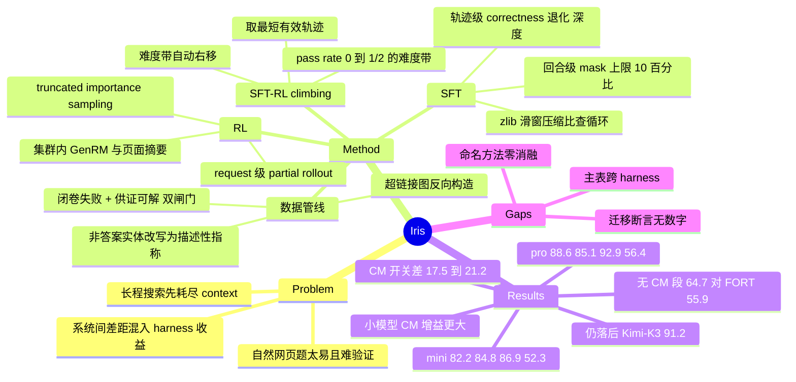

## Summary

Iris 是 35B-A3B 与 397B-A17B 两档 search agent 的技术报告：训练数据从 web 超链接图反向构造多跳题（把非答案实体全部改写成描述性指称、只保留 reference model 闭卷答错但给证据能答对的题），训练用 SFT 与 live-search RL 交替的 SFT–RL climbing。真正有校准价值的不是分数，而是它固定 tool set / context limit / judge、把 inference-time context management（CM）开关单独拆出来报告——同一模型在 BrowseComp 上开关 CM 的差距达 17.5 至 21.2 分，是它对同尺度最强开源对手 3.4 至 3.8 分领先的五倍以上。

## Problem & Motivation

论文的出发点不是"再涨几分"，而是一个测量问题：当前 search agent 之间报告出来的差距，有多少来自 policy，有多少来自 inference-time harness。长程搜索会在 agent 解完所有约束之前耗尽 context，使得有效搜索预算远小于名义 context window；现有系统用 trajectory summarization、state compression、选择性历史删除或整体 reset 来补救，而这些手段的收益在多数论文里与模型能力混在同一个数字里报告。作者的立场是 CM 应当被视为 inference system 的一部分而非实现细节，只报 managed-context 结果会掩盖能力来源。

第二个问题在数据侧：自然网页问题对训练来说太容易，人工出题贵且不可扩展。已有做法沿超链接图或知识图遍历并遮蔽路径上的实体（WebSailor / WebShaper / DeepDive 一支），但遮蔽后的题仍可能被字符串匹配绕过，或者根本没有唯一可验证答案。

## Method

### 1. 数据管线：从超链接图反向构造

三阶段。**Web-graph construction**：把语料建成有向图 G=(V,E)，节点是页面、边是超链接；用 answer-anchored 模式先固定目标答案实体再取描述它的页面作为 seed v0，沿 out-link 展开成局部子图 G_sub，页面全文按固定预算截断。由于 reader 服务会剥掉行内 anchor，作者用语料的 RDF 三元组镜像加上渲染后的页面 markup 两路合并来恢复真实 out-link 集合。

**Task synthesis**：先把 G_sub 蒸馏成紧凑实体图 G_e=(V_e,R_e)，只保留位于通往 seed 主题的多跳路径上的实体与关系；再在 G_e 上生成初始问题与推理路径 (q0, P)，硬约束 |P| ≥ N 且答案 y 不出现在 q0 中；最后用 abstraction operator A 把每个非答案实体重写成描述性指称，要求 name(e) 与 alias(e) 都不出现在 A(e) 里且 A(e) 唯一确定 e。这一步是与遮蔽式做法的关键差别——遮蔽留下空位，改写则要求 agent 先做消歧再检索。

**Dual-criteria verification**：同一个 reference model 跑两遍，闭卷答错（difficulty）且喂入 G_e 后答对（solvability），两者同时成立才收题。solvability 用实体图而不是"答案在网上存在"作为 oracle，条件更严。

### 2. SFT：轨迹级粗筛 + 回合级细筛

teacher M_T 在 ReAct 范式下用工具集 {search, scrape} 解题，每个 observation 是当场生成的文档级摘要而非原始页面。

**粗筛**三个闸门：correctness（成功终止且 LLM judge 判对）、non-degeneracy、non-trivial depth（工具调用轮数 ≥ K）。退化检测的主检测器是滑窗 zlib 压缩比 ρ_cr(w) = |w| / |zlib(w)|，任何窗口超过阈值即判为循环——重复文本压缩率远高于流畅文本，因此这个 O(n) 检测器与循环周期和起点无关；辅助检测器补上周期性重复行、长单字符串、参数逐字节相同的连续工具调用。最后按完整 message 序列做逐字节去重。

**细筛**处理"整条轨迹对、但某一回合差"的情况。难点在于孤立看起来浪费的一步往往是合法探索，且流程里没有人。作者的做法是让 judge 先自由批评一批轨迹，把反复出现的失败模式归纳成显式 rubric 再用于最终判分——rubric 由数据诱导而非手写。judge 对每个 assistant 回合输出 keep/mask，单条轨迹最多 mask 10% 的回合；被 mask 的回合仍留在 context 里但不进 loss。训练目标是带 per-turn mask 的 teacher forcing，observation / user / system token 天然零 loss，可见历史由 harness 的 replay operator 从 append-only 会话重建，保证与推理时逐字节一致。

### 3. RL：request-level partial rollout + 集群内 GenRM

group-relative policy gradient，对 live search 训练。长程 rollout 有重尾，少数会话拖住同步步；作者不在 task 级流式丢弃，而是在 **request 级**中断：一步提交够数后中止 over-sampled 的在飞会话，下一步从已提交前缀恢复。rollout 组织成一片森林，节点是 message state，各自缓存 token、loss mask、log-prob 与权重版本差；恢复的轨迹因此是拼接了不同 policy 权重下前缀的一条路径，用 truncated importance sampling 校正，代价是约 2 倍 over-sampling 的余量。

reward 与摘要都不走外部 API：训练集群内与 actor / rollout 引擎并置若干 in-house Qwen3.5-397B-A17B 的 FP8 引擎，一方面作 GenRM 对抽取出的答案给二值判定（不加 format 项，因为空答案或被截断的答案抽取为空、不调 judge 就已经是 0），另一方面把每个检索页压成 query-relevant 摘要作为 observation。作者明确声明这是 rollout 中**唯一**的 context 削减机制，没有 message history 剪枝也没有滑窗，因此 policy 条件的 context 与被训练的 context 完全一致。

### 4. SFT–RL climbing

每一轮 RL 之后，把少量高质量 rollout 蒸馏回 policy 再继续 RL，一个循环称为一次 climb。选题条件是组内 pass rate 满足 0 < R̄(q) ≤ 1/2（可解但不稳定），成功 rollout 中要求工具轮数 ≥ K_rft，再取工具轮数**最短**的那条。深度约束滤掉侥幸解，最短约束抑制冗余搜索。难度带由当前 policy 的 pass rate 定义，因此随 policy 变强自动右移，构成自定步长的 curriculum，候选池枯竭即为天然停止信号。论文写"更多细节将在未来发布"。

### 5. 评测协议

Iris-mini 从 Qwen3.6-35B-A3B 初始化、Iris-pro 从 Qwen3.5-397B-A17B 初始化，均为 MoE、256K context；SFT 训 2 epoch、global batch 64、最大序列长度 262,144；RL 用开源 Relax 框架。防泄漏在三处拦截 huggingface.co/datasets 与 huggingface.co/spaces：搜索结果里剔除、scrape 时拒绝、以及 tool manager 里的事后 guard（覆盖模型凭记忆直接给出 URL 的情况）。评测为单次 rollout 的 pass@1，用各 benchmark 官方 prompt 的 LLM judge，DeepSearchQA 用 F1、其余用 accuracy，HLE 取 text-only 子集，全部 benchmark 共享同一套工具集、context 上限与最大轮数预算。

## Key Results

**主表（Table 1，各系统均开 CM；Iris 一律报 discard-all）**

| Model | Size | BrowseComp | BrowseComp-ZH | DeepSearchQA | HLE |
|:--|:--|:--|:--|:--|:--|
| Agents-A1 | 35B | 75.5 | – | – | 47.6 |
| Apodex-1.0-mini | 35B | 71.5 | 80.6 | 82.2 | 46.8 |
| XYZ-Aquila-mini | 35B | 78.8 | 82.9 | **89.5** | 51.1 |
| **Iris-mini** | 35B | **82.2** | **84.8** | 86.9 | **52.3** |
| Nex-N2-Pro | 397B | 83.7 | 79.6 | 92.3 | 50.0 |
| XYZ-Aquila-pro | 397B | 84.8 | 85.1 | 92.5 | 53.3 |
| **Iris-pro** | 397B | **88.6** | **85.1** | **92.9** | **56.4** |
| Kimi-K3 | 2.8T | 91.2 | – | 95.0 | 56.0 |
| Apodex-1.0-H | – | 90.3 | 84.1 | 94.4 | 60.8 |
| Claude Fable 5 | – | 88.0 | – | 94.2 | 64.5 |

- 35B 段 Iris-mini 拿下四项中的三项，BrowseComp 超同段最强的 XYZ-Aquila-mini 3.4 分（82.2 vs 78.8），但 DeepSearchQA 的 86.9 低于对方的 89.5——这一项论文正文明确写出。
- 397B 段 Iris-pro 四项领先或持平：BrowseComp 超 XYZ-Aquila-pro 3.8 分、HLE 超 3.1 分、DeepSearchQA 最高 92.9、BrowseComp-ZH 与对方并列 85.1。
- 作者自陈仍落后最强 frontier / heavy-compute 系统（Kimi-K3 BrowseComp 91.2 与 DeepSearchQA 95.0、Apodex-1.0-H HLE 60.8、Claude Fable 5 HLE 64.5）。

**CM 消融（Table 2）——本文最有信息量的一张表**

| 配置 | BrowseComp | BrowseComp-ZH | DeepSearchQA | HLE |
|:--|:--|:--|:--|:--|
| Iris-mini w/o CM | 64.7 | 72.3 | 81.0 | 43.2 |
| Iris-mini discard-all | 82.2 (+17.5) | 84.8 (+12.5) | 86.9 (+5.9) | 52.3 (+9.1) |
| Iris-mini discard-all + retry | 85.9 (+21.2) | 85.1 (+12.8) | 89.9 (+8.9) | 52.4 (+9.2) |
| Iris-pro w/o CM | 72.6 | 76.8 | 86.4 | 50.8 |
| Iris-pro discard-all | 88.6 (+16.0) | 85.1 (+8.3) | 92.9 (+6.5) | 56.4 (+5.6) |
| Iris-pro discard-all + retry | 90.3 (+17.7) | 85.1 (+8.3) | 93.4 (+7.0) | 56.6 (+5.8) |

- **CM 的效应量远大于系统间差距**。Iris-mini 在 BrowseComp 上开关 CM 差 17.5 分（加 retry 21.2 分），而它对同段最强对手的领先只有 3.4 分。同一模型的两个 regime 分数（64.7 → 82.2）横跨了 Table 1 中 30–35B 整段的分布（67.9 → 82.2）。
- **小模型从 CM 受益更多**：mini 的四项增益 17.5 / 12.5 / 5.9 / 9.1 全面高于 pro 的 16.0 / 8.3 / 6.5 / 5.6。作者的解释是预算大小相同、消耗速度不同——小模型解同一组约束需要更多步，更常触顶，CM 能捞回的也更多。
- **增益排序由"多久耗尽 context"决定，不由 headroom 决定**：HLE 的 no-CM 基线最低（43.2）却增益小于 BrowseComp，因为 HLE 的缺口是领域知识而非 context，延长搜索视野收不回多少。这是一个可证伪的机制断言而非事后合理化。
- **无 CM 对照**：Iris-mini 的 64.7 / 72.3 高于同样报告无 CM 结果的 FORT-Searcher（55.9 / 62.1）、OpenSeeker-v2（46.0 / 58.1）、REDSearcher（42.1 / 49.8）；Iris-pro 再高 7.9 / 4.5 分。
- **BrowseComp-ZH 的天花板信号**：三个配置（mini discard-all+retry、pro discard-all、pro discard-all+retry）落在完全相同的 85.1，在 289 题上即 246 题正确，作者据此推断剩余性能受模型容量以外的因素约束。Appendix A 给出佐证：BrowseComp-ZH 第 85 题官方答案为 Lannister，而按剧情 Sansa Stark 的第二次正式婚姻对象是 Ramsay Bolton，系统答 Bolton 被判错。
- **retry 被主动排除在 headline 之外**：discard-all + retry 在多数设置下最好并把 Iris-pro 推过 90（BrowseComp 90.3），但每次 retry 要再跑一整轮搜索，作者因此在 Table 1 一律报 discard-all。

## Evidence Ledger

| Claim ID | Claim | Type | Source locator | Evidence excerpt | Status |
|:--|:--|:--|:--|:--|:--|
| C1 | discard-all 下 Iris-mini 82.2/84.8/86.9/52.3、Iris-pro 88.6/85.1/92.9/56.4（BrowseComp / BC-ZH / DeepSearchQA / HLE） | number | Abstract; Table 1 | "the two models reach 82.2/84.8/86.9/52.3 and 88.6/85.1/92.9/56.4" | source-verified |
| C2 | 无 CM 时 Iris-mini 64.7/72.3/81.0/43.2、Iris-pro 72.6/76.8/86.4/50.8 | number | Table 2 | "Iris-mini (35B) w/o 64.7 72.3 81.0 43.2 ... Iris-pro (397B) w/o 72.6 76.8 86.4 50.8" | source-verified |
| C3 | CM 增益 mini 大于 pro：BrowseComp +17.5 / +21.2 对 +16.0 / +17.7 | number | Table 2; §4.3 | "discard-all 82.2 (+17.5) ... discard-all + retry 85.9 (+21.2)" | source-verified |
| C4 | Iris-mini BrowseComp 超 XYZ-Aquila-mini 3.4 分但 DeepSearchQA 低于其 89.5；Iris-pro 超 3.8 / 3.1 分、BC-ZH 并列 85.1 | comparison | §4.2; Table 1 | "outperforms ... by 3.4 points (82.2 vs. 78.8). On DeepSearchQA ... 86.9, which remains below XYZ-Aquila-mini (89.5)" | source-verified |
| C5 | 全部结果来自单个 ReAct agent，无 sub-agent、无 test-time verification | benchmark-setting | Abstract | "All results come from a single ReAct agent, with no sub-agents and no test-time verification." | source-verified |
| C6 | 作者自陈仍落后最强 frontier 系统；Table 1 frontier 段含 Kimi-K3 91.2 / 95.0、Apodex-1.0-H 94.4 / 60.8、Claude Fable 5 64.5 | comparison | §4.2; Table 1 frontier 段 | "our models still leave a gap relative to the most capable frontier systems" | source-verified |
| C7 | 非答案实体全部改写为描述性指称；只收 reference model 闭卷失败、给证据后答对的题 | causal-mechanism | Abstract; §2.2 Eq.(6); §2.3 Eqs.(8)-(9) | "rewrite every non-answer entity into a descriptive reference ... admit only questions that a reference model fails closed-book yet solves once the supporting evidence is supplied" | source-verified |
| C8 | 回合级细筛 rubric 由数据诱导，单轨迹最多 mask 10% 回合，被 mask 回合留在 context 但不进 loss | benchmark-setting | §3.1 Fine filtering | "we mask at most 10% of the assistant turns in any trajectory. Masked turns remain in the context but are excluded from the training loss" | source-verified |
| C9 | 退化检测主检测器为滑窗 zlib 压缩比；另要求工具轮数 ≥ K | causal-mechanism | §3.1 Coarse filtering, Eqs.(12)-(13) | "Our primary detector is a sliding-window compression ratio ... keep only trajectories with at least K tool-call turns" | source-verified |
| C10 | climbing 选 0 < R̄(q) ≤ 1/2、工具轮数 ≥ K_rft、取最短有效轨迹；难度带随 policy 变强自动右移 | causal-mechanism | §3.3, Eq.(17) | "We select queries with 0<R̄(q)≤1/2 ... require at least K_rft tool-call turns and then select the shortest valid trajectory" | source-verified |
| C11 | 超长 rollout 在 request 级中断、从已提交前缀恢复，用 truncated importance sampling 校正，代价约 2 倍 over-sampling | causal-mechanism | §3.2 Partial rollout | "we interrupt at the request level ... resumed at the next step from their committed prefix ... roughly 2× over-sampling as headroom" | source-verified |
| C12 | 集群内 FP8 Qwen3.5-397B-A17B 同时作 GenRM（二值、无 format 项）与页面摘要器；摘要是 rollout 中唯一的 context 削减机制 | causal-mechanism | §3.2, Eq.(16) | "only context-reduction mechanism in the rollout, with no message-history pruning or sliding window" | source-verified |
| C13 | 初始化自 Qwen3.6-35B-A3B / Qwen3.5-397B-A17B，256K context；SFT 2 epoch、batch 64、序列长 262,144；RL 用开源 Relax；工具集 {search, scrape} | benchmark-setting | §4.1; §3.1 Eq.(10) | "two epochs with a global batch size of 64 and a maximum sequence length of 262,144 tokens ... Relax framework" | source-verified |
| C14 | 封锁 huggingface.co/datasets 与 /spaces，在搜索结果、scrape、tool manager 事后 guard 三处执行 | benchmark-setting | §4.1 | "enforced at three points: removed from search results, refused on scrape, and caught by a post-hoc guard" | source-verified |
| C15 | 三个配置在 BrowseComp-ZH 同为 85.1，对应 289 题中 246 题正确；作者称受模型容量以外因素约束 | number | §4.3 | "Three configurations land on exactly the same score of 85.1 ... 289 questions this corresponds to 246 correct answers" | source-verified |
| C16 | 单次 rollout pass@1，官方 prompt 的 LLM judge；DeepSearchQA 用 F1、其余用 accuracy；HLE 为 text-only 子集 | benchmark-setting | §4.1 Evaluation Protocol / Benchmarks | "single rollout (pass@1) ... DeepSearchQA is evaluated using F1"; "We evaluate the text-only subset of HLE" | source-verified |
| C17 | 声称搜索数据与搜索专用 teacher 正向迁移到 BFCL / τ-bench / OfficeQA / APEX，但**全文未给任何数字、表格或 setup** | sota-novelty | §5 Conclusion | "transferred positively to domains that were not explicitly targeted, including General Tool Use (BFCL and τ-bench) and Cowork" | source-verified（迁移为定性断言，无量化证据） |
| C18 | Appendix A 记录 BrowseComp-ZH 第 85 题官方答案 Lannister 与论文认定的 Bolton 冲突 | benchmark-setting | Appendix A; Figure 2 | "the official ground truth is Lannister, whereas our search agent returns Bolton" | source-verified |
| C19 | 作者 9 人、署名团队为 AllSpark Team；arXiv v1 提交 2026-09-03，正文标注 September 4, 2026；**全文未列任何机构 affiliation** | license-code | §6 Contributions; arXiv abs 页 | "Date: September 4, 2026" | source-verified（无大学/公司/实验室署名） |
| C20 | 资源为 github.com/AllSpark-Research/Iris 与 huggingface.co/collections/AllSpark-Research/iris；权重为**计划发布**而非已发布 | license-code | Header Resources; Abstract | "We plan to release the model weights together with the complete recipe" | source-verified |

## Strengths & Weaknesses

**已知**

1. **把 harness 与 policy 的归因缺口从暗处搬到台面上，是本文超出模型本身的贡献。** 固定 tool set、context 上限、轮数预算与 judge，只切换 CM 开关，得到的差值（BrowseComp 上 17.5 至 21.2 分）比它对同尺度最强开源对手的领先（3.4 至 3.8 分）大五倍以上。这个比例本身就是论文摘要那句"CM is worth more than most reported differences between systems"的定量兑现，且完全可从它自己的两张表读出。
2. **CM 增益的排序有机制解释而非事后合理化。** 作者明确指出增益顺序不由 headroom 决定：HLE 的 no-CM 基线最低（43.2）却增益最小，因为它的缺口是领域知识而非 context 耗尽；BrowseComp 需要跨多步反复检索、过滤、整合，历史增长本身成为约束，reset 掉工具历史就等于在同一题上买到额外搜索。这个解释可被证伪——只要找到一个"低基线且低步数"的 benchmark 就能检验。
3. **小模型 CM 增益更大的解释同样是机制性的**：预算相同、消耗速度不同。这与 vault 中 [[2605-MaskingRegimeMap]] 的 regime 倒 U（弱/中/饱和三段）在结论形态上一致，但轴不同——后者的轴是 retriever recall × 模型隐式过滤能力，Iris 的轴是每题步数。两者可以合成一个更完整的条件命题。
4. **数据侧的两个闸门比同族做法更严。** anchor abstraction 要求 name 与 alias 都不出现且指称唯一，比"遮蔽实体留空位"更彻底地封死字符串匹配捷径；solvability 判据用蒸馏出的实体图 G_e 作为供证上下文，比"答案在网上某处存在"是更强的可解性保证。
5. **报告纪律**：discard-all + retry 在多数设置更好且能把 Iris-pro 推过 90，作者仍以 discard-all 作为 headline 配置，理由是 retry 每次要再跑一整轮搜索。同样地，35B 段输掉的 DeepSearchQA 一项在正文明写。Appendix A 主动披露 benchmark 标注错误而非只当作噪声。
6. **零退化检测用 zlib 压缩比是个务实设计**：O(n)、与循环周期和起点无关、不需要模型调用，比逐 n-gram 匹配更适合放进大规模轨迹筛选管线。

**推测**

1. **本文对别人提出的公平性要求，没有施加到自己的主表上。** Table 1 标注"各系统均开 CM"，但各系统的 CM 策略并不相同——论文自己说明 XYZ-Aquila 在 BrowseComp-ZH 上用了 reverify 与 reanswer，而 Iris 明确不用；表注还说明部分数字是 XYZ-Aquila Team 复现的。也就是说 Table 1 恰好是跨 harness、跨 search backend、跨抓取日期的比较，+3.4 / +3.8 这两个 headline 边际带着的正是全文所批评的那种混淆。真正 apples-to-apples 的只有 Table 2 内部的自比与无 CM 段的三个 30B 对照。
2. **无 CM 段没有同尺度对手。** 报告了 no-CM 结果的只有 OpenSeeker-v2、REDSearcher、FORT-Searcher 三个 30B 系统，400B 段一个都没有，因此"优势在两种 regime 下都保持"这句话对 Iris-pro 没有直接支撑。
3. **命名方法全部没有消融。** 全文只有两张表：Table 1 是端到端总分，Table 2 是 CM 消融。anchor abstraction、dual-criteria verification、回合级细筛（10% 上限）、partial rollout、以及标题里的 SFT–RL climbing，没有任何一项有受控对照——尤其 climbing 与"单趟 SFT 再 RL"的差值完全缺失。按本方向近期的经验（[[2608-ABSeeker]] 的 +18.0 归 CM 而方法净增益 +3.8、[[2606-SenseSearch]] 的 RL 只占约 15%、[[2607-SESA]] 的 memory-off 对照），未做拆分的头条归因应按未验证处理；本文自己那张 CM 表恰恰是这条经验最有力的新证据，却没有把同样的刀口对准 climbing。
4. **统计基础偏薄。** 单次 rollout pass@1、无种子、无误差棒。BrowseComp-ZH 只有 289 题，3.x 分约等于 9 至 10 题；BrowseComp 按 [[2504-BrowseComp]] 是 1266 题，3.4 分约 43 题，相对更稳。BC-ZH 上的领先与并列都应当按噪声量级读。
5. **三配置同为 85.1 推不出"受容量以外因素约束"。** 246/289 只说明分数相同，论文没有检查这三次是否答对同一批题；分数相同、题集不同同样可能。天花板的更直接证据其实是 Appendix A 那类标注错误，而它只给了一个案例。

**不知道**

- 训练规模全部缺失：合成题数量、SFT 轨迹条数、RL 步数、climbing 轮数一概未给；超参 N、K、K_rft、τ_cr、|V_e| 上限 n、out-link 采样数 k 全部保持符号形式，论文写"更多细节将在未来发布"。这份报告目前不足以复现。
- teacher M_T 从头到尾只称"a strong teacher"，未点名。若 teacher 是闭源前沿系统，"开源 recipe"的成色需要另算。
- 成本与延迟完全没有量化。只有一句定性说 retry 贵；no-CM 与各 CM 配置的 token 消耗、平均轮数、wall-clock 均未报，因此"discard-all 是默认配置"这个选择在成本口径上无法审计。
- 跨域迁移（BFCL、τ-bench、OfficeQA、APEX）没有任何数字、表格或实验设置，却承载了全文最大的概念主张——"search 更像 atomic capability 而非垂直专精"。这条只能当假说读。
- 污染只封了 huggingface.co 的两个域，对 base model（Qwen3.6 / Qwen3.5）自身的 benchmark 污染没有审计；BrowseComp 题目在博客、GitHub 镜像里同样流通。
- 权重与数据管线仍是"计划发布"，GitHub 与 HuggingFace collection 页面存在但发布状态未在论文中说明。

## Mind Map

## Connections

- [[WebAgent-Survey]] — 本方向的 canonical 专题。Iris 直接补强 §2「训练信号」的归因分解链与 §5「Context 管理」两节：它是该链条上第一个**由作者自己**把 harness 收益拆出来、并主张这应成为报告规范的工作，与 [[2608-ABSeeker]]（+18.0 归 CM、方法净增益 +3.8）、[[2606-SenseSearch]]（RL 只占约 15%）、[[2607-SESA]]（memory-off 对照）构成同一 pattern 的第四个数据点，但方向相反——前三个是被读者拆出来的隐藏归因缺口，Iris 是把拆分本身当作方法学卖点。
- [[AgentHarness-Design]] — 第 4 节「预算口径」审计的十项工作里只有一项 headline 建立在算力对齐对照上。Iris 的 Table 2 提供了一个新的口径样本：同模型、同工具集、同 context 上限、同 judge，只切 CM，因此它是该节意义上罕见的干净对照；但它的 Table 1 恰好落进该节点名的"基线错位"形态（跨 harness、部分数字来自第三方复现）。两者可以并列写进该 Topic 的口径审计表。
- [[2603-AgentSwing]] — 论证"最好的静态 CM 策略随 backbone 与 benchmark 换人"（GPT-OSS-120B 上 Keep-Last-N 52.5、DeepSeek-v3.2 上 Discard-All 58.0、HLE 上 Summary 43.5）。Iris 选择在所有 benchmark 上统一用 discard-all 并明确反对按 benchmark 定制 CM，两者是同一问题上的对立立场：AgentSwing 主张按状态路由，Iris 主张统一口径优先于分数最大化。
- [[2510-ContextFolding]] / [[2510-MemAct]] — learned context management 的两种 formulation（结构化折叠 / 可学习编辑动作）。Iris 走的是相反路径：训练期只允许页面摘要这一种削减、不做历史剪枝，把 CM 完全推到推理期。这构成一个此前没有的对照——训练/推理 CM 的分工位置本身是设计变量。
- [[2605-MaskingRegimeMap]] — CM 增益的 regime 依赖性。Iris 的"小模型增益更大、由每题步数而非预算大小决定"是该 regime map 的一个新轴，两者可合并成条件命题。
- [[2507-WebSailor]] / [[2509-WebSailorV2]] — 图遍历 + 实体遮蔽式任务合成的前作。Iris 的 anchor abstraction（改写为唯一指称）与 dual-criteria verification（实体图作供证 oracle）是这条路线上的两处收紧。
- [[2606-AgentsA1]] — Iris Table 1 中的 Agents-A1 35B（BrowseComp 75.5 / HLE 47.6），与该笔记记录的数字一致。两篇都在论证"35B 可以逼近万亿级"，但 AgentsA1 的 headline 在 BrowseComp / HLE 上落后，Iris 在同两项上反超，可作为该论断的时间序列证据。
- [[2607-KimiK3]] — Table 1 frontier 段的 Kimi-K3（BrowseComp 91.2 / DeepSearchQA 95.0），且该笔记 C12 已记录 K3 的 91.2 用了 300K 触发的 compaction、满 1M context 不做管理时为 90.4。Iris 的 CM 论点与 K3 那条被作者放进配置说明里的对比是同一现象的两次独立观测。
- [[2608-Apodex11]] — Table 1 中 Apodex-1.0 / Apodex-1.0-H 的后续版本，可用于核对该系列在同批 benchmark 上的演进。
- [[2504-BrowseComp]] / [[2606-KBrowseComp]] — benchmark 侧。Iris Appendix A 的标注错误案例，与 KBrowseComp 暴露的非英语检索鸿沟，共同指向 BrowseComp-ZH 一类本地化变体的标注质量问题。
- [[2604-DeepSeekV4]] / [[2506-DeepResearchAgents]] — discard-all 策略源自 DeepSeek-V3.2；后者提供该方向的系统 taxonomy。
- [[StepCreditAssignment-Survey]] — Iris 的回合级 fine filtering（judge 打 keep/mask、10% 上限、masked 回合留 context 不进 loss）是"把 trajectory 级标签下沉到回合级"的又一种实现，属于 SFT 侧而非 RL 侧，可补进该专题作为与 [[2608-ABSeeker]] step reward 路线并列的另一支。

## Notes

- **最值得带走的一条**：本文给了 search agent 领域一个可直接复用的报告规范——固定 tool set / context 上限 / 轮数预算 / judge，同时报 with-CM 与 without-CM 两个数。理由不是"更严谨"这种口号，而是它自己表里那个五倍的比例：harness 效应 17.5 分 vs 系统间差距 3.4 分。任何只报单一 regime 的结果，读者都无法判断读到的是 policy 还是 wrapper。
- **一个立即可做的检验**：论文断言 CM 增益的排序由"会话多久耗尽 context"决定而非由 headroom 决定，证据是 HLE（基线最低但增益小）与 BrowseComp（增益最大）的反差。这个断言只需要一个新变量就能证伪——记录每个 benchmark 上触顶会话的比例，看它是否与增益单调对应。论文有这份数据（它必须知道何时触发 discard-all）却没有报，是最可惜的一处缺口。
- **一处方法学空白**：climbing 的选题条件（0 < R̄(q) ≤ 1/2 加最短轨迹）与 rejection sampling fine-tuning 的常见配方高度重合，本文的新意主要在"难度带随 policy 自动右移"这一自定步长性质。但没有消融就无法区分收益来自 climbing 结构本身、还是仅仅来自多做了几轮 on-policy 数据的 SFT。这是一个成本很低的对照（同预算下 climbing vs 单趟 SFT+RL），值得在 repo 放出后优先看有没有。
- **署名信息异常**：全文没有列出任何机构 affiliation，只有团队名 AllSpark Team 与 GitHub 组织 AllSpark-Research；主表里最关键的对手 XYZ-Aquila 也只引到一份 github.com/XYZ-AI-Lab 的技术报告、无 arXiv id。这不影响数字本身的可读性，但意味着 +3.4 / +3.8 这两个 headline 边际短期内难以第三方审计。
- **repo 待挖**：github.com/AllSpark-Research/Iris 与 huggingface.co/collections/AllSpark-Research/iris 均可访问（HTTP 200），权重按论文说法尚为"计划发布"。数据管线（RDF 镜像 + 页面 markup 合并恢复 out-link、anchor abstraction 的 prompt、zlib 退化检测阈值）与 RL 侧的 request-level partial rollout 实现都属于"贡献主要在实现里"的部分，适合另起一轮 repo-digest。
