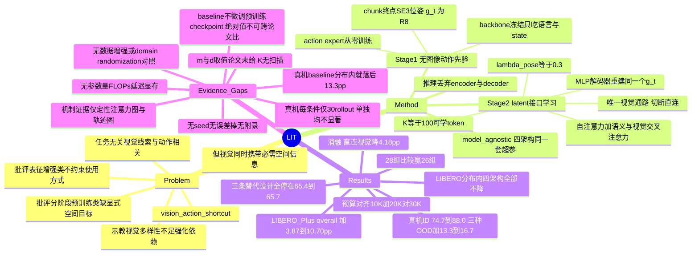

## Summary

把 VLA/WAM 在视觉分布偏移下的崩塌归因为 action expert 直接吃 visual token 学到的 vision–action shortcut，对策是两阶段换掉"接口"而不换模型：Stage 1 冻结 backbone、完全不给图像，只用 language + robot state + 每个 action chunk 终点的 SE(3) 末端位姿（`g_t ∈ R^8`）从零训练 action expert；Stage 2 让 K=100 个可学 latent token 成为 action expert **唯一**的视觉通路，并用一个 MLP decoder 从这些 token 重建同一个终点位姿作为监督（λ_pose=0.3）。在 π0.5 / MolmoAct2 / FAST-WAM / ImageWAM 四个架构上 LIBERO-Plus zero-shot overall 提升 3.87–10.70pp（28 组"架构×扰动"赢 26 组），LIBERO 分布内平均不降反升，真机三任务 ID 74.7→88.0、三种 OOD 各 +13.3~16.7pp。全文最硬的部分不是数字而是消融设计——单给 baseline 加 pose 监督只到 65.45、单用 latent token 聚合只到 65.70、LA4VLA 式两阶段只到 65.46，都离 LIT 的 71.92 有 6pp 以上，把"这就是个 Q-Former"和"这就是两阶段训练"两种简单解释一起挡掉了；但真机每个 OOD 条件只有 30 次 rollout，且作者自陈 baseline 因不微调预训练 policy checkpoint 而与已发表数字不可比。

## Problem & Motivation

问题 formulation 是这篇最值得抄的地方。现有 robot foundation model（无论 VLA 还是 WAM）的通用结构是"预训练 backbone + embodiment-specific action expert"，视觉表征与语言、robot state 一起直接条件化 action expert。作者把由此产生的失效命名为 **vision–action shortcut**：在训练分布内，一些与任务无关的视觉线索恰好与示教动作相关，action expert 会去利用它们；示教数据视觉多样性有限会进一步强化这种依赖；一旦视角、外观或传感条件变化，这些相关性失效，策略随之崩塌（§I）。

但作者紧接着把问题收窄到一个更有意思的张力上：视觉表征**同时**编码了动作生成必需的 task-relevant 空间信息。所以目标不是"少看图"，而是"降低对 task-irrelevant 视觉变化的敏感度、同时保住对 task-relevant 变化的响应"。这一句把这篇与单纯做 visual robustness 的工作区分开了——它要求方法在 Object Layout 这类"视觉变了、动作也**应该**变"的扰动上不能退化，而 Table II 里这一轴的四架构平均增益是 +8.56pp，排第三，仅次于 Camera Viewpoints（+15.21）与 Sensor Noise（+13.50）（按轴平均为本笔记作者据 Table II 计算）。

对现有两条路线的批评也落在实处：
- **表征增强类**（SpatialVLA、TraceVLA、MolmoAct 的 depth token 等）"丰富了可用信息，但没有约束 action expert 如何使用这些信息"，shortcut 的空间原样保留；
- **分阶段 action 预训练类**（Qwen-VLA、LA4VLA）先学 language-conditioned action prior 再引入视觉，但 (a) 预训练阶段缺少每个 action chunk 的显式空间目标，(b) 后续引入视觉时不加任何约束——"image-free 预训练本身并不能阻止视觉条件一接入就重新产生 shortcut"。

这两条批评直接决定了方法的两个组件，而且论文用消融把它们各自证伪了一遍（见 Key Results 的 alternative designs 三行）。这是全文论证结构最干净的一处：动机里点名的两条既有路线，在消融表里都有对应的实现变体作为对照。

在 vault 里，这个失效现象已经有三种不同命名与定位：[[2608-CofactVLA]] 叫 vision-override，把它写成 backdoor path `I⇢C→A`；[[2608-GSRParaVLA]] 用因果干预证明任务语义在语言主干里保住了、坏在动作策略对 joint V-L 编码漂移过度敏感；[[2606-AffordanceFieldInterventio]] 叫 Memory Trap。LIT 的定位与 GSR 最接近——都认为病根在"视觉与动作之间的耦合方式"而非表征本身——但 GSR 换的是语义源与注入点，LIT 换的是视觉通路的宽度与监督信号。

## Method

### Stage 1：Spatial-Goal-Conditioned Action Pretraining（无图像）

冻结的 backbone 只处理 language instruction 与 robot state，产出各 coupling layer 的表征 `H^sem`。每条示教 action chunk 的**终点** robot state 被取作 goal：

```
g_t = [p_{t+H}; r_{t+H}; q_{t+H}] ∈ R^8
      p ∈ R^3  world-frame 末端位置
      r ∈ R^3  axis-angle 姿态
      q ∈ R^2  gripper 关节
```

一个三层 GELU MLP 把 `g_t` 编成 goal token `G_t`，与 backbone 表征拼接后 `C_{ℓ,t} = [H^sem_{ℓ,t}; G_t]`，通过各架构原生的条件化机制喂给 action expert。训练目标沿用宿主框架自己的 action loss（这里是 flow matching），**只更新 action expert 参数 θ 与 SE(3) encoder 参数 η**，backbone 与模态 encoder 全程冻结。action expert 从随机初始化开始训练，训完的参数用于初始化 Stage 2。

关键设计是 `g_t` 的选取：不是整条轨迹、不是子目标语义，而是当前 chunk 的**终点位姿**。这让 prior 成为一个"给定当前状态与目标位姿，生成一段合理的到达动作"的模块——一个纯运动学意义上的、与场景外观完全无关的先验。

### Stage 2：Vision–Action Interface Learning

引入 `K=100` 个可学 latent token `Z^0 ∈ R^{K×d}`，在每个 coupling layer ℓ 依次做三步更新（latent token 始终作 query，backbone 表征作 key/value）：

```
Z̄  = Z_{ℓ-1} + SA_{q(ℓ)}(Z_{ℓ-1})                        自注意力
Z̃  = Z̄      + CA^sem_{q(ℓ)}(Z̄ ; H^sem_{ℓ})              语义交叉注意力
Z_ℓ = Z̃      + CA^vis_{q(ℓ)}(Z̃ ; H^vis_{ℓ})              视觉交叉注意力
```

参数效率上，每 `m` 个连续 coupling layer 共享一组接口注意力参数，索引 `q(ℓ) = ⌈ℓ/m⌉`（论文给的是符号，`m` 的具体取值正文未报）。更新后的 token 通过宿主架构的原生机制条件化对应层的 action expert，**并且是唯一的视觉输入来源**——原本 action expert 到 visual token 的直连被切断。

监督信号是这篇的核心：一个 MLP decoder 从最后一层 latent token 重建 Stage 1 用过的**同一个** `g_t`，`L_pose = ‖ĝ_t − g_t‖²`（在预处理后的 state 空间计算、对有效目标取平均），总损失 `L_stage2 = L_act + 0.3·L_pose`。Stage 2 联合优化 backbone、模态 encoder、action expert、latent token、接口注意力与 decoder（唯一全解冻的阶段）。

两个阶段共享同一个空间目标 `g_t`，这是"prior 学习"与"接口学习"之间的粘合剂：Stage 1 教会 action expert 如何**使用**终点位姿，Stage 2 则要求视觉通路必须**提供**同样的终点位姿。视觉被迫压成一个"我看到的场景意味着末端该去哪儿"的表示，而不是"我看到的像素长什么样"。

### 集成与推理

LIT 插在 backbone（VLM 或 video model）与 action expert 之间，保留宿主的 backbone/expert 架构、动作表示、预测 horizon 与动作生成目标。推理时 latent interface 保持激活，Stage 1 的 pose encoder 与 Stage 2 的 pose decoder 都被丢弃——**测试时不需要 goal pose**，策略只吃图像、语言、robot state（§III-D）。这一点很重要：`g_t` 是纯训练期的特权信号，从 teleop 数据的 proprioception 里免费拿到，不构成部署假设。

## Key Results

**分布内（Table I，LIBERO 40 任务 × 50 rollout = 2000 episode，%）**

| Architecture | Variant | Spatial | Object | Goal | Long | Avg |
|:--|:--|--:|--:|--:|--:|--:|
| π0.5 | Base | 88.60 | 93.40 | 89.20 | 79.80 | 87.75 |
| π0.5 | **LIT** | 90.20 | 98.80 | 93.40 | 84.80 | **91.80** |
| MolmoAct2 | Base | 93.00 | 97.80 | 95.40 | 87.80 | 93.50 |
| MolmoAct2 | **LIT** | 94.60 | 96.20 | 95.20 | 90.40 | **94.10** |
| FAST-WAM | Base | 98.20 | 100.00 | 97.00 | 95.20 | 97.60 |
| FAST-WAM | **LIT** | 98.80 | 99.80 | 98.40 | 95.40 | **98.10** |
| ImageWAM | Base | 98.40 | 100.00 | 97.60 | 96.40 | 98.10 |
| ImageWAM | **LIT** | 99.60 | 99.20 | 99.20 | 95.60 | **98.40** |

四个架构平均值全部不降。单 suite 有升有降（MolmoAct2 的 Object −1.6、ImageWAM 的 Long −0.8），符合"不牺牲 ID 换 OOD"的主张。

**零样本 OOD（Table II，LIBERO-Plus 全部 10,030 个扰动实例、每实例 1 rollout、固定 seed，%）**

| Perturbation | π0.5 Base→LIT | MolmoAct2 Base→LIT | FAST-WAM Base→LIT | ImageWAM Base→LIT |
|:--|:--|:--|:--|:--|
| Camera Viewpoints | 58.29→80.30 (+22.01) | 39.40→48.41 (+9.01) | 16.40→43.83 (+27.43) | 82.16→84.55 (+2.39) |
| Sensor Noise | 79.89→91.94 (+12.05) | 49.03→70.77 (+21.74) | 37.70→56.89 (+19.19) | 96.54→97.57 (+1.03) |
| Lighting | 82.40→90.11 (+7.71) | 84.86→85.64 (+0.78) | 78.20→83.89 (+5.69) | 97.65→97.99 (+0.34) |
| Background Textures | 85.32→86.99 (+1.67) | 89.78→94.42 (+4.64) | 53.70→57.22 (+3.52) | 88.26→94.24 (+5.98) |
| Robot Initial States | 60.71→63.71 (+3.00) | 50.71→59.03 (+8.32) | 44.50→48.86 (+4.36) | 47.81→60.19 (+12.38) |
| Object Layout | 64.00→73.11 (+9.11) | 55.90→71.61 (+15.71) | 60.70→64.17 (+3.47) | 77.72→83.67 (+5.95) |
| Language Instructions | 52.15→71.50 (+19.35) | 75.69→**73.58 (−2.11)** | 68.90→69.55 (+0.65) | 90.97→**90.05 (−0.92)** |
| **Overall** | **68.97→79.67 (+10.70)** | **63.62→71.92 (+8.30)** | **51.44→60.63 (+9.19)** | **83.02→86.89 (+3.87)** |

28 组比较赢 26 组，两处下降都在 Language Instructions 轴且不超过 2.11pp。Camera Viewpoints 与 Sensor Noise 两轴收益最大，与"减少对 nuisance 视觉相关性的依赖"一致；Object Layout 的大幅提升则是反方向的证据——空间信息没有被压掉。

**真机（§IV-D，MolmoAct2 单一架构，三任务多任务策略，300 条示教 / 每任务 100 条，ID 每任务 25 rollout、每个 OOD 条件每任务 10 rollout，%）**

| 条件 | Baseline | LIT | Δ | n（每条件） |
|:--|--:|--:|--:|--:|
| In-Distribution | 74.7 | 88.0 | +13.3 | 75 |
| Lighting OOD | 53.3 | 70.0 | +16.7 | 30 |
| Camera OOD（仅顶置相机） | 30.0 | 46.7 | +16.7 | 30 |
| Distractors OOD | 50.0 | 63.3 | +13.3 | 30 |

逐任务最戏剧的几格：Transfer egg 的 ID 52.0→92.0、Lighting OOD 30.0→90.0、Distractors OOD 20.0→90.0；Wipe trash 在 ID 持平的前提下 Camera OOD 从 10.0→80.0。

**消融（Table III，MolmoAct2，%）**

| 变体 | LIBERO (ID) | LIBERO-Plus Overall | 相对 LIT |
|:--|--:|--:|--:|
| MolmoAct2 baseline | 93.50 | 63.62 | −8.30 |
| *组件消融* | | | |
| LIT w/o Stage 1 | 93.70 | 68.23 | −3.69 |
| LIT w/o pose supervision | 93.50 | 68.86 | −3.06 |
| LIT w/ direct visual access | 94.25 | 67.74 | −4.18 |
| *替代设计* | | | |
| LIT w/o Stage 1 & pose supervision（≈ 纯 query-based 接口，如 VLA-Adapter） | 93.45 | 65.70 | −6.22 |
| LA4VLA-inspired staged training | 93.75 | 65.46 | −6.46 |
| Baseline w/ pose supervision | 93.20 | 65.45 | −6.47 |
| **LIT（完整）** | **94.10** | **71.92** | — |

三条"替代设计"行是全表的重点：它们分别对应"这只是个 Q-Former"、"这只是两阶段训练"、"这只是多加了个辅助监督"三种最自然的简单解释，三者单独用都只能拿到 65.4–65.7（比 baseline 高 1.8–2.1pp），离 71.92 差 6pp 以上。去掉 pose 监督时降幅最集中在 Sensor Noise（70.77→60.02，−10.75pp）与 Background Textures（94.42→88.38，−6.04pp），也就是最典型的"纯 nuisance"扰动轴。

**训练动态（Fig. 7，MolmoAct2）**：Stage 1 action loss 10K step 后降到 0.029；Stage 2 pose 重建 loss 20K step 后降到 0.003；LIT 在 20K 视觉训练 step 内达到的 action loss 低于 baseline 30K step 的终值，两者总预算相同（10K+20K vs 30K）。

**机制侧的证据是定性的**：Fig. 4 的 action-to-image 注意力可视化（LIT 的注意力在扰动下更稳定地集中在 robot–object 区域）与 Fig. 5 的反事实轨迹分析（加干扰物/模糊图像时 LIT 轨迹几乎不变；改变指令目标时 baseline 仍奔向原目标而 LIT 改道）都只有图、没有量化指标，论文自己的措辞也停在 "suggest" 与 "consistent with"（§IV-E1）。

## Evidence Ledger

| Claim ID | Claim | Type | Source locator | Evidence excerpt | Status |
|:--|:--|:--|:--|:--|:--|
| C1 | LIBERO-Plus Overall：π0.5 68.97→79.67、MolmoAct2 63.62→71.92、FAST-WAM 51.44→60.63、ImageWAM 83.02→86.89（+3.87~+10.70pp） | number | Table II "Overall" 行；Abstract | "68.97 \| 79.67 \| +10.70 … 63.62 \| 71.92 \| +8.30 … 51.44 \| 60.63 \| +9.19 … 83.02 \| 86.89 \| +3.87" | source-verified |
| C2 | LIBERO 分布内平均四个架构全部不降：87.75→91.80 / 93.50→94.10 / 97.60→98.10 / 98.10→98.40 | number | Table I "Avg." 列；§IV-B | "from 87.75% to 91.80% for π0.5, from 93.50% to 94.10% for MolmoAct2, from 97.60% to 98.10% for FAST-WAM" | source-verified |
| C3 | 真机三任务聚合：ID 74.7→88.0、Lighting 53.3→70.0、Camera 30.0→46.7、Distractors 50.0→63.3 | number | §IV-D | "LIT improves ID success from 74.7% to 88.0% … from 53.3% to 70.0% under Lighting OOD, from 30.0% to 46.7% under Camera OOD" | source-verified |
| C4 | 真机仅用 MolmoAct2，300 条示教（每任务 100）训单一多任务策略；ID 每任务 25 rollout（共 75），每个 OOD 条件每任务 10 rollout（OOD 共 90） | benchmark-setting | §IV-D | "we jointly train a single multi-task policy on 300 demonstrations, with 100 demonstrations per task"；"25 rollouts per task under ID conditions (75 rollouts total)" | source-verified |
| C5 | 作者明写不微调预训练 VLA/WAM policy checkpoint、action expert 随机初始化，故其 baseline 数字与已发表的微调结果不可直接比较 | benchmark-setting | §IV-A "Training Details" | "We do not fine-tune pretrained VLA or WAM policy checkpoints … Our baseline results are therefore not directly comparable to published results obtained by fine-tuning such checkpoints." | source-verified |
| C6 | 组件消融（MolmoAct2，OOD Overall）：完整 71.92；w/o Stage 1 68.23（−3.69）；w/o pose supervision 68.86（−3.06）；w/ direct visual access 67.74（−4.18） | number | Table III；§IV-E3 | "decreases from 71.92% to 68.23%. This 3.69-percentage-point decrease"；"to 68.86%, a reduction of 3.06"；"to 67.74% … 4.18-percentage-point" | source-verified |
| C7 | 替代设计：LA4VLA-inspired staged training 65.46（低 6.46pp）；Baseline w/ pose supervision 65.45（低 6.47pp）；w/o Stage 1 & pose supervision 65.70 | number | Table III；§IV-E3 | "increases from 63.62% for MolmoAct2 to 65.46%, but remains 6.46 percentage points below LIT"；"to 65.45% … 6.47 percentage points below LIT"；"reaches 65.70%" | source-verified |
| C8 | 训练预算对齐：LIT 用 10K Stage 1 + 20K Stage 2，与 baseline 30K 总预算相同 | benchmark-setting | Fig. 7 caption；§IV-A | "LIT uses 10K Stage 1 and 20K Stage 2 steps, matching the baseline's 30K-step total budget." | source-verified（**边界**：10K/20K/30K 只出现在 Fig. 7 的 MolmoAct2 caption；跨架构的预算对齐是定性表述 "Each baseline follows its architecture's native training budget"，其余三个架构的具体步数未报） |
| C9 | latent interface 是 action expert 唯一视觉通路；K=100；λ_pose=0.3；`g_t ∈ R^8` = 3D 位置 + 3D axis-angle + 2 维 gripper | causal-mechanism / number | §III-A Eq.(2)；§III-C | "learnable latent tokens shared across inputs, with K=100"；"We set λpose=0.3"；"g_t=[p;r;q] ∈ R^8"；"its only visual conditioning pathway" | source-verified |
| C10 | 推理期丢弃 Stage 1 pose encoder 与 Stage 2 pose decoder，策略只需图像、语言、robot state（不需要 goal pose） | causal-mechanism | §III-D；§III-A | "At inference, the latent interface remains active, while the Stage 1 pose encoder and Stage 2 pose decoder are omitted." | source-verified |
| C11 | 评测口径：LIBERO 40 任务 × 50 rollout = 2000 episode；LIBERO-Plus 全部 10,030 个扰动实例每个 1 rollout、固定 seed；Overall 为七轴非加权均值；全部模型只在原始 LIBERO 示教上训练、无适配 | benchmark-setting | §IV-A "Benchmarks and Evaluation Protocol" | "We conduct 50 rollouts per task, totaling 2,000 episodes"；"all 10,030 perturbed instances using one rollout per instance with a fixed evaluation seed" | source-verified |
| C12 | 28 组"架构×扰动"中 26 组提升，无一处下降超过 2.11pp；两处下降均在 Language Instructions（MolmoAct2 −2.11、ImageWAM −0.92） | comparison | §IV-C 末段；Table II | "LIT improves 26 of the 28 architecture–perturbation comparisons, with no decrease exceeding 2.11 percentage points" | source-verified |
| C13 | 全文（无附录，正文止于 References）无多 seed、无置信区间、无标准差/误差棒；唯一 seed 提及是评测固定 seed | benchmark-setting (negative) | 全文 §I-V 与全部表图 | "one rollout per instance with a fixed evaluation seed" 为唯一 seed 相关表述 | source-verified |
| C14 | 未与视觉数据增强/domain randomization 对比，也未与 OREO、Selective Visual Representations 等鲁棒性方法实证对比（仅 Related Work 引用）；全文不报接口的参数量、FLOPs、延迟、显存或 GPU 小时，且 `m` 与 token 维度 `d` 的取值未给 | benchmark-setting (negative) | §II-B；Table II-III；§III-C | "OREO [32] uses object-aware regularization … while Selective Visual Representations [33] learns a task-conditioned codebook bottleneck"（仅引用未作 baseline）；"For parameter efficiency, every m consecutive coupling layers share interface attention parameters" | source-verified |
| C15 | 论文正文从未点名真机硬件平台；平台名出自项目页 | benchmark-setting | §IV-D；Fig. 3 caption；项目页 | 论文："we compare LIT with the architecture-matched MolmoAct2 baseline on three real-robot tasks"（无硬件名）；项目页："Three tasks on the YAM dual-arm platform." | source-verified |
| C16 | 代码以四个 per-framework fork（带 pinned branch/commit）形式发布，另有真机 checkpoint 与 YAM 双臂数据集的 HuggingFace 链接；项目页同时标注 "Checkpoints / Dataset (Coming soon)"，与 README 的已上线链接不一致 | license-code | github.com/MAGICLAB-NUS/LIT README；项目页 | README 表格列出 Molmoact2/Pi05/fastwam/ImageWAM 四 fork 与 commit hash | source-verified（verifier 独立核对；仓库状态截至 2026-09-14） |
| C17 | 逐任务真机数字：Transfer egg ID 52.0→92.0、Lighting OOD 30.0→90.0、Distractors OOD 20.0→90.0；Wipe trash 在 ID 持平下 Camera OOD 10.0→80.0 | number | §IV-D 第 5 段 | "LIT improves ID success from 52.0% to 92.0% … from 30.0% to 90.0% and from 20.0% to 90.0% … Camera OOD performance from 10.0% to 80.0%" | source-verified |
| C18 | 仓库 README 补上了论文缺失的接口超参：`d = 768`、`inner_dim = 512`、8 heads、6 个参数组（即 `m = L/6`）、接口与 action expert lr 1e-4 / backbone lr 1e-5、`H = 10`、"interface settings were **not** tuned per architecture"；数据集卡写 292 successful episodes（论文写 300 demonstrations） | benchmark-setting | 仓库 README（main）Step 2/3/5 与 "Checkpoints and data" 表 | "(`inner_dim = 512`, 8 heads, 6 parameter groups in our runs)"；"Interface settings were **not** tuned per architecture"；"292 successful episodes" | source-verified（**边界**：来源为仓库 README 而非论文；`inner_dim`/heads/参数组/`H` 均带 "in our runs" 限定，跨架构恒定的只有 K、d、inner_dim、λ_pose 四项） |
| C19 | LIBERO-Plus 的 Overall 是七轴**非加权**均值，而七轴实例数不等（Camera 1,599 / Noise 1,601 / Lighting 1,142 / Background 1,076 / Robot 1,550 / Layout 1,525 / Language 1,537）；仓库自陈 task-weighted 口径"大约低两个点" | benchmark-setting | 仓库 README（论文只写 "unweighted mean over the seven perturbation dimensions"，未给分轴实例数与加权口径） | "The task-weighted rate is about two points lower" | source-verified（来源为仓库 README，非论文） |

> **Evidence boundary**：C1–C15、C17 由独立 verifier 逐条定位 primary source（arXiv:2609.12641v1）核查；C16、C18、C19 的来源是官方仓库 README 与项目页（同样由 verifier 核对，仓库状态截至 2026-09-14），属**二手来源**，引用时必须标注出处不是论文。全部状态为 `source-verified` 只表示**该来源确实包含该信息**，不表示结果已被第三方复现。
>
> C13 已确认全文无区间估计、无多 seed，因此本笔记内任何"更高/更好"的措辞只指数值差，不含统计显著性。下文 Strengths & Weaknesses 中的 retention 比值与 Fisher 精确检验 p 值均为**本笔记作者基于 C1–C4 数字自行计算**，不是论文报告的量。

## Strengths & Weaknesses

### 已知亮点

- **消融表是按"证伪简单解释"设计的，不是按"逐个拆组件"设计的。** 绝大多数同类论文的消融只回答"每个组件有没有用"，这篇额外加了三行替代设计（C7），分别对应三种会让整套故事塌掉的解释：如果 K=100 的 latent token 聚合本身就是收益来源（即这只是个 VLA-Adapter 式的 Q-Former），那 65.70 那行就该接近 71.92；如果两阶段训练本身是收益来源，LA4VLA 式变体就该追上来；如果 pose 监督只是个通用辅助任务，直接加到 baseline 上就该有效。三条路全部停在 65.4–65.7，比 baseline 只高约 2pp。**这是一个可以直接搬到其他工作评审里去的对照结构**——它让"组合才有效"这个主张变成了可证伪的，而不是一句话。
- **"限制视觉通路"这条机制主张有专门的对照实验。** `LIT w/ direct visual access` 保留了 Stage 1、pose 监督与 latent interface，只是**额外**放开 action expert 对 backbone 视觉表征的直连，OOD 就掉 4.18pp（C6）。这直接支持"关键在于视觉通路的**排他性**而非信息量"，而且 ID 反而略升到 94.25——信息更多确实对分布内更好，代价全部落在 OOD 上。这个 ID/OOD 的反向剪刀差是全文最干净的一处机制证据。
- **评测样本量在 LIBERO 系工作里属上游。** LIBERO-Plus 跑满 10,030 个扰动实例（C11），聚合层面的二项采样标准误约 0.46pp，单轴（1,076–1,601 实例，C19）约 1.1–1.4pp。相比 vault 里 [[2608-CofactVLA]] 的"每任务 1 episode"、标准 suite "每 suite 10 episode"，LIT 的 +3.87~+10.70pp 远超评测采样噪声。**注意这只排除了评测采样误差，训练 seed 方差仍未测**——对 3–4pp 量级的消融差值，后者往往才是主导项。
- **训练预算对齐，而且对齐方向对自己不利。** 10K+20K vs 30K（C8），LIT 把总预算的三分之一花在一个完全不看图的阶段上，仍在 ID 上不输。更值得注意的是 Fig. 7(c)：LIT 用 20K 视觉训练步达到的 action loss 低于 baseline 30K 步的终值——预训练的 prior 不只是正则，它实打实地加速了视觉策略的拟合。
- **作者主动声明 baseline 不可比（C5）。** 这在 VLA 论文里罕见。"我们不微调预训练 policy checkpoint，因此我们的 baseline 数字与已发表结果不可直接比较"——这句话把一个本来可以蒙混过去的方法论选择摆到了台面上，代价是 Table I/II 的绝对值不能拿去和别人排名。老实换掉了一个很有诱惑力的营销机会。
- **训练期特权信号、推理期零成本（C10）。** `g_t` 来自 teleop 数据的 proprioception，不需要额外标注；推理时 encoder/decoder 全部丢弃。这条对"能不能落地"是硬指标——不少同类工作（深度、trace、subgoal image）在推理时仍需要额外模块或额外输入。
- **收益覆盖四个异构架构与两种视觉—动作耦合机制**（π0.5 的 joint self-attention、MolmoAct2 的 layer-wise cross-attention、FAST-WAM 的训练期未来预测、ImageWAM 的推理期图像编辑），26/28 赢（C12），接口超参未按架构调优（C18）。"model-agnostic" 这个词在这里有实质内容。
- **代码发布规格高于平均**（C16/C18）：四个 fork 都给了 pinned commit，README 补上了论文里缺的 `d = 768` / `inner_dim = 512` / lr 等超参，还附了真机 checkpoint 与数据集。

### 已知局限

1. **真机结论的样本量撑不起逐条件的断言。** 每个 OOD 条件只有 30 次 rollout（C4）。按 C3 的数字反推计数并做 Fisher 精确检验（本笔记作者计算）：Lighting 16/30→21/30，p≈0.29；Camera 9/30→14/30，p≈0.29；Distractors 15/30→19/30，p≈0.43——**三个 OOD 条件单独看没有一个达到 p<0.05**。把三条件合并（40/90→54/90）才到 p≈0.052，ID（56/75→66/75）p≈0.058。论文写 "+16.7pp gains under Camera OOD" 时，那是 5 次 rollout 的差别。真正个体显著的是两个任务级结果：Transfer egg 的 Distractors 2/10→9/10（p≈0.006）与 Wipe trash 的 Camera 1/10→8/10（p≈0.006），但在 3 任务 × 4 条件 = 12 组比较下，Bonferroni 阈值约 0.004，两者也刚好落在边缘。结论不是"真机结果是假的"，而是**"13.3–16.7pp" 这个区间被摘要当成与仿真并列的主结论来用，其证据强度比仿真侧低一个数量级**。
2. **真机的 baseline 在分布内就没训好，OOD 比较因此被混淆。** Transfer egg 的 baseline **ID** 只有 52.0%（LIT 92.0%），聚合 ID 也差 13.3pp。当两个策略的分布内能力都不相等时，"OOD 鲁棒性更好"与"总体更强"无法分开。把 OOD 除以各自 ID 算保持率（本笔记作者计算）可以部分归一化：Lighting 71.4%→79.5%、Camera 40.2%→53.1%、Distractors 66.9%→71.9%——**方向仍然对，但幅度明显收窄**，Distractors 只剩 +5.0pp。仿真侧做同样归一化的结论要稳得多（π0.5 78.6%→86.8%、MolmoAct2 68.0%→76.4%、FAST-WAM 52.7%→61.8%、ImageWAM 84.6%→88.3%），四个架构的保持率全部上升，说明 shortcut 缓解的主张在仿真里经得起这一层归一化。
3. **机制证据全是定性图。** 支撑"确实减少了 shortcut 依赖"的两处直接证据——注意力稳定性（Fig. 4）与反事实轨迹（Fig. 5）——都没有量化指标：没有注意力在 robot–object 区域上的质量占比统计，没有干预前后轨迹距离的分布，没有跨扰动的方差数字。论文自己的措辞停在 "qualitative observations suggest" 与 "evidence consistent with"（§IV-E1），这份克制值得肯定，但也意味着从 OOD 数字到"shortcut 被削弱"这一步的因果归因，本文只提供了相关性。仓库 README 的 "Step 6 — Three checks before trusting a run" 里其实给了 `probe_latent_attention.py` 这类探针（用来测 action expert 落在 latent token 上的注意力质量占比；本笔记作者自查），说明量化是做得出来的，只是没进论文。
4. **完全没有与最便宜的对照方法比过。** 视觉数据增强 / domain randomization 是对付视觉 OOD 的一线手段，成本极低，论文一次都没跑（C14）。OREO、Selective Visual Representations 这两个在 Related Work 里被点名为"过滤无关视觉信息"的同类路线也只被引用、未被实现为 baseline。于是读者无法判断：LIT 相对"在 LIBERO 训练数据上做一轮 color jitter + random crop + 视角抖动"到底值不值这套两阶段训练。**这是本文最容易补、也最该补的一个实验。**
5. **绝对数字失去了跨论文可比性，而这不是小代价。** C5 的诚实声明意味着 Table I/II 里的所有数字都是"从零训 action expert"这个协议下的内部对照。vault 内已记录的 LIBERO-Plus 数字——[[2606-ERVLA]] 86.9、[[2608-StellaVLA]] 85.1、[[2607-STWAM]] 72.8、[[2606-MergeVLA]] 72.4（single-task）、[[2608-CofactVLA]] 69.1——与 LIT 的 79.67 **不能排序**。同时这个协议对 LIT 可能是偏有利的：Stage 1 的价值正在于给随机初始化的 action expert 一个好起点，而如果 baseline 允许从已经在大规模机器人数据上预训练过的 policy checkpoint 微调，它本身就带着一个（虽然可能被 shortcut 污染的）action prior。**"如果 baseline 可以微调预训练 policy checkpoint，LIT 还剩多少增益"这个问题，本文的设计从结构上无法回答。**
6. **无 seed、无误差棒、无附录（C13）。** 每个配置一次训练。Table III 里 3–4pp 的组件差值，在没有训练方差估计的情况下只能读作单次观测；`LIT w/o Stage 1`（68.23）与 `LIT w/o pose supervision`（68.86）之间 0.63pp 的排序尤其不应被解读。
7. **关键超参在论文里是缺的。** `m` 和 token 维度 `d` 的取值正文完全未给（C14），也没有附录。K=100 没有做扫描——Table III 的六个变体里没有任何一行改变 K。于是"这是不是一个 information bottleneck 效应、瓶颈宽度定在哪儿"这个最自然的追问，论文没有任何数据。仓库 README 补上了 `d=768` / `inner_dim=512` / `6 参数组`（C18），但那是二手来源，且仍不含 K 的敏感性分析。
8. **没有任何开销数字（C14）。** 接口在每个 coupling layer 加了三次注意力（自注意力 + 两次交叉注意力，K=100 queries），推理时全程激活。论文不报参数量、FLOPs、延迟或显存。对以控制频率为硬约束的 VLA，这是必须报的一项——尤其当卖点之一是 "parameter efficiency"（靠层间共享）时，不给数字等于让读者无法验证这个形容词。
9. **Language Instructions 是唯一两处退化的轴（C12）。** MolmoAct2 −2.11、ImageWAM −0.92，而 π0.5 在同一轴上却是 +19.35——差异极大且论文没有讨论。一个合理的怀疑是：当视觉必须挤过一个"只需重建终点位姿"的瓶颈时，视觉—语言的细粒度 grounding（"拿**那个**红色的碗"里视觉与指代词的绑定）会被弱化，因为位姿重建不要求区分物体身份。π0.5 的反例说明这不是必然的，但也正因为如此，这处不一致值得一个解释而不是一句"无一处下降超过 2.11pp"带过。
10. **标题里的 "Foundation Models" 与实际实验规模不匹配。** 全部训练都在 LIBERO 示教 + 300 条真机示教上，没有任何大规模跨 embodiment 预训练。论文自陈的局限也正是"更大规模的真实评测仍然 open"（§V）。方法本身与 scale 不矛盾，但目前的证据只覆盖小规模单 embodiment 微调场景。
11. **数据集规模两处对不上**：论文写 300 demonstrations（每任务 100），仓库数据集卡写 292 successful episodes（C18）。大概率是"采集 300 条、成功 292 条"，但论文未说明。
12. **头条的 Overall 是非加权均值，而七轴实例数从 1,076 到 1,601 不等（C19）。** 论文只说"unweighted mean over the seven perturbation dimensions"，既没给分轴实例数、也没提加权口径；仓库 README 自己写了 task-weighted 的成功率"大约低两个点"。由于 LIT 与 baseline 用同一口径，**增量基本不受影响**，但所有绝对值都偏乐观约 2pp——这一层在论文里是看不见的，只有读仓库才知道。分轴看，n≈1.1K–1.6K 对应的二项采样标准误约 1.1–1.4pp，所以 Language 轴 −2.11pp 那格只有约 1.5 个标准误，把它读作"退化"比读作噪声更需要额外证据。

### 推测

- **"信息瓶颈"这一层论文自己没有算账，但 C6/C7 的数字直接支持一个三段式分解**（相对 baseline 63.62 的增量）：纯 latent token 聚合（无 Stage 1、无 pose 监督）+2.08；再加上 Stage 1 先验 +5.24；再加上 pose 监督 +8.30。三个组件的贡献近似可加（单独增量之和 7.77 vs 实测 8.30，略超可加）。把视觉从数百个 token 压到 100 个本身就是强正则，但按这个分解，**瓶颈单独只占总增益的 25%**，真正的重头是"瓶颈 + 空间先验"与"瓶颈 + 位姿监督"这两个组合。仍然分不开的是瓶颈**宽度**的作用：Table III 的六个变体没有一行改变 K。最小的判别实验是扫描 K（例如 {16, 100, 400}）——若收益随 K 增大单调衰减，宽度是主因；若在很宽的 K 上都保持，监督信号才是。
- **`g_t` 选"chunk 终点位姿"可能比论文意识到的更关键。** 它恰好是一个既包含空间信息、又完全不含外观信息的量，而且可以从任何 teleop 数据里免费拿到。如果换成别的监督目标（例如重建深度图、重建物体 bbox），瓶颈就会重新引入外观依赖。按这个逻辑，"选择一个 appearance-free 但 action-sufficient 的重建目标"才是可迁移的设计原则，"末端位姿"只是它在 manipulation 上的一个实例——导航场景下的对应物大概是"chunk 终点的 SE(2) 位姿 + 朝向"。论文没有把话说到这一层。
- **在 LIBERO 上测"语言鲁棒性"这件事本身可能不成立。** vault 里已有两条同向证据：[[2607-TurboVLA]] 显示把语义指令换成 closed-set task-ID embedding 只掉 2.3pp；[[2608-GSRParaVLA]] 的分析同样指向"LIBERO 系的语言约等于任务索引"。若如此，Language Instructions 轴上的 ±2pp 波动（C12）无论正负都不该被过度解读——包括 π0.5 那个 +19.35。

### 不知道

- baseline 若允许从预训练 policy checkpoint 微调，LIT 还剩多少增益（见局限 5）。这是外部可比性的核心问题，本文结构上无法回答。
- K、`m` 的敏感性，以及接口带来的推理开销（C14）。
- 该方法在需要精细视觉语义的任务上是否会付出代价。LIBERO 与三个真机任务都不要求区分外观相近的多个候选物体；"把红碗放进蓝盘"这类依赖细粒度视觉—语言绑定的任务上，位姿瓶颈是否会伤害性能，没有数据。局限 9 里 Language 轴的两处退化是这个担忧的唯一（且很弱的）线索。
- Stage 1 / Stage 2 的步数配比（10K/20K）是怎么定的、是否敏感。Fig. 7 只给了 MolmoAct2 的一组设置（C8），无扫描。

## Mind Map



## Notes

- **与 [[2608-GSRParaVLA]] 是同一诊断的两种修法，值得并读。** GSR 的因果干预结论是"把动态图像和指令措辞喂进同一个编码过程"制造了特征漂移，修法是冻结 T5 单独编码语言、注入原生融合点、action expert 重新初始化从零训练。LIT 的修法是把**视觉**挤进一个受位姿监督的瓶颈，action expert 同样是从零训练（Stage 1）。两篇独立地收敛到同一个操作：**不要让 action expert 直接消费 joint vision-language 表征，并且换接口后要重训 action expert**。这个共识比任何一篇单独的机制解释都更值得记下来——它把"VLA 的 OOD 脆弱性是接口问题而非表征问题"从一家之言变成了两条独立证据链。差别在于 GSR 认为病灶在语言侧被视觉污染，LIT 认为病灶在视觉侧无约束；一个能分开两者的实验是：在 LIT 上跑 GSR 的行为层 Retrieval@1 探针，看位姿瓶颈是否**同时**修复了语言 grounding——Table II 里 π0.5 的 Language 轴 +19.35 与 MolmoAct2 的 −2.11 正好给出了相反的初步信号。
- **与 [[2608-CofactVLA]] 的对照是"同问题、不同干预层"**：CofactVLA 在推理期的 velocity field 与 KV 特征上做减法（零额外训练数据、但每步多一次前向），LIT 在训练期换接口（推理零额外开销）。两者的评测质量差距明显——CofactVLA 的 LIBERO-Plus 每任务 1 episode、且 OOD 与真机都没有组件消融；LIT 跑满 10,030 实例、消融专门设计来证伪简单解释。**如果要在 Topics 里举例说明"同一主张在两种评测预算下的可信度差异"，这两篇是现成的配对。**
- **给 [[Topics/VLA-Survey]] 的记账建议**：这篇应该进"视觉条件化方式"一节，而不是"鲁棒性方法"一节。它真正的贡献是提出并验证了一个设计维度——**action expert 与视觉表征之间的接口带宽与监督信号**——而不是又一个提分技巧。同时它给 survey 里的 LIBERO-Plus 数字表带来一个必须处理的问题：C5 的协议声明意味着这篇的数字不能和表里其他行并列排序，survey 若要收录，必须单独标注协议列（是否微调预训练 policy checkpoint）。这个协议差异在 vault 现有的 LIBERO-Plus 记录里从未被显式追踪过，**建议在 survey 的表格里补一列**——否则 79.67 会被误读成低于 [[2606-ERVLA]] 的 86.9。
- **可迁移的评审工具**：Table III 的"替代设计"三行（纯 latent 聚合 / 纯两阶段 / 纯辅助监督）是一个通用模板。任何声称"组合 A+B 有效"的工作都应该被要求给出 A-only、B-only 与"最接近的既有工作的实现"三条对照。多数论文只给 A-only 和 B-only，缺第三条——而第三条才是挡住"你这不就是 XXX 吗"的那一条。
- **仓库状态（本笔记作者 2026-09-14 自查）**：`github.com/MAGICLAB-NUS/LIT` 是项目站仓库，含评测脚本（`eval_libero.sh` / `eval_libero_plus.sh` / `aggregate.py`）与结果表；真正的实现以四个 per-framework fork 发布并给出 pinned commit，另有真机 checkpoint 与 292 episode 的 YAM 双臂数据集（LeRobot v3.0，4.8 GB）。README 的 citation 字段写 `journal = {Under review}`，格式与引用风格指向 ICRA/RA-L 一类投稿。**不建议排 repo-digest**：这是方法论文而非系统/环境/基建类工作，实现分散在四个上游 fork 里，静态分析的边际收益低；若后续要做，价值最高的目标是 MolmoAct2 fork 里的 `semantic_visual_recurrent` 与 `probe_latent_attention.py`——后者能补上论文缺失的"接口是否真的成为唯一通路"的量化证据。
- **复现前必读的三个坑（本笔记作者 2026-09-14 自查仓库 README）**：(1) LIBERO-Plus 评测固定 seed 1000，且必须设 `LIBERO_PLUS_FIX_LANG=1`，README 明说不设"每一轴都会掉好几个点"——这意味着 vault 里其他论文的 LIBERO-Plus 数字若未声明这个 flag，与本文表格的可比性更差；(2) Overall 是七轴非加权均值，task-weighted 口径低约 2pp（见局限 12）；(3) ImageWAM fork 那一行注明**未重跑评测**（依赖 gated 的 FLUX.2-dev autoencoder），也就是 Table I/II 里 ImageWAM 的两列在公开仓库里目前无法端到端复现。第 (1) 点其实是整个 LIBERO-Plus 生态的问题，不是本文的问题，但它解释了为什么跨论文比较这个 benchmark 尤其危险。
- **最小的后续实验（按性价比排序）**：(1) K 的扫描，分开 information bottleneck 与 pose 监督两种解释；(2) 加一条 visual augmentation baseline，给出这套两阶段训练的性价比基线；(3) 把 Fig. 4/5 的定性证据量化（注意力质量占比 + 干预前后轨迹距离分布）。三个都不需要新硬件，前两个不需要新代码。
