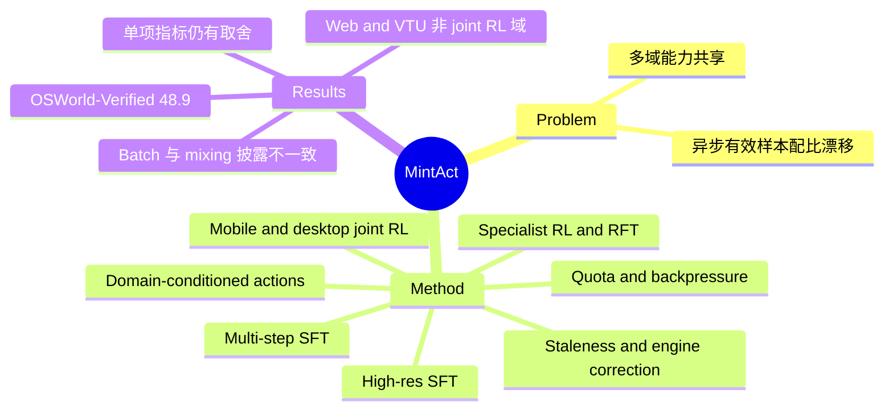

## Summary

MintAct 用一套参数覆盖 UI grounding、mobile/desktop/web navigation 和 visual tool use，训练路线是分阶段 SFT、per-domain RL specialist 的 rejection-sampling distillation，再做 joint asynchronous RL [C1–C2]。统一的是最终模型能力；实际 joint RL 仅包含 mobile 与 desktop，不能概括为四域端到端联合 RL [C3]。作者报告 MintAct-8B 在 OSWorld-Verified 达到 48.9，但 AndroidWorld 与 Online-Mind2Web 均非主表最优；较有参考价值的是异步训练中的有效样本配比控制，以及统一模型仍存在的逐域取舍 [C4, C7–C9, C11]。

## Problem & Motivation

同一个数字助手需要定位 UI 元素、连续操作多个界面，也需要根据图像调用外部工具；分别维护 grounding、mobile、desktop、web 和 tool-use specialist 会增加部署负担。训练上的困难来自各域不同的动作接口、环境延迟与反馈质量：直接混合 action vocabulary 会加重任务歧义，直接消费异步 rollout 又会让执行快、较容易产生有效 GRPO group 的域占据更多更新。

因此，论文的研究问题是如何在一个模型里保留多域能力，并明确控制真正进入优化器的数据分布。跨域权重共享与全域联合在线优化是两个不同问题，本工作完成的范围必须分开读 [C1, C3–C4]。

## Method

### 模型统一与训练阶段

MintAct 基于 Qwen3-VL-Instruct，提供 2B、4B、8B 三个规模。UI 域输入原始 screenshot，动作以统一尺度的坐标定位，不使用 DOM 或 accessibility tree 作为模型观测；各平台可用动作由 domain-specific system prompt 提供。Visual tool use 采用结构化 function calling，动态发现工具。因此，共享的是模型参数与视觉表示，不是要求各域拥有完全相同的动作集合 [C1]。

训练分为以下阶段 [C2–C3]：

1. High-resolution single-step SFT：用 grounding 与单步导航数据建立视觉定位能力
2. Low-resolution multi-step SFT：在 mobile、desktop、web、VTU 的完整轨迹上训练；四域各占 25%，降低截图分辨率以容纳历史
3. Specialist RL → RFT：从 SFT 模型分别训练 per-domain RL specialist，以 VLM judge 筛选成功轨迹，再用标准监督目标蒸馏回单模型；RFT 仍采用四域等比例混合
4. Joint RL：仅在 mobile 与 desktop 上继续在线优化；web、VTU 的能力已通过前面阶段进入参数，后续变化属于该训练设置下的跨域迁移，不能据此声称它们参与了 joint RL

环境分别基于 AndroidWorld、OSWorld、Weblica 与 MM-ToolSandBox。Web 使用本地 cache/replay 与合成站点，避免把实时网络的不稳定性直接带入训练；这不等于所有 web 结果都来自 live-web 训练。VTU 的动态 tool registry 会改变 prompt prefix，SFT 为此按 registry 变化切分轨迹并对重叠动作做 loss masking；作者在 §6 承认其 RL 分段方式仍是整段交互的近似，credit assignment 较粗。

### 异步 RL：约束有效训练分布

Rollouter、环境池、消息队列、trainer 与 parameter synchronizer 解耦。完整多模态轨迹以 append-only history 生成；队列传递图像引用并在训练时按需加载，有限队列与周期参数同步限制样本陈旧程度。该结构说明如何减少互相等待，论文未给出逐组件吞吐消融，不能把每项工程设计分别解释为已量化的加速来源。

训练先排除全成功或全失败的 trajectory group，再形成有效 batch。域贡献因此取决于 rollout 吞吐与 mixed-outcome group 产生率的共同作用，而不只取决于 task sampler 的输入比例。Trainer 按 per-domain quota 接收 group，producer 根据累计接收量除以 quota 后的进度施加 backpressure；某域长时间无法提供有效 group 时，fallback 会放宽配额，让其他域填满 batch [C4]。配比控制存在进度保障例外，不能理解为每次更新都严格守恒。

优化目标把 policy staleness 与 rollout/trainer engine mismatch 分开处理：前者用 dual-clipped surrogate，后者用 truncated importance weighting；检测到的环境故障轨迹会被 mask，避免假阴性直接进入 group statistics 与 policy loss [C5]。这些是作者给出的机制设计；文中主消融集中于训练阶段与数据域，没有把 quota、backpressure、dual-clip、importance weighting 分别移除后比较的结果。

## Key Results

下表保留 MintAct-8B-Final 最相关的在线结果，数值均按论文 Table 3 报告；不同 benchmark 的分数不作横向平均。§4.1 声明 online navigation 最多 30 steps、VTU 最多 100 steps，并使用各 benchmark 的官方指标 [C6]。

| Benchmark | MintAct-8B-Final | 论文所列参照 | 应如何理解 |
|:--|--:|:--|:--|
| OSWorld-Verified | 48.9 | Qwen3-VL-8B 33.9；EvoCUA-8B 46.1 | 在此主表所列同规模模型中领先，不能扩张为不限制规模、预算、时间的 SOTA [C7] |
| AndroidWorld | 67.0 | MAI-UI-8B 70.7 | 统一模型并未逐 benchmark 超过 specialist [C8] |
| Weblica | 74.7 | WEBLICA-8B 70.6 | 属于 Weblica 评测，不能直接当作真实网站成功率 [C9] |
| Online-Mind2Web | 39.1 | WEBLICA-8B 39.2 | 与表中 web specialist 接近；微小差距不构成显著性结论 [C9] |
| MM-ToolSandBox | 24.5 | Qwen3-VL-8B 3.1 | 提高 VTU 能力，但该分数不代表 GUI 与 API 在同一任务内自动切换的能力 [C10] |

这些比较的可比性以论文披露为限：§4.1 给出统一的预算声明，但 Table 3 未逐行说明外部 baseline 是否全部在相同 checkpoint、环境版本、harness、seed 与预算下重跑，也未报告这些分数的置信区间。由此可以记录表内排序，不能把每一项差异归因于 unified training。

更直接的阶段比较来自 Table 6：MintAct-8B 从 RFT 到 Final，OSWorld-Verified 由 43.1 升到 48.9，而 AndroidWorld 从 68.1 降到 67.0 [C11]。这说明 joint RL 的收益并不逐域单调；“不损失 specialist 能力”适合作为作者的总体描述，不是每项指标成立的严格结论。

训练与评测的 verifier 也要区分。§3.4.2 的在线 reward 是 strong VLM 根据 goal 与完整 trajectory 给出的二值判断，训练阶段还会屏蔽检测出的环境异常；§4.1 的评测描述仅声明遵循官方指标。§3.2.4 中 VTU 的数据筛选同时使用 rubric judge 与 entity-state checks，并不能据此推定所有 GUI 训练奖励都是程序化验证，也不能据此补出未披露的 benchmark evaluator 细节。

## Evidence Ledger

来源为 [arXiv v1 全文](https://arxiv.org/html/2609.22083v1) 与对应 PDF。全部 12 条高风险 claim 已由独立 verifier 核对原文；source-verified 仅表示原文一致性，这些数字与机制均为论文报告，不代表独立复现。Evidence excerpt 只保留最短定位片段，完整含义见 Claim 与 locator。

| Claim ID | Claim | Type | Source locator | Evidence excerpt | Status |
|:--|:--|:--|:--|:--|:--|
| C1 | 单套模型参数覆盖各域能力，由 domain prompt 选择动作集 | causal-mechanism | §3.1 Unified design；Table 1；Appendix D | single set | source-verified |
| C2 | 分阶段 SFT、specialist RL→RFT、joint RL；multi-step SFT 与 RFT 四域等比例 | benchmark-setting | §3.3.1–3.3.3；Figure 2；Table A | 25%:25%:25%:25% | source-verified |
| C3 | 实际 joint RL 仅含 mobile 与 desktop，全四域联合 RL 留待后续 | benchmark-setting | §3.4.3；§6 Scaling joint RL | mobile and desktop | source-verified |
| C4 | 在有效 group 消费端施加 quota，并用 backpressure 与有界等待 fallback 调节生成 | causal-mechanism | §3.4.2 Dynamic group filtering；§3.4.3；Table 2 | consumption rather than production | source-verified |
| C5 | staleness 与 engine mismatch 分别用 dual-clip、truncated importance weights，环境故障轨迹被 mask | causal-mechanism | §3.4.2；Eq. 3.4–3.7 | staleness gap | source-verified |
| C6 | online navigation / VTU 的 max steps 为 30 / 100，报告官方指标 | benchmark-setting | §4.1 | 30 and 100 | source-verified |
| C7 | OSWorld-Verified：MintAct-8B 48.9，Qwen3-VL-8B 33.9，EvoCUA-8B 46.1 | comparison | Table 3；§4.2 | 48.9 | source-verified |
| C8 | AndroidWorld：MintAct-8B 67.0，低于 MAI-UI-8B 70.7 | comparison | Table 3 | 67.0; 70.7 | source-verified |
| C9 | Weblica / Om2W：MintAct-8B 74.7 / 39.1，WEBLICA-8B 70.6 / 39.2 | comparison | Table 3 | 74.7; 39.1 | source-verified |
| C10 | MM-ToolSandBox：MintAct-8B 24.5，Qwen3-VL-8B 3.1 | comparison | Table 3 | 24.5 | source-verified |
| C11 | 8B RFT→Final：OSWorld 43.1→48.9，AndroidWorld 68.1→67.0 | comparison | Table 6；§4.3 | 43.1; 48.9 | source-verified |
| C12 | 正文与 Table B 的 joint RL 配置存在表面不一致；Table B 未明确 batch 单位或对应实验 | benchmark-setting | §3.4.3 Per-domain quota；Table B；Appendix C | 64; 48 | source-verified |

## Strengths & Weaknesses

论文较有价值的设计是把 unified model 的动作接口与 heterogeneous RL 的消费分布分开控制。前者用 domain prompt 避免强行合并 action space，后者在 mixed-outcome filtering 之后控制有效样本，直接针对训练系统会改变实际数据配比的问题 [C1, C4]。分阶段训练与同起点的 specialist ablation 也比只列一个总分更有助于研究跨域取舍。

证据边界有以下几处：

- 全域共享参数已经实现，joint RL 的证据仍限 mobile+desktop；§6 还把 navigation 与 tool use 的按需自动切换列为未完成方向。不能把多能力 checkpoint 当成已验证的 hybrid GUI/API policy [C3]
- Joint RL 配方存在表面上的报告不一致：§3.4.3 写每次更新 64 个 group、两域 quota 各 32；Appendix Table B 写 mini-batch 48、mobile/desktop 目标比例 25%/75%。Table B 没有明确 mini-batch 的计量单位，也未解释两处配置分别对应哪些实验；不能直接把 64 与 48 当成同单位比较，或自行选择一处作为实际复现设置 [C12]
- 最终模型在 AndroidWorld 落后主表 mobile specialist，且 RFT→Final 的 AndroidWorld 出现下降。统一能力的收益需要按域报告，平均指标会隐藏代价 [C8, C11]
- VLM reward、动态工具分段和持续累加 screenshot 都引入额外边界。作者明确承认 context growth 与 tool-use credit assignment 问题；论文未提供足以量化 judge false-positive、false-negative 或 reward hacking 的专门审计
- 异步系统给出结构与稳定性手段，但未提供 matched synchronous baseline 的系统吞吐对照，也未逐组件消融，尚不能分离系统收益、数据收益与额外训练计算的贡献
- Appendix A 的 synthetic evaluation 使用 capability-group holdout，但与训练共享 judge。它能测量合成环境内的留出泛化，不能独自排除 judge 偏好；真实环境迁移仍应单独看相应 benchmark

## Mind Map

## Notes

- 阅读版本：arXiv v1，提交日期为 2026-09-18；PDF 首页署日期为 2026-09-17，frontmatter 采用 arXiv 提交日期
- 与 [[2606-AsyncWebRL]] 对照：重点比较异步 off-policy correction 的分解与有效轨迹消费；MintAct 在此基础上增加跨域分布控制问题，不能仅因同用异步框架就假定吞吐收益相同
- 与 [[2509-ScaleCUA]] 对照：区分跨平台数据/模型覆盖与跨平台 online RL，避免把“跨平台”作为单一能力标签
- 后续最小实验：固定总环境交互与优化步数，比较单域、mobile+desktop、再加入 web/VTU 的 joint RL；同时报告各域有效 group 接收比例、fallback 频率、judge 与程序化 evaluator 分歧，检验性能变化究竟来自迁移还是资源重新分配
