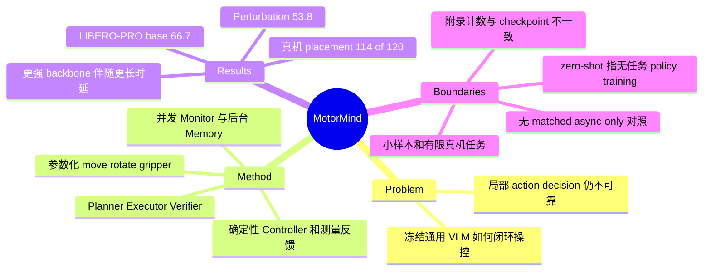

## Summary

MotorMind 用冻结的通用 VLM 提出带距离、角度参数的 mid-level actions，由确定性 Controller 落地，配合并发 Monitor、后台 Memory 与执行后 Verifier，完成无目标任务 policy training 的闭环 manipulation。作者报告 Qwen3.8-Flash-Next 在 LIBERO-PRO 三个 base suites 上平均成功率 66.7%、四类扰动下 53.8%，其评测中的 zero-shot baseline 最好为 13.3% / 19.2%。真实 xArm6 的 95% 来自 120 次 direct / human-perturbation placement trials，另有 20 次 semantic trials；这些结果支持这一系统接口的可行性，但尚不能把收益单独归因于 mid-level representation 或 asynchronous scheduling。

## Problem & Motivation

通用 VLM 能解释场景与指令，但如何把这些能力转成可修正的物理操作仍是问题。VLA 通过机器人动作数据学习控制接口；code-based agent、VLA orchestration 和显式 perception pipeline 则把部分决策交给外部组件。MotorMind 研究通用 VLM 能否在一个较小的动作接口上承担更多局部决策，并根据执行反馈持续修正。

作者先诊断 action selection、progress assessment、subgoal completion 三种局部能力，再提出 harness。诊断并不是完整机器人 rollout，也没有证明某种 action abstraction 导致错误；它只提供设计动机。需要判断的是这套闭环系统在多大任务范围、多少额外工程与推理成本下有效。

## Method

### Zero-shot 的具体边界

本文的 zero-shot 是冻结通用 VLM，不用 LIBERO demonstrations 训练 MotorMind policy、不做 task-specific policy fine-tuning、不加 learned task-specific action model（C1）。这不排除通用预训练、手写 prompts、几何转换、机器人状态反馈或 embodiment-specific controller。局部诊断集使用 LIBERO expert demonstrations 构题，与 MotorMind 的 policy training 是不同用途，不能把论文概括成“从未使用机器人 demonstrations”。

同一 VLM 分别接收角色化 prompts；默认 backbone 为 Qwen3.8-Flash-Next。诊断表中更强模型是 GPT-6 Astra，closed-loop backbone sensitivity 用的是 GPT-6 Sol (Medium Reasoning)，两者不可混写。

### Mid-level action 与 grounding

Executor 提议短 action batch，核心类型是 move、rotate、gripper。平移用 base-frame 方向或轴及毫米距离，旋转用方向或轴及角度，夹爪执行 open / close，可附 width；辅助动作包括 wait 和 home。Controller 负责 schema 检查、参数转换、物理执行，并反馈实际运动和夹爪结果。模型发出 done 只触发 outcome assessment，不等于任务已成功。

没有 SAM 等独立 grounding model，并不等于没有 grounding pipeline：VLM 输出 image-space bounding boxes，兼容的固定相机视角用于 triangulation，wrist view 可进一步修正；target offsets、uncertainty、view disagreement 被转换到动作使用的 base-frame vocabulary（C3）。Executor 同时得到 tool pose、gripper opening / holding state、上次观测以来的实际运动、可用 clearance 信息及短期历史。

### 五个角色与执行权限

| 组件 | 输入与职责 | 输出权限 |
|:--|:--|:--|
| Planner | 指令、当前证据；分解或修改尚未完成的 subgoals | subgoal、目标描述、success criterion |
| Executor | 当前 subgoal、图像、测量状态、近期动作历史 | 短 action batch 和参数 |
| Monitor | 执行期间的新观测与当前 criterion | alert 或停止请求，不生成替代动作 |
| Verifier | 执行前后观测、测量证据、Monitor alert | advance / retry / replan 所需的判断 |
| Memory | 执行日志和已经评估的结果 | 给后续 planning / verification 的摘要 |
| Controller | Executor command | 校验、运动转换、执行和测量反馈 |

前五项复用同一通用 VLM，Controller 为确定性执行层（C2）。已测得的失去抓取或 release 等结果可先于模型 verdict 决定一次 attempt 的结果；计划全部完成后还需要 task-level completion check。

### Asynchrony 的范围

observe → propose → execute → assess 的主决策链仍然顺序执行。并发的是执行中的 monitoring，以及 assessment 后的 memory summarization。STOP 等到下一 action boundary 才取消剩余 commands，不是任意时刻即时急停；中断只要求重新评估，不直接宣判成功或失败（C4）。

结束 attempt 后的迟到 Monitor 响应会被丢弃，避免旧 alert 干扰新 subgoal。Planner / Verifier 使用最新已完成的 memory note，不等待刚发出的 summary；这降低阻塞，但也意味着最新证据未必已经进入 memory。系统的可靠性仍依赖测量反馈、局部历史与结果核验共同工作。

## Key Results

> 以下为作者 v1 全文报告和注明的算术重算，已完成独立原文一致性核查；不表示独立复现。全文来源：[arXiv HTML](https://arxiv.org/html/2609.38078v1)。

### 1. 局部能力诊断

240 道 image-conditioned questions，三种能力各 80 题。Codex 使用 expert trajectory 和构题时的 privileged state 辅助生成问题与标签，再由 human expert review；评测模型只看指定图像、subgoal 与 criterion（C5）。Action label 只要求 prioritized primitive，不要求距离、角度或可执行完整控制。

| Model | Action | Progress | Completion | 平均 query latency |
|:--|--:|--:|--:|--:|
| Qwen3.8-Flash-Next-FP8 | 36.25% | 55.00% | 65.00% | 276 ms |
| GPT-6 Astra | 60.00% | 76.25% | 82.50% | 8,724 ms |

所有评测模型的 action selection 都最弱，但三类题的答案空间不同，不能从正确率直接得出等尺度的“内在能力难度”排序；也不能据此认定反复 verification 会消除错误（C6）。

### 2. LIBERO-PRO 主实验

主表包含 Goal、Spatial、Object 三个 suites；perturbations 为 Semantic（附录称 Language）、Object、Position Swap、Task。成功由环境 predicate 判断。作者按底层 action policy 是否使用目标任务 fine-tuning 分组，而不是只看 agent 上层是否冻结；带 fine-tuned VLA 的 zero-shot agent 仍在 fine-tuned-policy 组。

| 配置 | Base SR | Perturbed SR | Base / Perturbed mean wall time |
|:--|--:|--:|:--|
| MotorMind，Qwen3.8-Flash-Next | 66.7% | 53.8% | 223.4 / 248.5 s |
| CaP-X，10 loops | 13.3% | 19.2% | 346.4 / 320.4 s |
| π0.5，fine-tuned policy | 98.3% | 63.3% | 5.9 / 6.8 s |
| MolmoAct2，fine-tuned policy | 100.0% | 62.9% | 6.6 / 7.7 s |
| OpenVLA / OFT，fine-tuned policy | 98.3% | 51.2% | 5.7 / 6.7 s |

MotorMind 的 base Goal / Spatial / Object 为 45.0 / 75.0 / 80.0%；四类扰动分别为 58.3 / 46.7 / 51.7 / 58.3%（C7）。CaP-X 的 13.3% / 19.2% 是本文评测 zero-shot group 的最好结果，不是整个 robotics 领域的 universal SOTA（C8）。相对 fine-tuned OpenVLA/OFT 的扰动优势只是 2.6 percentage points，且执行慢得多；fine-tuned π0.5 和 MolmoAct2 的平均扰动 SR 仍更高（C10）。

TimeScore = 60 × success percentage / mean episode seconds，单位 pp/min。MotorMind 的 17.91 / 12.99 只概括成功率与 wall time 的关系，不测量 GPU 资源、token 或费用；很快失败的策略也不能称为高效完成任务（C9）。

评测计数与 checkpoint 有未解决的文档问题：正文说扰动结果来自 240 episodes（C11）；Appendix D.1 先写三个 task families、每族 10 tasks，却又写 4 × 5 × 10 = 200 configurations（40 base + 160 perturbed）。因此不能据附录无保留复述总配置数或推定 seed 分配（C12）。D.2 又说所有 π0.5 配置使用同一 OpenPI libero_base checkpoint，与主表分列的 fine-tuned / zero-shot π0.5 无法清晰对应（C13）。另外，raw MolmoAct2 虽无新训练，仍使用 LIBERO-derived normalization / robot metadata；GR00T 的 adapted checkpoint 只在 Spatial post-train 后横跨各族使用。这些配置会影响对 zero-shot gap 的解读。

### 3. 执行中变化的 stress tests

| Task group | 任务数 | MotorMind | 该组最强 baseline |
|:--|--:|--:|--:|
| Dynamic Reasoning | 10 | 70% | 30%（CaP-X） |
| Scene Shift | 10 | 90% | 70%（π0.5） |
| Dynamic Manipulation | 5 | 80% | 40%（MolmoAct2） |
| Prompt Shift | 5 | 60% | 60%（CaP-X） |

总共 30 个任务，作者明确定位为 stress tests；表中给出 task 数，不能把它们当作足量多 seed 统计证据（C14–C15）。动态环境在 planning / inference 期间按 elapsed wall time 以 20 Hz 继续推进；conveyor 选定速度 1.5 mm/s、episode wall-clock budget 为 600 s，所以慢推理并不免费冻结场景（C16）。

Prompt Shift 有一个重要 metric boundary：涉及 stove 的任务只检查最终放置前炉子曾打开，未独立确认指令要求的 intermediate table placement 或终止时保持开启。该任务的 reported success 因而不等于所有指令 clauses 均完成（C22）。

### 4. Real xArm6 的分母

RealSense D455 提供观测，standard xArm6 SDK 执行动作；不额外收集目标任务 demonstrations 或 fine-tune policy。Direct Perception 与 Human Perturbation 都是三个物体（blue cube、corn、battery）放进两个容器（bowl、box），每个 object–destination pair 在每种 setting 下 10 trials，位置随机化。

| Setting | Trials | 成功次数（按 Table 6 重算） | SR |
|:--|--:|--:|--:|
| Direct Perception | 60 | 59 | 98.3%（正文约写 98%） |
| Human Perturbation | 60 | 55 | 91.7%（正文约写 92%） |
| 两组 pooled | 120 | 114 | 95.0% |
| Semantic Understanding，另行评测 | 20 | 17 | 85.0% |

Semantic Understanding 是四项任务、每项五次，单项 80 / 100 / 100 / 60%，不包含在上述 95% 内（C17–C18）。真实实验没有提供同台 baseline 对照；它支持小范围 tabletop placement 与部分干扰恢复的可行性，不能推出普遍 manipulation 可靠性。

### 5. Backbone、组件和时间预算

Fig.4 左侧 backbone experiment 明确使用 single seed：Qwen 的 Spatial / Object / Goal 为 70 / 80 / 50%，换 GPT-6 Sol 后为 80 / 100 / 70%，均值 66.7 → 83.3%。这组 Qwen 分项不同于主表，不能把两处均值相同误认成同一批 episodes；Spatial wall time 从 199.0 增至 370.4 s（C19）。

组件 ablation 中 full system 为 66.7%，移除 replanning 后 36.7%，移除 verifier 后 60.0%，移除 planner 后 0.0%（C20）。这些结果说明当前系统对 planning / recovery 的依赖，但 removal 同时改变了执行结构和可用信息，不能直接等同于各模块的普遍因果贡献。

Appendix F 的 300 / 450 s budget 都为 66.7%，对应 mean wall time 159.8 / 210.0 s；900 / 3,600 s budget 为 50.0 / 60.0%。作者报告更长预算未带来单调收益，但这张表没有足够的重复试验与不确定性报告来断言长预算本身损害控制（C21）。

## Evidence Ledger

25 条高风险 claim 已由独立 verifier 核对原文；表中数字与意译为定位线索。除明确标注为算术重算的行外，均指作者报告，不是独立复现。表格和图号统一按 HTML 版本；作者项目 PDF 的编号部分不同。主源均为 [arXiv v1 全文](https://arxiv.org/html/2609.38078v1)，C25 为作者项目主页。

| Claim ID | Claim | Type | Source locator | Evidence excerpt | Status |
|:--|:--|:--|:--|:--|:--|
| C1 | zero-shot 指冻结 VLM，无 LIBERO policy demonstrations / fine-tuning | benchmark-setting | §3.1；§4.1 | “no LIBERO demonstrations”；其余见正文定义 | source-verified |
| C2 | 同一 VLM 的五角色 + deterministic Controller | causal-mechanism | §3.3；Fig.3 | 意译：角色共用模型，动作由 Controller 执行 | source-verified |
| C3 | VLM bbox + triangulation + wrist refinement | causal-mechanism | Appendix C.2 | 意译：目标框、多视角几何、状态反馈共同 grounding | source-verified |
| C4 | 主链顺序，monitor/memory 并发，action boundary 才取消 | causal-mechanism | §3.4 | “next action boundary” | source-verified |
| C5 | 240 题、每类 80；expert trajectories 构题并人工复核 | benchmark-setting | §2；Appendix B.1–B.2；Table 8 | 数值：240 = 80 + 80 + 80 | source-verified |
| C6 | Qwen / Astra 诊断正确率和延迟 | number | Table 2 | 36.25/55/65；60/76.25/82.5；276/8724 ms | source-verified |
| C7 | MotorMind 主表分项及均值 | number | Table 3 | 45/75/80→66.7；58.3/46.7/51.7/58.3→53.8 | source-verified |
| C8 | 受评 zero-shot baseline 最好 13.3/19.2 | comparison | Table 3，CaP-X iterative rows | 数值：13.3/19.2% | source-verified |
| C9 | 223.4/248.5 s；17.91/12.99 pp/min，非算力成本 | number | §4.1 Metrics；Table 3 | 数值与定义：60s/T，s 用百分数 | source-verified |
| C10 | 三个 fine-tuned VLA 的 SR / wall time | comparison | Table 3 | π0.5 98.3/63.3；Molmo 100/62.9；OFT 98.3/51.2 | source-verified |
| C11 | 正文宣称 240 perturbed episodes | benchmark-setting | §4.1 Experiment Results | 数值：240 | source-verified |
| C12 | 附录三个 families 与 4×5×10 计数不一致 | benchmark-setting | Appendix D.1 | 数值：3 families；4×5×10=200 | source-verified |
| C13 | π0.5 checkpoint 说明无法区分 FT/ZS 两行 | benchmark-setting | Appendix D.2；Table 3 | 意译：附录称所有配置同用 libero_base | source-verified |
| C14 | Adaptive 10/10/5/5，共30个任务 | benchmark-setting | Table 5；Appendix E，Table 12 | “stress tests”；数值：30 | source-verified |
| C15 | Adaptive SR 70/90/80/60，Prompt Shift 持平 | comparison | Table 5 | MotorMind：70/90/80/60；best baseline：30/70/40/60 | source-verified |
| C16 | 动态场景在推理时推进，20 Hz / 600 s / 1.5 mm/s | benchmark-setting | Appendix E.1–E.2 | 数值：20 Hz；600 s；1.5 mm/s | source-verified |
| C17 | 真机 direct+human：120 trials、114成功、95% | number | §5 trial-count paragraph；Table 6 | 原表和次数说明；114/120 为重算 | source-verified |
| C18 | Semantic 4×5 trials；17/20=85%，另计 | number | §5 Results；Table 6 right | 数值：80/100/100/60；17/20 为重算 | source-verified |
| C19 | backbone 单 seed 66.7→83.3%，Spatial 199→370.4 s | comparison | Fig.4 caption；§6 Backbone Sensitivity | 数值：66.7/83.3；199.0/370.4 | source-verified |
| C20 | 去 replan/verifier/planner：36.7/60/0% | number | §6 Ablation Study；Fig.4 | 数值：full 66.7；ablations 36.7/60.0/0.0 | source-verified |
| C21 | 预算扩大时 SR 不单调增加 | number | Appendix F；Table 17 | 300/450/900/3600 s→66.7/66.7/50/60% | source-verified |
| C22 | stove metric 不覆盖全部指令要求 | benchmark-setting | Appendix E.2 Success criteria | “does not independently verify” | source-verified |
| C23 | 失败归因为 grounding / false completion；缺逐类 backbone 因果对照 | causal-mechanism | §6；Fig.5；Appendix G | 意译：报告失败类别，未给强弱模型逐类受控比较 | source-verified |
| C24 | 没有与同期 Show-Harness 做直接实验比较 | comparison | Appendix A.3 | “rather than providing a direct experimental comparison” | source-verified |
| C25 | 项目主页提供代码链接，未确认 license/完整复现性 | license-code | [项目主页](https://motor-mind.github.io)，Code 按钮 | 链接目标：Motor-Mind/MotorMind-Code | source-verified |

## Strengths & Weaknesses

### 有参考价值的部分

- 把“意图动作”和“实际完成的动作”分开。Measured feedback、completion criterion 和 task predicate 避免直接把 VLM 的 done 当成功；late Monitor responses 的隔离也处理了真实并发系统会遇到的 stale evidence 问题
- Zero-shot 的实质收益在于省去目标任务 policy training，并能直接替换通用 backbone。真实部署和 simulation 共用 VLM-facing interface，说明这种接口值得继续做跨本体验证
- 动态测试让 inference latency 消耗真实场景时间，较能暴露 reasoning quality 与 reaction frequency 的冲突。小样本限制存在，但 protocol 本身有用

### 证据不足与可比性边界

1. **系统有效不等于机制已被隔离。** Direct VLA 与 MotorMind 同时改变 backbone、训练数据、action representation、观测接口、planning、feedback 与预算；VoLo 与 MotorMind 也不是只差是否 asynchronous。现有对比不能证明 mid-level action 或 asynchronous scheduling 单独带来多少提升。最直接的 matched control 是同 backbone、同 prompts、同 action batches、同 controller 下，仅把 Monitor / Memory 调成 blocking
2. **基线与评测记录需澄清。** Appendix D 的 family count 和 π0.5 checkpoint 对应关系不一致，初始化 seeds、主表配置总数也不能从现有说明无歧义恢复。主表多项 zero-shot VLA 接近零，且有 embodiment-transfer / normalization 差异，需要先确认适配接口，再解释为模型能力差距
3. **小规模真机实验和缺少不确定性。** 真机主要是三物体、两容器的 placement；95% 的分母不是任意新任务。Adaptive tasks 数量少，backbone sensitivity 明确 single seed，论文表格未给出这些对比的 confidence intervals；2.6 pp 等小差值不支持显著优越的表述
4. **简化 learned modules 后仍有工程依赖。** 多视角定位、frame conversion、grasp-state 测量、clearance、controller validation 和 SDK 都是系统的一部分。Monitor 在边界停止也不是硬实时安全机制，论文没有据此建立接触风险或全臂碰撞安全保证
5. **更强模型减少哪种错误尚不清楚。** 作者把主要失败归为 visual grounding、premature completion 等（C23）；backbone success 提升支持整体效果，却没有提供逐错误类、相同任务与时延条件下的对照。不能从 pooled failure analysis 推出未来模型升级必然消除某类瓶颈

评分 4：与 VLM、Embodied AI 和 agent harness 方向直接相关，接口设计值得仔细借鉴；保留它的系统结果，也保留当前评测文档与因果归因的不足。

## Mind Map

## Notes

- 与 [[2609-ShowHarness]] 同属 VLM-facing manipulation interface。MotorMind 原文只给方法对比，未跑直接 baseline（C24）；本笔记不跨论文比较 success rate
- [[2307-VoxPoser]] 可作为另一种 control representation 的对照：下次比较应保持任务、观测和 backbone 一致，区分表示能力与外部 perception/controller 的贡献
- 最小后续实验：固定 observation stream、controller、backbone 和 token budget，做 synchronous / concurrent Monitor 对照，并记录 alert freshness、取消后未执行动作数、false-stop、missed-stop、SR 与 wall time。这样才能检验 asynchronous design 的实际贡献
- [作者项目主页](https://motor-mind.github.io) 有 real-robot 视频与代码入口。本文仅确认主页链接，不把链接存在当作实现已审计、license 已核查或结果已复现
